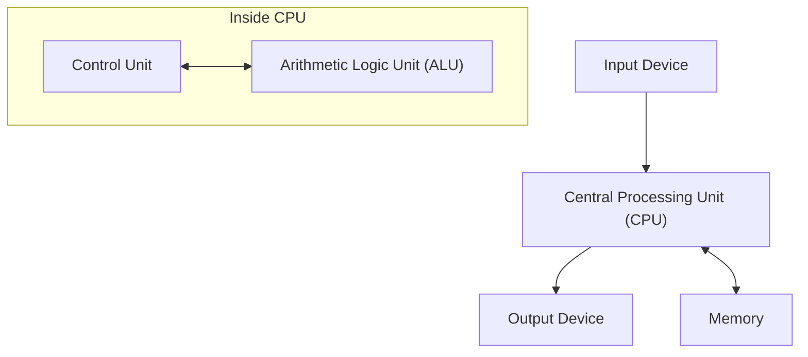

## 1. Introduction

John von Neumann (1903–1957) was a genius mathematician who represented the 20th century and had an immeasurable impact on all fields of modern science. His achievements went far beyond pure mathematics, extending to quantum mechanics, game theory, computer science, economics, meteorology, and even the development of the atomic bomb. Because of his extraordinary calculation ability and logical thinking, his contemporaries feared and respected him, calling him the "Demonic Brain" and a "Martian".

This article will explain in detail the life of von Neumann, his tremendous achievements, and the numerous anecdotes he left behind. Let us deeply explore what kind of thinking he had and how he built the foundations of modern society. Tracing his footsteps is nothing less than tracing the history of the development of modern science itself.

## 2. Birth of a Prodigy: Childhood in Budapest

John von Neumann (Hungarian name: Neumann János Lajos) was born in 1903 in Budapest, Hungary, into a wealthy Jewish banker's family. From a young age, he showed extraordinary memory and calculation ability, truly displaying talents worthy of being called a **prodigy**. It is said that he could perform eight-digit division in his head at age 6, and mastered calculus by age 8. He was also highly proficient in languages, learning Greek and Latin from a young age, and would even exchange jokes in classical Greek with his father.

At the time, Budapest was a global center of culture and scholarship, producing many brilliant Jewish scientists. Eugene Wigner, Leo Szilard, Edward Teller, and other scientists who later became active in the United States were all from Budapest like von Neumann, and because of their unique talents, they were collectively called the **Martians**. Von Neumann grew up in this excellent intellectual environment, reaching a level where he was already publishing mathematical papers in high school.

## 3. Contributions to the Foundations of Mathematics: Axiomatic Set Theory

One of von Neumann's most important early achievements was his research on the axiomatization of set theory. Set theory, founded by [Georg Cantor](https://kenji.blog/en/p/cantor/), was expected to be the foundation of mathematics, but it faced logical contradictions (paradoxes) such as Russell's paradox. To solve this problem, Ernst Zermelo, Adolf Fraenkel, and others were constructing axiomatic set theory, but von Neumann took a different approach.

He introduced the concept of "classes" and brilliantly avoided the paradoxes by strictly distinguishing between normal sets and classes that are too large to be sets (proper classes). This system was later improved by Paul Bernays and [Kurt Gödel](https://kenji.blog/en/p/godel/), and is now known as the **von Neumann–Bernays–Gödel set theory** (NBG set theory).

$$
\forall X \ ( X \in V \iff \exists Y \ (X \in Y) )
$$

Here, $V$ represents the **class of all sets** ( $\text{universal class}$ ). This foundational research became an important contribution supporting the roots of mathematics.

## 4. Mathematical Foundations of Quantum Mechanics

In the late 1920s, quantum mechanics was developing as two seemingly completely different theories: Werner Heisenberg's "matrix mechanics" and Erwin Schrödinger's "wave mechanics". Von Neumann proved that these two theories were mathematically equivalent, giving quantum mechanics a strict mathematical foundation.

Using the theory of **[Hilbert](https://kenji.blog/en/p/hilbert/) space**, he formulated physical quantities (observables) as self-adjoint operators on an infinite-dimensional [Hilbert](https://kenji.blog/en/p/hilbert/) space. His book "Mathematical Foundations of Quantum Mechanics," published in 1932, is considered a bible even for modern physicists and is still highly regarded today as a standard textbook for quantum mechanics.

He also introduced the concept of the **density matrix** ( $\text{density matrix}$ ) to describe mixed states, laying the foundation for quantum statistical mechanics.

$$
\rho = \sum_{i} p_i |\psi_i\rangle \langle\psi_i|
$$

Here, $p_i$ represents the probability ( $\text{probability weight}$ ) of taking the state $|\psi_i\rangle$. He also conducted deep considerations on the "collapse of the wave packet" and the "measurement problem" in quantum measurement theory.

## 5. Game Theory and Economic Behavior

Starting from the analysis of strategies in games such as poker, von Neumann founded an entirely new field of mathematics called "Game Theory." In 1928, he proved the **minimax theorem**, which states that in a two-person zero-sum finite deterministic game with perfect information, if both sides adopt optimal strategies, the result will always settle at a certain outcome.

$$
\max_{x \in X} \min_{y \in Y} f(x, y) = \min_{y \in Y} \max_{x \in X} f(x, y)
$$

The left side of this equation represents the strategy to "minimize the loss in the worst case" ( $\text{maximin strategy}$ ), and the right side represents the strategy to "maximize one's own profit against the opponent's best move."

Later, he co-authored the monumental work "Theory of Games and Economic Behavior" (1944) with economist Oskar Morgenstern, revolutionizing economics. This was an attempt to mathematically model rational human decision-making, and today it is applied in a wide range of fields, not only in economics but also in political science, biology, and military strategy.

## 6. Computer Science and von Neumann Architecture

Almost all modern computers are built based on the **von Neumann architecture** that he devised. He proposed the "stored-program concept," where programs are stored in memory as data and sequentially read and executed.

This architecture consists of the following main elements:

Von Neumann participated in the EDVAC development project at the University of Pennsylvania and summarized this groundbreaking concept in the "First Draft of a Report on the EDVAC." This made it possible to realize a general-purpose computer that can perform various calculations simply by rewriting the software (program) without physically rewiring the hardware. The modern IT society is built upon this foundation he established.

## 7. Cellular [Automata](https://kenji.blog/en/p/automata-formal-language-theory/) and the Theory of Self-Reproducing Machines

In his later years, von Neumann took a strong interest in mathematically modeling the mechanisms of biological self-reproduction. With the advice of his colleague Stanislaw Ulam, he devised the concept of **cellular automata**, in which space is divided into a grid, and each grid cell changes its state according to a certain rule.

Using cells with 29 states, he rigorously proved that a self-reproducing machine (universal constructor) is theoretically possible. This was before the discovery of the double helix structure of DNA, and it can be said that he predicted the genetic mechanisms and information transmission systems of life from the perspective of information science. After his death, this theory led to research in artificial life.

## 8. Manhattan Project and Contributions to Fluid Dynamics

During World War II, von Neumann participated in the "Manhattan Project" for atomic bomb development at the Los Alamos National Laboratory. He played a central role in fluid dynamics and shock wave calculations, performing the complex calculations essential for designing the explosive lenses for the plutonium-type atomic bomb (Fat Man). It is said that without his theory on the interaction of shock waves and his overwhelming calculation ability, the development would have been significantly delayed.

Even after the war, he continued to have strong influence as the top advisor on military and scientific policy for the US government, leading national projects such as the development of ballistic missiles and numerical weather prediction (the world's first computer-based weather forecast).

## 9. The Man Called a "Martian": Extraordinary Anecdotes of a Genius

There are countless anecdotes surrounding von Neumann's superhuman brain.

* **Astounding Calculation Speed**: To verify whether the results calculated by ENIAC (an early electronic computer) were correct, von Neumann performed mental calculations to check them, and legend has it that von Neumann finished calculating faster.
* **Perfect Photographic Memory**: He could memorize the contents of books and telephone directories word for word after reading them once. When asked to "recite the beginning of A Tale of Two Cities" decades later, he reportedly continued reciting it perfectly for tens of minutes until his friend stopped him.
* **Driving and Noise**: He was a very poor driver and frequently caused accidents. There is an anecdote where he made the excuse, "The trees didn't get out of my way." He also preferred noisy environments over silence and conducted complex mathematical research while playing German march music at high volume in his office.
* **Martian Joke**: His fellow physicists joked half-seriously, "Von Neumann is a Martian living on Earth pretending to be human. However, he is capable of perfectly imitating a human."

## 10. Major Books and Papers

The books and papers von Neumann left behind during his lifetime are diverse, but here we introduce representative works that had a particularly significant impact on later generations.

1. **Mathematical Foundations of Quantum Mechanics (1932)**
   A monumental work that strictly formulated quantum mechanics using the theory of [Hilbert](https://kenji.blog/en/p/hilbert/) spaces.
2. **Theory of Games and Economic Behavior (1944)**
   Co-authored with Oskar Morgenstern. A masterpiece that systematically discussed everything from zero-sum games to cooperative games.
3. **The Computer and the Brain (1958)**
   An unfinished manuscript published posthumously. A pioneering work comparing the neural networks of the human brain with the mechanisms of digital computers.
4. **Theory of Self-Reproducing [Automata](https://kenji.blog/en/p/automata-formal-language-theory/) (1966)**
   Compiled and published from von Neumann's posthumous manuscripts by Arthur Burks.

## 11. John von Neumann: Brief Chronology

The following is a detailed timeline summarizing the life and major achievements of John von Neumann.

* **1903**: Born in Budapest, Kingdom of Hungary.
* **1911**: Entered a Lutheran gymnasium.
* **1921**: Entered the University of Budapest, majoring in mathematics. Simultaneously studied chemistry at the University of Berlin and ETH Zurich.
* **1926**: Obtained a Ph.D. in mathematics from the University of Budapest.
* **1928**: Proved the minimax theorem, laying the foundation for game theory.
* **1930**: Moved to the United States as a visiting professor at Princeton University.
* **1932**: Published "Mathematical Foundations of Quantum Mechanics."
* **1933**: Appointed as a lifelong professor at the Institute for Advanced Study in Princeton. Became one of its initial members along with Albert Einstein and others.
* **1937**: Acquired citizenship of the United States of America.
* **1943**: Participated in the Manhattan Project, leading the calculations for explosive lenses.
* **1944**: Published "Theory of Games and Economic Behavior."
* **1945**: Wrote the "First Draft of a Report on the EDVAC," proposing the stored-program concept.
* **1948**: Announced the theory of cellular automata and the concept of self-reproducing machines.
* **1951**: Became president of the American Mathematical Society.
* **1954**: Appointed as a member of the United States Atomic Energy Commission.
* **1955**: Diagnosed with bone cancer (or pancreatic cancer) and entered a battle with the disease.
* **1957**: Died at Walter Reed Army Medical Center in Washington, D.C., at the age of 53.

## 12. Conclusion

John von Neumann passed away in 1957 at the young age of 53 due to cancer. However, the intellectual legacy he left behind still strongly survives today as the foundation of modern mathematics, physics, economics, and information technology. From the smartphones and computers we use every day to cutting-edge artificial intelligence (AI) technology and analytical methods in the social sciences, glimpses of von Neumann's "Demonic Brain" can be seen everywhere. Reflecting on his life makes us realize once again the infinite possibilities of human intellect and the magnitude of its impact on the world. In the history of humanity, no one else has caused fundamental paradigm shifts in such a wide range of fields as he did.

