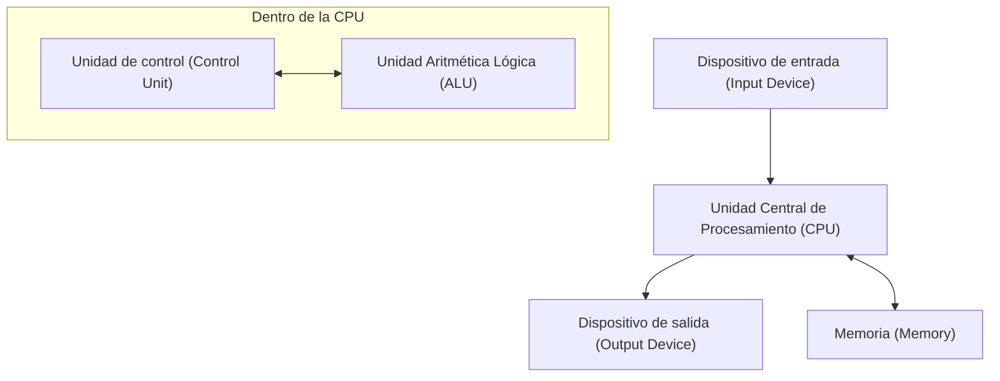

## 1. Introducción

John von Neumann (1903–1957) fue un genio matemático que representó el siglo XX y tuvo un impacto incalculable en todos los campos de la ciencia moderna. Sus logros fueron mucho más allá de las matemáticas puras, extendiéndose a la mecánica cuántica, la teoría de juegos, la informática, la economía, la meteorología e incluso el desarrollo de la bomba atómica. Debido a su extraordinaria capacidad de cálculo y pensamiento lógico, sus contemporáneos le temían y respetaban, llamándolo el "Cerebro Demoníaco" y "Marciano".

Este artículo explicará en detalle la vida de von Neumann, sus tremendos logros y las numerosas anécdotas que dejó atrás. Exploremos profundamente qué tipo de pensamiento tenía y cómo construyó los cimientos de la sociedad moderna. Rastrear sus pasos no es nada menos que rastrear la historia del desarrollo de la ciencia moderna misma.

## 2. Nacimiento de un prodigio: Infancia en Budapest

John von Neumann (nombre húngaro: Neumann János Lajos) nació en 1903 en Budapest, Hungría, en el seno de una rica familia de banqueros judíos. Desde muy joven mostró una memoria y una capacidad de cálculo extraordinarias, exhibiendo verdaderamente talentos dignos de ser llamado un **prodigio**. Se dice que podía realizar divisiones de ocho dígitos mentalmente a los 6 años y dominó el cálculo a los 8 años. También era muy competente en idiomas, aprendiendo griego y latín desde una edad temprana, e incluso intercambiaba bromas en griego clásico con su padre.

En ese momento, Budapest era un centro mundial de cultura y erudición, produciendo muchos científicos judíos brillantes. Eugene Wigner, Leo Szilard, Edward Teller y otros científicos que más tarde se volvieron activos en los Estados Unidos eran todos de Budapest como von Neumann, y debido a sus talentos únicos, fueron llamados colectivamente los **Marcianos** (Martians). Von Neumann creció en este excelente entorno intelectual, alcanzando un nivel en el que ya publicaba artículos matemáticos en la escuela secundaria.

## 3. Contribuciones a los fundamentos de las matemáticas: Teoría axiomática de conjuntos

Uno de los logros iniciales más importantes de von Neumann fue su investigación sobre la axiomatización de la teoría de conjuntos. Se esperaba que la teoría de conjuntos, fundada por [Georg Cantor](https://kenji.blog/es/p/cantor/), fuera la base de las matemáticas, pero se enfrentaba a contradicciones lógicas (paradojas) como la paradoja de Russell. Para resolver este problema, Ernst Zermelo, Adolf Fraenkel y otros estaban construyendo la teoría axiomática de conjuntos, pero von Neumann adoptó un enfoque diferente.

Introdujo el concepto de "clases" y evitó brillantemente las paradojas distinguiendo estrictamente entre conjuntos normales y clases que son demasiado grandes para ser conjuntos (clases propias). Este sistema fue posteriormente mejorado por Paul Bernays y [Kurt Gödel](https://kenji.blog/es/p/godel/), y ahora se conoce como la **teoría de conjuntos de von Neumann-Bernays-Gödel** (teoría de conjuntos NBG).

$$
\forall X \ ( X \in V \iff \exists Y \ (X \in Y) )
$$

Aquí, $V$ representa la **clase de todos los conjuntos** ( $\text{clase universal}$ ). Esta investigación fundamental se convirtió en una importante contribución que apoya las raíces de las matemáticas.

## 4. Fundamentos matemáticos de la mecánica cuántica

A finales de la década de 1920, la mecánica cuántica se estaba desarrollando como dos teorías aparentemente completamente diferentes: la "mecánica matricial" de Werner Heisenberg y la "mecánica ondulatoria" de Erwin Schrödinger. Von Neumann demostró que estas dos teorías eran matemáticamente equivalentes, dotando a la mecánica cuántica de una estricta base matemática.

Usando la teoría del **espacio de [Hilbert](https://kenji.blog/es/p/hilbert/)**, formuló cantidades físicas (observables) como operadores autoadjuntos en un espacio de [Hilbert](https://kenji.blog/es/p/hilbert/) de dimensión infinita. Su libro "Fundamentos matemáticos de la mecánica cuántica", publicado en 1932, es considerado una biblia incluso para los físicos modernos y todavía es muy apreciado en la actualidad como un libro de texto estándar para la mecánica cuántica.

También introdujo el concepto de la **matriz de densidad** ( $\text{matriz de densidad}$ ) para describir estados mixtos, sentando las bases de la mecánica estadística cuántica.

$$
\rho = \sum_{i} p_i |\psi_i\rangle \langle\psi_i|
$$

Aquí, $p_i$ representa la probabilidad ( $\text{peso de probabilidad}$ ) de tomar el estado $|\psi_i\rangle$. También llevó a cabo profundas consideraciones sobre el "colapso del paquete de ondas" y el "problema de la medición" en la teoría de la medición cuántica.

## 5. Teoría de juegos y comportamiento económico

Partiendo del análisis de estrategias en juegos como el póquer, von Neumann fundó un campo de las matemáticas completamente nuevo llamado "Teoría de Juegos". En 1928, demostró el **teorema minimax**, que establece que en un juego finito determinista de suma cero para dos personas con información perfecta, si ambas partes adoptan estrategias óptimas, el resultado siempre se establecerá en un resultado seguro.

$$
\max_{x \in X} \min_{y \in Y} f(x, y) = \min_{y \in Y} \max_{x \in X} f(x, y)
$$

El lado izquierdo de esta ecuación representa la estrategia de "minimizar la pérdida en el peor de los casos" ( $\text{estrategia maximin}$ ), y el lado derecho representa la estrategia de "maximizar el propio beneficio frente al mejor movimiento del oponente".

Más tarde, fue coautor de la monumental obra "Teoría de juegos y comportamiento económico" (1944) con el economista Oskar Morgenstern, revolucionando la economía. Este fue un intento de modelar matemáticamente la toma de decisiones humana racional, y hoy en día se aplica en una amplia gama de campos, no solo en la economía sino también en las ciencias políticas, la biología y la estrategia militar.

## 6. Informática y arquitectura de von Neumann

Casi todas las computadoras modernas se construyen sobre la base de la **arquitectura de von Neumann** que él ideó. Propuso el "concepto de programa almacenado", en el que los programas se almacenan en la memoria como datos y se leen y ejecutan secuencialmente.

Esta arquitectura consta de los siguientes elementos principales:

Von Neumann participó en el proyecto de desarrollo EDVAC en la Universidad de Pensilvania y resumió este concepto revolucionario en el "Primer borrador de un informe sobre el EDVAC". Esto hizo posible crear una computadora de propósito general que puede realizar varios cálculos simplemente reescribiendo el software (programa) sin necesidad de reconfigurar físicamente el hardware. La sociedad de TI moderna se basa en esta base que él estableció.

## 7. Autómatas celulares y la teoría de las máquinas autorreproductivas

En sus últimos años, von Neumann se interesó mucho en modelar matemáticamente los mecanismos de autorreproducción biológica. Con el consejo de su colega Stanislaw Ulam, ideó el concepto de **autómatas celulares**, en el que el espacio se divide en una cuadrícula y cada celda de la cuadrícula cambia de estado de acuerdo con una regla determinada.

Usando celdas con 29 estados, demostró rigurosamente que una máquina autorreproductiva (constructor universal) es teóricamente posible. Esto fue antes del descubrimiento de la estructura de doble hélice del ADN, y se puede decir que predijo los mecanismos genéticos y los sistemas de transmisión de información de la vida desde la perspectiva de la ciencia de la información. Después de su muerte, esta teoría condujo a la investigación en vida artificial.

## 8. El Proyecto Manhattan y contribuciones a la dinámica de fluidos

Durante la Segunda Guerra Mundial, von Neumann participó en el "Proyecto Manhattan" para el desarrollo de la bomba atómica en el Laboratorio Nacional de Los Álamos. Desempeñó un papel central en la dinámica de fluidos y los cálculos de ondas de choque, realizando los complejos cálculos esenciales para diseñar las lentes explosivas de la bomba atómica de tipo plutonio (Fat Man). Se dice que sin su teoría sobre la interacción de las ondas de choque y su abrumadora capacidad de cálculo, el desarrollo se habría retrasado significativamente.

Incluso después de la guerra, continuó teniendo una fuerte influencia como máximo asesor en política militar y científica del gobierno de los Estados Unidos, liderando proyectos nacionales como el desarrollo de misiles balísticos y la predicción meteorológica numérica (el primer pronóstico del tiempo por computadora del mundo).

## 9. El hombre llamado "Marciano": Anécdotas extraordinarias de un genio

Hay innumerables anécdotas en torno al cerebro sobrehumano de von Neumann.

* **Velocidad de cálculo asombrosa**: Para verificar si los resultados calculados por ENIAC (una computadora electrónica temprana) eran correctos, von Neumann realizó cálculos mentales para comprobarlos, y la leyenda dice que von Neumann terminó de calcular más rápido.
* **Memoria fotográfica perfecta**: [Pod](https://kenji.blog/es/p/kubernetes-k8s-architecture-pod-service-ingress/)ía memorizar el contenido de libros y guías telefónicas palabra por palabra después de leerlos una vez. Cuando se le pidió que "recitara el comienzo de Historia de dos ciudades" décadas después, se dice que continuó recitándolo a la perfección durante decenas de minutos hasta que su amigo lo detuvo.
* **Conducción y ruido**: Era un conductor muy malo y con frecuencia causaba accidentes. Hay una anécdota en la que dio la excusa: "Los árboles no se apartaron de mi camino". También prefería los entornos ruidosos al silencio y realizaba complejas investigaciones matemáticas mientras reproducía música de marcha alemana a un volumen alto en su oficina.
* **Chiste marciano**: Sus compañeros físicos bromeaban medio en serio: "Von Neumann es un marciano que vive en la Tierra y finge ser humano. Sin embargo, es capaz de imitar perfectamente a un humano".

## 10. Principales libros y artículos

Los libros y artículos que von Neumann dejó atrás durante su vida son diversos, pero aquí presentamos obras representativas que tuvieron un impacto particularmente significativo en las generaciones posteriores.

1. **Fundamentos matemáticos de la mecánica cuántica (1932)**
   Una obra monumental que formuló estrictamente la mecánica cuántica utilizando la teoría de los espacios de [Hilbert](https://kenji.blog/es/p/hilbert/).
2. **Teoría de juegos y comportamiento económico (1944)**
   Coescrito con Oskar Morgenstern. Una obra maestra que discutió sistemáticamente todo, desde los juegos de suma cero hasta los juegos cooperativos.
3. **La computadora y el cerebro (1958)**
   Un manuscrito inacabado publicado póstumamente. Una obra pionera que compara las redes neuronales del cerebro humano con los mecanismos de las computadoras digitales.
4. **Teoría de los autómatas autorreproductivos (1966)**
   Compilado y publicado a partir de los manuscritos póstumos de von Neumann por Arthur Burks.

## 11. John von Neumann: Breve cronología

La siguiente es una línea de tiempo detallada que resume la vida y los principales logros de John von Neumann.

* **1903**: Nace en Budapest, Reino de Hungría.
* **1911**: Ingresa en un gimnasio luterano.
* **1921**: Ingresa a la Universidad de Budapest, con especialización en matemáticas. Estudia simultáneamente química en la Universidad de Berlín y la ETH de Zúrich.
* **1926**: Obtiene un doctorado en matemáticas de la Universidad de Budapest.
* **1928**: Demuestra el teorema minimax, sentando las bases de la teoría de juegos.
* **1930**: Se muda a los Estados Unidos como profesor invitado en la Universidad de Princeton.
* **1932**: Publica "Fundamentos matemáticos de la mecánica cuántica".
* **1933**: Nombrado profesor vitalicio en el Instituto de Estudios Avanzados de Princeton. Se convierte en uno de sus miembros iniciales junto a Albert Einstein y otros.
* **1937**: Adquiere la ciudadanía de los Estados Unidos de América.
* **1943**: Participa en el Proyecto Manhattan, dirigiendo los cálculos de las lentes explosivas.
* **1944**: Publica "Teoría de juegos y comportamiento económico".
* **1945**: Escribe el "Primer borrador de un informe sobre el EDVAC", proponiendo el concepto de programa almacenado.
* **1948**: Anuncia la teoría de los autómatas celulares y el concepto de máquinas autorreproductivas.
* **1951**: Se convierte en presidente de la Sociedad Matemática Americana.
* **1954**: Nombrado miembro de la Comisión de Energía Atómica de los Estados Unidos.
* **1955**: Diagnosticado con cáncer de huesos (o cáncer de páncreas) y comienza una batalla contra la enfermedad.
* **1957**: Muere en el Centro Médico del Ejército Walter Reed en Washington, D.C., a la edad de 53 años.

## 12. Conclusión

John von Neumann falleció en 1957 a la temprana edad de 53 años debido al cáncer. Sin embargo, el legado intelectual que dejó atrás todavía sobrevive fuertemente hoy como la base de las matemáticas, la física, la economía y la tecnología de la información modernas. Desde los teléfonos inteligentes y las computadoras que usamos todos los días hasta la tecnología de inteligencia artificial (IA) de vanguardia y los métodos analíticos en las ciencias sociales, se pueden ver destellos del "Cerebro Demoníaco" de von Neumann en todas partes. Reflexionar sobre su vida nos hace darnos cuenta una vez más de las infinitas posibilidades del intelecto humano y la magnitud de su impacto en el mundo. En la historia de la humanidad, nadie más ha provocado cambios de paradigma fundamentales en una gama tan amplia de campos como él.

