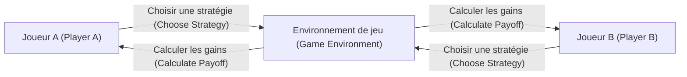
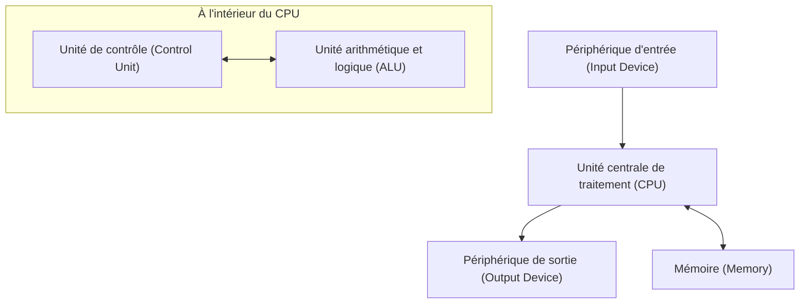

## 1. Introduction

John von Neumann (1903–1957) était un mathématicien de génie qui a représenté le 20e siècle et a eu un impact incommensurable sur tous les domaines de la science moderne. Ses réalisations allaient bien au-delà des mathématiques pures, s'étendant à la mécanique quantique, à la théorie des jeux, à l'informatique, à l'économie, à la météorologie et même au développement de la bombe atomique. En raison de sa capacité de calcul et de sa pensée logique extraordinaires, ses contemporains le craignaient et le respectaient, l'appelant le « Cerveau Démoniaque » ou le « Martien ».

Cet article expliquera en détail la vie de von Neumann, ses immenses réalisations et les nombreuses anecdotes qu'il a laissées derrière lui. Explorons profondément quel type de pensée il avait et comment il a construit les fondations de la société moderne. Retracer ses pas n'est rien de moins que retracer l'histoire du développement de la science moderne elle-même.

## 2. Naissance d'un prodige : Enfance à Budapest

John von Neumann (nom hongrois : Neumann János Lajos) est né en 1903 à Budapest, en Hongrie, dans une riche famille de banquiers juifs. Dès son plus jeune âge, il a fait preuve d'une mémoire et d'une capacité de calcul extraordinaires, affichant véritablement des talents dignes d'être qualifiés de **prodige**. On dit qu'il pouvait effectuer des divisions à huit chiffres mentalement à 6 ans et qu'il maîtrisait le calcul différentiel et intégral à 8 ans. Il était également très doué pour les langues, apprenant le grec et le latin dès son plus jeune âge, et échangeait même des plaisanteries en grec ancien avec son père.

À l'époque, Budapest était un centre mondial de la culture et de l'érudition, produisant de nombreux scientifiques juifs brillants. Eugene Wigner, Leo Szilard, Edward Teller et d'autres scientifiques qui sont devenus plus tard actifs aux États-Unis étaient tous originaires de Budapest comme von Neumann, et en raison de leurs talents uniques, ils ont été collectivement appelés les **Martiens** (Martians). Von Neumann a grandi dans cet excellent environnement intellectuel, atteignant un niveau où il publiait déjà des articles mathématiques au lycée.

## 3. Contributions aux fondements des mathématiques : Théorie axiomatique des ensembles

L'une des réalisations initiales les plus importantes de von Neumann a été ses recherches sur l'axiomatisation de la théorie des ensembles. La théorie des ensembles, fondée par [Georg Cantor](https://kenji.blog/p/cantor/), devait être le fondement des mathématiques, mais elle était confrontée à des contradictions logiques (paradoxes) telles que le paradoxe de Russell. Pour résoudre ce problème, Ernst Zermelo, Adolf Fraenkel et d'autres construisaient la théorie axiomatique des ensembles, mais von Neumann a adopté une approche différente.

Il a introduit le concept de « classes » et a brillamment évité les paradoxes en distinguant strictement les ensembles normaux des classes qui sont trop grandes pour être des ensembles (classes propres). Ce système a ensuite été amélioré par Paul Bernays et [Kurt Gödel](https://kenji.blog/p/godel/), et est maintenant connu sous le nom de **théorie des ensembles de von Neumann-Bernays-Gödel** (théorie des ensembles NBG).

$$
\forall X \ ( X \in V \iff \exists Y \ (X \in Y) )
$$

Ici, $V$ représente la **classe de tous les ensembles** ( $\text{classe universelle}$ ). Cette recherche fondamentale est devenue une contribution importante soutenant les racines des mathématiques.

## 4. Fondements mathématiques de la mécanique quantique

À la fin des années 1920, la mécanique quantique se développait sous la forme de deux théories apparemment complètement différentes : la « mécanique matricielle » de Werner Heisenberg et la « mécanique ondulatoire » d'Erwin Schrödinger. Von Neumann a prouvé que ces deux théories étaient mathématiquement équivalentes, donnant à la mécanique quantique un fondement mathématique strict.

En utilisant la théorie de l' **espace de Hilbert**, il a formulé les grandeurs physiques (observables) comme des opérateurs auto-adjoints sur un espace de Hilbert de dimension infinie. Son livre « Fondements mathématiques de la mécanique quantique », publié en 1932, est considéré comme une bible même pour les physiciens modernes et est toujours très apprécié aujourd'hui comme manuel standard pour la mécanique quantique.

Il a également introduit le concept de la **matrice de densité** ( $\text{matrice de densité}$ ) pour décrire les états mixtes, jetant les bases de la mécanique statistique quantique.

$$
\rho = \sum_{i} p_i |\psi_i\rangle \langle\psi_i|
$$

Ici, $p_i$ représente la probabilité ( $\text{poids de probabilité}$ ) de prendre l'état $|\psi_i\rangle$. Il a également mené de profondes réflexions sur l'« effondrement du paquet d'ondes » et le « problème de la mesure » dans la théorie de la mesure quantique.

## 5. Théorie des jeux et comportement économique

Partant de l'analyse des stratégies dans des jeux tels que le poker, von Neumann a fondé un domaine des mathématiques entièrement nouveau appelé « Théorie des jeux ». En 1928, il a prouvé le **théorème du minimax**, qui stipule que dans un jeu fini déterministe à somme nulle à deux joueurs avec information parfaite, si les deux parties adoptent des stratégies optimales, le résultat se stabilisera toujours à un certain résultat.

$$
\max_{x \in X} \min_{y \in Y} f(x, y) = \min_{y \in Y} \max_{x \in X} f(x, y)
$$

Le côté gauche de cette équation représente la stratégie consistant à « minimiser la perte dans le pire des cas » ( $\text{stratégie maximin}$ ), et le côté droit représente la stratégie consistant à « maximiser son propre profit contre le meilleur mouvement de l'adversaire ».

Plus tard, il a co-écrit l'œuvre monumentale « Théorie des jeux et comportement économique » (1944) avec l'économiste Oskar Morgenstern, révolutionnant l'économie. Il s'agissait d'une tentative de modéliser mathématiquement la prise de décision humaine rationnelle, et aujourd'hui, elle est appliquée dans un large éventail de domaines, non seulement en économie mais aussi en sciences politiques, en biologie et en stratégie militaire.

## 6. Informatique et architecture de von Neumann

Presque tous les ordinateurs modernes sont construits sur la base de l' **architecture de von Neumann** qu'il a conçue. Il a proposé le « concept de programme enregistré », dans lequel les programmes sont stockés en mémoire sous forme de données et sont lus et exécutés séquentiellement.

Cette architecture se compose des éléments principaux suivants :

Von Neumann a participé au projet de développement de l'EDVAC à l'Université de Pennsylvanie et a résumé ce concept révolutionnaire dans la « Première ébauche d'un rapport sur l'EDVAC ». Cela a permis de réaliser un ordinateur à usage général qui peut effectuer divers calculs simplement en réécrivant le logiciel (programme) sans avoir à recâbler physiquement le matériel. La société informatique moderne repose sur ces fondations qu'il a établies.

## 7. Automates cellulaires et théorie des machines auto-réplicatives

Dans ses dernières années, von Neumann s'est beaucoup intéressé à la modélisation mathématique des mécanismes d'auto-reproduction biologique. Avec les conseils de son collègue Stanislaw Ulam, il a conçu le concept d' **automates cellulaires**, dans lequel l'espace est divisé en une grille, et chaque cellule de la grille change d'état selon une certaine règle.

En utilisant des cellules à 29 états, il a rigoureusement prouvé qu'une machine auto-réplicative (constructeur universel) est théoriquement possible. C'était avant la découverte de la structure en double hélice de l'ADN, et on peut dire qu'il a prédit les mécanismes génétiques et les systèmes de transmission de l'information de la vie du point de vue de la science de l'information. Après sa mort, cette théorie a conduit à la recherche sur la vie artificielle.

## 8. Le projet Manhattan et les contributions à la dynamique des fluides

Pendant la Seconde Guerre mondiale, von Neumann a participé au « Projet Manhattan » pour le développement de la bombe atomique au Laboratoire national de Los Alamos. Il a joué un rôle central dans la dynamique des fluides et les calculs des ondes de choc, effectuant les calculs complexes essentiels à la conception des lentilles explosives de la bombe atomique de type plutonium (Fat Man). On dit que sans sa théorie sur l'interaction des ondes de choc et son incroyable capacité de calcul, le développement aurait été considérablement retardé.

Même après la guerre, il a continué à avoir une forte influence en tant que conseiller principal sur la politique militaire et scientifique du gouvernement américain, dirigeant des projets nationaux tels que le développement de missiles balistiques et les prévisions météorologiques numériques (les premières prévisions météorologiques informatiques au monde).

## 9. L'homme appelé le « Martien » : Anecdotes extraordinaires d'un génie

Il existe d'innombrables anecdotes entourant le cerveau surhumain de von Neumann.

* **Vitesse de calcul fulgurante** : Pour vérifier si les résultats calculés par l'ENIAC (un premier ordinateur électronique) étaient corrects, von Neumann a effectué des calculs mentaux pour les vérifier, et la légende dit que von Neumann a terminé le calcul plus rapidement.
* **Mémoire photographique parfaite** : Il pouvait mémoriser le contenu des livres et des annuaires téléphoniques mot pour mot après les avoir lus une fois. Lorsqu'on lui a demandé de « réciter le début du Conte de deux villes » des décennies plus tard, on dit qu'il a continué à le réciter parfaitement pendant des dizaines de minutes jusqu'à ce que son ami l'arrête.
* **Conduite et bruit** : C'était un très mauvais conducteur et il causait fréquemment des accidents. Il y a une anecdote où il a donné l'excuse : « Les arbres ne se sont pas écartés de mon chemin. » Il préférait également les environnements bruyants au silence et menait des recherches mathématiques complexes tout en écoutant de la musique de marche allemande à un volume élevé dans son bureau.
* **Blague martienne** : Ses collègues physiciens plaisantaient à moitié sérieusement : « Von Neumann est un Martien vivant sur Terre et prétendant être humain. Cependant, il est capable d'imiter parfaitement un humain. »

## 10. Principaux livres et articles

Les livres et les articles que von Neumann a laissés au cours de sa vie sont divers, mais nous présentons ici des œuvres représentatives qui ont eu un impact particulièrement important sur les générations suivantes.

1. **Les fondements mathématiques de la mécanique quantique (1932)**
   Une œuvre monumentale qui a strictement formulé la mécanique quantique en utilisant la théorie de l'espace de Hilbert.
2. **Théorie des jeux et comportement économique (1944)**
   Co-écrit avec Oskar Morgenstern. Un chef-d'œuvre qui a discuté systématiquement de tout, des jeux à somme nulle aux jeux coopératifs.
3. **L'ordinateur et le cerveau (1958)**
   Un manuscrit inachevé publié à titre posthume. Une œuvre pionnière comparant les réseaux neuronaux du cerveau humain avec les mécanismes des ordinateurs numériques.
4. **Théorie des automates auto-reproducteurs (1966)**
   Compilé et publié à partir des manuscrits posthumes de von Neumann par Arthur Burks.

## 11. John von Neumann : Brève chronologie

Voici une chronologie détaillée résumant la vie et les principales réalisations de John von Neumann.

* **1903** : Naissance à Budapest, au Royaume de Hongrie.
* **1911** : Entre dans un gymnase luthérien.
* **1921** : Entre à l'Université de Budapest, avec une spécialisation en mathématiques. Étudie simultanément la chimie à l'Université de Berlin et à l'ETH de Zurich.
* **1926** : Obtient un doctorat en mathématiques à l'Université de Budapest.
* **1928** : Prouve le théorème du minimax, jetant les bases de la théorie des jeux.
* **1930** : Déménage aux États-Unis en tant que professeur invité à l'Université de Princeton.
* **1932** : Publie « Les fondements mathématiques de la mécanique quantique ».
* **1933** : Nommé professeur à vie à l'Institute for Advanced Study de Princeton. Devient l'un de ses premiers membres aux côtés d'Albert Einstein et d'autres.
* **1937** : Acquiert la citoyenneté des États-Unis d'Amérique.
* **1943** : Participe au projet Manhattan, dirigeant les calculs des lentilles explosives.
* **1944** : Publie « Théorie des jeux et comportement économique ».
* **1945** : Rédige la « Première ébauche d'un rapport sur l'EDVAC », proposant le concept de programme enregistré.
* **1948** : Annonce la théorie des automates cellulaires et le concept de machines auto-réplicatives.
* **1951** : Devient président de l'American Mathematical Society.
* **1954** : Nommé membre de la Commission de l'énergie atomique des États-Unis.
* **1955** : Diagnostiqué d'un cancer des os (ou cancer du pancréas) et commence une bataille contre la maladie.
* **1957** : Décède au Walter Reed Army Medical Center de Washington, D.C., à l'âge de 53 ans.

## 12. Conclusion

John von Neumann est décédé en 1957 à l'âge de 53 ans des suites d'un cancer. Cependant, l'héritage intellectuel qu'il a laissé survit encore fortement aujourd'hui en tant que fondement des mathématiques, de la physique, de l'économie et des technologies de l'information modernes. Des smartphones et des ordinateurs que nous utilisons tous les jours à la technologie d'intelligence artificielle (IA) de pointe et aux méthodes d'analyse en sciences sociales, on peut voir des aperçus du « Cerveau Démoniaque » de von Neumann partout. Réfléchir à sa vie nous fait réaliser une fois de plus les possibilités infinies de l'intellect humain et l'ampleur de son impact sur le monde. Dans l'histoire de l'humanité, personne d'autre n'a provoqué de changements de paradigme fondamentaux dans un éventail de domaines aussi large que lui.
