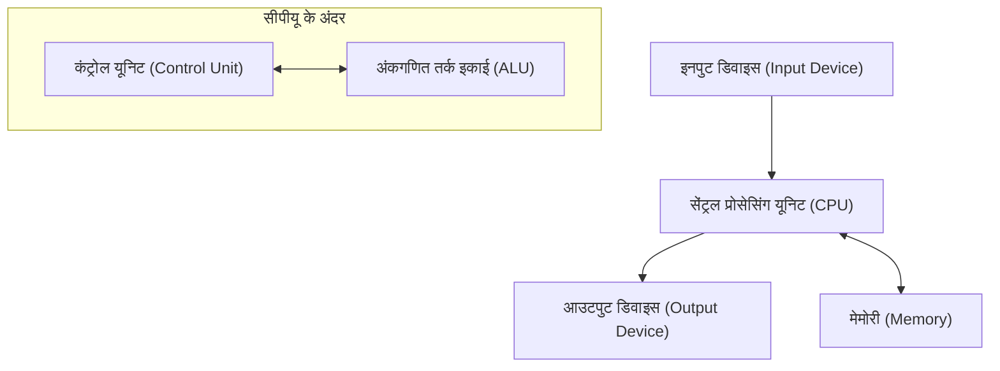

## 1. परिचय

जॉन वॉन न्यूमैन (1903-1957) 20वीं सदी के एक प्रतिभाशाली गणितज्ञ थे, जिनका आधुनिक विज्ञान के सभी क्षेत्रों पर अथाह प्रभाव था। उनकी उपलब्धियाँ शुद्ध गणित से बहुत आगे तक गईं, और वे क्वांटम यांत्रिकी, गेम थ्योरी, कंप्यूटर विज्ञान, अर्थशास्त्र, मौसम विज्ञान और यहां तक कि परमाणु बम के विकास तक फैली हुई थीं। उनकी असाधारण गणना क्षमता और तार्किक सोच के कारण, उनके समकालीनों ने उन्हें "आसुरी मस्तिष्क" और "मंगल ग्रहवासी" (Martian) कहते हुए उनका सम्मान किया और उनसे डरते थे।

यह लेख वॉन न्यूमैन के जीवन, उनकी जबरदस्त उपलब्धियों और उनके द्वारा छोड़े गए कई किस्सों के बारे में विस्तार से बताएगा। आइए गहराई से पता करें कि उनकी सोच किस प्रकार की थी और उन्होंने आधुनिक समाज की नींव कैसे रखी। उनके नक्शेकदम पर चलना आधुनिक विज्ञान के विकास के इतिहास को जानने से कम नहीं है।

## 2. एक कौतुक का जन्म: बुडापेस्ट में बचपन

जॉन वॉन न्यूमैन (हंगेरियन नाम: न्यूमैन जानोस लाजोस) का जन्म 1903 में बुडापेस्ट, हंगरी में एक धनी यहूदी बैंकर के परिवार में हुआ था। कम उम्र से ही, उन्होंने असाधारण स्मृति और गणना क्षमता दिखाई, और वास्तव में एक **प्रतिभा** कहलाने योग्य प्रतिभा का प्रदर्शन किया। कहा जाता है कि वे 6 साल की उम्र में आठ अंकों का भाग मानसिक रूप से कर सकते थे, और 8 साल की उम्र में कलन (calculus) में महारत हासिल कर ली थी। वे भाषाओं में भी बहुत कुशल थे, उन्होंने कम उम्र से ही ग्रीक और लैटिन सीखी थी, और अपने पिता के साथ शास्त्रीय ग्रीक में चुटकुले भी सुनाते थे।

उस समय, बुडापेस्ट संस्कृति और छात्रवृत्ति का एक वैश्विक केंद्र था, जिसने कई प्रतिभाशाली यहूदी वैज्ञानिकों को जन्म दिया। यूजीन विग्नर, लियो स्ज़ीलार्ड, एडवर्ड टेलर, और अन्य वैज्ञानिक जो बाद में संयुक्त राज्य अमेरिका में सक्रिय हो गए, वे सभी वॉन न्यूमैन की तरह बुडापेस्ट से थे, और अपनी अनूठी प्रतिभा के कारण, उन्हें सामूहिक रूप से **मार्टियंस** कहा जाता था। वॉन न्यूमैन इसी उत्कृष्ट बौद्धिक वातावरण में पले-बढ़े, और उस स्तर तक पहुँच गए जहाँ वे हाई स्कूल में ही गणितीय शोध पत्र प्रकाशित कर रहे थे।

## 3. गणित की नींव में योगदान: स्वयंसिद्ध सेट थ्योरी

वॉन न्यूमैन की सबसे महत्वपूर्ण प्रारंभिक उपलब्धियों में से एक सेट थ्योरी के स्वयंसिद्धीकरण पर उनका शोध था। [जॉर्ज कैंटर](https://kenji.blog/p/cantor/) द्वारा स्थापित सेट थ्योरी से गणित की नींव होने की उम्मीद थी, लेकिन इसे रसेल के विरोधाभास जैसे तार्किक विरोधाभासों (paradoxes) का सामना करना पड़ा। इस समस्या को हल करने के लिए, अर्न्स्ट ज़र्मेलो, एडोल्फ फ्रेंकेल और अन्य स्वयंसिद्ध सेट थ्योरी का निर्माण कर रहे थे, लेकिन वॉन न्यूमैन ने एक अलग दृष्टिकोण अपनाया।

उन्होंने "वर्गों" (classes) की अवधारणा पेश की और सामान्य सेटों और उन वर्गों के बीच सख्ती से अंतर करके विरोधाभासों से शानदार ढंग से परहेज किया जो सेट होने के लिए बहुत बड़े हैं (उचित वर्ग)। बाद में इस प्रणाली में पॉल बर्नेज़ और [कर्ट गोडेल](https://kenji.blog/p/godel/) द्वारा सुधार किया गया, और अब इसे **वॉन न्यूमैन-बर्नेज़-गोडेल सेट थ्योरी** (NBG सेट थ्योरी) के रूप में जाना जाता है।

$$
\forall X \ ( X \in V \iff \exists Y \ (X \in Y) )
$$

यहाँ, $V$ **सभी सेटों के वर्ग** ( $\text{सार्वभौमिक वर्ग}$ ) का प्रतिनिधित्व करता है। यह मौलिक शोध गणित की जड़ों का समर्थन करने वाला एक महत्वपूर्ण योगदान बन गया।

## 4. क्वांटम यांत्रिकी की गणितीय नींव

1920 के दशक के उत्तरार्ध में, क्वांटम यांत्रिकी दो प्रतीत होने वाले बिल्कुल अलग सिद्धांतों के रूप में विकसित हो रही थी: वर्नर हाइजेनबर्ग की "मैट्रिक्स यांत्रिकी" और इरविन श्रोडिंगर की "तरंग यांत्रिकी"। वॉन न्यूमैन ने साबित कर दिया कि ये दोनों सिद्धांत गणितीय रूप से समतुल्य थे, जिससे क्वांटम यांत्रिकी को एक सख्त गणितीय आधार मिला।

**हिल्बर्ट स्पेस** के सिद्धांत का उपयोग करते हुए, उन्होंने अनंत-आयामी हिल्बर्ट स्पेस पर स्व-संबद्ध ऑपरेटरों (self-adjoint operators) के रूप में भौतिक मात्राओं (observables) को तैयार किया। 1932 में प्रकाशित उनकी पुस्तक "मैथेमेटिकल फाउंडेशंस ऑफ क्वांटम मैकेनिक्स", आधुनिक भौतिकविदों के लिए भी एक बाइबिल मानी जाती है और क्वांटम यांत्रिकी के लिए एक मानक पाठ्यपुस्तक के रूप में आज भी अत्यधिक सम्मानित है।

उन्होंने मिश्रित अवस्थाओं का वर्णन करने के लिए **घनत्व मैट्रिक्स** ( $\text{घनत्व मैट्रिक्स}$ ) की अवधारणा भी पेश की, जिससे क्वांटम सांख्यिकीय यांत्रिकी की नींव पड़ी।

$$
\rho = \sum_{i} p_i |\psi_i\rangle \langle\psi_i|
$$

यहाँ, $p_i$ अवस्था $|\psi_i\rangle$ लेने की प्रायिकता ( $\text{प्रायिकता भार}$ ) का प्रतिनिधित्व करता है। उन्होंने क्वांटम माप सिद्धांत में "वेव पैकेट के पतन" और "माप की समस्या" पर भी गहन विचार किया।

## 5. गेम थ्योरी और आर्थिक व्यवहार

पोकर जैसे खेलों में रणनीतियों के विश्लेषण से शुरू करते हुए, वॉन न्यूमैन ने "गेम थ्योरी" नामक गणित के एक बिल्कुल नए क्षेत्र की स्थापना की। 1928 में, उन्होंने **मिनिमैक्स प्रमेय** सिद्ध किया, जिसमें कहा गया है कि दो-व्यक्ति शून्य-योग परिमित नियतात्मक पूर्ण सूचना खेल में, यदि दोनों पक्ष इष्टतम रणनीति अपनाते हैं, तो परिणाम हमेशा एक निश्चित परिणाम पर तय होगा।

$$
\max_{x \in X} \min_{y \in Y} f(x, y) = \min_{y \in Y} \max_{x \in X} f(x, y)
$$

इस समीकरण का बायां पक्ष "सबसे खराब स्थिति में नुकसान को कम करने" ( $\text{मैक्सिमिन रणनीति}$ ) की रणनीति का प्रतिनिधित्व करता है, और दायां पक्ष "प्रतिद्वंद्वी की सर्वश्रेष्ठ चाल के खिलाफ अपने लाभ को अधिकतम करने" की रणनीति का प्रतिनिधित्व करता है।

बाद में, उन्होंने अर्थशास्त्री ऑस्कर मोर्गेनस्टर्न के साथ स्मारकीय कार्य "थ्योरी ऑफ गेम्स एंड इकोनॉमिक बिहेवियर" (1944) का सह-लेखन किया, जिससे अर्थशास्त्र में क्रांति आ गई। यह तर्कसंगत मानवीय निर्णय लेने को गणितीय रूप से मॉडल करने का एक प्रयास था, और आज यह केवल अर्थशास्त्र में ही नहीं बल्कि राजनीति विज्ञान, जीव विज्ञान और सैन्य रणनीति जैसे क्षेत्रों की एक विस्तृत श्रृंखला में लागू किया जाता है।

## 6. कंप्यूटर विज्ञान और वॉन न्यूमैन वास्तुकला

लगभग सभी आधुनिक कंप्यूटर उनके द्वारा तैयार की गई **वॉन न्यूमैन आर्किटेक्चर** के आधार पर बनाए गए हैं। उन्होंने "संग्रहीत-प्रोग्राम अवधारणा" का प्रस्ताव रखा, जहाँ प्रोग्राम मेमोरी में डेटा के रूप में संग्रहीत किए जाते हैं और क्रमिक रूप से पढ़े और निष्पादित किए जाते हैं।

इस वास्तुकला में निम्नलिखित मुख्य तत्व होते हैं:

वॉन न्यूमैन ने पेंसिल्वेनिया विश्वविद्यालय में EDVAC विकास परियोजना में भाग लिया और "फर्स्ट ड्राफ्ट ऑफ ए रिपोर्ट ऑन द EDVAC" में इस अभूतपूर्व अवधारणा को संक्षेप में प्रस्तुत किया। इससे एक ऐसा सामान्य प्रयोजन कंप्यूटर बनाना संभव हो गया जो हार्डवेयर को भौतिक रूप से फिर से जोड़े बिना केवल सॉफ़्टवेयर (प्रोग्राम) को फिर से लिखकर विभिन्न गणनाएँ कर सकता है। आधुनिक आईटी समाज उनके द्वारा स्थापित इसी नींव पर बना है।

## 7. सेलुलर ऑटोमेटा और सेल्फ-रिप्रोड्यूसिंग मशीनों का सिद्धांत

अपने बाद के वर्षों में, वॉन न्यूमैन ने जैविक आत्म-प्रजनन के तंत्र को गणितीय रूप से मॉडल करने में गहरी दिलचस्पी ली। अपने सहयोगी स्टैनिस्लाव उलम की सलाह के साथ, उन्होंने **सेलुलर ऑटोमेटा** की अवधारणा तैयार की, जिसमें स्थान को एक ग्रिड में विभाजित किया जाता है, और प्रत्येक ग्रिड सेल एक निश्चित नियम के अनुसार अपनी स्थिति बदलता है।

29 राज्यों वाली कोशिकाओं का उपयोग करते हुए, उन्होंने कठोरता से साबित कर दिया कि एक आत्म-प्रजनन मशीन (यूनिवर्सल कंस्ट्रक्टर) सैद्धांतिक रूप से संभव है। यह डीएनए की दोहरी-कुंडलिनी संरचना की खोज से पहले था, और यह कहा जा सकता है कि उन्होंने सूचना विज्ञान के परिप्रेक्ष्य से जीवन के आनुवंशिक तंत्र और सूचना संचरण प्रणालियों की भविष्यवाणी की थी। उनकी मृत्यु के बाद, इस सिद्धांत ने कृत्रिम जीवन में अनुसंधान को जन्म दिया।

## 8. मैनहट्टन परियोजना और द्रव गतिशीलता में योगदान

द्वितीय विश्व युद्ध के दौरान, वॉन न्यूमैन ने लॉस एलामोस राष्ट्रीय प्रयोगशाला में परमाणु बम विकास के लिए "मैनहट्टन परियोजना" में भाग लिया। उन्होंने द्रव गतिशीलता और शॉक वेव गणनाओं में एक केंद्रीय भूमिका निभाई, प्लूटोनियम प्रकार के परमाणु बम (फैट मैन) के लिए विस्फोटक लेंस डिजाइन करने के लिए आवश्यक जटिल गणनाएँ कीं। कहा जाता है कि शॉक वेव्स की बातचीत पर उनके सिद्धांत और उनकी जबरदस्त गणना क्षमता के बिना, विकास में काफी देरी होती।

युद्ध के बाद भी, वे अमेरिकी सरकार के लिए सैन्य और विज्ञान नीति पर शीर्ष सलाहकार के रूप में मजबूत प्रभाव डालते रहे, बैलिस्टिक मिसाइलों के विकास और संख्यात्मक मौसम भविष्यवाणी (दुनिया का पहला कंप्यूटर आधारित मौसम पूर्वानुमान) जैसी राष्ट्रीय परियोजनाओं का नेतृत्व करते रहे।

## 9. "मार्टियन" कहलाने वाला आदमी: एक प्रतिभाशाली की असाधारण किस्से

वॉन न्यूमैन के सुपरहुमन मस्तिष्क के आसपास अनगिनत किस्से हैं।

* **आश्चर्यजनक गणना गति**: ENIAC (एक प्रारंभिक इलेक्ट्रॉनिक कंप्यूटर) द्वारा गणना किए गए परिणाम सही थे या नहीं, यह सत्यापित करने के लिए, वॉन न्यूमैन उन्हें जांचने के लिए मानसिक गणना करते थे, और किंवदंती है कि वॉन न्यूमैन ने तेजी से गणना पूरी की।
* **परफेक्ट फोटोग्राफिक मेमोरी**: वे एक बार पढ़ने के बाद किताबों और टेलीफोन निर्देशिकाओं की सामग्री को शब्दशः याद कर सकते थे। दशकों बाद जब उन्हें "ए टेल ऑफ़ टू सिटीज़ की शुरुआत सुनाने" के लिए कहा गया, तो कहा जाता है कि वे इसे दसियों मिनट तक पूरी तरह से तब तक सुनाते रहे जब तक कि उनके दोस्त ने उन्हें रोक नहीं दिया।
* **ड्राइविंग और शोर**: वे बहुत खराब ड्राइवर थे और अक्सर दुर्घटनाएं करते थे। एक किस्सा है जहाँ उन्होंने बहाना बनाया, "पेड़ मेरे रास्ते से नहीं हटे।" उन्हें मौन की तुलना में शोरगुल वाला वातावरण भी पसंद था और वे अपने कार्यालय में तेज मात्रा में जर्मन मार्च संगीत बजाते हुए जटिल गणितीय शोध करते थे।
* **मार्टियन जोक**: उनके साथी भौतिकविदों ने आधा मज़ाक करते हुए कहा, "वॉन न्यूमैन एक मार्टियन है जो पृथ्वी पर रह रहा है और इंसान होने का नाटक कर रहा है। हालाँकि, वह एक इंसान की पूरी तरह से नकल करने में सक्षम है।"

## 10. प्रमुख पुस्तकें और शोध पत्र

वॉन न्यूमैन ने अपने जीवनकाल में जो पुस्तकें और शोध पत्र छोड़े वे विविध हैं, लेकिन यहाँ हम प्रतिनिधि कार्यों का परिचय देते हैं जिनका बाद की पीढ़ियों पर विशेष रूप से महत्वपूर्ण प्रभाव पड़ा।

1. **मैथेमेटिकल फाउंडेशंस ऑफ क्वांटम मैकेनिक्स (1932)**
   एक स्मारकीय कार्य जिसने हिल्बर्ट स्पेस के सिद्धांत का उपयोग करके क्वांटम यांत्रिकी को सख्ती से तैयार किया।
2. **थ्योरी ऑफ गेम्स एंड इकोनॉमिक बिहेवियर (1944)**
   ऑस्कर मोर्गेनस्टर्न के साथ सह-लिखित। एक उत्कृष्ट कृति जिसने शून्य-योग खेलों से लेकर सहकारी खेलों तक हर चीज पर व्यवस्थित रूप से चर्चा की।
3. **द कंप्यूटर एंड द ब्रेन (1958)**
   एक अधूरी पांडुलिपि जो मरणोपरांत प्रकाशित हुई। डिजिटल कंप्यूटर के तंत्र के साथ मानव मस्तिष्क के तंत्रिका नेटवर्क की तुलना करने वाला एक अग्रणी कार्य।
4. **थ्योरी ऑफ सेल्फ-रिप्रोड्यूसिंग ऑटोमेटा (1966)**
   आर्थर बर्क द्वारा वॉन न्यूमैन की मरणोपरांत पांडुलिपियों से संकलित और प्रकाशित।

## 11. जॉन वॉन न्यूमैन: संक्षिप्त कालक्रम

जॉन वॉन न्यूमैन के जीवन और प्रमुख उपलब्धियों को सारांशित करने वाली एक विस्तृत समयरेखा निम्नलिखित है।

* **1903**: बुडापेस्ट, हंगरी साम्राज्य में जन्म।
* **1911**: एक लूथरन जिमनैजियम में प्रवेश किया।
* **1921**: बुडापेस्ट विश्वविद्यालय में प्रवेश किया, गणित में पढ़ाई की। साथ ही बर्लिन विश्वविद्यालय और ETH ज्यूरिख में रसायन विज्ञान का अध्ययन किया।
* **1926**: बुडापेस्ट विश्वविद्यालय से गणित में पीएच.डी. प्राप्त की।
* **1928**: मिनिमैक्स प्रमेय सिद्ध किया, गेम थ्योरी की नींव रखी।
* **1930**: प्रिंसटन विश्वविद्यालय में अतिथि प्रोफेसर के रूप में संयुक्त राज्य अमेरिका चले गए।
* **1932**: "मैथेमेटिकल फाउंडेशंस ऑफ क्वांटम मैकेनिक्स" प्रकाशित की।
* **1933**: प्रिंसटन में इंस्टीट्यूट फॉर एडवांस्ड स्टडी में आजीवन प्रोफेसर नियुक्त किए गए। अल्बर्ट आइंस्टीन और अन्य के साथ इसके शुरुआती सदस्यों में से एक बने।
* **1937**: संयुक्त राज्य अमेरिका की नागरिकता हासिल की।
* **1943**: मैनहट्टन परियोजना में भाग लिया, विस्फोटक लेंस के लिए गणनाओं का नेतृत्व किया।
* **1944**: "थ्योरी ऑफ गेम्स एंड इकोनॉमिक बिहेवियर" प्रकाशित की।
* **1945**: संग्रहीत प्रोग्राम अवधारणा का प्रस्ताव करते हुए, "फर्स्ट ड्राफ्ट ऑफ ए रिपोर्ट ऑन द EDVAC" लिखा।
* **1948**: सेलुलर ऑटोमेटा के सिद्धांत और आत्म-प्रजनन मशीनों की अवधारणा की घोषणा की।
* **1951**: अमेरिकन मैथमेटिकल सोसाइटी के अध्यक्ष बने।
* **1954**: संयुक्त राज्य परमाणु ऊर्जा आयोग के सदस्य नियुक्त किए गए।
* **1955**: हड्डी के कैंसर (या अग्नाशय के कैंसर) का निदान हुआ और बीमारी से लड़ाई शुरू की।
* **1957**: वाशिंगटन, डी.सी. में वाल्टर रीड आर्मी मेडिकल सेंटर में 53 वर्ष की आयु में निधन।

## 12. निष्कर्ष

जॉन वॉन न्यूमैन का 1957 में 53 वर्ष की कम उम्र में कैंसर के कारण निधन हो गया। हालाँकि, उनके द्वारा छोड़ी गई बौद्धिक विरासत आज भी आधुनिक गणित, भौतिकी, अर्थशास्त्र और सूचना प्रौद्योगिकी की नींव के रूप में मजबूती से जीवित है। हम हर दिन जिन स्मार्टफोन और कंप्यूटरों का उपयोग करते हैं, उनसे लेकर अत्याधुनिक आर्टिफिशियल इंटेलिजेंस (AI) तकनीक और सामाजिक विज्ञान में विश्लेषणात्मक तरीकों तक, वॉन न्यूमैन के "आसुरी मस्तिष्क" की झलक हर जगह देखी जा सकती है। उनके जीवन पर विचार करने से हमें एक बार फिर मानव बुद्धि की अनंत संभावनाओं और दुनिया पर इसके प्रभाव के परिमाण का एहसास होता है। मानव इतिहास में, किसी अन्य व्यक्ति ने उनके जितने व्यापक क्षेत्रों में इतने मौलिक प्रतिमान बदलाव (paradigm shifts) नहीं किए हैं।
