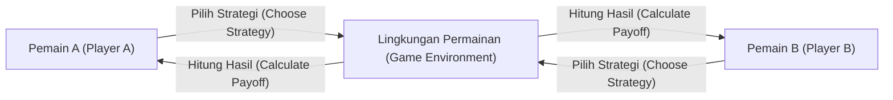
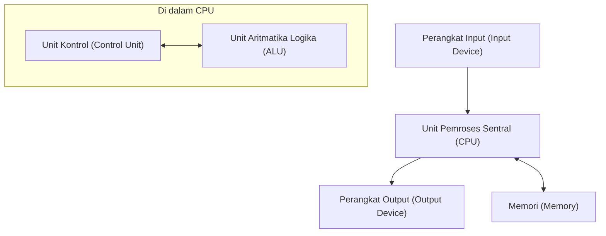

## 1. Pengantar

John von Neumann (1903–1957) adalah seorang ahli matematika jenius yang mewakili abad ke-20 dan memiliki dampak yang tak terukur pada semua bidang sains modern. Pencapaiannya jauh melampaui matematika murni, meluas ke mekanika kuantum, teori permainan, ilmu komputer, ekonomi, meteorologi, dan bahkan pengembangan bom atom. Karena kemampuan perhitungan dan pemikiran logisnya yang luar biasa, orang-orang sezamannya takut dan menghormatinya, memanggilnya "Otak Iblis" dan "Orang Mars".

Artikel ini akan menjelaskan secara rinci kehidupan von Neumann, pencapaiannya yang luar biasa, dan banyak anekdot yang ditinggalkannya. Mari kita jelajahi secara mendalam pemikiran seperti apa yang dia miliki dan bagaimana dia membangun fondasi masyarakat modern. Menelusuri jejak langkahnya tidak lain adalah menelusuri sejarah perkembangan sains modern itu sendiri.

## 2. Kelahiran Anak Ajaib: Masa Kecil di Budapest

John von Neumann (nama Hongaria: Neumann János Lajos) lahir pada tahun 1903 di Budapest, Hongaria, dalam keluarga bankir Yahudi yang kaya. Sejak usia muda, ia menunjukkan daya ingat dan kemampuan berhitung yang luar biasa, benar-benar menampilkan bakat yang layak disebut **anak ajaib**. Dikatakan bahwa ia dapat melakukan pembagian delapan digit di luar kepala pada usia 6 tahun, dan menguasai kalkulus pada usia 8 tahun. Ia juga sangat mahir dalam bahasa, belajar bahasa Yunani dan Latin sejak usia dini, dan bahkan saling bertukar lelucon dalam bahasa Yunani klasik dengan ayahnya.

Pada saat itu, Budapest adalah pusat budaya dan keilmuan global, menghasilkan banyak ilmuwan Yahudi yang brilian. Eugene Wigner, Leo Szilard, Edward Teller, dan ilmuwan lain yang kemudian menjadi aktif di Amerika Serikat semuanya berasal dari Budapest seperti von Neumann, dan karena bakat unik mereka, mereka secara kolektif disebut **Orang Mars** (Martians). Von Neumann tumbuh dalam lingkungan intelektual yang sangat baik ini, mencapai tingkat di mana ia sudah menerbitkan makalah matematika di sekolah menengah.

## 3. Kontribusi pada Fondasi Matematika: Teori Himpunan Aksiomatik

Salah satu pencapaian awal von Neumann yang paling penting adalah penelitiannya tentang aksiomatisasi teori himpunan. Teori himpunan, yang didirikan oleh Georg Cantor, diharapkan menjadi fondasi matematika, tetapi menghadapi kontradiksi logis (paradoks) seperti paradoks Russell. Untuk menyelesaikan masalah ini, Ernst Zermelo, Adolf Fraenkel, dan lainnya membangun teori himpunan aksiomatik, tetapi von Neumann mengambil pendekatan yang berbeda.

Ia memperkenalkan konsep "kelas" dan dengan cemerlang menghindari paradoks dengan membedakan secara ketat antara himpunan normal dan kelas yang terlalu besar untuk menjadi himpunan (kelas sebenarnya). Sistem ini kemudian disempurnakan oleh Paul Bernays dan Kurt Gödel, dan sekarang dikenal sebagai **teori himpunan von Neumann-Bernays-Gödel** (teori himpunan NBG).

$$
\forall X \ ( X \in V \iff \exists Y \ (X \in Y) )
$$

Di sini, $V$ mewakili **kelas dari semua himpunan** ( $\text{kelas universal}$ ). Penelitian mendasar ini menjadi kontribusi penting yang mendukung akar matematika.

## 4. Fondasi Matematika dari Mekanika Kuantum

Pada akhir tahun 1920-an, mekanika kuantum berkembang sebagai dua teori yang tampaknya sama sekali berbeda: "mekanika matriks" dari Werner Heisenberg dan "mekanika gelombang" dari Erwin Schrödinger. Von Neumann membuktikan bahwa kedua teori ini setara secara matematis, memberikan mekanika kuantum fondasi matematika yang ketat.

Menggunakan teori **ruang Hilbert**, ia merumuskan besaran fisis (observabel) sebagai operator adjoin-diri pada ruang Hilbert berdimensi tak hingga. Bukunya "Fondasi Matematika Mekanika Kuantum," yang diterbitkan pada tahun 1932, dianggap sebagai Alkitab bahkan bagi fisikawan modern dan masih sangat dihargai saat ini sebagai buku teks standar untuk mekanika kuantum.

Ia juga memperkenalkan konsep **matriks densitas** ( $\text{matriks densitas}$ ) untuk menggambarkan keadaan campuran, meletakkan dasar bagi mekanika statistik kuantum.

$$
\rho = \sum_{i} p_i |\psi_i\rangle \langle\psi_i|
$$

Di sini, $p_i$ mewakili probabilitas ( $\text{bobot probabilitas}$ ) untuk mengambil keadaan $|\psi_i\rangle$. Ia juga melakukan pertimbangan mendalam tentang "keruntuhan paket gelombang" dan "masalah pengukuran" dalam teori pengukuran kuantum.

## 5. Teori Permainan dan Perilaku Ekonomi

Berangkat dari analisis strategi dalam permainan seperti poker, von Neumann mendirikan bidang matematika yang sama sekali baru yang disebut "Teori Permainan". Pada tahun 1928, ia membuktikan **teorema minimaks**, yang menyatakan bahwa dalam permainan informasi sempurna deterministik berhingga jumlah-nol dua orang, jika kedua belah pihak mengadopsi strategi optimal, hasilnya akan selalu menetap pada hasil tertentu.

$$
\max_{x \in X} \min_{y \in Y} f(x, y) = \min_{y \in Y} \max_{x \in X} f(x, y)
$$

Sisi kiri dari persamaan ini mewakili strategi untuk "meminimalkan kerugian dalam kasus terburuk" ( $\text{strategi maksimin}$ ), dan sisi kanan mewakili strategi untuk "memaksimalkan keuntungan sendiri terhadap langkah terbaik lawan".

Kemudian, ia ikut menulis karya monumental "Teori Permainan dan Perilaku Ekonomi" (1944) dengan ekonom Oskar Morgenstern, yang merevolusi ilmu ekonomi. Ini merupakan upaya untuk memodelkan pengambilan keputusan manusia yang rasional secara matematis, dan saat ini diterapkan dalam berbagai bidang, tidak hanya dalam ilmu ekonomi tetapi juga dalam ilmu politik, biologi, dan strategi militer.

## 6. Ilmu Komputer dan Arsitektur von Neumann

Hampir semua komputer modern dibangun berdasarkan **arsitektur von Neumann** yang ia rancang. Ia mengusulkan "konsep program tersimpan", di mana program disimpan dalam memori sebagai data dan dibaca serta dieksekusi secara berurutan.

Arsitektur ini terdiri dari elemen-elemen utama berikut:

Von Neumann berpartisipasi dalam proyek pengembangan EDVAC di Universitas Pennsylvania dan merangkum konsep terobosan ini dalam "Draf Pertama Laporan tentang EDVAC". Hal ini memungkinkan terwujudnya komputer tujuan umum yang dapat melakukan berbagai perhitungan hanya dengan menulis ulang perangkat lunak (program) tanpa harus menyambungkan kembali perangkat keras secara fisik. Masyarakat TI modern dibangun di atas fondasi yang ia bangun.

## 7. Automata Seluler dan Teori Mesin yang Berkembang Biak Sendiri

Pada tahun-tahun terakhirnya, von Neumann menaruh minat yang kuat dalam memodelkan secara matematis mekanisme reproduksi biologis. Atas saran rekannya Stanislaw Ulam, ia merancang konsep **automata seluler**, di mana ruang dibagi menjadi kisi, dan setiap sel kisi mengubah keadaannya menurut aturan tertentu.

Menggunakan sel dengan 29 keadaan, ia secara ketat membuktikan bahwa mesin yang dapat berkembang biak sendiri (konstruktor universal) secara teoritis dimungkinkan. Ini sebelum penemuan struktur heliks ganda DNA, dan dapat dikatakan bahwa ia memprediksi mekanisme genetik dan sistem transmisi informasi kehidupan dari perspektif ilmu informasi. Setelah kematiannya, teori ini mengarah pada penelitian kehidupan buatan.

## 8. Proyek Manhattan dan Kontribusi pada Dinamika Fluida

Selama Perang Dunia II, von Neumann berpartisipasi dalam "Proyek Manhattan" untuk pengembangan bom atom di Laboratorium Nasional Los Alamos. Ia memainkan peran sentral dalam dinamika fluida dan perhitungan gelombang kejut, melakukan perhitungan kompleks yang penting untuk merancang lensa peledak untuk bom atom jenis plutonium (Fat Man). Dikatakan bahwa tanpa teorinya tentang interaksi gelombang kejut dan kemampuan perhitungannya yang luar biasa, perkembangannya akan tertunda secara signifikan.

Bahkan setelah perang, ia terus memiliki pengaruh kuat sebagai penasihat tertinggi kebijakan militer dan sains untuk pemerintah AS, memimpin proyek-proyek nasional seperti pengembangan rudal balistik dan prediksi cuaca numerik (prakiraan cuaca berbasis komputer pertama di dunia).

## 9. Pria yang Dipanggil "Orang Mars": Anekdot Luar Biasa Seorang Jenius

Ada banyak anekdot seputar otak manusia super von Neumann.

* **Kecepatan Perhitungan yang Mencengangkan**: Untuk memverifikasi apakah hasil perhitungan ENIAC (komputer elektronik awal) sudah benar, von Neumann melakukan perhitungan mental untuk memeriksanya, dan legenda mengatakan bahwa von Neumann selesai menghitung lebih cepat.
* **Ingatan Fotografi yang Sempurna**: Ia dapat menghafal isi buku dan buku telepon kata demi kata setelah membacanya sekali. Ketika diminta untuk "membacakan awal A Tale of Two Cities" beberapa dekade kemudian, dia dikabarkan terus membacakannya dengan sempurna selama puluhan menit sampai temannya menghentikannya.
* **Mengemudi dan Kebisingan**: Dia adalah pengemudi yang sangat buruk dan sering menyebabkan kecelakaan. Ada anekdot di mana dia membuat alasan, "Pohon-pohon tidak menyingkir dari jalanku." Dia juga lebih menyukai lingkungan yang bising daripada keheningan dan melakukan penelitian matematika yang rumit sambil memutar musik mars Jerman dengan volume tinggi di kantornya.
* **Lelucon Orang Mars**: Rekan fisikawannya setengah bercanda, "Von Neumann adalah orang Mars yang tinggal di Bumi berpura-pura menjadi manusia. Namun, dia mampu meniru manusia dengan sempurna."

## 10. Buku dan Makalah Utama

Buku-buku dan makalah yang ditinggalkan von Neumann semasa hidupnya beragam, namun di sini kami memperkenalkan karya-karya perwakilan yang memiliki dampak signifikan bagi generasi selanjutnya.

1. **Fondasi Matematika dari Mekanika Kuantum (1932)**
   Sebuah karya monumental yang secara ketat merumuskan mekanika kuantum menggunakan teori ruang Hilbert.
2. **Teori Permainan dan Perilaku Ekonomi (1944)**
   Ditulis bersama Oskar Morgenstern. Mahakarya yang secara sistematis membahas segala hal mulai dari permainan jumlah-nol hingga permainan kooperatif.
3. **Komputer dan Otak (1958)**
   Naskah yang belum selesai diterbitkan secara anumerta. Karya perintis yang membandingkan jaringan saraf otak manusia dengan mekanisme komputer digital.
4. **Teori Automata yang Berkembang Biak Sendiri (1966)**
   Disusun dan diterbitkan dari naskah anumerta von Neumann oleh Arthur Burks.

## 11. John von Neumann: Kronologi Singkat

Berikut adalah garis waktu terperinci yang merangkum kehidupan dan pencapaian utama John von Neumann.

* **1903**: Lahir di Budapest, Kerajaan Hongaria.
* **1911**: Masuk ke gimnasium Lutheran.
* **1921**: Masuk ke Universitas Budapest, mengambil jurusan matematika. Secara bersamaan belajar kimia di Universitas Berlin dan ETH Zurich.
* **1926**: Memperoleh gelar Ph.D. dalam matematika dari Universitas Budapest.
* **1928**: Membuktikan teorema minimaks, meletakkan dasar bagi teori permainan.
* **1930**: Pindah ke Amerika Serikat sebagai profesor tamu di Universitas Princeton.
* **1932**: Menerbitkan "Fondasi Matematika dari Mekanika Kuantum."
* **1933**: Diangkat sebagai profesor seumur hidup di Institute for Advanced Study di Princeton. Menjadi salah satu anggota awalnya bersama Albert Einstein dan lainnya.
* **1937**: Memperoleh kewarganegaraan Amerika Serikat.
* **1943**: Berpartisipasi dalam Proyek Manhattan, memimpin perhitungan lensa peledak.
* **1944**: Menerbitkan "Teori Permainan dan Perilaku Ekonomi."
* **1945**: Menulis "Draf Pertama Laporan tentang EDVAC," mengusulkan konsep program tersimpan.
* **1948**: Mengumumkan teori automata seluler dan konsep mesin yang berkembang biak sendiri.
* **1951**: Menjadi presiden American Mathematical Society.
* **1954**: Diangkat sebagai anggota Komisi Energi Atom Amerika Serikat.
* **1955**: Didiagnosis menderita kanker tulang (atau kanker pankreas) dan memulai pertempuran dengan penyakit tersebut.
* **1957**: Meninggal di Pusat Medis Angkatan Darat Walter Reed di Washington, D.C., pada usia 53 tahun.

## 12. Kesimpulan

John von Neumann meninggal pada tahun 1957 di usia muda 53 tahun karena kanker. Namun, warisan intelektual yang ditinggalkannya masih bertahan kuat hingga saat ini sebagai fondasi matematika, fisika, ekonomi, dan teknologi informasi modern. Dari ponsel pintar dan komputer yang kita gunakan setiap hari hingga teknologi kecerdasan buatan (AI) mutakhir dan metode analisis dalam ilmu sosial, sekilas tentang "Otak Iblis" von Neumann dapat dilihat di mana-mana. Merefleksikan kehidupannya membuat kita sekali lagi menyadari kemungkinan tak terbatas dari kecerdasan manusia dan besarnya dampaknya terhadap dunia. Dalam sejarah umat manusia, tidak ada orang lain yang menyebabkan perubahan paradigma mendasar dalam berbagai bidang seluas dia.
