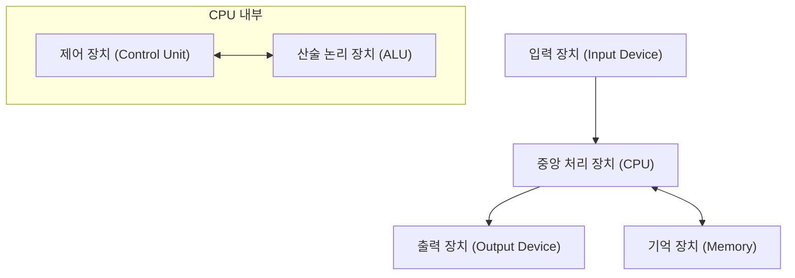

## 1. 머리말

존 폰 노이만(John von Neumann, 1903–1957)은 20세기를 대표하는 천재 수학자이며, 현대 과학의 모든 분야에 헤아릴 수 없는 영향을 미쳤습니다. 그의 업적은 순수 수학에 그치지 않고 양자역학, 게임 이론, 컴퓨터 과학, 경제학, 기상학, 나아가 원자폭탄 개발에 이르기까지 매우 다방면에 걸쳐 있습니다. 그 상식을 벗어난 계산 능력과 논리적 사고력 때문에 동시대 사람들은 그를 "악마의 두뇌" 또는 "화성인"이라 부르며 경외했습니다.

본 기사에서는 폰 노이만의 생애와 그의 지대한 업적, 그리고 그가 남긴 수많은 일화에 대해 자세히 해설합니다. 그가 어떤 사고방식을 가졌으며 어떻게 현대 사회의 기반을 구축했는지 깊이 탐구해 봅시다. 그가 남긴 발자취를 더듬어 가는 것은 현대 과학 발전의 역사 자체를 더듬어 가는 것과 다름없습니다.

## 2. 신동의 탄생: 부다페스트의 소년 시절

존 폰 노이만(헝가리명: 노이만 야노시 러요시)은 1903년 헝가리 부다페스트에서 유복한 유대계 은행가 가정에 태어났습니다. 유년기부터 그는 남다른 기억력과 계산 능력을 보였으며, 그야말로 **신동** 이라 부르기에 손색없는 재능을 발휘했습니다. 6세 때 8자리 나눗셈을 암산으로 해내고 8세 때 미적분을 마스터했다고 전해집니다. 또한 어학에도 매우 뛰어나 어려서부터 그리스어와 라틴어를 배웠고, 아버지와 고대 그리스어로 농담을 주고받기도 했습니다.

당시의 부다페스트는 문화와 학문의 세계적 중심지였으며, 많은 우수한 유대계 과학자들이 배출되었습니다. 유진 위그너, 레오 실라르드, 에드워드 텔러 등 훗날 미국에서 활약하는 과학자들은 노이만과 같은 부다페스트 출신이었고, 이들은 그 특이한 재능 때문에 통틀어 **화성인** (Martians)이라고 불리게 됩니다. 노이만은 이 뛰어난 지적 환경에서 자라 고등학교 시절에는 이미 수학 논문을 발표할 정도의 수준에 도달해 있었습니다.

## 3. 수학 기초에 대한 공헌: 공리적 집합론

노이만의 초기 업적 중 가장 중요한 것 중 하나가 집합론의 공리화에 관한 연구입니다. [게오르크 칸토어](https://kenji.blog/ko/p/cantor/)가 창시한 집합론은 수학의 기초로서 기대되었으나 러셀의 역설 등 논리적 모순(패러독스)에 직면해 있었습니다. 이 문제를 해결하기 위해 에른스트 체르멜로나 아돌프 프렝켈 등이 공리적 집합론을 구축하고 있었지만, 노이만은 전혀 다른 접근 방식을 취했습니다.

그는 '모임(Class)'이라는 개념을 도입하여 통상적인 집합과 너무 커서 집합이 될 수 없는 모임(진 고유 클래스)을 엄밀히 구별함으로써 역설을 멋지게 회피했습니다. 이 체계는 훗날 파울 베르나이스와 [쿠르트 괴델](https://kenji.blog/ko/p/godel/)에 의해 개량되어 현재는 **폰 노이만-베르나이스-괴델 집합론** (NBG 집합론)으로 알려져 있습니다.

$$
\forall X \ ( X \in V \iff \exists Y \ (X \in Y) )
$$

여기서 $V$ 는 **모든 집합의 클래스** ( $\text{만유 클래스}$ )를 나타냅니다. 이 기초적인 연구는 수학의 근간을 지탱하는 중요한 공헌이 되었습니다.

## 4. 양자역학의 수학적 기초 확립

1920년대 후반, 양자역학은 베르너 하이젠베르크의 '행렬역학'과 에르빈 슈뢰딩거의 '파동역학'이라는 겉보기에는 전혀 다른 두 가지 이론으로 발전하고 있었습니다. 노이만은 이 두 이론이 수학적으로 동치임을 증명하여 양자역학에 엄밀한 수학적 기초를 제공했습니다.

그는 **힐베르트 공간** 이론을 이용하여 물리량(관측 가능량)을 무한 차원 힐베르트 공간 상의 자기 수반 연산자로 정식화했습니다. 1932년에 출판된 저서 『양자역학의 수학적 기초』는 현대의 물리학자들에게도 바이블로 여겨지며, 양자역학의 표준적인 교과서로서 현재까지도 높이 평가받고 있습니다.

또한 혼합 상태를 기술하기 위해 **밀도 행렬** ( $\text{밀도 행렬}$ )의 개념을 도입하여 양자 통계역학의 기초를 다졌습니다.

$$
\rho = \sum_{i} p_i |\psi_i\rangle \langle\psi_i|
$$

여기서 $p_i$ 는 상태 $|\psi_i\rangle$ 를 취할 확률( $\text{확률의 가중치}$ )을 나타냅니다. 또한 양자 측정 이론에서의 '파동 묶음의 수축'이나 '관측 문제'에 대해서도 깊은 고찰을 수행했습니다.

## 5. 게임 이론과 경제 행동

노이만은 포커 등의 게임에서의 전략 분석에서 출발하여 '게임 이론'이라는 전혀 새로운 수학 분야를 창시했습니다. 1928년에 그는 2인 영합 유한 확정 완전 정보 게임에서 쌍방이 최적의 전략을 취할 경우 반드시 일정한 결과로 귀결된다는 **미니맥스 정리** 를 증명했습니다.

$$
\max_{x \in X} \min_{y \in Y} f(x, y) = \min_{y \in Y} \max_{x \in X} f(x, y)
$$

이 등식의 좌변은 '최악의 경우의 손실을 최소화하는' 전략( $\text{맥시민 전략}$ )을, 우변은 '상대의 최선의 수에 대해 자신의 이익을 최대화하는' 전략을 나타냅니다.

후에 경제학자 오스카 모르겐슈테른과 공저로 대저 『게임 이론과 경제 행동』(1944년)을 출판하여 경제학에 혁명을 가져왔습니다. 이는 인간의 합리적인 의사결정을 수학적으로 모델화하려는 시도로, 현재는 경제학뿐만 아니라 정치학, 생물학, 군사 전략 등 폭넓은 분야에서 응용되고 있습니다.

## 6. 컴퓨터 과학과 폰 노이만 구조

현대의 거의 모든 컴퓨터는 노이만이 고안한 **폰 노이만 구조** 에 기반하여 만들어져 있습니다. 그는 프로그램을 데이터로서 메모리에 기억시키고 그것을 순차적으로 읽어내어 실행하는 '내장 프로그램 방식'을 제창했습니다.

이 아키텍처는 다음과 같은 주요 요소로 구성됩니다.

노이만은 펜실베이니아 대학의 EDVAC 개발 프로젝트에 참여하여 이 획기적인 개념을 「EDVAC에 관한 보고서 제1초안」으로 정리했습니다. 이를 통해 하드웨어의 배선을 물리적으로 다시 하지 않고 소프트웨어(프로그램)를 고쳐 쓰는 것만으로 다양한 계산을 수행할 수 있는 범용 컴퓨터가 실현되었습니다. 현대의 IT 사회는 그가 구축한 이 기반 위에 성립되어 있습니다.

## 7. 셀룰러 오토마타와 자기 증식 기계 이론

말년에 노이만은 생명의 자기 증식 메커니즘을 수학적으로 모델화하는 것에 강한 관심을 가졌습니다. 그는 동료인 스타니스와프 울람의 조언을 받아 공간을 격자 모양으로 분할하고 각 격자가 일정한 규칙에 따라 상태를 변화시키는 **셀룰러 오토마타** 의 개념을 고안했습니다.

그는 29개의 상태를 가지는 셀을 이용하여 자기 증식하는 기계(유니버설 컨스트럭터)가 이론적으로 가능함을 엄밀히 증명했습니다. 이는 DNA의 이중 나선 구조가 발견되기 전의 일이며, 생명의 유전적 메커니즘이나 정보 전달 구조를 정보과학적인 시점에서 예언한 것이라 할 수 있습니다. 그의 사후에 이 이론은 인공 생명 연구로 이어졌습니다.

## 8. 맨해튼 프로젝트와 유체 역학에 대한 공헌

제2차 세계대전 중 노이만은 로스앨러모스 국립 연구소에서 원자폭탄 개발을 위한 '맨해튼 프로젝트'에 참여했습니다. 그는 유체 역학과 충격파 계산에서 중심적인 역할을 완수하였으며, 플루토늄형 원폭(팻 맨)의 내폭 렌즈 설계에 불가결한 복잡한 계산을 수행했습니다. 그가 고안한 충격파의 상호작용에 관한 이론과 압도적인 계산 능력이 없었다면 개발은 대폭 지연되었을 것이라고 전해집니다.

전후에도 그는 미국 정부의 군사 및 과학 정책의 최고 고문으로서 강력한 영향력을 유지했으며, 대륙간 탄도 미사일 개발이나 기상 예측의 수치 계산(세계 최초의 컴퓨터에 의한 일기예보) 등 국가적 프로젝트를 견인했습니다.

## 9. "화성인"이라 불린 남자: 천재의 기구한 일화

노이만의 초인적인 두뇌에 얽힌 일화는 셀 수 없을 정도로 많이 남아 있습니다.

* **경이로운 계산 속도**: 초기의 전자계산기인 ENIAC이 계산한 결과가 맞는지 확인하기 위해 노이만이 암산으로 검산을 수행했는데, 노이만이 더 빨리 계산을 끝냈다는 전설이 있습니다.
* **완벽한 사진 기억**: 그는 한 번 읽은 책이나 전화번호부의 내용을 토씨 하나 틀리지 않고 기억했습니다. 수십 년 후에 "『두 도시 이야기』의 서두를 암송해 달라"는 부탁을 받았을 때 친구가 말릴 때까지 수십 분간 완벽하게 암송을 계속했다고 전해집니다.
* **운전과 소음**: 그는 자동차 운전을 매우 못해서 빈번하게 사고를 냈습니다. "나무가 비켜주지 않았다"고 변명했다는 일화가 있습니다. 또한 정적보다는 시끄러운 환경을 선호하여 사무실에서 큰 소리로 독일 행진곡을 틀어 놓은 채로 복잡한 수학 연구를 진행하곤 했습니다.
* **화성인 농담**: 그의 물리학자 동료들은 "노이만은 인간인 척하며 지구에 살고 있는 화성인이다. 그러나 그는 완벽하게 인간인 척을 할 수 있다"며 진심 섞인 농담을 하곤 했습니다.

## 10. 주요 저서와 논문

노이만이 생전에 남긴 저서나 논문은 다방면에 걸쳐 있지만, 여기서는 특히 후세에 큰 영향을 미친 대표적인 것들을 소개합니다.

1. **『양자역학의 수학적 기초』 (Mathematical Foundations of Quantum Mechanics, 1932)**
   양자역학을 힐베르트 공간의 이론을 이용하여 엄밀하게 정식화한 기념비적 저작.
2. **『게임 이론과 경제 행동』 (Theory of Games and Economic Behavior, 1944)**
   오스카 모르겐슈테른과의 공저. 제로섬 게임부터 협력 게임까지를 체계적으로 논한 대저.
3. **『컴퓨터와 뇌』 (The Computer and the Brain, 1958)**
   노이만의 사후에 출판된 미완성의 유고. 인간 뇌의 신경망과 디지털 컴퓨터의 구조를 비교한 선구적 저작.
4. **『자기 증식 오토마타의 이론』 (Theory of Self-Reproducing Automata, 1966)**
   아서 버크스가 노이만의 유고를 편찬한 것.

## 11. 존 폰 노이만 약식 연표

다음은 존 폰 노이만의 생애와 주요 업적을 정리한 상세 연표입니다.

* **1903년**: 헝가리 왕국 부다페스트에서 탄생.
* **1911년**: 루터교 김나지움에 입학.
* **1921년**: 부다페스트 대학에 입학하여 수학을 전공. 동시에 베를린 대학과 취리히 연방 공과대학교에서 화학을 배움.
* **1926년**: 부다페스트 대학에서 수학 박사 학위 취득.
* **1928년**: 미니맥스 정리를 증명하고 게임 이론의 기초를 다짐.
* **1930년**: 프린스턴 대학의 객원 교수로 미국에 건너감.
* **1932년**: 저서 『양자역학의 수학적 기초』 출판.
* **1933년**: 프린스턴 고등연구소의 종신 교수로 임명됨. 알베르트 아인슈타인 등과 함께 극초기 멤버가 됨.
* **1937년**: 미합중국 시민권 취득.
* **1943년**: 맨해튼 프로젝트에 참여하여 내폭 렌즈 계산을 주도함.
* **1944년**: 『게임 이론과 경제 행동』 출판.
* **1945년**: 「EDVAC에 관한 보고서 제1초안」을 집필하여 내장 프로그램 방식을 제창.
* **1948년**: 셀룰러 오토마타 이론과 자기 증식 기계의 구상을 발표.
* **1951년**: 미국 수학회 회장 취임.
* **1954년**: 미국 원자력 위원회 위원으로 임명됨.
* **1955년**: 골육종(또는 췌장암) 진단을 받고 투병 생활에 들어감.
* **1957년**: 워싱턴 D.C.의 월터 리드 육군 병원에서 사망. 향년 53세.

## 12. 맺음말

존 폰 노이만은 1957년에 암으로 인해 53세의 젊은 나이로 세상을 떠났습니다. 그러나 그가 남긴 지적 유산은 현대의 수학, 물리학, 경제학, 그리고 정보 기술의 기반으로서 지금도 굳건히 살아 숨 쉬고 있습니다. 우리가 매일 사용하는 스마트폰이나 컴퓨터부터 최첨단 인공지능(AI) 기술, 그리고 사회과학의 분석 수법에 이르기까지 도처에서 노이만의 "악마의 두뇌"의 편린을 엿볼 수 있습니다. 그의 생애를 되돌아봄으로써 우리는 인간 지성의 무한한 가능성과 그것이 세계에 미치는 영향의 크기를 새삼 실감하게 됩니다. 인류 역사상 그토록 다방면에 걸쳐 근본적인 패러다임의 전환을 일으킨 인물은 달리 찾아볼 수 없습니다.
