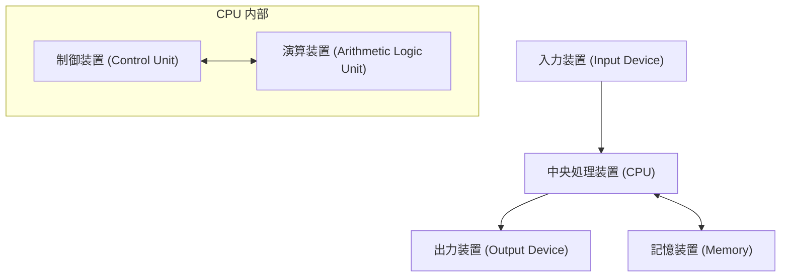

## 1. はじめに

[ジョン・フォン・ノイマン](https://kenji.blog/p/von-neumann/)（John von Neumann, 1903–1957）は、20世紀を代表する天才数学者であり、現代科学のあらゆる分野に計り知れない影響を与えました。彼の業績は純粋数学にとどまらず、量子力学、ゲーム理論、コンピュータ科学、経済学、気象学、さらには原子爆弾の開発に至るまで、極めて多岐にわたります。その常軌を逸した計算能力と論理的思考力から、同時代の人々からは「悪魔の頭脳」や「火星人」と呼ばれ畏怖されていました。

本記事では、[フォン・ノイマン](https://kenji.blog/p/von-neumann/)の生涯とその多大なる業績、そして彼が遺した数々の逸話について詳しく解説します。彼がどのような思考を持ち、どのようにして現代社会の基盤を築いたのかを深く探求していきましょう。彼の残した足跡をたどることは、現代科学の発展の歴史そのものをたどることに他なりません。

## 2. 神童の誕生：ブダペストの少年時代

[ジョン・フォン・ノイマン](https://kenji.blog/p/von-neumann/)（ハンガリー名：ヤーノシュ・ラヨシュ・ノイマン）は、1903年にハンガリーのブダペストで裕福なユダヤ系銀行家の家庭に生まれました。幼少期から彼は並外れた記憶力と計算能力を示し、まさに **神童** と呼ぶにふさわしい才能を発揮しました。6歳で8桁の割り算を暗算で行い、8歳で微積分をマスターしたと言われています。また、語学にも非常に堪能で、幼い頃からギリシャ語やラテン語を学び、父親と古典ギリシャ語で冗談を言い合うこともありました。

当時のブダペストは文化と学問の世界的中心地であり、多くの優秀なユダヤ系科学者が輩出されました。ユージン・ウィグナー、レオ・シラード、エドワード・テラーなど、後にアメリカで活躍する科学者たちは、ノイマンと同じブダペストの出身であり、彼らはその特異な才能からまとめて **火星人** （Martians）と呼ばれることになります。ノイマンはこの優れた知的な環境で育ち、高校時代にはすでに数学の論文を発表するほどのレベルに達していました。

## 3. 数学の基礎への貢献：公理的集合論

ノイマンの初期の業績の中で最も重要なもののひとつが、集合論の公理化に関する研究です。[ゲオルク・カントール](https://kenji.blog/p/cantor/)によって創始された集合論は、数学の基礎として期待されていましたが、ラッセルのパラドックスなどの論理的矛盾（パラドックス）に直面していました。この問題を解決するため、エルンスト・ツェルメロやアドルフ・フレンケルらが公理的集合論を構築していましたが、ノイマンはさらに別のアプローチを取りました。

彼は「クラス」という概念を導入し、通常の集合と、大きすぎて集合にはなれないクラス（真のクラス）を厳密に区別することでパラドックスを見事に回避しました。この体系は後にパウル・ベルナイスや[クルト・ゲーデル](https://kenji.blog/p/godel/)によって改良され、現在では **ノイマン＝ベルナイス＝[ゲーデル](https://kenji.blog/p/godel/)集合論** （NBG集合論）として知られています。

$$
\forall X \ ( X \in V \iff \exists Y \ (X \in Y) )
$$

ここで $V$ は **すべての集合のクラス** ( $\text{万有クラス}$ ) を表します。この基礎的な研究は、数学の根底を支える重要な貢献となりました。

## 4. 量子力学の数学的基礎付け

1920年代後半、量子力学はヴェルナー・ハイゼンベルクの「行列力学」と、エルヴィン・シュレーディンガーの「波動力学」という、一見すると全く異なる2つの理論として発展していました。ノイマンは、これら2つの理論が数学的に等価であることを証明し、量子力学に厳密な数学的基礎を与えました。

彼は **ヒルベルト空間** の理論を用いて、物理量（オブザーバブル）を無限次元ヒルベルト空間上の自己共役作用素として定式化しました。1932年に出版された著書『量子力学の数学的基礎』は、現代の物理学者にとってもバイブルとされており、量子力学の標準的な教科書として現在でも高く評価されています。

また、混合状態を記述するために **密度行列** ( $\text{density matrix}$ ) の概念を導入し、量子統計力学の基礎を築きました。

$$
\rho = \sum_{i} p_i |\psi_i\rangle \langle\psi_i|
$$

ここで $p_i$ は状態 $|\psi_i\rangle$ をとる確率（ $\text{確率の重み}$ ）を表します。また、量子測定理論における「波束の収縮」や「観測問題」についても深い考察を行いました。

## 5. ゲーム理論と経済行動

ノイマンは、ポーカーなどのゲームにおける戦略の分析から出発し、「ゲーム理論」という全く新しい数学の分野を創始しました。1928年に彼は、2人零和有限確定完全情報ゲームにおいて、双方が最適な戦略をとった場合に必ず一定の結果に落ち着くという **ミニマックス定理** を証明しました。

$$
\max_{x \in X} \min_{y \in Y} f(x, y) = \min_{y \in Y} \max_{x \in X} f(x, y)
$$

この等式の左辺は「最悪の場合の損失を最小にする」戦略 ( $\text{マキシミン戦略}$ ) を、右辺は「相手の最善の手に対して自分の利益を最大にする」戦略を表しています。

後に経済学者のオスカー・モルゲンシュテルンと共著で大著『ゲーム理論と経済行動』（1944年）を出版し、経済学に革命をもたらしました。これは、人間の合理的な意思決定を数学的にモデル化する試みであり、現在では経済学だけでなく、政治学、生物学、軍事戦略など幅広い分野で応用されています。

## 6. コンピュータ科学と[フォン・ノイマン](https://kenji.blog/p/von-neumann/)・アーキテクチャ

現代のほとんどすべてのコンピュータは、ノイマンが考案した **[フォン・ノイマン](https://kenji.blog/p/von-neumann/)・アーキテクチャ** に基づいて作られています。彼は、プログラムをデータとしてメモリに記憶させ、それを順次読み出して実行する「プログラム内蔵方式」を提唱しました。

このアーキテクチャは、以下の主要な要素から構成されます。

ノイマンは、ペンシルベニア大学のEDVAC開発プロジェクトに参加し、この画期的な概念を「EDVACに関する報告書の第1草稿」としてまとめました。これにより、ハードウェアの配線を物理的にやり直すことなく、ソフトウェア（プログラム）を書き換えるだけで様々な計算を行える汎用コンピュータが実現しました。現代のIT社会は、彼が構築したこの基盤の上に成り立っています。

## 7. セルオートマトンと自己増殖機械の理論

晩年、ノイマンは生命の自己増殖のメカニズムを数学的にモデル化することに強い関心を抱きました。彼は同僚のスタニスワフ・ウラムの助言を受け、空間を格子状に分割し、各格子が一定の規則に従って状態を変化させる **セルオートマトン** の概念を考案しました。

彼は、29の状態を持つセルを用いて、自己増殖する機械（ユニバーサル・コンストラクター）が理論的に可能であることを厳密に証明しました。これは、DNAの二重らせん構造が発見される前のことであり、生命の遺伝的メカニズムや情報伝達の仕組みを情報科学的な視点から予言したものと言えます。彼の死後、この理論は人工生命の研究へと繋がりました。

## 8. マンハッタン計画と流体力学への貢献

第二次世界大戦中、ノイマンはロスアラモス国立研究所で原子爆弾開発のための「マンハッタン計画」に参加しました。彼は流体力学と衝撃波の計算において中心的な役割を果たし、プルトニウム型原爆（ファットマン）の爆縮レンズの設計に不可欠な複雑な計算を遂行しました。彼の考案した衝撃波の相互作用に関する理論と圧倒的な計算能力がなければ、開発は大幅に遅れていたと言われています。

戦後も彼はアメリカ政府の軍事および科学政策の最高顧問として強い影響力を持ち続け、弾道ミサイルの開発や気象予測の数値計算（世界初のコンピュータによる天気予報）など、国家的プロジェクトを牽引しました。

## 9. 「火星人」と呼ばれた男：天才の数奇な逸話

ノイマンの超人的な頭脳にまつわる逸話は数え切れないほど残されています。

* **驚異的な計算力** ：初期の電子計算機であるENIACが計算した結果が正しいかどうかを確かめるため、ノイマンが暗算で検算を行ったところ、ノイマンの方が早く計算を終えたという伝説があります。
* **完全な写真記憶** ：彼は一度読んだ本や電話帳の内容を一言一句違わず記憶していました。数十年後に「『二都物語』の冒頭を暗唱してほしい」と頼まれた際、友人が止めるまで数十分間も完璧に暗唱し続けたと言われています。
* **運転と騒音** ：彼は車の運転が非常に下手であり、頻繁に事故を起こしていました。「木が避けてくれなかった」と言い訳をしたというエピソードがあります。また、静寂よりも騒々しい環境を好み、オフィスで大音量でドイツのマーチ音楽をかけながら複雑な数学の研究を行っていました。
* **火星人のジョーク** ：同僚の物理学者たちは、「ノイマンは人間のふりをして地球に住んでいる火星人だ。しかし、彼は完璧に人間のふりをすることができる」と本気交じりの冗談で語っていました。

## 10. 主要な著書と論文

ノイマンが生前に残した著書や論文は多岐にわたりますが、ここでは特に後世に大きな影響を与えた代表的なものを紹介します。

1. **『量子力学の数学的基礎』 (Mathematical Foundations of Quantum Mechanics, 1932)**
   量子力学をヒルベルト空間の理論を用いて厳密に定式化した記念碑的著作。
2. **『ゲーム理論と経済行動』 (Theory of Games and Economic Behavior, 1944)**
   オスカー・モルゲンシュテルンとの共著。ゼロサムゲームから協力ゲームまでを体系的に論じた大著。
3. **『計算機と脳』 (The Computer and the Brain, 1958)**
   ノイマンの死後に出版された未完の遺稿。人間の脳の神経回路網と、デジタルコンピュータの仕組みを比較した先駆的著作。
4. **『自己増殖オートマトンの理論』 (Theory of Self-Reproducing Automata, 1966)**
   アーサー・バークスがノイマンの遺稿を編纂したもの。

## 11. [ジョン・フォン・ノイマン](https://kenji.blog/p/von-neumann/) 略年表

以下は、[ジョン・フォン・ノイマン](https://kenji.blog/p/von-neumann/)の生涯と主要な業績をまとめた詳細な年表です。

* **1903年** ：ハンガリー王国ブダペストにて誕生。
* **1911年** ：ルター派のギムナジウムに入学。
* **1921年** ：ブダペスト大学に入学し数学を専攻。同時にベルリン大学やチューリッヒ工科大学で化学を学ぶ。
* **1926年** ：ブダペスト大学で数学の博士号を取得。
* **1928年** ：ミニマックス定理を証明し、ゲーム理論の基礎を築く。
* **1930年** ：プリンストン大学の客員教授としてアメリカへ渡る。
* **1932年** ：著書『量子力学の数学的基礎』を出版。
* **1933年** ：プリンストン高等研究所の終身教授に任命される。アルベルト・アインシュタインらと共に最初期のメンバーとなる。
* **1937年** ：アメリカ合衆国の市民権を取得。
* **1943年** ：マンハッタン計画に参加し、爆縮レンズの計算を主導する。
* **1944年** ：『ゲーム理論と経済行動』を出版。
* **1945年** ：「EDVACに関する報告書の第1草稿」を執筆し、プログラム内蔵方式を提唱。
* **1948年** ：セルオートマトンの理論と自己増殖機械の構想を発表。
* **1951年** ：アメリカ数学会会長に就任。
* **1954年** ：アメリカ原子力委員会の委員に任命される。
* **1955年** ：骨肉腫（または膵臓癌）と診断され、闘病生活に入る。
* **1957年** ：ワシントンD.C.のウォルター・リード陸軍病院にて死去。享年53歳。

## 12. おわりに

[ジョン・フォン・ノイマン](https://kenji.blog/p/von-neumann/)は、1957年に癌のため53歳の若さでこの世を去りました。しかし、彼が残した知的遺産は、現代の数学、物理学、経済学、そして情報技術の基盤として今もなお強固に生き続けています。私たちが日々使用しているスマートフォンやコンピュータから、最先端の人工知能（AI）技術、そして社会科学の分析手法に至るまで、至る所にノイマンの「悪魔の頭脳」の片鱗を見ることができます。彼の生涯を振り返ることで、私たちは人間の知性の無限の可能性と、それが世界に与える影響の大きさを改めて実感させられます。人類史において、彼ほど多岐にわたる分野で根本的なパラダイムシフトを起こした人物は他に見当たりません。
