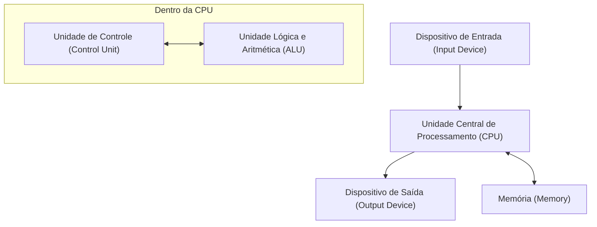

## 1. Introdução

John von Neumann (1903–1957) foi um gênio matemático que representou o século XX e teve um impacto imensurável em todos os campos da ciência moderna. Suas realizações foram muito além da matemática pura, estendendo-se à mecânica quântica, teoria dos jogos, ciência da computação, economia, meteorologia e até mesmo ao desenvolvimento da bomba atômica. Devido à sua extraordinária capacidade de cálculo e pensamento lógico, seus contemporâneos o temiam e respeitavam, chamando-o de "Cérebro Demoníaco" e de "Marciano".

Este artigo explicará em detalhes a vida de von Neumann, suas tremendas realizações e as inúmeras anedotas que ele deixou para trás. Vamos explorar profundamente que tipo de pensamento ele tinha e como ele construiu as bases da sociedade moderna. Refazer seus passos não é nada menos do que refazer a própria história do desenvolvimento da ciência moderna.

## 2. Nascimento de um Prodígio: Infância em Budapeste

John von Neumann (nome húngaro: Neumann János Lajos) nasceu em 1903 em Budapeste, Hungria, em uma rica família de banqueiros judeus. Desde muito jovem, ele mostrou uma memória e capacidade de cálculo extraordinárias, exibindo verdadeiramente talentos dignos de serem chamados de **prodígio**. Diz-se que ele podia realizar divisões de oito dígitos mentalmente aos 6 anos de idade, e dominava o cálculo aos 8. Ele também era altamente proficiente em idiomas, aprendendo grego e latim desde cedo, e até trocava piadas em grego clássico com seu pai.

Na época, Budapeste era um centro global de cultura e erudição, produzindo muitos cientistas judeus brilhantes. Eugene Wigner, Leo Szilard, Edward Teller e outros cientistas que mais tarde se tornaram ativos nos Estados Unidos eram todos de Budapeste como von Neumann, e devido a seus talentos únicos, eles foram chamados coletivamente de **Marcianos** (Martians). Von Neumann cresceu neste excelente ambiente intelectual, atingindo um nível onde já publicava artigos matemáticos no ensino médio.

## 3. Contribuições para os Fundamentos da Matemática: Teoria Axiomática dos Conjuntos

Uma das realizações iniciais mais importantes de von Neumann foi sua pesquisa sobre a axiomatização da teoria dos conjuntos. Esperava-se que a teoria dos conjuntos, fundada por [Georg Cantor](https://kenji.blog/p/cantor/), fosse o fundamento da matemática, mas ela enfrentava contradições lógicas (paradoxos) como o paradoxo de Russell. Para resolver esse problema, Ernst Zermelo, Adolf Fraenkel e outros estavam construindo a teoria axiomática dos conjuntos, mas von Neumann adotou uma abordagem diferente.

Ele introduziu o conceito de "classes" e evitou brilhantemente os paradoxos distinguindo estritamente entre conjuntos normais e classes que são grandes demais para serem conjuntos (classes próprias). Este sistema foi posteriormente melhorado por Paul Bernays e [Kurt Gödel](https://kenji.blog/p/godel/), e agora é conhecido como a **teoria dos conjuntos de von Neumann-Bernays-Gödel** (teoria dos conjuntos NBG).

$$
\forall X \ ( X \in V \iff \exists Y \ (X \in Y) )
$$

Aqui, $V$ representa a **classe de todos os conjuntos** ( $\text{classe universal}$ ). Esta pesquisa fundamental tornou-se uma importante contribuição que apoia as raízes da matemática.

## 4. Fundamentos Matemáticos da Mecânica Quântica

No final da década de 1920, a mecânica quântica estava se desenvolvendo como duas teorias aparentemente completamente diferentes: a "mecânica matricial" de Werner Heisenberg e a "mecânica ondulatória" de Erwin Schrödinger. Von Neumann provou que essas duas teorias eram matematicamente equivalentes, dando à mecânica quântica uma base matemática estrita.

Usando a teoria do **espaço de Hilbert**, ele formulou quantidades físicas (observáveis) como operadores autoadjuntos em um espaço de Hilbert de dimensão infinita. Seu livro "Fundamentos Matemáticos da Mecânica Quântica", publicado em 1932, é considerado uma bíblia até mesmo para os físicos modernos e ainda é altamente considerado hoje como um livro-texto padrão para a mecânica quântica.

Ele também introduziu o conceito de **matriz de densidade** ( $\text{matriz de densidade}$ ) para descrever estados mistos, lançando as bases da mecânica estatística quântica.

$$
\rho = \sum_{i} p_i |\psi_i\rangle \langle\psi_i|
$$

Aqui, $p_i$ representa a probabilidade ( $\text{peso de probabilidade}$ ) de assumir o estado $|\psi_i\rangle$. Ele também conduziu profundas considerações sobre o "colapso do pacote de ondas" e o "problema da medição" na teoria da medição quântica.

## 5. Teoria dos Jogos e Comportamento Econômico

Partindo da análise de estratégias em jogos como o pôquer, von Neumann fundou um campo da matemática inteiramente novo chamado "Teoria dos Jogos". Em 1928, ele provou o **teorema minimax**, que afirma que em um jogo finito de soma zero para duas pessoas com informação perfeita, se ambos os lados adotarem estratégias ideais, o resultado sempre se estabelecerá em um determinado resultado.

$$
\max_{x \in X} \min_{y \in Y} f(x, y) = \min_{y \in Y} \max_{x \in X} f(x, y)
$$

O lado esquerdo desta equação representa a estratégia para "minimizar a perda no pior caso" ( $\text{estratégia maximin}$ ), e o lado direito representa a estratégia para "maximizar o próprio lucro contra o melhor movimento do oponente".

Mais tarde, ele foi coautor da obra monumental "Teoria dos Jogos e Comportamento Econômico" (1944) com o economista Oskar Morgenstern, revolucionando a economia. Esta foi uma tentativa de modelar matematicamente a tomada de decisão humana racional e, hoje, é aplicada em uma ampla gama de campos, não apenas na economia, mas também na ciência política, biologia e estratégia militar.

## 6. Ciência da Computação e a Arquitetura de von Neumann

Quase todos os computadores modernos são construídos com base na **arquitetura de von Neumann** que ele concebeu. Ele propôs o "conceito de programa armazenado", onde os programas são armazenados na memória como dados e lidos e executados sequencialmente.

Esta arquitetura consiste nos seguintes elementos principais:

Von Neumann participou do projeto de desenvolvimento do EDVAC na Universidade da Pensilvânia e resumiu este conceito inovador no "Primeiro Esboço de um Relatório sobre o EDVAC". Isso tornou possível realizar um computador de uso geral que pode realizar vários cálculos simplesmente reescrevendo o software (programa) sem precisar refazer fisicamente a fiação do hardware. A sociedade de TI moderna é construída sobre esta base que ele estabeleceu.

## 7. Autômatos Celulares e a Teoria das Máquinas Autorreplicantes

Em seus últimos anos, von Neumann teve um forte interesse em modelar matematicamente os mecanismos da autorreplicação biológica. Com o conselho de seu colega Stanislaw Ulam, ele concebeu o conceito de **autômatos celulares**, em que o espaço é dividido em uma grade e cada célula da grade muda de estado de acordo com uma determinada regra.

Usando células com 29 estados, ele provou rigorosamente que uma máquina autorreplicante (construtor universal) é teoricamente possível. Isso foi antes da descoberta da estrutura de dupla hélice do DNA, e pode-se dizer que ele previu os mecanismos genéticos e os sistemas de transmissão de informação da vida a partir da perspectiva da ciência da informação. Após sua morte, esta teoria levou à pesquisa em vida artificial.

## 8. O Projeto Manhattan e as Contribuições para a Dinâmica de Fluidos

Durante a Segunda Guerra Mundial, von Neumann participou do "Projeto Manhattan" para o desenvolvimento da bomba atômica no Laboratório Nacional de Los Alamos. Ele desempenhou um papel central na dinâmica de fluidos e cálculos de ondas de choque, realizando os cálculos complexos essenciais para o projeto das lentes explosivas da bomba atômica do tipo plutônio (Fat Man). Diz-se que, sem sua teoria sobre a interação de ondas de choque e sua extraordinária capacidade de cálculo, o desenvolvimento teria sido significativamente adiado.

Mesmo após a guerra, ele continuou a ter forte influência como conselheiro máximo em política militar e científica para o governo dos EUA, liderando projetos nacionais como o desenvolvimento de mísseis balísticos e previsão numérica do tempo (a primeira previsão do tempo feita por computador do mundo).

## 9. O Homem Chamado "Marciano": Anedotas Extraordinárias de um Gênio

Existem inúmeras anedotas em torno do cérebro sobre-humano de von Neumann.

* **Velocidade de Cálculo Impressionante**: Para verificar se os resultados calculados pelo ENIAC (um dos primeiros computadores eletrônicos) estavam corretos, von Neumann realizava cálculos mentais para verificá-los, e a lenda diz que von Neumann terminava de calcular mais rápido.
* **Memória Fotográfica Perfeita**: Ele conseguia memorizar o conteúdo de livros e listas telefônicas palavra por palavra depois de lê-los uma vez. Quando lhe pediram para "recitar o começo de Um Conto de Duas Cidades" décadas depois, diz-se que ele continuou a recitá-lo perfeitamente por dezenas de minutos até que seu amigo o impedisse.
* **Direção e Barulho**: Ele era um motorista muito ruim e frequentemente causava acidentes. Há uma anedota em que ele deu a desculpa: "As árvores não saíram do meu caminho." Ele também preferia ambientes barulhentos ao silêncio e conduzia pesquisas matemáticas complexas enquanto tocava música de marcha alemã em alto volume em seu escritório.
* **Piada Marciana**: Seus colegas físicos brincavam meio a sério: "Von Neumann é um marciano que vive na Terra fingindo ser humano. No entanto, ele é capaz de imitar um humano perfeitamente."

## 10. Principais Livros e Artigos

Os livros e artigos que von Neumann deixou para trás durante sua vida são diversos, mas aqui apresentamos obras representativas que tiveram um impacto particularmente significativo nas gerações posteriores.

1. **Fundamentos Matemáticos da Mecânica Quântica (1932)**
   Uma obra monumental que formulou estritamente a mecânica quântica usando a teoria dos espaços de Hilbert.
2. **Teoria dos Jogos e Comportamento Econômico (1944)**
   Em coautoria com Oskar Morgenstern. Uma obra-prima que discutiu sistematicamente tudo, desde jogos de soma zero até jogos cooperativos.
3. **O Computador e o Cérebro (1958)**
   Um manuscrito inacabado publicado postumamente. Uma obra pioneira que compara as redes neurais do cérebro humano com os mecanismos dos computadores digitais.
4. **Teoria dos Autômatos Autorreplicantes (1966)**
   Compilado e publicado a partir dos manuscritos póstumos de von Neumann por Arthur Burks.

## 11. John von Neumann: Breve Cronologia

A seguir, uma linha do tempo detalhada resumindo a vida e as principais realizações de John von Neumann.

* **1903**: Nasce em Budapeste, Reino da Hungria.
* **1911**: Ingressa em um ginásio luterano.
* **1921**: Ingressa na Universidade de Budapeste, com especialização em matemática. Estuda simultaneamente química na Universidade de Berlim e no ETH de Zurique.
* **1926**: Obtém o doutorado em matemática pela Universidade de Budapeste.
* **1928**: Prova o teorema minimax, lançando as bases da teoria dos jogos.
* **1930**: Muda-se para os Estados Unidos como professor visitante na Universidade de Princeton.
* **1932**: Publica "Fundamentos Matemáticos da Mecânica Quântica".
* **1933**: Nomeado professor vitalício no Instituto de Estudos Avançados de Princeton. Torna-se um de seus membros iniciais ao lado de Albert Einstein e outros.
* **1937**: Adquire a cidadania dos Estados Unidos da América.
* **1943**: Participa do Projeto Manhattan, liderando os cálculos das lentes explosivas.
* **1944**: Publica "Teoria dos Jogos e Comportamento Econômico".
* **1945**: Escreve o "Primeiro Esboço de um Relatório sobre o EDVAC", propondo o conceito de programa armazenado.
* **1948**: Anuncia a teoria dos autômatos celulares e o conceito de máquinas autorreplicantes.
* **1951**: Torna-se presidente da Sociedade Americana de Matemática.
* **1954**: Nomeado membro da Comissão de Energia Atômica dos Estados Unidos.
* **1955**: Diagnosticado com câncer ósseo (ou câncer de pâncreas) e inicia uma batalha contra a doença.
* **1957**: Morre no Walter Reed Army Medical Center em Washington, D.C., aos 53 anos.

## 12. Conclusão

John von Neumann faleceu em 1957 com a tenra idade de 53 anos devido a um câncer. No entanto, o legado intelectual que ele deixou ainda sobrevive fortemente hoje como a base da matemática, física, economia e tecnologia da informação modernas. Dos smartphones e computadores que usamos todos os dias à tecnologia de inteligência artificial (IA) de ponta e métodos analíticos nas ciências sociais, vislumbres do "Cérebro Demoníaco" de von Neumann podem ser vistos em todos os lugares. Refletir sobre sua vida nos faz perceber mais uma vez as infinitas possibilidades do intelecto humano e a magnitude de seu impacto no mundo. Na história da humanidade, ninguém mais causou mudanças de paradigma fundamentais em uma gama tão ampla de campos como ele.
