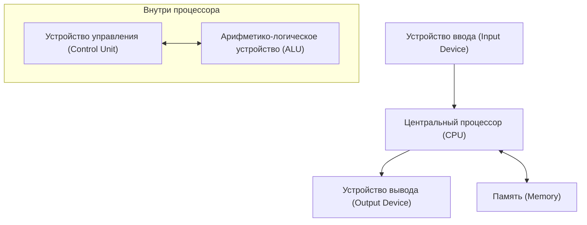

## 1. Введение

Джон фон Нейман (1903–1957) был гениальным математиком, который олицетворял 20-й век и оказал неизмеримое влияние на все области современной науки. Его достижения выходили далеко за рамки чистой математики, распространяясь на квантовую механику, теорию игр, информатику, экономику, метеорологию и даже разработку атомной бомбы. Из-за его выдающихся вычислительных способностей и логического мышления современники боялись и уважали его, называя "Демоническим мозгом" и "Марсианином".

В этой статье будет подробно рассказано о жизни фон Неймана, его колоссальных достижениях и многочисленных историях, которые он оставил после себя. Давайте глубоко изучим, какое у него было мышление и как он заложил основы современного общества. Проследить за его шагами — значит проследить саму историю развития современной науки.

## 2. Рождение вундеркинда: Детство в Будапеште

Джон фон Нейман (венгерское имя: Нейман Янош Лайош) родился в 1903 году в Будапеште, Венгрия, в богатой семье еврейского банкира. С юных лет он демонстрировал выдающуюся память и вычислительные способности, по-настоящему проявляя таланты, достойные называться **вундеркиндом**. Говорят, что он мог выполнять в уме деление восьмизначных чисел в 6 лет, а в 8 лет освоил математический анализ. Он также отлично владел языками, с раннего возраста изучая греческий и латынь, и даже обменивался шутками на древнегреческом со своим отцом.

В то время Будапешт был мировым центром культуры и науки, выпустившим многих блестящих еврейских ученых. Юджин Вигнер, Лео Силард, Эдвард Теллер и другие ученые, которые позже стали активными в Соединенных Штатах, все были из Будапешта, как и фон Нейман, и из-за их уникальных талантов их коллективно называли **Марсианами** (Martians). Фон Нейман вырос в этой превосходной интеллектуальной среде, достигнув уровня, когда он уже публиковал математические статьи в старшей школе.

## 3. Вклад в основы математики: Аксиоматическая теория множеств

Одним из наиболее важных ранних достижений фон Неймана были его исследования по аксиоматизации теории множеств. Ожидалось, что теория множеств, основанная Георгом Кантором, станет фундаментом математики, но она столкнулась с логическими противоречиями (парадоксами), такими как [парадокс Рассела](/ru/p/russells-paradox/). Чтобы решить эту проблему, Эрнст Цермело, Адольф Френкель и другие создавали аксиоматическую теорию множеств, но фон Нейман применил другой подход.

Он ввел понятие "классов" и блестяще избежал парадоксов, строго различая обычные множества и классы, которые слишком велики, чтобы быть множествами (собственные классы). Эта система была позже усовершенствована Паулем Бернайсом и Куртом Гёделем и теперь известна как **теория множеств фон Неймана — Бернайса — Гёделя** (теория множеств NBG).

$$
\forall X \ ( X \in V \iff \exists Y \ (X \in Y) )
$$

Здесь $V$ представляет собой **класс всех множеств** ( $\text{универсальный класс}$ ). Это фундаментальное исследование стало важным вкладом, поддерживающим корни математики.

## 4. Математические основы квантовой механики

В конце 1920-х годов квантовая механика развивалась в виде двух, казалось бы, совершенно разных теорий: "матричной механики" Вернера Гейзенберга и "волновой механики" Эрвина Шрёдингера. Фон Нейман доказал, что эти две теории математически эквивалентны, дав квантовой механике строгую математическую основу.

Используя теорию **гильбертова пространства**, он сформулировал физические величины (наблюдаемые) как самосопряженные операторы в бесконечномерном гильбертовом пространстве. Его книга "Математические основы квантовой механики", опубликованная в 1932 году, считается библией даже для современных физиков и до сих пор высоко ценится как стандартный учебник по квантовой механике.

Он также ввел понятие **матрицы плотности** ( $\text{матрица плотности}$ ) для описания смешанных состояний, заложив основы квантовой статистической механики.

$$
\rho = \sum_{i} p_i |\psi_i\rangle \langle\psi_i|
$$

Здесь $p_i$ представляет собой вероятность ( $\text{вероятностный вес}$ ) принятия состояния $|\psi_i\rangle$. Он также провел глубокие размышления о "коллапсе волнового пакета" и "проблеме измерения" в квантовой теории измерений.

## 5. Теория игр и экономическое поведение

Начиная с анализа стратегий в таких играх, как покер, фон Нейман основал совершенно новую область математики, называемую "Теорией игр". В 1928 году он доказал **теорему о минимаксе**, которая гласит, что в конечной детерминированной игре двух лиц с нулевой суммой и полной информацией, если обе стороны применяют оптимальные стратегии, результат всегда сводится к определенному исходу.

$$
\max_{x \in X} \min_{y \in Y} f(x, y) = \min_{y \in Y} \max_{x \in X} f(x, y)
$$

Левая часть этого уравнения представляет собой стратегию "минимизации потерь в худшем случае" ( $\text{максиминная стратегия}$ ), а правая часть представляет собой стратегию "максимизации собственной прибыли против лучшего хода противника".

Позже он стал соавтором монументального труда "Теория игр и экономическое поведение" (1944) вместе с экономистом Оскаром Моргенштерном, произведя революцию в экономике. Это была попытка математически смоделировать рациональное принятие решений человеком, и сегодня это применяется в широком спектре областей, не только в экономике, но и в политологии, биологии и военной стратегии.

## 6. Информатика и архитектура фон Неймана

Почти все современные компьютеры построены на основе **архитектуры фон Неймана**, которую он разработал. Он предложил "концепцию хранимой программы", при которой программы хранятся в памяти как данные, а также последовательно считываются и выполняются.

Эта архитектура состоит из следующих основных элементов:

Фон Нейман участвовал в проекте разработки EDVAC в Пенсильванском университете и обобщил эту новаторскую концепцию в "Первом проекте отчета об EDVAC". Это сделало возможным создание универсального компьютера, который может выполнять различные вычисления, просто переписывая программное обеспечение (программу), без необходимости физически переделывать аппаратное обеспечение. Современное ИТ-общество построено на фундаменте, который он заложил.

## 7. Клеточные автоматы и теория самовоспроизводящихся машин

В свои последние годы фон Нейман проявлял большой интерес к математическому моделированию механизмов биологического самовоспроизведения. По совету своего коллеги Станислава Улама он разработал концепцию **клеточных автоматов**, в которых пространство делится на сетку, и каждая ячейка сетки изменяет свое состояние в соответствии с определенным правилом.

Используя клетки с 29 состояниями, он строго доказал, что самовоспроизводящаяся машина (универсальный конструктор) теоретически возможна. Это было до открытия структуры двойной спирали ДНК, и можно сказать, что он предсказал генетические механизмы и системы передачи информации о жизни с точки зрения информатики. После его смерти эта теория привела к исследованиям искусственной жизни.

## 8. Манхэттенский проект и вклад в гидродинамику

Во время Второй мировой войны фон Нейман участвовал в "Манхэттенском проекте" по разработке атомной бомбы в Лос-Аламосской национальной лаборатории. Он сыграл центральную роль в гидродинамике и вычислениях ударных волн, выполнив сложные расчеты, необходимые для разработки взрывных линз атомной бомбы плутониевого типа (Fat Man). Говорят, что без его теории взаимодействия ударных волн и его подавляющих вычислительных способностей разработка была бы значительно отложена.

Даже после войны он продолжал оказывать сильное влияние как главный советник по военной и научной политике правительства США, руководя национальными проектами, такими как разработка баллистических ракет и численное прогнозирование погоды (первый в мире компьютерный прогноз погоды).

## 9. Человек по имени "Марсианин": Необыкновенные истории гения

Существует бесчисленное множество историй, связанных со сверхчеловеческим мозгом фон Неймана.

* **Поразительная скорость вычислений**: Чтобы убедиться в правильности результатов, вычисленных ENIAC (ранним электронным компьютером), фон Нейман проводил мысленные вычисления для их проверки, и легенда гласит, что фон Нейман заканчивал вычисления быстрее.
* **Идеальная фотографическая память**: Он мог запоминать содержание книг и телефонных справочников слово в слово после одного прочтения. Говорят, что когда десятилетия спустя его попросили "процитировать начало 'Повести о двух городах'", он идеально читал ее наизусть десятки минут, пока друг не остановил его.
* **Вождение и шум**: Он был очень плохим водителем и часто попадал в аварии. Есть история, где он оправдывался: "Деревья не ушли с моей дороги". Он также предпочитал шумную обстановку тишине и проводил сложные математические исследования, громко слушая немецкую маршевую музыку в своем кабинете.
* **Шутка о марсианах**: Его коллеги-физики полушутя говорили: "Фон Нейман — марсианин, живущий на Земле и притворяющийся человеком. Однако он способен идеально имитировать человека".

## 10. Основные книги и статьи

Книги и статьи, которые фон Нейман оставил после себя при жизни, разнообразны, но здесь мы представляем репрезентативные работы, оказавшие особенно значительное влияние на последующие поколения.

1. **Математические основы квантовой механики (1932)**
   Монументальный труд, строго сформулировавший квантовую механику с использованием теории гильбертова пространства.
2. **Теория игр и экономическое поведение (1944)**
   В соавторстве с Оскаром Моргенштерном. Шедевр, в котором систематически обсуждалось все: от игр с нулевой суммой до кооперативных игр.
3. **Компьютер и мозг (1958)**
   Незаконченная рукопись, опубликованная посмертно. Новаторская работа, сравнивающая нейронные сети человеческого мозга с механизмами цифровых компьютеров.
4. **Теория самовоспроизводящихся автоматов (1966)**
   Скомпилирована и опубликована из посмертных рукописей фон Неймана Артуром Бёрксом.

## 11. Джон фон Нейман: Краткая хронология

Ниже приводится подробная хронология, обобщающая жизнь и основные достижения Джона фон Неймана.

* **1903**: Родился в Будапеште, Королевство Венгрия.
* **1911**: Поступил в лютеранскую гимназию.
* **1921**: Поступил в Будапештский университет, специализируясь на математике. Одновременно изучает химию в Берлинском университете и Швейцарской высшей технической школе Цюриха.
* **1926**: Получил докторскую степень по математике в Будапештском университете.
* **1928**: Доказал теорему о минимаксе, заложив основы теории игр.
* **1930**: Переехал в Соединенные Штаты в качестве приглашенного профессора Принстонского университета.
* **1932**: Опубликовал "Математические основы квантовой механики".
* **1933**: Назначен пожизненным профессором Института перспективных исследований в Принстоне. Стал одним из его первых членов вместе с Альбертом Эйнштейном и другими.
* **1937**: Получил гражданство Соединенных Штатов Америки.
* **1943**: Участвовал в Манхэттенском проекте, руководил расчетами взрывных линз.
* **1944**: Опубликовал "Теория игр и экономическое поведение".
* **1945**: Написал "Первый проект отчета об EDVAC", предложив концепцию хранимой программы.
* **1948**: Объявил о теории клеточных автоматов и концепции самовоспроизводящихся машин.
* **1951**: Стал президентом Американского математического общества.
* **1954**: Назначен членом Комиссии по атомной энергии США.
* **1955**: Диагностирован рак костей (или рак поджелудочной железы) и начинает борьбу с болезнью.
* **1957**: Умер в Армейском медицинском центре имени Уолтера Рида в Вашингтоне, округ Колумбия, в возрасте 53 лет.

## 12. Заключение

Джон фон Нейман скончался в 1957 году в молодом возрасте 53 лет из-за рака. Тем не менее, интеллектуальное наследие, которое он оставил после себя, до сих пор живет как фундамент современной математики, физики, экономики и информационных технологий. От смартфонов и компьютеров, которыми мы пользуемся каждый день, до передовых технологий искусственного интеллекта (ИИ) и аналитических методов в социальных науках — проблески "Демонического мозга" фон Неймана можно увидеть повсюду. Размышления о его жизни заставляют нас еще раз осознать безграничные возможности человеческого интеллекта и масштаб его влияния на мир. В истории человечества никто другой не вызывал фундаментальных сдвигов парадигмы в таком широком спектре областей, как он.

