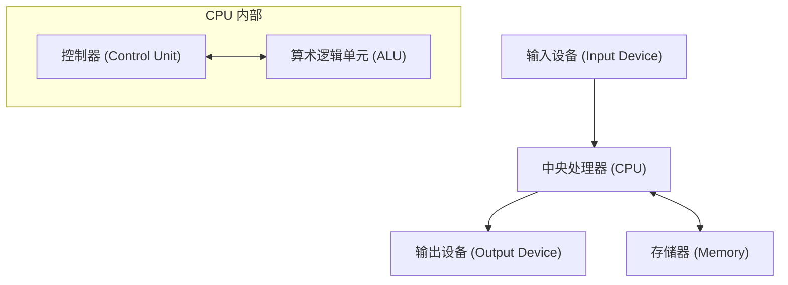

## 1. 引言

约翰·冯·诺伊曼（John von Neumann, 1903–1957）是代表20世纪的天才数学家，对现代科学的各个领域产生了不可估量的影响。他的成就不仅限于纯粹数学，还广泛涉及量子力学、博弈论、计算机科学、经济学、气象学，甚至原子弹的开发。由于他那超乎常理的计算能力和逻辑思维能力，同时代的人对他敬畏交加，称他为“恶魔之脑”或“火星人”。

本文将详细解说冯·诺伊曼的一生及其巨大的成就，以及他留下的众多轶事。让我们深入探究他拥有怎样的思维方式，以及他是如何奠定现代社会基础的。追溯他留下的足迹，无异于追溯现代科学发展本身的历史。

## 2. 神童的诞生：布达佩斯的少年时代

约翰·冯·诺伊曼（匈牙利名：诺伊曼·亚诺什·拉约什）于1903年出生于匈牙利布达佩斯的一个富裕的犹太银行家家庭。从幼年起，他就展现出超常的记忆力和计算能力，真正发挥了无愧于 **神童** 之称的才能。据说他在6岁时就能心算8位数除法，8岁时掌握了微积分。此外，他极具语言天赋，从小学习希腊语和拉丁语，甚至能用古希腊语和父亲开玩笑。

当时的布达佩斯是世界文化和学术的中心，涌现了许多优秀的犹太裔科学家。尤金·维格纳、利奥·西拉德、爱德华·泰勒等后来在美国活跃的科学家，都和诺伊曼一样出身于布达佩斯，因为他们那奇特的才能，被人们统称为 **火星人** （Martians）。诺伊曼在这种优越的知识环境中成长，在高中时代就已经达到了发表数学论文的水平。

## 3. 对数学基础的贡献：公理化集合论

诺伊曼早期成就中最重要的一项，是关于集合论公理化的研究。由[格奥尔格·康托尔](https://kenji.blog/zh-cn/p/cantor/)创立的集合论曾被寄予厚望作为数学的基础，但却面临了罗素悖论等逻辑矛盾（悖论）。为了解决这个问题，恩斯特·策梅洛和阿道夫·弗兰克尔等人构建了公理化集合论，但诺伊曼采取了另一种方法。

他引入了“类”（Class）的概念，通过严格区分普通集合与因为太大而不能成为集合的类（真类），巧妙地回避了悖论。这一体系后来被保罗·伯奈斯和[库尔特·哥德尔](https://kenji.blog/zh-cn/p/godel/)改良，现在被称为 **诺伊曼-伯奈斯-哥德尔集合论** （NBG集合论）。

$$
\forall X \ ( X \in V \iff \exists Y \ (X \in Y) )
$$

在这里，$V$ 表示 **所有集合的类** ( $\text{万有类}$ )。这项基础性研究成为支撑数学根基的重要贡献。

## 4. 量子力学的数学基础

在1920年代后期，量子力学正作为两个看似完全不同的理论发展着：维尔纳·海森堡的“矩阵力学”和埃尔温·薛定谔的“波动力学”。诺伊曼证明了这两个理论在数学上是等价的，从而为量子力学提供了严格的数学基础。

他利用 **希尔伯特空间** 理论，将物理量（可观测量）表述为无限维希尔伯特空间上的自伴算子。他于1932年出版的著作《量子力学的数学基础》被现代物理学家视为圣经，至今仍作为量子力学的标准教科书享有盛誉。

此外，为了描述混合态，他引入了 **密度矩阵** ( $\text{密度矩阵}$ ) 的概念，奠定了量子统计力学的基础。

$$
\rho = \sum_{i} p_i |\psi_i\rangle \langle\psi_i|
$$

在这里，$p_i$ 表示采取状态 $|\psi_i\rangle$ 的概率（ $\text{概率权重}$ ）。他还对量子测量理论中的“波包坍缩”和“测量问题”进行了深入的考察。

## 5. 博弈论与经济行为

诺伊曼从扑克等游戏中的策略分析出发，创立了名为“博弈论”的全新数学分支。1928年，他证明了 **极大极小定理** ，即在两人零和有限确定性完全信息博弈中，如果双方都采取最优策略，结果必然会稳定在一个确定的值上。

$$
\max_{x \in X} \min_{y \in Y} f(x, y) = \min_{y \in Y} \max_{x \in X} f(x, y)
$$

这个等式的左边代表“使最坏情况下的损失最小化”的策略 ( $\text{最大极小策略}$ )，右边代表“针对对手的最佳行动使自己的利益最大化”的策略。

后来，他与经济学家奥斯卡·摩根斯顿合著了巨著《博弈论与经济行为》（1944年），给经济学带来了一场革命。这是将人类的理性决策进行数学建模的尝试，如今不仅在经济学，在政治学、生物学、军事战略等广泛领域都得到了应用。

## 6. 计算机科学与冯·诺伊曼架构

现代几乎所有的计算机都是基于他所构想的 **冯·诺伊曼架构** 制造的。他提出了“存储程序概念”，即将程序作为数据存储在内存中，并依次读取执行。

这种架构由以下主要元素组成：

诺伊曼参与了宾夕法尼亚大学的 EDVAC 开发项目，并将这一划时代的概念总结在《EDVAC 报告书的第一份草案》中。由此，无需物理上重新接线硬件，只需重写软件（程序）即可进行各种计算的通用计算机得以实现。现代IT社会正是建立在他所构建的这一基础之上。

## 7. 元胞自动机与自复制机器理论

晚年，诺伊曼对生命自繁殖机制的数学建模产生了浓厚兴趣。他在同事斯塔尼斯拉夫·乌拉姆的建议下，构想出了 **元胞自动机** 的概念，即将空间划分为网格，每个网格根据一定规则改变状态。

他使用具有29种状态的元胞，严格证明了自复制机器（通用构造器）在理论上是可能的。这是在DNA双螺旋结构被发现之前的事情，可以说他从信息科学的角度预言了生命的遗传机制和信息传递系统。在他死后，这一理论促成了人工生命的研究。

## 8. 曼哈顿计划与流体力学贡献

在第二次世界大战期间，诺伊曼参与了洛斯阿拉莫斯国家实验室开发原子弹的“曼哈顿计划”。他在流体力学和冲击波计算中发挥了核心作用，完成了设计钚弹（胖子）内爆透镜所必需的复杂计算。据说如果没有他关于冲击波相互作用的理论和压倒性的计算能力，原子弹的开发将被大幅推迟。

战后，作为美国政府军事和科学政策的最高顾问，他继续保持着强大的影响力，牵头了洲际弹道导弹的开发、气象预测的数值计算（世界上第一次用计算机进行的天气预报）等国家级项目。

## 9. 被称为“火星人”的男人：天才的传奇轶事

围绕诺伊曼超人般大脑的轶事数不胜数。

* **惊人的计算速度** ：为了验证早期电子计算机 ENIAC 的计算结果是否正确，诺伊曼用心算进行验算，传说诺伊曼比计算机更早完成了计算。
* **完美的照相记忆** ：他能将读过一次的书或电话簿的内容一字不差地记住。据说几十年后，当被要求“背诵《双城记》的开头”时，他完美地背诵了几十分钟，直到朋友叫停。
* **驾驶与噪音** ：他的车技非常差，经常发生交通事故。有一次他甚至辩解说：“树没有给我让路。” 此外，他喜欢吵闹的环境胜过安静，经常在办公室里大声播放德国进行曲，同时进行复杂的数学研究。
* **火星人笑话** ：他的物理学家同事们半开玩笑地说：“诺伊曼是一个住在地球上假装成人类的火星人。然而，他能完美地模仿人类。”

## 10. 主要著作与论文

诺伊曼生前留下的著作和论文多种多样，这里特别介绍对后世产生重大影响的代表作。

1. **《量子力学的数学基础》 (Mathematical Foundations of Quantum Mechanics, 1932)**
   利用希尔伯特空间理论对量子力学进行严格定式化的纪念碑式著作。
2. **《博弈论与经济行为》 (Theory of Games and Economic Behavior, 1944)**
   与奥斯卡·摩根斯顿合著。系统论述从零和博弈到合作博弈的巨著。
3. **《计算机与人脑》 (The Computer and the Brain, 1958)**
   诺伊曼死后出版的未竟遗稿。将人脑的神经网络与数字计算机的机制进行比较的先驱性著作。
4. **《自复制自动机理论》 (Theory of Self-Reproducing [Automata](https://kenji.blog/zh-cn/p/automata-formal-language-theory/), 1966)**
   由阿瑟·伯克斯编纂诺伊曼遗稿出版。

## 11. 约翰·冯·诺伊曼 简要年表

以下是总结约翰·冯·诺伊曼一生及主要成就的详细年表。

* **1903年** ：出生于匈牙利王国布达佩斯。
* **1911年** ：进入路德宗教会中学。
* **1921年** ：进入布达佩斯大学主修数学。同时在柏林大学和苏黎世联邦理工学院学习化学。
* **1926年** ：获得布达佩斯大学数学博士学位。
* **1928年** ：证明极大极小定理，奠定博弈论基础。
* **1930年** ：作为客座教授前往美国普林斯顿大学。
* **1932年** ：出版著作《量子力学的数学基础》。
* **1933年** ：被任命为普林斯顿高等研究院终身教授。与阿尔伯特·爱因斯坦等人一起成为其早期成员。
* **1937年** ：获得美利坚合众国国籍。
* **1943年** ：参与曼哈顿计划，主导内爆透镜的计算。
* **1944年** ：出版《博弈论与经济行为》。
* **1945年** ：撰写《EDVAC报告书的第一份草案》，提出存储程序概念。
* **1948年** ：发表元胞自动机理论和自复制机器构想。
* **1951年** ：就任美国数学学会主席。
* **1954年** ：被任命为美国原子能委员会委员。
* **1955年** ：被诊断患有骨肉瘤（或胰腺癌），开始与病魔斗争。
* **1957年** ：在华盛顿特区沃尔特·里德陆军医院逝世，享年53岁。

## 12. 结语

约翰·冯·诺伊曼于1957年因癌症逝世，年仅53岁。然而，他留下的知识遗产作为现代数学、物理学、经济学和信息技术的基础，至今依然坚不可摧地存活着。从我们每天使用的智能手机和计算机，到最先进的人工智能（AI）技术，再到社会科学的分析方法，到处都可以看到诺伊曼“恶魔之脑”的缩影。回顾他的一生，让我们再次深刻体会到人类智慧的无限可能性及其对世界的巨大影响。在人类历史上，再也找不到其他人在如此广泛的领域引发了根本性的范式转移。

