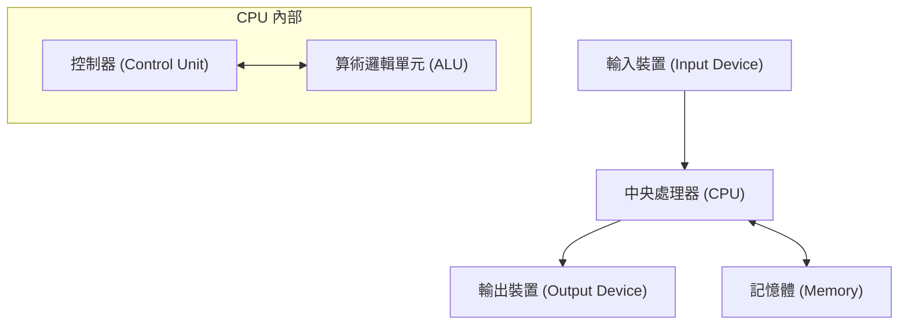

## 1. 引言

約翰·馮·紐曼（John von Neumann, 1903–1957）是代表20世紀的天才數學家，對現代科學的各個領域產生了不可估量的影響。他的成就不僅限於純粹數學，還廣泛涉及量子力學、賽局理論、計算機科學、經濟學、氣象學，甚至原子彈的開發。由於他那超乎常理的計算能力和邏輯思維能力，同時代的人對他敬畏交加，稱他為「惡魔之腦」或「火星人」。

本文將詳細解說馮·紐曼的一生及其巨大的成就，以及他留下的眾多軼事。讓我們深入探究他擁有怎樣的思維方式，以及他是如何奠定現代社會基礎的。追溯他留下的足跡，無異於追溯現代科學發展本身的歷史。

## 2. 神童的誕生：布達佩斯的少年時代

約翰·馮·紐曼（匈牙利名：紐曼·亞諾什·拉約什）於1903年出生於匈牙利布達佩斯的一個富裕的猶太銀行家家庭。從幼年起，他就展現出超常的記憶力和計算能力，真正發揮了無愧於 **神童** 之稱的才能。據說他在6歲時就能心算8位數除法，8歲時掌握了微積分。此外，他極具語言天賦，從小學習希臘語和拉丁語，甚至能用古希臘語和父親開玩笑。

當時的布達佩斯是世界文化和學術的中心，湧現了許多優秀的猶太裔科學家。尤金·維格納、利奧·西拉德、愛德華·泰勒等後來在美國活躍的科學家，都和紐曼一樣出身於布達佩斯，因為他們那奇特的才能，被人們統稱為 **火星人** （Martians）。紐曼在這種優越的知識環境中成長，在高中時代就已經達到了發表數學論文的水準。

## 3. 對數學基礎的貢獻：公理化集合論

紐曼早期成就中最重要的一項，是關於集合論公理化的研究。由[格奧爾格·康托爾](https://kenji.blog/zh-tw/p/cantor/)創立的集合論曾被寄予厚望作為數學的基礎，但卻面臨了羅素悖論等邏輯矛盾（悖論）。為了解決這個問題，恩斯特·策梅洛和阿道夫·弗蘭克爾等人構建了公理化集合論，但紐曼採取了另一種方法。

他引入了「類」（Class）的概念，透過嚴格區分普通集合與因為太大而不能成為集合的類（真類），巧妙地迴避了悖論。這一體系後來被保羅·伯奈斯和[庫爾特·哥德爾](https://kenji.blog/zh-tw/p/godel/)改良，現在被稱為 **紐曼-伯奈斯-哥德爾集合論** （NBG集合論）。

$$
\forall X \ ( X \in V \iff \exists Y \ (X \in Y) )
$$

在這裡，$V$ 表示 **所有集合的類** ( $\text{萬有類}$ )。這項基礎性研究成為支撐數學根基的重要貢獻。

## 4. 量子力學的數學基礎

在1920年代後期，量子力學正作為兩個看似完全不同的理論發展著：維爾納·海森堡的「矩陣力學」和埃爾溫·薛丁格的「波動力學」。紐曼證明了這兩個理論在數學上是等價的，從而為量子力學提供了嚴格的數學基礎。

他利用 **希爾伯特空間** 理論，將物理量（可觀測量）表述為無限維希爾伯特空間上的自伴算子。他於1932年出版的著作《量子力學的數學基礎》被現代物理學家視為聖經，至今仍作為量子力學的標準教科書享有盛譽。

此外，為了描述混合態，他引入了 **密度矩陣** ( $\text{密度矩陣}$ ) 的概念，奠定了量子統計力學的基礎。

$$
\rho = \sum_{i} p_i |\psi_i\rangle \langle\psi_i|
$$

在這裡，$p_i$ 表示採取狀態 $|\psi_i\rangle$ 的機率（ $\text{機率權重}$ ）。他還對量子測量理論中的「波包坍縮」和「測量問題」進行了深入的考察。

## 5. 賽局理論與經濟行為

紐曼從撲克等遊戲中的策略分析出發，創立了名為「賽局理論」的全新數學分支。1928年，他證明了 **極大極小定理** ，即在兩人零和有限確定性完全資訊賽局中，如果雙方都採取最適策略，結果必然會穩定在一個確定的值上。

$$
\max_{x \in X} \min_{y \in Y} f(x, y) = \min_{y \in Y} \max_{x \in X} f(x, y)
$$

這個等式的左邊代表「使最壞情況下的損失最小化」的策略 ( $\text{最大極小策略}$ )，右邊代表「針對對手的最佳行動使自己的利益最大化」的策略。

後來，他與經濟學家奧斯卡·摩根斯頓合著了巨著《賽局理論與經濟行為》（1944年），給經濟學帶來了一場革命。這是將人類的理性決策進行數學建模的嘗試，如今不僅在經濟學，在政治學、生物學、軍事戰略等廣泛領域都得到了應用。

## 6. 計算機科學與馮·紐曼架構

現代幾乎所有的計算機都是基於他所構想的 **馮·紐曼架構** 製造的。他提出了「儲存程式概念」，即將程式作為資料儲存在記憶體中，並依次讀取執行。

這種架構由以下主要元素組成：

紐曼參與了賓夕法尼亞大學的 EDVAC 開發專案，並將這一劃時代的概念總結在《EDVAC 報告書的第一份草案》中。由此，無需物理上重新接線硬體，只需重寫軟體（程式）即可進行各種計算的通用計算機得以實現。現代IT社會正是建立在他所構建的這一基礎之上。

## 7. 元胞自動機與自複製機器理論

晚年，紐曼對生命自繁殖機制的數學建模產生了濃厚興趣。他在同事斯塔尼斯拉夫·烏拉姆的建議下，構想出了 **元胞自動機** 的概念，即將空間劃分為網格，每個網格根據一定規則改變狀態。

他使用具有29種狀態的元胞，嚴格證明了自複製機器（通用構造器）在理論上是可能的。這是在DNA雙螺旋結構被發現之前的事情，可以說他從資訊科學的角度預言了生命的遺傳機制和資訊傳遞系統。在他死後，這一理論促成了人工生命的研究。

## 8. 曼哈頓計劃與流體力學貢獻

在第二次世界大戰期間，紐曼參與了洛斯阿拉莫斯國家實驗室開發原子彈的「曼哈頓計劃」。他在流體力學和衝擊波計算中發揮了核心作用，完成了設計鈽彈（胖子）內爆透鏡所必需的複雜計算。據說如果沒有他關於衝擊波相互作用的理論和壓倒性的計算能力，原子彈的開發將被大幅推遲。

戰後，作為美國政府軍事和科學政策的最高顧問，他繼續保持著強大的影響力，牽頭了洲際彈道飛彈的開發、氣象預測的數值計算（世界上第一次用計算機進行的天氣預報）等國家級專案。

## 9. 被稱為「火星人」的男人：天才的傳奇軼事

圍繞紐曼超人般大腦的軼事數不勝數。

* **驚人的計算速度** ：為了驗證早期電子計算機 ENIAC 的計算結果是否正確，紐曼用心算進行驗算，傳說紐曼比計算機更早完成了計算。
* **完美的照相記憶** ：他能將讀過一次的書或電話簿的內容一字不差地記住。據說幾十年後，當被要求「背誦《雙城記》的開頭」時，他完美地背誦了幾十分鐘，直到朋友叫停。
* **駕駛與噪音** ：他的車技非常差，經常發生交通事故。有一次他甚至辯解說：「樹沒有給我讓路。」 此外，他喜歡吵鬧的環境勝過安靜，經常在辦公室裡大聲播放德國進行曲，同時進行複雜的數學研究。
* **火星人笑話** ：他的物理學家同事們半開玩笑地說：「紐曼是一個住在地球上假裝成人類的火星人。然而，他能完美地模仿人類。」

## 10. 主要著作與論文

紐曼生前留下的著作和論文多種多樣，這裡特別介紹對後世產生重大影響的代表作。

1. **《量子力學的數學基礎》 (Mathematical Foundations of Quantum Mechanics, 1932)**
   利用希爾伯特空間理論對量子力學進行嚴格定式化的紀念碑式著作。
2. **《賽局理論與經濟行為》 (Theory of Games and Economic Behavior, 1944)**
   與奧斯卡·摩根斯頓合著。系統論述從零和賽局到合作賽局的巨著。
3. **《計算機與人腦》 (The Computer and the Brain, 1958)**
   紐曼死後出版的未竟遺稿。將人腦的神經網路與數位計算機的機制進行比較的先驅性著作。
4. **《自複製自動機理論》 (Theory of Self-Reproducing Automata, 1966)**
   由阿瑟·伯克斯編纂紐曼遺稿出版。

## 11. 約翰·馮·紐曼 簡要年表

以下是總結約翰·馮·紐曼一生及主要成就的詳細年表。

* **1903年** ：出生於匈牙利王國布達佩斯。
* **1911年** ：進入路德宗教會中學。
* **1921年** ：進入布達佩斯大學主修數學。同時在柏林大學和蘇黎世聯邦理工學院學習化學。
* **1926年** ：獲得布達佩斯大學數學博士學位。
* **1928年** ：證明極大極小定理，奠定賽局理論基礎。
* **1930年** ：作為客座教授前往美國普林斯頓大學。
* **1932年** ：出版著作《量子力學的數學基礎》。
* **1933年** ：被任命為普林斯顿高等研究院終身教授。與阿爾伯特·愛因斯坦等人一起成為其早期成員。
* **1937年** ：獲得美利堅合眾國國籍。
* **1943年** ：參與曼哈頓計劃，主導內爆透鏡的計算。
* **1944年** ：出版《賽局理論與經濟行為》。
* **1945年** ：撰寫《EDVAC報告書的第一份草案》，提出儲存程式概念。
* **1948年** ：發表元胞自動機理論和自複製機器構想。
* **1951年** ：就任美國數學學會主席。
* **1954年** ：被任命為美國原子能委員會委員。
* **1955年** ：被診斷患有骨肉瘤（或胰腺癌），開始與病魔鬥爭。
* **1957年** ：在華盛頓特區沃爾特·里德陸軍醫院逝世，享年53歲。

## 12. 結語

約翰·馮·紐曼於1957年因癌症逝世，年僅53歲。然而，他留下的知識遺產作為現代數學、物理學、經濟學和資訊技術的基礎，至今依然堅不可摧地存活著。從我們每天使用的智慧型手機和計算機，到最先進的人工智慧（AI）技術，再到社會科學的分析方法，到處都可以看到紐曼「惡魔之腦」的縮影。回顧他的一生，讓我們再次深刻體會到人類智慧的無限可能性及其對世界的巨大影響。在人類歷史上，再也找不到其他人在如此廣泛的領域引發了根本性的典範轉移。
