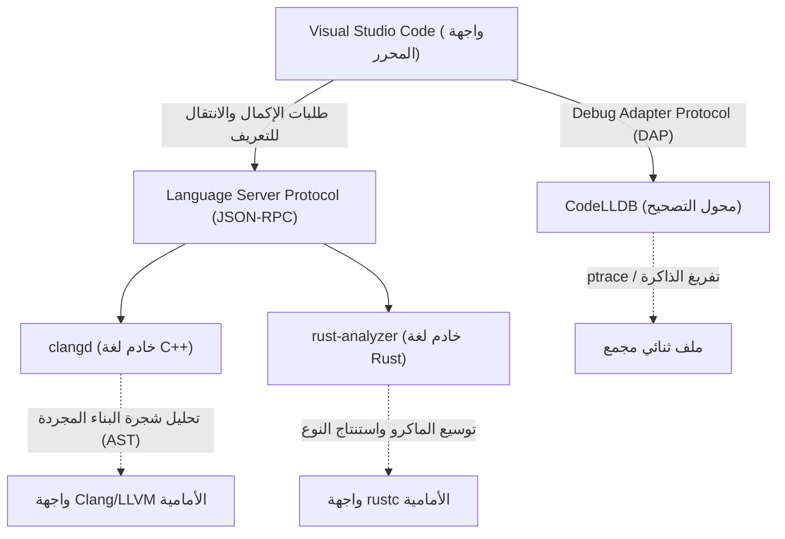
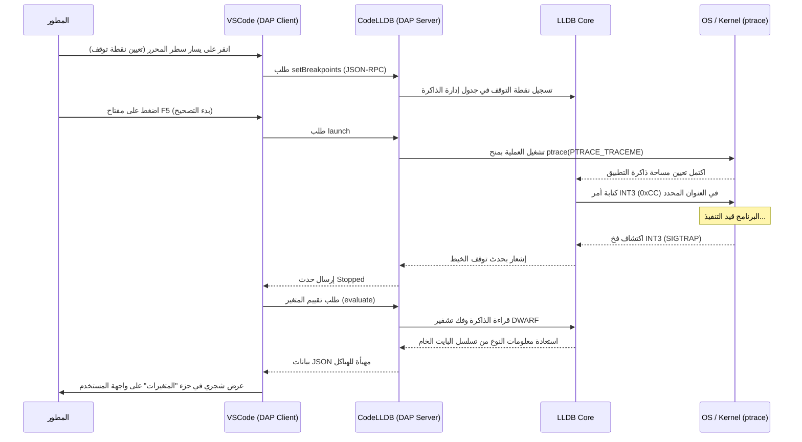

# مقدمة

في برمجة الأنظمة الحديثة، رسخت لغتا C++ و Rust مكانتهما كأهم اللغات. تمتلك C++ تاريخاً طويلاً ونظاماً بيئياً ضخماً، ولا غنى عنها في أنظمة التشغيل، ومحركات الألعاب، وأنظمة التداول عالي التردد (HFT). ومن ناحية أخرى، تنتشر Rust بسرعة بفضل أمان الذاكرة من خلال نموذج الملكية (Ownership) ومواصفات اللغة الحديثة، ويتقدم اعتمادها في نواة لينكس. عند التطوير بهاتين اللغتين، يرتبط اختيار المحرر وإعداداته ارتباطاً مباشراً بإنتاجية التطوير.

يُفضل المبرمجون حول العالم محرر Visual Studio Code (VSCode) لبرمجة الأنظمة نظرًا لقابليته العالية للتوسيع وخفته. ومع ذلك، فإن VSCode فور تثبيته هو مجرد محرر نصوص بسيط. لإطلاق العنان للقوة الحقيقية لـ C++ و Rust، من الضروري تقديم إضافات مناسبة وإعدادات دقيقة، مثل خوادم اللغة التي تفهم دلالات اللغة بعمق، ومصححات الأخطاء التي تتتبع الحالة على المستوى الثنائي.

تقدم هذه المقالة 10 إضافات لـ VSCode ينصح بها لمطوري C++ و Rust لتحويل VSCode إلى "بيئة تطوير متكاملة (IDE) لا تقهر". بدلاً من مجرد سردها، سنتعمق في البنية الداخلية للمحرر، وأمثلة متقدمة لإعدادات `tasks.json` و `launch.json`، وحتى تحسين أداء خوادم اللغة والنماذج الرياضية للتحليل النحوي.

---

## 1. البنية العميقة لـ VSCode وبروتوكول خادم اللغة (LSP)

قبل تقديم الإضافات، من المهم فهم بنية بروتوكول خادم اللغة (LSP) الأساسية، وكيف يوفر VSCode إكمال الكود المتقدم والتحليل النحوي.



جسم VSCode نفسه لا يفهم البرمجة الوصفية للقوالب في C++ أو محددات دورة الحياة المعقدة في Rust. يقتصر دور المحرر على عرض الكود المصدري وتلقي إدخال المستخدم، ويتم تفويض العمليات ذات التكلفة الحسابية العالية مثل التحليل الدلالي (Semantic Analysis)، واستنتاج النوع (Type Inference)، وفحص الأخطاء إلى "خوادم اللغة" التي تعمل في الخلفية عبر JSON-RPC.

وبهذا، حتى مع قواعد الكود الضخمة التي تحتوي على ملايين الأسطر، يمكن تحقيق كتابة سلسة واستجابة سريعة دون حظر خيط واجهة المستخدم الخاص بالمحرر.

---

## 2. أفضل 10 إضافات VSCode أساسية

### ① clangd (أقصى ذكاء كود لـ C++)

أحد أهم الخيارات لمطوري C++ هو الإضافة التي توفر ميزات لغة C++. عند تثبيت VSCode، غالبًا ما يُنصح باستخدام "C/C++ (ms-vscode.cpptools)" الرسمي من Microsoft، ولكن بالنسبة لتطوير الأنظمة الاحترافي، نوصي بشدة باستخدام **`clangd`** المقدم رسميًا بواسطة مشروع LLVM.

نظرًا لأن `clangd` يدمج مباشرة تقنية الواجهة الأمامية لمترجم Clang (المحلل النحوي والمحلل الدلالي)، فإن دقة تحليل الكود عالية جدًا، وتتطابق الأخطاء والتحذيرات المعروضة على المحرر تمامًا مع تلك التي يخرجها المترجم الفعلي.

#### لماذا تختار clangd بدلاً من ms-vscode.cpptools
- **تحليل عالي الدقة**: نظرًا لأنه يتعامل مباشرة مع شجرة البناء المجردة (AST) الخاصة بـ Clang، فإنه يقيّم بدقة إنشاء القوالب المعقدة التي تستخدم SFINAE (الاستبدال الفاشل ليس خطأ) والتوسعات المتداخلة للماكرو.
- **التسريع من خلال فهرسة الخلفية**: يقوم بحساب مسبق (فهرسة) لمعلومات الرموز للمشروع بأكمله في الخلفية، لذا فإن عمليات مثل "الانتقال إلى التعريف (Go to Definition)" و "البحث عن كل المراجع (Find All References)" تكتمل على الفور حتى في المشاريع الضخمة.

#### الإعداد الكامل لـ compile_commands.json
لكي يعمل `clangd` بشكل صحيح، يعد ملف `compile_commands.json` ضروريًا، حيث يصف علامات المترجم (مسارات التضمين وتعريفات الماكرو) التي يتم بها تجميع كل ملف مصدر في المشروع. إذا كنت تستخدم CMake، يمكنك إنشاؤه تلقائيًا باستخدام الأمر التالي.

```bash
cmake -B build -DCMAKE_EXPORT_COMPILE_COMMANDS=ON
```

في ملف إعدادات VSCode (`.vscode/settings.json`)، نقوم بضبط وسائط بدء تشغيل `clangd` على النحو التالي.

```json
{
    "clangd.arguments": [
        "--compile-commands-dir=${workspaceFolder}/build",
        "--background-index",
        "--clang-tidy",
        "--header-insertion=iwyu",
        "--completion-style=detailed",
        "--j=6",
        "--pch-storage=memory"
    ]
}
```

هنا، `--j=6` هو عدد خيوط العمال المستخدمة لفهرسة الخلفية. يرجى تعديله وفقًا لعدد نوى وحدة المعالجة المركزية (CPU) المتاحة. أيضاً، من خلال تحديد `--pch-storage=memory`، يتم الاحتفاظ بالرؤوس المجمعة مسبقًا (PCH) في الذاكرة، مما يزيد من سرعة التحليل (ولكنه يستهلك المزيد من ذاكرة الوصول العشوائي).

#### النموذج الرياضي لوقت استجابة خادم اللغة وحجم AST

يعتمد وقت استجابة خادم اللغة $T_{response}$ على حجم الملف المُدخل $S$ وحجم شجرة البناء المجردة (AST) المفهرسة للمشروع بأكمله $M_{ast}$. بالنظر إلى التعقيد الخوارزمي للتحليل النحوي، يمكن التعبير عنه بمعادلة تقريبية كالتالي:

$$ T_{response} = \alpha \cdot O(S \log(M_{ast})) + \beta \cdot T_{IPC} $$

حيث $\alpha$ هو معامل كفاءة المحلل النحوي، و $\beta$ هي النفقات العامة للاتصال بين العمليات (IPC)، و $T_{IPC}$ هو وقت التسلسل/إلغاء التسلسل لـ JSON-RPC.
من خلال إتقان فهرسة الخلفية (تحسين بنية بيانات الحساب المسبق لـ $M_{ast}$)، يقلل `clangd` بشكل كبير من المصطلح الثابت لترتيب البحث $\log(M_{ast})$، مما يتيح استجابات في غضون بضعة أجزاء من الألف من الثانية حتى للمشاريع الضخمة التي تحتوي على مئات الآلاف من الأسطر.

---

### ② rust-analyzer (المعيار الفعلي لتطوير Rust)

في تطوير Rust، خادم اللغة الرسمي المعتمد حاليًا هو **`rust-analyzer`**. في الماضي، كان المعيار RLS (خادم لغة Rust) ذا استجابة محدودة لأنه كان يعتمد على بنية تستدعي المترجم (rustc) مباشرة، ولكن تمت إعادة تصميم `rust-analyzer` من الصفر من أجل بيئات التطوير المتكاملة (IDE)، ولديه ميزات قوية قادرة على تحليل الكود تدريجياً حتى لو كان غير مكتمل.

#### مجموعة من الميزات التي تخلق إنتاجية هائلة
1. **Inlay Hints (تلميحات مضمنة)**: في Rust، حيث استنتاج النوع قوي، يوصى بعدم كتابة أنواع المتغيرات صراحة، ولكن هذا قد يقلل من قابلية القراءة. تعرض التلميحات المضمنة الأنواع المستنتجة وأسماء وسيطات استدعاء الدالة كنص خفيف متراكب على المحرر.
2. **الدعم الكامل للماكرو الإجرائي (Proc-macro)**: تستقبل وحدات الماكرو الإجرائية مثل `#[derive(Serialize)]` في `serde` و `tokio::main` شجرة البناء المجردة (AST) كـ TokenStream أثناء التجميع وتقوم بإنشاء كود جديد. يقوم `rust-analyzer` بتوسيع وحدات الماكرو هذه داخليًا ويقوم أيضًا بتمكين الإكمال وفحص الأخطاء للكود الذي تم إنشاؤه.
3. **Magic Completions (الإكمالات السحرية)**: في سلاسل التوابع مثل `iter().map().filter().collect()`، من الممكن عرض كيفية تحويل الأنواع الوسيطة خطوة بخطوة.

#### الإعداد الموصى به لـ settings.json لـ rust-analyzer

```json
{
    "rust-analyzer.checkOnSave.command": "clippy",
    "rust-analyzer.cargo.allFeatures": true,
    "rust-analyzer.procMacro.enable": true,
    "rust-analyzer.inlayHints.bindingModeHints.enable": true,
    "rust-analyzer.inlayHints.closureReturnTypeHints.enable": "always",
    "rust-analyzer.lens.run.enable": true,
    "rust-analyzer.hover.actions.references.enable": true
}
```
تشغيل `cargo clippy` تلقائياً في الخلفية عند الحفظ يعتبر أمراً حيوياً. يتيح لك ذلك ليس فقط اكتشاف انتهاكات الملكية، بل أيضاً اقتراحات تحسين الأداء وتعلم طرق الكتابة الشائعة (Idiomatic) لـ Rust فوراً.

---

### ③ CodeLLDB (مصحح أخطاء قوي متعدد المنصات)

سواء كنت تطور بـ C++ أو Rust، فإن مصحح الأخطاء لفحص حالة الذاكرة أثناء وقت التشغيل ضروري. خاصةً، **`CodeLLDB`** يعمل باستقرار عبر جميع المنصات: Windows، Mac، و Linux، ولديه توافق عالٍ للغاية مع Rust.

يستخدم مترجم Rust (rustc) LLVM كخلفية، وصيغة معلومات التصحيح التي تم إنشاؤها (DWARF / PDB) متوافقة تمامًا مع LLDB، وهو أيضًا جزء من مشروع LLVM.

#### مثال متقدم لإعدادات launch.json

هذا إعداد لـ `.vscode/launch.json` لبدء التصحيح في VSCode. هنا نعرض تكويناً متكاملاً لتصحيح أخطاء الملفات التنفيذية لكل من C++ و Rust.

```json
{
    "version": "0.2.0",
    "configurations": [
        {
            "type": "lldb",
            "request": "launch",
            "name": "Debug C++ Application",
            "program": "${workspaceFolder}/build/src/my_cpp_app",
            "args": ["--config", "settings.ini", "--verbose"],
            "cwd": "${workspaceFolder}",
            "preLaunchTask": "build_cpp_debug",
            "stopOnEntry": false,
            "sourceLanguages": ["cpp"]
        },
        {
            "type": "lldb",
            "request": "launch",
            "name": "Debug Rust Cargo Binary",
            "cargo": {
                "args": [
                    "build",
                    "--bin=my_rust_app",
                    "--package=my_rust_app"
                ],
                "filter": {
                    "name": "my_rust_app",
                    "kind": "bin"
                }
            },
            "args": [],
            "cwd": "${workspaceFolder}",
            "sourceLanguages": ["rust"]
        }
    ]
}
```
لاحظ كتلة تكوين Rust. نظرًا لأن `CodeLLDB` يدعم خيار `cargo` بشكل أصلي، فليست هناك حاجة لتحديد مسار الثنائي الذي يحتوي على قيم تجزئة معقدة بعد التجميع مباشرة. يقوم المحرر تلقائيًا بتشغيل `cargo build`، ويلتقط أحدث ملف تنفيذي تم إنشاؤه ويرفق مصحح الأخطاء.

---

### ④ CMake Tools

إضافة للتحكم الكامل في CMake، نظام البناء القياسي في الصناعة لمشاريع C++، ضمن VSCode. تقضي **`CMake Tools`** على الحاجة إلى إدخال أوامر `cmake` المرهقة في سطر الأوامر، وتسمح لك باختيار الهدف والبناء وتصحيح الأخطاء بنقرة واحدة من شريط الحالة أسفل الشاشة.

بالإضافة إلى ذلك، يمكن نسخ `compile_commands.json`، المطلوب لـ `clangd` المذكور أعلاه، تلقائيًا إلى الموقع المناسب من خلال إعدادات هذه الإضافة.

#### إعداد تكامل CMake في settings.json

```json
{
    "cmake.configureOnOpen": true,
    "cmake.exportCompileCommandsFileAndCopy": "${workspaceFolder}/compile_commands.json",
    "cmake.buildDirectory": "${workspaceFolder}/build/${buildType}",
    "cmake.generator": "Ninja"
}
```
من خلال تحديد `Ninja` كأداة بناء، تم تحسين التجميع المتوازي مقارنة بـ Make الافتراضي، ويمكن تقليل وقت البناء بشكل كبير. حتى عند تبديل ملفات تعريف البناء (Debug / Release / RelWithDebInfo)، فإن تحليل خادم اللغة سيتتبع تلقائيًا بناءً على الإعدادات الجديدة.

---

### ⑤ crates (إدارة تبعيات حزم Rust في الوقت الفعلي)

إضافة تجعل `Cargo.toml`، ملف إدارة التبعيات في Rust، مريحًا للغاية.

يجلب في الوقت الفعلي ما إذا كان أحدث إصدار مسجل في Crates.io (المستودع الرسمي) موجودًا بجوار رقم إصدار حزمة الاعتماد (المكتبة)، ويعرضه في المحرر.

```toml
[dependencies]
tokio = "1.28.0" # <- يتم عرضه بنص خفيف على المحرر "Latest: 1.35.1"
serde = { version = "1.0", features = ["derive"] }
reqwest = "0.11" # <- يمكن تصحيحه بنقرة واحدة إذا كان التحديث مطلوباً
```
هذا يمنع نقاط الضعف والأخطاء الناجمة عن الإصدارات القديمة من المكتبات، ويسمح لك بمواكبة تطور النظام البيئي.

---

### ⑥ Error Lens

`Error Lens` هي إضافة ثورية تبرز أخطاء القوالب الطويلة في C++ وأخطاء فحص الاستعارة (Borrow Checker) الصارمة في Rust مضمنةً مباشرة على يمين السطر ذي الصلة في المحرر.

عادةً، لمعرفة تفاصيل خطأ في VSCode، يجب عليك فتح لوحة "المشكلات (Problems)" أسفل الشاشة، أو وضع مؤشر الفأرة بدقة على الخط المتعرج الأحمر وانتظار ظهور نافذة منبثقة. ومع ذلك، فإن هذه العملية تزيد من العبء المعرفي وتعطل حالة تدفق البرمجة.

باستخدام `Error Lens`، تُعرض رسائل الخطأ على حافة رؤيتك أثناء كتابة الكود دون رفع يديك عن لوحة المفاتيح. في Rust بشكل خاص، يمكنك فهم أخطاء دورة الحياة المعقدة على الفور مثل "`cannot borrow 'x' as mutable because it is also borrowed as immutable`" أثناء النظر إلى السطر ذي الصلة، مما يحسن سرعة الإصلاح بشكل كبير.

---

### ⑦ GitLens

غالبًا ما تكون مشاريع برمجة الأنظمة ضخمة الحجم وتتطلب العمل مع قواعد برمجية ذات تاريخ طويل. تتبع "من ومتى ولماذا أضاف هذا الكود المعقد للتعامل مع المؤشرات؟" هو أحد أهم الخطوات في إصلاح الأخطاء.

تعرض إضافة **`GitLens`** معلومات `git blame` للسطر الموجود عند موضع المؤشر الحالي كشرح خفيف على المحرر. بالإضافة إلى ذلك، لديها القدرة على استكشاف تاريخ الالتزامات (Commits) للملف بأكمله بشكل رسومي، وتتبع السجل سطراً بسطر (Line History).

عند مواجهة كتلة `unsafe` في Rust أو عمليات صب (Casting) صعبة في C++، فإن القدرة على الإشارة الفورية إلى طلب السحب (Pull Request) أو رسالة الالتزام التفصيلية من وقت دمج هذا الكود هي سلاح قوي في الهندسة العكسية.

---

### ⑧ GitHub Copilot

حتى في برمجة الأنظمة، أصبح إدخال مساعدي الذكاء الاصطناعي التوليدي نقلة نوعية لا مفر منها. تدعم إضافة **`GitHub Copilot`** بناء الأكواد المكررة في C++ وبناء سلاسل المكررات المعقدة في Rust بدقة عالية جدًا.

#### استخدام الذكاء الاصطناعي في برمجة الأنظمة
- **تنفيذ قاعدة الخمسة (Rule of Five)**: في C++، عند كتابة المدمر (Destructor)، ومنشئ النسخ (Copy Constructor)، وعامل تعيين النسخ، ومنشئ النقل، وعامل تعيين النقل، يقترح Copilot فوراً تنفيذاً دقيقاً بدون تسرب للذاكرة بناءً على متغيرات الفئة.
- **فهم السياق**: إذا أعلنت عن نموذج دالة مبدئي في ملف رأس C++ (`.hpp`) ثم قمت بفتح ملف التنفيذ (`.cpp`) مباشرة، فسيقوم Copilot تلقائيًا بإكمال توقيع تلك الدالة وتقديم نموذج أولي للتنفيذ.

---

### ⑨ Even Better TOML

إضافة توفر تسليط الضوء على بناء الجملة، والتنسيق التلقائي، والتحقق القوي من المخطط (Schema Validation) لـ `Cargo.toml`، ملف إعداد مشروع Rust، و `rust-toolchain.toml`، ملف إعداد سلسلة الأدوات.

تنبهك الإضافة في الوقت الفعلي إلى الأخطاء المطبعية البسيطة في `Cargo.toml` (على سبيل المثال، كتابة `[dependencis]` بدلاً من `[dependencies]`)، وبالتالي تلغي الوقت الضائع في إدراك الخطأ لأول مرة عند تشغيل البناء. بالإضافة إلى ذلك، نظرًا لأنه يتم التحقق من الصحة بناءً على مخطط JSON (JSON Schema)، فمن الممكن الإكمال التلقائي للمفاتيح المتاحة.

---

### ⑩ Code Spell Checker

في برمجة الأنظمة، ترتبط التهجئة الدقيقة لأسماء المتغيرات والدوال ارتباطاً مباشراً بقابلية القراءة والصيانة للمشروع بأكمله. تكتشف إضافة **`Code Spell Checker`** الأخطاء الإملائية في المعرفات داخل الكود المصدري (يقوم تلقائيًا بتحليل CamelCase مثل `myVariable` و snake_case مثل `my_variable` إلى كلمات)، والتعليقات، والسلاسل النصية.

في أنماط التصميم التي تستخدم السلاسل النصية كمفاتيح في `std::unordered_map` لـ C++ أو `HashMap` لـ Rust، فإن الأخطاء الإملائية (Typos) تمر عبر المترجم ويصعب ملاحظتها حتى تظهر كأخطاء في وقت التشغيل، وهي طبيعة مزعجة للغاية. من خلال تقديم مدقق إملائي وعرض تحذير بخط متعرج على المحرر، يمكن القضاء تمامًا على هذه الأخطاء السهلة في مرحلة البرمجة.

---

## 3. أتمتة خطوط أنابيب البناء باستخدام tasks.json

لإكمال وظائف بيئة التطوير المتكاملة (IDE)، من المهم استخدام ميزة مهام VSCode (`.vscode/tasks.json`) بالإضافة إلى ميزات واجهة المستخدم للمحرر، بحيث يمكن تشغيل البناء أو الاختبار باختصار لوحة مفاتيح واحد (الافتراضي هو `Ctrl+Shift+B`).

يوجد أدناه مثال متقدم لإعداد `tasks.json` للتعايش بين بناء C++ باستخدام CMake وبناء Rust باستخدام Cargo.

```json
{
    "version": "2.0.0",
    "tasks": [
        {
            "label": "build_cpp_debug",
            "type": "shell",
            "command": "cmake --build build --config Debug -j 8",
            "group": "build",
            "problemMatcher": [
                "$gcc"
            ],
            "presentation": {
                "reveal": "always",
                "panel": "shared"
            },
            "detail": "بناء مشروع C++ في وضع Debug باستخدام CMake"
        },
        {
            "label": "cargo build",
            "type": "cargo",
            "command": "build",
            "problemMatcher": [
                "$rustc"
            ],
            "group": {
                "kind": "build",
                "isDefault": true
            },
            "presentation": {
                "reveal": "silent"
            },
            "detail": "بناء مشروع Rust باستخدام Cargo"
        }
    ]
}
```
المفتاح هنا هو إعداد `problemMatcher`. بتحديد `$gcc` و `$rustc`، يقوم VSCode بتحليل المخرجات القياسية لسطر الأوامر الذي يتم تشغيله في الخلفية باستخدام التعبيرات العادية، ويستخرج اسم الملف ورقم السطر ورقم العمود حيث حدث الخطأ، ويعرضها كقائمة في لوحة "المشكلات".

---

## 4. تصور بنية تصحيح الأخطاء وطرق التحليل المتقدمة

غالباً ما تكون الأخطاء في برمجة الأنظمة معقدة ولا يمكن اكتشافها من خلال التحليل الثابت للمحرر وحده، مثل تلف الذاكرة (Segmentation Fault)، وحروب البيانات (Data Races)، والسلوكيات غير المحددة (Undefined Behavior). دعنا نتحقق من التسلسل لمعرفة كيف يتفاعل مصحح الأخطاء (CodeLLDB) مع VSCode ويراقب حالة الذاكرة على مستوى نواة نظام التشغيل.



كما يوضح مخطط التسلسل هذا، تتم اتصالات لا حصر لها (Debug Adapter Protocol - DAP) بين VSCode و CodeLLDB أثناء جلسة تصحيح الأخطاء. حتى هياكل البيانات المعقدة التي هي عبارة عن مجموعات من المؤشرات، مثل `std::map` في C++ أو `Vec<T>` في Rust، يتم عرضها بشكل بديهي جداً (كشجرة مع محتويات المصفوفة الموسعة) على واجهة مستخدم VSCode بواسطة ميزة المنسق (Formatter) المدمجة في CodeLLDB.

لجعل ذلك ممكناً، يقوم مترجم Rust بتضمين معلومات تخطيط النوع (مثل الحجم والحشو) بالتفصيل داخل صيغة DWARF، ويقوم CodeLLDB وفقاً لذلك بتحويل سلسلة البايتات الخام على الذاكرة المستهدفة ببراعة إلى صيغة يمكن للبشر قراءتها.

---

## 5. النمذجة الرياضية لإنتاجية المطور (Productivity)

أخيرًا، دعونا نقيم تأثير هذه الإضافات وإعدادات الأتمتة على إنتاجية مهام التطوير الفعلية باستخدام نموذج رياضي.

الوقت الإجمالي $T_{total}$ المطلوب للمطور لإكمال مهمة معينة (تنفيذ ميزة جديدة أو إصلاح خطأ معقد) يمكن صياغته بالمعادلة التالية:

$$ T_{total} = T_{design} + T_{write} + \sum_{k=1}^{N} \left( T_{compile}^{(k)} + T_{debug}^{(k)} + \lambda_{switch} \cdot T_{context\_switch}^{(k)} \right) $$

حيث يحمل كل متغير المعنى التالي:
- $T_{design}$: الوقت المستغرق لتصميم الهندسة المعمارية (ثابت)
- $T_{write}$: الوقت المستغرق لكتابة الكود الفعلي
- $N$: عدد تكرارات التجميع، والاختبار، والتعديل
- $T_{compile}$: وقت التجميع لكل مرة
- $T_{debug}$: الوقت المستغرق لتحديد سبب الخطأ وإصلاحه
- $T_{context\_switch}$: وقت التبديل المعرفي للسياق عند الانتقال بين الأدوات مثل المحرر، والمحطة الطرفية، والمتصفح (للبحث عن الوثائق)
- $\lambda_{switch}$: معامل عقوبة انخفاض التركيز الناتج عن تبديل السياق

الإضافات المقدمة هذه المرة تعمل على تقليل جميع المعلمات الديناميكية تقريباً في هذه المعادلة.

1. **التقليل الهائل لـ $T_{write}$**: يقلل بشكل كبير من عدد نقرات لوحة المفاتيح بفضل الإكمال المبني على استنتاج النوع المتقدم وتوسيع الماكرو في `GitHub Copilot` و `rust-analyzer`.
2. **تقليل $N$ إلى الحد الأدنى**: مع `Error Lens` وأدوات فحص الكود في الوقت الفعلي (clippy، clang-tidy)، يمكنك اكتشاف الأخطاء وسحقها في لحظة الكتابة، مما يقلل من عدد مرات إعادة العمل $N$ الناتجة عن اكتشاف الأخطاء بعد تشغيل البناء.
3. **تحسين $T_{debug}$**: يتيح لك `CodeLLDB` و `GitLens` التحقق الفوري من حالة المتغيرات وفهم نية تغيير الكود.
4. **القضاء على $T_{context\_switch}$**: لأن كل العمليات (تحرير الكود، البناء، تصحيح الأخطاء، التحقق من سجل Git، وإصلاح الأخطاء) تكتمل تماماً داخل نافذة واحدة هي VSCode، يقترب حد العقوبة $\lambda_{switch} \cdot T_{context\_switch}^{(k)}$ من الصفر تقريباً.

ونتيجة لذلك، يتقلص وقت المهمة الإجمالي $T_{total}$ بشكل كبير، ويتمكن المطورون من تخصيص المزيد من الوقت لـ "التصميم ($T_{design}$)" الأساسي والإبداعي وتحسين الخوارزميات.

---

## خاتمة

تعتبر لغتا C++ و Rust لغتين صارمتين تهدفان إلى "استخراج أقصى أداء للأجهزة"، وتتطلبان من المطورين مستوى عالٍ من الفهم والبرمجة الدقيقة.

من خلال تطبيق الإضافات العشرة والإعدادات المقدمة في هذه المقالة، سيتجاوز VSCode حدود محرر النصوص البسيط ليتطور إلى "هيكل خارجي قوي للمطور" يجمع بين المعرفة العميقة للمترجم وقدرة الاستبصار لمصحح الأخطاء.

1. **clangd** (خادم لغة C++)
2. **rust-analyzer** (خادم لغة Rust)
3. **CodeLLDB** (مصحح أخطاء متكامل)
4. **CMake Tools** (أتمتة بناء C++)
5. **crates** (إدارة تبعيات Rust)
6. **Error Lens** (عرض الأخطاء المضمنة)
7. **GitLens** (تتبع متقدم لسجل Git)
8. **GitHub Copilot** (مساعدة الذكاء الاصطناعي في البرمجة)
9. **Even Better TOML** (التحقق من ملف الإعدادات)
10. **Code Spell Checker** (منع الأخطاء المطبعية)

قد يستغرق تخصيص ملف الإعدادات الأولي بعض الوقت، ولكن بمجرد بنائه، ستكون تجربة البرمجة اللاحقة مريحة ومنتجة بشكل مذهل. يرجى الرجوع إلى شرح البنية والإعدادات المحددة (`settings.json` و `tasks.json` و `launch.json`) في هذه المقالة لبناء بيئة التطوير الأقوى الخاصة بك.

أتمنى لكم حياة برمجة أنظمة مريحة وآمنة!
