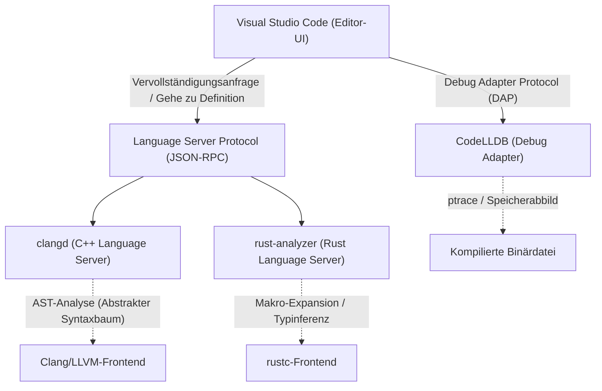
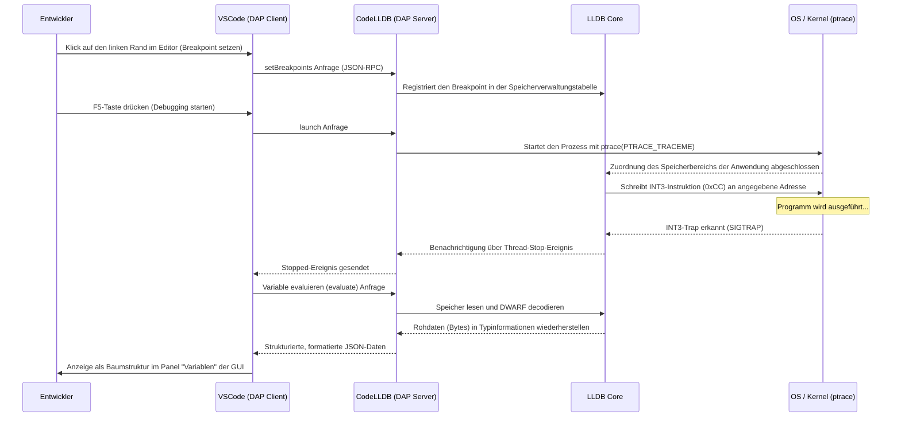

# Einführung

In der modernen Systemprogrammierung haben C++ und Rust ihre Position als die wichtigsten Sprachen fest etabliert. C++ ist mit seiner langjährigen Erfolgsgeschichte und seinem riesigen Ökosystem unverzichtbar für Betriebssysteme, Spiele-Engines und Hochfrequenzhandelssysteme (HFT). Rust hingegen verbreitet sich dank seines Speichersicherheitsmodells (Ownership) und moderner Sprachfunktionen rasant und wird zunehmend auch in den Linux-Kernel integriert. Bei der Entwicklung in diesen beiden Sprachen wirkt sich die Wahl und Konfiguration des Editors direkt auf die Produktivität aus.

Visual Studio Code (VSCode) wird von Systemprogrammierern auf der ganzen Welt wegen seiner hohen Erweiterbarkeit und Leichtigkeit geschätzt. Ein frisch installiertes VSCode ist jedoch nur ein einfacher Texteditor. Um das wahre Potenzial von C++ und Rust freizusetzen, sind die Installation geeigneter Erweiterungen und detaillierte Konfigurationen unerlässlich – etwa Language Server, die die Semantik der Sprache tiefgreifend verstehen, und Debugger, die den Zustand auf binärer Ebene verfolgen.

Dieser Artikel stellt C++- und Rust-Entwicklern die 10 besten Erweiterungen vor, die VSCode in eine "ultimative integrierte Entwicklungsumgebung (IDE)" verwandeln. Wir beschränken uns nicht nur auf eine bloße Auflistung, sondern gehen in die Tiefe: Wir beleuchten die interne Architektur des Editors, zeigen fortgeschrittene Konfigurationsbeispiele für `tasks.json` und `launch.json`, besprechen die Leistungsoptimierung des Language Servers und sogar die mathematischen Modelle der Syntaxanalyse.

---

## 1. Die tiefe Architektur von VSCode und dem Language Server Protocol (LSP)

Bevor wir die Erweiterungen vorstellen, ist es wichtig, die grundlegende Architektur des Language Server Protocol (LSP) zu verstehen, die es VSCode ermöglicht, fortschrittliche Code-Vervollständigung und Syntaxanalyse anzubieten.



VSCode selbst versteht weder die C++-Template-Metaprogrammierung noch die komplexen Lebensdauer-Spezifizierer von Rust. Die Rolle des Editors beschränkt sich auf die Anzeige des Quellcodes und die Entgegennahme von Benutzereingaben. Rechenintensive Aufgaben wie semantische Analyse, Typinferenz und Fehlerprüfung werden über JSON-RPC an im Hintergrund laufende "Language Server" delegiert.

Dadurch werden ein reibungsloses Tippen und schnelle Reaktionszeiten selbst in Codebasen mit Millionen von Zeilen erreicht, ohne den UI-Thread des Editors zu blockieren.

---

## 2. Die 10 unverzichtbaren VSCode-Erweiterungen

### ① clangd (Ultimatives C++ IntelliSense)

Eine der wichtigsten Entscheidungen für C++-Entwickler ist die Wahl der Erweiterung, die die Sprachfunktionen bereitstellt. Wenn Sie VSCode installieren, wird oft die offizielle Microsoft-Erweiterung "C/C++ (ms-vscode.cpptools)" empfohlen. Für die professionelle Systementwicklung empfehlen wir jedoch dringend **`clangd`**, das offiziell vom LLVM-Projekt bereitgestellt wird.

Da `clangd` direkt die Frontend-Technologien des Clang-Compilers (Parser und semantischer Analysator) integriert, ist die Genauigkeit der Codeanalyse extrem hoch. Die im Editor angezeigten Fehler und Warnungen stimmen exakt mit denen des tatsächlichen Compilers überein.

#### Warum clangd anstelle von ms-vscode.cpptools?
- **Hochpräzise Analyse**: Da es direkt mit dem AST (Abstract Syntax Tree) von Clang arbeitet, evaluiert es komplexe Template-Instanziierungen mit intensiver Nutzung von SFINAE (Substitution Failure Is Not An Error) und verschachtelte Makro-Erweiterungen korrekt.
- **Beschleunigung durch Hintergrund-Indizierung**: Die Symbolinformationen des gesamten Projekts werden im Hintergrund vorab berechnet (indiziert), sodass Vorgänge wie "Gehe zu Definition" oder "Finde alle Verweise" selbst in riesigen Projekten sofort ausgeführt werden.

#### Die perfekte Konfiguration von compile_commands.json
Damit `clangd` richtig funktioniert, ist eine Datei `compile_commands.json` erforderlich, die beschreibt, mit welchen Compiler-Flags (Include-Pfade, Makrodefinitionen) jede Quelldatei im Projekt kompiliert wird. Wenn Sie CMake verwenden, können Sie diese automatisch mit folgendem Befehl generieren:

```bash
cmake -B build -DCMAKE_EXPORT_COMPILE_COMMANDS=ON
```

In der VSCode-Konfigurationsdatei (`.vscode/settings.json`) optimieren wir die Startargumente für `clangd` wie folgt:

```json
{
    "clangd.arguments": [
        "--compile-commands-dir=${workspaceFolder}/build",
        "--background-index",
        "--clang-tidy",
        "--header-insertion=iwyu",
        "--completion-style=detailed",
        "--j=6",
        "--pch-storage=memory"
    ]
}
```

Hierbei steht `--j=6` für die Anzahl der Worker-Threads, die für die Hintergrundindizierung verwendet werden. Passen Sie dies an die Anzahl Ihrer CPU-Kerne an. Durch Angabe von `--pch-storage=memory` können vorkompilierte Header (PCH) im Speicher gehalten werden, um die Parsing-Geschwindigkeit weiter zu erhöhen (dies verbraucht jedoch mehr RAM).

#### Mathematisches Modell der Language Server-Reaktionszeit und AST-Größe

Die Reaktionszeit eines Language Servers $T_{response}$ hängt von der Größe der Eingabedatei $S$ und der Größe des indizierten AST im gesamten Projekt $M_{ast}$ ab. Unter Berücksichtigung der algorithmischen Komplexität der Syntaxanalyse lässt sich dies durch folgende Näherungsformel ausdrücken:

$$ T_{response} = \alpha \cdot O(S \log(M_{ast})) + \beta \cdot T_{IPC} $$

Dabei ist $\alpha$ der Effizienzkoeffizient des Parsers, $\beta$ der Overhead der Interprozesskommunikation (IPC) und $T_{IPC}$ die Serialisierungs-/Deserialisierungszeit von JSON-RPC.
Durch die Perfektionierung der Hintergrund-Indizierung (Optimierung der vorberechneten Datenstrukturen für $M_{ast}$) drückt `clangd` den konstanten Term des Suchaufwands $\log(M_{ast})$ drastisch nach unten und ermöglicht so selbst bei riesigen Projekten mit Hunderttausenden von Zeilen Reaktionszeiten im Millisekundenbereich.

---

### ② rust-analyzer (Der De-facto-Standard für die Rust-Entwicklung)

Bei der Rust-Entwicklung ist **`rust-analyzer`** der offiziell empfohlene Language Server. Der frühere Standard RLS (Rust Language Server) stieß aufgrund seiner Architektur, die den Compiler (rustc) direkt aufrief, an Leistungsgrenzen. Im Gegensatz dazu wurde `rust-analyzer` speziell für IDEs von Grund auf neu entwickelt und verfügt über leistungsstarke Funktionen für das inkrementelle Parsen, selbst von unvollständigem Code.

#### Funktionen für unschlagbare Produktivität
1. **Inlay Hints**: Da Typinferenz in Rust sehr stark ist, wird empfohlen, den Typ einer Variablen nicht explizit anzugeben, was jedoch die Lesbarkeit beeinträchtigen kann. Inlay Hints überlagern abgeleitete Typen und Namen von Funktionsparametern als halbtransparente Texte direkt im Editor.
2. **Vollständige Unterstützung für prozedurale Makros (Proc-macros)**: Prozedurale Makros wie `#[derive(Serialize)]` von `serde` oder `tokio::main` empfangen beim Kompilieren den AST als TokenStream und generieren neuen Code. `rust-analyzer` erweitert diese Makros intern und ermöglicht die Codevervollständigung und Fehlerprüfung für den generierten Code.
3. **Magic Completions**: Bei Methodenverkettungen (Method Chains) wie `iter().map().filter().collect()` kann Schritt für Schritt angezeigt werden, wie sich der Typ transformiert.

#### Empfohlene settings.json für rust-analyzer

```json
{
    "rust-analyzer.checkOnSave.command": "clippy",
    "rust-analyzer.cargo.allFeatures": true,
    "rust-analyzer.procMacro.enable": true,
    "rust-analyzer.inlayHints.bindingModeHints.enable": true,
    "rust-analyzer.inlayHints.closureReturnTypeHints.enable": "always",
    "rust-analyzer.lens.run.enable": true,
    "rust-analyzer.hover.actions.references.enable": true
}
```
Die Einstellung, `cargo clippy` beim Speichern automatisch im Hintergrund auszuführen, ist unverzichtbar. So lernen Sie nicht nur bei Ownership-Verstößen sofort dazu, sondern erhalten auch Vorschläge zur Leistungsverbesserung und zur idiomatischen (typischen) Rust-Schreibweise.

---

### ③ CodeLLDB (Leistungsstarker plattformübergreifender Debugger)

Egal, ob Sie in C++ oder Rust entwickeln, ein Debugger zur Überprüfung des Speicherzustands zur Laufzeit ist zwingend erforderlich. **`CodeLLDB`** zeichnet sich durch hohe Stabilität auf allen Plattformen (Windows, Mac, Linux) und eine hervorragende Integration mit Rust aus.

Da der Rust-Compiler (rustc) LLVM als Backend verwendet, ist das Format der generierten Debuginformationen (DWARF / PDB) vollständig kompatibel mit LLDB, das ebenfalls Teil des LLVM-Projekts ist.

#### Fortgeschrittenes Beispiel für launch.json

Hier sind die Einstellungen in `.vscode/launch.json` zum Starten des Debuggings in VSCode. Dies zeigt eine integrierte Konfiguration zum Debuggen von sowohl C++ als auch Rust-Ausführungsdateien.

```json
{
    "version": "0.2.0",
    "configurations": [
        {
            "type": "lldb",
            "request": "launch",
            "name": "Debug C++ Application",
            "program": "${workspaceFolder}/build/src/my_cpp_app",
            "args": ["--config", "settings.ini", "--verbose"],
            "cwd": "${workspaceFolder}",
            "preLaunchTask": "build_cpp_debug",
            "stopOnEntry": false,
            "sourceLanguages": ["cpp"]
        },
        {
            "type": "lldb",
            "request": "launch",
            "name": "Debug Rust Cargo Binary",
            "cargo": {
                "args": [
                    "build",
                    "--bin=my_rust_app",
                    "--package=my_rust_app"
                ],
                "filter": {
                    "name": "my_rust_app",
                    "kind": "bin"
                }
            },
            "args": [],
            "cwd": "${workspaceFolder}",
            "sourceLanguages": ["rust"]
        }
    ]
}
```
Beachten Sie den Rust-Konfigurationsblock. Da `CodeLLDB` native Unterstützung für die Option `cargo` bietet, müssen Sie den binären Pfad, der nach der Kompilierung komplexe Hash-Werte enthalten könnte, nicht direkt angeben. Der Editor führt automatisch `cargo build` aus, erfasst die neu generierte ausführbare Datei und hängt den Debugger an.

---

### ④ CMake Tools

Diese Erweiterung bietet vollständige Kontrolle über CMake, das Standard-Build-System der Branche für C++-Projekte, direkt in VSCode. **`CMake Tools`** macht mühsame `cmake`-Befehle auf der Kommandozeile überflüssig und ermöglicht Zielauswahl, Kompilierung und Debugging mit einem einzigen Klick über die Statusleiste am unteren Bildschirmrand.

Die für das oben erwähnte `clangd` benötigte Datei `compile_commands.json` kann ebenfalls so konfiguriert werden, dass sie automatisch an den richtigen Speicherort kopiert wird.

#### CMake-Integrationskonfiguration in settings.json

```json
{
    "cmake.configureOnOpen": true,
    "cmake.exportCompileCommandsFileAndCopy": "${workspaceFolder}/compile_commands.json",
    "cmake.buildDirectory": "${workspaceFolder}/build/${buildType}",
    "cmake.generator": "Ninja"
}
```
Die Angabe von `Ninja` als Build-Tool optimiert parallele Kompilierungen besser als das standardmäßige Make, was die Build-Zeit deutlich reduziert. Selbst beim Wechsel von Build-Profilen (Debug / Release / RelWithDebInfo) passt sich die Analyse des Language Servers automatisch an die neuen Einstellungen an.

---

### ⑤ crates (Echtzeit-Verwaltung von Rust-Paketabhängigkeiten)

Diese Erweiterung macht die Arbeit mit `Cargo.toml`, der Abhängigkeitsverwaltungsdatei von Rust, extrem komfortabel.

Sie ruft in Echtzeit ab, ob eine neuere Version für Ihre Abhängigkeits-Crates (Bibliotheken) im offiziellen Repository (Crates.io) verfügbar ist, und zeigt dies inline neben der Versionsnummer an.

```toml
[dependencies]
tokio = "1.28.0" # <- Im Editor wird "Latest: 1.35.1" halbtransparent angezeigt
serde = { version = "1.0", features = ["derive"] }
reqwest = "0.11" # <- Bei Aktualisierungsbedarf reicht ein Klick
```
Auf diese Weise können Sicherheitsanfälligkeiten oder Fehler durch veraltete Bibliotheken vermieden werden, und Sie bleiben stets auf dem neuesten Stand des Ökosystems.

---

### ⑥ Error Lens

`Error Lens` ist eine revolutionäre Erweiterung, die C++-Template-Fehler und die strikten Rust-Borrow-Checker-Fehler direkt inline auf der rechten Seite der entsprechenden Codezeile hervorhebt.

Normalerweise müssen Sie in VSCode das Fenster "Probleme (Problems)" am unteren Bildschirmrand öffnen oder genau mit der Maus über die rote Wellenlinie fahren, um die Fehlerdetails im Popup zu lesen. Dies erhöht jedoch die kognitive Belastung und unterbricht den Programmierfluss.

Mit `Error Lens` können Sie Fehlermeldungen aus den Augenwinkeln lesen, während Sie tippen, ohne die Hände von der Tastatur zu nehmen. Insbesondere komplexe Lebensdauer-Fehler in Rust, wie "`cannot borrow 'x' as mutable because it is also borrowed as immutable`", können sofort bei der Betrachtung der Zeile verstanden werden, was die Korrekturgeschwindigkeit drastisch erhöht.

---

### ⑦ GitLens

Systemprogrammierungsprojekte sind oft sehr groß und befassen sich mit Codebasen, die eine lange Historie haben. Herauszufinden: "Wer hat diesen kniffligen Code für Zeigeroperationen wann und warum hinzugefügt?" ist einer der wichtigsten Schritte bei der Fehlerbehebung.

**`GitLens`** zeigt die `git blame`-Informationen der aktuellen Cursor-Position als feine Annotation im Editor an. Außerdem bietet es grafische Funktionen zur Untersuchung des gesamten Commit-Verlaufs einer Datei und der zeilenbasierten Historie (Line History).

Wenn Sie auf einen `unsafe`-Block in Rust oder trickreiche Casts in C++ stoßen, ist es für das Reverse Engineering enorm hilfreich, sofort den damaligen Pull Request oder ausführliche Commit-Nachrichten einsehen zu können.

---

### ⑧ GitHub Copilot

Auch in der Systemprogrammierung ist der Einsatz generativer KI-Assistenten bereits zu einem unvermeidlichen Paradigmenwechsel geworden. **`GitHub Copilot`** unterstützt Sie mit extrem hoher Präzision beim Schreiben von redundatem Boilerplate-Code in C++ und beim Aufbau komplexer Iterator-Ketten in Rust.

#### Nutzung von KI in der Systemprogrammierung
- **Implementierung der "Rule of Five"**: Beim Schreiben von Destruktoren, Kopierkonstruktoren, Kopierzuweisungsoperatoren, Move-Konstruktoren und Move-Zuweisungsoperatoren in C++ schlägt Copilot sofort genaue Implementierungen vor, die auf den Membervariablen der Klasse basieren und Speicherlecks vermeiden.
- **Kontextverständnis**: Sobald Sie einen Funktionsprototypen in einem C++-Header (`.hpp`) deklarieren und die Implementierungsdatei (`.cpp`) öffnen, ergänzt Copilot automatisch die Signatur und liefert ein Gerüst für die Implementierung.

---

### ⑨ Even Better TOML

Diese Erweiterung bietet Syntax-Hervorhebung, Auto-Formatierung und eine sehr mächtige Schema-Validierung (Schema Validation) für Rust-Projektkonfigurationsdateien wie `Cargo.toml` und Toolchain-Konfigurationen wie `rust-toolchain.toml`.

Einfache Tippfehler in `Cargo.toml` (z. B. wenn man `[dependencies]` fälschlicherweise als `[dependencis]` schreibt) werden in Echtzeit als Warnung ausgegeben, wodurch Sie keine Zeit mehr verlieren, weil der Fehler erst beim Kompilieren bemerkt wird. Dank der Validierung über ein JSON Schema ist auch die Autovervollständigung verfügbarer Schlüssel möglich.

---

### ⑩ Code Spell Checker

In der Systemprogrammierung steht die korrekte Rechtschreibung von Variablen und Funktionsnamen in direktem Zusammenhang mit der Lesbarkeit und Wartbarkeit des gesamten Projekts. **`Code Spell Checker`** erkennt Tippfehler in Bezeichnern (Camel-Case `myVariable` und Snake-Case `my_variable` werden automatisch in Einzelwörter zerlegt), Kommentaren und String-Literalen im Quellcode.

Wenn String-Literale als Schlüssel für `std::unordered_map` in C++ oder `HashMap` in Rust verwendet werden, bleiben Fehler, die durch Rechtschreibfehler (Tippfehler) verursacht werden, extrem tückisch, da sie vom Compiler nicht erfasst werden und erst zur Laufzeit als Fehler in Erscheinung treten. Durch die Einführung einer Rechtschreibprüfung mit Wellenlinienwarnungen im Editor können solche flüchtigen Fehler bereits während des Codierens vollständig eliminiert werden.

---

## 3. Automatisierung der Build-Pipeline mit tasks.json

Um als IDE perfekt zu funktionieren, sollten Sie nicht nur die GUI des Editors nutzen, sondern auch die VSCode-Task-Funktionalität (`.vscode/tasks.json`). Damit können Sie den Build- und Test-Vorgang mit einer einzigen Tastenkombination (standardmäßig `Ctrl+Shift+B`) ausführen.

Hier ist ein fortgeschrittenes `tasks.json`-Beispiel, mit dem C++-Builds über CMake und Rust-Builds über Cargo koexistieren können.

```json
{
    "version": "2.0.0",
    "tasks": [
        {
            "label": "build_cpp_debug",
            "type": "shell",
            "command": "cmake --build build --config Debug -j 8",
            "group": "build",
            "problemMatcher": [
                "$gcc"
            ],
            "presentation": {
                "reveal": "always",
                "panel": "shared"
            },
            "detail": "Kompiliert das C++-Projekt im Debug-Modus mit CMake"
        },
        {
            "label": "cargo build",
            "type": "cargo",
            "command": "build",
            "problemMatcher": [
                "$rustc"
            ],
            "group": {
                "kind": "build",
                "isDefault": true
            },
            "presentation": {
                "reveal": "silent"
            },
            "detail": "Kompiliert das Rust-Projekt mit Cargo"
        }
    ]
}
```
Der Schlüssel hierbei ist die `problemMatcher`-Konfiguration. Indem Sie `$gcc` und `$rustc` angeben, durchsucht VSCode im Hintergrund die Standardausgabe der Befehlszeile mithilfe regulärer Ausdrücke, extrahiert die Dateinamen, Zeilennummern und Spaltennummern, in denen Fehler aufgetreten sind, und listet sie im Bereich "Probleme" auf.

---

## 4. Visualisierung der Debugging-Architektur und fortgeschrittene Analysetechniken

Bugs in der Systemprogrammierung, wie Speicherbeschädigung (Segmentation Fault), Data Races und undefiniertes Verhalten (Undefined Behavior), sind oft so komplex, dass statische Analysen im Editor allein sie nicht aufspüren können. Lassen Sie uns anhand eines Sequenzdiagramms veranschaulichen, wie der Debugger (CodeLLDB) mit VSCode zusammenarbeitet und den Speicherstatus auf Kernel-Ebene des Betriebssystems überwacht.



Wie dieses Sequenzdiagramm zeigt, finden während einer Debug-Sitzung unzählige Kommunikationen (Debug Adapter Protocol - DAP) zwischen VSCode und CodeLLDB statt. Selbst komplexe Datenstrukturen, die Sammlungen von Zeigern sind, wie `std::map` in C++ oder `Vec<T>` in Rust, werden durch die integrierte Formatierungsfunktion von CodeLLDB auf sehr intuitive Weise (als erweiterter Baum der Array-Inhalte) in der GUI von VSCode dargestellt.

Um dies zu ermöglichen, bettet der Rust-Compiler detaillierte Informationen zum Speicherlayout von Typen (wie Größe und Padding) in das DWARF-Format ein, und CodeLLDB konvertiert die rohen Bytes im Zielspeicher dementsprechend in ein für Menschen lesbares Format.

---

## 5. Mathematische Modellierung der Entwicklerproduktivität (Productivity)

Lassen Sie uns abschließend anhand eines mathematischen Modells bewerten, welche Auswirkungen diese Erweiterungen und Automatisierungseinstellungen auf die Produktivität der tatsächlichen Entwicklung haben.

Die Gesamtzeit $T_{total}$, die ein Entwickler benötigt, um eine bestimmte Aufgabe (Implementierung einer neuen Funktion oder Behebung eines komplexen Bugs) abzuschließen, kann mit folgender Formel modelliert werden:

$$ T_{total} = T_{design} + T_{write} + \sum_{k=1}^{N} \left( T_{compile}^{(k)} + T_{debug}^{(k)} + \lambda_{switch} \cdot T_{context\_switch}^{(k)} \right) $$

Die Variablen haben folgende Bedeutung:
- $T_{design}$: Zeit für das Architekturdesign (Konstant)
- $T_{write}$: Zeit zum Schreiben des tatsächlichen Codes
- $N$: Anzahl der Iterationen für Kompilierung, Test und Korrektur
- $T_{compile}$: Kompilierungszeit pro Durchlauf
- $T_{debug}$: Zeit, um die Ursache von Fehlern zu finden und zu beheben
- $T_{context\_switch}$: Kognitive Zeit für den Kontextwechsel zwischen Werkzeugen wie Editor, Terminal, Browser (Dokumentationssuche) usw.
- $\lambda_{switch}$: Straf-Koeffizient für Konzentrationsverlust, verursacht durch den Kontextwechsel

Die hier vorgestellten Erweiterungen wirken darauf hin, nahezu alle dynamischen Parameter dieser Gleichung zu minimieren.

1. **Drastische Reduzierung von $T_{write}$**: Durch die auf fortschrittlicher Typinferenz und Makroerweiterung basierende Vervollständigung mit `GitHub Copilot` oder `rust-analyzer` wird die Anzahl der Tastenanschläge massiv reduziert.
2. **Minimierung von $N$**: Mit `Error Lens` und Echtzeit-Lints (clippy, clang-tidy) werden Fehler im Moment der Eingabe erkannt und behoben. Dadurch sinkt die Anzahl der Iterationen $N$, bei denen Fehler erst nach einem Build-Durchlauf entdeckt werden.
3. **Optimierung von $T_{debug}$**: `CodeLLDB` und `GitLens` ermöglichen eine sofortige Überprüfung des Variablenstatus und der Intention von Code-Änderungen.
4. **Eliminierung von $T_{context\_switch}$**: Da alle Operationen (Code-Bearbeitung, Build, Debugging, Git-Historie, Fehlerbehebung) komplett im einzigen Fenster von VSCode ausgeführt werden können, nähert sich der Strafterm $\lambda_{switch} \cdot T_{context\_switch}^{(k)}$ an null an.

Infolgedessen wird die Gesamtdauer der Aufgabe $T_{total}$ deutlich reduziert, sodass sich der Entwickler auf kreativere und grundlegendere Aufgaben wie "Design ($T_{design}$)" oder Algorithmus-Optimierung konzentrieren kann.

---

## Fazit

Sowohl C++ als auch Rust sind anspruchsvolle Sprachen, die darauf abzielen, "die maximale Leistung der Hardware herauszuholen". Daher verlangen sie den Entwicklern ein hohes Maß an Verständnis und präziser Codierung ab.

Durch die Anwendung der in diesem Artikel vorgestellten 10 Erweiterungen und Einstellungen wird VSCode weit mehr als nur ein Texteditor. Er verwandelt sich in ein "starkes Exoskelett für Entwickler", das tiefes Compiler-Wissen mit den Durchblick-Fähigkeiten eines Debuggers vereint.

1. **clangd** (C++ Language Server)
2. **rust-analyzer** (Rust Language Server)
3. **CodeLLDB** (Integrierter Debugger)
4. **CMake Tools** (C++ Build-Automatisierung)
5. **crates** (Rust Abhängigkeitsverwaltung)
6. **Error Lens** (Inline-Fehleranzeige)
7. **GitLens** (Fortgeschrittene Git-Historienverfolgung)
8. **GitHub Copilot** (KI-Unterstützung beim Programmieren)
9. **Even Better TOML** (Validierung von Konfigurationsdateien)
10. **Code Spell Checker** (Vermeidung von Tippfehlern)

Obwohl die anfängliche Anpassung der Konfigurationsdateien etwas Zeit in Anspruch nehmen mag, wird Ihre Programmiererfahrung nach der Einrichtung erstaunlich komfortabel und produktiv sein. Bitte nutzen Sie die Architekturerklärungen und spezifischen Einstellungen (`settings.json`, `tasks.json`, `launch.json`) dieses Artikels als Referenz, um Ihre eigene ultimative Entwicklungsumgebung aufzubauen.

Auf ein komfortables und sicheres Systemprogrammierungs-Leben!
