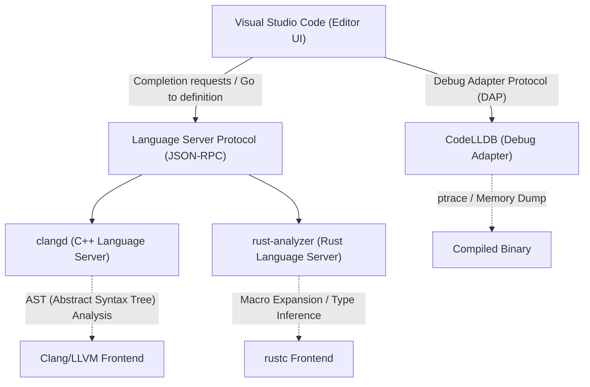
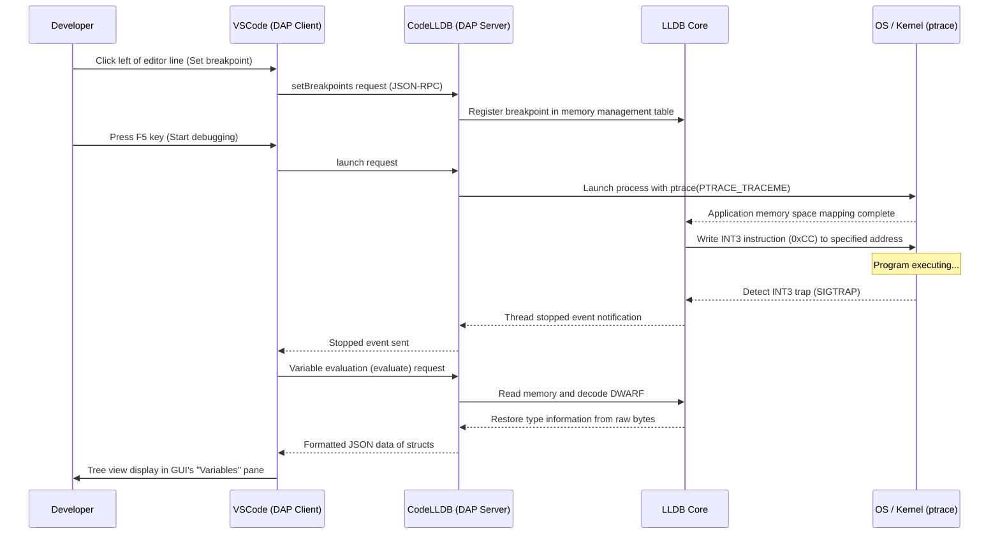

# Introduction

In modern systems programming, C++ and Rust have firmly established their positions as the most important languages. With a long track record and a massive ecosystem, C++ is indispensable for operating systems, game engines, and high-frequency trading (HFT) systems. Rust, on the other hand, is rapidly gaining popularity due to its memory safety provided by the ownership model and its modern language features, and is even being adopted in the Linux kernel. When developing in these two languages, the choice and configuration of your editor directly impacts development productivity.

Visual Studio Code (VSCode) is loved by systems programmers worldwide for its high extensibility and lightweight nature. However, right after installation, VSCode is merely a text editor. To unlock the true power of C++ and Rust, it is essential to introduce appropriate extensions and meticulously configure them, such as language servers that deeply understand language semantics and debuggers that track state at the binary level.

This article introduces 10 VSCode extensions for C++ and Rust developers to evolve their editor into the "ultimate Integrated Development Environment (IDE)". Rather than just listing them, we will thoroughly explore and explain the editor's internal architecture, specific advanced configurations for `tasks.json` and `launch.json`, language server performance optimization, and even mathematical models of syntax analysis.

---

## 1. Deep Architecture of VSCode and Language Server Protocol (LSP)

Before introducing the extensions, it is important to understand the underlying architecture of the Language Server Protocol (LSP), which enables VSCode to provide advanced code completion and syntax analysis.



The core of VSCode does not understand C++ template metaprogramming or complex Rust lifetime specifiers. The editor's role is strictly limited to displaying source code and accepting user input. Computationally expensive processes such as semantic analysis, type inference, and error checking are delegated to "language servers" running in the background via JSON-RPC.

This allows for smooth typing and fast responses even in codebases with millions of lines, without blocking the editor's UI thread.

---

## 2. 10 Essential VSCode Extensions

### ① clangd (Ultimate C++ IntelliSense)

For C++ developers, one of the most critical choices is the extension that provides C++ language features. Upon installing VSCode, Microsoft's official "C/C++ (ms-vscode.cpptools)" is often recommended, but for serious systems development, we strongly recommend **`clangd`**, officially provided by the LLVM project.

Because `clangd` directly incorporates Clang's frontend technologies (parser and semantic analyzer), its code analysis accuracy is extremely high. The errors and warnings displayed in the editor perfectly match what the actual compiler outputs.

#### Why Choose clangd over ms-vscode.cpptools?
- **Highly Accurate Analysis**: By directly handling Clang's AST (Abstract Syntax Tree), it accurately accurately evaluates complex template instantiations that heavily use SFINAE (Substitution Failure Is Not An Error) and nested macro expansions.
- **Speed through Background Indexing**: Symbol information for the entire project is pre-calculated (indexed) in the background, allowing features like "Go to Definition" and "Find All References" to complete instantly even in massive projects.

#### Perfect Configuration for compile_commands.json
For `clangd` to work correctly, a `compile_commands.json` file is required. This file describes the compiler flags (include paths and macro definitions) used to compile each source file in the project. If you are using CMake, you can generate it automatically with the following command:

```bash
cmake -B build -DCMAKE_EXPORT_COMPILE_COMMANDS=ON
```

In your VSCode settings file (`.vscode/settings.json`), tune the `clangd` launch arguments as follows:

```json
{
    "clangd.arguments": [
        "--compile-commands-dir=${workspaceFolder}/build",
        "--background-index",
        "--clang-tidy",
        "--header-insertion=iwyu",
        "--completion-style=detailed",
        "--j=6",
        "--pch-storage=memory"
    ]
}
```

Here, `--j=6` is the number of worker threads used for background indexing. Adjust this according to your CPU core count. Additionally, specifying `--pch-storage=memory` keeps precompiled headers (PCH) in memory, further improving parsing speed (though it consumes more RAM).

#### Mathematical Model of Language Server Response Time and AST Size

The language server response time $T_{response}$ depends on the size of the inputted file $S$ and the size of the indexed AST across the entire project $M_{ast}$. Considering the algorithmic complexity of syntax analysis, it can be approximately expressed as:

$$ T_{response} = \alpha \cdot O(S \log(M_{ast})) + \beta \cdot T_{IPC} $$

Where $\alpha$ is the parser efficiency coefficient, $\beta$ is the inter-process communication (IPC) overhead, and $T_{IPC}$ is the JSON-RPC serialization/deserialization time.
By perfecting background indexing (optimizing the pre-computed data structure for $M_{ast}$), `clangd` drastically reduces the constant term of the $\log(M_{ast})$ search order, enabling response times of just a few milliseconds even in massive projects with hundreds of thousands of lines of code.

---

### ② rust-analyzer (De Facto Standard for Rust Development)

In Rust development, **`rust-analyzer`** is currently adopted as the official language server. The previously standard RLS (Rust Language Server) had response limitations because its architecture directly called the compiler (`rustc`). In contrast, `rust-analyzer` was redesigned from scratch for IDEs, boasting powerful capabilities to incrementally parse even incomplete code.

#### Features that Yield Overwhelming Productivity
1. **Inlay Hints**: In Rust, where type inference is strong, it is recommended not to explicitly write variable types, though this can sometimes reduce readability. Inlay hints display inferred types and function call argument names as faint text overlays in the editor.
2. **Full Support for Procedural Macros (Proc-macros)**: Procedural macros like `serde`'s `#[derive(Serialize)]` and `tokio::main` receive the AST as a TokenStream at compile time and generate new code. `rust-analyzer` expands these macros internally, allowing completion and error checking to function on the generated code.
3. **Magic Completions**: For method chains like `iter().map().filter().collect()`, it can display step-by-step how the intermediate types are being transformed.

#### Recommended settings.json for rust-analyzer

```json
{
    "rust-analyzer.checkOnSave.command": "clippy",
    "rust-analyzer.cargo.allFeatures": true,
    "rust-analyzer.procMacro.enable": true,
    "rust-analyzer.inlayHints.bindingModeHints.enable": true,
    "rust-analyzer.inlayHints.closureReturnTypeHints.enable": "always",
    "rust-analyzer.lens.run.enable": true,
    "rust-analyzer.hover.actions.references.enable": true
}
```
Setting `cargo clippy` to run automatically in the background on save is practically essential. This allows you to immediately learn not only ownership violations but also performance improvement suggestions and more idiomatic Rust phrasing.

---

### ③ CodeLLDB (Powerful Cross-Platform Debugger)

Whether developing in C++ or Rust, a debugger is essential for inspecting memory states at runtime. **`CodeLLDB`** is extremely compatible with Rust and runs stably across all platforms: Windows, Mac, and Linux.

The Rust compiler (`rustc`) uses LLVM as its backend, and the format of the generated debug information (DWARF / PDB) is perfectly compatible with LLDB, which is also part of the LLVM project.

#### Advanced launch.json Configuration Example

Here is a configuration for `.vscode/launch.json` to start debugging in VSCode. This shows an integrated setup for debugging both C++ and Rust executables.

```json
{
    "version": "0.2.0",
    "configurations": [
        {
            "type": "lldb",
            "request": "launch",
            "name": "Debug C++ Application",
            "program": "${workspaceFolder}/build/src/my_cpp_app",
            "args": ["--config", "settings.ini", "--verbose"],
            "cwd": "${workspaceFolder}",
            "preLaunchTask": "build_cpp_debug",
            "stopOnEntry": false,
            "sourceLanguages": ["cpp"]
        },
        {
            "type": "lldb",
            "request": "launch",
            "name": "Debug Rust Cargo Binary",
            "cargo": {
                "args": [
                    "build",
                    "--bin=my_rust_app",
                    "--package=my_rust_app"
                ],
                "filter": {
                    "name": "my_rust_app",
                    "kind": "bin"
                }
            },
            "args": [],
            "cwd": "${workspaceFolder}",
            "sourceLanguages": ["rust"]
        }
    ]
}
```
Pay attention to the Rust configuration block. Because `CodeLLDB` natively supports `cargo` options, you do not need to directly specify the binary path, which often contains complex hash values after compilation. The editor automatically executes `cargo build`, captures the latest generated executable, and attaches the debugger to it.

---

### ④ CMake Tools

This extension allows you to fully control CMake, the industry-standard build system for C++ projects, right from within VSCode. **`CMake Tools`** eliminates the need to type tedious `cmake` commands in the command line, letting you select targets, build, and debug with a single click from the status bar at the bottom of the screen.

The `compile_commands.json` file required for `clangd` (mentioned earlier) can also be automatically copied to the appropriate location via this extension's settings.

#### CMake Integration Settings in settings.json

```json
{
    "cmake.configureOnOpen": true,
    "cmake.exportCompileCommandsFileAndCopy": "${workspaceFolder}/compile_commands.json",
    "cmake.buildDirectory": "${workspaceFolder}/build/${buildType}",
    "cmake.generator": "Ninja"
}
```
By specifying `Ninja` as the build tool, parallel compilation is better optimized than with default Make, significantly reducing build times. Even when switching build profiles (Debug / Release / RelWithDebInfo), the language server's analysis automatically tracks the new settings.

---

### ⑤ crates (Real-Time Management of Rust Dependencies)

This extension makes managing `Cargo.toml`, the Rust dependency configuration file, incredibly convenient.

Next to the version numbers of your dependencies (crates), it fetches in real-time whether a newer version exists on the official repository (Crates.io) and displays it inline in the editor.

```toml
[dependencies]
tokio = "1.28.0" # <- Faint text displays "Latest: 1.35.1" in the editor
serde = { version = "1.0", features = ["derive"] }
reqwest = "0.11" # <- If an update is needed, it can be fixed with one click
```
This helps prevent vulnerabilities and bugs caused by outdated libraries and ensures you don't fall behind the evolution of the ecosystem.

---

### ⑥ Error Lens

`Error Lens` is a groundbreaking extension that highlights lengthy C++ template errors or strict Rust Borrow Checker errors inline, directly to the right of the relevant line in the editor.

Normally, to check error details in VSCode, you have to open the "Problems" panel at the bottom of the screen or carefully hover your mouse cursor over the red squiggly line and wait for a popup. However, this action increases cognitive load and disrupts your coding flow state.

By introducing `Error Lens`, error messages appear at the edge of your vision as you type, without ever having to take your hands off the keyboard. In particular, complex lifetime errors in Rust such as "`cannot borrow 'x' as mutable because it is also borrowed as immutable`" can be instantly understood while looking at the affected line, drastically improving correction speed.

---

### ⑦ GitLens

Systems programming projects are often large-scale, and dealing with codebases that have a long history is a frequent occurrence. Tracking down "who, when, and why was this obscure pointer manipulation code added?" is one of the most important steps in bug fixing.

**`GitLens`** displays `git blame` information for the line at your current cursor position as a faint annotation in the editor. It also features a graphical file history explorer and line-by-line history tracking.

When encountering `unsafe` blocks in Rust or tricky cast operations in C++, being able to instantly reference the Pull Request and detailed commit message from when that code was merged is a powerful weapon in reverse engineering.

---

### ⑧ GitHub Copilot

Even in systems programming, the adoption of generative AI assistants has become an inevitable paradigm shift. **`GitHub Copilot`** provides highly accurate support for constructing tedious C++ boilerplate code and complex Rust iterator chains.

#### Utilizing AI in Systems Programming
- **Implementing the Rule of Five**: When writing a destructor, copy constructor, copy assignment operator, move constructor, and move assignment operator in C++, Copilot instantly proposes a correct, memory-leak-free implementation based on the class's member variables.
- **Context Understanding**: If you declare a function prototype in a C++ header file (`.hpp`) and immediately open the implementation file (`.cpp`), Copilot automatically completes the function signature and provides a boilerplate implementation.

---

### ⑨ Even Better TOML

This extension provides syntax highlighting, auto-formatting, and robust schema validation for Rust project configuration files like `Cargo.toml` and toolchain configurations like `rust-toolchain.toml`.

It issues real-time warnings for simple typos in `Cargo.toml` (for example, misspelling `[dependencies]` as `[dependencis]`), eliminating the time lost discovering errors only when you try to build. Also, because it validates against a JSON Schema, it can auto-complete available keys.

---

### ⑩ Code Spell Checker

In systems programming, accurate spelling of variable and function names directly relates to the readability and maintainability of the entire project. **`Code Spell Checker`** detects spelling errors in identifiers within the source code (automatically splitting camelCase `myVariable` and snake_case `my_variable` into words), comments, and string literals.

In design patterns where string literals are used as keys for C++'s `std::unordered_map` or Rust's `HashMap`, bugs caused by spelling errors (typos) can slip past the compiler and are very difficult to spot until they manifest as runtime errors. By introducing a spell checker and displaying squiggly line warnings in the editor, these simple mistakes can be completely eliminated during the coding phase.

---

## 3. Automating the Build Pipeline Using tasks.json

To complete the experience as an IDE, it is important to utilize not just the editor's GUI features, but also VSCode's Task feature (`.vscode/tasks.json`) so that you can execute builds and tests with a single keyboard shortcut (default is `Ctrl+Shift+B`).

Below is an advanced `tasks.json` configuration example that allows C++ builds using CMake and Rust builds using Cargo to coexist.

```json
{
    "version": "2.0.0",
    "tasks": [
        {
            "label": "build_cpp_debug",
            "type": "shell",
            "command": "cmake --build build --config Debug -j 8",
            "group": "build",
            "problemMatcher": [
                "$gcc"
            ],
            "presentation": {
                "reveal": "always",
                "panel": "shared"
            },
            "detail": "Builds the C++ project in Debug mode using CMake"
        },
        {
            "label": "cargo build",
            "type": "cargo",
            "command": "build",
            "problemMatcher": [
                "$rustc"
            ],
            "group": {
                "kind": "build",
                "isDefault": true
            },
            "presentation": {
                "reveal": "silent"
            },
            "detail": "Builds the Rust project using Cargo"
        }
    ]
}
```
The key here is the `problemMatcher` setting. By specifying `$gcc` or `$rustc`, VSCode will use regular expressions to parse the standard output of the command line executed in the background, extract the file name, line number, and column number where errors occurred, and list them in the "Problems" panel.

---

## 4. Visualizing Debugging Architecture and Advanced Analysis Methods

Bugs in systems programming often include complex issues such as memory corruption (segmentation faults), data races, and undefined behavior, which cannot be discovered by the editor's static analysis alone. Let's look at a sequence diagram to see exactly how the debugger (CodeLLDB) works with VSCode to monitor memory states at the OS kernel level.



As this sequence diagram shows, countless communications (Debug Adapter Protocol - DAP) occur between VSCode and CodeLLDB during a debugging session. Even complex data structures that are collections of pointers, such as C++'s `std::map` or Rust's `Vec<T>`, are displayed very intuitively (as a tree with array contents expanded) on VSCode's GUI, thanks to the formatter features built into CodeLLDB.

To make this possible, the Rust compiler embeds detailed type layout information (such as sizes and padding) within the DWARF format. CodeLLDB then strictly follows this information to beautifully convert the raw byte sequences in the target memory into a human-readable format.

---

## 5. Mathematical Modeling of Developer Productivity

Finally, let's use a mathematical model to evaluate how these extensions and automation settings impact productivity in actual development work.

The total time $T_{total}$ a developer needs to complete a specific task (such as implementing a new feature or fixing a complex bug) can be modeled with the following equation:

$$ T_{total} = T_{design} + T_{write} + \sum_{k=1}^{N} \left( T_{compile}^{(k)} + T_{debug}^{(k)} + \lambda_{switch} \cdot T_{context\_switch}^{(k)} \right) $$

Here, each variable means the following:
- $T_{design}$: Time required for architecture design (constant)
- $T_{write}$: Time required to write the actual code
- $N$: Number of compile-test-fix iterations
- $T_{compile}$: Compile time per iteration
- $T_{debug}$: Time to isolate and fix the cause of the bug
- $T_{context\_switch}$: Cognitive context switch time when moving between tools like editors, terminals, and browsers (document search)
- $\lambda_{switch}$: Penalty coefficient for loss of concentration caused by context switching

The extensions introduced this time act in a direction that minimizes almost all dynamic parameters in this equation.

1. **Drastic reduction of $T_{write}$**: Keystrokes are significantly reduced through completions based on the advanced type inference and macro expansion of `GitHub Copilot` and `rust-analyzer`.
2. **Minimization of $N$**: Because `Error Lens` and real-time linting (clippy, clang-tidy) allow you to detect and crush errors the moment you type, the number of iterations $N$—reworking code after discovering errors post-build—decreases.
3. **Optimization of $T_{debug}$**: With `CodeLLDB` and `GitLens`, checking variable states and grasping the intent behind code changes can be done instantly.
4. **Elimination of $T_{context\_switch}$**: Because all operations (code editing, building, debugging, checking Git history, fixing errors) are completely enclosed within the single window of VSCode, the penalty term $\lambda_{switch} \cdot T_{context\_switch}^{(k)}$ becomes almost zero.

As a result, the time required for the entire task $T_{total}$ is significantly shortened, allowing developers to allocate more time to more creative and essential aspects such as "design" ($T_{design}$) and algorithmic optimization.

---

## Conclusion

Both C++ and Rust are demanding languages aimed at "extracting the limit of hardware performance", requiring developers to have a high level of understanding and precise coding skills.

By applying the 10 extensions and configurations introduced in this article, VSCode evolves beyond a mere text editor into a "developer's powerful exoskeleton," combining deep compiler knowledge with the clairvoyant capabilities of a debugger.

1. **clangd** (C++ Language Server)
2. **rust-analyzer** (Rust Language Server)
3. **CodeLLDB** (Integrated Debugger)
4. **CMake Tools** (C++ Build Automation)
5. **crates** (Rust Dependency Management)
6. **Error Lens** (Inline Error Display)
7. **GitLens** (Advanced Git History Tracking)
8. **GitHub Copilot** (AI Coding Assistance)
9. **Even Better TOML** (Config File Validation)
10. **Code Spell Checker** (Typo Prevention)

It might take some time to customize the initial configuration files, but once built, your coding experience will become surprisingly comfortable and productive. By all means, use the architecture explanations and specific configurations (`settings.json`, `tasks.json`, `launch.json`) in this article as a reference to build your own ultimate development environment.

Wishing you a comfortable and safe systems programming life!
