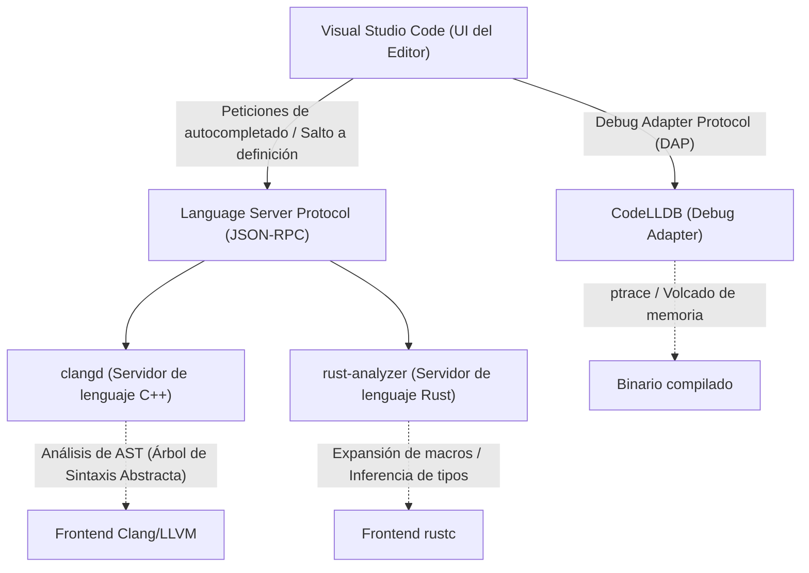
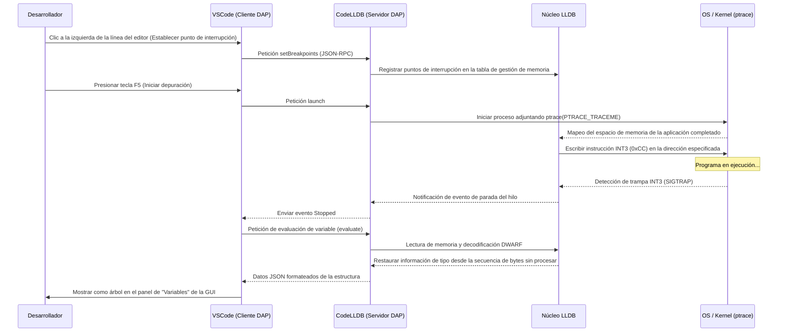

# Introducción

En la programación de sistemas moderna, C++ y Rust han establecido firmemente sus posiciones como los lenguajes más importantes. C++ es indispensable en sistemas operativos, motores de juegos y sistemas de comercio de alta frecuencia (HFT), contando con un largo historial y un ecosistema masivo. Por otro lado, Rust se está popularizando rápidamente gracias a su seguridad de memoria mediante el modelo de propiedad (Ownership) y sus características de lenguaje modernas, avanzando incluso en su adopción para el kernel de Linux. Al desarrollar en estos dos lenguajes, la elección y configuración del editor están directamente relacionadas con la productividad del desarrollo.

Visual Studio Code (VSCode) es utilizado por programadores de sistemas en todo el mundo debido a su alta extensibilidad y ligereza. Sin embargo, inmediatamente después de su instalación, VSCode no es más que un simple editor de texto. Para aprovechar el verdadero poder de C++ y Rust, es esencial introducir extensiones apropiadas y una configuración meticulosa, como servidores de lenguaje que entiendan profundamente la semántica del lenguaje y depuradores que rastreen el estado a nivel binario.

En este artículo, presentaremos 10 extensiones para desarrolladores de C++ y Rust que evolucionarán VSCode hasta convertirlo en el "entorno de desarrollo integrado (IDE) definitivo". No nos limitaremos a una simple lista, sino que profundizaremos exhaustivamente en la arquitectura interna del editor, ejemplos de configuración avanzada para `tasks.json` y `launch.json`, e incluso la optimización del rendimiento de los servidores de lenguaje y los modelos matemáticos del análisis sintáctico.

---

## 1. Arquitectura profunda de VSCode y Language Server Protocol (LSP)

Antes de presentar las extensiones, es importante comprender la arquitectura del Language Server Protocol (LSP), que sirve como base sobre la cual VSCode proporciona funciones avanzadas de autocompletado y análisis sintáctico.



El núcleo de VSCode no entiende la metaprogramación de plantillas de C++ ni los complejos especificadores de tiempo de vida (lifetimes) de Rust. El rol del editor se limita a mostrar el código fuente y recibir las entradas del usuario, mientras que las operaciones costosas computacionalmente como el análisis semántico, la inferencia de tipos y la verificación de errores se delegan a un "servidor de lenguaje" que se ejecuta en segundo plano a través de JSON-RPC.

Esto permite una escritura fluida y respuestas rápidas, incluso en bases de código masivas de millones de líneas, sin bloquear el hilo de la interfaz de usuario del editor.

---

## 2. 10 extensiones de VSCode imprescindibles

### ① clangd (IntelliSense definitivo para C++)

Una de las decisiones más importantes para los desarrolladores de C++ es la extensión que proporciona las características del lenguaje. Al instalar VSCode, a menudo se recomienda la extensión oficial de Microsoft "C/C++ (ms-vscode.cpptools)", pero para el desarrollo de sistemas a gran escala, recomendamos encarecidamente **`clangd`**, proporcionado oficialmente por el proyecto LLVM.

Dado que `clangd` incorpora directamente las tecnologías de frontend (analizador y analizador semántico) de Clang (el compilador), su precisión en el análisis de código es extremadamente alta. Los errores y advertencias que se muestran en el editor coinciden perfectamente con los producidos por el compilador real.

#### Razones para elegir clangd en lugar de ms-vscode.cpptools
- **Análisis de alta precisión**: Al tratar directamente con el AST (Árbol de Sintaxis Abstracta) de Clang, evalúa con precisión instanciaciones de plantillas complejas que hacen un uso intensivo de SFINAE (Substitution Failure Is Not An Error) y expansiones de macros anidadas.
- **Aceleración mediante indexación en segundo plano**: Como precalcula (indexa) la información de los símbolos de todo el proyecto en segundo plano, acciones como "Ir a la definición" o "Buscar todas las referencias" se completan instantáneamente, incluso en proyectos gigantescos.

#### Configuración perfecta de compile_commands.json
Para que `clangd` funcione correctamente, es indispensable un archivo `compile_commands.json` que describa los flags del compilador (rutas de inclusión y definiciones de macros) con los que se compila cada archivo fuente del proyecto. Si usas CMake, puedes generarlo automáticamente con el siguiente comando:

```bash
cmake -B build -DCMAKE_EXPORT_COMPILE_COMMANDS=ON
```

En el archivo de configuración de VSCode (`.vscode/settings.json`), ajusta los argumentos de inicio de `clangd` de la siguiente manera:

```json
{
    "clangd.arguments": [
        "--compile-commands-dir=${workspaceFolder}/build",
        "--background-index",
        "--clang-tidy",
        "--header-insertion=iwyu",
        "--completion-style=detailed",
        "--j=6",
        "--pch-storage=memory"
    ]
}
```

Aquí, `--j=6` es el número de hilos de trabajo utilizados para la indexación en segundo plano. Ajústalo según el número de núcleos de CPU de tu máquina. Además, al especificar `--pch-storage=memory`, puedes mantener los encabezados precompilados (PCH) en la memoria, lo que mejora aún más la velocidad de análisis (aunque consumirá más RAM).

#### Modelo matemático del tiempo de respuesta del servidor de lenguaje y el tamaño del AST

El tiempo de respuesta del servidor de lenguaje, $T_{response}$, depende del tamaño del archivo introducido, $S$, y del tamaño del AST indexado en todo el proyecto, $M_{ast}$. Considerando la complejidad algorítmica del análisis sintáctico, esto puede expresarse aproximadamente con la siguiente fórmula:

$$ T_{response} = \alpha \cdot O(S \log(M_{ast})) + \beta \cdot T_{IPC} $$

Donde $\alpha$ es el coeficiente de eficiencia del analizador, $\beta$ es la sobrecarga de la comunicación entre procesos (IPC) y $T_{IPC}$ es el tiempo de serialización/deserialización de JSON-RPC.
Al optimizar al máximo la indexación en segundo plano (optimización de la estructura de datos precalculada de $M_{ast}$), `clangd` reduce drásticamente el término constante de la complejidad de búsqueda $\log(M_{ast})$, permitiendo respuestas en pocos milisegundos incluso en proyectos enormes de cientos de miles de líneas.

---

### ② rust-analyzer (El estándar de facto para el desarrollo en Rust)

Para el desarrollo en Rust, el servidor de lenguaje oficial adoptado actualmente es **`rust-analyzer`**. El antiguo estándar, RLS (Rust Language Server), tenía limitaciones en el tiempo de respuesta debido a su arquitectura que llamaba directamente al compilador (rustc). Sin embargo, `rust-analyzer` fue rediseñado desde cero para IDEs y cuenta con funciones poderosas capaces de analizar incrementalmente incluso código incompleto.

#### Características que generan una productividad abrumadora
1. **Inlay Hints (Sugerencias integradas)**: En Rust, con su fuerte inferencia de tipos, se recomienda no escribir los tipos de las variables explícitamente, pero esto puede reducir la legibilidad. Inlay Hints superpone los tipos inferidos y los nombres de los argumentos en las llamadas a funciones con un texto tenue en el editor.
2. **Soporte completo para macros procedimentales (Proc-macro)**: Las macros procedimentales como `#[derive(Serialize)]` de `serde` o `tokio::main` reciben el AST como un TokenStream en tiempo de compilación y generan nuevo código. `rust-analyzer` expande estas macros internamente, permitiendo que el autocompletado y la verificación de errores funcionen también en el código generado.
3. **Magic Completions (Completado mágico)**: En cadenas de métodos como `iter().map().filter().collect()`, puede mostrar paso a paso cómo se transforman los tipos intermedios.

#### settings.json recomendado para rust-analyzer

```json
{
    "rust-analyzer.checkOnSave.command": "clippy",
    "rust-analyzer.cargo.allFeatures": true,
    "rust-analyzer.procMacro.enable": true,
    "rust-analyzer.inlayHints.bindingModeHints.enable": true,
    "rust-analyzer.inlayHints.closureReturnTypeHints.enable": "always",
    "rust-analyzer.lens.run.enable": true,
    "rust-analyzer.hover.actions.references.enable": true
}
```
Se puede decir que la configuración para ejecutar automáticamente `cargo clippy` en segundo plano al guardar es imprescindible. Esto te permite aprender instantáneamente no solo sobre infracciones de propiedad (ownership), sino también sugerencias de mejora de rendimiento o formas más idiomáticas de escribir en Rust.

---

### ③ CodeLLDB (Depurador potente multiplataforma)

Ya sea que desarrolles en C++ o Rust, un depurador para inspeccionar el estado de la memoria en tiempo de ejecución es esencial. Especialmente, **`CodeLLDB`** funciona de manera estable en todas las plataformas (Windows, Mac, Linux) y tiene una afinidad extremadamente alta con Rust.

El compilador de Rust (rustc) utiliza LLVM como backend, y el formato de la información de depuración generada (DWARF / PDB) es perfectamente compatible con LLDB, que también forma parte del proyecto LLVM.

#### Ejemplo de configuración avanzada para launch.json

Esta es la configuración de `.vscode/launch.json` para iniciar la depuración en VSCode. Aquí mostramos una configuración integrada para depurar ejecutables tanto de C++ como de Rust.

```json
{
    "version": "0.2.0",
    "configurations": [
        {
            "type": "lldb",
            "request": "launch",
            "name": "Debug C++ Application",
            "program": "${workspaceFolder}/build/src/my_cpp_app",
            "args": ["--config", "settings.ini", "--verbose"],
            "cwd": "${workspaceFolder}",
            "preLaunchTask": "build_cpp_debug",
            "stopOnEntry": false,
            "sourceLanguages": ["cpp"]
        },
        {
            "type": "lldb",
            "request": "launch",
            "name": "Debug Rust Cargo Binary",
            "cargo": {
                "args": [
                    "build",
                    "--bin=my_rust_app",
                    "--package=my_rust_app"
                ],
                "filter": {
                    "name": "my_rust_app",
                    "kind": "bin"
                }
            },
            "args": [],
            "cwd": "${workspaceFolder}",
            "sourceLanguages": ["rust"]
        }
    ]
}
```
Presta atención al bloque de configuración de Rust. Dado que `CodeLLDB` soporta nativamente las opciones de `cargo`, no hay necesidad de especificar directamente la ruta del binario compilado que incluye complejos hashes. El editor ejecuta automáticamente `cargo build`, captura el archivo ejecutable más reciente generado y le adjunta el depurador.

---

### ④ CMake Tools

Esta es la extensión para controlar completamente CMake, el sistema de construcción estándar de la industria para proyectos C++, dentro de VSCode. **`CMake Tools`** elimina la necesidad de escribir comandos engorrosos de `cmake` en la línea de comandos, permitiéndote seleccionar objetivos, construir y depurar con un solo clic desde la barra de estado en la parte inferior de la pantalla.

El archivo `compile_commands.json` necesario para `clangd`, mencionado anteriormente, también se puede copiar automáticamente a la ubicación adecuada mediante la configuración de esta extensión.

#### Configuración de integración de CMake en settings.json

```json
{
    "cmake.configureOnOpen": true,
    "cmake.exportCompileCommandsFileAndCopy": "${workspaceFolder}/compile_commands.json",
    "cmake.buildDirectory": "${workspaceFolder}/build/${buildType}",
    "cmake.generator": "Ninja"
}
```
Al especificar `Ninja` como herramienta de construcción, la compilación en paralelo se optimiza más que con el Make predeterminado, reduciendo significativamente el tiempo de compilación. Incluso cuando cambias los perfiles de construcción (Debug / Release / RelWithDebInfo), el análisis del servidor de lenguaje sigue automáticamente la nueva configuración.

---

### ⑤ crates (Gestión en tiempo real de dependencias de paquetes Rust)

Esta es una extensión que hace que `Cargo.toml`, el archivo de gestión de dependencias de Rust, sea extremadamente útil.

Junto al número de versión de un crate (biblioteca) dependiente, obtiene en tiempo real si existe una versión más reciente registrada en Crates.io (el repositorio oficial) y la muestra en línea en el editor.

```toml
[dependencies]
tokio = "1.28.0" # <- Se muestra un texto tenue en el editor "Latest: 1.35.1"
serde = { version = "1.0", features = ["derive"] }
reqwest = "0.11" # <- Si es necesaria una actualización, se puede corregir con un solo clic
```
Esto te permite prevenir vulnerabilidades y errores causados por bibliotecas desactualizadas y mantenerte al día con la evolución del ecosistema sin quedarte atrás.

---

### ⑥ Error Lens

`Error Lens` es una extensión revolucionaria que resalta directamente en línea, en el lado derecho de la línea correspondiente del editor, los largos errores de plantillas de C++ y los estrictos errores del borrow checker (comprobador de préstamos) de Rust.

Normalmente, para ver los detalles de un error en VSCode, debes abrir el panel de "Problemas (Problems)" en la parte inferior de la pantalla o esperar al mensaje emergente colocando el cursor del ratón exactamente sobre la línea ondulada roja en el texto. Sin embargo, esta acción aumenta la carga cognitiva y obstaculiza el estado de flujo durante la programación.

Al incorporar `Error Lens`, los mensajes de error aparecen en el borde de tu visión mientras escribes código, sin tener que quitar las manos del teclado. Especialmente los complejos errores de tiempo de vida en Rust como "`cannot borrow 'x' as mutable because it is also borrowed as immutable`" pueden entenderse instantáneamente mientras miras la línea correspondiente, lo que mejora drásticamente la velocidad de corrección.

---

### ⑦ GitLens

Los proyectos de programación de sistemas suelen ser a gran escala e implican frecuentemente trabajar con bases de código con una larga historia. Rastrear "¿Quién, cuándo y por qué se añadió este código complicado de manipulación de punteros?" es uno de los pasos más importantes en la corrección de errores.

**`GitLens`** muestra de manera tenue la información de `git blame` para la línea en la posición actual del cursor como una anotación en el editor. Además, cuenta con características para explorar gráficamente el historial de confirmaciones de todo el archivo y rastrear el historial línea por línea (Line History).

Cuando encuentras bloques `unsafe` de Rust o procesos de casting (conversión de tipos) engañosos en C++, el poder consultar de inmediato la Pull Request (Solicitud de Extracción) o el mensaje de confirmación detallado de cuando se fusionó ese código, se convierte en un arma poderosa para la ingeniería inversa.

---

### ⑧ GitHub Copilot

Incluso en la programación de sistemas, la introducción de asistentes de inteligencia artificial generativa ya se ha convertido en un cambio de paradigma inevitable. **`GitHub Copilot`** asiste con altísima precisión en la construcción de código boilerplate redundante en C++ y complejas cadenas de iteradores en Rust.

#### Uso de la IA en la programación de sistemas
- **Implementación de la Regla de los Cinco (Rule of Five)**: Al escribir un destructor, constructor de copia, operador de asignación de copia, constructor de movimiento y operador de asignación de movimiento en C++, Copilot propone instantáneamente una implementación precisa sin fugas de memoria, basándose en las variables miembro de la clase.
- **Comprensión del contexto**: Inmediatamente después de declarar un prototipo de función en un archivo de cabecera de C++ (`.hpp`), si abres el archivo de implementación (`.cpp`), Copilot completa automáticamente la firma de esa función y proporciona un esqueleto de su implementación.

---

### ⑨ Even Better TOML

Esta es una extensión que proporciona resaltado de sintaxis, formato automático y una potente validación de esquemas (Schema Validation) para el archivo de configuración del proyecto de Rust `Cargo.toml` y el archivo de configuración del toolchain `rust-toolchain.toml`.

Advierte en tiempo real sobre simples errores tipográficos en `Cargo.toml` (por ejemplo, escribir `[dependencis]` en lugar de `[dependencies]`), lo que elimina la pérdida de tiempo de darse cuenta del error solo al ejecutar la construcción. Además, como la validación se realiza en base a JSON Schema, es posible autocompletar las claves disponibles.

---

### ⑩ Code Spell Checker

En la programación de sistemas, la ortografía correcta de los nombres de variables y funciones está directamente ligada a la legibilidad y mantenibilidad de todo el proyecto. **`Code Spell Checker`** detecta errores ortográficos en los identificadores dentro del código fuente (desglosa automáticamente camelCase como `myVariable` o snake_case como `my_variable` en palabras), así como en comentarios y cadenas literales.

En el caso del patrón de diseño donde se usan cadenas literales como claves de un `std::unordered_map` en C++ o un `HashMap` en Rust, un error ortográfico (typo) pasará la compilación, y posee la propiedad muy molesta de ser difícil de notar hasta que se manifieste como un error en tiempo de ejecución. Al introducir un corrector ortográfico y mostrar advertencias con líneas onduladas en el editor, puedes eliminar por completo estos errores simples en la etapa de codificación.

---

## 3. Automatización del flujo de construcción usando tasks.json

Para completar las capacidades como IDE, es importante no solo utilizar las funciones de la interfaz gráfica del editor, sino también aprovechar la función de tareas de VSCode (`.vscode/tasks.json`) y configurarlo para que puedas ejecutar la construcción o las pruebas con un solo atajo de teclado (por defecto, `Ctrl+Shift+B`).

A continuación se muestra un ejemplo avanzado de configuración de `tasks.json` que permite la coexistencia de la construcción de C++ usando CMake y la de Rust usando Cargo.

```json
{
    "version": "2.0.0",
    "tasks": [
        {
            "label": "build_cpp_debug",
            "type": "shell",
            "command": "cmake --build build --config Debug -j 8",
            "group": "build",
            "problemMatcher": [
                "$gcc"
            ],
            "presentation": {
                "reveal": "always",
                "panel": "shared"
            },
            "detail": "Construye el proyecto C++ en modo Debug usando CMake"
        },
        {
            "label": "cargo build",
            "type": "cargo",
            "command": "build",
            "problemMatcher": [
                "$rustc"
            ],
            "group": {
                "kind": "build",
                "isDefault": true
            },
            "presentation": {
                "reveal": "silent"
            },
            "detail": "Construye el proyecto Rust usando Cargo"
        }
    ]
}
```
La clave aquí es la configuración de `problemMatcher`. Al especificar `$gcc` y `$rustc`, VSCode analiza mediante expresiones regulares la salida estándar de la línea de comandos ejecutada en segundo plano, extrae los nombres de archivo, números de línea y de columna donde ocurrieron los errores, y los lista en el panel de "Problemas".

---

## 4. Visualización de la arquitectura de depuración y técnicas avanzadas de análisis

Los errores en la programación de sistemas, como corrupciones de memoria (errores de segmentación), carreras de datos (data races) y comportamientos indefinidos, a menudo son demasiado complejos para ser detectados únicamente por el análisis estático del editor. Revisemos mediante un diagrama de secuencia cómo el depurador (CodeLLDB) coopera con VSCode y monitoriza el estado de la memoria a nivel del kernel del sistema operativo.



Como muestra este diagrama de secuencia, durante una sesión de depuración se realizan innumerables comunicaciones (Debug Adapter Protocol - DAP) entre VSCode y CodeLLDB. Las estructuras de datos complejas que son colecciones de punteros, como `std::map` en C++ o `Vec<T>` en Rust, se muestran de forma muy intuitiva (como un árbol con el contenido del arreglo desplegado) en la GUI de VSCode gracias a la función de formateo incorporada en CodeLLDB.

Para que esto sea posible, el compilador de Rust incrusta detalladamente la información del diseño de los tipos (tamaño, relleno, etc.) en formato DWARF, y CodeLLDB la sigue para convertir magistralmente los bytes sin procesar de la memoria objetivo en un formato legible por humanos.

---

## 5. Modelado matemático de la Productividad del desarrollador

Finalmente, evaluemos usando un modelo matemático cómo estas extensiones y configuraciones de automatización impactan la productividad real en las tareas de desarrollo.

El tiempo total $T_{total}$ que le toma a un desarrollador completar una tarea específica (como implementar una nueva función o corregir un error complejo) se puede modelar con la siguiente ecuación:

$$ T_{total} = T_{design} + T_{write} + \sum_{k=1}^{N} \left( T_{compile}^{(k)} + T_{debug}^{(k)} + \lambda_{switch} \cdot T_{context\_switch}^{(k)} \right) $$

Donde cada variable tiene el siguiente significado:
- $T_{design}$: Tiempo dedicado al diseño de la arquitectura (constante)
- $T_{write}$: Tiempo dedicado a escribir el código real
- $N$: Número de iteraciones de compilación, prueba y corrección
- $T_{compile}$: Tiempo de compilación por cada iteración
- $T_{debug}$: Tiempo para identificar y corregir la causa de un error
- $T_{context\_switch}$: Tiempo del cambio de contexto cognitivo al moverse entre herramientas como el editor, terminal o navegador (búsqueda de documentación)
- $\lambda_{switch}$: Coeficiente de penalización por la pérdida de concentración causada por el cambio de contexto

Las extensiones presentadas en esta ocasión funcionan en dirección a minimizar casi todos los parámetros dinámicos de esta ecuación.

1. **Reducción drástica de $T_{write}$**: Gracias al autocompletado basado en inferencia de tipos avanzada y expansión de macros de `GitHub Copilot` y `rust-analyzer`, el número de pulsaciones de teclas disminuye drásticamente.
2. **Minimización de $N$**: Con `Error Lens` y los Lints en tiempo real (clippy, clang-tidy), los errores se pueden detectar y corregir en el momento de teclear. Esto reduce el número de retrocesos $N$, evitando situaciones donde te das cuenta de un error solo después de ejecutar la construcción.
3. **Optimización de $T_{debug}$**: `CodeLLDB` y `GitLens` permiten verificar instantáneamente el estado de las variables y comprender la intención detrás de los cambios en el código.
4. **Eliminación de $T_{context\_switch}$**: Todas las operaciones (edición de código, construcción, depuración, revisión del historial de Git, corrección de errores) se completan completamente dentro de una única ventana de VSCode, por lo que el término de penalización $\lambda_{switch} \cdot T_{context\_switch}^{(k)}$ se vuelve casi cero.

Como resultado, el tiempo requerido para toda la tarea $T_{total}$ se acorta significativamente, permitiendo a los desarrolladores dedicar más tiempo al "diseño ($T_{design}$)", que es más creativo y esencial, o a la optimización de algoritmos.

---

## Conclusión

Tanto C++ como Rust son lenguajes rigurosos cuyo objetivo es "exprimir el rendimiento límite del hardware", requiriendo de los desarrolladores un alto nivel de comprensión y una codificación precisa.

Al aplicar las 10 extensiones y configuraciones presentadas en este artículo, VSCode trasciende el marco de un simple editor de texto, evolucionando hacia un "exoesqueleto poderoso para desarrolladores" que combina el profundo conocimiento de un compilador y la capacidad de visión de un depurador.

1. **clangd** (Servidor de lenguaje C++)
2. **rust-analyzer** (Servidor de lenguaje Rust)
3. **CodeLLDB** (Depurador integrado)
4. **CMake Tools** (Automatización de construcción C++)
5. **crates** (Gestión de dependencias de Rust)
6. **Error Lens** (Visualización de errores en línea)
7. **GitLens** (Seguimiento avanzado de historial de Git)
8. **GitHub Copilot** (Asistencia de codificación con IA)
9. **Even Better TOML** (Validación de archivos de configuración)
10. **Code Spell Checker** (Prevención de errores tipográficos)

Personalizar los archivos de configuración iniciales puede tomar algo de tiempo, pero una vez configurado, la experiencia de codificación posterior será sorprendentemente cómoda y productiva. Esperamos que uses las explicaciones arquitectónicas y las configuraciones específicas (`settings.json`, `tasks.json`, `launch.json`) de este artículo como referencia para construir tu propio entorno de desarrollo definitivo.

¡Te deseamos una vida de programación de sistemas cómoda y segura!
