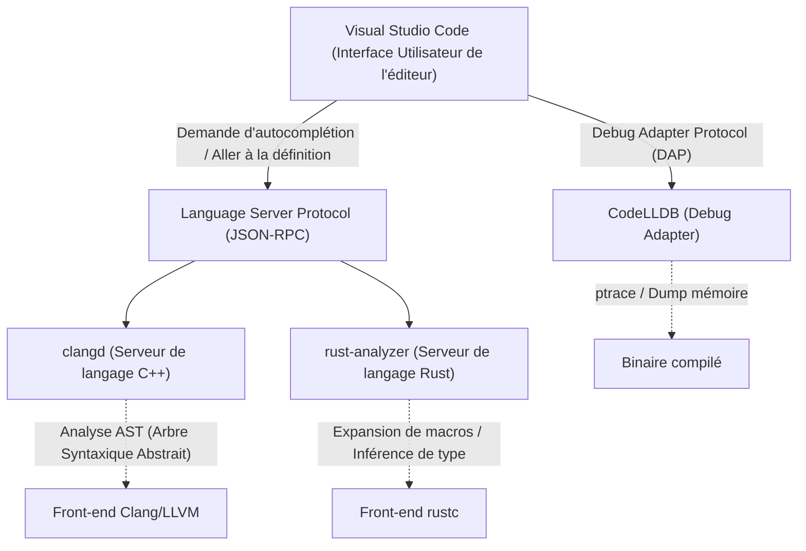
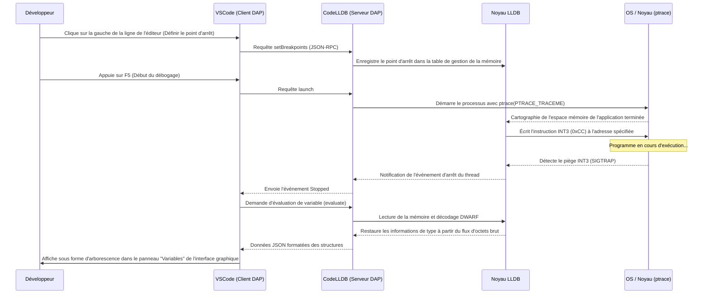

# Introduction

Dans la programmation système moderne, le C++ et le Rust ont solidement établi leur position comme les langages les plus importants. Le C++, avec sa longue histoire et son vaste écosystème, est indispensable pour les systèmes d'exploitation (OS), les moteurs de jeux et les systèmes de trading à haute fréquence (HFT). D'autre part, le Rust, qui se propage rapidement grâce à sa sécurité mémoire assurée par son modèle de possession (Ownership) et ses spécifications de langage modernes, est de plus en plus adopté dans le noyau Linux. Lors du développement dans ces deux langages, le choix de l'éditeur et sa configuration ont un impact direct sur la productivité du développement.

Visual Studio Code (VSCode) est largement utilisé par les programmeurs système du monde entier pour sa grande extensibilité et sa légèreté. Cependant, juste après son installation, VSCode n'est rien de plus qu'un simple éditeur de texte. Pour libérer la véritable puissance du C++ et du Rust, il est essentiel d'introduire et de configurer minutieusement les extensions appropriées, comme des serveurs de langage comprenant profondément la sémantique du langage et des débogueurs qui tracent l'état au niveau binaire.

Dans cet article, nous présenterons 10 extensions pour les développeurs C++ et Rust afin d'évoluer VSCode en « le meilleur Environnement de Développement Intégré (IDE) ». Au-delà d'une simple liste, nous explorerons en profondeur l'architecture interne de l'éditeur, des exemples de configuration avancée pour `tasks.json` et `launch.json`, ainsi que l'optimisation des performances des serveurs de langage et des modèles mathématiques d'analyse syntaxique.

---

## 1. L'architecture profonde de VSCode et du Language Server Protocol (LSP)

Avant d'introduire les extensions, il est important de comprendre l'architecture sous-jacente du Language Server Protocol (LSP), qui est la base sur laquelle VSCode fournit l'autocomplétion de code avancée et l'analyse syntaxique.



Le noyau de VSCode ne comprend pas la métaprogrammation des templates C++ ou les spécificateurs de durée de vie (lifetimes) complexes du Rust. Le rôle de l'éditeur se limite à l'affichage du code source et à l'acceptation de l'entrée utilisateur, tandis que les processus coûteux en calcul tels que l'analyse sémantique (Semantic Analysis), l'inférence de type (Type Inference) et la vérification des erreurs sont délégués aux « serveurs de langage » en arrière-plan via JSON-RPC.

Cela permet d'obtenir une frappe fluide et des réponses rapides même avec de grandes bases de code de millions de lignes, sans bloquer le fil d'interface utilisateur (UI thread) de l'éditeur.

---

## 2. 10 extensions VSCode indispensables

### ① clangd (L'IntelliSense C++ Ultime)

L'un des choix les plus importants pour les développeurs C++ est l'extension qui fournit les fonctionnalités du langage C++. Bien que l'extension officielle de Microsoft « C/C++ (ms-vscode.cpptools) » soit souvent recommandée après l'installation de VSCode, pour le développement de systèmes sérieux, nous recommandons fortement **`clangd`**, fourni officiellement par le projet LLVM.

Comme `clangd` intègre directement la technologie front-end du compilateur Clang (analyseur syntaxique et analyseur sémantique), la précision de l'analyse du code est extrêmement élevée. Les erreurs et les avertissements affichés dans l'éditeur correspondent parfaitement à ceux générés par le compilateur réel.

#### Pourquoi choisir clangd au lieu de ms-vscode.cpptools
- **Analyse de haute précision** : En manipulant directement l'AST (Abstract Syntax Tree) de Clang, il évalue précisément l'instanciation de templates complexes utilisant de manière intensive le SFINAE (Substitution Failure Is Not An Error) et l'expansion de macros imbriquées.
- **Accélération grâce à l'indexation en arrière-plan** : En précalculant (indexant) les informations de symboles de l'ensemble du projet en arrière-plan, les opérations "Aller à la définition (Go to Definition)" ou "Trouver toutes les références (Find All References)" s'exécutent instantanément, même dans des projets gigantesques.

#### Configuration complète de compile_commands.json
Pour que `clangd` fonctionne correctement, un fichier `compile_commands.json` décrivant avec quels indicateurs de compilation (chemins d'inclusion et définitions de macros) chaque fichier source du projet est compilé, est indispensable. Si vous utilisez CMake, il peut être généré automatiquement avec la commande suivante.

```bash
cmake -B build -DCMAKE_EXPORT_COMPILE_COMMANDS=ON
```

Dans le fichier de configuration de VSCode (`.vscode/settings.json`), ajustez les arguments de lancement de `clangd` comme suit :

```json
{
    "clangd.arguments": [
        "--compile-commands-dir=${workspaceFolder}/build",
        "--background-index",
        "--clang-tidy",
        "--header-insertion=iwyu",
        "--completion-style=detailed",
        "--j=6",
        "--pch-storage=memory"
    ]
}
```

Ici, `--j=6` correspond au nombre de threads de travail (workers) utilisés pour l'indexation en arrière-plan. Ajustez-le en fonction du nombre de cœurs CPU disponibles. De plus, en spécifiant `--pch-storage=memory`, les en-têtes précompilés (PCH) sont conservés en mémoire, ce qui peut encore améliorer la vitesse d'analyse (bien que cela consomme plus de RAM).

#### Modèle mathématique du temps de réponse du serveur de langage et de la taille de l'AST

Le temps de réponse $T_{response}$ d'un serveur de langage dépend de la taille du fichier d'entrée $S$ et de la taille de l'AST indexé sur l'ensemble du projet $M_{ast}$. En considérant la complexité algorithmique de l'analyse syntaxique, cela peut s'exprimer par la formule approximative suivante :

$$ T_{response} = \alpha \cdot O(S \log(M_{ast})) + \beta \cdot T_{IPC} $$

Où $\alpha$ est le coefficient d'efficacité de l'analyseur (parser), $\beta$ est la surcharge de la communication inter-processus (IPC), et $T_{IPC}$ est le temps de sérialisation/désérialisation de JSON-RPC.
`clangd` maîtrise l'indexation en arrière-plan (optimisation de la structure de données de précalcul de $M_{ast}$) en réduisant de manière spectaculaire le terme constant de l'ordre de recherche $\log(M_{ast})$, permettant un temps de réponse de quelques millisecondes, même pour d'énormes projets de centaines de milliers de lignes.

---

### ② rust-analyzer (Le standard de facto du développement Rust)

Dans le développement Rust, **`rust-analyzer`** est actuellement adopté comme serveur de langage officiel. Le RLS (Rust Language Server) anciennement standard avait des limites de réactivité en raison de son architecture qui appelait directement le compilateur (rustc), mais `rust-analyzer` a été conçu de zéro pour les IDE, avec la capacité puissante de parser incrémentalement même du code incomplet.

#### Des fonctionnalités générant une productivité écrasante
1. **Inlay Hints (Indices incrustés)** : Dans Rust, où l'inférence de type est puissante, il est recommandé de ne pas écrire explicitement le type des variables, mais cela peut réduire la lisibilité. Les Inlay Hints affichent les types inférés et les noms d'arguments d'appels de fonction en superposition avec un texte clair dans l'éditeur.
2. **Support complet des macros procédurales (Proc-macro)** : Les macros procédurales comme `#[derive(Serialize)]` de `serde` ou `tokio::main` reçoivent l'AST sous forme de TokenStream lors de la compilation pour générer du nouveau code. `rust-analyzer` étend ces macros en interne et fait fonctionner l'autocomplétion et la vérification des erreurs même sur le code généré.
3. **Magic Completions** : Dans les chaînes de méthodes comme `iter().map().filter().collect()`, il peut afficher étape par étape comment les types intermédiaires sont transformés.

#### rust-analyzer : settings.json recommandé

```json
{
    "rust-analyzer.checkOnSave.command": "clippy",
    "rust-analyzer.cargo.allFeatures": true,
    "rust-analyzer.procMacro.enable": true,
    "rust-analyzer.inlayHints.bindingModeHints.enable": true,
    "rust-analyzer.inlayHints.closureReturnTypeHints.enable": "always",
    "rust-analyzer.lens.run.enable": true,
    "rust-analyzer.hover.actions.references.enable": true
}
```
Exécuter automatiquement `cargo clippy` en arrière-plan lors de l'enregistrement est indispensable. Cela permet non seulement de détecter les violations de possession, mais aussi de recevoir des suggestions d'amélioration des performances et d'apprendre instantanément une syntaxe plus propre et idiomatique (Rust-like).

---

### ③ CodeLLDB (Le débogueur multiplateforme puissant)

Que l'on développe en C++ ou en Rust, un débogueur pour inspecter l'état de la mémoire lors de l'exécution est indispensable. En particulier, **`CodeLLDB`** fonctionne de manière stable sur toutes les plateformes (Windows, Mac, Linux) et a une très forte affinité avec Rust.

Le compilateur Rust (rustc) utilise LLVM comme back-end, et le format des informations de débogage générées (DWARF / PDB) est parfaitement compatible avec LLDB, qui fait également partie du projet LLVM.

#### Exemple de configuration avancée de launch.json

Voici la configuration de `.vscode/launch.json` pour démarrer le débogage dans VSCode. Ceci montre une configuration intégrée pour déboguer à la fois les exécutables C++ et Rust.

```json
{
    "version": "0.2.0",
    "configurations": [
        {
            "type": "lldb",
            "request": "launch",
            "name": "Debug C++ Application",
            "program": "${workspaceFolder}/build/src/my_cpp_app",
            "args": ["--config", "settings.ini", "--verbose"],
            "cwd": "${workspaceFolder}",
            "preLaunchTask": "build_cpp_debug",
            "stopOnEntry": false,
            "sourceLanguages": ["cpp"]
        },
        {
            "type": "lldb",
            "request": "launch",
            "name": "Debug Rust Cargo Binary",
            "cargo": {
                "args": [
                    "build",
                    "--bin=my_rust_app",
                    "--package=my_rust_app"
                ],
                "filter": {
                    "name": "my_rust_app",
                    "kind": "bin"
                }
            },
            "args": [],
            "cwd": "${workspaceFolder}",
            "sourceLanguages": ["rust"]
        }
    ]
}
```
Notez le bloc de configuration de Rust. Puisque `CodeLLDB` supporte nativement l'option `cargo`, il n'est pas nécessaire de spécifier directement le chemin du binaire contenant un hachage complexe après la compilation. L'éditeur exécute automatiquement `cargo build`, capture le dernier exécutable généré et y attache le débogueur.

---

### ④ CMake Tools

C'est une extension pour contrôler entièrement depuis VSCode le système de construction standard de l'industrie pour les projets C++, CMake. **`CMake Tools`** élimine le besoin d'entrer des commandes `cmake` fastidieuses dans la ligne de commande, permettant la sélection de cibles, la construction et le débogage en un seul clic à partir de la barre d'état en bas de l'écran.

Le fichier `compile_commands.json` nécessaire pour `clangd` mentionné précédemment peut également être copié automatiquement au bon endroit grâce aux paramètres de cette extension.

#### Paramètres d'intégration de CMake dans settings.json

```json
{
    "cmake.configureOnOpen": true,
    "cmake.exportCompileCommandsFileAndCopy": "${workspaceFolder}/compile_commands.json",
    "cmake.buildDirectory": "${workspaceFolder}/build/${buildType}",
    "cmake.generator": "Ninja"
}
```
En spécifiant `Ninja` comme outil de construction, la compilation parallèle est optimisée par rapport au Make par défaut, ce qui réduit considérablement le temps de construction. Lors du changement de profil de construction (Debug / Release / RelWithDebInfo), l'analyse du serveur de langage suivra automatiquement les nouveaux paramètres.

---

### ⑤ crates (Gestion en temps réel des dépendances des paquets Rust)

C'est une extension qui rend le fichier de gestion des dépendances de Rust, `Cargo.toml`, extrêmement pratique.

À côté du numéro de version d'une crate dépendante (bibliothèque), elle récupère en temps réel s'il existe une version plus récente enregistrée sur Crates.io (le référentiel officiel) et l'affiche en ligne dans l'éditeur.

```toml
[dependencies]
tokio = "1.28.0" # <- Affiché en texte clair "Latest: 1.35.1" dans l'éditeur
serde = { version = "1.0", features = ["derive"] }
reqwest = "0.11" # <- Modifiable en un clic si une mise à jour est nécessaire
```
Cela permet de prévenir les vulnérabilités et les bugs liés aux anciennes versions de bibliothèques, vous permettant de suivre l'évolution de l'écosystème sans retard.

---

### ⑥ Error Lens

`Error Lens` est une extension révolutionnaire qui met en évidence en ligne les longues erreurs de template en C++ ou les erreurs strictes du vérificateur d'emprunt (Borrow Checker) de Rust directement sur le côté droit de la ligne correspondante dans l'éditeur.

Normalement, pour voir les détails d'une erreur dans VSCode, vous devez ouvrir le panneau « Problèmes (Problems) » en bas de l'écran, ou attendre le survol (hover) en plaçant précisément le curseur de la souris sur la ligne rouge ondulée du texte. Cependant, cette opération augmente la charge cognitive et perturbe l'état de flux lors du codage.

En installant `Error Lens`, les messages d'erreur s'affichent à la périphérie de votre vision pendant que vous tapez du code, sans que vous n'ayez à retirer vos mains du clavier. En particulier pour les erreurs complexes de durée de vie en Rust comme « `cannot borrow 'x' as mutable because it is also borrowed as immutable` », pouvoir les comprendre instantanément en regardant la ligne correspondante améliore considérablement la vitesse de correction.

---

### ⑦ GitLens

Les projets de programmation système sont souvent de grande envergure et impliquent fréquemment de traiter des bases de code avec une longue histoire. Retracer « qui, quand et pourquoi a ajouté ce code complexe de manipulation de pointeurs ? » est l'une des étapes les plus importantes dans la correction de bugs.

**`GitLens`** affiche de manière discrète les informations de `git blame` de la ligne à la position actuelle du curseur sous forme d'annotation dans l'éditeur. Il dispose également de fonctionnalités pour explorer graphiquement l'historique des commits de l'ensemble du fichier ou pour retracer l'historique ligne par ligne (Line History).

Lorsque vous rencontrez un bloc `unsafe` en Rust ou un traitement de conversion compliqué en C++, pouvoir consulter instantanément la Pull Request ou le message de commit détaillé au moment de la fusion de ce code constitue une arme puissante pour la rétro-ingénierie.

---

### ⑧ GitHub Copilot

Même en programmation système, l'introduction des assistants IA génératifs est devenue un changement de paradigme inévitable. **`GitHub Copilot`** aide à construire du code stéréotypé (boilerplate) redondant en C++ ou des chaînes complexes d'itérateurs en Rust avec une très grande précision.

#### Utilisation de l'IA dans la programmation système
- **Implémentation de la Règle des Cinq (Rule of Five)** : Lors de l'écriture du destructeur, du constructeur de copie, de l'opérateur d'affectation de copie, du constructeur de déplacement et de l'opérateur d'affectation de déplacement en C++, Copilot propose instantanément des implémentations précises sans fuite de mémoire en se basant sur les variables membres de la classe.
- **Compréhension du contexte** : Immédiatement après avoir déclaré le prototype d'une fonction dans un fichier d'en-tête C++ (`.hpp`), l'ouverture du fichier d'implémentation (`.cpp`) permettra à Copilot de compléter automatiquement la signature de la fonction et de fournir un squelette d'implémentation.

---

### ⑨ Even Better TOML

Il s'agit d'une extension qui fournit une coloration syntaxique, un formatage automatique et une validation de schéma (Schema Validation) puissante pour les fichiers de configuration de projet Rust `Cargo.toml` ou pour `rust-toolchain.toml` de la chaîne d'outils.

Elle avertit en temps réel des simples fautes de frappe dans `Cargo.toml` (par exemple, écrire `[dependencis]` au lieu de `[dependencies]`), éliminant ainsi la perte de temps à s'apercevoir de l'erreur uniquement au moment de l'exécution du build. De plus, grâce à la validation basée sur JSON Schema, il est également possible de faire autocompléter les clés disponibles.

---

### ⑩ Code Spell Checker

Dans la programmation système, l'orthographe correcte des noms de variables et de fonctions est directement liée à la lisibilité et à la maintenabilité de l'ensemble du projet. **`Code Spell Checker`** détecte les fautes de frappe dans les identifiants du code source (en séparant automatiquement les mots en CamelCase `myVariable` et SnakeCase `my_variable`), ainsi que dans les commentaires et les chaînes de caractères (littéraux).

Dans le cas du modèle de conception utilisant des chaînes de caractères comme clés dans un `std::unordered_map` en C++ ou un `HashMap` en Rust, les bugs dus aux fautes d'orthographe (typos) peuvent passer la compilation et sont très difficiles à repérer jusqu'à ce qu'ils se manifestent comme des erreurs d'exécution. L'intégration d'un correcteur orthographique, qui émet des avertissements soulignés dans l'éditeur, permet d'éliminer complètement ce type d'erreurs d'inattention dès la phase de codage.

---

## 3. Automatisation du pipeline de construction avec tasks.json

Pour parachever les fonctionnalités en tant qu'IDE, il est important d'utiliser non seulement l'interface utilisateur de l'éditeur, mais aussi la fonction Task de VSCode (`.vscode/tasks.json`) pour pouvoir exécuter les constructions et les tests à l'aide d'un simple raccourci clavier (par défaut `Ctrl+Shift+B`).

Voici un exemple de configuration avancée de `tasks.json` permettant de faire coexister la construction C++ avec CMake et la construction Rust avec Cargo.

```json
{
    "version": "2.0.0",
    "tasks": [
        {
            "label": "build_cpp_debug",
            "type": "shell",
            "command": "cmake --build build --config Debug -j 8",
            "group": "build",
            "problemMatcher": [
                "$gcc"
            ],
            "presentation": {
                "reveal": "always",
                "panel": "shared"
            },
            "detail": "Construit le projet C++ en mode Debug en utilisant CMake"
        },
        {
            "label": "cargo build",
            "type": "cargo",
            "command": "build",
            "problemMatcher": [
                "$rustc"
            ],
            "group": {
                "kind": "build",
                "isDefault": true
            },
            "presentation": {
                "reveal": "silent"
            },
            "detail": "Construit le projet Rust en utilisant Cargo"
        }
    ]
}
```
La clé de cette configuration est le paramètre `problemMatcher`. En spécifiant `$gcc` et `$rustc`, VSCode parse la sortie standard des commandes exécutées en arrière-plan avec des expressions régulières, extrait les noms de fichiers, les numéros de lignes et les numéros de colonnes où les erreurs se sont produites, et les affiche dans la liste du panneau « Problèmes ».

---

## 4. Visualisation de l'architecture de débogage et méthodes d'analyse avancées

Les bugs dans la programmation système sont souvent complexes (corruption de la mémoire (segfault), conditions de course sur les données (data race), comportements indéfinis, etc.) et ne peuvent pas être détectés par la seule analyse statique de l'éditeur. Examinons à l'aide d'un diagramme de séquence comment le débogueur (CodeLLDB) s'associe à VSCode et surveille l'état de la mémoire au niveau du noyau (kernel) du système d'exploitation.



Comme le montre ce diagramme de séquence, d'innombrables communications (Debug Adapter Protocol - DAP) ont lieu entre VSCode et CodeLLDB pendant une session de débogage. Les structures de données complexes, qui sont des collections de pointeurs telles que `std::map` en C++ ou `Vec<T>` en Rust, s'affichent également de manière très intuitive (sous forme d'arborescence avec le contenu du tableau étendu) dans l'interface graphique de VSCode grâce à la fonctionnalité de formatage intégrée dans CodeLLDB.

Pour rendre cela possible, le compilateur Rust intègre en détail les informations de disposition des types (taille, remplissage (padding), etc.) dans le format DWARF, et CodeLLDB convertit brillamment le flux d'octets bruts de la mémoire cible en un format lisible par l'homme en conséquence.

---

## 5. Modélisation mathématique de la productivité des développeurs (Productivity)

Enfin, évaluons l'impact de ces extensions et de ces configurations d'automatisation sur la productivité de votre travail de développement réel, à l'aide d'un modèle mathématique.

Le temps total $T_{total}$ nécessaire à un développeur pour accomplir une tâche spécifique (l'implémentation d'une nouvelle fonctionnalité ou la correction d'un bug complexe) peut être modélisé par l'équation suivante :

$$ T_{total} = T_{design} + T_{write} + \sum_{k=1}^{N} \left( T_{compile}^{(k)} + T_{debug}^{(k)} + \lambda_{switch} \cdot T_{context\_switch}^{(k)} \right) $$

Où chaque variable a la signification suivante :
- $T_{design}$ : Temps consacré à la conception de l'architecture (constant)
- $T_{write}$ : Temps passé à écrire réellement le code
- $N$ : Nombre d'itérations de compilation, de tests et de corrections
- $T_{compile}$ : Temps de compilation par itération
- $T_{debug}$ : Temps pour identifier et corriger la cause d'un bug
- $T_{context\_switch}$ : Temps de changement de contexte cognitif lors du passage d'un outil à un autre comme un éditeur, un terminal, un navigateur (recherche de documentation)
- $\lambda_{switch}$ : Coefficient de pénalité de perte de concentration causée par le changement de contexte

L'ensemble des extensions présentées cette fois-ci agissent pour minimiser presque tous les paramètres dynamiques de cette équation.

1. **Réduction drastique de $T_{write}$** : Grâce à l'autocomplétion basée sur l'inférence de type avancée et l'expansion de macros de `GitHub Copilot` et `rust-analyzer`, le nombre de frappes au clavier est radicalement réduit.
2. **Minimisation de $N$** : Grâce à `Error Lens` et au Lint en temps réel (clippy, clang-tidy), les erreurs peuvent être détectées et écrasées au moment même où vous tapez, ce qui réduit le nombre de retours en arrière $N$ où vous remarquez l'erreur après avoir lancé une compilation.
3. **Optimisation de $T_{debug}$** : `CodeLLDB` et `GitLens` permettent de vérifier instantanément l'état des variables et de comprendre l'intention des modifications du code.
4. **Élimination de $T_{context\_switch}$** : Comme toutes les opérations (édition du code, construction, débogage, vérification de l'historique Git, correction des erreurs) sont complètement effectuées dans une seule fenêtre appelée VSCode, le terme de pénalité $\lambda_{switch} \cdot T_{context\_switch}^{(k)}$ devient presque nul.

En conséquence, le temps total d'exécution $T_{total}$ de l'ensemble de la tâche est considérablement raccourci, permettant aux développeurs de consacrer plus de temps à une « conception ($T_{design}$) » plus créative et essentielle et à l'optimisation des algorithmes.

---

## Conclusion

Le C++ et le Rust sont deux langages exigeants dont l'objectif est de « tirer parti des performances matérielles maximales », nécessitant des développeurs un niveau élevé de compréhension et un codage précis.

En appliquant les 10 extensions et configurations présentées dans cet article, VSCode dépasse le cadre d'un simple éditeur de texte et évolue en « un puissant exosquelette de développeur » combinant une connaissance approfondie du compilateur et la vision à rayons X d'un débogueur.

1. **clangd** (Serveur de langage C++)
2. **rust-analyzer** (Serveur de langage Rust)
3. **CodeLLDB** (Débogueur intégré)
4. **CMake Tools** (Automatisation de la construction C++)
5. **crates** (Gestion des dépendances Rust)
6. **Error Lens** (Affichage des erreurs en ligne)
7. **GitLens** (Suivi avancé de l'historique Git)
8. **GitHub Copilot** (Aide au codage par IA)
9. **Even Better TOML** (Validation des fichiers de configuration)
10. **Code Spell Checker** (Prévention des fautes de frappe)

La personnalisation initiale du fichier de configuration peut prendre un peu de temps, mais une fois établie, votre expérience de codage ultérieure sera incroyablement confortable et productive. N'hésitez pas à utiliser l'explication de l'architecture et les paramètres spécifiques (`settings.json`, `tasks.json`, `launch.json`) de cet article comme référence pour construire votre meilleur environnement de développement.

Bonne vie de programmation système, confortable et sécurisée !
