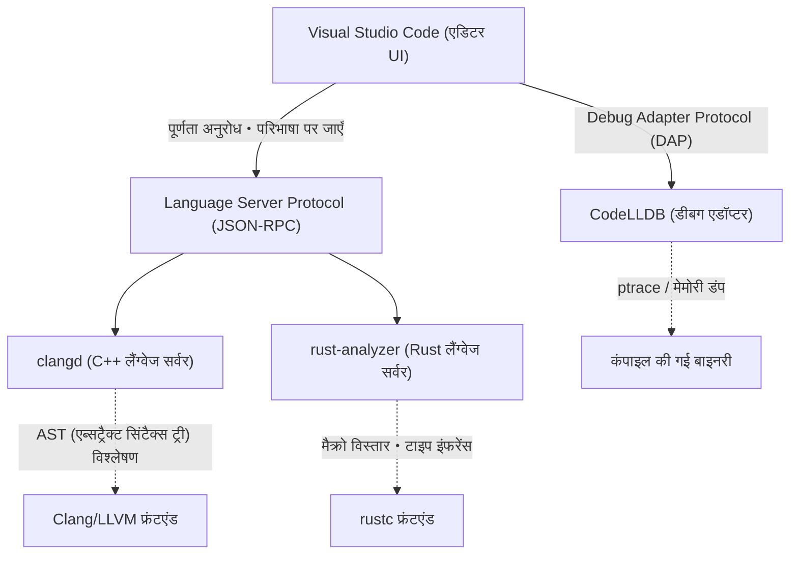
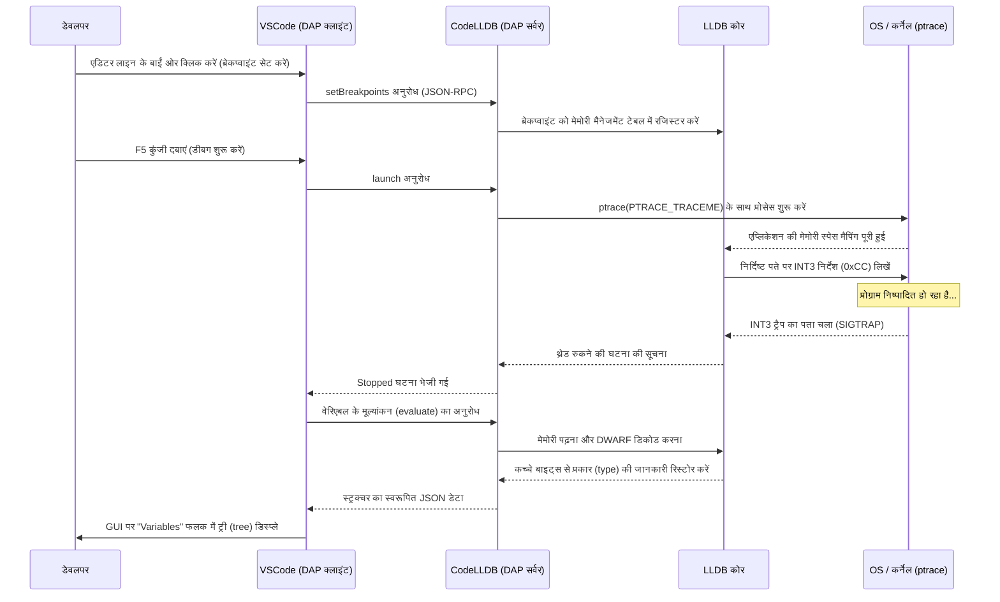

# प्रस्तावना (Introduction)

आधुनिक सिस्टम प्रोग्रामिंग में, C++ और Rust ने सबसे महत्वपूर्ण भाषाओं के रूप में अपनी मजबूत पहचान स्थापित की है। वर्षों के अनुभव और एक विशाल इकोसिस्टम के साथ, C++ ओएस (OS), गेम इंजन और हाई-फ्रीक्वेंसी ट्रेडिंग (HFT) सिस्टम आदि में अपरिहार्य है। वहीं, अपने ओनरशिप (Ownership) मॉडल के कारण मेमोरी सुरक्षा और आधुनिक भाषा विनिर्देशों के साथ Rust तेजी से लोकप्रिय हो रहा है, और लिनक्स (Linux) कर्नेल में भी इसे अपनाया जा रहा है। इन दोनों भाषाओं में डेवलपमेंट करते समय, एडिटर का चुनाव और उसकी सेटिंग्स सीधे तौर पर विकास की उत्पादकता को प्रभावित करते हैं।

Visual Studio Code (VSCode), अपनी उच्च एक्स्टेंसिबिलिटी (विस्तार क्षमता) और हल्केपन के कारण, दुनिया भर के सिस्टम प्रोग्रामर्स द्वारा पसंद किया जाता है। हालाँकि, इंस्टॉल करने के ठीक बाद, VSCode केवल एक साधारण टेक्स्ट एडिटर होता है। C++ और Rust की वास्तविक क्षमता को उजागर करने के लिए, भाषा के सिमेंटिक्स (semantics) को गहराई से समझने वाले लैंग्वेज सर्वर (language server), और बाइनरी स्तर पर स्थिति को ट्रैक करने वाले डीबगर जैसे उपयुक्त एक्सटेंशन्स को इंस्टॉल करना और उनकी सटीक सेटिंग्स करना अत्यंत आवश्यक है।

इस लेख में, हम C++ और Rust डेवलपर्स के लिए 10 ऐसे एक्सटेंशन्स का परिचय देंगे जो VSCode को "सर्वश्रेष्ठ इंटीग्रेटेड डेवलपमेंट एनवायरनमेंट (IDE)" में बदल देंगे। हम केवल एक सूची तक सीमित नहीं रहेंगे, बल्कि एडिटर के इंटरनल आर्किटेक्चर, `tasks.json` और `launch.json` के उन्नत कॉन्फ़िगरेशन उदाहरणों, और यहाँ तक कि लैंग्वेज सर्वर के परफॉरमेंस ऑप्टिमाइज़ेशन और सिंटैक्स एनालिसिस के गणितीय मॉडल (mathematical model) पर भी गहराई से चर्चा करेंगे।

---

## 1. VSCode और लैंग्वेज सर्वर प्रोटोकॉल (LSP) का डीप आर्किटेक्चर (Deep Architecture of VSCode and LSP)

एक्सटेंशन्स का परिचय देने से पहले, यह समझना महत्वपूर्ण है कि VSCode किस तरह से उन्नत कोड पूर्णता (code completion) और सिंटैक्स एनालिसिस प्रदान करता है, और इसके आधार, लैंग्वेज सर्वर प्रोटोकॉल (Language Server Protocol - LSP) के आर्किटेक्चर को समझना ज़रूरी है।



स्वयं VSCode C++ की टेम्पलेट मेटा-प्रोग्रामिंग या Rust के जटिल लाइफटाइम स्पेसिफायर्स को नहीं समझता है। एडिटर की भूमिका मुख्य रूप से सोर्स कोड को प्रदर्शित करने और उपयोगकर्ता के इनपुट को प्राप्त करने तक सीमित है। कोड का सिमेंटिक एनालिसिस (Semantic Analysis), टाइप इंफरेंस (Type Inference) और एरर चेकिंग जैसी उच्च कम्प्यूटेशनल लागत वाली प्रक्रियाएं बैकग्राउंड में चलने वाले "लैंग्वेज सर्वर" को JSON-RPC के माध्यम से सौंप दी जाती हैं।

इसके परिणामस्वरूप, एडिटर के UI थ्रेड को ब्लॉक किए बिना, लाखों लाइनों वाले विशाल कोडबेस में भी स्मूथ टाइपिंग और तेज़ प्रतिक्रिया (response) प्राप्त होती है।

---

## 2. 10 आवश्यक VSCode एक्सटेंशन्स (10 Essential VSCode Extensions)

### ① clangd (अल्टीमेट C++ इंटैलिसेंस)

C++ डेवलपर्स के लिए सबसे महत्वपूर्ण विकल्पों में से एक वह एक्सटेंशन है जो C++ की भाषा सुविधाएँ प्रदान करता है। VSCode इंस्टॉल करने पर, अक्सर Microsoft के आधिकारिक "C/C++ (ms-vscode.cpptools)" की सिफारिश की जाती है, लेकिन गंभीर सिस्टम डेवलपमेंट के लिए, हम LLVM प्रोजेक्ट द्वारा आधिकारिक रूप से प्रदान किए गए **`clangd`** की दृढ़ता से अनुशंसा करते हैं।

चूंकि `clangd` सीधे कंपाइलर Clang की फ्रंटएंड तकनीकों (पार्सर और सिमेंटिक एनालाइज़र) को एकीकृत करता है, इसलिए कोड एनालिसिस की सटीकता अत्यंत उच्च होती है। एडिटर में प्रदर्शित होने वाली त्रुटियां (errors) और चेतावनियां (warnings) वास्तविक कंपाइलर के आउटपुट से पूरी तरह मेल खाती हैं।

#### ms-vscode.cpptools के बजाय clangd क्यों चुनें?
- **उच्च सटीकता वाला विश्लेषण (High-accuracy analysis)**: चूंकि यह सीधे Clang के AST (एब्सट्रैक्ट सिंटैक्स ट्री) का उपयोग करता है, यह SFINAE (Substitution Failure Is Not An Error) का भारी उपयोग करने वाले जटिल टेम्पलेट इंस्टेंशिएशन और नेस्टेड मैक्रो एक्सपेंशन का सटीक मूल्यांकन करता है।
- **बैकग्राउंड इंडेक्सिंग द्वारा स्पीड-अप**: चूंकि यह बैकग्राउंड में पूरे प्रोजेक्ट की सिंबल जानकारी की पूर्व-गणना (इंडेक्सिंग) करता है, इसलिए "परिभाषा पर जाएँ (Go to Definition)" और "सभी संदर्भ खोजें (Find All References)" विशाल प्रोजेक्ट्स में भी तुरंत पूरे हो जाते हैं।

#### compile_commands.json का पूर्ण कॉन्फ़िगरेशन
`clangd` को सही ढंग से काम करने के लिए, `compile_commands.json` आवश्यक है, जो यह बताता है कि प्रोजेक्ट में प्रत्येक सोर्स फ़ाइल किन कंपाइलर फ़्लैग्स (इन्क्लूड पाथ और मैक्रो परिभाषाओं) के साथ कंपाइल की जाएगी। यदि आप CMake का उपयोग कर रहे हैं, तो आप इसे निम्न कमांड से स्वचालित रूप से उत्पन्न कर सकते हैं:

```bash
cmake -B build -DCMAKE_EXPORT_COMPILE_COMMANDS=ON
```

VSCode की सेटिंग फ़ाइल (`.vscode/settings.json`) में, `clangd` के स्टार्टअप आर्गुमेंट्स को इस प्रकार ट्यून करें:

```json
{
    "clangd.arguments": [
        "--compile-commands-dir=${workspaceFolder}/build",
        "--background-index",
        "--clang-tidy",
        "--header-insertion=iwyu",
        "--completion-style=detailed",
        "--j=6",
        "--pch-storage=memory"
    ]
}
```

यहाँ, `--j=6` बैकग्राउंड इंडेक्सिंग के लिए उपयोग किए जाने वाले वर्कर थ्रेड्स की संख्या है। इसे अपने CPU कोर की संख्या के अनुसार समायोजित करें। इसके अलावा, `--pch-storage=memory` निर्दिष्ट करके, आप प्री-कंपाइल्ड हेडर (PCH) को मेमोरी में रख सकते हैं, जिससे पार्सिंग की गति और बढ़ जाती है (हालाँकि, यह अधिक RAM की खपत करता है)।

#### लैंग्वेज सर्वर के रिस्पांस टाइम और AST साइज़ का गणितीय मॉडल

लैंग्वेज सर्वर का रिस्पांस टाइम $T_{response}$, इनपुट फ़ाइल के साइज़ $S$ और पूरे प्रोजेक्ट के इंडेक्स किए गए AST के साइज़ $M_{ast}$ पर निर्भर करता है। सिंटैक्स एनालिसिस की एल्गोरिदमिक कॉम्प्लेक्सिटी को ध्यान में रखते हुए, इसे लगभग निम्न गणितीय सूत्र द्वारा व्यक्त किया जा सकता है:

$$ T_{response} = \alpha \cdot O(S \log(M_{ast})) + \beta \cdot T_{IPC} $$

यहाँ, $\alpha$ पार्सर की एफिशिएंसी कोएफिशिएंट (efficiency coefficient) है, $\beta$ इंटर-प्रोसेस कम्युनिकेशन (IPC) का ओवरहेड है, और $T_{IPC}$ JSON-RPC का सीरियलाइज़ेशन/डीसीरियलाइज़ेशन समय है।
`clangd` अपनी बैकग्राउंड इंडेक्सिंग ($M_{ast}$ की पूर्व-गणना की गई डेटा संरचना का अनुकूलन) को पूर्ण करके, सर्च ऑर्डर $\log(M_{ast})$ के कांस्टेंट टर्म को नाटकीय रूप से कम कर देता है, जिससे सैकड़ों हज़ारों लाइनों वाले विशाल प्रोजेक्ट्स में भी कुछ मिलीसेकंड में रिस्पांस संभव हो जाता है।

---

### ② rust-analyzer (Rust डेवलपमेंट का वास्तविक मानक)

Rust डेवलपमेंट में, **`rust-analyzer`** वर्तमान में आधिकारिक लैंग्वेज सर्वर के रूप में अपनाया गया है। पूर्व मानक RLS (Rust Language Server) में सीधे कंपाइलर (rustc) को कॉल करने का आर्किटेक्चर था, जिससे इसके रिस्पांस की सीमाएं थीं। इसके विपरीत, `rust-analyzer` को IDE के लिए खरोंच (scratch) से फिर से डिज़ाइन किया गया है, और इसमें अधूरे कोड को भी इन्क्रीमेंटली (incrementally) पार्स करने की शक्तिशाली क्षमताएं हैं।

#### बेजोड़ उत्पादकता प्रदान करने वाले फीचर्स
1. **इनले हिंट्स (Inlay Hints)**: Rust, जिसमें शक्तिशाली टाइप इंफरेंस है, अक्सर वेरिएबल टाइप को स्पष्ट रूप से नहीं लिखने की सलाह देता है, लेकिन इससे पठनीयता (readability) कम हो सकती है। इनले हिंट्स अनुमानित टाइप और फंक्शन कॉल के आर्गुमेंट के नामों को एडिटर में हल्के टेक्स्ट के रूप में ओवरले करते हैं।
2. **प्रोसीजरल मैक्रो (Proc-macro) का पूर्ण समर्थन**: `serde` का `#[derive(Serialize)]` या `tokio::main` जैसे प्रोसीजरल मैक्रोज़ कंपाइल-टाइम पर AST को TokenStream के रूप में प्राप्त करते हैं और नया कोड जनरेट करते हैं। `rust-analyzer` इन मैक्रोज़ को आंतरिक रूप से एक्सपैंड करता है और जनरेट किए गए कोड के लिए कोड कंप्लीशन और एरर चेकिंग सक्षम करता है।
3. **मैजिक कंप्लीशन (Magic Completions)**: `iter().map().filter().collect()` जैसी मेथड चेन्स में, आप देख सकते हैं कि प्रत्येक चरण में टाइप को कैसे परिवर्तित किया जा रहा है।

#### rust-analyzer के लिए अनुशंसित settings.json

```json
{
    "rust-analyzer.checkOnSave.command": "clippy",
    "rust-analyzer.cargo.allFeatures": true,
    "rust-analyzer.procMacro.enable": true,
    "rust-analyzer.inlayHints.bindingModeHints.enable": true,
    "rust-analyzer.inlayHints.closureReturnTypeHints.enable": "always",
    "rust-analyzer.lens.run.enable": true,
    "rust-analyzer.hover.actions.references.enable": true
}
```
फ़ाइल को सहेजते समय पृष्ठभूमि (background) में स्वचालित रूप से `cargo clippy` को चलाने की सेटिंग अनिवार्य मानी जाती है। इससे न केवल आप ओनरशिप उल्लंघनों को पकड़ सकते हैं, बल्कि परफॉरमेंस सुधार के सुझाव और अधिक मुहावरेदार (Idiomatic) Rust कोड लिखना भी तुरंत सीख सकते हैं।

---

### ③ CodeLLDB (क्रॉस-प्लेटफ़ॉर्म शक्तिशाली डीबगर)

चाहे आप C++ या Rust में डेवलपमेंट कर रहे हों, रनटाइम मेमोरी स्टेट की जांच करने के लिए एक डीबगर अनिवार्य है। **`CodeLLDB`** विंडोज, मैक और लिनक्स (Windows, Mac, Linux) सभी प्लेटफार्मों पर अत्यधिक स्थिर है और विशेष रूप से Rust के साथ इसकी बेहतरीन संगतता (compatibility) है।

Rust का कंपाइलर (rustc) LLVM का उपयोग बैकएंड के रूप में करता है, और जनरेट की गई डीबग जानकारी (DWARF / PDB) का फॉर्मेट LLDB के साथ पूरी तरह से मेल खाता है, जो कि स्वयं LLVM प्रोजेक्ट का हिस्सा है।

#### launch.json का उन्नत कॉन्फ़िगरेशन उदाहरण

VSCode में डीबगिंग शुरू करने के लिए यह `.vscode/launch.json` की सेटिंग है। यहाँ C++ और Rust दोनों निष्पादन योग्य फ़ाइलों (executable files) को डीबग करने के लिए एक एकीकृत कॉन्फ़िगरेशन दिखाया गया है:

```json
{
    "version": "0.2.0",
    "configurations": [
        {
            "type": "lldb",
            "request": "launch",
            "name": "Debug C++ Application",
            "program": "${workspaceFolder}/build/src/my_cpp_app",
            "args": ["--config", "settings.ini", "--verbose"],
            "cwd": "${workspaceFolder}",
            "preLaunchTask": "build_cpp_debug",
            "stopOnEntry": false,
            "sourceLanguages": ["cpp"]
        },
        {
            "type": "lldb",
            "request": "launch",
            "name": "Debug Rust Cargo Binary",
            "cargo": {
                "args": [
                    "build",
                    "--bin=my_rust_app",
                    "--package=my_rust_app"
                ],
                "filter": {
                    "name": "my_rust_app",
                    "kind": "bin"
                }
            },
            "args": [],
            "cwd": "${workspaceFolder}",
            "sourceLanguages": ["rust"]
        }
    ]
}
```
Rust के कॉन्फ़िगरेशन ब्लॉक पर ध्यान दें। चूँकि `CodeLLDB` नेटिव रूप से `cargo` विकल्पों का समर्थन करता है, इसलिए आपको उस बाइनरी पाथ को मैन्युअल रूप से निर्दिष्ट करने की आवश्यकता नहीं है जिसमें जटिल हैश मान शामिल हों। एडिटर स्वचालित रूप से `cargo build` चलाता है, जनरेट की गई नवीनतम निष्पादन योग्य फ़ाइल (executable) को पकड़ता है और डीबगर को अटैच करता है।

---

### ④ CMake Tools

यह एक्सटेंशन VSCode के भीतर से CMake को पूरी तरह से नियंत्रित करने के लिए है, जो कि C++ प्रोजेक्ट्स के लिए उद्योग-मानक (industry-standard) बिल्ड सिस्टम है। **`CMake Tools`** कमांड लाइन से जटिल `cmake` कमांड टाइप करने की आवश्यकता को समाप्त करता है, और आपको स्क्रीन के निचले भाग में स्टेटस बार से बस एक क्लिक के साथ टारगेट चयन, बिल्ड और डीबग करने की अनुमति देता है।

ऊपर बताए गए `clangd` के लिए आवश्यक `compile_commands.json` को भी इस एक्सटेंशन की सेटिंग्स का उपयोग करके स्वचालित रूप से उचित स्थान पर कॉपी किया जा सकता है।

#### settings.json में CMake एकीकरण सेटिंग

```json
{
    "cmake.configureOnOpen": true,
    "cmake.exportCompileCommandsFileAndCopy": "${workspaceFolder}/compile_commands.json",
    "cmake.buildDirectory": "${workspaceFolder}/build/${buildType}",
    "cmake.generator": "Ninja"
}
```
बिल्ड टूल के रूप में `Ninja` को निर्दिष्ट करने से, डिफ़ॉल्ट Make की तुलना में पैरेलल कंपाइलेशन (parallel compilation) को अनुकूलित किया जाता है, जिससे बिल्ड का समय काफी कम हो जाता है। जब आप बिल्ड प्रोफ़ाइल (Debug / Release / RelWithDebInfo) के बीच स्विच करते हैं, तो लैंग्वेज सर्वर का विश्लेषण स्वचालित रूप से नई सेटिंग्स का पालन करेगा।

---

### ⑤ crates (Rust पैकेज निर्भरताओं का रीयल-टाइम प्रबंधन)

यह एक्सटेंशन `Cargo.toml` को, जो कि Rust की निर्भरता प्रबंधन (dependency management) फ़ाइल है, बेहद सुविधाजनक बनाता है।

निर्भरता क्रेट्स (लायब्रेरीज़) की संस्करण (version) संख्या के आगे, यह रीयल-टाइम में फेच करता है कि Crates.io (आधिकारिक रिपॉजिटरी) पर कोई नवीनतम संस्करण उपलब्ध है या नहीं, और इसे एडिटर में इनलाइन प्रदर्शित करता है।

```toml
[dependencies]
tokio = "1.28.0" # <- एडिटर में हल्के टेक्स्ट के रूप में "Latest: 1.35.1" प्रदर्शित होता है
serde = { version = "1.0", features = ["derive"] }
reqwest = "0.11" # <- यदि अपडेट आवश्यक है, तो इसे एक क्लिक में ठीक किया जा सकता है
```
इससे पुराने संस्करण के पुस्तकालयों (libraries) के कारण होने वाली कमजोरियों और बग्स को रोका जा सकता है, और आप इकोसिस्टम के विकास के साथ आसानी से तालमेल बिठा सकते हैं।

---

### ⑥ Error Lens

`Error Lens` एक क्रांतिकारी एक्सटेंशन है जो C++ की लंबी टेम्पलेट त्रुटियों या Rust की सख्त बरो चेकर (Borrow Checker) त्रुटियों को सीधे एडिटर में संबंधित लाइन के दाईं ओर इनलाइन हाइलाइट करता है।

आमतौर पर, VSCode में त्रुटि का विवरण देखने के लिए, आपको स्क्रीन के निचले भाग में "Problems" पैनल खोलना पड़ता है या लाल लहरदार रेखा (red squiggly line) पर माउस को सटीक रूप से घुमाना पड़ता है और होवर पॉपअप का इंतजार करना पड़ता है। यह संज्ञानात्मक भार (cognitive load) को बढ़ाता है और कोडिंग प्रवाह (flow state) को बाधित करता है।

`Error Lens` के साथ, कीबोर्ड से हाथ हटाए बिना, जब आप कोड टाइप कर रहे होते हैं तब त्रुटि संदेश आपके दृष्टि क्षेत्र के किनारे पर दिखाई देते हैं। विशेष रूप से Rust में जटिल लाइफटाइम त्रुटियां जैसे "`cannot borrow 'x' as mutable because it is also borrowed as immutable`" को संबंधित लाइन को देखते ही तुरंत समझा जा सकता है, जिससे फिक्सिंग की गति नाटकीय रूप से बढ़ जाती है।

---

### ⑦ GitLens

सिस्टम प्रोग्रामिंग प्रोजेक्ट्स अक्सर बहुत बड़े होते हैं, और एक लंबे इतिहास वाले कोडबेस के साथ काम करना आम बात है। बग फिक्सिंग में सबसे महत्वपूर्ण कदमों में से एक यह ट्रैक करना है: "इस जटिल पॉइंटर मैनिपुलेशन कोड को किसने, कब और क्यों जोड़ा?"

**`GitLens`** एडिटर में वर्तमान कर्सर स्थिति पर लाइन की `git blame` जानकारी को एक हल्के एनोटेशन के रूप में प्रदर्शित करता है। इसमें पूरी फ़ाइल के कमिट इतिहास का ग्राफ़िकल रूप से अन्वेषण (explore) करने या लाइन-बाय-लाइन इतिहास (Line History) का पता लगाने की क्षमता भी है।

जब आपको Rust में `unsafe` ब्लॉक या C++ में ट्रिकी कास्टिंग का सामना करना पड़ता है, तो उस कोड के मर्ज होने के समय के पुल रिक्वेस्ट (Pull Request) और विस्तृत कमिट संदेशों को तुरंत देखने में सक्षम होना रिवर्स इंजीनियरिंग के लिए एक शक्तिशाली हथियार बन जाता है।

---

### ⑧ GitHub Copilot

सिस्टम प्रोग्रामिंग में भी, जनरेटिव AI असिस्टेंट्स (Generative AI Assistants) का परिचय पहले ही एक अपरिहार्य प्रतिमान बदलाव (paradigm shift) बन चुका है। **`GitHub Copilot`** C++ के लंबे बॉयलरप्लेट कोड या Rust के जटिल इटरेटर (iterator) चेन के निर्माण में उच्च सटीकता के साथ सहायता करता है।

#### सिस्टम प्रोग्रामिंग में AI का उपयोग
- **रूल ऑफ़ फाइव (Rule of Five) का कार्यान्वयन**: C++ में, जब आप डिस्ट्रक्टर, कॉपी कंस्ट्रक्टर, कॉपी असाइनमेंट ऑपरेटर, मूव कंस्ट्रक्टर और मूव असाइनमेंट ऑपरेटर लिखते हैं, तो Copilot क्लास के मेंबर वेरिएबल्स के आधार पर एक मेमोरी-लीक मुक्त, सटीक कार्यान्वयन का तुरंत सुझाव देता है।
- **संदर्भ (Context) को समझना**: C++ हेडर फ़ाइल (`.hpp`) में किसी फंक्शन प्रोटोटाइप की घोषणा करने के तुरंत बाद जब आप इम्प्लीमेंटेशन फ़ाइल (`.cpp`) खोलते हैं, तो Copilot स्वचालित रूप से उस फंक्शन के सिग्नेचर को पूरा कर देता है और इम्प्लीमेंटेशन का खाका (template) प्रदान करता है।

---

### ⑨ Even Better TOML

यह एक एक्सटेंशन है जो `Cargo.toml` (Rust की प्रोजेक्ट सेटिंग फ़ाइल) और `rust-toolchain.toml` के लिए सिंटैक्स हाइलाइटिंग, ऑटो-फॉर्मेटिंग और शक्तिशाली स्कीमा वैलिडेशन (Schema Validation) प्रदान करता है।

चूंकि यह `Cargo.toml` के भीतर साधारण टाइपो को रीयल-टाइम में चेतावनी देता है (उदाहरण के लिए, `[dependencies]` को `[dependencis]` के रूप में गलत लिखना), आप बिल्ड निष्पादन के दौरान त्रुटियों को नोटिस करने वाले समय की बर्बादी से बच सकते हैं। इसके अलावा, चूंकि वैलिडेशन JSON Schema पर आधारित है, आप उपलब्ध कुंजियों (keys) को ऑटो-कम्प्लीट भी कर सकते हैं।

---

### ⑩ Code Spell Checker

सिस्टम प्रोग्रामिंग में, वेरिएबल्स और फंक्शन्स के नामों की सटीक स्पेलिंग (spelling) पूरे प्रोजेक्ट की पठनीयता (readability) और रखरखाव (maintainability) से सीधे संबंधित होती है। **`Code Spell Checker`** सोर्स कोड, कमेंट्स और स्ट्रिंग लिटरल (string literals) के भीतर आइडेंटिफायर्स (कैमलकेस `myVariable` और स्नेककेस `my_variable` को शब्दों में तोड़कर पहचानता है) में स्पेलिंग की गलतियों का पता लगाता है।

जब एक स्ट्रिंग लिटरल का उपयोग C++ में `std::unordered_map` या Rust में `HashMap` की कुंजी (key) के रूप में किया जाता है, तो स्पेलिंग मिस्टेक (typo) के कारण होने वाले बग्स बहुत परेशान करने वाले होते हैं क्योंकि वे कंपाइलेशन में पास हो जाते हैं और रनटाइम एरर होने तक छिप जाते हैं। स्पेल चेकर का उपयोग करके और एडिटर में लहरदार चेतावनी प्रदर्शित करके, ऐसी आसान गलतियों को कोडिंग चरण में पूरी तरह से समाप्त किया जा सकता है।

---

## 3. tasks.json का उपयोग करके बिल्ड पाइपलाइन को स्वचालित करना (Automating the Build Pipeline using tasks.json)

एक IDE के रूप में पूरी तरह से काम करने के लिए, न केवल एडिटर के GUI फीचर्स का उपयोग करना महत्वपूर्ण है, बल्कि VSCode के Task फीचर (`.vscode/tasks.json`) का लाभ उठाकर एक सिंगल शॉर्टकट की (shortcut key) (डिफ़ॉल्ट रूप से `Ctrl+Shift+B`) के साथ बिल्ड या टेस्ट चलाने के लिए इसे कॉन्फ़िगर करना भी महत्वपूर्ण है।

नीचे एक उन्नत `tasks.json` कॉन्फ़िगरेशन का उदाहरण दिया गया है, जो CMake का उपयोग करके C++ बिल्ड और Cargo का उपयोग करके Rust बिल्ड दोनों को सह-अस्तित्व (co-exist) में रखता है।

```json
{
    "version": "2.0.0",
    "tasks": [
        {
            "label": "build_cpp_debug",
            "type": "shell",
            "command": "cmake --build build --config Debug -j 8",
            "group": "build",
            "problemMatcher": [
                "$gcc"
            ],
            "presentation": {
                "reveal": "always",
                "panel": "shared"
            },
            "detail": "CMake का उपयोग करके C++ प्रोजेक्ट को Debug मोड में बिल्ड करें"
        },
        {
            "label": "cargo build",
            "type": "cargo",
            "command": "build",
            "problemMatcher": [
                "$rustc"
            ],
            "group": {
                "kind": "build",
                "isDefault": true
            },
            "presentation": {
                "reveal": "silent"
            },
            "detail": "Cargo का उपयोग करके Rust प्रोजेक्ट को बिल्ड करें"
        }
    ]
}
```
यहाँ मुख्य बात `problemMatcher` की सेटिंग है। `$gcc` या `$rustc` निर्दिष्ट करके, VSCode स्वचालित रूप से बैकग्राउंड में निष्पादित कमांड लाइन के मानक आउटपुट (standard output) को रेगुलर एक्सप्रेशन का उपयोग करके पार्स करता है, त्रुटि वाली फ़ाइल का नाम, लाइन नंबर और कॉलम नंबर निकालता है, और उन्हें "Problems" पैनल में सूचीबद्ध करता है।

---

## 4. डीबग आर्किटेक्चर का विज़ुअलाइज़ेशन और उन्नत विश्लेषण तकनीकें (Visualization of Debug Architecture and Advanced Analysis Techniques)

सिस्टम प्रोग्रामिंग में बग अक्सर जटिल होते हैं, जैसे मेमोरी करप्शन (Segmentation Fault), डेटा रेस और अनडिफाइंड बिहेवियर, जिन्हें केवल एडिटर के स्टेटिक एनालिसिस से नहीं पकड़ा जा सकता। आइए एक अनुक्रम आरेख (sequence diagram) के साथ जांच करें कि डीबगर (CodeLLDB) VSCode के साथ कैसे काम करता है और ओएस कर्नेल (OS kernel) स्तर पर मेमोरी स्थिति की निगरानी कैसे करता है।



जैसा कि यह अनुक्रम आरेख (sequence diagram) दिखाता है, डीबग सत्र के दौरान VSCode और CodeLLDB के बीच अनगिनत संचार (Debug Adapter Protocol - DAP) होते हैं। C++ का `std::map` या Rust का `Vec<T>` जैसे जटिल डेटा स्ट्रक्चर्स, जो पॉइंटर्स के संग्रह हैं, CodeLLDB के अंतर्निहित फॉर्मैटर फीचर के कारण VSCode के GUI पर बहुत ही सहज ज्ञान युक्त तरीके से (विस्तारित सरणी के साथ एक ट्री के रूप में) प्रदर्शित होते हैं।

इसे संभव बनाने के लिए, Rust का कंपाइलर DWARF प्रारूप में प्रकार (type) की लेआउट जानकारी (जैसे आकार और पैडिंग) को विस्तृत रूप से एम्बेड करता है, और CodeLLDB तदनुसार लक्ष्य मेमोरी पर कच्चे बाइट्स (raw bytes) को मानव-पठनीय प्रारूप में खूबसूरती से परिवर्तित करता है।

---

## 5. डेवलपर की उत्पादकता (Productivity) का गणितीय मॉडलिंग

अंत में, आइए एक गणितीय मॉडल (mathematical model) का उपयोग करके मूल्यांकन करें कि ये एक्सटेंशन्स और स्वचालन (automation) सेटिंग्स वास्तविक विकास कार्य की उत्पादकता को कैसे प्रभावित करते हैं।

किसी डेवलपर को एक विशिष्ट कार्य (नई सुविधा का कार्यान्वयन या जटिल बग फिक्सिंग) पूरा करने के लिए आवश्यक कुल समय $T_{total}$ को निम्न सूत्र द्वारा मॉडल किया जा सकता है:

$$ T_{total} = T_{design} + T_{write} + \sum_{k=1}^{N} \left( T_{compile}^{(k)} + T_{debug}^{(k)} + \lambda_{switch} \cdot T_{context\_switch}^{(k)} \right) $$

यहाँ प्रत्येक वेरिएबल का अर्थ निम्नलिखित है:
- $T_{design}$: आर्किटेक्चर डिज़ाइन में लगने वाला समय (स्थिर)
- $T_{write}$: वास्तविक कोड लिखने में लगने वाला समय
- $N$: कंपाइल, टेस्ट और सुधार (iteration) की संख्या
- $T_{compile}$: प्रति बार कंपाइल करने का समय
- $T_{debug}$: बग के कारण की पहचान करने और उसे ठीक करने का समय
- $T_{context\_switch}$: एडिटर, टर्मिनल और ब्राउज़र (डॉक्यूमेंटेशन खोजने) जैसे टूल्स के बीच स्विच करने के दौरान कॉग्निटिव (संज्ञानात्मक) कॉन्टेक्स्ट स्विच का समय
- $\lambda_{switch}$: कॉन्टेक्स्ट स्विच के कारण होने वाले एकाग्रता नुकसान का पेनाल्टी गुणांक

इस लेख में प्रस्तुत किए गए एक्सटेंशन्स इस समीकरण के लगभग सभी गतिशील मापदंडों (dynamic parameters) को कम करने का काम करते हैं।

1. **$T_{write}$ में भारी कमी**: `GitHub Copilot` और `rust-analyzer` के उन्नत टाइप इंफरेंस और मैक्रो विस्तार पर आधारित कंप्लीशन (completion) से कीस्ट्रोक्स की संख्या में भारी कमी आती है।
2. **$N$ को न्यूनतम करना**: `Error Lens` और रीयल-टाइम लिंटर्स (clippy, clang-tidy) के साथ, टाइप करते समय ही त्रुटियों का पता लगाकर उन्हें ठीक किया जा सकता है, जिससे बिल्ड चलाने के बाद त्रुटियों का पता लगने (rework) की संख्या $N$ कम हो जाती है।
3. **$T_{debug}$ का अनुकूलन**: `CodeLLDB` और `GitLens` की मदद से, वेरिएबल की स्थिति की जांच और कोड में बदलाव के इरादे को तुरंत समझा जा सकता है।
4. **$T_{context\_switch}$ का उन्मूलन**: सभी ऑपरेशन (कोड संपादन, बिल्ड, डीबग, Git इतिहास की जांच और त्रुटियों को ठीक करना) VSCode की एक ही विंडो में पूरी तरह से संपन्न हो जाते हैं, जिससे पेनाल्टी टर्म $\lambda_{switch} \cdot T_{context\_switch}^{(k)}$ लगभग शून्य हो जाता है।

परिणामस्वरूप, कार्य का कुल समय $T_{total}$ काफी कम हो जाता है, जिससे डेवलपर्स को अधिक रचनात्मक और आवश्यक कार्यों जैसे "डिज़ाइन ($T_{design}$)" और एल्गोरिदम अनुकूलन (algorithm optimization) पर अधिक समय बिताने की अनुमति मिलती है।

---

## निष्कर्ष (Conclusion)

C++ और Rust दोनों ऐसी भाषाएँ हैं जिनका उद्देश्य "हार्डवेयर के अधिकतम प्रदर्शन (performance) को प्राप्त करना" है, और डेवलपर्स को उच्च स्तर की समझ और सटीक कोडिंग की आवश्यकता होती है।

इस लेख में प्रस्तुत 10 एक्सटेंशन्स और सेटिंग्स को लागू करके, VSCode केवल एक साधारण टेक्स्ट एडिटर की सीमाओं को पार कर जाता है और "डेवलपर के एक शक्तिशाली एक्सोस्केलेटन (exoskeleton)" में विकसित हो जाता है जो कंपाइलर के गहन ज्ञान और डीबगर की क्लैरवोयंस (दूरदृष्टि) को जोड़ता है।

1. **clangd** (C++ लैंग्वेज सर्वर)
2. **rust-analyzer** (Rust लैंग्वेज सर्वर)
3. **CodeLLDB** (इंटीग्रेटेड डीबगर)
4. **CMake Tools** (C++ बिल्ड ऑटोमेशन)
5. **crates** (Rust डिपेंडेंसी मैनेजमेंट)
6. **Error Lens** (इनलाइन एरर डिस्प्ले)
7. **GitLens** (उन्नत Git इतिहास ट्रैकिंग)
8. **GitHub Copilot** (AI कोडिंग सहायता)
9. **Even Better TOML** (सेटिंग फ़ाइल वैलिडेशन)
10. **Code Spell Checker** (टाइपो रोकथाम)

प्रारंभिक कॉन्फ़िगरेशन फ़ाइलों को कस्टमाइज़ करने में कुछ समय लग सकता है, लेकिन एक बार सेट हो जाने के बाद, आपका कोडिंग अनुभव आश्चर्यजनक रूप से आरामदायक और उत्पादक बन जाएगा। कृपया इस लेख में चर्चा किए गए आर्किटेक्चर स्पष्टीकरणों और विशिष्ट सेटिंग्स (`settings.json`, `tasks.json`, `launch.json`) को अपने सर्वोत्तम विकास वातावरण के निर्माण के लिए एक संदर्भ के रूप में उपयोग करें।

आपके आरामदायक और सुरक्षित सिस्टम प्रोग्रामिंग जीवन की कामना करता हूँ!
