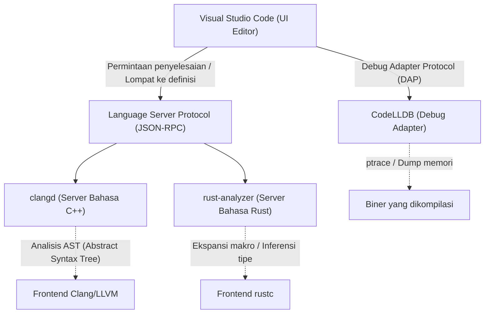
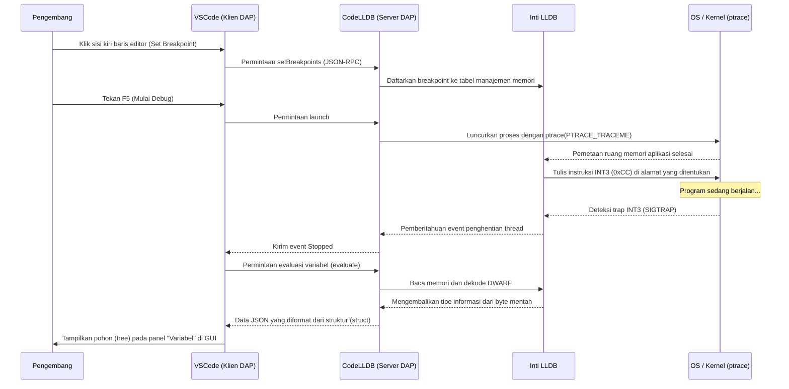

# Pengantar

Dalam pemrograman sistem modern, C++ dan Rust telah mengukuhkan posisi mereka sebagai bahasa yang paling penting. C++ sangat diperlukan dalam OS, mesin game, dan sistem perdagangan frekuensi tinggi (HFT) dengan rekam jejaknya yang panjang dan ekosistem yang luas. Dan Rust, yang menyebar dengan cepat berkat keamanan memori yang diberikan oleh model kepemilikan (Ownership) serta spesifikasi bahasanya yang modern, dan adopsinya ke dalam kernel Linux terus berlanjut. Saat mengembangkan dalam kedua bahasa ini, pilihan editor dan pengaturannya berhubungan langsung dengan produktivitas pengembangan.

Visual Studio Code (VSCode) sangat disukai oleh programmer sistem di seluruh dunia karena kemudahan ekstensinya dan sifatnya yang ringan. Namun, VSCode setelah diinstal hanyalah sekadar editor teks biasa. Untuk memaksimalkan kekuatan sejati dari C++ dan Rust, pengenalan ekstensi yang tepat dan pengaturan yang teliti sangat diperlukan, seperti server bahasa yang sangat memahami semantik bahasa tersebut, serta debugger yang melacak status hingga tingkat biner.

Artikel ini akan memperkenalkan 10 ekstensi untuk mengubah VSCode menjadi "Lingkungan Pengembangan Terintegrasi (IDE) Terkuat" bagi pengembang C++ dan Rust. Tidak hanya sekadar membuat daftar, namun juga membahas secara mendalam dan menyeluruh arsitektur internal editor, contoh pengaturan tingkat lanjut untuk `tasks.json` dan `launch.json`, hingga pengoptimalan performa server bahasa dan model matematis parsing sintaksis.

---

## 1. Arsitektur Mendalam VSCode dan Language Server Protocol (LSP)

Sebelum memperkenalkan ekstensi, penting untuk memahami arsitektur Language Server Protocol (LSP) yang mendasarinya, untuk mengetahui bagaimana VSCode menyediakan penyelesaian kode dan parsing sintaksis tingkat lanjut.



Inti dari VSCode itu sendiri tidak memahami metaprogramming template dari C++ atau specifier lifetime (waktu hidup) yang kompleks dari Rust. Peran editor hanya terfokus pada menampilkan kode sumber dan menerima input dari pengguna, sementara proses dengan biaya komputasi yang tinggi seperti analisis semantik (Semantic Analysis), inferensi tipe (Type Inference), dan pemeriksaan error, didelegasikan kepada "server bahasa" yang berjalan di latar belakang melalui JSON-RPC.

Berkat ini, tanpa memblokir thread UI pada editor, penyelesaian respons yang lancar dan cepat bisa dicapai bahkan pada basis kode berskala besar yang terdiri dari jutaan baris kode.

---

## 2. 10 Ekstensi VSCode yang Wajib Dimiliki

### ① clangd (IntelliSense C++ Terbaik)

Salah satu pilihan terpenting bagi pengembang C++ adalah ekstensi yang menyediakan fitur bahasa C++. Saat menginstal VSCode, seringkali "C/C++ (ms-vscode.cpptools)" resmi dari Microsoft yang direkomendasikan, tetapi untuk pengembangan sistem yang serius, sangat disarankan menggunakan **`clangd`** yang secara resmi disediakan oleh proyek LLVM.

Karena `clangd` secara langsung menggabungkan teknologi frontend dari compiler Clang (parser dan penganalisis semantik), akurasi analisis kodenya sangat tinggi, dan error serta peringatan yang ditampilkan pada editor sepenuhnya cocok dengan output dari compiler yang sebenarnya.

#### Alasan Memilih clangd daripada ms-vscode.cpptools
- **Analisis dengan Akurasi Tinggi**: Karena menangani AST (Abstract Syntax Tree) Clang secara langsung, ia mengevaluasi dengan akurat instansiasi template yang rumit yang menggunakan banyak SFINAE (Substitution Failure Is Not An Error) dan ekspansi makro yang bersarang.
- **Peningkatan Kecepatan oleh Indeks Latar Belakang**: Dengan melakukan pra-komputasi (indeksasi) informasi simbol dari seluruh proyek di latar belakang, fitur seperti "Buka Definisi" (Go to Definition) atau "Temukan Semua Referensi" (Find All References) dapat diselesaikan dalam sekejap bahkan pada proyek besar.

#### Pengaturan Sempurna compile_commands.json
Agar `clangd` berfungsi dengan benar, diperlukan `compile_commands.json`, yang mendeskripsikan dengan flag compiler mana (seperti path include dan definisi makro) masing-masing file sumber dalam proyek tersebut dikompilasi. Jika Anda menggunakan CMake, file ini bisa dihasilkan secara otomatis dengan perintah berikut.

```bash
cmake -B build -DCMAKE_EXPORT_COMPILE_COMMANDS=ON
```

Di file konfigurasi VSCode (`.vscode/settings.json`), kita menyesuaikan argumen startup `clangd` sebagai berikut.

```json
{
    "clangd.arguments": [
        "--compile-commands-dir=${workspaceFolder}/build",
        "--background-index",
        "--clang-tidy",
        "--header-insertion=iwyu",
        "--completion-style=detailed",
        "--j=6",
        "--pch-storage=memory"
    ]
}
```

Di sini, `--j=6` adalah jumlah thread pekerja (worker) yang digunakan untuk indeks latar belakang. Silakan sesuaikan menurut jumlah inti CPU (core) yang Anda miliki. Selain itu, dengan menetapkan `--pch-storage=memory`, header yang telah dikompilasi (PCH) dapat disimpan di dalam memori, sehingga semakin meningkatkan kecepatan parsing (namun ini mengonsumsi banyak RAM).

#### Model Matematis untuk Waktu Respons Server Bahasa dan Ukuran AST

Waktu respons server bahasa $T_{response}$ bergantung pada ukuran file yang diinput $S$ dan ukuran AST yang telah diindeks di seluruh proyek $M_{ast}$. Mempertimbangkan kompleksitas algoritma parsing, secara pendekatan matematis dapat dinyatakan dengan rumus berikut.

$$ T_{response} = \alpha \cdot O(S \log(M_{ast})) + \beta \cdot T_{IPC} $$

Di mana $\alpha$ adalah koefisien efisiensi parser, $\beta$ adalah overhead Komunikasi Antar-Proses (IPC), dan $T_{IPC}$ adalah waktu serialisasi/deserialisasi JSON-RPC.
Dengan mengoptimalkan indeks latar belakang secara maksimal (optimasi struktur data pra-komputasi $M_{ast}$), `clangd` menekan jumlah konstan dari orde pencarian $\log(M_{ast})$ secara drastis, sehingga memungkinkan respons dalam hitungan milidetik, bahkan untuk proyek besar yang berjumlah ratusan ribu baris.

---

### ② rust-analyzer (Standar De Facto Pengembangan Rust)

Dalam pengembangan Rust, **`rust-analyzer`** adalah yang diadopsi sebagai server bahasa resmi saat ini. Dulu standar yang digunakan adalah RLS (Rust Language Server) yang memiliki arsitektur memanggil langsung compiler (rustc), sehingga waktu responsnya terbatas. Namun, `rust-analyzer` dirancang ulang dari awal khusus untuk IDE, dan memiliki fitur kuat yang mampu mem-parsing kode secara bertahap (incremental) bahkan jika kode tersebut tidak lengkap.

#### Fitur yang Menghasilkan Produktivitas Luar Biasa
1. **Inlay Hints (Petunjuk Inlay)**: Di Rust yang inferensi tipenya kuat, disarankan untuk tidak menulis tipe variabel secara eksplisit, tetapi ini dapat menurunkan tingkat keterbacaan (readability). Inlay Hints menampilkan tipe yang diinferensikan serta nama argumen panggilan fungsi dalam teks pudar yang ditumpangkan (overlay) pada editor.
2. **Dukungan Penuh untuk Makro Prosedural (Proc-macro)**: Makro prosedural seperti `#[derive(Serialize)]` dari `serde` atau `tokio::main` menerima AST sebagai TokenStream pada waktu kompilasi dan menghasilkan kode baru. `rust-analyzer` mengembangkan makro ini secara internal dan memungkinkan penyelesaian (completion) serta pemeriksaan error berfungsi pada kode yang dihasilkan.
3. **Magic Completions (Penyelesaian Ajaib)**: Dalam rantai metode (method chaining) seperti `iter().map().filter().collect()`, ini bisa menampilkan langkah demi langkah bagaimana tipe data diubah di tengah jalan.

#### Rekomendasi settings.json untuk rust-analyzer

```json
{
    "rust-analyzer.checkOnSave.command": "clippy",
    "rust-analyzer.cargo.allFeatures": true,
    "rust-analyzer.procMacro.enable": true,
    "rust-analyzer.inlayHints.bindingModeHints.enable": true,
    "rust-analyzer.inlayHints.closureReturnTypeHints.enable": "always",
    "rust-analyzer.lens.run.enable": true,
    "rust-analyzer.hover.actions.references.enable": true
}
```
Pengaturan untuk menjalankan `cargo clippy` secara otomatis di latar belakang saat menyimpan bisa dikatakan sangat wajib. Dengan begitu, Anda tidak hanya belajar tentang pelanggaran kepemilikan (ownership), tetapi juga langsung menerima saran perbaikan performa dan penulisan kode yang lebih idiomatik (khas) gaya Rust.

---

### ③ CodeLLDB (Debugger Lintas Platform yang Kuat)

Baik ketika mengembangkan dengan C++ maupun Rust, debugger sangat diperlukan untuk memeriksa status memori pada saat runtime (waktu berjalan). Khususnya yang beroperasi secara stabil di seluruh platform Windows, Mac, dan Linux, serta memiliki afinitas yang sangat tinggi dengan Rust adalah **`CodeLLDB`**.

Karena compiler Rust (rustc) menggunakan LLVM sebagai backend, format informasi debug yang dihasilkan (DWARF / PDB) sangat cocok dengan LLDB yang juga merupakan bagian dari proyek LLVM.

#### Contoh Pengaturan Tingkat Lanjut untuk launch.json

Ini adalah pengaturan `.vscode/launch.json` untuk memulai debug pada VSCode. Di sini ditunjukkan konfigurasi terintegrasi untuk men-debug file executable dari C++ dan Rust.

```json
{
    "version": "0.2.0",
    "configurations": [
        {
            "type": "lldb",
            "request": "launch",
            "name": "Debug Aplikasi C++",
            "program": "${workspaceFolder}/build/src/my_cpp_app",
            "args": ["--config", "settings.ini", "--verbose"],
            "cwd": "${workspaceFolder}",
            "preLaunchTask": "build_cpp_debug",
            "stopOnEntry": false,
            "sourceLanguages": ["cpp"]
        },
        {
            "type": "lldb",
            "request": "launch",
            "name": "Debug Biner Cargo Rust",
            "cargo": {
                "args": [
                    "build",
                    "--bin=my_rust_app",
                    "--package=my_rust_app"
                ],
                "filter": {
                    "name": "my_rust_app",
                    "kind": "bin"
                }
            },
            "args": [],
            "cwd": "${workspaceFolder}",
            "sourceLanguages": ["rust"]
        }
    ]
}
```
Perhatikan blok konfigurasi Rust. Karena `CodeLLDB` mendukung secara bawaan (native) opsi `cargo`, kita tidak perlu secara langsung menentukan path biner yang mencakup nilai hash kompleks hasil kompilasi. Editor akan secara otomatis menjalankan `cargo build`, menangkap file eksekusi terbaru yang dihasilkan, dan melampirkan (attach) debugger padanya.

---

### ④ CMake Tools

Ini adalah ekstensi untuk sepenuhnya mengontrol CMake, sistem build standar industri untuk proyek C++, dari VSCode. **`CMake Tools`** menghilangkan kebutuhan untuk mengetikkan perintah `cmake` yang rumit melalui command line, dan memungkinkan Anda melakukan pemilihan target, build, dan debug hanya dengan satu klik dari status bar di bagian bawah layar.

`compile_commands.json` yang diperlukan oleh `clangd` seperti yang disebutkan di atas juga dapat disalin secara otomatis ke lokasi yang tepat melalui pengaturan ekstensi ini.

#### Pengaturan Integrasi CMake di settings.json

```json
{
    "cmake.configureOnOpen": true,
    "cmake.exportCompileCommandsFileAndCopy": "${workspaceFolder}/compile_commands.json",
    "cmake.buildDirectory": "${workspaceFolder}/build/${buildType}",
    "cmake.generator": "Ninja"
}
```
Dengan menetapkan `Ninja` sebagai alat build (build tool), kompilasi paralel akan lebih dioptimalkan daripada Make default, sehingga secara signifikan mengurangi waktu proses build. Bahkan saat mengubah profil build (Debug / Release / RelWithDebInfo), analisis dari server bahasa akan otomatis mengikuti berdasarkan pengaturan yang baru.

---

### ⑤ crates (Manajemen Dependensi Paket Rust secara Real-Time)

Ini adalah ekstensi yang sangat berguna untuk mengelola file dependensi Rust, yaitu `Cargo.toml`.

Di sebelah nomor versi dependensi crate (library), ekstensi ini akan memeriksa secara real-time apakah ada versi terbaru yang terdaftar di Crates.io (repositori resmi) dan menampilkannya sebaris (inline) di dalam editor.

```toml
[dependencies]
tokio = "1.28.0" # <- Akan menampilkan tulisan pudar di editor "Latest: 1.35.1"
serde = { version = "1.0", features = ["derive"] }
reqwest = "0.11" # <- Jika pembaruan diperlukan, dapat diperbaiki dengan sekali klik
```
Dengan begitu, kerentanan dan bug yang disebabkan oleh penggunaan pustaka versi lama dapat dicegah sejak dini, sehingga Anda dapat terus mengikuti perkembangan ekosistem tanpa tertinggal.

---

### ⑥ Error Lens

`Error Lens` adalah ekstensi terobosan (inovatif) yang secara langsung menyoroti (highlight) error sebaris di sebelah kanan baris editor yang relevan, baik untuk error template C++ yang panjang maupun error borrow checker (pemeriksa peminjaman) yang ketat pada Rust.

Biasanya, untuk melihat detail error di VSCode, Anda harus membuka panel "Masalah (Problems)" di bagian bawah layar atau secara presisi mengarahkan kursor mouse ke garis bawah bergelombang berwarna merah untuk menunggu popup melayang (hover popup) muncul. Namun, operasi ini meningkatkan beban kognitif dan menghambat alur (flow) saat coding.

Dengan memperkenalkan `Error Lens`, pesan error akan muncul di sudut pandang Anda saat Anda sedang mengetik kode tanpa perlu melepaskan tangan dari keyboard. Khususnya pada Rust, error lifetime yang rumit seperti "`cannot borrow 'x' as mutable because it is also borrowed as immutable`" bisa dipahami dalam sekejap saat melihat baris kode yang bersangkutan, sehingga kecepatan perbaikan (debugging) meningkat tajam.

---

### ⑦ GitLens

Proyek pemrograman sistem umumnya berskala besar dan sering berurusan dengan basis kode yang memiliki riwayat sangat panjang. Melacak "Siapa, kapan, dan mengapa seseorang menambahkan kode operasi pointer yang rumit ini?" adalah salah satu langkah terpenting dalam memperbaiki bug.

**`GitLens`** menampilkan informasi `git blame` pada baris kursor saat ini dalam bentuk anotasi yang pudar di editor. Selain itu, ekstensi ini dilengkapi dengan fitur untuk menavigasi riwayat commit seluruh file secara grafis dan melacak riwayat per baris (Line History).

Saat menemui blok `unsafe` di Rust atau pemrosesan cast (konversi) yang rumit pada C++, kemampuan untuk langsung merujuk pada Pull Request dan pesan commit terperinci saat kode tersebut digabungkan (di-merge) merupakan senjata yang ampuh untuk reverse engineering.

---

### ⑧ GitHub Copilot

Dalam pemrograman sistem sekalipun, pengenalan asisten AI generatif telah menjadi pergeseran paradigma (paradigm shift) yang tidak dapat dihindari. **`GitHub Copilot`** sangat mendukung penulisan kode boilerplate yang panjang pada C++ atau pembuatan rantai iterator yang kompleks pada Rust dengan akurasi tinggi.

#### Pemanfaatan AI dalam Pemrograman Sistem
- **Implementasi Rule of Five**: Di C++, saat mendeskripsikan destruktor (destructor), konstruktor salin (copy constructor), operator penugasan salin (copy assignment operator), konstruktor pindah (move constructor), dan operator penugasan pindah (move assignment operator), Copilot dengan cepat menyarankan implementasi yang tepat dan bebas dari kebocoran memori berdasarkan variabel anggota (member variables) suatu kelas.
- **Pemahaman Konteks**: Setelah mendeklarasikan prototipe fungsi pada file header C++ (`.hpp`), jika Anda langsung membuka file implementasinya (`.cpp`), Copilot secara otomatis menyelesaikan tanda tangan (signature) fungsi tersebut dan menyarankan templat dasar untuk implementasinya.

---

### ⑨ Even Better TOML

Ini adalah ekstensi yang menyediakan penyorotan sintaks (syntax highlight), pemformatan otomatis (auto format), serta validasi skema (Schema Validation) yang kuat untuk `Cargo.toml` (file pengaturan proyek Rust) dan `rust-toolchain.toml` (pengaturan toolchain).

Kesalahan ketik yang sederhana pada `Cargo.toml` (misalnya salah menulis `[dependencies]` menjadi `[dependencis]`) akan diperingatkan secara real-time, sehingga Anda bisa mengeliminasi kerugian waktu yang terbuang saat baru menyadari adanya error pada waktu proses build. Ekstensi ini juga melakukan validasi berdasarkan JSON Schema, yang memungkinkannya melengkapi secara otomatis kunci yang tersedia.

---

### ⑩ Code Spell Checker

Dalam pemrograman sistem, ejaan yang akurat dari variabel dan nama fungsi sangat memengaruhi tingkat keterbacaan dan pemeliharaan (maintainability) keseluruhan proyek. **`Code Spell Checker`** mampu mendeteksi kesalahan ejaan pada identifier (seperti camel case `myVariable` atau snake case `my_variable` yang dipecah menjadi kata secara otomatis), komentar, atau literal string di dalam kode sumber.

Saat menggunakan literal string sebagai kunci di dalam fitur seperti `std::unordered_map` di C++ atau `HashMap` di Rust, seringkali bug akibat kesalahan ketik (typo) dapat lolos dari kompilasi dan sifatnya sangat merepotkan, karena sangat sulit untuk disadari hingga masalah tersebut muncul sebagai runtime error. Dengan menggunakan pemeriksa ejaan yang mengeluarkan peringatan berupa garis bawah bergelombang pada editor, Anda dapat sepenuhnya mengeliminasi kesalahan sepele ini sejak fase penulisan kode.

---

## 3. Otomatisasi Pipeline Build Menggunakan tasks.json

Agar fungsionalitasnya benar-benar lengkap sebagai IDE, selain fungsi GUI editor, sangat penting juga untuk memanfaatkan fungsi Task di VSCode (`.vscode/tasks.json`) agar dapat mengeksekusi build atau test hanya dengan satu tombol shortcut (default-nya adalah `Ctrl+Shift+B`).

Berikut adalah contoh pengaturan tingkat lanjut pada `tasks.json` yang dapat menjalankan build C++ dengan CMake dan build Rust dengan Cargo secara berdampingan.

```json
{
    "version": "2.0.0",
    "tasks": [
        {
            "label": "build_cpp_debug",
            "type": "shell",
            "command": "cmake --build build --config Debug -j 8",
            "group": "build",
            "problemMatcher": [
                "$gcc"
            ],
            "presentation": {
                "reveal": "always",
                "panel": "shared"
            },
            "detail": "Membangun proyek C++ dalam mode Debug menggunakan CMake"
        },
        {
            "label": "cargo build",
            "type": "cargo",
            "command": "build",
            "problemMatcher": [
                "$rustc"
            ],
            "group": {
                "kind": "build",
                "isDefault": true
            },
            "presentation": {
                "reveal": "silent"
            },
            "detail": "Membangun proyek Rust menggunakan Cargo"
        }
    ]
}
```
Kunci dari pengaturan ini adalah bagian `problemMatcher`. Dengan menspesifikasikan `$gcc` atau `$rustc`, VSCode akan mem-parsing keluaran standar (standard output) dari perintah eksekusi command line di latar belakang menggunakan ekspresi reguler, dan mengambil nama file, nomor baris, dan nomor kolom asal error untuk ditampilkan dalam format daftar pada panel "Masalah" (Problems).

---

## 4. Visualisasi Arsitektur Debugging dan Teknik Analisis Tingkat Lanjut

Bug dalam pemrograman sistem seringkali bersifat kompleks dan tidak dapat dideteksi hanya dengan analisis statis yang dilakukan oleh editor, misalnya seperti kerusakan memori (segmentation fault), data race, atau perilaku yang tidak terdefinisi (undefined behavior). Mari kita periksa bagaimana debugger (CodeLLDB) bekerja sama dengan VSCode untuk memantau keadaan memori pada tingkat kernel OS, yang diilustrasikan menggunakan diagram sekuens (sequence diagram) ini.



Seperti yang ditunjukkan oleh diagram sekuens ini, banyak komunikasi yang terjadi antara VSCode dan CodeLLDB (melalui protokol yang disebut Debug Adapter Protocol - DAP) selama sesi debug. Struktur data yang rumit yang merupakan kumpulan pointer seperti `std::map` pada C++ atau `Vec<T>` pada Rust, secara intuitif ditampilkan (sebagai tree yang diperluas sesuai isi array) pada GUI VSCode melalui fitur pemformat yang tertanam di CodeLLDB.

Hal ini dapat dicapai berkat kompilator Rust yang menanamkan informasi tata letak tipe data (seperti ukuran dan padding) dengan terperinci ke dalam format DWARF, sementara CodeLLDB mengubah rentetan byte mentah (raw byte data) dari memori target secara spektakuler sesuai dengan layout tersebut menjadi struktur data yang dapat dibaca manusia.

---

## 5. Pemodelan Matematis tentang Produktivitas (Productivity) Pengembang

Sebagai penutup, mari kita evaluasi menggunakan pemodelan matematis sejauh mana dampak ekstensi dan konfigurasi otomatis ini terhadap produktivitas pada pekerjaan pengembangan di dunia nyata.

Total waktu $T_{total}$ yang dibutuhkan oleh pengembang untuk menyelesaikan sebuah tugas (implementasi fitur baru atau perbaikan bug yang kompleks) dapat dimodelkan dengan persamaan berikut:

$$ T_{total} = T_{design} + T_{write} + \sum_{k=1}^{N} \left( T_{compile}^{(k)} + T_{debug}^{(k)} + \lambda_{switch} \cdot T_{context\_switch}^{(k)} \right) $$

Di mana setiap variabel mempresentasikan hal berikut:
- $T_{design}$: Waktu yang diperlukan untuk desain arsitektur (konstan)
- $T_{write}$: Waktu yang dibutuhkan untuk penulisan kode sebenarnya
- $N$: Jumlah iterasi dari kompilasi, test, dan perbaikan
- $T_{compile}$: Waktu kompilasi untuk satu iterasi
- $T_{debug}$: Waktu untuk melacak sumber bug dan memperbaikinya
- $T_{context\_switch}$: Waktu pergantian konteks (context switch) kognitif saat berpindah antara alat seperti editor, terminal, atau peramban (untuk pencarian dokumen)
- $\lambda_{switch}$: Koefisien penalti dari penurunan tingkat konsentrasi akibat context switch

Serangkaian ekstensi yang dibahas kali ini berfungsi untuk meminimalkan nyaris seluruh parameter dinamis yang ada di persamaan tersebut.

1. **Pengurangan $T_{write}$ secara Drastis**: Penyelesaian otomatis berdasarkan ekspansi makro dan inferensi tipe data tingkat tinggi dari `GitHub Copilot` serta `rust-analyzer` secara dramatis mengurangi jumlah ketikan (keystroke).
2. **Meminimalkan $N$**: Dengan menggunakan `Error Lens` dan lint yang berjalan secara waktu nyata (clippy, clang-tidy), error dapat langsung terdeteksi pada momen Anda mengetik, sehingga frekuensi pengulangan $N$ untuk memperbaiki error yang baru disadari setelah menjalankan build akan mengalami pengurangan.
3. **Optimalisasi $T_{debug}$**: Dengan kehadiran `CodeLLDB` dan `GitLens`, Anda dapat seketika melihat informasi terbaru kondisi status suatu variabel, maupun memahami niat perubahan pada kode.
4. **Menghapuskan $T_{context\_switch}$**: Karena seluruh proses operasi (pengeditan kode, build, debug, pemeriksaan riwayat Git, serta perbaikan dari error) bisa sepenuhnya diselesaikan di satu jendela VSCode tanpa terpecah-pecah, item penalti $\lambda_{switch} \cdot T_{context\_switch}^{(k)}$ pada dasarnya menjadi nol.

Sebagai hasilnya, estimasi seluruh waktu yang diperlukan untuk tugas secara keseluruhan $T_{total}$ akan secara signifikan dipersingkat, dan pengembang mampu mencurahkan sebagian besar waktunya secara lebih kreatif pada kegiatan mendasar seperti "desain ($T_{design}$)" dan pengoptimalan algoritma.

---

## Penutup

C++ dan Rust adalah bahasa yang ketat, yang bertujuan "menarik kinerja ekstrem dari batas hardware", di mana pengembang dituntut memiliki pemahaman yang dalam serta ketelitian menulis kode yang tinggi.

Dengan menerapkan 10 ekstensi dan pengaturannya yang disebutkan dalam artikel ini, VSCode berkembang melampaui kerangka "editor teks biasa", bertransformasi menjadi "eksoskeleton yang kuat untuk para pengembang" lengkap dengan perpaduan pengetahuan mendalam dari kompilator dan penglihatan tembus pandang sang debugger.

1. **clangd** (Server Bahasa C++)
2. **rust-analyzer** (Server Bahasa Rust)
3. **CodeLLDB** (Debugger Terintegrasi)
4. **CMake Tools** (Otomatisasi Build C++)
5. **crates** (Manajemen Dependensi Rust)
6. **Error Lens** (Menampilkan Error Inline/Sebaris)
7. **GitLens** (Pelacakan Riwayat Git Tingkat Lanjut)
8. **GitHub Copilot** (Bantuan Coding dengan AI)
9. **Even Better TOML** (Validasi File Pengaturan)
10. **Code Spell Checker** (Pencegahan Typo)

Menyesuaikan pengaturan awal barangkali akan memakan sedikit waktu, namun begitu selesai dibangun, pengalaman coding Anda selanjutnya akan menjadi luar biasa nyaman dan produktif. Silakan coba bangun lingkungan pengembangan terkuat Anda sendiri dengan mengacu pada penjelasan arsitektur dan pengaturan spesifik (`settings.json`, `tasks.json`, dan `launch.json`) dalam artikel ini.

Selamat menjalani kehidupan pemrograman sistem yang nyaman dan aman!
