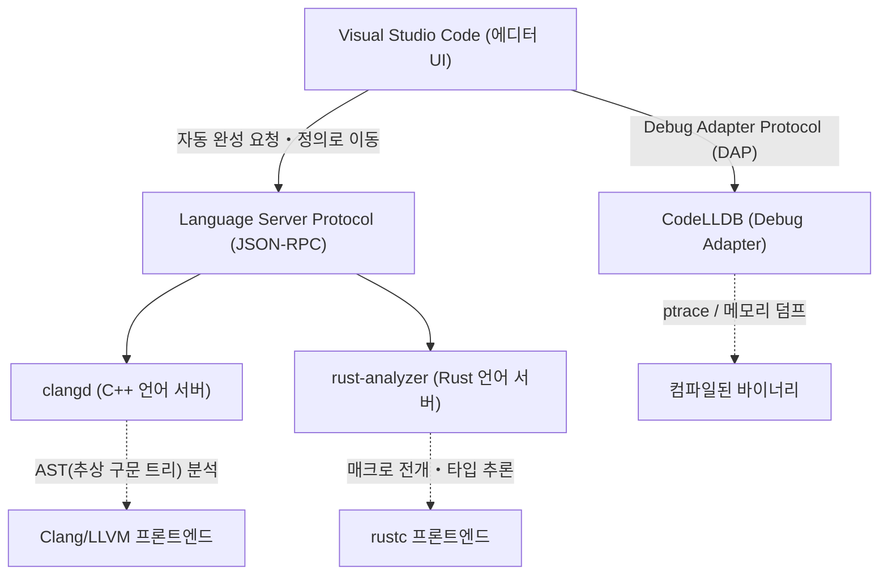
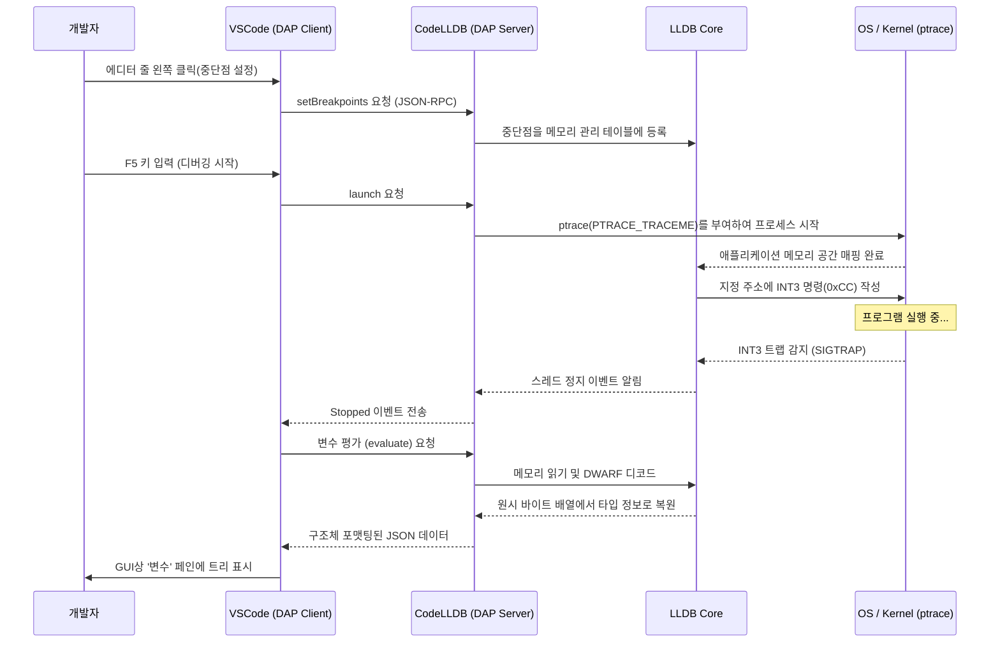

# 들어가며

현대 시스템 프로그래밍에서 C++와 Rust는 가장 중요한 언어로서 확고한 위치를 차지하고 있습니다. 오랜 실적과 방대한 생태계를 가지며, OS나 게임 엔진, 고빈도 매매(HFT) 시스템 등에서 필수적인 C++. 그리고 소유권(Ownership) 모델에 의한 메모리 안전성과 모던한 언어 사양으로 인해 급속히 보급되고 있으며, Linux 커널에도 채택이 진행되고 있는 Rust. 이 두 언어로 개발을 진행할 때, 에디터의 선택과 설정은 개발 생산성에 직결됩니다.

Visual Studio Code(VSCode)는 높은 확장성과 가벼움 덕분에 전 세계의 시스템 프로그래머들에게 사랑받고 있습니다. 하지만 설치 직후의 VSCode는 어디까지나 단순한 텍스트 에디터에 불과합니다. C++나 Rust의 진정한 힘을 이끌어내기 위해서는 언어의 시맨틱스를 깊이 이해하는 언어 서버나, 바이너리 수준에서 상태를 추적하는 디버거 등 적절한 확장 프로그램 도입과 치밀한 설정이 필수적입니다.

본 문서에서는 C++ 및 Rust 개발자를 위해 VSCode를 '최강의 통합 개발 환경(IDE)'으로 진화시키기 위한 확장 프로그램 10선을 소개합니다. 단순한 나열에 그치지 않고, 에디터의 내부 아키텍처, 구체적인 `tasks.json`과 `launch.json`의 고급 설정 예시, 나아가 언어 서버의 성능 최적화와 구문 분석의 수리 모델에 이르기까지 철저하게 파고들어 해설합니다.

---

## 1. VSCode와 Language Server Protocol(LSP)의 심층 아키텍처

확장 프로그램을 소개하기 전에, VSCode가 어떻게 고도의 코드 자동 완성이나 구문 분석을 제공하고 있는지, 그 기반이 되는 Language Server Protocol(LSP)의 아키텍처를 이해해 두는 것이 중요합니다.



VSCode 본체가 C++의 템플릿 메타 프로그래밍이나 Rust의 복잡한 라이프타임 지정자를 이해하고 있는 것은 아닙니다. 에디터의 역할은 소스 코드 표시와 사용자 입력 접수에 전념하며, 코드의 의미 분석(Semantic Analysis), 타입 추론(Type Inference), 에러 체크와 같이 계산 비용이 높은 처리는 백그라운드에서 동작하는 '언어 서버'에 JSON-RPC를 통해 위임됩니다.

이를 통해 에디터의 UI 스레드를 차단하지 않고 수백만 줄의 대규모 코드 베이스라 하더라도 원활한 타이핑과 빠른 응답을 실현하고 있습니다.

---

## 2. 필수 VSCode 확장 프로그램 10선

### ① clangd (궁극의 C++ 인텔리센스)

C++ 개발자에게 가장 중요한 선택 중 하나가 C++ 언어 기능을 제공하는 확장 프로그램입니다. VSCode를 설치하면 대부분 Microsoft 공식 'C/C++ (ms-vscode.cpptools)'가 권장되지만, 본격적인 시스템 개발에 있어서는 LLVM 프로젝트가 공식 제공하는 **`clangd`**를 강력히 추천합니다.

`clangd`는 컴파일러인 Clang의 프론트엔드 기술(파서와 시맨틱 애널라이저)을 직접 내장하고 있기 때문에 코드 분석 정확도가 매우 높으며, 에디터 상에 표시되는 에러나 경고는 실제 컴파일러가 출력하는 것과 완전히 일치합니다.

#### ms-vscode.cpptools가 아닌 clangd를 선택하는 이유
- **정밀도 높은 분석**: Clang의 AST(추상 구문 트리)를 직접 다루기 때문에 SFINAE(Substitution Failure Is Not An Error)를 다용한 복잡한 템플릿 인스턴스화나, 중첩된 매크로 전개를 정확하게 평가합니다.
- **백그라운드 인덱스를 통한 고속화**: 프로젝트 전체의 심볼 정보를 백그라운드에서 사전 계산(인덱스화)하기 때문에 '정의로 이동(Go to Definition)'이나 '모든 참조 찾기(Find All References)'가 거대한 프로젝트라도 순식간에 완료됩니다.

#### compile_commands.json의 완전한 설정
`clangd`를 올바르게 동작시키기 위해서는 프로젝트 내 각 소스 파일이 어떤 컴파일러 플래그(인클루드 경로 및 매크로 정의)로 컴파일되는지를 기술한 `compile_commands.json`이 필수입니다. CMake를 사용하고 있는 경우, 다음 명령어로 자동 생성할 수 있습니다.

```bash
cmake -B build -DCMAKE_EXPORT_COMPILE_COMMANDS=ON
```

VSCode 설정 파일(`.vscode/settings.json`)에서 `clangd`의 실행 인수를 다음과 같이 튜닝합니다.

```json
{
    "clangd.arguments": [
        "--compile-commands-dir=${workspaceFolder}/build",
        "--background-index",
        "--clang-tidy",
        "--header-insertion=iwyu",
        "--completion-style=detailed",
        "--j=6",
        "--pch-storage=memory"
    ]
}
```

여기서 `--j=6`은 백그라운드 인덱스에 사용할 워커 스레드 수입니다. 탑재된 CPU 코어 수에 맞게 조정해 주세요. 또한 `--pch-storage=memory`를 지정하여 미리 컴파일된 헤더(PCH)를 메모리에 유지시킴으로써 파싱 속도를 더욱 향상시킬 수 있습니다(단, RAM을 많이 소비합니다).

#### 언어 서버의 응답 시간과 AST 크기의 수리 모델

언어 서버의 응답 시간 $T_{response}$는 입력된 파일의 크기 $S$와 프로젝트 전체에서 인덱스된 AST의 크기 $M_{ast}$에 의존합니다. 구문 분석의 알고리즘 복잡성을 고려하여 근사적인 수식으로 표현하면 다음과 같습니다.

$$ T_{response} = \alpha \cdot O(S \log(M_{ast})) + \beta \cdot T_{IPC} $$

여기서 $\alpha$는 파서의 효율 계수, $\beta$는 프로세스 간 통신(IPC)의 오버헤드, $T_{IPC}$는 JSON-RPC의 직렬화/역직렬화 시간입니다.
`clangd`는 백그라운드 인덱스($M_{ast}$의 사전 계산 데이터 구조 최적화)를 극대화함으로써 탐색 오더인 $\log(M_{ast})$의 상수항을 극적으로 낮추고, 수십만 줄의 거대한 프로젝트에서도 수 밀리초 만에 응답할 수 있게 해줍니다.

---

### ② rust-analyzer (Rust 개발의 사실상 표준)

Rust 개발에서 현재 공식 언어 서버로 채택된 것이 **`rust-analyzer`**입니다. 예전에 표준이었던 RLS(Rust Language Server)는 컴파일러(rustc)를 직접 호출하는 아키텍처였기 때문에 응답에 한계가 있었지만, `rust-analyzer`는 IDE를 위해 처음부터 재설계되어, 불완전한 코드라 하더라도 점진적으로 파싱할 수 있는 강력한 기능을 가지고 있습니다.

#### 압도적인 생산성을 낳는 기능들
1. **Inlay Hints (인레이 힌트)**: 타입 추론이 강력한 Rust에서는 변수의 타입을 명시적으로 작성하지 않는 것이 권장되지만, 가독성이 떨어질 수 있습니다. Inlay Hints는 추론된 타입이나 함수 호출의 인수명을 에디터 상에 옅은 글씨로 오버레이 표시합니다.
2. **절차적 매크로(Proc-macro)의 완전한 지원**: `serde`의 `#[derive(Serialize)]`나 `tokio::main`과 같은 절차적 매크로는 컴파일 시에 AST를 TokenStream으로 받아 새로운 코드를 생성합니다. `rust-analyzer`는 이러한 매크로를 내부에서 전개하여 생성된 코드에 대해서도 자동 완성이나 에러 체크를 작동시킵니다.
3. **Magic Completions**: `iter().map().filter().collect()`와 같은 메서드 체인에서 중간 타입이 어떻게 변환되고 있는지 단계별로 표시 가능합니다.

#### rust-analyzer 권장 settings.json

```json
{
    "rust-analyzer.checkOnSave.command": "clippy",
    "rust-analyzer.cargo.allFeatures": true,
    "rust-analyzer.procMacro.enable": true,
    "rust-analyzer.inlayHints.bindingModeHints.enable": true,
    "rust-analyzer.inlayHints.closureReturnTypeHints.enable": "always",
    "rust-analyzer.lens.run.enable": true,
    "rust-analyzer.hover.actions.references.enable": true
}
```
저장 시에 자동으로 `cargo clippy`를 백그라운드에서 실행하는 설정은 필수라고 할 수 있습니다. 이를 통해 소유권 위반뿐만 아니라 성능상 개선 제안이나 더 Rust다운(Idiomatic한) 작성법을 즉시 학습할 수 있습니다.

---

### ③ CodeLLDB (크로스 플랫폼의 강력한 디버거)

C++와 Rust 중 어느 것을 개발하더라도 실행 시의 메모리 상태를 검사하기 위한 디버거는 필수입니다. 특히 Windows, Mac, Linux의 모든 플랫폼에서 안정적으로 동작하며 Rust와의 친화성이 매우 높은 것이 **`CodeLLDB`**입니다.

Rust 컴파일러(rustc)는 LLVM을 백엔드로 사용하고 있으며, 생성되는 디버그 정보(DWARF / PDB) 형식은 마찬가지로 LLVM 프로젝트의 일부인 LLDB와 완전히 호환됩니다.

#### launch.json의 고급 설정 예시

VSCode에서 디버깅을 시작하기 위한 `.vscode/launch.json` 설정입니다. 여기서는 C++와 Rust 모두의 실행 파일을 디버깅하기 위한 통합 구성을 보여줍니다.

```json
{
    "version": "0.2.0",
    "configurations": [
        {
            "type": "lldb",
            "request": "launch",
            "name": "Debug C++ Application",
            "program": "${workspaceFolder}/build/src/my_cpp_app",
            "args": ["--config", "settings.ini", "--verbose"],
            "cwd": "${workspaceFolder}",
            "preLaunchTask": "build_cpp_debug",
            "stopOnEntry": false,
            "sourceLanguages": ["cpp"]
        },
        {
            "type": "lldb",
            "request": "launch",
            "name": "Debug Rust Cargo Binary",
            "cargo": {
                "args": [
                    "build",
                    "--bin=my_rust_app",
                    "--package=my_rust_app"
                ],
                "filter": {
                    "name": "my_rust_app",
                    "kind": "bin"
                }
            },
            "args": [],
            "cwd": "${workspaceFolder}",
            "sourceLanguages": ["rust"]
        }
    ]
}
```
Rust의 구성 블록에 주목해 주십시오. `CodeLLDB`는 `cargo` 옵션을 기본적으로 지원하기 때문에 컴파일 후의 복잡한 해시값이 포함된 바이너리 경로를 직접 지정할 필요가 없습니다. 에디터가 자동으로 `cargo build`를 실행하고 생성된 최신 실행 파일을 포착하여 디버거를 연결해 줍니다.

---

### ④ CMake Tools

C++ 프로젝트의 업계 표준 빌드 시스템인 CMake를 VSCode 상에서 완벽하게 제어하기 위한 확장 프로그램입니다. **`CMake Tools`**는 명령줄에서의 번거로운 `cmake` 명령어 입력을 불필요하게 하며, 화면 하단의 상태 표시줄에서 대상 선택, 빌드, 디버깅을 원클릭으로 할 수 있게 해줍니다.

앞서 언급한 `clangd`에 필요한 `compile_commands.json`도 이 확장 프로그램 설정에서 자동으로 적절한 위치에 복사하게 할 수 있습니다.

#### settings.json에서의 CMake 연동 설정

```json
{
    "cmake.configureOnOpen": true,
    "cmake.exportCompileCommandsFileAndCopy": "${workspaceFolder}/compile_commands.json",
    "cmake.buildDirectory": "${workspaceFolder}/build/${buildType}",
    "cmake.generator": "Ninja"
}
```
빌드 도구로 `Ninja`를 지정하면 기본 Make보다 병렬 컴파일이 최적화되어 빌드 시간을 크게 단축할 수 있습니다. 빌드 프로파일(Debug / Release / RelWithDebInfo)을 전환했을 때에도 자동으로 새 설정에 따라 언어 서버의 분석이 이를 따릅니다.

---

### ⑤ crates (Rust 패키지 의존성의 실시간 관리)

Rust 의존성 관리 파일인 `Cargo.toml`을 매우 편리하게 만들어 주는 확장 프로그램입니다.

의존 크레이트(라이브러리)의 버전 번호 옆에 Crates.io(공식 저장소)에 등록된 최신 버전이 존재하는지 여부를 실시간으로 가져와 에디터 상에 인라인 표시해 줍니다.

```toml
[dependencies]
tokio = "1.28.0" # <- 에디터 상에 옅은 글씨로 "Latest: 1.35.1"이라고 표시됨
serde = { version = "1.0", features = ["derive"] }
reqwest = "0.11" # <- 업데이트가 필요한 경우 원클릭으로 수정 가능
```
이를 통해 구버전 라이브러리로 인한 취약성이나 버그를 미연에 방지할 수 있으며, 생태계 발전에 뒤처지지 않고 따라갈 수 있습니다.

---

### ⑥ Error Lens

`Error Lens`는 C++의 긴 템플릿 오류나 Rust의 엄격한 빌림 검사기(Borrow Checker) 오류를 에디터 해당 줄의 오른쪽에 직접 인라인으로 강조 표시하는 획기적인 확장 프로그램입니다.

보통 VSCode에서 오류의 자세한 내용을 확인하려면 화면 하단의 '문제(Problems)' 패널을 열거나 텍스트 상의 빨간 물결선에 정확히 마우스 커서를 올리고 호버 팝업을 기다려야 합니다. 그러나 이 조작은 인지 부하를 높이고 코딩의 흐름 상태를 방해합니다.

`Error Lens`를 도입하면 키보드에서 손을 떼지 않고 코드를 입력하는 중에 시야 가장자리에 오류 메시지가 표시됩니다. 특히 Rust에서의 "`cannot borrow 'x' as mutable because it is also borrowed as immutable`"과 같은 복잡한 라이프타임 오류를 해당 줄을 보면서 즉시 이해할 수 있기 때문에 수정 속도가 비약적으로 향상됩니다.

---

### ⑦ GitLens

시스템 프로그래밍 프로젝트는 종종 대규모이며, 역사가 긴 코드 베이스를 다루는 일이 빈번하게 발생합니다. '누가, 언제, 왜 이 난해한 포인터 조작 코드를 추가했는가?'를 추적하는 것은 버그 수정에서 가장 중요한 단계 중 하나입니다.

**`GitLens`**는 현재 커서 위치에 있는 줄의 `git blame` 정보를 에디터 상에 주석(Annotation)으로 옅게 표시합니다. 또한, 파일 전체의 커밋 기록을 그래픽으로 탐색하는 기능이나 줄 단위로 기록(Line History)을 거슬러 올라가는 기능을 갖추고 있습니다.

Rust의 `unsafe` 블록이나 C++의 까다로운 캐스트 처리를 마주했을 때, 그 코드가 병합되었을 당시의 Pull Request나 상세한 커밋 메시지를 즉시 참조할 수 있다는 것은 리버스 엔지니어링에 있어서 강력한 무기가 됩니다.

---

### ⑧ GitHub Copilot

시스템 프로그래밍에서도 생성형 AI 어시스턴트의 도입은 이미 불가피한 패러다임 시프트가 되었습니다. **`GitHub Copilot`**는 C++의 장황한 보일러플레이트 코드나 Rust의 복잡한 이터레이터 체인 구축을 매우 높은 정확도로 지원합니다.

#### 시스템 프로그래밍에서의 AI 활용
- **Rule of Five 구현**: C++에서 소멸자, 복사 생성자, 복사 대입 연산자, 이동 생성자, 이동 대입 연산자를 작성할 때 Copilot은 클래스의 멤버 변수를 기반으로 메모리 누수 없는 정확한 구현을 즉시 제안합니다.
- **문맥 이해**: C++ 헤더 파일(`.hpp`)에서 함수 프로토타입을 선언한 직후 구현 파일(`.cpp`)을 열면, Copilot이 자동으로 해당 함수의 시그니처를 완성하고 구현의 뼈대를 제공합니다.

---

### ⑨ Even Better TOML

Rust의 프로젝트 설정 파일인 `Cargo.toml`이나 툴체인 설정인 `rust-toolchain.toml`에 대한 구문 강조, 자동 포맷팅 및 강력한 스키마 유효성 검사(Schema Validation)를 제공하는 확장 프로그램입니다.

`Cargo.toml` 내에서의 단순한 오타(예를 들어 `[dependencies]`를 `[dependencis]`로 잘못 입력하는 등)를 실시간으로 경고해 주기 때문에 빌드 실행 시에 처음으로 오류를 깨닫는 시간 낭비를 배제할 수 있습니다. 또한 JSON Schema에 기반한 유효성 검사가 이루어지므로 사용 가능한 키를 자동 완성시키는 것도 가능합니다.

---

### ⑩ Code Spell Checker

시스템 프로그래밍에서 변수명이나 함수명의 정확한 철자는 프로젝트 전체의 가독성과 유지보수성에 직결됩니다. **`Code Spell Checker`**는 소스 코드 내의 식별자(카멜 표기법 `myVariable`이나 스네이크 표기법 `my_variable`을 자동으로 단어로 분해하여 판정)나 주석, 문자열 리터럴 내의 철자 오류를 감지합니다.

C++의 `std::unordered_map`이나 Rust의 `HashMap` 키로 문자열 리터럴을 사용하는 설계 패턴의 경우, 오타로 인한 버그는 컴파일을 통과해 버려 런타임 오류로 나타날 때까지 눈치채기 어렵다는 매우 성가신 성질이 있습니다. 맞춤법 검사기를 도입하고 에디터 상에서 물결선 경고를 표시함으로써, 이러한 사소한 실수를 코딩 단계에서 완전히 배제할 수 있습니다.

---

## 3. tasks.json을 활용한 빌드 파이프라인 자동화

IDE로서의 기능을 완성하기 위해서는 에디터의 GUI 기능뿐만 아니라 VSCode의 Task 기능(`.vscode/tasks.json`)을 활용하여 단축키(기본값 `Ctrl+Shift+B`) 하나로 빌드나 테스트를 실행할 수 있도록 설정하는 것이 중요합니다.

다음은 CMake를 사용한 C++ 빌드와 Cargo를 사용한 Rust 빌드를 공존시키는 고급 `tasks.json` 설정 예시입니다.

```json
{
    "version": "2.0.0",
    "tasks": [
        {
            "label": "build_cpp_debug",
            "type": "shell",
            "command": "cmake --build build --config Debug -j 8",
            "group": "build",
            "problemMatcher": [
                "$gcc"
            ],
            "presentation": {
                "reveal": "always",
                "panel": "shared"
            },
            "detail": "CMake를 사용하여 C++ 프로젝트를 Debug 모드로 빌드합니다"
        },
        {
            "label": "cargo build",
            "type": "cargo",
            "command": "build",
            "problemMatcher": [
                "$rustc"
            ],
            "group": {
                "kind": "build",
                "isDefault": true
            },
            "presentation": {
                "reveal": "silent"
            },
            "detail": "Cargo를 사용하여 Rust 프로젝트를 빌드합니다"
        }
    ]
}
```
여기서 핵심이 되는 것은 `problemMatcher` 설정입니다. `$gcc`나 `$rustc`로 지정함으로써, VSCode가 백그라운드에서 실행된 명령줄의 표준 출력을 정규식으로 구문 분석하고 오류가 발생한 파일명, 줄 번호, 열 번호를 추출하여 '문제' 패널에 목록으로 표시해 줍니다.

---

## 4. 디버깅 아키텍처 시각화와 고급 분석 기법

시스템 프로그래밍에서의 버그는 메모리 손상(세그멘테이션 폴트), 데이터 레이스, 정의되지 않은 동작 등 에디터의 정적 분석만으로는 발견할 수 없는 복잡한 것들이 많습니다. 디버거(CodeLLDB)가 어떻게 VSCode와 연동하여 OS 커널 수준에서 메모리 상태를 모니터링하고 있는지 그 내부 동작을 시퀀스 다이어그램으로 확인해 봅시다.



이 시퀀스 다이어그램이 보여주듯, 디버그 세션 중에는 VSCode와 CodeLLDB 사이에서 무수한 통신(Debug Adapter Protocol - DAP)이 이루어집니다. C++의 `std::map`이나 Rust의 `Vec<T>`와 같은 포인터 집합체인 복잡한 데이터 구조도 CodeLLDB에 내장된 포매터 기능에 의해 VSCode의 GUI 상에서 매우 직관적으로(배열 내용이 전개된 트리 형태로) 표시됩니다.

이를 가능하게 하기 위해 Rust 컴파일러는 DWARF 포맷 내에 타입 레이아웃 정보(크기나 패딩 등)를 상세하게 임베드하고, CodeLLDB는 이에 따라 타겟 메모리 상의 원시 바이트 배열을 사람이 읽을 수 있는 형태로 멋지게 변환하는 것입니다.

---

## 5. 개발자 생산성(Productivity)에 관한 수리적 모델링

마지막으로 이러한 확장 프로그램과 자동화 설정이 실제 개발 업무 생산성에 어떤 영향을 미치는지 수리 모델을 사용하여 평가해 봅시다.

개발자가 특정 작업(새로운 기능 구현이나 복잡한 버그 수정)을 완료하는 데 필요한 총 시간 $T_{total}$은 다음 공식으로 모델링할 수 있습니다.

$$ T_{total} = T_{design} + T_{write} + \sum_{k=1}^{N} \left( T_{compile}^{(k)} + T_{debug}^{(k)} + \lambda_{switch} \cdot T_{context\_switch}^{(k)} \right) $$

여기서 각 변수는 다음 의미를 갖습니다:
- $T_{design}$: 아키텍처 설계에 걸리는 시간 (일정)
- $T_{write}$: 실제 코드 작성에 걸리는 시간
- $N$: 컴파일・테스트・수정의 반복 횟수
- $T_{compile}$: 1회당 컴파일 시간
- $T_{debug}$: 버그 원인을 특정하고 수정하는 시간
- $T_{context\_switch}$: 에디터, 터미널, 브라우저(문서 검색) 등 도구 간 이동 시 인지적 컨텍스트 스위칭 시간
- $\lambda_{switch}$: 컨텍스트 스위칭이 일으키는 집중력 저하 페널티 계수

이번에 소개한 확장 프로그램들은 이 공식의 거의 모든 동적 매개변수를 최소화하는 방향으로 작용합니다.

1. **$T_{write}$의 극적인 감소**: `GitHub Copilot`이나 `rust-analyzer`의 고도화된 타입 추론 및 매크로 전개 기반 자동 완성을 통해 키 입력 횟수가 급감합니다.
2. **$N$의 최소화**: `Error Lens`와 실시간 Lint(clippy, clang-tidy)를 통해 타이핑하는 순간에 오류를 감지하고 수정할 수 있으므로, 빌드를 돌리고 나서 오류를 깨닫는 재작업 횟수 $N$이 감소합니다.
3. **$T_{debug}$ 최적화**: `CodeLLDB`와 `GitLens`를 통해 변수 상태 확인이나 코드 변경 의도 파악을 순식간에 할 수 있습니다.
4. **$T_{context\_switch}$ 배제**: 모든 작업(코드 편집, 빌드, 디버깅, Git 히스토리 확인, 오류 수정)이 VSCode라는 단일 창 안에서 완전히 끝나기 때문에 페널티 항인 $\lambda_{switch} \cdot T_{context\_switch}^{(k)}$가 거의 0이 됩니다.

결과적으로 작업 전체 소요 시간 $T_{total}$은 대폭 단축되며, 개발자는 더욱 창조적이고 본질적인 '설계($T_{design}$)'나 알고리즘 최적화에 더 많은 시간을 할애할 수 있게 됩니다.

---

## 마치며

C++와 Rust는 모두 '하드웨어의 한계 성능을 이끌어내는' 것을 목적으로 하는 엄격한 언어이며, 개발자에게는 높은 수준의 이해와 정확한 코딩이 요구됩니다.

본 문서에서 소개한 10가지 확장 프로그램과 설정을 적용함으로써, VSCode는 단순한 텍스트 에디터의 틀을 넘어 컴파일러의 깊은 지식과 디버거의 투시 능력을 겸비한 '개발자의 강력한 외골격'으로 진화합니다.

1. **clangd** (C++ 언어 서버)
2. **rust-analyzer** (Rust 언어 서버)
3. **CodeLLDB** (통합 디버거)
4. **CMake Tools** (C++ 빌드 자동화)
5. **crates** (Rust 의존성 관리)
6. **Error Lens** (인라인 오류 표시)
7. **GitLens** (고급 Git 이력 추적)
8. **GitHub Copilot** (AI 코딩 지원)
9. **Even Better TOML** (설정 파일 검증)
10. **Code Spell Checker** (오타 방지)

초기 설정 파일 커스터마이징에는 다소 시간이 걸릴지 모르지만, 한번 구축하고 나면 그 이후의 코딩 경험은 놀라울 정도로 쾌적하고 생산적이게 됩니다. 모쪼록 본 문서의 아키텍처 해설이나 구체적인 설정(`settings.json`, `tasks.json`, `launch.json`)을 참고하여 자신만의 최강의 개발 환경을 구축해 보시기 바랍니다.

쾌적하고 안전한 시스템 프로그래밍 라이프를 즐기시길!
