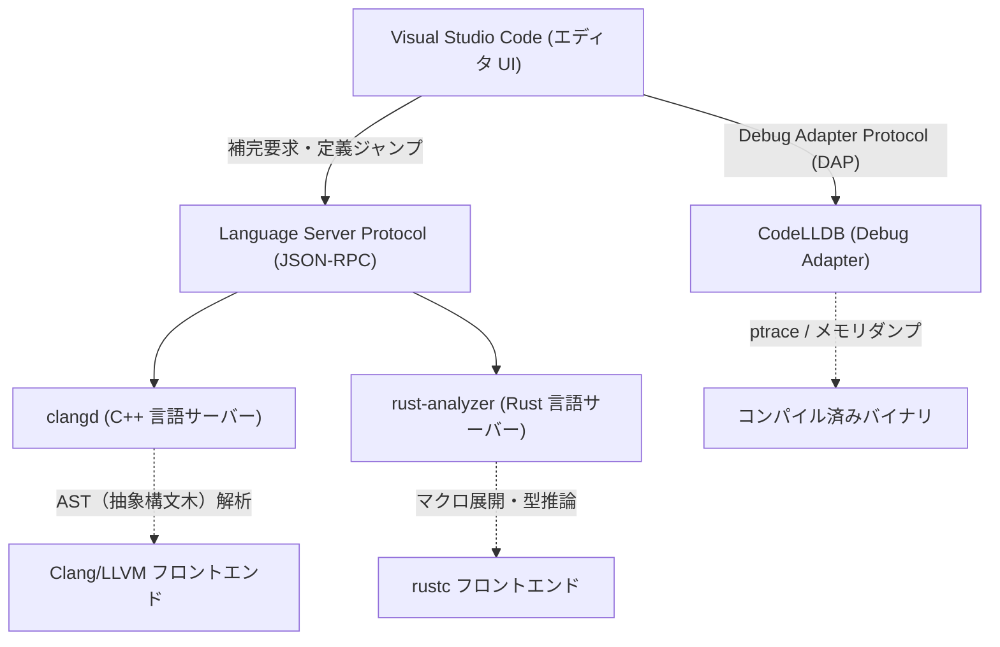
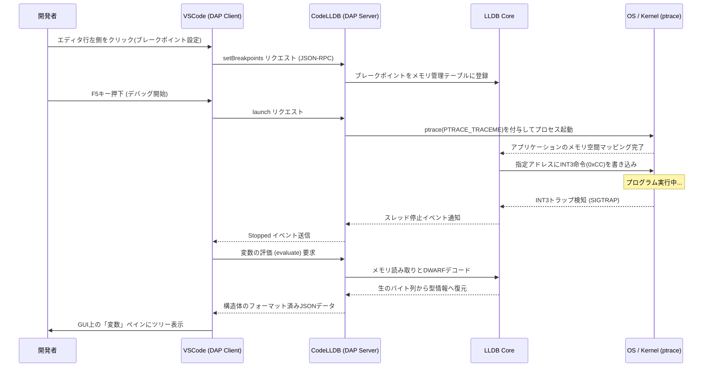

# はじめに

現代のシステムプログラミングにおいて、C++とRustは最も重要な言語として確固たる地位を築いています。長年の実績と膨大なエコシステムを持ち、OSやゲームエンジン、高頻度取引（HFT）システムなどで不可欠なC++。そして、所有権（Ownership）モデルによるメモリ安全性とモダンな言語仕様によって急速に普及し、Linuxカーネルへの採用も進んでいるRust。これら二つの言語で開発を行う際、エディタの選択と設定は開発の生産性に直結します。

Visual Studio Code（VSCode）は、その高い拡張性と軽量さから、世界中のシステムプログラマに愛用されています。しかし、インストールした直後のVSCodeはあくまで単なるテキストエディタに過ぎません。C++やRustの真の力を引き出すためには、言語のセマンティクスを深く理解する言語サーバーや、バイナリレベルで状態を追跡するデバッガなど、適切な拡張機能の導入と緻密な設定が不可欠です。

本記事では、C++およびRust開発者に向けて、VSCodeを「最強の統合開発環境（IDE）」へと進化させるための拡張機能10選を紹介します。単なるリストアップにとどまらず、エディタの内部アーキテクチャ、具体的な`tasks.json`や`launch.json`の高度な設定例、さらには言語サーバーのパフォーマンス最適化や構文解析の数理モデルに至るまで、徹底的に深掘りして解説します。

---

## 1. VSCodeとLanguage Server Protocol (LSP) の深層アーキテクチャ

拡張機能を紹介する前に、VSCodeがどのようにして高度なコード補完や構文解析を提供しているのか、その基盤となるLanguage Server Protocol (LSP) のアーキテクチャを理解しておくことが重要です。



VSCodeの本体は、C++のテンプレートメタプログラミングやRustの複雑なライフタイム指定子を理解しているわけではありません。エディタの役割はソースコードの表示とユーザーからの入力の受付に専念し、コードの意味解析（Semantic Analysis）、型推論（Type Inference）、エラーチェックといった計算コストの高い処理は、背後で動く「言語サーバー」にJSON-RPCを通じて委譲されます。

これにより、エディタのUIスレッドをブロックすることなく、数百万行の大規模コードベースであってもスムーズなタイピングと高速なレスポンスを実現しています。

---

## 2. 必須のVSCode拡張機能10選

### ① clangd (究極のC++インテリセンス)

C++開発者にとって最も重要な選択の一つが、C++の言語機能を提供する拡張機能です。VSCodeをインストールすると、多くの場合Microsoft公式の「C/C++ (ms-vscode.cpptools)」が推奨されますが、本格的なシステム開発においては、LLVMプロジェクトが公式に提供する **`clangd`** を強く推奨します。

`clangd`は、コンパイラであるClangのフロントエンド技術（パーサーとセマンティックアナライザ）を直接組み込んでいるため、コードの解析精度が極めて高く、エディタ上に表示されるエラーや警告は、実際のコンパイラが出力するものと完全に一致します。

#### ms-vscode.cpptools ではなく clangd を選ぶ理由
- **精度の高い解析**: ClangのAST（抽象構文木）を直接扱うため、SFINAE（Substitution Failure Is Not An Error）を多用した複雑なテンプレートのインスタンス化や、入れ子になったマクロ展開を正確に評価します。
- **バックグラウンドインデックスによる高速化**: プロジェクト全体のシンボル情報をバックグラウンドで事前計算（インデックス化）するため、「定義へ移動（Go to Definition）」や「すべての参照を検索（Find All References）」が巨大プロジェクトでも瞬時に完了します。

#### compile_commands.json の完全な設定
`clangd`を正しく動作させるためには、プロジェクト内の各ソースファイルがどのようなコンパイラフラグ（インクルードパスやマクロ定義）でコンパイルされるかを記述した `compile_commands.json` が必須です。CMakeを使用している場合、以下のコマンドで自動生成できます。

```bash
cmake -B build -DCMAKE_EXPORT_COMPILE_COMMANDS=ON
```

VSCodeの設定ファイル（`.vscode/settings.json`）で、`clangd`の起動引数を以下のようにチューニングします。

```json
{
    "clangd.arguments": [
        "--compile-commands-dir=${workspaceFolder}/build",
        "--background-index",
        "--clang-tidy",
        "--header-insertion=iwyu",
        "--completion-style=detailed",
        "--j=6",
        "--pch-storage=memory"
    ]
}
```

ここで、`--j=6` はバックグラウンドインデックスに使用するワーカースレッド数です。搭載されているCPUコア数に応じて調整してください。また、`--pch-storage=memory` を指定することで、プリコンパイル済みヘッダ（PCH）をメモリ上に保持し、パース速度をさらに向上させることができます（ただしRAMを多く消費します）。

#### 言語サーバーの応答時間とASTサイズの数理モデル

言語サーバーの応答時間 $T_{response}$ は、入力されたファイルのサイズ $S$ と、プロジェクト全体でインデックス済みのASTのサイズ $M_{ast}$ に依存します。構文解析のアルゴリズム複雑性を考慮し、近似的な数式で表現すると以下のようになります。

$$ T_{response} = \alpha \cdot O(S \log(M_{ast})) + \beta \cdot T_{IPC} $$

ここで、$\alpha$ はパーサーの効率係数、$\beta$ はプロセス間通信（IPC）のオーバーヘッド、 $T_{IPC}$ はJSON-RPCのシリアライズ/デシリアライズ時間です。
`clangd`はバックグラウンドインデックス（$M_{ast}$の事前計算データ構造の最適化）を極めることで、探索のオーダーである $\log(M_{ast})$ の定数項を劇的に押し下げ、数十万行の巨大プロジェクトでも数ミリ秒での応答を可能にしています。

---

### ② rust-analyzer (Rust開発のデファクトスタンダード)

Rust開発において、現在公式の言語サーバーとして採用されているのが **`rust-analyzer`** です。かつて標準だったRLS (Rust Language Server) はコンパイラ（rustc）を直接呼び出すアーキテクチャだったためレスポンスに限界がありましたが、`rust-analyzer`はIDE向けにゼロから設計し直され、不完全なコードであってもインクリメンタルにパースできる強力な機能を持っています。

#### 圧倒的な生産性を生む機能群
1. **Inlay Hints (インレイヒント)**: 型推論が強力なRustでは、変数の型を明示的に書かないことが推奨されますが、可読性が落ちる場合があります。Inlay Hintsは、推論された型や、関数呼び出しの引数名をエディタ上に薄い文字でオーバーレイ表示します。
2. **手続き的マクロ (Proc-macro) の完全サポート**: `serde` の `#[derive(Serialize)]` や `tokio::main` などの手続き的マクロは、コンパイル時にASTをTokenStreamとして受け取り、新しいコードを生成します。`rust-analyzer`はこれらのマクロを内部で展開し、生成されたコードに対しても補完やエラーチェックを機能させます。
3. **Magic Completions**: `iter().map().filter().collect()` のようなメソッドチェーンにおいて、途中の型がどのように変換されているかをステップごとに表示可能です。

#### rust-analyzer の推奨 settings.json

```json
{
    "rust-analyzer.checkOnSave.command": "clippy",
    "rust-analyzer.cargo.allFeatures": true,
    "rust-analyzer.procMacro.enable": true,
    "rust-analyzer.inlayHints.bindingModeHints.enable": true,
    "rust-analyzer.inlayHints.closureReturnTypeHints.enable": "always",
    "rust-analyzer.lens.run.enable": true,
    "rust-analyzer.hover.actions.references.enable": true
}
```
保存時に自動で `cargo clippy` をバックグラウンドで走らせる設定は必須と言えます。これにより、所有権の違反だけでなく、パフォーマンス上の改善提案や、よりRustらしい（Idiomaticな）書き方を即座に学習することができます。

---

### ③ CodeLLDB (クロスプラットフォームの強力なデバッガ)

C++とRustのどちらを開発するにしても、実行時のメモリ状態を検査するためのデバッガは必須です。特にWindows、Mac、Linuxのすべてのプラットフォームで安定して動作し、Rustとの親和性が極めて高いのが **`CodeLLDB`** です。

Rustのコンパイラ (rustc) はLLVMをバックエンドとして利用しており、生成されるデバッグ情報 (DWARF / PDB) のフォーマットは、同じくLLVMプロジェクトの一部であるLLDBと完全に適合します。

#### launch.json の高度な設定例

VSCodeでデバッグを開始するための `.vscode/launch.json` の設定です。ここではC++とRustの両方の実行ファイルをデバッグするための統合構成を示します。

```json
{
    "version": "0.2.0",
    "configurations": [
        {
            "type": "lldb",
            "request": "launch",
            "name": "Debug C++ Application",
            "program": "${workspaceFolder}/build/src/my_cpp_app",
            "args": ["--config", "settings.ini", "--verbose"],
            "cwd": "${workspaceFolder}",
            "preLaunchTask": "build_cpp_debug",
            "stopOnEntry": false,
            "sourceLanguages": ["cpp"]
        },
        {
            "type": "lldb",
            "request": "launch",
            "name": "Debug Rust Cargo Binary",
            "cargo": {
                "args": [
                    "build",
                    "--bin=my_rust_app",
                    "--package=my_rust_app"
                ],
                "filter": {
                    "name": "my_rust_app",
                    "kind": "bin"
                }
            },
            "args": [],
            "cwd": "${workspaceFolder}",
            "sourceLanguages": ["rust"]
        }
    ]
}
```
Rustの構成ブロックに注目してください。`CodeLLDB`は `cargo` オプションをネイティブにサポートしているため、コンパイル後の複雑なハッシュ値が含まれたバイナリパスを直接指定する必要がありません。エディタが自動的に `cargo build` を実行し、生成された最新の実行ファイルを捕捉してデバッガをアタッチしてくれます。

---

### ④ CMake Tools

C++プロジェクトの業界標準ビルドシステムであるCMakeを、VSCode上で完全に制御するための拡張機能です。**`CMake Tools`** は、コマンドラインでの煩雑な `cmake` コマンドの入力を不要にし、画面下部のステータスバーからターゲット選択、ビルド、デバッグをワンクリックで行えるようにします。

前述の `clangd` に必要な `compile_commands.json` も、この拡張機能の設定で自動的に適切な場所にコピーさせることができます。

#### settings.json での CMake連携設定

```json
{
    "cmake.configureOnOpen": true,
    "cmake.exportCompileCommandsFileAndCopy": "${workspaceFolder}/compile_commands.json",
    "cmake.buildDirectory": "${workspaceFolder}/build/${buildType}",
    "cmake.generator": "Ninja"
}
```
ビルドツールとして `Ninja` を指定することで、デフォルトのMakeよりも並列コンパイルが最適化され、ビルド時間を大幅に短縮できます。ビルドプロファイル（Debug / Release / RelWithDebInfo）を切り替えた際にも、自動的に新しい設定に基づいて言語サーバーの解析が追従します。

---

### ⑤ crates (Rustパッケージ依存関係のリアルタイム管理)

Rustの依存関係管理ファイルである `Cargo.toml` を極めて便利にする拡張機能です。

依存クレート（ライブラリ）のバージョン番号の横に、Crates.io（公式レポジトリ）に登録されている最新バージョンが存在するかどうかをリアルタイムでフェッチし、エディタ上にインライン表示してくれます。

```toml
[dependencies]
tokio = "1.28.0" # <- エディタ上で薄い文字で "Latest: 1.35.1" と表示される
serde = { version = "1.0", features = ["derive"] }
reqwest = "0.11" # <- アップデートが必要な場合はワンクリックで修正可能
```
これにより、古いバージョンのライブラリに起因する脆弱性やバグを未然に防ぐことができ、エコシステムの進化に遅れることなく追従できます。

---

### ⑥ Error Lens

`Error Lens` は、C++の長いテンプレートエラーや、Rustの厳密な借用チェッカー（Borrow Checker）のエラーを、エディタの該当行の右側に直接インラインでハイライト表示する画期的な拡張機能です。

通常、VSCodeでエラーの詳細を確認するには、画面下部の「問題（Problems）」パネルを開くか、テキスト上の赤い波線に正確にマウスカーソルを合わせてホバーポップアップを待つ必要があります。しかし、この操作は認知負荷を高め、コーディングのフロー状態を阻害します。

`Error Lens` を導入すると、キーボードから手を離すことなく、コードをタイプしている最中にエラーメッセージが視界の端に表示されます。特にRustにおける「`cannot borrow 'x' as mutable because it is also borrowed as immutable`」のような複雑なライフタイムエラーを、該当行を見ながら瞬時に理解できるため、修正速度が飛躍的に向上します。

---

### ⑦ GitLens

システムプログラミングのプロジェクトは往々にして大規模であり、歴史の長いコードベースを扱うことが頻繁に発生します。「誰が、いつ、なぜこの難解なポインタ操作のコードを追加したのか？」を追跡することは、バグ修正において最も重要なステップの一つです。

**`GitLens`** は、現在のカーソル位置にある行の `git blame` 情報をエディタ上にアノテーションとして薄く表示します。また、ファイル全体のコミット履歴をグラフィカルに探索する機能や、行単位での履歴（Line History）を辿る機能を備えています。

Rustの `unsafe` ブロックやC++のトリッキーなキャスト処理に遭遇した際、そのコードがマージされた当時のPull Requestや詳細なコミットメッセージを即座に参照できることは、リバースエンジニアリングにおける強力な武器となります。

---

### ⑧ GitHub Copilot

システムプログラミングにおいても、生成AIアシスタントの導入はすでに不可避のパラダイムシフトとなっています。**`GitHub Copilot`** は、C++の冗長なボイラープレートコードや、Rustの複雑なイテレータチェーンの構築を極めて高い精度でサポートします。

#### システムプログラミングにおけるAIの活用
- **Rule of Fiveの実装**: C++において、デストラクタ、コピーコンストラクタ、コピー代入演算子、ムーブコンストラクタ、ムーブ代入演算子を記述する際、Copilotはクラスのメンバ変数に基づき、メモリリークのない正確な実装を瞬時に提案します。
- **コンテキストの理解**: C++のヘッダファイル（`.hpp`）で関数プロトタイプを宣言した直後に実装ファイル（`.cpp`）を開くと、Copilotが自動的にその関数のシグネチャを補完し、実装の雛形を提供してくれます。

---

### ⑨ Even Better TOML

Rustのプロジェクト設定ファイルである `Cargo.toml` や、ツールチェイン設定の `rust-toolchain.toml` に対する、構文ハイライト、オートフォーマット、および強力なスキーマ検証（Schema Validation）を提供する拡張機能です。

`Cargo.toml` 内での単純なタイプミス（例えば、`[dependencies]` を `[dependencis]` と書き間違えるなど）をリアルタイムで警告してくれるため、ビルド実行時に初めてエラーに気付くというタイムロスを排除できます。また、JSON Schemaに基づいたバリデーションが行われるため、利用可能なキーを自動補完させることも可能です。

---

### ⑩ Code Spell Checker

システムプログラミングにおいて、変数名や関数名の正確なスペリングは、プロジェクト全体の可読性と保守性に直結します。**`Code Spell Checker`** は、ソースコード内の識別子（キャメルケース `myVariable` やスネークケース `my_variable` を自動で単語に分解して判定）や、コメント、文字列リテラル内のスペルミスを検知します。

C++の `std::unordered_map` やRustの `HashMap` のキーとして文字列リテラルを使用する設計パターンの場合、スペルミス（タイポ）によるバグはコンパイルを通過してしまい、実行時エラーとして顕在化するまで気づきにくいという非常に厄介な性質があります。スペルチェッカーを導入し、エディタ上で波線警告を出すことで、こうしたイージーミスをコーディング段階で完全に排除できます。

---

## 3. tasks.json を用いたビルドパイプラインの自動化

IDEとしての機能を完結させるためには、エディタのGUI機能だけでなく、VSCodeのTask機能（`.vscode/tasks.json`）を活用して、ショートカットキー（デフォルトでは `Ctrl+Shift+B`）一つでビルドやテストを実行できるように設定することが重要です。

以下は、CMakeを用いたC++のビルドと、Cargoを用いたRustのビルドを共存させる、高度な `tasks.json` の設定例です。

```json
{
    "version": "2.0.0",
    "tasks": [
        {
            "label": "build_cpp_debug",
            "type": "shell",
            "command": "cmake --build build --config Debug -j 8",
            "group": "build",
            "problemMatcher": [
                "$gcc"
            ],
            "presentation": {
                "reveal": "always",
                "panel": "shared"
            },
            "detail": "CMakeを使用してC++プロジェクトをDebugモードでビルドします"
        },
        {
            "label": "cargo build",
            "type": "cargo",
            "command": "build",
            "problemMatcher": [
                "$rustc"
            ],
            "group": {
                "kind": "build",
                "isDefault": true
            },
            "presentation": {
                "reveal": "silent"
            },
            "detail": "Cargoを使用してRustプロジェクトをビルドします"
        }
    ]
}
```
ここで鍵となるのが `problemMatcher` の設定です。`$gcc` や `$rustc` と指定することで、VSCodeがバックグラウンドで実行されたコマンドラインの標準出力を正規表現でパースし、エラーの発生したファイル名、行番号、列番号を抽出し、「問題」パネルに一覧表示してくれます。

---

## 4. デバッグアーキテクチャの可視化と高度な解析手法

システムプログラミングにおけるバグは、メモリ破壊（セグメンテーションフォールト）、データレース、未定義動作など、エディタの静的解析だけでは発見できない複雑なものが多々あります。デバッガ（CodeLLDB）がどのようにVSCodeと連携し、OSのカーネルレベルでメモリ状態を監視しているのか、その内部動作をシーケンス図で確認しましょう。



このシーケンス図が示すように、デバッグセッション中はVSCodeとCodeLLDBの間で無数の通信（Debug Adapter Protocol - DAP）が行われています。C++の `std::map` や Rustの `Vec<T>` といったポインタの集合体である複雑なデータ構造も、CodeLLDBに組み込まれたフォーマッタ機能によって、VSCodeのGUI上で非常に直感的に（配列の中身が展開されたツリー状で）表示されます。

これを可能にするため、RustのコンパイラはDWARFフォーマット内に型のレイアウト情報（サイズやパディングなど）を詳細に埋め込み、CodeLLDBはそれに従ってターゲットメモリ上の生バイト列を人間が読める形式に見事に変換しているのです。

---

## 5. 開発者の生産性（Productivity）に関する数理的モデリング

最後に、これらの拡張機能と自動化設定が、実際の開発業務の生産性にどのようなインパクトを与えるのかを、数理モデルを用いて評価してみましょう。

開発者が特定のタスク（新機能の実装や複雑なバグ修正）を完了するのに要する総時間 $T_{total}$ は、以下の式でモデル化できます。

$$ T_{total} = T_{design} + T_{write} + \sum_{k=1}^{N} \left( T_{compile}^{(k)} + T_{debug}^{(k)} + \lambda_{switch} \cdot T_{context\_switch}^{(k)} \right) $$

ここで各変数は以下の意味を持ちます：
- $T_{design}$: アーキテクチャ設計にかかる時間（一定）
- $T_{write}$: 実際のコードの記述にかかる時間
- $N$: コンパイル・テスト・修正のイテレーション回数
- $T_{compile}$: 1回あたりのコンパイル時間
- $T_{debug}$: バグの原因を特定し修正する時間
- $T_{context\_switch}$: エディタ、ターミナル、ブラウザ（ドキュメント検索）などのツール間を移動する際の認知的なコンテキストスイッチの時間
- $\lambda_{switch}$: コンテキストスイッチが引き起こす集中力低下のペナルティ係数

今回紹介した拡張機能群は、この式のほぼすべての動的パラメータを最小化する方向に働きます。

1. **$T_{write}$ の劇的削減**: `GitHub Copilot` や `rust-analyzer` の高度な型推論・マクロ展開に基づく補完により、キーストローク数が激減します。
2. **$N$ の最小化**: `Error Lens` とリアルタイムなLint（clippy, clang-tidy）により、タイピングの瞬間にエラーを検知して潰すことができるため、ビルドを回してからエラーに気付くという手戻りの回数 $N$ が減少します。
3. **$T_{debug}$ の最適化**: `CodeLLDB` と `GitLens` により、変数の状態確認やコードの変更意図の把握が瞬時に行えます。
4. **$T_{context\_switch}$ の排除**: すべての操作（コード編集、ビルド、デバッグ、Git履歴確認、エラーの修正）がVSCodeという単一のウィンドウ内で完全に完結するため、ペナルティ項 $\lambda_{switch} \cdot T_{context\_switch}^{(k)}$ がほぼゼロになります。

結果として、タスク全体の所要時間 $T_{total}$ は大幅に短縮され、開発者はより創造的で本質的な「設計（$T_{design}$）」やアルゴリズムの最適化に多くの時間を割くことができるようになります。

---

## おわりに

C++とRustは、どちらも「ハードウェアの限界性能を引き出す」ことを目的としたシビアな言語であり、開発者には高いレベルの理解と正確なコーディングが求められます。

本記事で紹介した10の拡張機能と設定を適用することで、VSCodeは単なるテキストエディタの枠を超え、コンパイラの深い知識とデバッガの透視能力を併せ持つ「開発者の強力な外骨格」へと進化します。

1. **clangd** (C++言語サーバー)
2. **rust-analyzer** (Rust言語サーバー)
3. **CodeLLDB** (統合デバッガ)
4. **CMake Tools** (C++ビルド自動化)
5. **crates** (Rust依存関係管理)
6. **Error Lens** (インラインエラー表示)
7. **GitLens** (高度なGit履歴追跡)
8. **GitHub Copilot** (AIコーディング支援)
9. **Even Better TOML** (設定ファイル検証)
10. **Code Spell Checker** (タイポ防止)

初期の設定ファイルのカスタマイズには多少の時間がかかるかもしれませんが、一度構築してしまえば、その後のコーディング体験は驚くほど快適で生産的なものになります。ぜひ本記事のアーキテクチャ解説や具体的な設定（`settings.json`, `tasks.json`, `launch.json`）を参考に、ご自身の最強の開発環境を構築してみてください。

快適で安全なシステムプログラミング・ライフを！
