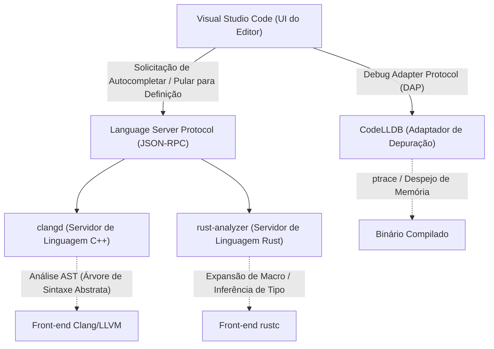
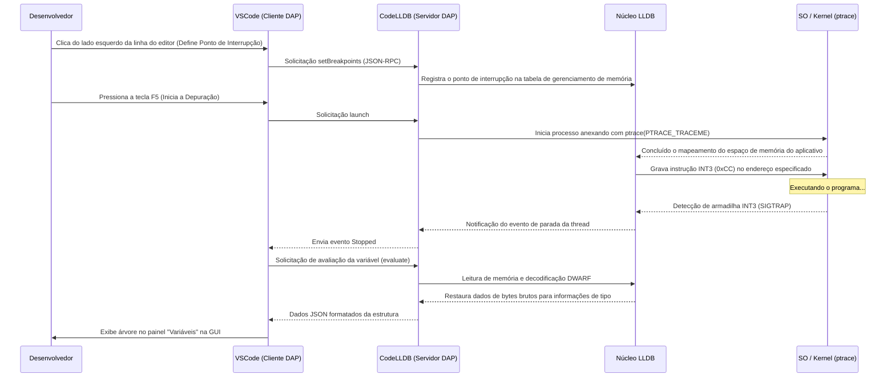

# Introdução

Na programação de sistemas moderna, C++ e Rust estabeleceram uma posição firme como as linguagens mais importantes. O C++ é indispensável para sistemas operacionais, motores de jogos e sistemas de negociação de alta frequência (HFT), graças ao seu longo histórico e vasto ecossistema. Por outro lado, o Rust, que está se espalhando rapidamente devido à sua segurança de memória garantida pelo modelo de propriedade (Ownership) e às especificações de linguagem modernas, também está ganhando adoção no kernel do Linux. Ao desenvolver nessas duas linguagens, a escolha e a configuração do editor afetam diretamente a produtividade.

O Visual Studio Code (VSCode) é amado por programadores de sistemas em todo o mundo devido à sua alta extensibilidade e leveza. No entanto, o VSCode recém-instalado é apenas um simples editor de texto. Para extrair o verdadeiro poder do C++ e do Rust, a introdução de extensões apropriadas e configurações precisas, como servidores de linguagem que entendem profundamente a semântica da linguagem, e depuradores que rastreiam o estado em nível de binário, são essenciais.

Neste artigo, apresentaremos as 10 extensões recomendadas para desenvolvedores C++ e Rust evoluírem o VSCode para o "Ambiente de Desenvolvimento Integrado (IDE) mais poderoso". Não apenas listaremos as ferramentas, mas exploraremos a fundo a arquitetura interna do editor, exemplos avançados de configuração para `tasks.json` e `launch.json` e até modelos matemáticos da otimização de desempenho e análise sintática do servidor de linguagem.

---

## 1. A Arquitetura Profunda do VSCode e do Language Server Protocol (LSP)

Antes de introduzir as extensões, é importante entender como o VSCode fornece complementação avançada de código e análise sintática, bem como a arquitetura do Language Server Protocol (LSP) que serve como base para isso.



O VSCode em si não entende a metaprogramação de templates do C++ ou os complexos especificadores de tempo de vida (lifetimes) do Rust. O editor foca em exibir o código-fonte e receber as entradas do usuário, delegando o processamento computacionalmente caro, como a análise semântica (Semantic Analysis), inferência de tipos (Type Inference) e verificação de erros, para os "servidores de linguagem" em segundo plano via JSON-RPC.

Isso permite uma digitação suave e resposta rápida sem bloquear a thread da interface do usuário do editor, mesmo em bases de código em grande escala com milhões de linhas.

---

## 2. As 10 Extensões Essenciais do VSCode

### ① clangd (O IntelliSense Definitivo para C++)

Uma das escolhas mais importantes para os desenvolvedores de C++ é a extensão que fornece os recursos da linguagem C++. Quando você instala o VSCode, frequentemente o "C/C++ (ms-vscode.cpptools)" oficial da Microsoft é recomendado, mas para desenvolvimento de sistemas a sério, recomendamos fortemente o **`clangd`**, fornecido oficialmente pelo projeto LLVM.

O `clangd` incorpora diretamente a tecnologia front-end do compilador Clang (parser e analisador semântico), de forma que a precisão da análise de código é extremamente alta, e os erros e avisos exibidos no editor correspondem perfeitamente aos gerados pelo compilador real.

#### Motivos para escolher clangd em vez de ms-vscode.cpptools
- **Análise de alta precisão**: Como lida diretamente com a AST (Árvore de Sintaxe Abstrata) do Clang, avalia corretamente as instanciações complexas de templates usando SFINAE (Substitution Failure Is Not An Error) e as expansões de macros aninhadas.
- **Aceleração por indexação em segundo plano**: Como as informações de símbolo de todo o projeto são pré-calculadas (indexadas) em segundo plano, funcionalidades como "Ir para Definição" e "Encontrar Todas as Referências" são concluídas instantaneamente, mesmo em projetos gigantescos.

#### Configuração completa do compile_commands.json
Para que o `clangd` funcione corretamente, um arquivo `compile_commands.json` é obrigatório. Ele descreve as flags do compilador (caminhos de inclusão e definições de macros) com as quais cada arquivo-fonte do projeto deve ser compilado. Se você usa o CMake, ele pode ser gerado automaticamente com o seguinte comando:

```bash
cmake -B build -DCMAKE_EXPORT_COMPILE_COMMANDS=ON
```

No arquivo de configurações do VSCode (`.vscode/settings.json`), você ajusta os argumentos de inicialização do `clangd` da seguinte forma:

```json
{
    "clangd.arguments": [
        "--compile-commands-dir=${workspaceFolder}/build",
        "--background-index",
        "--clang-tidy",
        "--header-insertion=iwyu",
        "--completion-style=detailed",
        "--j=6",
        "--pch-storage=memory"
    ]
}
```

Aqui, `--j=6` é o número de threads de trabalho usadas para a indexação em segundo plano. Ajuste-o de acordo com o número de núcleos da sua CPU. Além disso, ao especificar `--pch-storage=memory`, você pode manter os cabeçalhos pré-compilados (PCH) na memória, melhorando ainda mais a velocidade de análise (embora consuma mais RAM).

#### Modelo matemático do tempo de resposta do servidor de linguagem e tamanho da AST

O tempo de resposta do servidor de linguagem $T_{response}$ depende do tamanho do arquivo recebido $S$ e do tamanho da AST indexada em todo o projeto $M_{ast}$. Considerando a complexidade algorítmica da análise sintática, isso pode ser expresso através da seguinte fórmula aproximada:

$$ T_{response} = \alpha \cdot O(S \log(M_{ast})) + \beta \cdot T_{IPC} $$

Onde $\alpha$ é o coeficiente de eficiência do parser, $\beta$ é a sobrecarga da comunicação entre processos (IPC) e $T_{IPC}$ é o tempo de serialização / desserialização do JSON-RPC.
Dominando a indexação em segundo plano (otimização estrutural de dados pré-computados de $M_{ast}$), o `clangd` reduz drasticamente a constante subjacente na ordem de busca $\log(M_{ast})$, possibilitando respostas de poucos milissegundos até mesmo em projetos de centenas de milhares de linhas.

---

### ② rust-analyzer (O Padrão de Fato para Desenvolvimento em Rust)

No desenvolvimento em Rust, o atual servidor de linguagem oficial é o **`rust-analyzer`**. O RLS (Rust Language Server), antigo padrão, chamava diretamente o compilador (`rustc`), o que limitava o seu tempo de resposta. O `rust-analyzer` foi projetado do zero para IDEs e tem uma função poderosa capaz de fazer análise incremental, mesmo de código incompleto.

#### Funcionalidades que trazem produtividade esmagadora
1. **Inlay Hints (Dicas em linha)**: No Rust, graças à sua forte inferência de tipos, recomenda-se evitar declarações de tipos explícitas, mas isso pode reduzir a legibilidade. Os Inlay Hints exibem o tipo inferido ou o nome do argumento de chamadas de função com letras mais finas diretamente na tela do editor.
2. **Suporte completo a Macros Procedurais (Proc-macro)**: Macros procedurais como o `#[derive(Serialize)]` do `serde` ou o `tokio::main` recebem a AST como um TokenStream em tempo de compilação e geram código novo. O `rust-analyzer` expande essas macros internamente, permitindo autocompletar e verificação de erros no código gerado.
3. **Magic Completions (Complementos mágicos)**: Em encadeamentos de métodos como `iter().map().filter().collect()`, é possível visualizar passo a passo como as conversões de tipos estão ocorrendo.

#### settings.json recomendado para o rust-analyzer

```json
{
    "rust-analyzer.checkOnSave.command": "clippy",
    "rust-analyzer.cargo.allFeatures": true,
    "rust-analyzer.procMacro.enable": true,
    "rust-analyzer.inlayHints.bindingModeHints.enable": true,
    "rust-analyzer.inlayHints.closureReturnTypeHints.enable": "always",
    "rust-analyzer.lens.run.enable": true,
    "rust-analyzer.hover.actions.references.enable": true
}
```
A configuração que executa automaticamente o `cargo clippy` em segundo plano ao salvar é indispensável. Assim, violações de propriedade, propostas de melhoria de desempenho e conselhos sobre como escrever um código mais idiomático em Rust podem ser aprendidos de forma imediata.

---

### ③ CodeLLDB (Poderoso Depurador Multiplataforma)

Tanto na programação C++ quanto no Rust, um depurador para investigar o estado da memória durante a execução é essencial. O **`CodeLLDB`** é particularmente compatível com Rust e funciona de forma consistente no Windows, Mac e Linux.

O compilador do Rust (`rustc`) usa o LLVM no seu back-end, portanto o formato das informações de depuração geradas (DWARF / PDB) é totalmente compatível com o LLDB, que também faz parte do projeto LLVM.

#### Exemplo avançado de configuração do launch.json

Aqui está a configuração de `.vscode/launch.json` para iniciar a depuração no VSCode. Vamos demonstrar uma configuração integrada que abrange depuração de binários C++ e Rust.

```json
{
    "version": "0.2.0",
    "configurations": [
        {
            "type": "lldb",
            "request": "launch",
            "name": "Debug C++ Application",
            "program": "${workspaceFolder}/build/src/my_cpp_app",
            "args": ["--config", "settings.ini", "--verbose"],
            "cwd": "${workspaceFolder}",
            "preLaunchTask": "build_cpp_debug",
            "stopOnEntry": false,
            "sourceLanguages": ["cpp"]
        },
        {
            "type": "lldb",
            "request": "launch",
            "name": "Debug Rust Cargo Binary",
            "cargo": {
                "args": [
                    "build",
                    "--bin=my_rust_app",
                    "--package=my_rust_app"
                ],
                "filter": {
                    "name": "my_rust_app",
                    "kind": "bin"
                }
            },
            "args": [],
            "cwd": "${workspaceFolder}",
            "sourceLanguages": ["rust"]
        }
    ]
}
```
Preste atenção no bloco de configuração do Rust. O `CodeLLDB` tem suporte nativo para a opção `cargo`, removendo a necessidade de especificar caminhos de binários complexos contendo hashes. O editor rodará automaticamente o `cargo build`, localizará o arquivo executável gerado mais recente e fará a anexação do depurador de forma automática.

---

### ④ CMake Tools

Esta é a extensão completa para controlar totalmente o CMake, o sistema de compilação padrão da indústria para projetos C++, dentro do VSCode. O **`CMake Tools`** elimina a necessidade de longas digitações do comando `cmake` na linha de comando, permitindo configurar, selecionar o alvo, compilar e depurar com um único clique a partir da barra de status na parte inferior.

O `compile_commands.json`, necessário para o `clangd` discutido anteriormente, também pode ser gerado e copiado automaticamente por essa extensão.

#### Configuração de integração do CMake no settings.json

```json
{
    "cmake.configureOnOpen": true,
    "cmake.exportCompileCommandsFileAndCopy": "${workspaceFolder}/compile_commands.json",
    "cmake.buildDirectory": "${workspaceFolder}/build/${buildType}",
    "cmake.generator": "Ninja"
}
```
Especificando o `Ninja` como ferramenta de compilação, a paralelização será bastante otimizada em relação ao Make padrão, reduzindo muito os tempos de compilação. Ao alternar entre os perfis de compilação (Debug / Release / RelWithDebInfo), o servidor de linguagem seguirá essas novas configurações automaticamente.

---

### ⑤ crates (Gestão de Dependências em Tempo Real para Pacotes Rust)

Uma extensão extremamente útil para o `Cargo.toml`, o arquivo de gerenciamento de dependências do Rust.

Ela verifica em tempo real se existe uma versão mais recente da crate (biblioteca) no Crates.io e exibe-a discretamente ao lado do número da versão no editor.

```toml
[dependencies]
tokio = "1.28.0" # <- Exibe um texto discreto "Latest: 1.35.1" ao lado
serde = { version = "1.0", features = ["derive"] }
reqwest = "0.11" # <- Se houver atualizações, pode ser atualizado com apenas um clique
```
Isso ajuda a prevenir bugs e vulnerabilidades oriundos de versões antigas de bibliotecas, garantindo que o seu projeto acompanhe a evolução do ecossistema sem se atrasar.

---

### ⑥ Error Lens

O `Error Lens` é uma extensão inovadora que exibe erros longos de templates do C++ ou erros rigorosos do verificador de empréstimo (Borrow Checker) do Rust de forma destacada, inline (na própria linha) à direita.

Geralmente, no VSCode, para conferir os detalhes de um erro, é necessário abrir o painel "Problemas" ou passar o mouse precisamente em cima do sublinhado vermelho e aguardar o popup. Esse processo aumenta a carga cognitiva e prejudica o fluxo de codificação.

Ao usar o `Error Lens`, a mensagem de erro aparece na periferia da visão enquanto você digita, sem necessidade de tirar as mãos do teclado. Especialmente no Rust, erros de tempo de vida (lifetimes) confusos como "`cannot borrow 'x' as mutable because it is also borrowed as immutable`" podem ser analisados em tempo real na própria linha do erro, aumentando a velocidade de correção de forma drástica.

---

### ⑦ GitLens

Projetos de programação de sistemas frequentemente envolvem bases de código enormes e com um longo histórico. Investigar "quem, quando e por que aquele pedaço de código complexo com ponteiros foi adicionado?" é uma das etapas mais importantes durante a correção de bugs.

O **`GitLens`** anota suavemente a linha atual do cursor no editor com a informação do `git blame`. Além disso, possui funcionalidades para navegar no histórico completo de um arquivo visualmente, bem como explorar o histórico linha por linha (Line History).

Quando você esbarrar num bloco `unsafe` obscuro do Rust ou em um cast complexo em C++, conseguir encontrar rapidamente as mensagens do commit e do Pull Request que introduziram aquilo é uma arma valiosa para a engenharia reversa.

---

### ⑧ GitHub Copilot

Mesmo na programação de sistemas, a introdução das IAs generativas como assistentes é uma mudança de paradigma inevitável. O **`GitHub Copilot`** fornece suporte incrivelmente preciso, ajudando com o código boilerplate redundante do C++ e na construção de complexas cadeias de iteradores no Rust.

#### O Uso de IA na Programação de Sistemas
- **Implementando a Regra dos Cinco (Rule of Five)**: Ao escrever um destrutor, construtor de cópia, operador de atribuição de cópia, construtor de movimento e operador de atribuição de movimento em C++, o Copilot propõe instantaneamente uma implementação segura e sem vazamentos de memória (memory leaks), baseada nas variáveis-membro da classe.
- **Entendimento do Contexto**: Em C++, logo após você declarar um protótipo de função em um arquivo de cabeçalho (`.hpp`), ao abrir o arquivo de implementação (`.cpp`), o Copilot autocompletará a assinatura da função e criará um esqueleto de implementação automaticamente.

---

### ⑨ Even Better TOML

Esta extensão provê um destaque de sintaxe, formatação automática e validação poderosa usando esquemas (Schema Validation) para arquivos de configuração de projetos Rust como `Cargo.toml` ou as configurações da ferramenta em `rust-toolchain.toml`.

Um pequeno erro de digitação no `Cargo.toml` (por exemplo, escrevendo erroneamente `[dependencis]` em vez de `[dependencies]`) receberá um aviso em tempo real. Isso elimina a perda de tempo que seria percebida apenas durante a execução do processo de build. Como usa validação por JSON Schema, as chaves disponíveis também aparecem no autocompletar.

---

### ⑩ Code Spell Checker

Na programação de sistemas, a ortografia exata de variáveis e funções é importante para manter a legibilidade e a manutenibilidade do projeto a longo prazo. O **`Code Spell Checker`** detecta erros ortográficos em identificadores (dividindo identificadores CamelCase como `myVariable` ou SnakeCase como `my_variable` automaticamente em palavras), além de erros de grafia em comentários e literais de string.

Num padrão de projeto em que literais de string são usados como chaves em um `std::unordered_map` do C++ ou um `HashMap` do Rust, um erro de digitação passará livre pela compilação e só se tornará óbvio como erro durante o tempo de execução (runtime). Isso cria um bug complicado de se lidar. Colocando um corretor ortográfico que adiciona sublinhados no editor, esses erros bobos podem ser varridos da fase de codificação.

---

## 3. Automatização do Pipeline de Build usando o tasks.json

Para usar todo o potencial de um IDE, além das interfaces gráficas, é essencial usar o recurso de Tarefas (`.vscode/tasks.json`) para conseguir construir e testar seu software com o uso de um único atalho (por padrão, `Ctrl+Shift+B`).

O exemplo abaixo mostra uma configuração avançada do `tasks.json` que faz os processos de compilação em CMake para projetos C++ e Cargo para projetos Rust coexistirem de forma harmônica.

```json
{
    "version": "2.0.0",
    "tasks": [
        {
            "label": "build_cpp_debug",
            "type": "shell",
            "command": "cmake --build build --config Debug -j 8",
            "group": "build",
            "problemMatcher": [
                "$gcc"
            ],
            "presentation": {
                "reveal": "always",
                "panel": "shared"
            },
            "detail": "Compila o projeto C++ em modo Debug usando CMake"
        },
        {
            "label": "cargo build",
            "type": "cargo",
            "command": "build",
            "problemMatcher": [
                "$rustc"
            ],
            "group": {
                "kind": "build",
                "isDefault": true
            },
            "presentation": {
                "reveal": "silent"
            },
            "detail": "Compila o projeto Rust usando Cargo"
        }
    ]
}
```
A parte essencial aqui é a configuração de `problemMatcher`. Especificando `$gcc` ou `$rustc`, o VSCode efetuará o parsing baseado em expressão regular de todos os resultados vindos dos comandos da linha de terminal. Assim, o nome do arquivo, a linha e a coluna exata do erro serão extraídos e todos os erros serão listados no painel "Problemas".

---

## 4. Visualização Interativa do Escopo da Arquitetura de Depuração e Análise Avançada

Os bugs encontrados na programação de sistemas englobam problemas graves (como corrupção de memória e segmentation faults, disputas de dados/data races e comportamentos indefinidos) que muitas vezes os analisadores estáticos da IDE não percebem. Vamos compreender a arquitetura subjacente examinando como o depurador (CodeLLDB) trabalha em conjunto com o VSCode, usando processos a nível de sistema (kernel OS) para rastrear dados no diagrama de sequência abaixo.



Como ilustrado neste diagrama de sequência, existe um imenso fluxo contínuo de protocolos interativos durante o processamento da depuração. Essas comunicações infinitas (rodando sob a Especificação do Protocolo Debug Adapter - DAP) garantem operações suaves que ligam a interação do VSCode em conjunto ao CodeLLDB. Estruturas complexas orientadas à agregação de ponteiros abstratos como as bases orientadoras do `std::map` originário do C++ e `Vec<T>` em Rust transparecem formatações perfeitas ao visual do VSCode (através do mapeamento da matriz visual por árvore expandível da estrutura de objetos orientados a itens), permitindo a leitura e percepção natural pelo recurso embutido e formatado a partir da base do CodeLLDB.

Tudo isso graças ao compilador Rust que exporta todo o layout estrutural provindo nativamente (exemplo dos tamanhos estruturais orientando paddings de dados alocados nos preenchimentos) via formato DWARF. A partir das origens provindas com bases formadoras do CodeLLDB, tudo será lido da memória base no aspecto bruto binário de modo que converta lindamente esses dados complexos para visualizações interativas ao olho humano.

---

## 5. Modelagem Matemática da Produtividade dos Desenvolvedores

Por fim, vamos fazer um cálculo básico focado no viés prático e atestar o ganho temporal em avaliações analíticas de métricas operando nos modelos formadores do ganho com uso conjunto e integrado com estas matrizes formadoras do desenvolvimento de produção contendo ferramentas providas nos ambientes diários oriundos.

O cálculo da estimativa temporal $T_{total}$ gasto na tarefa alocada ao finalidade provida contendo desenvolvimento (criando utilitários formadores de novas instâncias baseadas ou reparando conflitos provindos de complexos defeitos) consiste na seguinte fórmula.

$$ T_{total} = T_{design} + T_{write} + \sum_{k=1}^{N} \left( T_{compile}^{(k)} + T_{debug}^{(k)} + \lambda_{switch} \cdot T_{context\_switch}^{(k)} \right) $$

Onde cada variável representa o seguinte:
- $T_{design}$: O tempo necessário para o design de arquitetura (constante)
- $T_{write}$: O tempo de codificação atual despendido
- $N$: O número de iterações de compilação, testes e correções
- $T_{compile}$: Tempo de compilação gasto em cada iteração
- $T_{debug}$: O tempo necessário para descobrir a causa dos bugs e fazer correções
- $T_{context\_switch}$: O custo cognitivo e de tempo gasto ao alternar entre ferramentas, como o editor, terminal e o navegador (para busca de documentação)
- $\lambda_{switch}$: O coeficiente de penalidade de perda de concentração resultante das trocas de contexto

As extensões aqui apresentadas trabalham para minimizar quase todos os parâmetros dinâmicos dessa equação.

1. **Redução Drástica no $T_{write}$**: Com o autocompletar avançado viabilizado pela inferência de tipo e expansão de macro do `GitHub Copilot` ou do `rust-analyzer`, o número de toques no teclado diminui substancialmente.
2. **Minimização de $N$**: Com o linting em tempo real (`clippy`, `clang-tidy`) emparelhado ao `Error Lens`, o desenvolvedor detecta e conserta problemas instantaneamente ao digitar, o que diminui as iterações e a chance de encontrar os erros apenas após executar o build.
3. **Otimização do $T_{debug}$**: Através do `CodeLLDB` e do `GitLens`, o desenvolvedor compreende os estados momentâneos das variáveis e a intenção das alterações no código quase de imediato.
4. **Eliminação de $T_{context\_switch}$**: Como tudo, desde a edição do texto, processos de compilação e depuração, até o monitoramento do histórico do Git e correções de erros é resolvido numa única janela do VSCode, o fator de penalidade $\lambda_{switch} \cdot T_{context\_switch}^{(k)}$ torna-se virtualmente zero.

Como resultado, o tempo total gasto $T_{total}$ é drasticamente cortado, liberando o desenvolvedor para despender quantidades muito mais intensas de energia focada na parte verdadeiramente criativa e essencial, o "Design ($T_{design}$)", e na otimização dos algoritmos.

---

## Conclusão

C++ e Rust são ambas linguagens impulsionadas pelo desafio de exaurir o limite extremo de eficiência do hardware. Isso exige dos programadores habilidades rigorosas com foco na precisão máxima ao codificar.

Adotando as dez ferramentas e as configurações detalhadas recomendadas neste artigo, o VSCode transcende o status de "simples editor de texto", elevando-se a um "Exoesqueleto de desenvolvedor" que une a inteligência avançada de compilação e o profundo poder investigativo das ferramentas de depuração.

1. **clangd** (Servidor de Linguagem C++)
2. **rust-analyzer** (Servidor de Linguagem Rust)
3. **CodeLLDB** (Depurador Integrado)
4. **CMake Tools** (Automação de Build C++)
5. **crates** (Gestão de Dependências Rust)
6. **Error Lens** (Aviso de Erros Inline)
7. **GitLens** (Rastreamento Histórico Avançado Git)
8. **GitHub Copilot** (Assistente e Suporte via IA)
9. **Even Better TOML** (Verificador de Formato em Arquivos Base de Configuração)
10. **Code Spell Checker** (Filtro e Prevenção sobre Lapsos de Erros em Digitação Tipográfica)

A configuração inicial e personalização desses arquivos pode tomar um pouco do seu tempo, mas uma vez estabelecido o sistema, o ambiente fluirá maravilhosamente e garantirá um nível de produtividade esmagador. Recomendamos fortemente a todos que usem os conceitos descritos e os modelos de (`settings.json`, `tasks.json` e `launch.json`) aqui presentes como referência e construam o "Ambiente de Desenvolvimento Mais Poderoso Possível".

Desejamos a todos uma programação de sistemas muito segura, rápida e feliz!
