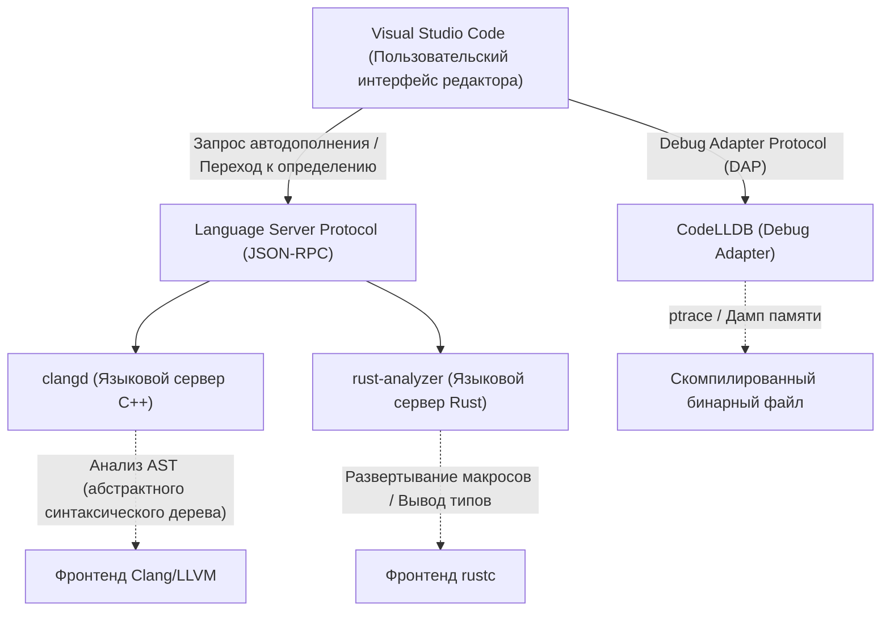
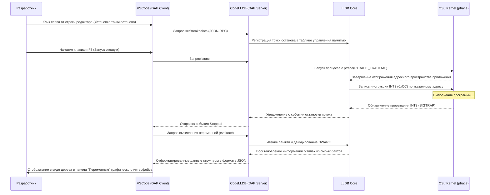

# Введение

В современном системном программировании C++ и Rust прочно заняли свои позиции как наиболее важные языки. C++ с его многолетней историей, огромной экосистемой, является незаменимым в ОС, игровых движках и системах высокочастотной торговли (HFT). С другой стороны, Rust стремительно набирает популярность благодаря своей модели владения (Ownership), обеспечивающей безопасность памяти, и современным языковым возможностям, вплоть до внедрения в ядро Linux. При разработке на этих двух языках выбор и настройка редактора напрямую влияют на продуктивность.

Visual Studio Code (VSCode) полюбился системным программистам по всему миру благодаря своей высокой расширяемости и легкости. Однако сразу после установки VSCode представляет собой не более чем простой текстовый редактор. Чтобы раскрыть истинную мощь C++ и Rust, необходимо установить соответствующие расширения и выполнить их тщательную настройку, включая языковые серверы, глубоко понимающие семантику языка, и отладчики, отслеживающие состояние на бинарном уровне.

В этой статье мы представим 10 расширений для разработчиков на C++ и Rust, которые превратят VSCode в «идеальную интегрированную среду разработки (IDE)». Мы не просто перечислим их, а детально рассмотрим внутреннюю архитектуру редактора, продвинутые примеры конфигураций `tasks.json` и `launch.json`, а также методы оптимизации производительности языковых серверов и математические модели синтаксического анализа.

---

## 1. Глубокая архитектура VSCode и Language Server Protocol (LSP)

Прежде чем переходить к расширениям, важно понять, как VSCode обеспечивает продвинутое автодополнение кода и синтаксический анализ, опираясь на архитектуру Language Server Protocol (LSP).



Сам VSCode не понимает метапрограммирование на шаблонах C++ или сложные спецификаторы времени жизни в Rust. Роль редактора сводится исключительно к отображению исходного кода и приему ввода от пользователя. Вычислительно затратные задачи, такие как семантический анализ (Semantic Analysis), вывод типов (Type Inference) и проверка ошибок, делегируются работающим в фоновом режиме «языковым серверам» через JSON-RPC.

Это позволяет избежать блокировки потока пользовательского интерфейса редактора и обеспечивает плавный набор текста и мгновенный отклик даже в огромных кодовых базах, состоящих из миллионов строк.

---

## 2. 10 обязательных расширений VSCode

### ① clangd (Идеальный IntelliSense для C++)

Для разработчиков на C++ одним из самых важных решений является выбор расширения, обеспечивающего языковые возможности. При установке VSCode часто рекомендуется официальное расширение от Microsoft «C/C++ (ms-vscode.cpptools)», однако для серьезной системной разработки настоятельно рекомендуется использовать **`clangd`**, официально предоставляемое проектом LLVM.

Поскольку `clangd` напрямую интегрирует фронтенд-технологии компилятора Clang (парсер и семантический анализатор), точность анализа кода чрезвычайно высока. Ошибки и предупреждения, отображаемые в редакторе, полностью совпадают с теми, что выводит реальный компилятор.

#### Почему стоит выбрать clangd вместо ms-vscode.cpptools
- **Высокая точность анализа**: Поскольку он напрямую работает с AST (абстрактным синтаксическим деревом) Clang, он точно вычисляет инстанцирование сложных шаблонов, интенсивно использующих SFINAE (Substitution Failure Is Not An Error), и развертывание вложенных макросов.
- **Ускорение за счет фонового индексирования**: Поскольку информация о символах всего проекта предварительно вычисляется (индексируется) в фоновом режиме, операции «Перейти к определению» (Go to Definition) или «Найти все ссылки» (Find All References) выполняются мгновенно даже в гигантских проектах.

#### Полная настройка compile_commands.json
Для правильной работы `clangd` необходим файл `compile_commands.json`, описывающий флаги компилятора (пути к заголовочным файлам, определения макросов), используемые для каждого исходного файла в проекте. Если вы используете CMake, его можно сгенерировать автоматически с помощью следующей команды:

```bash
cmake -B build -DCMAKE_EXPORT_COMPILE_COMMANDS=ON
```

В файле настроек VSCode (`.vscode/settings.json`) параметры запуска `clangd` можно оптимизировать следующим образом:

```json
{
    "clangd.arguments": [
        "--compile-commands-dir=${workspaceFolder}/build",
        "--background-index",
        "--clang-tidy",
        "--header-insertion=iwyu",
        "--completion-style=detailed",
        "--j=6",
        "--pch-storage=memory"
    ]
}
```

Здесь `--j=6` указывает количество рабочих потоков для фонового индексирования. Отрегулируйте это значение в соответствии с количеством ядер вашего процессора. Указав `--pch-storage=memory`, предварительно скомпилированные заголовки (PCH) будут храниться в оперативной памяти, что дополнительно повысит скорость синтаксического анализа (однако это потребует больше RAM).

#### Математическая модель времени отклика языкового сервера и размера AST

Время отклика языкового сервера $T_{response}$ зависит от размера введенного файла $S$ и размера проиндексированного AST всего проекта $M_{ast}$. Учитывая алгоритмическую сложность синтаксического анализа, это можно приблизительно выразить следующей формулой:

$$ T_{response} = \alpha \cdot O(S \log(M_{ast})) + \beta \cdot T_{IPC} $$

Где $\alpha$ — коэффициент эффективности парсера, $\beta$ — накладные расходы межпроцессного взаимодействия (IPC), а $T_{IPC}$ — время сериализации/десериализации JSON-RPC.
Доведя фоновое индексирование (оптимизацию структуры данных предварительного вычисления $M_{ast}$) до совершенства, `clangd` радикально снижает константу в логарифмической сложности $\log(M_{ast})$, позволяя отвечать за миллисекунды даже в гигантских проектах с сотнями тысяч строк.

---

### ② rust-analyzer (Стандарт де-факто для разработки на Rust)

Для разработки на Rust в настоящее время официальным языковым сервером является **`rust-analyzer`**. Ранее стандартом был RLS (Rust Language Server), который имел ограничения в скорости отклика из-за своей архитектуры, напрямую вызывающей компилятор (rustc). Однако `rust-analyzer` был спроектирован с нуля специально для IDE и обладает мощными возможностями инкрементального парсинга даже для неполного кода.

#### Функции, обеспечивающие потрясающую продуктивность
1. **Inlay Hints (Встроенные подсказки)**: В Rust с его мощным выводом типов рекомендуется не указывать типы переменных явно, но это может снизить читаемость. Inlay Hints отображают выведенные типы и имена аргументов функций поверх текста в редакторе полупрозрачным шрифтом.
2. **Полная поддержка процедурных макросов (Proc-macro)**: Процедурные макросы, такие как `#[derive(Serialize)]` из `serde` или `tokio::main`, принимают AST в виде TokenStream во время компиляции и генерируют новый код. `rust-analyzer` внутренне разворачивает эти макросы и позволяет использовать автодополнение и проверку ошибок для сгенерированного кода.
3. **Magic Completions (Магические автодополнения)**: В цепочках методов, таких как `iter().map().filter().collect()`, можно шаг за шагом видеть, как преобразовываются типы на каждом этапе.

#### Рекомендуемый settings.json для rust-analyzer

```json
{
    "rust-analyzer.checkOnSave.command": "clippy",
    "rust-analyzer.cargo.allFeatures": true,
    "rust-analyzer.procMacro.enable": true,
    "rust-analyzer.inlayHints.bindingModeHints.enable": true,
    "rust-analyzer.inlayHints.closureReturnTypeHints.enable": "always",
    "rust-analyzer.lens.run.enable": true,
    "rust-analyzer.hover.actions.references.enable": true
}
```
Автоматический запуск `cargo clippy` в фоновом режиме при сохранении является строго обязательной настройкой. Это позволяет не только избегать нарушений правил владения, но и немедленно получать предложения по оптимизации производительности и изучать более идиоматичные подходы к написанию кода на Rust.

---

### ③ CodeLLDB (Мощный кроссплатформенный отладчик)

Независимо от того, разрабатываете ли вы на C++ или на Rust, вам понадобится отладчик для проверки состояния памяти во время выполнения. **`CodeLLDB`** отличается исключительной стабильностью на всех платформах — Windows, Mac и Linux, а также идеальной совместимостью с Rust.

Поскольку компилятор Rust (rustc) использует LLVM в качестве бэкенда, формат генерируемой отладочной информации (DWARF / PDB) полностью совместим с LLDB, который также является частью проекта LLVM.

#### Пример продвинутой конфигурации launch.json

Вот конфигурация `.vscode/launch.json` для запуска отладки в VSCode. Ниже представлена объединенная конфигурация для отладки исполняемых файлов как на C++, так и на Rust.

```json
{
    "version": "0.2.0",
    "configurations": [
        {
            "type": "lldb",
            "request": "launch",
            "name": "Debug C++ Application",
            "program": "${workspaceFolder}/build/src/my_cpp_app",
            "args": ["--config", "settings.ini", "--verbose"],
            "cwd": "${workspaceFolder}",
            "preLaunchTask": "build_cpp_debug",
            "stopOnEntry": false,
            "sourceLanguages": ["cpp"]
        },
        {
            "type": "lldb",
            "request": "launch",
            "name": "Debug Rust Cargo Binary",
            "cargo": {
                "args": [
                    "build",
                    "--bin=my_rust_app",
                    "--package=my_rust_app"
                ],
                "filter": {
                    "name": "my_rust_app",
                    "kind": "bin"
                }
            },
            "args": [],
            "cwd": "${workspaceFolder}",
            "sourceLanguages": ["rust"]
        }
    ]
}
```
Обратите внимание на блок конфигурации Rust. `CodeLLDB` имеет встроенную поддержку опций `cargo`, поэтому вам не нужно вручную указывать пути к бинарным файлам, содержащим сложные хэши после компиляции. Редактор автоматически выполнит `cargo build`, перехватит новейший сгенерированный исполняемый файл и подключит к нему отладчик.

---

### ④ CMake Tools

Это расширение позволяет полностью управлять CMake — отраслевым стандартом системы сборки проектов на C++ — прямо из VSCode. **`CMake Tools`** избавляет от необходимости вводить громоздкие команды `cmake` в командной строке, позволяя одним кликом выбирать цели, запускать сборку и отладку из строки состояния в нижней части экрана.

Файл `compile_commands.json`, необходимый для вышеупомянутого `clangd`, также может быть автоматически скопирован в нужное место с помощью настроек этого расширения.

#### Интеграция CMake в settings.json

```json
{
    "cmake.configureOnOpen": true,
    "cmake.exportCompileCommandsFileAndCopy": "${workspaceFolder}/compile_commands.json",
    "cmake.buildDirectory": "${workspaceFolder}/build/${buildType}",
    "cmake.generator": "Ninja"
}
```
Указав `Ninja` в качестве инструмента сборки, можно значительно оптимизировать параллельную компиляцию по сравнению со стандартным Make, что существенно сократит время сборки. Даже при переключении профилей сборки (Debug / Release / RelWithDebInfo) анализ языкового сервера автоматически подстроится под новые настройки.

---

### ⑤ crates (Управление зависимостями пакетов Rust в реальном времени)

Это расширение делает работу с файлом управления зависимостями Rust `Cargo.toml` невероятно удобной.

Оно в реальном времени извлекает информацию с Crates.io (официального репозитория) и отображает прямо в редакторе рядом с номером версии зависимого крейта (библиотеки) информацию о наличии последней доступной версии.

```toml
[dependencies]
tokio = "1.28.0" # <- В редакторе полупрозрачным текстом будет показано "Latest: 1.35.1"
serde = { version = "1.0", features = ["derive"] }
reqwest = "0.11" # <- Если требуется обновление, его можно выполнить в один клик
```
Благодаря этому вы сможете предотвратить уязвимости и баги, вызванные использованием устаревших версий библиотек, и всегда идти в ногу с развитием экосистемы.

---

### ⑥ Error Lens

`Error Lens` — это революционное расширение, которое отображает длинные ошибки шаблонов C++ или строгие предупреждения borrow checker в Rust прямо в редакторе (inline), справа от соответствующей строки.

Обычно, чтобы просмотреть подробности ошибки в VSCode, нужно открыть панель «Проблемы» (Problems) в нижней части экрана или точно навести курсор мыши на красную волнистую линию в тексте и ждать всплывающего окна. Эти действия повышают когнитивную нагрузку и нарушают состояние потока при кодировании.

Установив `Error Lens`, вы будете видеть сообщения об ошибках на краю вашего поля зрения прямо во время набора кода, не отрывая рук от клавиатуры. В частности, сложные ошибки времени жизни в Rust, такие как «`cannot borrow 'x' as mutable because it is also borrowed as immutable`», можно понять мгновенно, глядя на соответствующую строку, что значительно ускоряет исправление.

---

### ⑦ GitLens

Проекты системного программирования зачастую бывают масштабными, и разработчикам нередко приходится иметь дело с кодовыми базы с долгой историей. Поиск ответа на вопрос: «Кто, когда и зачем добавил этот замысловатый код работы с указателями?» является одним из важнейших этапов в процессе исправления багов.

**`GitLens`** отображает информацию `git blame` для строки, где в данный момент находится курсор, в виде бледных аннотаций прямо в редакторе. Кроме того, расширение обладает функциями графического исследования истории коммитов всего файла и отслеживания истории построчно (Line History).

При столкновении с блоками `unsafe` в Rust или хитрым приведением типов в C++, возможность немедленно обратиться к Pull Request и подробным сообщениям коммитов того времени, когда этот код был слит, становится мощным оружием в реверс-инжиниринге.

---

### ⑧ GitHub Copilot

Даже в системном программировании внедрение генеративных ИИ-ассистентов стало неизбежным сдвигом парадигмы. **`GitHub Copilot`** с невероятно высокой точностью помогает в написании избыточного шаблонного кода (boilerplate) на C++ и конструировании сложных цепочек итераторов в Rust.

#### Использование ИИ в системном программировании
- **Реализация "Правила пяти" (Rule of Five)**: При написании деструктора, конструктора копирования, оператора присваивания копированием, конструктора перемещения и оператора присваивания перемещением в C++, Copilot мгновенно предлагает точные реализации без утечек памяти на основе переменных-членов класса.
- **Понимание контекста**: Если вы откроете файл реализации (`.cpp`) сразу после объявления прототипов функций в заголовочном файле C++ (`.hpp`), Copilot автоматически дополнит сигнатуры этих функций и предложит шаблоны для их реализации.

---

### ⑨ Even Better TOML

Это расширение предоставляет подсветку синтаксиса, автоформатирование и надежную проверку схемы (Schema Validation) для файлов конфигурации проектов Rust `Cargo.toml` и файлов настроек наборов инструментов `rust-toolchain.toml`.

Поскольку расширение в реальном времени предупреждает о простых опечатках в `Cargo.toml` (например, если вы напишете `[dependencis]` вместо `[dependencies]`), вы избавитесь от потери времени из-за ошибок, которые иначе были бы замечены только во время сборки. Кроме того, благодаря валидации на основе JSON Schema, становится возможным автоматическое дополнение доступных ключей.

---

### ⑩ Code Spell Checker

В системном программировании точное написание имен переменных и функций напрямую влияет на читаемость и поддерживаемость всего проекта. **`Code Spell Checker`** обнаруживает опечатки в идентификаторах (автоматически разбивая на слова camelCase `myVariable` и snake_case `my_variable`), а также в комментариях и строковых литералах.

В случае паттернов проектирования, использующих строковые литералы в качестве ключей для `std::unordered_map` в C++ или `HashMap` в Rust, опечатки имеют весьма неприятное свойство: они успешно проходят компиляцию и выявляются только в виде ошибок во время выполнения. Использование средства проверки орфографии, которое подчеркивает ошибки в редакторе, позволяет полностью устранить такие нелепые огрехи еще на этапе кодирования.

---

## 3. Автоматизация конвейера сборки с помощью tasks.json

Чтобы редактор мог полностью выполнять функции IDE, важно не только использовать его возможности GUI, но и задействовать функции задач (Task) VSCode (`.vscode/tasks.json`). Это позволит запускать сборку и тестирование с помощью одной комбинации клавиш (по умолчанию `Ctrl+Shift+B`).

Ниже приведен пример продвинутой настройки `tasks.json`, позволяющей совмещать сборку на C++ с использованием CMake и сборку на Rust с использованием Cargo.

```json
{
    "version": "2.0.0",
    "tasks": [
        {
            "label": "build_cpp_debug",
            "type": "shell",
            "command": "cmake --build build --config Debug -j 8",
            "group": "build",
            "problemMatcher": [
                "$gcc"
            ],
            "presentation": {
                "reveal": "always",
                "panel": "shared"
            },
            "detail": "Сборка проекта C++ в режиме Debug с использованием CMake"
        },
        {
            "label": "cargo build",
            "type": "cargo",
            "command": "build",
            "problemMatcher": [
                "$rustc"
            ],
            "group": {
                "kind": "build",
                "isDefault": true
            },
            "presentation": {
                "reveal": "silent"
            },
            "detail": "Сборка проекта Rust с использованием Cargo"
        }
    ]
}
```
Ключевым моментом здесь является настройка `problemMatcher`. Указав `$gcc` или `$rustc`, вы даете VSCode указание анализировать стандартный вывод командной строки, запущенной в фоновом режиме, с помощью регулярных выражений, извлекать имена файлов с ошибками, номера строк и столбцов, и выводить их в виде списка на панели «Проблемы».

---

## 4. Визуализация архитектуры отладки и продвинутые методы анализа

Баги в системном программировании, такие как разрушение памяти (segmentation fault), состояние гонки (data race) или неопределенное поведение (undefined behavior), часто бывают настолько сложными, что их невозможно обнаружить только с помощью статического анализа в редакторе. Давайте рассмотрим на диаграмме последовательности, как отладчик (CodeLLDB) взаимодействует с VSCode и отслеживает состояние памяти на уровне ядра ОС.



Как показывает эта диаграмма последовательности, во время сеанса отладки между VSCode и CodeLLDB происходит огромное количество коммуникаций (Debug Adapter Protocol - DAP). Даже такие сложные структуры данных, являющиеся набором указателей, как `std::map` в C++ или `Vec<T>` в Rust, весьма интуитивно отображаются в графическом интерфейсе VSCode (в виде дерева с раскрытым содержимым массивов) благодаря функции форматирования, встроенной в CodeLLDB.

Это становится возможным благодаря тому, что компилятор Rust подробно встраивает информацию о компоновке типов (размеры, отступы и т.д.) в формат DWARF, а CodeLLDB следует ей, блестяще преобразуя сырые байты в целевой памяти в формат, понятный человеку.

---

## 5. Математическое моделирование продуктивности разработчиков (Productivity)

В завершение давайте с помощью математической модели оценим, какое влияние оказывают описанные выше расширения и настройки автоматизации на реальную продуктивность разработки.

Общее время $T_{total}$, необходимое разработчику для завершения конкретной задачи (реализация новой функции или исправление сложного бага), можно смоделировать следующей формулой:

$$ T_{total} = T_{design} + T_{write} + \sum_{k=1}^{N} \left( T_{compile}^{(k)} + T_{debug}^{(k)} + \lambda_{switch} \cdot T_{context\_switch}^{(k)} \right) $$

Где каждая переменная имеет следующее значение:
- $T_{design}$: Время, затрачиваемое на проектирование архитектуры (константа)
- $T_{write}$: Время, затрачиваемое на фактическое написание кода
- $N$: Количество итераций компиляции, тестирования и внесения исправлений
- $T_{compile}$: Время одной компиляции
- $T_{debug}$: Время, необходимое на поиск причины и исправление бага
- $T_{context\_switch}$: Время когнитивного переключения контекста при переходе между инструментами, такими как редактор, терминал, браузер (поиск по документации)
- $\lambda_{switch}$: Коэффициент штрафа за потерю концентрации, вызванную переключением контекста

Набор расширений, представленный в этой статье, направлен на минимизацию почти всех динамических параметров в этом уравнении.

1. **Радикальное сокращение $T_{write}$**: Количество нажатий на клавиши резко снижается благодаря `GitHub Copilot` и автодополнению в `rust-analyzer`, основанному на мощном выводе типов и развертывании макросов.
2. **Минимизация $N$**: Благодаря `Error Lens` и линтингу в реальном времени (clippy, clang-tidy), ошибки выявляются и устраняются в момент набора текста. Это сокращает количество итераций $N$, когда ошибка обнаруживается только после запуска сборки.
3. **Оптимизация $T_{debug}$**: Благодаря `CodeLLDB` и `GitLens` можно мгновенно проверять состояние переменных и понимать намерения при изменении кода.
4. **Устранение $T_{context\_switch}$**: Поскольку все операции (редактирование кода, сборка, отладка, проверка истории Git, исправление ошибок) полностью выполняются в одном окне VSCode, штрафной фактор $\lambda_{switch} \cdot T_{context\_switch}^{(k)}$ сводится практически к нулю.

В результате общее время, необходимое на выполнение задачи $T_{total}$, существенно сокращается, и разработчики могут уделять гораздо больше времени более творческим и важным вещам, таким как «проектирование ($T_{design}$ )» и оптимизация алгоритмов.

---

## Заключение

C++ и Rust — это серьезные языки, целью которых является «максимальное раскрытие аппаратного потенциала», поэтому от разработчиков требуется высокий уровень понимания и точное написание кода.

Применив 10 расширений и настроек, представленных в этой статье, VSCode выйдет за рамки простого текстового редактора и превратится в «мощный экзоскелет разработчика», объединяющий глубокие знания компилятора и способности отладчика видеть всё насквозь.

1. **clangd** (Языковой сервер C++)
2. **rust-analyzer** (Языковой сервер Rust)
3. **CodeLLDB** (Интегрированный отладчик)
4. **CMake Tools** (Автоматизация сборки C++)
5. **crates** (Управление зависимостями Rust)
6. **Error Lens** (Отображение ошибок inline)
7. **GitLens** (Продвинутое отслеживание истории Git)
8. **GitHub Copilot** (ИИ-помощник в написании кода)
9. **Even Better TOML** (Валидация файлов конфигурации)
10. **Code Spell Checker** (Предотвращение опечаток)

Первоначальная настройка конфигурационных файлов может занять некоторое время, но как только она будет завершена, ваш дальнейший опыт программирования станет невероятно комфортным и продуктивным. Обязательно используйте архитектурные пояснения и конкретные настройки (`settings.json`, `tasks.json`, `launch.json`) из этой статьи, чтобы создать свою собственную идеальную среду разработки.

Желаем вам комфортной и безопасной жизни в системном программировании!
