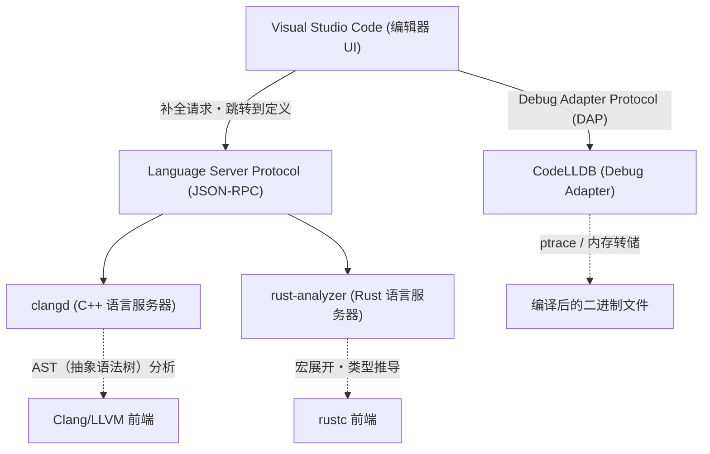
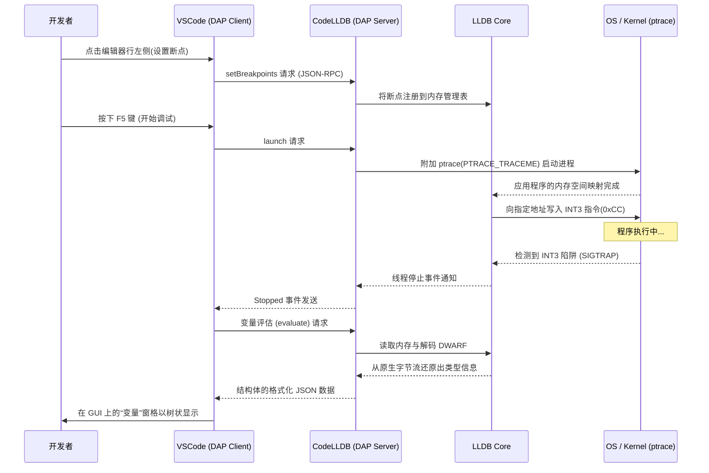

# 前言

在现代系统编程中，C++ 和 Rust 已经确立了作为最重要语言的稳固地位。C++ 凭借多年的经验和庞大的生态系统，在操作系统、游戏引擎、高频交易（HFT）系统等领域不可或缺。而 Rust 则凭借基于所有权（Ownership）模型的内存安全性和现代语言特性迅速普及，并且正逐渐被引入 Linux 内核中。在使用这两种语言进行开发时，编辑器的选择和配置直接关系到开发的生产力。

Visual Studio Code (VSCode) 因其高扩展性和轻量级，深受全球系统程序员的喜爱。然而，刚安装好的 VSCode 仅仅只是一个文本编辑器。为了充分发挥 C++ 和 Rust 的真正力量，深入理解语言语义的语言服务器，以及在二进制级别追踪状态的调试器等合适的扩展功能的引入和周密的配置是必不可少的。

在本文中，我们将为 C++ 和 Rust 开发者介绍 10 款扩展功能，帮助将 VSCode 进化为“最强的集成开发环境（IDE）”。不仅仅是简单的罗列，我们还将深入解析编辑器的内部架构，具体的 `tasks.json` 和 `launch.json` 的高级配置示例，甚至涵盖语言服务器的性能优化和语法分析的数学模型。

---

## 1. VSCode 与 Language Server Protocol (LSP) 的深层架构

在介绍扩展功能之前，了解 VSCode 是如何提供高级代码补全和语法分析的基础架构——Language Server Protocol (LSP) 是非常重要的。



VSCode 本身并不理解 C++ 的模板元编程或 Rust 复杂的生命周期说明符。编辑器的作用仅限于显示源代码和接收用户的输入，而代码的语义分析（Semantic Analysis）、类型推导（Type Inference）、错误检查等计算成本高昂的处理，则通过 JSON-RPC 委托给在后台运行的“语言服务器”。

这样一来，即使是数百万行的大规模代码库，也能在不阻塞编辑器 UI 线程的情况下，实现流畅的输入和高速的响应。

---

## 2. 必备的 10 款 VSCode 扩展

### ① clangd (极致的 C++ 智能提示)

对于 C++ 开发者来说，最重要的选择之一就是提供 C++ 语言特性的扩展功能。安装 VSCode 后，通常会推荐使用微软官方的“C/C++ (ms-vscode.cpptools)”，但在正式的系统开发中，我们强烈推荐使用 LLVM 项目官方提供的 **`clangd`**。

由于 `clangd` 直接集成了编译器 Clang 的前端技术（解析器和语义分析器），代码的解析精度极高，编辑器上显示的错误和警告与实际编译器输出的完全一致。

#### 为什么选择 clangd 而不是 ms-vscode.cpptools
- **高精度解析**：因为它直接处理 Clang 的 AST（抽象语法树），能够准确评估大量使用 SFINAE（替换失败并非错误）的复杂模板实例化和嵌套的宏展开。
- **通过后台索引实现高速化**：在后台预先计算（索引化）整个项目的符号信息，因此即使在大型项目中，“转到定义 (Go to Definition)”或“查找所有引用 (Find All References)”也能瞬间完成。

#### compile_commands.json 的完整配置
为了使 `clangd` 正常工作，必须提供 `compile_commands.json` 文件，其中描述了项目内的每个源文件是使用什么样的编译标志（包含路径或宏定义）进行编译的。如果使用 CMake，可以通过以下命令自动生成。

```bash
cmake -B build -DCMAKE_EXPORT_COMPILE_COMMANDS=ON
```

在 VSCode 的配置文件（`.vscode/settings.json`）中，如下调整 `clangd` 的启动参数。

```json
{
    "clangd.arguments": [
        "--compile-commands-dir=${workspaceFolder}/build",
        "--background-index",
        "--clang-tidy",
        "--header-insertion=iwyu",
        "--completion-style=detailed",
        "--j=6",
        "--pch-storage=memory"
    ]
}
```

这里，`--j=6` 是用于后台索引的工作线程数。请根据您机器搭载的 CPU 核心数进行调整。另外，通过指定 `--pch-storage=memory`，可以将预编译头文件 (PCH) 保留在内存中，从而进一步提高解析速度（不过会消耗较多 RAM）。

#### 语言服务器响应时间与 AST 大小的数学模型

语言服务器的响应时间 $T_{response}$ 取决于输入文件的大小 $S$ 以及整个项目中已索引的 AST 大小 $M_{ast}$。考虑到语法分析的算法复杂度，用近似公式表示如下：

$$ T_{response} = \alpha \cdot O(S \log(M_{ast})) + \beta \cdot T_{IPC} $$

这里，$\alpha$ 是解析器的效率系数，$\beta$ 是进程间通信（IPC）的开销，$T_{IPC}$ 是 JSON-RPC 的序列化/反序列化时间。
`clangd` 通过将后台索引（$M_{ast}$ 的预计算数据结构优化）发挥到极致，大幅降低了搜索复杂度 $\log(M_{ast})$ 的常数项，使得即便是数十万行的庞大项目也能在几毫秒内响应。

---

### ② rust-analyzer (Rust 开发的事实标准)

在 Rust 开发中，目前被采用为官方语言服务器的是 **`rust-analyzer`**。过去作为标准的 RLS (Rust Language Server) 因为直接调用编译器 (rustc) 的架构，在响应速度上存在局限，而 `rust-analyzer` 专为 IDE 重新从零设计，具有即使面对不完整的代码也能进行增量解析的强大功能。

#### 带来压倒性生产力的功能群
1. **Inlay Hints (内联提示)**：在类型推导强大的 Rust 中，推荐不显式写出变量的类型，但这有时会降低可读性。Inlay Hints 会在编辑器上用浅色文字覆盖显示推导出的类型和函数调用的参数名。
2. **完全支持过程宏 (Proc-macro)**：诸如 `serde` 的 `#[derive(Serialize)]` 或 `tokio::main` 等过程宏，在编译时将 AST 接收为 TokenStream，并生成新代码。`rust-analyzer` 能够在内部展开这些宏，并对生成的代码也提供补全和错误检查功能。
3. **Magic Completions**：在诸如 `iter().map().filter().collect()` 这样的方法链中，能够逐步显示中间的类型是如何被转换的。

#### rust-analyzer 推荐的 settings.json

```json
{
    "rust-analyzer.checkOnSave.command": "clippy",
    "rust-analyzer.cargo.allFeatures": true,
    "rust-analyzer.procMacro.enable": true,
    "rust-analyzer.inlayHints.bindingModeHints.enable": true,
    "rust-analyzer.inlayHints.closureReturnTypeHints.enable": "always",
    "rust-analyzer.lens.run.enable": true,
    "rust-analyzer.hover.actions.references.enable": true
}
```
保存时自动在后台运行 `cargo clippy` 的设置可以说是必不可少的。通过这个设置，不仅能够发现所有权违规，还可以即时学习到性能改进建议以及更符合 Rust 风格 (Idiomatic) 的写法。

---

### ③ CodeLLDB (跨平台的强大调试器)

无论是开发 C++ 还是 Rust，用于检查运行时内存状态的调试器都是必不可少的。特别是在 Windows、Mac、Linux 所有平台上都能稳定运行，并且与 Rust 具有极高亲和力的当属 **`CodeLLDB`**。

Rust 的编译器 (rustc) 使用 LLVM 作为后端，其生成的调试信息 (DWARF / PDB) 格式，与同属 LLVM 项目一部分的 LLDB 完全兼容。

#### launch.json 的高级配置示例

这是为了在 VSCode 中启动调试的 `.vscode/launch.json` 配置。这里展示了能够同时调试 C++ 和 Rust 两个可执行文件的集成配置。

```json
{
    "version": "0.2.0",
    "configurations": [
        {
            "type": "lldb",
            "request": "launch",
            "name": "Debug C++ Application",
            "program": "${workspaceFolder}/build/src/my_cpp_app",
            "args": ["--config", "settings.ini", "--verbose"],
            "cwd": "${workspaceFolder}",
            "preLaunchTask": "build_cpp_debug",
            "stopOnEntry": false,
            "sourceLanguages": ["cpp"]
        },
        {
            "type": "lldb",
            "request": "launch",
            "name": "Debug Rust Cargo Binary",
            "cargo": {
                "args": [
                    "build",
                    "--bin=my_rust_app",
                    "--package=my_rust_app"
                ],
                "filter": {
                    "name": "my_rust_app",
                    "kind": "bin"
                }
            },
            "args": [],
            "cwd": "${workspaceFolder}",
            "sourceLanguages": ["rust"]
        }
    ]
}
```
请注意 Rust 的配置块。`CodeLLDB` 原生支持 `cargo` 选项，因此不需要直接指定包含编译后复杂哈希值的二进制路径。编辑器会自动执行 `cargo build`，捕获最新生成的可执行文件并附加调试器。

---

### ④ CMake Tools

这是一款用于在 VSCode 上完全控制 C++ 项目的行业标准构建系统 CMake 的扩展功能。**`CMake Tools`** 免去了在命令行中输入繁琐 `cmake` 命令的麻烦，允许从屏幕底部的状态栏通过一键点击来进行目标选择、构建和调试。

前文提到的 `clangd` 所需的 `compile_commands.json`，也可以通过该扩展的设置自动复制到合适的位置。

#### settings.json 中的 CMake 协作配置

```json
{
    "cmake.configureOnOpen": true,
    "cmake.exportCompileCommandsFileAndCopy": "${workspaceFolder}/compile_commands.json",
    "cmake.buildDirectory": "${workspaceFolder}/build/${buildType}",
    "cmake.generator": "Ninja"
}
```
通过指定 `Ninja` 作为构建工具，比默认的 Make 拥有更好的并行编译优化，能够大幅缩短构建时间。当切换构建配置文件（Debug / Release / RelWithDebInfo）时，语言服务器的解析也会自动跟随新设置进行更新。

---

### ⑤ crates (Rust 包依赖关系的实时管理)

这是一款能让 Rust 依赖管理文件 `Cargo.toml` 变得极其方便的扩展功能。

在依赖库（crate）的版本号旁边，它会实时获取并在编辑器内联显示 Crates.io（官方仓库）中是否注册了最新版本。

```toml
[dependencies]
tokio = "1.28.0" # <- 会在编辑器上以浅色文字显示 "Latest: 1.35.1"
serde = { version = "1.0", features = ["derive"] }
reqwest = "0.11" # <- 如果需要更新，可以一键修复
```
借助该功能，可以防患于未然，避免由旧版本库引起的漏洞和 Bug，并且能够紧跟生态系统的进化步伐而不落后。

---

### ⑥ Error Lens

`Error Lens` 是一款革命性的扩展功能，它直接在编辑器的对应行右侧，以内联的方式高亮显示 C++ 冗长的模板错误，或是 Rust 严格的借用检查器（Borrow Checker）错误。

通常，在 VSCode 中要查看错误的详细信息，需要打开屏幕底部的“问题（Problems）”面板，或是将鼠标光标准确停留在文本的红色波浪线上等待悬停弹窗。然而，这些操作会增加认知负荷，并阻碍编码的心流状态。

引入 `Error Lens` 后，无需让手离开键盘，在编写代码的同时错误消息就会显示在视线边缘。特别是对于 Rust 中诸如“`cannot borrow 'x' as mutable because it is also borrowed as immutable`”这样复杂的生命周期错误，可以边看对应行边瞬间理解，从而使修复速度得到飞跃性的提升。

---

### ⑦ GitLens

系统编程的项目往往规模宏大，并且经常需要处理历史悠久的代码库。“是谁、在什么时候、出于什么原因添加了这段难以理解的指针操作代码？” 追踪这些信息是修复 Bug 时最重要的步骤之一。

**`GitLens`** 会在编辑器上以浅色注释的形式，显示当前光标所在行的 `git blame` 信息。此外，它还具备以图形化方式探索整个文件提交历史的功能，以及追踪行级历史（Line History）的功能。

当遇到 Rust 的 `unsafe` 块或 C++ 诡异的类型转换处理时，能够立即查阅该代码合并时的 Pull Request 或详细的提交说明，这在进行逆向工程时是一件强大的武器。

---

### ⑧ GitHub Copilot

在系统编程中，引入生成式 AI 助手也已成为不可避免的范式转变。**`GitHub Copilot`** 能以极高的精度协助编写 C++ 冗长的样板代码，或构建 Rust 复杂的迭代器链。

#### AI 在系统编程中的应用
- **五法则 (Rule of Five) 的实现**：在 C++ 中，当编写析构函数、拷贝构造函数、拷贝赋值运算符、移动构造函数和移动赋值运算符时，Copilot 能够根据类的成员变量，瞬间提供没有内存泄漏的正确实现。
- **上下文理解**：在 C++ 的头文件（`.hpp`）中声明函数原型后，如果紧接着打开实现文件（`.cpp`），Copilot 会自动补全该函数的签名，并提供实现的雏形。

---

### ⑨ Even Better TOML

这是一款为 Rust 项目配置文件 `Cargo.toml` 以及工具链配置文件 `rust-toolchain.toml` 提供语法高亮、自动格式化以及强大的模式验证（Schema Validation）的扩展功能。

它能够实时警告 `Cargo.toml` 内的简单拼写错误（例如，把 `[dependencies]` 错写成 `[dependencis]`），从而消除了直到执行构建时才发现错误的的时间浪费。另外，由于它基于 JSON Schema 进行验证，因此也能够自动补全可用的键。

---

### ⑩ Code Spell Checker

在系统编程中，变量名和函数名的准确拼写直接关系到整个项目的可读性和可维护性。**`Code Spell Checker`** 可以检测源代码中的标识符（自动将驼峰命名法 `myVariable` 或蛇形命名法 `my_variable` 拆分成单词进行判定）、注释以及字符串字面量中的拼写错误。

在将字符串字面量用作 C++ 的 `std::unordered_map` 或 Rust 的 `HashMap` 键的设计模式下，由拼写错误（笔误）引起的 Bug 会通过编译，并且直到作为运行时错误显现出来才容易被发现，这具有非常棘手的性质。通过引入拼写检查器并在编辑器上显示波浪线警告，可以在编码阶段完全排除这些低级错误。

---

## 3. 使用 tasks.json 自动化构建流水线

为了使其作为 IDE 的功能完整，不仅要依靠编辑器的 GUI 功能，还必须利用 VSCode 的 Task 功能（`.vscode/tasks.json`），配置成能够通过一个快捷键（默认为 `Ctrl+Shift+B`）来执行构建和测试。

以下是让使用 CMake 构建的 C++ 和使用 Cargo 构建的 Rust 共存的高级 `tasks.json` 配置示例。

```json
{
    "version": "2.0.0",
    "tasks": [
        {
            "label": "build_cpp_debug",
            "type": "shell",
            "command": "cmake --build build --config Debug -j 8",
            "group": "build",
            "problemMatcher": [
                "$gcc"
            ],
            "presentation": {
                "reveal": "always",
                "panel": "shared"
            },
            "detail": "使用 CMake 在 Debug 模式下构建 C++ 项目"
        },
        {
            "label": "cargo build",
            "type": "cargo",
            "command": "build",
            "problemMatcher": [
                "$rustc"
            ],
            "group": {
                "kind": "build",
                "isDefault": true
            },
            "presentation": {
                "reveal": "silent"
            },
            "detail": "使用 Cargo 构建 Rust 项目"
        }
    ]
}
```
这里的关键是 `problemMatcher` 的设置。通过指定 `$gcc` 或 `$rustc`，VSCode 会用正则表达式解析后台执行的命令行的标准输出，提取出发生错误的文件名、行号和列号，并将它们罗列在“问题”面板中。

---

## 4. 调试架构的可视化与高级分析方法

系统编程中的 Bug 往往非常复杂，例如内存破坏（段错误）、数据竞争、未定义行为等，这些问题仅凭编辑器的静态分析是无法发现的。让我们通过序列图来查看调试器（CodeLLDB）是如何与 VSCode 协作，并在操作系统的内核层面监控内存状态的。



正如该序列图所示，在调试会话期间，VSCode 和 CodeLLDB 之间正在进行无数次通信（Debug Adapter Protocol - DAP）。哪怕是像 C++ 的 `std::map` 或 Rust 的 `Vec<T>` 这种作为指针集合的复杂数据结构，由于 CodeLLDB 内置了格式化功能，也能在 VSCode 的 GUI 上非常直观地（以展开数组内容的树状形式）显示出来。

为了实现这一点，Rust 的编译器在 DWARF 格式中详细嵌入了类型的布局信息（如大小和填充等），而 CodeLLDB 就能根据这些信息，出色地将目标内存上的原生字节流转换为人类可读的格式。

---

## 5. 关于开发者生产力 (Productivity) 的数学建模

最后，让我们用数学模型来评估这些扩展功能和自动化配置对实际开发工作生产力会产生怎样的影响。

开发者完成特定任务（实现新功能或修复复杂的 Bug）所需的总时间 $T_{total}$ ，可以用以下公式来建模：

$$ T_{total} = T_{design} + T_{write} + \sum_{k=1}^{N} \left( T_{compile}^{(k)} + T_{debug}^{(k)} + \lambda_{switch} \cdot T_{context\_switch}^{(k)} \right) $$

这里每个变量的含义如下：
- $T_{design}$：架构设计所需的时间（固定）
- $T_{write}$：实际编写代码所需的时间
- $N$：编译、测试、修复的迭代次数
- $T_{compile}$：单次编译的时间
- $T_{debug}$：定位并修复 Bug 根源的时间
- $T_{context\_switch}$：在编辑器、终端、浏览器（搜索文档）等工具之间切换时导致的认知上下文切换时间
- $\lambda_{switch}$：上下文切换引起的注意力下降的惩罚系数

本次介绍的扩展功能群，基本上能够使该公式中所有的动态参数朝着最小化的方向发展。

1. **$T_{write}$ 的急剧缩减**：借助 `GitHub Copilot` 和基于 `rust-analyzer` 强大型推导与宏展开的代码补全，按键次数大幅减少。
2. **$N$ 的最小化**：通过 `Error Lens` 和实时 Lint (clippy, clang-tidy)，在敲击键盘的瞬间就能发现并解决错误，从而减少了需要运行构建才能发现错误的返工次数 $N$。
3. **$T_{debug}$ 的优化**：通过 `CodeLLDB` 和 `GitLens`，能够瞬间确认变量状态和把握代码更改的意图。
4. **$T_{context\_switch}$ 的消除**：所有的操作（代码编辑、构建、调试、查看 Git 历史、修复错误）都完全在一个 VSCode 窗口内完成，因此惩罚项 $\lambda_{switch} \cdot T_{context\_switch}^{(k)}$ 几乎为零。

结果是，整个任务所需的时间 $T_{total}$ 被大幅缩短，开发者能够将更多的时间投入到更具创造性和本质性的“设计 ($T_{design}$)”和算法优化上。

---

## 结语

C++ 和 Rust 都是以“压榨硬件极限性能”为目标的严苛语言，要求开发者具备高水平的理解和准确的编码能力。

通过应用本文介绍的 10 款扩展功能和配置，VSCode 将超越单纯文本编辑器的范畴，进化为兼具编译器深厚知识与调试器透视能力的“开发者的强大外骨格”。

1. **clangd** (C++ 语言服务器)
2. **rust-analyzer** (Rust 语言服务器)
3. **CodeLLDB** (集成调试器)
4. **CMake Tools** (C++ 构建自动化)
5. **crates** (Rust 依赖关系管理)
6. **Error Lens** (内联错误显示)
7. **GitLens** (高级 Git 历史追踪)
8. **GitHub Copilot** (AI 编码辅助)
9. **Even Better TOML** (配置文件验证)
10. **Code Spell Checker** (防止拼写错误)

初期配置文件的自定义可能会花费一些时间，但一旦搭建完成，之后的编码体验将变得令人惊讶地舒适且高效。请务必参考本文的架构解析和具体配置（`settings.json`、`tasks.json`、`launch.json`），尝试构建您自己的最强开发环境吧。

祝您拥有舒适且安全的系统编程生活！
