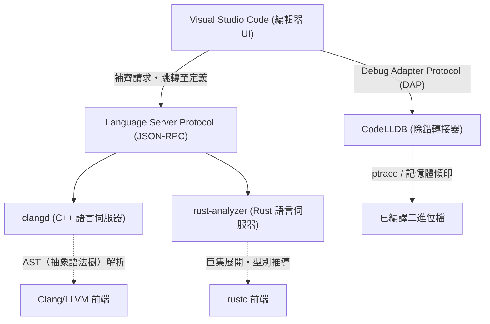
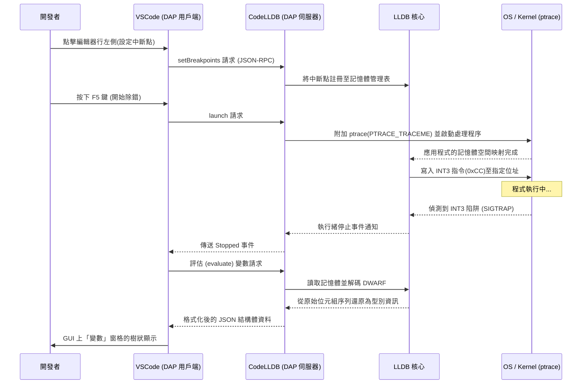

# 前言

在現代的系統程式設計中，C++ 和 Rust 已經確立了作為最重要語言的穩固地位。C++ 擁有長年的實績與龐大的生態系統，在作業系統、遊戲引擎、高頻交易（HFT）系統等領域不可或缺。而 Rust 憑藉其所有權（Ownership）模型帶來的記憶體安全性與現代化的語言規範，正迅速普及，並已開始被採用於 Linux 核心中。在使用這兩種語言進行開發時，編輯器的選擇與設定將直接影響開發的生產力。

Visual Studio Code（VSCode）因其高擴充性與輕量化，受到全世界系統程式設計師的喜愛。然而，剛安裝好的 VSCode 說到底只是個單純的文字編輯器。為了引出 C++ 和 Rust 的真正實力，導入合適的擴充功能並進行精細的設定是不可或缺的，例如能深入理解語言語意的語言伺服器，以及能在二進位層級追蹤狀態的除錯器。

本文將為 C++ 及 Rust 開發者介紹 10 款能將 VSCode 進化為「最強整合開發環境（IDE）」的擴充功能。我們不僅止於表面的清單列舉，還會深入探討編輯器的內部架構、具體的 `tasks.json` 與 `launch.json` 進階設定範例，甚至涵蓋語言伺服器的效能最佳化與語法解析的數學模型。

---

## 1. VSCode 與 Language Server Protocol (LSP) 的深層架構

在介紹擴充功能之前，理解 VSCode 是如何提供高度的程式碼補齊與語法解析非常重要，其基礎正是 Language Server Protocol (LSP) 的架構。



VSCode 本體並不理解 C++ 的模板元程式設計或是 Rust 複雜的生命週期提示字。編輯器的角色專注於原始碼的顯示與接收使用者的輸入，而程式碼的語意解析（Semantic Analysis）、型別推導（Type Inference）及錯誤檢查等計算成本高昂的處理，則透過 JSON-RPC 委派給在背景運作的「語言伺服器」。

藉此，即使是數百萬行的大型程式碼庫，也能在不阻塞編輯器 UI 執行緒的情況下，實現流暢的打字與高速的回應。

---

## 2. 10 款必備的 VSCode 擴充功能

### ① clangd (終極的 C++ IntelliSense)

對 C++ 開發者而言，最重要的選擇之一就是提供 C++ 語言功能的擴充功能。安裝 VSCode 時，通常會推薦 Microsoft 官方的「C/C++ (ms-vscode.cpptools)」，但在正式的系統開發中，我們強烈推薦由 LLVM 專案官方提供的 **`clangd`**。

由於 `clangd` 直接內建了編譯器 Clang 的前端技術（解析器與語意分析器），因此程式碼解析的精準度極高，顯示在編輯器上的錯誤與警告，與實際編譯器輸出的結果完全一致。

#### 為什麼選擇 clangd 而不是 ms-vscode.cpptools
- **高精準度的解析**: 因為直接處理 Clang 的 AST（抽象語法樹），能精確評估大量使用 SFINAE（Substitution Failure Is Not An Error）的複雜模板實例化，以及巢狀的巨集展開。
- **透過背景索引加速**: 會在背景將整個專案的符號資訊預先計算（索引化），因此即使在巨大的專案中，執行「跳轉至定義（Go to Definition）」或「尋找所有參考（Find All References）」也能在瞬間完成。

#### compile_commands.json 的完整設定
為了讓 `clangd` 正常運作，必須要有記載專案內各個原始檔是以何種編譯器旗標（包含路徑或巨集定義）進行編譯的 `compile_commands.json`。如果使用 CMake，可以透過以下指令自動產生。

```bash
cmake -B build -DCMAKE_EXPORT_COMPILE_COMMANDS=ON
```

在 VSCode 的設定檔（`.vscode/settings.json`）中，對 `clangd` 的啟動參數進行如下的微調。

```json
{
    "clangd.arguments": [
        "--compile-commands-dir=${workspaceFolder}/build",
        "--background-index",
        "--clang-tidy",
        "--header-insertion=iwyu",
        "--completion-style=detailed",
        "--j=6",
        "--pch-storage=memory"
    ]
}
```

在這裡，`--j=6` 是用於背景索引的工作執行緒數量，請根據搭載的 CPU 核心數進行調整。此外，指定 `--pch-storage=memory` 可以將預先編譯的標頭檔（PCH）保存在記憶體中，進一步提升解析速度（不過會消耗較多的 RAM）。

#### 語言伺服器的回應時間與 AST 大小的數學模型

語言伺服器的回應時間 $T_{response}$ 取決於輸入檔案的大小 $S$ 以及整個專案中已索引的 AST 大小 $M_{ast}$。考慮到語法解析的演算法複雜度，可以用近似的數學式表示如下：

$$ T_{response} = \alpha \cdot O(S \log(M_{ast})) + \beta \cdot T_{IPC} $$

其中，$\alpha$ 是解析器的效率係數，$\beta$ 是跨處理程序通訊（IPC）的額外開銷，$T_{IPC}$ 是 JSON-RPC 的序列化/反序列化時間。
`clangd` 透過極致的背景索引（最佳化 $M_{ast}$ 的預先計算資料結構），大幅壓低了搜尋複雜度 $\log(M_{ast})$ 的常數項，讓即使是數十萬行的巨大專案也能在數毫秒內回應。

---

### ② rust-analyzer (Rust 開發的事實標準)

在 Rust 開發中，目前被採用為官方語言伺服器的是 **`rust-analyzer`**。過去作為標準的 RLS (Rust Language Server) 因為採用直接呼叫編譯器（rustc）的架構，在回應速度上存在極限，而 `rust-analyzer` 則是專為 IDE 從零重新設計，擁有即使是不完整的程式碼也能進行漸進式解析的強大功能。

#### 帶來壓倒性生產力的功能群
1. **Inlay Hints (行內提示)**: 在型別推導強大的 Rust 中，通常建議不需明確寫出變數的型別，但這有時會降低可讀性。Inlay Hints 會在編輯器上以淺色文字覆蓋顯示推導出的型別，或是函式呼叫的引數名稱。
2. **程序巨集 (Proc-macro) 的完整支援**: 如 `serde` 的 `#[derive(Serialize)]` 或 `tokio::main` 等程序巨集，會在編譯時接收 AST 作為 TokenStream，並產生新的程式碼。`rust-analyzer` 會在內部展開這些巨集，並對產生的程式碼啟用補齊與錯誤檢查。
3. **Magic Completions**: 在如 `iter().map().filter().collect()` 的方法鏈中，能夠逐步顯示中間的型別是如何被轉換的。

#### rust-analyzer 的推薦 settings.json

```json
{
    "rust-analyzer.checkOnSave.command": "clippy",
    "rust-analyzer.cargo.allFeatures": true,
    "rust-analyzer.procMacro.enable": true,
    "rust-analyzer.inlayHints.bindingModeHints.enable": true,
    "rust-analyzer.inlayHints.closureReturnTypeHints.enable": "always",
    "rust-analyzer.lens.run.enable": true,
    "rust-analyzer.hover.actions.references.enable": true
}
```
存檔時自動在背景執行 `cargo clippy` 的設定可以說是必備的。這不僅能檢查所有權的違反，還能提供效能上的改善建議，讓你迅速學習更道地（Idiomatic）的 Rust 寫法。

---

### ③ CodeLLDB (跨平台的強大除錯器)

無論是開發 C++ 還是 Rust，用來檢查執行時記憶體狀態的除錯器都是必備的。特別是在 Windows、Mac、Linux 所有平台上都能穩定運作，且與 Rust 契合度極高的正是 **`CodeLLDB`**。

Rust 的編譯器 (rustc) 將 LLVM 作為後端使用，其產生的除錯資訊 (DWARF / PDB) 格式與同樣是 LLVM 專案一部分的 LLDB 完全相容。

#### launch.json 的進階設定範例

這是在 VSCode 中開始除錯的 `.vscode/launch.json` 設定。此處展示了整合 C++ 與 Rust 雙方執行檔的除錯配置。

```json
{
    "version": "0.2.0",
    "configurations": [
        {
            "type": "lldb",
            "request": "launch",
            "name": "Debug C++ Application",
            "program": "${workspaceFolder}/build/src/my_cpp_app",
            "args": ["--config", "settings.ini", "--verbose"],
            "cwd": "${workspaceFolder}",
            "preLaunchTask": "build_cpp_debug",
            "stopOnEntry": false,
            "sourceLanguages": ["cpp"]
        },
        {
            "type": "lldb",
            "request": "launch",
            "name": "Debug Rust Cargo Binary",
            "cargo": {
                "args": [
                    "build",
                    "--bin=my_rust_app",
                    "--package=my_rust_app"
                ],
                "filter": {
                    "name": "my_rust_app",
                    "kind": "bin"
                }
            },
            "args": [],
            "cwd": "${workspaceFolder}",
            "sourceLanguages": ["rust"]
        }
    ]
}
```
請注意 Rust 的配置區塊。因為 `CodeLLDB` 原生支援 `cargo` 選項，所以不需要直接指定編譯後包含複雜雜湊值的二進位檔路徑。編輯器會自動執行 `cargo build`，捕捉產生出的最新執行檔並附加除錯器。

---

### ④ CMake Tools

這是為了在 VSCode 上完全掌控 C++ 專案的業界標準建置系統 CMake 所推出的擴充功能。**`CMake Tools`** 免除了在命令列中輸入繁瑣 `cmake` 指令的需求，讓你從畫面底部的狀態列即可一鍵完成目標選擇、建置與除錯。

前面提到的 `clangd` 所需的 `compile_commands.json`，也可以透過這個擴充功能的設定自動複製到適當的位置。

#### settings.json 中的 CMake 整合設定

```json
{
    "cmake.configureOnOpen": true,
    "cmake.exportCompileCommandsFileAndCopy": "${workspaceFolder}/compile_commands.json",
    "cmake.buildDirectory": "${workspaceFolder}/build/${buildType}",
    "cmake.generator": "Ninja"
}
```
透過指定 `Ninja` 作為建置工具，比起預設的 Make，平行編譯的效能將獲得最佳化，大幅縮短建置時間。在切換建置設定檔（Debug / Release / RelWithDebInfo）時，也會自動根據新設定讓語言伺服器的解析隨之更新。

---

### ⑤ crates (即時管理 Rust 套件相依性)

這是一款讓 Rust 的相依性管理檔 `Cargo.toml` 變得極度方便的擴充功能。

它會在相依 Crate（函式庫）的版本號旁邊，即時抓取 Crates.io（官方儲存庫）中是否存在最新的版本，並以行內方式顯示在編輯器上。

```toml
[dependencies]
tokio = "1.28.0" # <- 編輯器上會以淺色文字顯示 "Latest: 1.35.1"
serde = { version = "1.0", features = ["derive"] }
reqwest = "0.11" # <- 如果需要更新，可以一鍵修正
```
如此一來，就能防患未然，避免因舊版本函式庫引起的漏洞或 Bug，並緊跟生態系統的演進而不落後。

---

### ⑥ Error Lens

`Error Lens` 是一款劃時代的擴充功能，它能將 C++ 冗長的模板錯誤，或是 Rust 嚴格的借用檢查器（Borrow Checker）錯誤，直接以行內高亮顯示在編輯器對應行的右側。

通常在 VSCode 中要確認錯誤的詳細資訊，必須打開畫面底部的「問題（Problems）」面板，或是準確地將滑鼠游標停在文字上的紅色波浪線上等待彈出視窗。然而，這些操作會增加認知負擔，阻礙寫程式的心流狀態。

導入 `Error Lens` 後，在不需要讓手離開鍵盤的情況下，輸入程式碼的同時，錯誤訊息就會出現在視線的邊緣。特別是像 Rust 中「`cannot borrow 'x' as mutable because it is also borrowed as immutable`」這類複雜的生命週期錯誤，因為能看著對應的程式碼行瞬間理解，修正速度將會飛躍性地提升。

---

### ⑦ GitLens

系統程式設計的專案往往規模龐大，經常需要處理歷史悠久的程式碼庫。追蹤「是誰、在什麼時候、為什麼加入了這段難懂的指標操作程式碼？」是修正 Bug 時最重要的步驟之一。

**`GitLens`** 會在目前游標所在行的位置，將 `git blame` 資訊以淺色標註顯示在編輯器上。此外，它還具備圖形化探索整個檔案的提交歷史記錄，以及逐行追溯歷史記錄（Line History）的功能。

當遇到 Rust 的 `unsafe` 區塊或是 C++ 取巧的轉型處理時，如果能立即參考該程式碼合併當時的 Pull Request 或詳細的提交訊息，這將成為逆向工程中的強大武器。

---

### ⑧ GitHub Copilot

即使在系統程式設計中，導入生成式 AI 助理也已成為不可避免的典範轉移。**`GitHub Copilot`** 能以極高的精準度，支援編寫 C++ 冗長的樣板程式碼，或是建構 Rust 複雜的迭代器鏈。

#### AI 在系統程式設計中的應用
- **實作 Rule of Five**: 在 C++ 中撰寫解構子、複製建構子、複製指派運算子、移動建構子與移動指派運算子時，Copilot 會根據類別的成員變數，瞬間提出無記憶體洩漏的正確實作。
- **理解上下文**: 在 C++ 的標頭檔（`.hpp`）中宣告函式原型後，緊接著打開實作檔（`.cpp`），Copilot 就會自動補齊該函式的簽名，並提供實作的雛形。

---

### ⑨ Even Better TOML

這是一款針對 Rust 專案設定檔 `Cargo.toml` 以及工具鏈設定檔 `rust-toolchain.toml` 提供語法高亮、自動格式化以及強大結構描述驗證（Schema Validation）的擴充功能。

它能即時警告 `Cargo.toml` 內的單純打字錯誤（例如，將 `[dependencies]` 錯拼成 `[dependencis]`），從而消除直到執行建置時才發現錯誤的時間浪費。此外，基於 JSON Schema 進行的驗證，還能自動補齊可用的鍵值。

---

### ⑩ Code Spell Checker

在系統程式設計中，變數名稱與函式名稱的正確拼寫，直接關係到整個專案的可讀性與可維護性。**`Code Spell Checker`** 能偵測原始碼內的識別字（會自動將駝峰式命名 `myVariable` 或蛇形命名 `my_variable` 拆解成單字來判定），以及註解、字串字面值內的拼字錯誤。

如果是將字串字面值作為 C++ 的 `std::unordered_map` 或 Rust 的 `HashMap` 鍵值的設計模式，因拼字錯誤（Typo）導致的 Bug 會通過編譯，直到作為執行時錯誤顯現出來為止都很難被發現，這是一個非常麻煩的問題。透過導入拼字檢查器，在編輯器上顯示波浪線警告，就能在編碼階段徹底排除這種低級錯誤。

---

## 3. 透過 tasks.json 自動化建置管線

為了讓 IDE 的功能更加完善，除了編輯器的 GUI 功能外，利用 VSCode 的工作功能（`.vscode/tasks.json`），設定成只需一個快捷鍵（預設為 `Ctrl+Shift+B`）就能執行建置或測試是非常重要的。

以下是能讓使用 CMake 的 C++ 建置與使用 Cargo 的 Rust 建置共存的進階 `tasks.json` 設定範例。

```json
{
    "version": "2.0.0",
    "tasks": [
        {
            "label": "build_cpp_debug",
            "type": "shell",
            "command": "cmake --build build --config Debug -j 8",
            "group": "build",
            "problemMatcher": [
                "$gcc"
            ],
            "presentation": {
                "reveal": "always",
                "panel": "shared"
            },
            "detail": "使用 CMake 以 Debug 模式建置 C++ 專案"
        },
        {
            "label": "cargo build",
            "type": "cargo",
            "command": "build",
            "problemMatcher": [
                "$rustc"
            ],
            "group": {
                "kind": "build",
                "isDefault": true
            },
            "presentation": {
                "reveal": "silent"
            },
            "detail": "使用 Cargo 建置 Rust 專案"
        }
    ]
}
```
這裡的關鍵在於 `problemMatcher` 的設定。透過指定 `$gcc` 或 `$rustc`，VSCode 會以正規表示式解析在背景執行的命令列標準輸出，萃取出發生錯誤的檔案名稱、行號、欄號，並列表顯示在「問題」面板中。

---

## 4. 除錯架構的視覺化與進階解析手法

系統程式設計中的 Bug，有許多是單靠編輯器的靜態解析無法發現的複雜問題，例如記憶體損壞（Segmentation Fault）、資料競爭、未定義行為等。讓我們透過循序圖，來確認除錯器（CodeLLDB）是如何與 VSCode 整合，並在 OS 的核心層級監控記憶體狀態的內部運作。



如同這個循序圖所示，除錯工作階段中，VSCode 與 CodeLLDB 之間會進行無數次的通訊（Debug Adapter Protocol - DAP）。像是 C++ 的 `std::map` 或 Rust 的 `Vec<T>` 這種由指標集合而成的複雜資料結構，也能透過內建於 CodeLLDB 的格式化功能，在 VSCode 的 GUI 上極其直覺地（展開陣列內容的樹狀結構）顯示出來。

為了實現這一點，Rust 編譯器會在 DWARF 格式內詳細嵌入型別的佈局資訊（大小與對齊填充等），而 CodeLLDB 則遵循這些資訊，完美地將目標記憶體上的原始位元組轉換為人類可讀的格式。

---

## 5. 關於開發者生產力（Productivity）的數學建模

最後，讓我們運用數學模型，來評估這些擴充功能與自動化設定，對實際開發業務的生產力會帶來什麼樣的影響。

開發者完成特定任務（實作新功能或修正複雜 Bug）所需的總時間 $T_{total}$，可以使用以下公式建立模型：

$$ T_{total} = T_{design} + T_{write} + \sum_{k=1}^{N} \left( T_{compile}^{(k)} + T_{debug}^{(k)} + \lambda_{switch} \cdot T_{context\_switch}^{(k)} \right) $$

這裡各個變數的意義如下：
- $T_{design}$: 架構設計花費的時間（常數）
- $T_{write}$: 撰寫實際程式碼花費的時間
- $N$: 編譯、測試、修正的迭代次數
- $T_{compile}$: 每次的編譯時間
- $T_{debug}$: 找出 Bug 原因並修正的時間
- $T_{context\_switch}$: 在編輯器、終端機、瀏覽器（搜尋文件）等工具間切換時的認知上下文切換時間
- $\lambda_{switch}$: 上下文切換所引起的注意力下降懲罰係數

本文介紹的擴充功能群，幾乎都是朝著將這個公式中所有動態參數最小化的方向發揮作用。

1. **大幅減少 $T_{write}$**: 透過 `GitHub Copilot` 以及 `rust-analyzer` 基於進階型別推導與巨集展開的補齊，按鍵次數會大幅減少。
2. **最小化 $N$**: 藉由 `Error Lens` 與即時的 Lint（clippy, clang-tidy），能在打字的瞬間偵測並消滅錯誤，因此減少了執行建置後才發現錯誤的重工次數 $N$。
3. **最佳化 $T_{debug}$**: 透過 `CodeLLDB` 與 `GitLens`，可以瞬間確認變數狀態以及掌握程式碼修改的意圖。
4. **消除 $T_{context\_switch}$**: 所有的操作（程式碼編輯、建置、除錯、確認 Git 歷史、修正錯誤）都能完全在 VSCode 這個單一視窗內完成，因此懲罰項 $\lambda_{switch} \cdot T_{context\_switch}^{(k)}$ 將幾乎趨近於零。

結果就是，任務整體的所需時間 $T_{total}$ 大幅縮短，開發者將能把更多的時間分配給更具創造性且本質的「設計（$T_{design}$）」與演算法的最佳化。

---

## 結語

C++ 與 Rust 都是以「發揮硬體極限效能」為目的的嚴謹語言，對開發者有著高水準的理解與準確編碼的要求。

透過套用本文介紹的 10 款擴充功能與設定，VSCode 將超越單純文字編輯器的框架，進化為兼具編譯器深度知識與除錯器透視能力的「開發者的強大外骨骼」。

1. **clangd** (C++ 語言伺服器)
2. **rust-analyzer** (Rust 語言伺服器)
3. **CodeLLDB** (整合除錯器)
4. **CMake Tools** (C++ 建置自動化)
5. **crates** (Rust 相依性管理)
6. **Error Lens** (行內錯誤顯示)
7. **GitLens** (進階 Git 歷史追蹤)
8. **GitHub Copilot** (AI 程式設計輔助)
9. **Even Better TOML** (設定檔驗證)
10. **Code Spell Checker** (防止拼字錯誤)

初期的設定檔客製化可能會花上一些時間，但只要建置完成，之後的寫程式體驗將會變得令人驚豔地舒適且具高生產力。請務必參考本文的架構解說與具體設定（`settings.json`, `tasks.json`, `launch.json`），試著建構出屬於你自己的最強開發環境吧。

祝你有個舒適、安全的系統程式設計生活！
