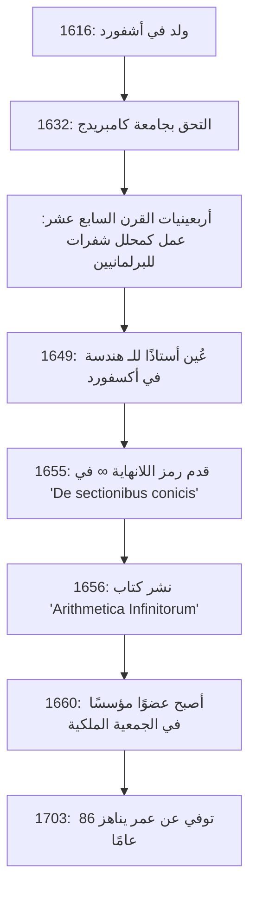

## مقدمة: عبقري القرن السابع عشر الذي رمز إلى اللانهاية

رمز **اللانهاية** ( $\infty$ ) هو شيء نصادفه بانتظام. أول شخص أدخل هذا الرمز الجميل والغامض إلى عالم الرياضيات كان عالم الرياضيات الإنجليزي في القرن السابع عشر **[جون واليس](https://kenji.blog/ar/p/wallis/)** (1616–1703). يُعرف كشخصية لعبت دورًا مهمًا للغاية في تاريخ الرياضيات، حيث قام بربط الهندسة التحليلية ل[رينيه ديكارت](https://kenji.blog/ar/p/descartes/) وحساب التفاضل والتكامل ل[إسحاق نيوتن](https://kenji.blog/ar/p/newton/).

كانت أوروبا في القرن السابع عشر عصر "الثورة العلمية"، حيث كان شخصيات مثل جاليليو جاليلي، ويوهانس كيبلر، و[رينيه ديكارت](https://kenji.blog/ar/p/descartes/) يبنون أسس العلوم والرياضيات الحديثة. وسط هذا، كسر واليس قيود الهندسة اليونانية الكلاسيكية وفتح حدودًا جديدة في الرياضيات من خلال إدخال الأساليب الجبرية والتحليلية في الهندسة. في هذا المقال، نتعمق في حياة واليس المضطربة، من خلفيته الفريدة كمحلل شفرات إلى إنجازاته الرياضية والفيزيائية التي أثرت بشكل كبير على الأجيال القادمة.

## الحياة المبكرة والتعليم: الطريق إلى الطب والمنطق واللاهوت

ولد [جون واليس](https://kenji.blog/ar/p/wallis/) في 23 نوفمبر 1616 في أشفورد، كينت، إنجلترا. كان والده قسيس أبرشية محترم، وكان من المتوقع في البداية أن يتبع واليس نفسه طريقًا كرجل دين. لتجنب تفشي الطاعون في طفولته، انتقل إلى مدرسة في تينتردين، ولاحقًا أتقن اللغات الكلاسيكية مثل اللاتينية واليونانية والعبرية في مدرسة فيلستيد في إسكس.

في عام 1632، التحق بكلية إيمانويل، جامعة كامبريدج. في كامبريدج في ذلك الوقت، لم تكن الرياضيات تُعتبر تخصصًا أكاديميًا رئيسيًا؛ بل كانت تُعتبر مجرد مهارة عملية أو حسابية للتجار. لذلك، كان لديه هو نفسه اهتمام قوي بالطب والتشريح والمنطق واللاهوت. استلهم بشكل خاص من نظرية الدورة الدموية لوليام هارفي، وحقق درجات ممتازة في مجال التشريح. أما بالنسبة للرياضيات، فلم يتعلم سوى بعض الحساب من أخيه الأكبر خلال طفولته، وسيمر بعض الوقت قبل أن ينغمس بجدية في الرياضيات.

بعد حصوله على درجة الماجستير في عام 1640، واصل واليس طريقه كرجل دين، حيث عمل كقسيس في أماكن مثل لندن. خلال هذه الفترة، شارك أيضًا في نزاعات لاهوتية، وزرع مهارات التفكير المنطقي والدقيق لديه.

## الحرب الأهلية الإنجليزية والنشاط كمحلل شفرات

في أربعينيات القرن السابع عشر، اجتاحت إنجلترا **الثورة البيوريتانية** (الحرب الأهلية الإنجليزية)، وهي حرب بين الملكيين الذين دعموا الملك تشارلز الأول والبرلمانيين الذين دعموا البرلمان. بناءً على معتقداته السياسية والدينية، انتمى واليس إلى الفصيل البرلماني، وهنا حدثت نقطة تحول كبرى في حياته. كان يمتلك موهبة فريدة في فك تشفير رسائل العدو المشفرة.

ذات يوم، وقعت وثيقة تشفير ملكية في أيدي البرلمانيين. تمكن واليس من فك تشفير الوثيقة، التي لم يستطع أحد آخر فهمها، في غضون بضع ساعات فقط. بفضل هذا الإنجاز، أصبح يحظى بتقدير كبير كمحلل شفرات رسمي للفصيل البرلماني.

ازدهر التفكير المنطقي والمهارات التحليلية لواليس بشكل كبير في مجال التشفير. واصل فك الشفرات الملكية المعقدة وساهم بشكل كبير في انتصار البرلمانيين. من خلال هذه التجربة في التشفير، قام بتحسين قدرته الرياضية بشكل كبير لاكتشاف الأنماط المعقدة ومعالجة الرموز المجردة. أدت القدرة على الرؤية من خلال قواعد الشفرات مباشرة إلى قدرته اللاحقة على إيجاد الانتظام الجبري في الرياضيات. لا شك أن تجاربه خلال هذه الفترة أصبحت الأساس لإنجازاته الرياضية اللاحقة.

## تعيين غير مسبوق كأستاذ سافيلي للهندسة في أكسفورد

مع اقتراب الحرب الأهلية من نهايتها وأخذ البرلمانيين زمام المبادرة، تم تقييم واليس، الذي ساهم في النظام، بشكل كبير. في عام 1649، تم تعيينه كـ **أستاذ سافيلي للهندسة** في جامعة أكسفورد.

أثار هذا التعيين مفاجأة كبيرة للمثقفين في ذلك الوقت. كان هذا لأن واليس لم ينشر أي ورقة بحثية رياضية جادة قبل ذلك الحين، وكانت سمعته كعالم رياضيات شبه معدومة. ومع ذلك، فقد ظل في هذا المنصب لأكثر من نصف قرن حتى وفاته عن عمر يناهز 86 عامًا، مما حول أكسفورد إلى أحد المراكز الرائدة في أوروبا للبحوث الرياضية.

شارك واليس أيضًا بنشاط في تجمعات العلماء في لندن ("الكلية غير المرئية") وساهم بشكل كبير كأحد الأعضاء المؤسسين في إنشاء **الجمعية الملكية** في عام 1660. كانت الجمعية الملكية ستلعب دورًا مركزيًا في تطوير العلوم الحديثة.

يوضح الشكل أدناه جدولًا زمنيًا للأحداث الكبرى في حياة واليس.

## الإنجازات الكبرى في الرياضيات: جبرنة الهندسة وتحدي اللانهاية

بعد تولي كرسي سافيلي، قدم واليس أبحاثه الرياضية بوتيرة مذهلة. كان أعظم إنجازاته هو الانفصال عن الأساليب الهندسية الكلاسيكية وتعزيز طرق الهندسة التحليلية لديكارت.

### إدخال رمز اللانهاية ' $\infty$ ' و 'De sectionibus conicis'

من أشهر مساهمات واليس أنه كان أول من استخدم ' $\infty$ ' كرمز للانهاية في كتابه "De sectionibus conicis" (رسالة في القطوع المخروطية)، الذي نُشر في عام 1655.

حتى ذلك الحين، كانت القطوع المخروطية (القطع الناقص، القطع المكافئ، القطع الزائد) تُعامل من منظور الهندسة الفراغية، بالمعنى الحرفي للكلمة على أنها المقاطع العرضية عندما يتم قطع المخروط بواسطة مستوى. ومع ذلك، أعاد واليس تعريفها كمعادلات جبرية (منحنيات تربيعية) باستخدام الإحداثيات على مستوى. في هذا النهج الرائد، أُجبر على التعامل مع مفهوم "الاستمرار اللانهائي" في الصيغ الرياضية، وبالتالي قدم رمز ' $\infty$ '.

هناك نظريات مختلفة حول أصل هذا الرمز، بما في ذلك نظرية أنه اشتق من "CIƆ"، الذي يمثل الرقم الروماني 1000، وأخرى تقول إنه يأتي من الحرف اليوناني أوميغا، ' $\omega$ '، الحرف الأخير من الأبجدية. على أي حال، من خلال إعطاء رمز واضح للمفهوم المجرد للانهاية وجعله موضوعًا للمعالجة الجبرية، تطورت الرياضيات اللاحقة بشكل كبير.

### 'Arithmetica Infinitorum' والطريق إلى حساب التفاضل والتكامل

تُعتبر تحفته الفنية، "Arithmetica Infinitorum" (حساب اللانهائيات)، التي نُشرت في عام 1656، أعظم إنجازاته وواحدة من أهم الأعمال في تاريخ حساب التفاضل والتكامل.

في هذا العمل، طور واليس "طريقة غير القابلين للتجزئة" (طريقة للنظر إلى الشكل على أنه مجموعة من الخطوط أو الأسطح الرقيقة اللانهائية) ليوهانس كيبلر وبونافينتورا كافاليري، حيث قدم طريقة ثورية لإيجاد المساحة المحصورة بمنحنى (التكامل) باستخدام متسلسلة لانهائية. في حين أن طريقة كافاليري كانت هندسية، فإن طريقة واليس كانت جبرية وتحليلية للغاية.

باستخدام الاستدلال الاستقرائي، استنتج صيغة التكامل التالية (بالتدوين الحديث):

$$
\int_{0}^{1} x^p \, dx = \frac{1}{p+1}
$$

في البداية، لم تُثبت هذه الصيغة إلا عندما كان $p$ عددًا صحيحًا موجبًا. لكن جرأة واليس تكمن في تكهنه (الاستيفاء) بأن **هذا القانون يجب أن يظل ساريًا حتى بالنسبة للكسور أو الأعداد السالبة**.

علاوة على ذلك، قام بتنظيم مفاهيم الأسس السالبة والكسرية، مما وسع بشكل كبير القوة التعبيرية للجبر. على سبيل المثال، تم تعميم التدوينات مثل $x^{-n} = \frac{1}{x^n}$ و $x^{1/n} = \sqrt[n]{x}$ من قبله وأصبحت أساس اللغة الرياضية التي نستخدمها بشكل طبيعي اليوم.

### منتج واليس (حاصل ضرب غير نهائي لباي)

في "Arithmetica Infinitorum"، تصدى واليس للمشكلة الصعبة المتمثلة في حساب مساحة الدائرة (أي التكامل $\int_{0}^{1} \sqrt{1-x^2} \, dx$). ولأنه لم يستطع دمجها بشكل مباشر، فقد استخدم طريقة أصلية للغاية وهي "الاستيفاء" بين القيم التكاملية للدوال المعروفة.

في نهاية حساباته المعقدة، كان ما استنتجه هو صيغة جميلة تعبر عن الثابت الدائري $\pi$ كحاصل ضرب غير نهائي، يُعرف باسم **منتج واليس**.

$$
\frac{\pi}{2} = \prod_{n=1}^{\infty} \frac{4n^2}{4n^2 - 1} = \frac{2}{1} \cdot \frac{2}{3} \cdot \frac{4}{3} \cdot \frac{4}{5} \cdot \frac{6}{5} \cdot \frac{6}{7} \cdots
$$

أثبتت هذه الصيغة أن الرقم المتسامي $\pi$ يمكن التعبير عنه باستخدام الضرب اللانهائي للأرقام المنطقية البسيطة فقط، دون استخدام أرقام غير منطقية أو جذور تربيعية على الإطلاق، مما أحدث صدمة هائلة في عالم الرياضيات في ذلك الوقت. أظهر هذا الاكتشاف للعالم قوة المتسلسلات اللانهائية والمنتجات اللانهائية.

## المساهمات في الفيزياء واللغويات والتعليم

لم يتوقف عقل واليس اللامع في مجال الرياضيات البحتة.

### صياغة قانون حفظ الزخم

في عام 1668، عندما سعت الجمعية الملكية علنًا إلى أوراق بحثية حول "قوانين تصادم الأجسام"، قدم واليس حلاً مع كريستوفر رين وكريستيان هويجنز. اعتبر واليس الاصطدامات غير المرنة (حيث تلتصق الأجسام عند الاصطدام) وصاغ بشكل رياضي ودقيق **قانون حفظ الزخم**، الذي ينص على أن مجموع الزخم محفوظ قبل وبعد الاصطدام. كان هذا إنجازًا مهمًا للغاية في الفيزياء والذي أصبح أساس الميكانيكا النيوتونية اللاحقة.

### كتاب القواعد الإنجليزية وتعليم الصم

كان اهتمامه باللغة عميقًا أيضًا؛ في عام 1653، نشر كتاب "Grammatica Linguae Anglicanae" (قواعد اللغة الإنجليزية). يشرح هذا الكتاب، المكتوب باللغة اللاتينية، منطقيًا بنية اللغة الإنجليزية للأجانب وتم استخدامه ككتاب مدرسي قياسي لسنوات عديدة.

علاوة على ذلك، كان واليس يمتلك معرفة عميقة بعلم الصوتيات وقام بمحاولة رائدة لتعليم الكلام للصم والبكم. من خلال تطبيق معرفته اللغوية والصوتية، نجح في جعل الشباب الصم يتحدثون. فيما يتعلق بهذا الإنجاز، نشأ نزاع شرس حول الأولوية بينه وبين ويليام هولدر، الذي كان يقوم أيضًا بتعليم الصم.

## جدل عنيف مع توماس هوبز

من الضروري لرواية قصة حياة واليس نزاعه الطويل الأمد والمكثف مع الفيلسوف **توماس هوبز**.

ادعى هوبز أنه حل "مشكلة تربيع الدائرة" (مشكلة بناء مربع بنفس مساحة دائرة معينة باستخدام المسطرة والفرجار فقط). في الرياضيات الحديثة، ثبت أن تربيع الدائرة مستحيل لأن $\pi$ رقم متسامي، ولكن في ذلك الوقت كان لا يزال دون حل.

كعالم رياضيات متميز، رأى واليس على الفور الأخطاء في إثبات هوبز الهندسي وانتقده بلا رحمة. تمرد هوبز ضد هذا، وتصاعد الجدل إلى ما هو أبعد من مجال الرياضيات البحتة إلى السياسة والدين والافتراء الشخصي. استمر هذا النزاع لمدة ربع قرن حتى وفاة هوبز، ويُعرف كحلقة توضح شخصية واليس التي لا تتنازل والصارمة.

## تأثير هائل على الشاب [إسحاق نيوتن](https://kenji.blog/ar/p/newton/)

كان لعمل واليس "Arithmetica Infinitorum" تأثير لا يقاس على شاب معين سيقلب فيما بعد تاريخ العلوم رأسًا على عقب بشكل أساسي. كان هذا الشاب هو **[إسحاق نيوتن](https://kenji.blog/ar/p/newton/)**.

خلال أيام دراسته في جامعة كامبريدج، قرأ نيوتن بعناية "Arithmetica Infinitorum" لواليس وأعجب به بشدة. من خلال تعميم وتوسيع طريقة الاستيفاء لواليس بشكل أكبر، اكتشف نيوتن **نظرية ذات الحدين المعممة** لأي قوة عقلانية. علاوة على ذلك، من خلال تقديم المفهوم الجبري للنهايات لواليس، وصل أخيرًا إلى تأسيس **حساب التفاضل والتكامل**.

لو لم يكن "Arithmetica Infinitorum" لواليس موجودًا، لربما تأخر اكتشاف نيوتن لحساب التفاضل والتكامل بشكل كبير، أو لربما اتخذ شكلاً مختلفًا تمامًا.

أشاد واليس نفسه بموهبة نيوتن الاستثنائية وحثه بشدة على نشر نتائج أبحاثه حول حساب التفاضل والتكامل. لاحقًا، عندما اندلع النزاع الشرس حول "أولوية حساب التفاضل والتكامل" بين نيوتن وجوتفريد لايبنيز، دعم واليس نيوتن بالكامل كمدافع قوي عن الجانب البريطاني.

## الخاتمة: جسر عظيم في تاريخ الرياضيات

استمر [جون واليس](https://kenji.blog/ar/p/wallis/) في نشاطه كباحث رائد حتى وفاته في عام 1703 عن عمر يناهز 86 عامًا.

لقد لعب دورًا حاسمًا كـ **جسر** في الفترة الانتقالية من الهندسة التي تتمحور حول الأشكال، والتي استمرت منذ اليونان القديمة، إلى التحليل الحديث، الذي يتلاعب بالصيغ الرياضية بحرية. قوة التفكير المنطقي التي تمت زراعتها من خلال التشفير والقوة الخيالية لتقديم تخمينات جريئة في مناطق مجهولة. إنجازاته، التي ولدت من اندماج هذه العناصر، ورثها الجيل التالي من العباقرة مثل نيوتن وتستمر في العيش اليوم كأساس للرياضيات والعلوم الحديثة.

عندما نرسم الرمز ' $\infty$ ' عرضًا، فإنه يحفر بداخله أنفاس الفكر العظيم، [جون واليس](https://kenji.blog/ar/p/wallis/)، الذي نجا من القرن السابع عشر المضطرب وأدخل مبضع المنطق في المجال الإلهي للانهاية.
