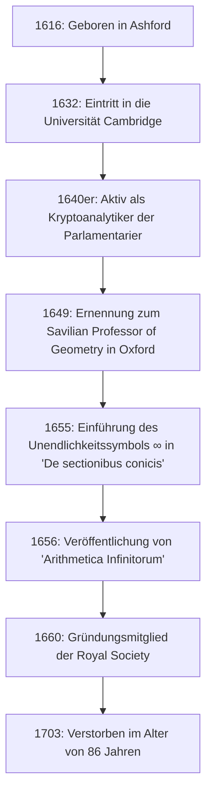

## Einleitung: Das Genie des 17. Jahrhunderts, das die Unendlichkeit symbolisierte

Das Symbol für die **Unendlichkeit** ( $\infty$ ) begegnet uns regelmäßig. Die erste Person, die dieses wunderschöne und mysteriöse Symbol in die Welt der Mathematik einführte, war der englische Mathematiker **[John Wallis](https://kenji.blog/de/p/wallis/)** (1616–1703) aus dem 17. Jahrhundert. Er ist bekannt als eine Figur, die eine äußerst wichtige Rolle in der Geschichte der Mathematik spielte und eine Brücke zwischen der analytischen Geometrie von [René Descartes](/de/p/descartes/) und der Infinitesimalrechnung von [Isaac Newton](https://kenji.blog/de/p/newton/) schlug.

Europa im 17. Jahrhundert erlebte die Ära der „Wissenschaftlichen Revolution“, in der Persönlichkeiten wie Galileo Galilei, Johannes Kepler und [René Descartes](https://kenji.blog/de/p/descartes/) die Grundlagen der modernen Wissenschaft und Mathematik schufen. In dieser Zeit durchbrach Wallis die Grenzen der klassischen griechischen Geometrie und eröffnete eine neue Grenze in der Mathematik, indem er algebraische und analytische Methoden in die Geometrie einführte. In diesem Artikel tauchen wir tief in das turbulente Leben von [Wallis](https://kenji.blog/de/p/wallis/) ein, von seinem einzigartigen Hintergrund als Kryptoanalytiker bis hin zu seinen mathematischen und physikalischen Errungenschaften, die spätere Generationen stark beeinflusst haben.

## Frühes Leben und Bildung: Der Weg zu Medizin, Logik und Theologie

[John Wallis](https://kenji.blog/de/p/wallis/) wurde am 23. November 1616 in Ashford in der englischen Grafschaft Kent geboren. Sein Vater war ein angesehener Gemeindepfarrer, und auch von [Wallis](https://kenji.blog/de/p/wallis/) selbst wurde anfangs erwartet, dass er eine Laufbahn als Geistlicher einschlagen würde. Um einem Pestausbruch in seiner Kindheit zu entgehen, wechselte er an eine Schule in Tenterden und lernte später an der Felsted School in Essex klassische Sprachen wie Latein, Griechisch und Hebräisch.

Im Jahr 1632 trat er in das Emmanuel College der Universität Cambridge ein. In Cambridge wurde Mathematik zu dieser Zeit nicht als wichtiges akademisches Fach angesehen; sie galt lediglich als praktische Fertigkeit oder als Rechnen für Kaufleute. Daher hatte er selbst ein starkes Interesse an Medizin, Anatomie, Logik und Theologie. Besonders inspiriert durch William Harveys Theorie des Blutkreislaufs, erzielte er hervorragende Noten im Bereich der Anatomie. Was die Mathematik betrifft, so hatte er in seiner Kindheit lediglich etwas Rechnen von seinem älteren Bruder gelernt, und es sollte noch etwas dauern, bis er sich ernsthaft mit der Mathematik beschäftigte.

Nachdem er 1640 seinen Master-Abschluss erworben hatte, verfolgte [Wallis](https://kenji.blog/de/p/wallis/) seinen Weg als Geistlicher und arbeitete unter anderem in London als Pfarrer. In dieser Zeit beteiligte er sich auch an theologischen Disputen und kultivierte seine logischen und präzisen Denkfähigkeiten.

## Der Englische Bürgerkrieg und die Tätigkeit als Kryptoanalytiker

In den 1640er Jahren wurde England in die **Puritanische Revolution** (den Englischen Bürgerkrieg) verwickelt, einen Krieg zwischen den Royalisten, die König Karl I. unterstützten, und den Parlamentariern, die das Parlament unterstützten. Aufgrund seiner politischen und religiösen Überzeugungen gehörte [Wallis](https://kenji.blog/de/p/wallis/) der Fraktion der Parlamentarier an, und hier ereignete sich ein großer Wendepunkt in seinem Leben. Er besaß ein einzigartiges Talent zum Entschlüsseln der chiffrierten Briefe des Feindes.

Eines Tages fiel den Parlamentariern ein kryptografisches Dokument der Royalisten in die Hände. [Wallis](https://kenji.blog/de/p/wallis/) schaffte es, das Dokument, das niemand sonst entziffern konnte, in nur wenigen Stunden zu entschlüsseln. Aufgrund dieser Leistung wurde er als offizieller Kryptoanalytiker der Fraktion der Parlamentarier hochgeschätzt.

[Wallis](https://kenji.blog/de/p/wallis/)' logisches Denken und seine analytischen Fähigkeiten entfalteten sich auf dem Gebiet der Kryptografie enorm. Er dechiffrierte kontinuierlich komplexe Codes der Royalisten und trug wesentlich zum Sieg der Parlamentarier bei. Durch diese Erfahrung in der Kryptografie verbesserte er drastisch seine mathematische Fähigkeit, komplexe Muster zu entdecken und abstrakte Symbole zu manipulieren. Die Fähigkeit, die Regeln von Codes zu durchschauen, führte direkt zu seiner späteren Fähigkeit, algebraische Regelmäßigkeiten in der Mathematik zu finden. Es besteht kein Zweifel daran, dass seine Erfahrungen in dieser Zeit das Fundament für seine späteren mathematischen Errungenschaften bildeten.

## Beispiellose Ernennung zum Savilian Professor of Geometry in Oxford

Als sich der Bürgerkrieg dem Ende zuneigte und die Parlamentarier die Initiative ergriffen, wurde [Wallis](https://kenji.blog/de/p/wallis/), der zum Regime beigetragen hatte, hoch geschätzt. Im Jahr 1649 wurde er zum **Savilian Professor of Geometry** an der Universität Oxford ernannt.

Diese Ernennung sorgte bei den Intellektuellen der damaligen Zeit für große Überraschung. Das lag daran, dass [Wallis](https://kenji.blog/de/p/wallis/) zuvor noch nie eine ernsthafte mathematische Forschungsarbeit veröffentlicht hatte und sein Ruf als Mathematiker praktisch nicht existierte. Er blieb jedoch mehr als ein halbes Jahrhundert lang in dieser Position, bis er im Alter von 86 Jahren verstarb, und verwandelte Oxford in eines der führenden europäischen Zentren für mathematische Forschung.

[Wallis](https://kenji.blog/de/p/wallis/) nahm auch aktiv an Zusammenkünften von Wissenschaftlern in London (dem "Invisible College") teil und trug als eines der Gründungsmitglieder maßgeblich zur Gründung der **Royal Society** im Jahr 1660 bei. Die Royal Society sollte eine zentrale Rolle in der Entwicklung der modernen Wissenschaft spielen.

Die folgende Abbildung zeigt eine Zeitleiste der wichtigsten Ereignisse in [Wallis](https://kenji.blog/de/p/wallis/)' Leben.

## Wichtige Errungenschaften in der Mathematik: Die Algebraisierung der Geometrie und die Herausforderung der Unendlichkeit

Nachdem er den savilianischen Lehrstuhl übernommen hatte, trieb [Wallis](https://kenji.blog/de/p/wallis/) seine mathematischen Forschungen in einem erstaunlichen Tempo voran. Seine größte Errungenschaft bestand darin, sich von klassischen geometrischen Methoden zu lösen und [Descartes](https://kenji.blog/de/p/descartes/)' Methoden der analytischen Geometrie weiterzuentwickeln.

### Einführung des Unendlichkeitssymbols ' $\infty$ ' und 'De sectionibus conicis'

Einer von [Wallis](https://kenji.blog/de/p/wallis/)' berühmtesten Beiträgen ist, dass er in seinem 1655 veröffentlichten Buch „De sectionibus conicis“ (Abhandlung über Kegelschnitte) als Erster ' $\infty$ ' als Symbol für die Unendlichkeit verwendete.

Bis dahin wurden Kegelschnitte (Ellipse, Parabel, Hyperbel) aus der Perspektive der Raumgeometrie behandelt, buchstäblich als die Querschnitte, wenn ein Kegel von einer Ebene geschnitten wird. [Wallis](https://kenji.blog/de/p/wallis/) definierte sie jedoch als algebraische Gleichungen (quadratische Kurven) unter Verwendung von Koordinaten auf einer Ebene neu. Bei diesem bahnbrechenden Ansatz war er gezwungen, das Konzept des „unendlichen Fortschreitens“ in mathematischen Formeln zu handhaben, und führte daher das Symbol ' $\infty$ ' ein.

Es gibt verschiedene Theorien über den Ursprung dieses Symbols, darunter die, dass es von „CIƆ“ abgeleitet wurde, was die römische Zahl 1000 darstellt, und eine andere, dass es vom griechischen Buchstaben Omega, ' $\omega$ ', dem letzten Buchstaben des Alphabets, stammt. Wie dem auch sei, indem er dem abstrakten Konzept der Unendlichkeit ein klares Symbol gab und es zu einem Objekt algebraischer Manipulation machte, entwickelte sich die nachfolgende Mathematik erheblich weiter.

### 'Arithmetica Infinitorum' und der Weg zur Infinitesimalrechnung

Sein Hauptwerk „Arithmetica Infinitorum“ (Die Arithmetik der Infinitesimalen), veröffentlicht 1656, gilt als sein größtes Meisterwerk und als eines der wichtigsten Werke in der Geschichte der Infinitesimalrechnung.

In diesem Werk entwickelte [Wallis](https://kenji.blog/de/p/wallis/) die „Methode der Indivisiblen“ (eine Methode, bei der eine Figur als eine Ansammlung unendlich dünner Linien oder Flächen betrachtet wird) von Johannes Kepler und Bonaventura Cavalieri weiter und präsentierte eine revolutionäre Methode zur Bestimmung der von einer Kurve begrenzten Fläche (Integration) unter Verwendung unendlicher Reihen. Während Cavalieris Methode geometrisch war, war [Wallis](https://kenji.blog/de/p/wallis/)' Methode extrem algebraisch und analytisch.

Mit Hilfe von induktiven Schlussfolgerungen leitete er die folgende Integrationsformel (in moderner Notation) ab:

$$
\int_{0}^{1} x^p \, dx = \frac{1}{p+1}
$$

Anfangs war diese Formel nur bewiesen, wenn $p$ eine positive ganze Zahl war. Aber [Wallis](https://kenji.blog/de/p/wallis/)' Kühnheit lag in seiner Spekulation (Interpolation), dass **dieses Gesetz auch für Brüche oder negative Zahlen gelten müsse**.

Darüber hinaus systematisierte er die Konzepte von negativen und gebrochenen Exponenten und erweiterte damit die Ausdruckskraft der Algebra dramatisch. Beispielsweise wurden Schreibweisen wie $x^{-n} = \frac{1}{x^n}$ und $x^{1/n} = \sqrt[n]{x}$ von ihm generalisiert und wurden zur Grundlage der mathematischen Sprache, die wir heute selbstverständlich verwenden.

### Das [Wallis](https://kenji.blog/de/p/wallis/)-Produkt (Unendliches Produkt für Pi)

In der „Arithmetica Infinitorum“ nahm sich [Wallis](https://kenji.blog/de/p/wallis/) des schwierigen Problems an, die Fläche eines Kreises zu berechnen (d. h. das Integral $\int_{0}^{1} \sqrt{1-x^2} \, dx$). Da er dies nicht direkt integrieren konnte, verwendete er eine höchst originelle Methode der „Interpolation“ zwischen den Integralwerten bekannter Funktionen.

Am Ende seiner komplexen Berechnungen leitete er eine wunderschöne Formel ab, die die Kreiszahl $\pi$ als unendliches Produkt ausdrückt, bekannt als das **[Wallis](https://kenji.blog/de/p/wallis/)-Produkt**.

$$
\frac{\pi}{2} = \prod_{n=1}^{\infty} \frac{4n^2}{4n^2 - 1} = \frac{2}{1} \cdot \frac{2}{3} \cdot \frac{4}{3} \cdot \frac{4}{5} \cdot \frac{6}{5} \cdot \frac{6}{7} \cdots
$$

Diese Formel demonstrierte, dass die transzendente Zahl $\pi$ ausschließlich durch die unendliche Multiplikation einfacher rationaler Zahlen ausgedrückt werden konnte, ohne überhaupt irrationale Zahlen oder Quadratwurzeln zu verwenden, was der mathematischen Welt der damaligen Zeit einen massiven Schock versetzte. Diese Entdeckung zeigte der Welt die Macht unendlicher Reihen und unendlicher Produkte.

## Beiträge zur Physik, Linguistik und Bildung

[Wallis](https://kenji.blog/de/p/wallis/)' brillanter Verstand machte nicht vor dem Reich der reinen Mathematik halt.

### Formulierung des Gesetzes von der Erhaltung des Impulses

Als die Royal Society 1668 öffentlich Arbeiten zu den „Gesetzen des Zusammenstoßes von Körpern“ suchte, reichte [Wallis](https://kenji.blog/de/p/wallis/) zusammen mit Christopher Wren und Christiaan Huygens eine Lösung ein. [Wallis](https://kenji.blog/de/p/wallis/) betrachtete unelastische Stöße (bei denen Körper beim Zusammenstoß aneinanderhaften) und formulierte das **Gesetz von der Erhaltung des Impulses**, das besagt, dass die Summe des Impulses vor und nach einem Stoß erhalten bleibt, mathematisch und streng. Dies war eine äußerst wichtige Errungenschaft in der Physik, die zur Grundlage der späteren Newtonschen Mechanik werden sollte.

### Englisches Grammatikbuch und Taubstummenbildung

Sein Interesse an Sprache war ebenfalls tief; 1653 veröffentlichte er die „Grammatica Linguae Anglicanae“ (Grammatik der englischen Sprache). Dieses auf Latein verfasste Buch erklärte logisch die Struktur des Englischen für Ausländer und wurde viele Jahre lang als Standardlehrbuch verwendet.

Darüber hinaus besaß [Wallis](https://kenji.blog/de/p/wallis/) profunde Kenntnisse der Phonetik und unternahm den bahnbrechenden Versuch, Taubstummen das Sprechen beizubringen. Indem er seine eigenen linguistischen und phonetischen Kenntnisse anwandte, gelang es ihm, junge gehörlose Menschen zum Sprechen zu bringen. In Bezug auf diese Leistung entbrannte ein erbitterter Prioritätsstreit zwischen ihm und William Holder, der ebenfalls Gehörlose unterrichtete.

## Erbitterte Kontroverse mit Thomas Hobbes

Wesentlich, um die Geschichte von [Wallis](https://kenji.blog/de/p/wallis/)' Leben zu erzählen, ist sein langjähriger, intensiver Streit mit dem Philosophen **Thomas Hobbes**.

Hobbes behauptete, das „Problem der Quadratur des Kreises“ (das Problem, nur mit Zirkel und Lineal ein Quadrat mit der gleichen Fläche wie ein gegebener Kreis zu konstruieren) gelöst zu haben. In der modernen Mathematik ist bewiesen, dass die Quadratur des Kreises unmöglich ist, weil $\pi$ eine transzendente Zahl ist, aber damals war es noch ungelöst.

Als herausragender Mathematiker durchschaute [Wallis](https://kenji.blog/de/p/wallis/) sofort die Fehler in Hobbes' geometrischem Beweis und kritisierte ihn gnadenlos. Hobbes rebellierte dagegen, und die Kontroverse eskalierte über den Bereich der reinen Mathematik hinaus in Politik, Religion und persönliche Verleumdung. Dieser Streit dauerte ein Vierteljahrhundert an, bis Hobbes starb, und ist als eine Episode bekannt, die [Wallis](https://kenji.blog/de/p/wallis/)' kompromisslosen und strengen Charakter illustriert.

## Enormer Einfluss auf den jungen [Isaac Newton](https://kenji.blog/de/p/newton/)

[Wallis](https://kenji.blog/de/p/wallis/)' „Arithmetica Infinitorum“ hatte eine unermessliche Wirkung auf einen bestimmten jungen Mann, der später die Geschichte der Wissenschaft grundlegend umwälzen sollte. Dieser junge Mann war **[Isaac Newton](https://kenji.blog/de/p/newton/)**.

Während seiner Studentenzeit an der Universität Cambridge las Newton [Wallis](https://kenji.blog/de/p/wallis/)' „Arithmetica Infinitorum“ aufmerksam und war zutiefst beeindruckt. Durch weitere Verallgemeinerung und Erweiterung von Wallis' Interpolationsmethode entdeckte Newton den **verallgemeinerten binomischen Lehrsatz** für jede rationale Potenz. Darüber hinaus gelangte er, indem er [Wallis](https://kenji.blog/de/p/wallis/)' algebraisches Konzept der Grenzwerte vorantrieb, schließlich zur Begründung der **Infinitesimalrechnung**.

Hätte [Wallis](https://kenji.blog/de/p/wallis/)' „Arithmetica Infinitorum“ nicht existiert, hätte sich Newtons Entdeckung der Infinitesimalrechnung möglicherweise erheblich verzögert, oder sie hätte eine völlig andere Form angenommen.

[Wallis](https://kenji.blog/de/p/wallis/) selbst lobte Newtons außergewöhnliches Talent in höchsten Tönen und drängte ihn nachdrücklich, seine Forschungsergebnisse zur Infinitesimalrechnung zu veröffentlichen. Später, als der erbitterte Streit um die „Priorität der Infinitesimalrechnung“ zwischen Newton und [Gottfried Leibniz](/de/p/leibniz/) ausbrach, unterstützte [Wallis](https://kenji.blog/de/p/wallis/) Newton als mächtiger Fürsprecher der britischen Seite voll und ganz.

## Fazit: Eine große Brücke in der Geschichte der Mathematik

[John Wallis](https://kenji.blog/de/p/wallis/) war bis zu seinem Tod 1703 im Alter von 86 Jahren als führender Gelehrter aktiv.

Er spielte eine entscheidende Rolle als **Brücke** in der Übergangszeit von der figurenzentrierten Geometrie, die sich seit dem antiken Griechenland fortgesetzt hatte, zur modernen Analysis, die mathematische Formeln frei manipuliert. Die durch die Kryptografie kultivierte logische Argumentationskraft und die Vorstellungskraft, in unbekannten Territorien kühne Vermutungen anzustellen. Seine Errungenschaften, die aus der Verschmelzung dieser Elemente entstanden, wurden von der nächsten Generation von Genies wie Newton geerbt und leben bis heute als Fundament der modernen Mathematik und Wissenschaft weiter.

Wenn wir beiläufig das Symbol ' $\infty$ ' zeichnen, ist darin der Atem eines großen Intellekts, [John Wallis](https://kenji.blog/de/p/wallis/), eingraviert, der das turbulente 17. Jahrhundert überlebte und das Skalpell der Logik in das göttliche Reich der Unendlichkeit einführte.
