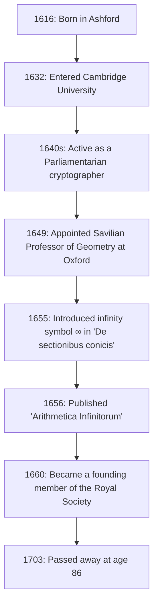

## Introduction: The 17th-Century Genius Who Symbolized Infinity

The **infinity** ( $\infty$ ) symbol is something we encounter regularly. The first person to introduce this beautiful and mysterious symbol into the world of mathematics was the 17th-century English mathematician **[John Wallis](https://kenji.blog/en/p/wallis/)** (1616–1703). He is known as a figure who played an extremely important role in the history of mathematics, bridging [René Descartes](/en/p/descartes/)'s analytical geometry and [Isaac Newton](https://kenji.blog/en/p/newton/)'s calculus.

17th-century Europe was the era of the "Scientific Revolution," where figures like Galileo Galilei, Johannes Kepler, and [René Descartes](https://kenji.blog/en/p/descartes/) were building the foundations of modern science and mathematics. Amidst this, Wallis broke through the limitations of classical Greek geometry and opened a new frontier in mathematics by introducing algebraic and analytical methods into geometry. In this article, we delve deeply into [Wallis](https://kenji.blog/en/p/wallis/)'s turbulent life, from his unique background as a cryptographer to his mathematical and physical achievements that greatly influenced future generations.

## Early Life and Education: The Path to Medicine, Logic, and Theology

[John Wallis](https://kenji.blog/en/p/wallis/) was born on November 23, 1616, in Ashford, Kent, England. His father was a respected parish minister, and [Wallis](https://kenji.blog/en/p/wallis/) himself was initially expected to pursue a path as a clergyman. To avoid an outbreak of the plague in his childhood, he moved to a school in Tenterden, and later mastered classical languages such as Latin, Greek, and Hebrew at Felsted School in Essex.

In 1632, he entered Emmanuel College, Cambridge University. At Cambridge at the time, mathematics was not emphasized as a major academic discipline; it was considered merely a practical skill or arithmetic for merchants. Therefore, he himself had a strong interest in medicine, anatomy, logic, and theology. Inspired particularly by William Harvey's theory of blood circulation, he achieved excellent grades in the field of anatomy. As for mathematics, he had only learned some arithmetic from his older brother in his childhood, and it would be a little later before he seriously immersed himself in mathematics.

Having obtained his master's degree in 1640, [Wallis](https://kenji.blog/en/p/wallis/) proceeded on the path of a clergyman, working as a minister in places like London. During this period, he also participated in theological disputes, cultivating his logical and precise thinking skills.

## The English Civil War and Activity as a [Crypto](https://kenji.blog/en/p/cryptocurrency-and-bitcoin/)grapher

In the 1640s, England was engulfed in the **Puritan Revolution** (English Civil War), a war between the Royalists who supported King Charles I and the Parliamentarians who supported Parliament. Based on his political and religious beliefs, [Wallis](https://kenji.blog/en/p/wallis/) belonged to the Parliamentarian faction, and it was here that a major turning point in his life occurred. He possessed a unique talent for decrypting the encrypted letters of the enemy.

One day, a Royalist cryptographic document fell into Parliamentarian hands. [Wallis](https://kenji.blog/en/p/wallis/) managed to decrypt the document, which no one else could decipher, in just a few hours. Due to this achievement, he became highly valued as the official cryptographer of the Parliamentarian faction.

[Wallis](https://kenji.blog/en/p/wallis/)'s logical thinking and analytical skills blossomed greatly in the field of cryptography. He continuously deciphered complex Royalist codes and contributed significantly to the Parliamentarian victory. Through this experience in cryptography, he dramatically improved his mathematical ability to discover complex patterns and manipulate abstract symbols. The ability to see through the rules of codes directly led to his later ability to find algebraic regularities in mathematics. There is no doubt that his experiences during this period became the foundation for his later mathematical achievements.

## Unprecedented Appointment as Savilian Professor of Geometry at Oxford

As the civil war headed toward an end and the Parliamentarians took the initiative, [Wallis](https://kenji.blog/en/p/wallis/), who had contributed to the regime, was highly evaluated. In 1649, he was appointed as the **Savilian Professor of Geometry** at Oxford University.

This appointment brought great surprise to the intellectuals of the time. This was because [Wallis](https://kenji.blog/en/p/wallis/) had never published a serious mathematical research paper before then, and his reputation as a mathematician was practically nonexistent. However, he remained in this position for over half a century until he passed away at the age of 86, transforming Oxford into one of Europe's leading centers for mathematical research.

[Wallis](https://kenji.blog/en/p/wallis/) also actively participated in gatherings of scientists in London (the "Invisible College") and contributed greatly as one of the founding members to the establishment of the **Royal Society** in 1660. The Royal Society would come to play a central role in the development of modern science.

The figure below shows a timeline of the major events in [Wallis](https://kenji.blog/en/p/wallis/)'s life.

## Major Achievements in Mathematics: The Algebraization of Geometry and the Challenge of Infinity

Having taken up the Savilian chair, [Wallis](https://kenji.blog/en/p/wallis/) advanced his mathematical research at an astonishing pace. His greatest achievement was breaking away from classical geometric methods and further advancing [Descartes](https://kenji.blog/en/p/descartes/)'s methods of analytical geometry.

### Introduction of the Infinity Symbol ' $\infty$ ' and 'De sectionibus conicis'

One of [Wallis](https://kenji.blog/en/p/wallis/)'s most famous contributions is that he was the first to use ' $\infty$ ' as a symbol for infinity in his book "De sectionibus conicis" (Treatise on Conic Sections), published in 1655.

Until then, conic sections (ellipse, parabola, hyperbola) were treated from the perspective of solid geometry, literally as the cross-sections when a cone is cut by a plane. However, [Wallis](https://kenji.blog/en/p/wallis/) redefined them as algebraic equations (quadratic curves) using coordinates on a plane. In this groundbreaking approach, he was forced to handle the concept of "continuing infinitely" in mathematical formulas, and thus introduced the ' $\infty$ ' symbol.

There are various theories about the origin of this symbol, including one that it was derived from "CIƆ", which represents the Roman numeral 1000, and another that it comes from the Greek letter omega, ' $\omega$ ', the last letter of the alphabet. In any case, by giving a clear symbol to the abstract concept of infinity and making it an object of algebraic manipulation, subsequent mathematics developed significantly.

### 'Arithmetica Infinitorum' and the Path to Calculus

His magnum opus, "Arithmetica Infinitorum" (The Arithmetic of Infinitesimals), published in 1656, is considered his greatest masterpiece and one of the most important works in the history of calculus.

In this work, [Wallis](https://kenji.blog/en/p/wallis/) further developed the "method of indivisibles" (a method of viewing a figure as a collection of infinitely thin lines or surfaces) of Johannes Kepler and Bonaventura Cavalieri, presenting a revolutionary method for finding the area bounded by a curve (integration) using infinite series. While Cavalieri's method was geometric, [Wallis](https://kenji.blog/en/p/wallis/)'s method was extremely algebraic and analytical.

Using inductive reasoning, he derived the following integration formula (in modern notation):

$$
\int_{0}^{1} x^p \, dx = \frac{1}{p+1}
$$

Initially, this formula was only proven when $p$ was a positive integer. But [Wallis](https://kenji.blog/en/p/wallis/)'s boldness lay in his speculation (interpolation) that **this law should hold even for fractions or negative numbers**.

Furthermore, he systematized the concepts of negative and fractional exponents, dramatically expanding the expressive power of algebra. For example, notations such as $x^{-n} = \frac{1}{x^n}$ and $x^{1/n} = \sqrt[n]{x}$ were generalized by him and became the foundation of the mathematical language we naturally use today.

### The [Wallis](https://kenji.blog/en/p/wallis/) Product (Infinite Product for Pi)

In "Arithmetica Infinitorum," [Wallis](https://kenji.blog/en/p/wallis/) tackled the difficult problem of calculating the area of a circle (that is, the integral $\int_{0}^{1} \sqrt{1-x^2} \, dx$). Because he could not integrate it directly, he used a highly original method of "interpolating" between the integral values of known functions.

At the end of his complex calculations, what he derived was a beautiful formula expressing the circular constant $\pi$ as an infinite product, known as the **[Wallis](https://kenji.blog/en/p/wallis/) product**.

$$
\frac{\pi}{2} = \prod_{n=1}^{\infty} \frac{4n^2}{4n^2 - 1} = \frac{2}{1} \cdot \frac{2}{3} \cdot \frac{4}{3} \cdot \frac{4}{5} \cdot \frac{6}{5} \cdot \frac{6}{7} \cdots
$$

This formula demonstrated that the transcendental number $\pi$ could be expressed using solely the infinite multiplication of simple rational numbers, without using irrational numbers or square roots at all, which gave a massive shock to the mathematical world of the time. This discovery showed the world the power of infinite series and infinite products.

## Contributions to Physics, Linguistics, and Education

[Wallis](https://kenji.blog/en/p/wallis/)'s brilliant mind did not stop at the realm of pure mathematics.

### Formulation of the Law of Conservation of Momentum

In 1668, when the Royal Society publicly sought papers on the "laws of the collision of bodies," [Wallis](https://kenji.blog/en/p/wallis/) submitted a solution along with Christopher Wren and Christiaan Huygens. [Wallis](https://kenji.blog/en/p/wallis/) considered inelastic collisions (where bodies stick together upon collision) and mathematically and rigorously formulated the **law of conservation of momentum**, which states that the sum of momentum is conserved before and after a collision. This was an extremely important achievement in physics that would become the foundation of later Newtonian mechanics.

### English Grammar Book and Education for the Deaf

His interest in language was also deep; in 1653, he published "Grammatica Linguae Anglicanae" (Grammar of the English Language). Written in Latin, this book logically explained the structure of English for foreigners and was used as a standard textbook for many years.

Furthermore, [Wallis](https://kenji.blog/en/p/wallis/) possessed a deep knowledge of phonetics and undertook the groundbreaking attempt of teaching speech to deaf-mutes. Applying his own linguistic and phonetic knowledge, he succeeded in making young deaf people speak. Regarding this achievement, a fierce dispute over priority occurred between him and William Holder, who was also educating the deaf.

## Fierce Controversy with Thomas Hobbes

Essential to telling the story of [Wallis](https://kenji.blog/en/p/wallis/)'s life is his long-standing, intense dispute with the philosopher **Thomas Hobbes**.

Hobbes claimed to have solved the "problem of squaring the circle" (the problem of constructing a square with the same area as a given circle using only a straightedge and compass). In modern mathematics, it has been proven that squaring the circle is impossible because $\pi$ is a transcendental number, but at the time it was still unsolved.

As an outstanding mathematician, [Wallis](https://kenji.blog/en/p/wallis/) immediately saw through the errors in Hobbes's geometric proof and criticized him mercilessly. Hobbes rebelled against this, and the controversy escalated beyond the realm of pure mathematics into politics, religion, and personal slander. This dispute lasted for a quarter of a century until Hobbes passed away, and is known as an episode that illustrates [Wallis](https://kenji.blog/en/p/wallis/)'s uncompromising and strict character.

## Tremendous Influence on the Young [Isaac Newton](https://kenji.blog/en/p/newton/)

[Wallis](https://kenji.blog/en/p/wallis/)'s "Arithmetica Infinitorum" had an immeasurable impact on a certain young man who would later fundamentally overturn the history of science. That young man was **[Isaac Newton](https://kenji.blog/en/p/newton/)**.

During his student days at Cambridge University, Newton carefully read [Wallis](https://kenji.blog/en/p/wallis/)'s "Arithmetica Infinitorum" and was deeply impressed. By further generalizing and expanding Wallis's method of interpolation, Newton discovered the **generalized binomial theorem** for any rational power. Furthermore, by advancing [Wallis](https://kenji.blog/en/p/wallis/)'s algebraic concept of limits, he finally arrived at the founding of **calculus**.

If [Wallis](https://kenji.blog/en/p/wallis/)'s "Arithmetica Infinitorum" had not existed, Newton's discovery of calculus might have been significantly delayed, or it might have taken a completely different form.

[Wallis](https://kenji.blog/en/p/wallis/) himself highly praised Newton's exceptional talent and strongly urged him to publish his research results on calculus. Later, when the fierce dispute over the "priority of calculus" broke out between Newton and [Gottfried Leibniz](/en/p/leibniz/), [Wallis](https://kenji.blog/en/p/wallis/) fully supported Newton as a powerful advocate for the British side.

## Conclusion: A Great Bridge in the History of Mathematics

[John Wallis](https://kenji.blog/en/p/wallis/) continued to be active as a leading scholar until he passed away in 1703 at the age of 86.

He played a crucial role as a **bridge** in the transitional period from figure-centric geometry, which had continued since ancient Greece, to modern analysis, which freely manipulates mathematical formulas. The logical reasoning power cultivated through cryptography and the imaginative power to make bold conjectures in unknown territories. His achievements, born from the fusion of these elements, were inherited by the next generation of geniuses like Newton and continue to live on today as the foundation of modern mathematics and science.

When we casually draw the symbol ' $\infty$ ', etched within it is the breath of a great intellect, [John Wallis](https://kenji.blog/en/p/wallis/), who survived the turbulent 17th century and inserted the scalpel of logic into the divine realm of infinity.
