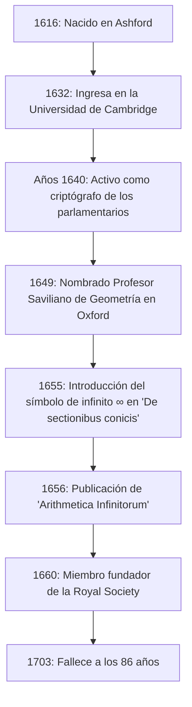

## Introducción: El genio del siglo XVII que simbolizó el infinito

El símbolo de **infinito** ( $\infty$ ) es algo que encontramos con regularidad. La primera persona en introducir este hermoso y misterioso símbolo en el mundo de las matemáticas fue el matemático inglés del siglo XVII **[John Wallis](https://kenji.blog/es/p/wallis/)** (1616–1703). Es conocido como una figura que desempeñó un papel de suma importancia en la historia de las matemáticas, sirviendo de puente entre la geometría analítica de René Descartes y el cálculo de [Isaac Newton](https://kenji.blog/es/p/newton/).

La Europa del siglo XVII fue la era de la "Revolución Científica", donde figuras como Galileo Galilei, Johannes Kepler y [René Descartes](https://kenji.blog/es/p/descartes/) estaban construyendo los cimientos de la ciencia y las matemáticas modernas. En medio de esto, Wallis rompió los límites de la geometría griega clásica y abrió una nueva frontera en las matemáticas al introducir métodos algebraicos y analíticos en la geometría. En este artículo, profundizamos en la turbulenta vida de [Wallis](https://kenji.blog/es/p/wallis/), desde sus singulares antecedentes como criptógrafo hasta sus logros matemáticos y físicos que influyeron enormemente en las generaciones futuras.

## Vida temprana y educación: El camino hacia la medicina, la lógica y la teología

[John Wallis](https://kenji.blog/es/p/wallis/) nació el 23 de noviembre de 1616 en Ashford, Kent, Inglaterra. Su padre era un respetado ministro de la parroquia, y al principio se esperaba que el propio [Wallis](https://kenji.blog/es/p/wallis/) siguiera el camino como clérigo. Para evitar un brote de peste durante su infancia, se trasladó a una escuela en Tenterden, y más tarde dominó lenguas clásicas como el latín, el griego y el hebreo en la Felsted School en Essex.

En 1632, ingresó en el Emmanuel College de la Universidad de Cambridge. En Cambridge, en aquella época, las matemáticas no se enfatizaban como una disciplina académica importante; se consideraban simplemente una habilidad práctica o aritmética para comerciantes. Por lo tanto, él mismo tenía un fuerte interés en la medicina, la anatomía, la lógica y la teología. Inspirado en particular por la teoría de la circulación sanguínea de William Harvey, obtuvo excelentes calificaciones en el campo de la anatomía. En cuanto a las matemáticas, solo había aprendido algo de aritmética de su hermano mayor durante su infancia, y pasaría un poco más de tiempo antes de sumergirse seriamente en las matemáticas.

Tras obtener su maestría en 1640, [Wallis](https://kenji.blog/es/p/wallis/) continuó por el camino eclesiástico, trabajando como ministro en lugares como Londres. Durante este período, también participó en disputas teológicas, cultivando sus habilidades de pensamiento lógico y preciso.

## La Guerra Civil Inglesa y su actividad como criptógrafo

En la década de 1640, Inglaterra se vio envuelta en la **Revolución Puritana** (Guerra Civil Inglesa), una guerra entre los realistas que apoyaban al rey Carlos I y los parlamentarios que apoyaban al Parlamento. Basándose en sus creencias políticas y religiosas, [Wallis](https://kenji.blog/es/p/wallis/) pertenecía a la facción parlamentaria, y fue aquí donde ocurrió un importante punto de inflexión en su vida. Poseía un talento único para descifrar las cartas encriptadas del enemigo.

Un día, un documento criptográfico realista cayó en manos de los parlamentarios. [Wallis](https://kenji.blog/es/p/wallis/) logró descifrar el documento, que nadie más podía comprender, en solo unas pocas horas. Debido a este logro, llegó a ser muy valorado como el criptógrafo oficial de la facción parlamentaria.

El pensamiento lógico y las habilidades analíticas de [Wallis](https://kenji.blog/es/p/wallis/) florecieron enormemente en el campo de la criptografía. Descifraba continuamente complejos códigos realistas y contribuyó significativamente a la victoria parlamentaria. A través de esta experiencia en criptografía, mejoró drásticamente su capacidad matemática para descubrir patrones complejos y manipular símbolos abstractos. La capacidad de percibir las reglas de los códigos le llevó directamente a su posterior capacidad para encontrar regularidades algebraicas en matemáticas. No cabe duda de que sus experiencias de este período se convirtieron en la base de sus posteriores logros matemáticos.

## Un nombramiento sin precedentes como Profesor Saviliano de Geometría en Oxford

A medida que la guerra civil llegaba a su fin y los parlamentarios tomaban la iniciativa, [Wallis](https://kenji.blog/es/p/wallis/), que había contribuido al régimen, fue muy bien valorado. En 1649, fue nombrado **Profesor Saviliano de Geometría** en la Universidad de Oxford.

Este nombramiento causó gran sorpresa entre los intelectuales de la época. Esto se debió a que [Wallis](https://kenji.blog/es/p/wallis/) nunca había publicado un trabajo de investigación matemática serio antes de entonces, y su reputación como matemático era prácticamente inexistente. Sin embargo, permaneció en este puesto durante más de medio siglo, hasta que falleció a los 86 años, transformando a Oxford en uno de los principales centros europeos de investigación matemática.

[Wallis](https://kenji.blog/es/p/wallis/) también participó activamente en reuniones de científicos en Londres (el "Colegio Invisible") y contribuyó en gran medida como uno de los miembros fundadores a la creación de la **Royal Society** en 1660. La Royal Society desempeñaría un papel central en el desarrollo de la ciencia moderna.

La siguiente figura muestra una línea de tiempo de los principales acontecimientos en la vida de [Wallis](https://kenji.blog/es/p/wallis/).

## Principales logros en matemáticas: La algebrización de la geometría y el desafío del infinito

Habiendo asumido la cátedra saviliana, [Wallis](https://kenji.blog/es/p/wallis/) avanzó en su investigación matemática a un ritmo asombroso. Su mayor logro fue romper con los métodos geométricos clásicos y avanzar aún más en los métodos de geometría analítica de [Descartes](https://kenji.blog/es/p/descartes/).

### Introducción del símbolo de infinito ' $\infty$ ' y 'De sectionibus conicis'

Una de las contribuciones más famosas de [Wallis](https://kenji.blog/es/p/wallis/) es que fue el primero en utilizar ' $\infty$ ' como símbolo de infinito en su libro "De sectionibus conicis" (Tratado sobre las secciones cónicas), publicado en 1655.

Hasta entonces, las secciones cónicas (elipse, parábola, hipérbola) se trataban desde la perspectiva de la geometría sólida, literalmente como las secciones transversales cuando un cono es cortado por un plano. Sin embargo, [Wallis](https://kenji.blog/es/p/wallis/) las redefinió como ecuaciones algebraicas (curvas cuadráticas) utilizando coordenadas en un plano. En este enfoque innovador, se vio obligado a manejar el concepto de "continuar infinitamente" en fórmulas matemáticas y, por lo tanto, introdujo el símbolo ' $\infty$ '.

Existen diversas teorías sobre el origen de este símbolo, entre ellas que derivó de "CIƆ", que representa el número romano 1000, y otra de que proviene de la letra griega omega, ' $\omega$ ', la última letra del alfabeto. En cualquier caso, al otorgar un símbolo claro al concepto abstracto de infinito y convertirlo en un objeto de manipulación algebraica, las matemáticas posteriores se desarrollaron significativamente.

### 'Arithmetica Infinitorum' y el camino hacia el cálculo

Su obra maestra, "Arithmetica Infinitorum" (La aritmética de los infinitesimales), publicada en 1656, está considerada como su mayor logro y una de las obras más importantes en la historia del cálculo.

En esta obra, [Wallis](https://kenji.blog/es/p/wallis/) desarrolló aún más el "método de los indivisibles" (un método para ver una figura como una colección de líneas o superficies infinitamente delgadas) de Johannes Kepler y Bonaventura Cavalieri, presentando un método revolucionario para encontrar el área limitada por una curva (integración) mediante el uso de series infinitas. Mientras que el método de Cavalieri era geométrico, el de [Wallis](https://kenji.blog/es/p/wallis/) era extremadamente algebraico y analítico.

Utilizando el razonamiento inductivo, derivó la siguiente fórmula de integración (en notación moderna):

$$
\int_{0}^{1} x^p \, dx = \frac{1}{p+1}
$$

Inicialmente, esta fórmula solo se probó cuando $p$ era un número entero positivo. Pero la audacia de [Wallis](https://kenji.blog/es/p/wallis/) radicaba en su especulación (interpolación) de que **esta ley debería cumplirse incluso para fracciones o números negativos**.

Además, sistematizó los conceptos de exponentes negativos y fraccionarios, expandiendo drásticamente el poder expresivo del álgebra. Por ejemplo, notaciones como $x^{-n} = \frac{1}{x^n}$ y $x^{1/n} = \sqrt[n]{x}$ fueron generalizadas por él y se convirtieron en la base del lenguaje matemático que usamos naturalmente hoy en día.

### El producto de [Wallis](https://kenji.blog/es/p/wallis/) (Producto infinito para Pi)

En "Arithmetica Infinitorum", [Wallis](https://kenji.blog/es/p/wallis/) abordó el difícil problema de calcular el área de un círculo (es decir, la integral $\int_{0}^{1} \sqrt{1-x^2} \, dx$). Al no poder integrarlo directamente, utilizó un método muy original de "interpolar" entre los valores integrales de funciones conocidas.

Al final de sus complejos cálculos, lo que derivó fue una hermosa fórmula que expresa la constante circular $\pi$ como un producto infinito, conocida como el **producto de [Wallis](https://kenji.blog/es/p/wallis/)**.

$$
\frac{\pi}{2} = \prod_{n=1}^{\infty} \frac{4n^2}{4n^2 - 1} = \frac{2}{1} \cdot \frac{2}{3} \cdot \frac{4}{3} \cdot \frac{4}{5} \cdot \frac{6}{5} \cdot \frac{6}{7} \cdots
$$

Esta fórmula demostró que el número trascendente $\pi$ se podía expresar utilizando únicamente la multiplicación infinita de números racionales simples, sin utilizar números irracionales o raíces cuadradas en absoluto, lo que provocó una enorme conmoción en el mundo matemático de la época. Este descubrimiento mostró al mundo el poder de las series infinitas y los productos infinitos.

## Contribuciones a la física, la lingüística y la educación

La brillante mente de [Wallis](https://kenji.blog/es/p/wallis/) no se detuvo en el ámbito de las matemáticas puras.

### Formulación de la ley de conservación del momento

En 1668, cuando la Royal Society buscó públicamente artículos sobre las "leyes de colisión de los cuerpos", [Wallis](https://kenji.blog/es/p/wallis/) presentó una solución junto con Christopher Wren y Christiaan Huygens. [Wallis](https://kenji.blog/es/p/wallis/) consideró las colisiones inelásticas (donde los cuerpos se unen al colisionar) y formuló de manera matemática y rigurosa la **ley de conservación del momento**, que establece que la suma de la cantidad de movimiento se conserva antes y después de una colisión. Este fue un logro de suma importancia en la física que se convertiría en la base de la posterior mecánica newtoniana.

### Libro de gramática inglesa y educación para sordos

Su interés por el lenguaje también era profundo; en 1653, publicó "Grammatica Linguae Anglicanae" (Gramática de la lengua inglesa). Escrito en latín, este libro explicaba lógicamente la estructura del inglés para extranjeros y se utilizó como libro de texto estándar durante muchos años.

Además, [Wallis](https://kenji.blog/es/p/wallis/) poseía un profundo conocimiento de fonética y emprendió el intento pionero de enseñar a hablar a los sordomudos. Aplicando sus propios conocimientos lingüísticos y fonéticos, logró hacer hablar a jóvenes sordos. Respecto a este logro, se produjo una feroz disputa de prioridad entre él y William Holder, quien también estaba educando a personas sordas.

## Feroz controversia con Thomas Hobbes

Para contar la historia de la vida de [Wallis](https://kenji.blog/es/p/wallis/) es fundamental su larga e intensa disputa con el filósofo **Thomas Hobbes**.

Hobbes afirmaba haber resuelto el "problema de la cuadratura del círculo" (el problema de construir un cuadrado con la misma área que un círculo dado usando solo regla y compás). En las matemáticas modernas, se ha demostrado que la cuadratura del círculo es imposible porque $\pi$ es un número trascendente, pero en ese momento todavía estaba sin resolver.

Como un matemático sobresaliente, [Wallis](https://kenji.blog/es/p/wallis/) descubrió de inmediato los errores en la prueba geométrica de Hobbes y lo criticó sin piedad. Hobbes se rebeló contra esto, y la controversia se intensificó más allá del ámbito de las matemáticas puras hacia la política, la religión y la calumnia personal. Esta disputa duró un cuarto de siglo hasta que Hobbes falleció, y se conoce como un episodio que ilustra el carácter inflexible y estricto de [Wallis](https://kenji.blog/es/p/wallis/).

## Tremenda influencia en el joven [Isaac Newton](https://kenji.blog/es/p/newton/)

La "Arithmetica Infinitorum" de [Wallis](https://kenji.blog/es/p/wallis/) tuvo un impacto inconmensurable en un joven que más tarde transformaría fundamentalmente la historia de la ciencia. Ese joven era **[Isaac Newton](https://kenji.blog/es/p/newton/)**.

Durante sus días de estudiante en la Universidad de Cambridge, Newton leyó atentamente la "Arithmetica Infinitorum" de [Wallis](https://kenji.blog/es/p/wallis/) y quedó profundamente impresionado. Al generalizar y ampliar aún más el método de interpolación de Wallis, Newton descubrió el **teorema del binomio generalizado** para cualquier potencia racional. Además, al avanzar en el concepto algebraico de límites de [Wallis](https://kenji.blog/es/p/wallis/), llegó finalmente a la fundación del **cálculo**.

Si la "Arithmetica Infinitorum" de [Wallis](https://kenji.blog/es/p/wallis/) no hubiera existido, el descubrimiento del cálculo por parte de Newton podría haberse retrasado significativamente, o podría haber tomado una forma completamente diferente.

El propio [Wallis](https://kenji.blog/es/p/wallis/) elogió enormemente el talento excepcional de Newton y lo instó enérgicamente a publicar los resultados de su investigación sobre el cálculo. Más tarde, cuando estalló la feroz disputa sobre la "prioridad del cálculo" entre Newton y Gottfried Leibniz, [Wallis](https://kenji.blog/es/p/wallis/) apoyó plenamente a Newton como un poderoso defensor del bando británico.

## Conclusión: Un gran puente en la historia de las matemáticas

[John Wallis](https://kenji.blog/es/p/wallis/) continuó activo como un académico destacado hasta que falleció en 1703 a la edad de 86 años.

Desempeñó un papel crucial como un **puente** en el período de transición de la geometría centrada en figuras, que había continuado desde la antigua Grecia, al análisis moderno, que manipula libremente las fórmulas matemáticas. El poder de razonamiento lógico cultivado a través de la criptografía y el poder imaginativo para hacer conjeturas audaces en territorios desconocidos. Sus logros, nacidos de la fusión de estos elementos, fueron heredados por la siguiente generación de genios como Newton y continúan vivos hoy en día como el cimiento de las matemáticas y la ciencia modernas.

Cuando dibujamos despreocupadamente el símbolo ' $\infty$ ', se encuentra grabado en él el aliento de un gran intelecto, [John Wallis](https://kenji.blog/es/p/wallis/), quien sobrevivió al turbulento siglo XVII e insertó el bisturí de la lógica en el reino divino del infinito.
