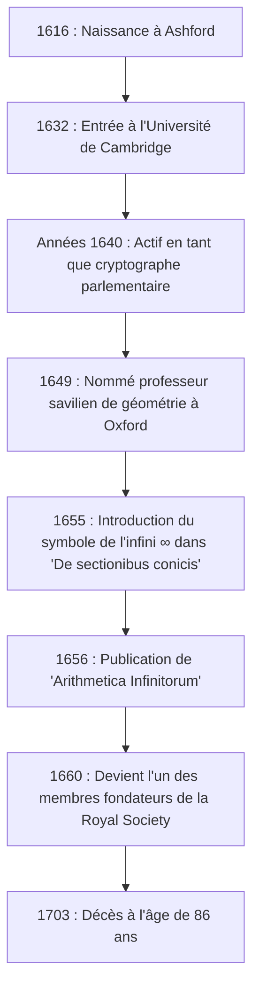

## Introduction : Le génie du XVIIe siècle qui a symbolisé l'infini

Le symbole de **l'infini** ( $\infty$ ) est quelque chose que nous rencontrons régulièrement. La première personne à introduire ce symbole magnifique et mystérieux dans le monde des mathématiques fut le mathématicien anglais du XVIIe siècle **John Wallis** (1616–1703). Il est connu comme une figure ayant joué un rôle extrêmement important dans l'histoire des mathématiques, faisant le pont entre la géométrie analytique de René Descartes et le calcul d'Isaac Newton.

L'Europe du XVIIe siècle était l'ère de la « Révolution scientifique », où des figures telles que Galileo Galilei, Johannes Kepler et René Descartes jetaient les bases de la science et des mathématiques modernes. Dans ce contexte, Wallis a brisé les limites de la géométrie grecque classique et a ouvert une nouvelle frontière en mathématiques en introduisant des méthodes algébriques et analytiques dans la géométrie. Dans cet article, nous plongeons profondément dans la vie tumultueuse de Wallis, de son parcours unique en tant que cryptographe à ses réalisations mathématiques et physiques qui ont grandement influencé les générations futures.

## Jeunesse et éducation : La voie vers la médecine, la logique et la théologie

John Wallis est né le 23 novembre 1616 à Ashford, dans le Kent, en Angleterre. Son père était un pasteur paroissial respecté, et on s'attendait initialement à ce que Wallis lui-même suive la voie de l'Église. Pour éviter une épidémie de peste pendant son enfance, il a été transféré dans une école à Tenterden, puis a maîtrisé les langues classiques telles que le latin, le grec et l'hébreu à la Felsted School, dans l'Essex.

En 1632, il entre à l'Emmanuel College de l'Université de Cambridge. À Cambridge à l'époque, les mathématiques n'étaient pas considérées comme une discipline universitaire majeure ; elles étaient vues simplement comme une compétence pratique ou une arithmétique pour les marchands. Par conséquent, il portait lui-même un grand intérêt à la médecine, l'anatomie, la logique et la théologie. Particulièrement inspiré par la théorie de la circulation sanguine de William Harvey, il a obtenu d'excellents résultats dans le domaine de l'anatomie. Quant aux mathématiques, il n'avait appris que quelques bases d'arithmétique avec son frère aîné pendant son enfance, et ce n'est qu'un peu plus tard qu'il s'est sérieusement plongé dans les mathématiques.

Après avoir obtenu sa maîtrise en 1640, Wallis a poursuivi sa voie ecclésiastique, travaillant comme pasteur dans des endroits comme Londres. Au cours de cette période, il a également participé à des disputes théologiques, cultivant ses capacités de pensée logique et précise.

## La guerre civile anglaise et son activité en tant que cryptographe

Dans les années 1640, l'Angleterre fut engloutie dans la **Révolution puritaine** (la première révolution anglaise), une guerre entre les royalistes soutenant le roi Charles Ier et les parlementaires soutenant le Parlement. En raison de ses convictions politiques et religieuses, Wallis appartenait à la faction parlementaire, et c'est là qu'est survenu un tournant majeur dans sa vie. Il possédait un talent unique pour déchiffrer les lettres codées de l'ennemi.

Un jour, un document cryptographique royaliste est tombé entre les mains des parlementaires. Wallis est parvenu à déchiffrer le document, que personne d'autre ne pouvait comprendre, en quelques heures seulement. Grâce à cet exploit, il est devenu très apprécié en tant que cryptographe officiel de la faction parlementaire.

La pensée logique et les capacités analytiques de Wallis se sont grandement épanouies dans le domaine de la cryptographie. Il a continuellement déchiffré des codes royalistes complexes et a contribué de manière significative à la victoire parlementaire. Grâce à cette expérience en cryptographie, il a considérablement amélioré sa capacité mathématique à découvrir des modèles complexes et à manipuler des symboles abstraits. La capacité à percevoir les règles des codes l'a directement conduit à sa capacité ultérieure à trouver des régularités algébriques en mathématiques. Il ne fait aucun doute que ses expériences de cette période sont devenues la base de ses réalisations mathématiques ultérieures.

## Une nomination sans précédent au poste de professeur savilien de géométrie à Oxford

Alors que la guerre civile touchait à sa fin et que les parlementaires prenaient l'initiative, Wallis, qui avait contribué au régime, fut très estimé. En 1649, il a été nommé **professeur savilien de géométrie** (Savilian Professor of Geometry) à l'Université d'Oxford.

Cette nomination a causé une grande surprise aux intellectuels de l'époque. En effet, Wallis n'avait jamais publié de document de recherche mathématique sérieux auparavant, et sa réputation en tant que mathématicien était pratiquement inexistante. Cependant, il est resté à ce poste pendant plus d'un demi-siècle, jusqu'à sa mort à l'âge de 86 ans, transformant Oxford en l'un des principaux centres de recherche mathématique d'Europe.

Wallis a également participé activement aux réunions de scientifiques à Londres (le "Collège invisible") et a grandement contribué en tant que l'un des membres fondateurs à la création de la **Royal Society** en 1660. La Royal Society allait jouer un rôle central dans le développement de la science moderne.

La figure ci-dessous montre une chronologie des événements majeurs de la vie de Wallis.

## Réalisations majeures en mathématiques : L'algébrisation de la géométrie et le défi de l'infini

Après avoir occupé la chaire savilienne, Wallis a fait progresser ses recherches mathématiques à un rythme fulgurant. Sa plus grande réalisation a été de rompre avec les méthodes géométriques classiques pour faire progresser davantage les méthodes de géométrie analytique de Descartes.

### Introduction du symbole de l'infini ' $\infty$ ' et 'De sectionibus conicis'

L'une des contributions les plus célèbres de Wallis est d'avoir été le premier à utiliser ' $\infty$ ' comme symbole de l'infini dans son livre « De sectionibus conicis » (Traité sur les sections coniques), publié en 1655.

Jusqu'alors, les sections coniques (ellipse, parabole, hyperbole) étaient traitées du point de vue de la géométrie dans l'espace, littéralement comme les sections transversales lorsqu'un cône est coupé par un plan. Cependant, Wallis les a redéfinies comme des équations algébriques (courbes quadratiques) en utilisant des coordonnées sur un plan. Dans cette approche révolutionnaire, il a été contraint de manipuler le concept de « se prolonger à l'infini » dans les formules mathématiques, et a ainsi introduit le symbole ' $\infty$ '.

Il existe diverses théories sur l'origine de ce symbole, dont l'une prétend qu'il dérive de « CIƆ », qui représente le chiffre romain 1000, et une autre qu'il vient de la lettre grecque oméga, ' $\omega$ ', la dernière lettre de l'alphabet. Quoi qu'il en soit, en donnant un symbole clair au concept abstrait de l'infini et en en faisant un objet de manipulation algébrique, les mathématiques ultérieures se sont considérablement développées.

### 'Arithmetica Infinitorum' et la voie vers le calcul

Son grand œuvre, « Arithmetica Infinitorum » (L'Arithmétique des infinis), publié en 1656, est considéré comme son plus grand chef-d'œuvre et l'un des ouvrages les plus importants de l'histoire du calcul infinitésimal.

Dans cet ouvrage, Wallis a développé davantage la « méthode des indivisibles » (une méthode consistant à considérer une figure comme une collection de lignes ou de surfaces infiniment fines) de Johannes Kepler et Bonaventura Cavalieri, en présentant une méthode révolutionnaire pour trouver l'aire délimitée par une courbe (intégration) à l'aide de séries infinies. Alors que la méthode de Cavalieri était géométrique, celle de Wallis était extrêmement algébrique et analytique.

À l'aide d'un raisonnement par récurrence, il a dérivé la formule d'intégration suivante (en notation moderne) :

$$
\int_{0}^{1} x^p \, dx = \frac{1}{p+1}
$$

Initialement, cette formule n'était prouvée que lorsque $p$ était un entier positif. Mais l'audace de Wallis résidait dans sa spéculation (interpolation) que **cette loi devait être valable même pour les fractions ou les nombres négatifs**.

De plus, il a systématisé les concepts d'exposants négatifs et fractionnaires, élargissant de manière spectaculaire le pouvoir d'expression de l'algèbre. Par exemple, des notations telles que $x^{-n} = \frac{1}{x^n}$ et $x^{1/n} = \sqrt[n]{x}$ ont été généralisées par lui et sont devenues le fondement du langage mathématique que nous utilisons naturellement aujourd'hui.

### Le produit de Wallis (Produit infini pour Pi)

Dans « Arithmetica Infinitorum », Wallis s'est attaqué au difficile problème du calcul de l'aire d'un cercle (c'est-à-dire l'intégrale $\int_{0}^{1} \sqrt{1-x^2} \, dx$). Ne pouvant pas l'intégrer directement, il a utilisé une méthode très originale consistant à « interpoler » entre les valeurs intégrales de fonctions connues.

À la fin de ses calculs complexes, il a dérivé une formule magnifique exprimant la constante circulaire $\pi$ sous la forme d'un produit infini, connu sous le nom de **produit de Wallis**.

$$
\frac{\pi}{2} = \prod_{n=1}^{\infty} \frac{4n^2}{4n^2 - 1} = \frac{2}{1} \cdot \frac{2}{3} \cdot \frac{4}{3} \cdot \frac{4}{5} \cdot \frac{6}{5} \cdot \frac{6}{7} \cdots
$$

Cette formule démontrait que le nombre transcendant $\pi$ pouvait être exprimé en utilisant uniquement la multiplication infinie de nombres rationnels simples, sans utiliser de nombres irrationnels ni de racines carrées, ce qui a provoqué une onde de choc massive dans le monde mathématique de l'époque. Cette découverte a montré au monde la puissance des séries infinies et des produits infinis.

## Contributions à la physique, à la linguistique et à l'éducation

L'esprit brillant de Wallis ne s'est pas arrêté au domaine des mathématiques pures.

### Formulation de la loi de la conservation de la quantité de mouvement

En 1668, lorsque la Royal Society a lancé un appel public à contributions sur les « lois de la collision des corps », Wallis a soumis une solution aux côtés de Christopher Wren et Christiaan Huygens. Wallis a examiné les collisions inélastiques (où les corps s'agglutinent lors de la collision) et a formulé mathématiquement et rigoureusement la **loi de la conservation de la quantité de mouvement**, qui stipule que la somme des quantités de mouvement est conservée avant et après une collision. Ce fut une réalisation extrêmement importante en physique qui deviendra la base de la mécanique newtonienne ultérieure.

### Livre de grammaire anglaise et éducation des sourds

Son intérêt pour le langage était également profond ; en 1653, il publie « Grammatica Linguae Anglicanae » (Grammaire de la langue anglaise). Écrit en latin, ce livre expliquait logiquement la structure de l'anglais pour les étrangers et fut utilisé comme manuel de référence pendant de nombreuses années.

De plus, Wallis possédait une connaissance approfondie de la phonétique et a entrepris la démarche pionnière d'enseigner la parole aux sourds-muets. En appliquant ses propres connaissances linguistiques et phonétiques, il a réussi à faire parler des jeunes sourds. Concernant cette réalisation, une violente querelle de priorité a éclaté entre lui et William Holder, qui éduquait également des sourds.

## Intense controverse avec Thomas Hobbes

Essentielle pour raconter l'histoire de la vie de Wallis est sa longue et intense dispute avec le philosophe **Thomas Hobbes**.

Hobbes affirmait avoir résolu le « problème de la quadrature du cercle » (le problème de la construction d'un carré ayant la même aire qu'un cercle donné en utilisant uniquement une règle et un compas). Dans les mathématiques modernes, il a été prouvé que la quadrature du cercle est impossible car $\pi$ est un nombre transcendant, mais à l'époque, le problème était encore non résolu.

En tant que mathématicien hors pair, Wallis a immédiatement perçu les erreurs dans la preuve géométrique de Hobbes et l'a critiqué sans merci. Hobbes s'est rebellé contre cela, et la controverse a dépassé le domaine des mathématiques pures pour s'étendre à la politique, à la religion et à la diffamation personnelle. Cette querelle a duré un quart de siècle jusqu'à la mort de Hobbes, et est connue comme un épisode illustrant le caractère intransigeant et strict de Wallis.

## Influence colossale sur le jeune Isaac Newton

L'« Arithmetica Infinitorum » de Wallis a eu un impact incommensurable sur un certain jeune homme qui allait plus tard bouleverser fondamentalement l'histoire des sciences. Ce jeune homme était **Isaac Newton**.

Pendant ses années d'études à l'Université de Cambridge, Newton a lu attentivement l'« Arithmetica Infinitorum » de Wallis et en fut profondément impressionné. En généralisant et en développant davantage la méthode d'interpolation de Wallis, Newton a découvert le **théorème du binôme généralisé** pour n'importe quelle puissance rationnelle. De plus, en faisant progresser le concept algébrique de limites de Wallis, il est finalement parvenu à la fondation du **calcul**.

Si l'« Arithmetica Infinitorum » de Wallis n'avait pas existé, la découverte du calcul par Newton aurait pu être considérablement retardée, ou elle aurait pu prendre une forme complètement différente.

Wallis lui-même faisait l'éloge du talent exceptionnel de Newton et l'exhortait vivement à publier ses résultats de recherche sur le calcul. Plus tard, lorsque la violente dispute sur la « priorité du calcul » a éclaté entre Newton et Gottfried Leibniz, Wallis a pleinement soutenu Newton en tant que puissant défenseur du camp britannique.

## Conclusion : Un grand pont dans l'histoire des mathématiques

John Wallis a continué à être actif en tant que chercheur de premier plan jusqu'à son décès en 1703 à l'âge de 86 ans.

Il a joué un rôle crucial en tant que **pont** dans la période de transition entre la géométrie centrée sur les figures, qui se poursuivait depuis la Grèce antique, et l'analyse moderne, qui manipule librement les formules mathématiques. La puissance du raisonnement logique cultivée par la cryptographie et la puissance imaginative pour faire des conjectures audacieuses dans des territoires inconnus. Ses réalisations, nées de la fusion de ces éléments, ont été héritées par la génération suivante de génies comme Newton et continuent de vivre aujourd'hui comme le fondement des mathématiques et de la science modernes.

Lorsque nous dessinons nonchalamment le symbole ' $\infty$ ', il y est gravé le souffle d'un grand intellect, John Wallis, qui a survécu au tumultueux XVIIe siècle et a inséré le scalpel de la logique dans le domaine divin de l'infini.
