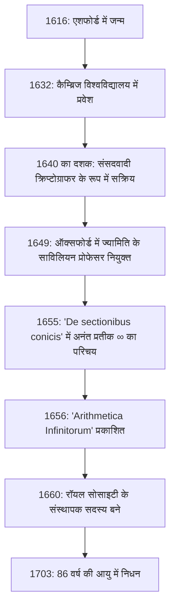

## प्रस्तावना: 17वीं सदी का वह जीनियस जिसने अनंत को प्रतीक दिया

हम नियमित रूप से **अनंत** ( $\infty$ ) के प्रतीक का उपयोग करते हैं। गणित की दुनिया में इस सुंदर और रहस्यमय प्रतीक को पेश करने वाले पहले व्यक्ति 17वीं सदी के अंग्रेजी गणितज्ञ **जॉन वालिस** (1616–1703) थे। उन्हें एक ऐसे व्यक्ति के रूप में जाना जाता है जिसने गणित के इतिहास में अत्यंत महत्वपूर्ण भूमिका निभाई, जो रेने डेसकार्टेस की विश्लेषणात्मक ज्यामिति और आइजैक न्यूटन के कैलकुलस के बीच एक पुल बने।

17वीं शताब्दी का यूरोप "वैज्ञानिक क्रांति" का युग था, जहाँ गैलीलियो गैलीली, जोहान्स केप्लर और रेने डेसकार्टेस जैसी हस्तियां आधुनिक विज्ञान और गणित की नींव का निर्माण कर रही थीं। इसके बीच, वालिस ने शास्त्रीय ग्रीक ज्यामिति की सीमाओं को तोड़ दिया और ज्यामिति में बीजगणितीय और विश्लेषणात्मक तरीकों को पेश करके गणित में एक नई सीमा खोल दी। इस लेख में, हम वालिस के अशांत जीवन में गहराई से गोता लगाते हैं, उनके एक क्रिप्टोग्राफर के रूप में अद्वितीय पृष्ठभूमि से लेकर उनकी गणितीय और भौतिक उपलब्धियों तक जिन्होंने भविष्य की पीढ़ियों को बहुत प्रभावित किया।

## प्रारंभिक जीवन और शिक्षा: चिकित्सा, तर्कशास्त्र और धर्मशास्त्र का मार्ग

जॉन वालिस का जन्म 23 नवंबर 1616 को इंग्लैंड के केंट के एशफोर्ड में हुआ था। उनके पिता एक सम्मानित पादरी थे, और शुरू में यह उम्मीद की जा रही थी कि वालिस खुद भी एक पादरी के रूप में अपना रास्ता चुनेंगे। अपने बचपन में प्लेग के प्रकोप से बचने के लिए, वह टेंटरडेन के एक स्कूल में चले गए, और बाद में एसेक्स के फेल्स्टेड स्कूल में लैटिन, ग्रीक और हिब्रू जैसी शास्त्रीय भाषाओं में महारत हासिल की।

1632 में, उन्होंने कैम्ब्रिज विश्वविद्यालय के इमैनुएल कॉलेज में प्रवेश किया। उस समय कैम्ब्रिज में, गणित को एक प्रमुख शैक्षणिक अनुशासन के रूप में महत्व नहीं दिया गया था; इसे केवल एक व्यावहारिक कौशल या व्यापारियों के लिए अंकगणित माना जाता था। इसलिए, उनकी खुद की चिकित्सा, शरीर रचना विज्ञान, तर्क और धर्मशास्त्र में गहरी रुचि थी। विलियम हार्वे के रक्त परिसंचरण के सिद्धांत से विशेष रूप से प्रेरित होकर, उन्होंने शरीर रचना विज्ञान के क्षेत्र में उत्कृष्ट ग्रेड प्राप्त किए। जहाँ तक गणित की बात है, तो उन्होंने अपने बचपन में अपने बड़े भाई से थोड़ा अंकगणित ही सीखा था, और गणित में गंभीरता से डूबने से पहले उन्हें थोड़ा और समय लगना था।

1640 में अपनी मास्टर डिग्री प्राप्त करने के बाद, वालिस एक पादरी के मार्ग पर आगे बढ़े, लंदन जैसी जगहों पर एक मंत्री के रूप में काम किया। इस अवधि के दौरान, उन्होंने धर्मशास्त्रीय विवादों में भी भाग लिया, अपने तार्किक और सटीक सोच कौशल को विकसित किया।

## अंग्रेजी गृहयुद्ध और एक क्रिप्टोग्राफर के रूप में गतिविधि

1640 के दशक में, इंग्लैंड **प्यूरिटन क्रांति** (अंग्रेजी गृहयुद्ध) में घिर गया था, जो राजा चार्ल्स प्रथम का समर्थन करने वाले रॉयलिस्टों और संसद का समर्थन करने वाले संसदों के बीच एक युद्ध था। अपने राजनीतिक और धार्मिक विश्वासों के आधार पर, वालिस संसदवादी गुट से संबंधित थे, और यहीं उनके जीवन में एक प्रमुख मोड़ आया। उनके पास दुश्मन के एन्क्रिप्टेड पत्रों को डिक्रिप्ट करने की एक अनूठी प्रतिभा थी।

एक दिन, एक रॉयलिस्ट क्रिप्टोग्राफिक दस्तावेज़ संसदवादियों के हाथ लग गया। वालिस ने दस्तावेज़ को डिक्रिप्ट करने में कामयाबी हासिल की, जिसे कोई और नहीं समझ सकता था, केवल कुछ ही घंटों में। इस उपलब्धि के कारण, संसदवादी गुट के आधिकारिक क्रिप्टोग्राफर के रूप में उनका बहुत सम्मान किया जाने लगा।

क्रिप्टोग्राफी के क्षेत्र में वालिस की तार्किक सोच और विश्लेषणात्मक कौशल बहुत खिले। उन्होंने लगातार जटिल रॉयलिस्ट कोडों को समझा और संसदवादी जीत में महत्वपूर्ण योगदान दिया। क्रिप्टोग्राफी में इस अनुभव के माध्यम से, उन्होंने जटिल पैटर्न खोजने और अमूर्त प्रतीकों में हेरफेर करने की अपनी गणितीय क्षमता में नाटकीय रूप से सुधार किया। कोड के नियमों को देखने की क्षमता ने सीधे गणित में बीजगणितीय नियमितता खोजने की उनकी बाद की क्षमता को जन्म दिया। इसमें कोई संदेह नहीं है कि इस अवधि के दौरान उनके अनुभव उनकी बाद की गणितीय उपलब्धियों की नींव बन गए।

## ऑक्सफोर्ड में ज्यामिति के साविलियन प्रोफेसर के रूप में अभूतपूर्व नियुक्ति

जैसे ही गृहयुद्ध समाप्त होने की ओर बढ़ा और संसदवादियों ने पहल की, वालिस, जिन्होंने शासन में योगदान दिया था, का अत्यधिक मूल्यांकन किया गया। 1649 में, उन्हें ऑक्सफोर्ड विश्वविद्यालय में **ज्यामिति के साविलियन प्रोफेसर** (Savilian Professor of Geometry) के रूप में नियुक्त किया गया था।

इस नियुक्ति से उस समय के बुद्धिजीवियों को बड़ा आश्चर्य हुआ। ऐसा इसलिए था क्योंकि वालिस ने तब तक कोई गंभीर गणितीय शोध पत्र प्रकाशित नहीं किया था, और एक गणितज्ञ के रूप में उनकी प्रतिष्ठा वस्तुतः न के बराबर थी। हालाँकि, वह आधी सदी से अधिक समय तक इस पद पर बने रहे जब तक कि 86 वर्ष की आयु में उनका निधन नहीं हो गया, जिससे ऑक्सफोर्ड गणितीय अनुसंधान के लिए यूरोप के प्रमुख केंद्रों में से एक बन गया।

वालिस ने लंदन में वैज्ञानिकों की सभाओं ("अदृश्य कॉलेज") में भी सक्रिय रूप से भाग लिया और 1660 में **रॉयल सोसाइटी** की स्थापना के लिए संस्थापक सदस्यों में से एक के रूप में बहुत योगदान दिया। रॉयल सोसाइटी आधुनिक विज्ञान के विकास में केंद्रीय भूमिका निभाने वाली थी।

नीचे दिया गया चित्र वालिस के जीवन की प्रमुख घटनाओं की समयरेखा को दर्शाता है।

## गणित में प्रमुख उपलब्धियां: ज्यामिति का बीजगणितीयकरण और अनंत की चुनौती

साविलियन कुर्सी ग्रहण करने के बाद, वालिस ने आश्चर्यजनक गति से अपने गणितीय शोध को आगे बढ़ाया। उनकी सबसे बड़ी उपलब्धि शास्त्रीय ज्यामितीय विधियों से अलग होना और डेसकार्टेस की विश्लेषणात्मक ज्यामिति के तरीकों को आगे बढ़ाना था।

### अनंत प्रतीक ' $\infty$ ' का परिचय और 'De sectionibus conicis'

वालिस के सबसे प्रसिद्ध योगदानों में से एक यह है कि वह 1655 में प्रकाशित अपनी पुस्तक "De sectionibus conicis" (शंकु वर्गों पर ग्रंथ) में अनंत के प्रतीक के रूप में ' $\infty$ ' का उपयोग करने वाले पहले व्यक्ति थे।

तब तक, शंकु वर्गों (अंडाकार, परवलय, अतिपरवलय) को ठोस ज्यामिति के दृष्टिकोण से माना जाता था, शाब्दिक रूप से क्रॉस-सेक्शन के रूप में जब एक शंकु को एक विमान द्वारा काटा जाता है। हालाँकि, वालिस ने उन्हें एक विमान पर निर्देशांक का उपयोग करके बीजगणितीय समीकरणों (द्विघात वक्र) के रूप में फिर से परिभाषित किया। इस अभूतपूर्व दृष्टिकोण में, उन्हें गणितीय सूत्रों में "अनंत रूप से जारी" की अवधारणा को संभालने के लिए मजबूर होना पड़ा, और इस प्रकार प्रतीक ' $\infty$ ' पेश किया।

इस प्रतीक की उत्पत्ति के बारे में विभिन्न सिद्धांत हैं, जिनमें से एक यह है कि यह "CIƆ" से लिया गया था, जो रोमन अंक 1000 का प्रतिनिधित्व करता है, और दूसरा यह कि यह ग्रीक अक्षर ओमेगा, ' $\omega$ ', वर्णमाला के अंतिम अक्षर से आता है। किसी भी मामले में, अनंत की अमूर्त अवधारणा को एक स्पष्ट प्रतीक देकर और इसे बीजगणितीय हेरफेर का उद्देश्य बनाकर, बाद के गणित में काफी विकास हुआ।

### 'Arithmetica Infinitorum' और कैलकुलस का मार्ग

उनकी महान कृति, "Arithmetica Infinitorum" (अनंत की अंकगणित), 1656 में प्रकाशित हुई, इसे उनकी सबसे बड़ी कृति और कैलकुलस के इतिहास में सबसे महत्वपूर्ण कार्यों में से एक माना जाता है।

इस काम में, वालिस ने जोहान्स केप्लर और बोनावेंटुरा कैवलियरी के "अविभाज्य की विधि" (एक आकृति को असीम रूप से पतली रेखाओं या सतहों के संग्रह के रूप में देखने की विधि) को और विकसित किया, एक अनंत श्रृंखला का उपयोग करके वक्र (एकीकरण) द्वारा घिरे क्षेत्र को खोजने के लिए एक क्रांतिकारी विधि प्रस्तुत की। जबकि कैवलियरी की विधि ज्यामितीय थी, वालिस की विधि अत्यंत बीजगणितीय और विश्लेषणात्मक थी।

आगमनात्मक तर्क का उपयोग करते हुए, उन्होंने निम्नलिखित एकीकरण सूत्र (आधुनिक संकेतन में) प्राप्त किया:

$$
\int_{0}^{1} x^p \, dx = \frac{1}{p+1}
$$

प्रारंभ में, यह सूत्र तभी सिद्ध हुआ था जब $p$ एक सकारात्मक पूर्णांक था। लेकिन वालिस की साहसिकता उनकी अटकलों (प्रक्षेप) में निहित थी कि **यह कानून अंशों या नकारात्मक संख्याओं के लिए भी मान्य होना चाहिए**।

इसके अलावा, उन्होंने नकारात्मक और भिन्नात्मक घातांक की अवधारणाओं को व्यवस्थित किया, जिससे बीजगणित की अभिव्यंजक शक्ति का नाटकीय रूप से विस्तार हुआ। उदाहरण के लिए, $x^{-n} = \frac{1}{x^n}$ और $x^{1/n} = \sqrt[n]{x}$ जैसे संकेतन उनके द्वारा सामान्यीकृत किए गए थे और गणितीय भाषा की नींव बन गए जिसका उपयोग हम आज स्वाभाविक रूप से करते हैं।

### वालिस उत्पाद (पाई के लिए अनंत उत्पाद)

"Arithmetica Infinitorum" में, वालिस ने एक वृत्त के क्षेत्रफल की गणना करने की कठिन समस्या को हल किया (अर्थात, अभिन्न $\int_{0}^{1} \sqrt{1-x^2} \, dx$)। क्योंकि वह इसे सीधे एकीकृत नहीं कर सके, उन्होंने ज्ञात कार्यों के अभिन्न मूल्यों के बीच "इंटरपोलेटिंग" की एक अत्यधिक मूल विधि का उपयोग किया।

उनकी जटिल गणनाओं के अंत में, उन्होंने जो प्राप्त किया वह एक सुंदर सूत्र था जो गोलाकार स्थिरांक $\pi$ को एक अनंत उत्पाद के रूप में व्यक्त करता है, जिसे **वालिस उत्पाद** के रूप में जाना जाता है।

$$
\frac{\pi}{2} = \prod_{n=1}^{\infty} \frac{4n^2}{4n^2 - 1} = \frac{2}{1} \cdot \frac{2}{3} \cdot \frac{4}{3} \cdot \frac{4}{5} \cdot \frac{6}{5} \cdot \frac{6}{7} \cdots
$$

इस सूत्र ने प्रदर्शित किया कि पारलौकिक संख्या $\pi$ को अपरिमेय संख्याओं या वर्गमूलों का उपयोग किए बिना, केवल साधारण परिमेय संख्याओं के अनंत गुणा का उपयोग करके व्यक्त किया जा सकता है, जिससे उस समय की गणितीय दुनिया को भारी झटका लगा। इस खोज ने दुनिया को अनंत श्रृंखला और अनंत उत्पादों की शक्ति दिखाई।

## भौतिकी, भाषाविज्ञान और शिक्षा में योगदान

वालिस का शानदार दिमाग शुद्ध गणित के दायरे में नहीं रुका।

### संवेग संरक्षण के नियम का सूत्रीकरण

1668 में, जब रॉयल सोसाइटी ने सार्वजनिक रूप से "पिंडों की टक्कर के नियम" पर पत्र मांगे, तो वालिस ने क्रिस्टोफर व्रेन और क्रिस्टियान ह्यूजेंस के साथ एक समाधान प्रस्तुत किया। वालिस ने अप्रत्यास्थ टक्करों (जहाँ पिंड टक्कर पर एक साथ चिपक जाते हैं) पर विचार किया और गणितीय और कड़ाई से **संवेग संरक्षण का नियम** तैयार किया, जिसमें कहा गया है कि संवेग का योग टक्कर से पहले और बाद में संरक्षित रहता है। यह भौतिकी में एक अत्यंत महत्वपूर्ण उपलब्धि थी जो बाद के न्यूटोनियन यांत्रिकी की नींव बन जाएगी।

### अंग्रेजी व्याकरण की पुस्तक और बहरे शिक्षा

भाषा में उनकी रुचि भी गहरी थी; 1653 में, उन्होंने "Grammatica Linguae Anglicanae" (अंग्रेजी भाषा का व्याकरण) प्रकाशित किया। लैटिन में लिखी गई इस पुस्तक ने विदेशियों के लिए अंग्रेजी की संरचना को तार्किक रूप से समझाया और कई वर्षों तक एक मानक पाठ्यपुस्तक के रूप में उपयोग किया गया।

इसके अलावा, वालिस के पास ध्वन्यात्मकता का गहरा ज्ञान था और उन्होंने बहरे मूक को बोलने की शिक्षा देने का अभूतपूर्व प्रयास किया। अपने स्वयं के भाषाई और ध्वन्यात्मक ज्ञान को लागू करते हुए, वह युवा बहरे लोगों को बोलने में सफल रहे। इस उपलब्धि के संबंध में, उनके और विलियम होल्डर के बीच प्राथमिकता को लेकर एक भयंकर विवाद पैदा हो गया, जो बहरे लोगों को भी शिक्षित कर रहे थे।

## थॉमस हॉब्स के साथ भयंकर विवाद

वालिस के जीवन की कहानी को बताने के लिए दार्शनिक **थॉमस हॉब्स** के साथ उनका लंबे समय तक चलने वाला, गहन विवाद आवश्यक है।

हॉब्स ने "वृत्त के वर्ग की समस्या" को हल करने का दावा किया (केवल सीधे किनारे और कंपास का उपयोग करके दिए गए वृत्त के समान क्षेत्र के साथ एक वर्ग बनाने की समस्या)। आधुनिक गणित में, यह सिद्ध हो चुका है कि वृत्त को वर्ग करना असंभव है क्योंकि $\pi$ एक पारलौकिक संख्या है, लेकिन उस समय यह अभी भी अनसुलझा था।

एक उत्कृष्ट गणितज्ञ के रूप में, वालिस ने हॉब्स के ज्यामितीय प्रमाण में त्रुटियों को तुरंत देखा और उनकी निर्दयता से आलोचना की। हॉब्स ने इसके खिलाफ विद्रोह किया, और विवाद शुद्ध गणित के दायरे से परे राजनीति, धर्म और व्यक्तिगत बदनामी तक बढ़ गया। यह विवाद एक सदी के चौथाई हिस्से तक चला जब तक कि हॉब्स का निधन नहीं हो गया, और इसे वालिस के अडिग और सख्त चरित्र को दर्शाने वाले एक प्रकरण के रूप में जाना जाता है।

## युवा आइजैक न्यूटन पर जबरदस्त प्रभाव

वालिस की "Arithmetica Infinitorum" का एक निश्चित युवक पर अथाह प्रभाव पड़ा जो बाद में विज्ञान के इतिहास को मौलिक रूप से पलट देगा। वह युवक **आइजैक न्यूटन** था।

कैम्ब्रिज विश्वविद्यालय में अपने छात्र दिनों के दौरान, न्यूटन ने वालिस की "Arithmetica Infinitorum" को ध्यान से पढ़ा और गहरे प्रभावित हुए। वालिस के इंटरपोलेशन के तरीके को और सामान्यीकृत और विस्तारित करके, न्यूटन ने किसी भी तर्कसंगत शक्ति के लिए **सामान्यीकृत द्विपद प्रमेय** की खोज की। इसके अलावा, वालिस की सीमा की बीजगणितीय अवधारणा को आगे बढ़ाकर, वह अंततः **कैलकुलस** की नींव तक पहुंचे।

यदि वालिस की "Arithmetica Infinitorum" अस्तित्व में नहीं होती, तो न्यूटन की कैलकुलस की खोज में काफी देरी हो सकती थी, या यह पूरी तरह से अलग रूप ले सकती थी।

वालिस ने खुद न्यूटन की असाधारण प्रतिभा की अत्यधिक प्रशंसा की और उनसे कैलकुलस पर अपने शोध परिणामों को प्रकाशित करने का कड़ा आग्रह किया। बाद में, जब न्यूटन और गॉटफ्रीड लाइबनिट्स के बीच "कैलकुलस की प्राथमिकता" पर भयंकर विवाद छिड़ गया, तो वालिस ने ब्रिटिश पक्ष के एक शक्तिशाली वकील के रूप में न्यूटन का पूरी तरह से समर्थन किया।

## निष्कर्ष: गणित के इतिहास में एक महान पुल

जॉन वालिस 1703 में 86 वर्ष की आयु में निधन होने तक एक प्रमुख विद्वान के रूप में सक्रिय रहे।

उन्होंने प्राचीन ग्रीस से चली आ रही आकृति-केंद्रित ज्यामिति से लेकर गणितीय सूत्रों में स्वतंत्र रूप से हेरफेर करने वाले आधुनिक विश्लेषण तक के संक्रमण काल में एक **पुल** के रूप में महत्वपूर्ण भूमिका निभाई। क्रिप्टोग्राफी के माध्यम से तार्किक तर्क शक्ति और अज्ञात प्रदेशों में साहसिक अनुमान लगाने की कल्पना शक्ति। इन तत्वों के संलयन से पैदा हुई उनकी उपलब्धियों को न्यूटन जैसी अगली पीढ़ी के प्रतिभाओं ने विरासत में मिला और आज भी आधुनिक गणित और विज्ञान की नींव के रूप में जीवित है।

जब हम लापरवाही से प्रतीक ' $\infty$ ' खींचते हैं, तो इसके भीतर उकेरी गई एक महान बुद्धि, जॉन वालिस की सांस है, जो अशांत 17 वीं शताब्दी से बचे रहे और अनंत के दिव्य क्षेत्र में तर्क की स्केलपेल डाली।
