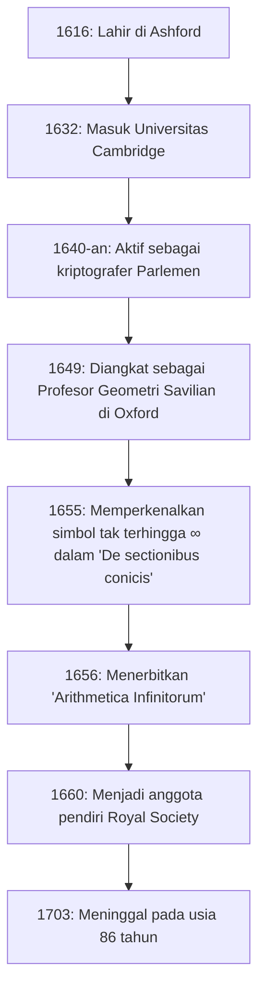

## Pendahuluan: Jenius Abad ke-17 yang Menyimbolkan Tak Terhingga

Simbol **tak terhingga** ( $\infty$ ) adalah sesuatu yang sering kita jumpai. Orang pertama yang memperkenalkan simbol indah dan misterius ini ke dalam dunia matematika adalah matematikawan Inggris abad ke-17, **[John Wallis](https://kenji.blog/id/p/wallis/)** (1616–1703). Ia dikenal sebagai sosok yang memainkan peran yang sangat penting dalam sejarah matematika, menjembatani geometri analitis [René Descartes](https://kenji.blog/id/p/descartes/) dan kalkulus [Isaac Newton](https://kenji.blog/id/p/newton/).

Eropa abad ke-17 adalah era "Revolusi Ilmiah", di mana tokoh-tokoh seperti Galileo Galilei, Johannes Kepler, dan [René Descartes](https://kenji.blog/id/p/descartes/) membangun fondasi sains dan matematika modern. Di tengah semua ini, [Wallis](https://kenji.blog/id/p/wallis/) menerobos batasan geometri klasik Yunani dan membuka batas baru dalam matematika dengan memperkenalkan metode aljabar dan analitis ke dalam geometri. Dalam artikel ini, kita akan menggali lebih dalam kehidupan [Wallis](https://kenji.blog/id/p/wallis/) yang penuh gejolak, dari latar belakangnya yang unik sebagai seorang kriptografer hingga pencapaian matematika dan fisikanya yang sangat memengaruhi generasi masa depan.

## Kehidupan Awal dan Pendidikan: Jalan Menuju Kedokteran, Logika, dan Teologi

[John Wallis](https://kenji.blog/id/p/wallis/) lahir pada 23 November 1616, di Ashford, Kent, Inggris. Ayahnya adalah seorang pendeta paroki yang dihormati, dan [Wallis](https://kenji.blog/id/p/wallis/) sendiri awalnya diharapkan untuk mengikuti jejak sebagai seorang rohaniwan. Untuk menghindari wabah pes pada masa kecilnya, ia pindah ke sebuah sekolah di Tenterden, dan kemudian menguasai bahasa-bahasa klasik seperti bahasa Latin, Yunani, dan Ibrani di Felsted School di Essex.

Pada tahun 1632, ia masuk ke Emmanuel College, Universitas Cambridge. Di Cambridge pada saat itu, matematika tidak ditekankan sebagai disiplin ilmu utama; ia hanya dianggap sebagai keterampilan praktis atau aritmatika bagi para pedagang. Oleh karena itu, ia sendiri memiliki minat yang kuat pada bidang kedokteran, anatomi, logika, dan teologi. Terinspirasi secara khusus oleh teori sirkulasi darah William Harvey, ia meraih nilai yang sangat baik di bidang anatomi. Adapun matematika, ia hanya mempelajari sedikit aritmatika dari kakak laki-lakinya pada masa kecilnya, dan butuh waktu sedikit lebih lama sebelum ia secara serius membenamkan dirinya dalam matematika.

Setelah meraih gelar masternya pada tahun 1640, [Wallis](https://kenji.blog/id/p/wallis/) melanjutkan jalannya sebagai rohaniwan, bekerja sebagai pendeta di tempat-tempat seperti London. Selama periode ini, ia juga berpartisipasi dalam perdebatan teologis, menumbuhkan keterampilan berpikir logis dan presisinya.

## Perang Saudara Inggris dan Aktivitas sebagai Kriptografer

Pada tahun 1640-an, Inggris dilanda **Revolusi Puritan** (Perang Saudara Inggris), sebuah perang antara kaum Royalis yang mendukung Raja Charles I dan kaum Parlemen yang mendukung Parlemen. Berdasarkan keyakinan politik dan agamanya, [Wallis](https://kenji.blog/id/p/wallis/) tergabung dalam faksi Parlemen, dan di sinilah titik balik besar dalam hidupnya terjadi. Ia memiliki bakat unik dalam menguraikan surat-surat musuh yang dienkripsi.

Suatu hari, sebuah dokumen kriptografi Royalis jatuh ke tangan Parlemen. [Wallis](https://kenji.blog/id/p/wallis/) berhasil menguraikan dokumen tersebut, yang tidak dapat dipahami oleh siapa pun, hanya dalam beberapa jam. Berkat pencapaian ini, ia menjadi sangat dihargai sebagai kriptografer resmi faksi Parlemen.

Pemikiran logis dan keterampilan analitis [Wallis](https://kenji.blog/id/p/wallis/) berkembang pesat di bidang kriptografi. Ia terus memecahkan kode-kode Royalis yang kompleks dan berkontribusi signifikan terhadap kemenangan Parlemen. Melalui pengalaman kriptografi ini, ia secara dramatis meningkatkan kemampuan matematikanya untuk menemukan pola kompleks dan memanipulasi simbol abstrak. Kemampuan untuk melihat melalui aturan-aturan kode secara langsung mengarah pada kemampuannya kemudian untuk menemukan keteraturan aljabar dalam matematika. Tidak diragukan lagi bahwa pengalamannya selama periode ini menjadi fondasi bagi pencapaian matematikanya di kemudian hari.

## Pengangkatan yang Belum Pernah Terjadi Sebelumnya sebagai Profesor Geometri Savilian di Oxford

Menjelang akhir perang saudara dan kaum Parlemen mengambil inisiatif, [Wallis](https://kenji.blog/id/p/wallis/), yang telah berkontribusi pada rezim tersebut, dinilai sangat tinggi. Pada tahun 1649, ia diangkat sebagai **Profesor Geometri Savilian** di Universitas Oxford.

Pengangkatan ini membawa kejutan besar bagi para intelektual pada masa itu. Hal ini karena [Wallis](https://kenji.blog/id/p/wallis/) belum pernah menerbitkan makalah penelitian matematika yang serius sebelum saat itu, dan reputasinya sebagai matematikawan praktis tidak ada. Namun, ia tetap berada di posisi ini selama lebih dari setengah abad, hingga ia meninggal pada usia 86 tahun, mengubah Oxford menjadi salah satu pusat penelitian matematika terkemuka di Eropa.

[Wallis](https://kenji.blog/id/p/wallis/) juga berpartisipasi aktif dalam pertemuan para ilmuwan di London ("Invisible College") dan berkontribusi besar sebagai salah satu anggota pendiri pembentukan **Royal Society** pada tahun 1660. Royal Society akan memainkan peran sentral dalam perkembangan sains modern.

Gambar di bawah ini menunjukkan garis waktu peristiwa-peristiwa penting dalam kehidupan [Wallis](https://kenji.blog/id/p/wallis/).

## Pencapaian Utama dalam Matematika: Aljabaritas Geometri dan Tantangan Tak Terhingga

Setelah menduduki kursi Savilian, [Wallis](https://kenji.blog/id/p/wallis/) memajukan penelitian matematikanya dengan kecepatan yang mencengangkan. Pencapaian terbesarnya adalah melepaskan diri dari metode geometris klasik dan memajukan lebih jauh metode geometri analitis [Descartes](https://kenji.blog/id/p/descartes/).

### Pengenalan Simbol Tak Terhingga ' $\infty$ ' dan 'De sectionibus conicis'

Salah satu kontribusi [Wallis](https://kenji.blog/id/p/wallis/) yang paling terkenal adalah bahwa ia adalah orang pertama yang menggunakan ' $\infty$ ' sebagai simbol tak terhingga dalam bukunya "De sectionibus conicis" (Risalah tentang Irisan Kerucut), yang diterbitkan pada tahun 1655.

Hingga saat itu, irisan kerucut (elips, parabola, hiperbola) diperlakukan dari perspektif geometri ruang, secara harafiah sebagai irisan melintang ketika sebuah kerucut dipotong oleh sebuah bidang. Namun, [Wallis](https://kenji.blog/id/p/wallis/) mendefinisikannya kembali sebagai persamaan aljabar (kurva kuadrat) dengan menggunakan koordinat pada sebuah bidang. Dalam pendekatan yang inovatif ini, ia dipaksa untuk menangani konsep "berlanjut tanpa batas" dalam rumus matematika, dan dengan demikian memperkenalkan simbol ' $\infty$ '.

Ada berbagai teori mengenai asal usul simbol ini, termasuk yang menyatakan bahwa simbol ini berasal dari "CIƆ", yang mewakili angka romawi 1000, dan yang lain mengatakan bahwa simbol ini berasal dari huruf Yunani omega, ' $\omega$ ', huruf terakhir dalam alfabet. Apa pun itu, dengan memberikan simbol yang jelas pada konsep abstrak ketakterhinggaan dan menjadikannya objek manipulasi aljabar, matematika selanjutnya berkembang pesat.

### 'Arithmetica Infinitorum' dan Jalan Menuju Kalkulus

Karya agungnya, "Arithmetica Infinitorum" (Aritmatika Infinitesimal), yang diterbitkan pada tahun 1656, dianggap sebagai mahakarya terbesarnya dan salah satu karya paling penting dalam sejarah kalkulus.

Dalam karya ini, [Wallis](https://kenji.blog/id/p/wallis/) lebih lanjut mengembangkan "metode indivisibel" (sebuah metode untuk memandang sebuah bangun ruang sebagai kumpulan garis atau permukaan yang sangat tipis) dari Johannes Kepler dan Bonaventura Cavalieri, dengan menyajikan sebuah metode revolusioner untuk menemukan luas daerah yang dibatasi oleh kurva (integrasi) menggunakan deret tak terhingga. Meskipun metode Cavalieri bersifat geometris, metode [Wallis](https://kenji.blog/id/p/wallis/) sangat aljabar dan analitis.

Menggunakan penalaran induktif, ia menurunkan rumus integrasi berikut (dalam notasi modern):

$$
\int_{0}^{1} x^p \, dx = \frac{1}{p+1}
$$

Awalnya, rumus ini hanya terbukti bila $p$ adalah bilangan bulat positif. Namun, keberanian [Wallis](https://kenji.blog/id/p/wallis/) terletak pada spekulasinya (interpolasi) bahwa **hukum ini juga harus berlaku untuk pecahan atau bilangan negatif**.

Lebih jauh lagi, ia mensistematisasikan konsep pangkat negatif dan pecahan, memperluas kekuatan ekspresif aljabar secara dramatis. Misalnya, notasi seperti $x^{-n} = \frac{1}{x^n}$ dan $x^{1/n} = \sqrt[n]{x}$ digeneralisasikan olehnya dan menjadi dasar dari bahasa matematika yang kita gunakan secara alami saat ini.

### Produk [Wallis](https://kenji.blog/id/p/wallis/) (Produk Tak Terhingga untuk Pi)

Dalam "Arithmetica Infinitorum", [Wallis](https://kenji.blog/id/p/wallis/) mengatasi masalah sulit untuk menghitung luas lingkaran (yaitu, integral $\int_{0}^{1} \sqrt{1-x^2} \, dx$). Karena ia tidak dapat mengintegralkannya secara langsung, ia menggunakan metode "menginterpolasi" yang sangat orisinal di antara nilai-nilai integral fungsi yang diketahui.

Di akhir perhitungannya yang rumit, apa yang ia peroleh adalah rumus yang indah yang menyatakan konstanta lingkaran $\pi$ sebagai produk tak terhingga, yang dikenal sebagai **produk [Wallis](https://kenji.blog/id/p/wallis/)**.

$$
\frac{\pi}{2} = \prod_{n=1}^{\infty} \frac{4n^2}{4n^2 - 1} = \frac{2}{1} \cdot \frac{2}{3} \cdot \frac{4}{3} \cdot \frac{4}{5} \cdot \frac{6}{5} \cdot \frac{6}{7} \cdots
$$

Rumus ini mendemonstrasikan bahwa bilangan transenden $\pi$ dapat dinyatakan menggunakan semata-mata perkalian tak terhingga dari bilangan rasional sederhana, tanpa menggunakan bilangan irasional atau akar kuadrat sama sekali, yang memberikan kejutan besar pada dunia matematika pada saat itu. Penemuan ini menunjukkan kepada dunia kekuatan deret tak terhingga dan produk tak terhingga.

## Kontribusi pada Fisika, Linguistik, dan Pendidikan

Pemikiran [Wallis](https://kenji.blog/id/p/wallis/) yang cemerlang tidak berhenti pada ranah matematika murni.

### Perumusan Hukum Kekekalan Momentum

Pada tahun 1668, ketika Royal Society secara terbuka mencari makalah tentang "hukum tumbukan benda-benda", [Wallis](https://kenji.blog/id/p/wallis/) mengajukan sebuah solusi bersama dengan Christopher Wren dan Christiaan Huygens. [Wallis](https://kenji.blog/id/p/wallis/) mempertimbangkan tumbukan tidak elastis (di mana benda-benda saling menempel saat bertumbukan) dan merumuskan **hukum kekekalan momentum** secara matematis dan ketat, yang menyatakan bahwa jumlah momentum kekal sebelum dan sesudah tumbukan. Ini adalah pencapaian yang sangat penting dalam fisika yang akan menjadi dasar dari mekanika Newton kemudian.

### Buku Tata Bahasa Inggris dan Pendidikan untuk Tuna Rungu

Minatnya pada bahasa juga mendalam; pada tahun 1653, ia menerbitkan "Grammatica Linguae Anglicanae" (Tata Bahasa Bahasa Inggris). Ditulis dalam bahasa Latin, buku ini menjelaskan struktur bahasa Inggris secara logis bagi orang asing dan digunakan sebagai buku teks standar selama bertahun-tahun.

Selain itu, [Wallis](https://kenji.blog/id/p/wallis/) memiliki pengetahuan mendalam tentang fonetik dan melakukan upaya perintis dalam mengajarkan berbicara kepada penderita tuna rungu. Menerapkan pengetahuan linguistik dan fonetiknya sendiri, ia berhasil membuat anak muda yang tuli berbicara. Terkait pencapaian ini, perselisihan sengit tentang prioritas terjadi antara dia dan William Holder, yang juga mendidik tuna rungu.

## Kontroversi Sengit dengan Thomas Hobbes

Yang penting dalam menceritakan kisah hidup [Wallis](https://kenji.blog/id/p/wallis/) adalah perselisihannya yang intens dan berlangsung lama dengan filsuf **Thomas Hobbes**.

Hobbes mengklaim telah memecahkan "masalah mengkuadratkan lingkaran" (masalah membangun persegi dengan luas yang sama dengan lingkaran yang diberikan hanya menggunakan penggaris lurus dan jangka). Dalam matematika modern, telah dibuktikan bahwa mengkuadratkan lingkaran itu mustahil karena $\pi$ adalah bilangan transenden, tetapi pada masa itu masalah ini belum terpecahkan.

Sebagai matematikawan yang luar biasa, [Wallis](https://kenji.blog/id/p/wallis/) segera melihat kesalahan dalam pembuktian geometris Hobbes dan mengkritiknya tanpa ampun. Hobbes memberontak menentang ini, dan kontroversi pun meluas melampaui ranah matematika murni ke politik, agama, dan fitnah pribadi. Perselisihan ini berlangsung selama seperempat abad hingga Hobbes meninggal, dan dikenal sebagai episode yang menggambarkan karakter [Wallis](https://kenji.blog/id/p/wallis/) yang keras dan pantang menyerah.

## Pengaruh Luar Biasa terhadap [Isaac Newton](https://kenji.blog/id/p/newton/) Muda

"Arithmetica Infinitorum" karya [Wallis](https://kenji.blog/id/p/wallis/) memberikan dampak yang tak terukur pada seorang pemuda tertentu yang kelak akan membalikkan sejarah sains secara fundamental. Pemuda itu adalah **[Isaac Newton](https://kenji.blog/id/p/newton/)**.

Selama masa mahasiswanya di Universitas Cambridge, Newton dengan saksama membaca "Arithmetica Infinitorum" karya [Wallis](https://kenji.blog/id/p/wallis/) dan sangat terkesan. Dengan lebih jauh menggeneralisasi dan memperluas metode interpolasi [Wallis](https://kenji.blog/id/p/wallis/), Newton menemukan **teorema binomial umum** untuk setiap pangkat rasional. Lebih jauh lagi, dengan memajukan konsep batas aljabar [Wallis](https://kenji.blog/id/p/wallis/), ia akhirnya sampai pada dasar **kalkulus**.

Jika "Arithmetica Infinitorum" [Wallis](https://kenji.blog/id/p/wallis/) tidak pernah ada, penemuan kalkulus Newton mungkin akan sangat tertunda, atau mungkin mengambil bentuk yang sama sekali berbeda.

[Wallis](https://kenji.blog/id/p/wallis/) sendiri sangat memuji bakat luar biasa Newton dan sangat mendesaknya untuk mempublikasikan hasil penelitiannya tentang kalkulus. Di kemudian hari, ketika perselisihan sengit mengenai "prioritas kalkulus" pecah antara Newton dan [Gottfried Leibniz](https://kenji.blog/id/p/leibniz/), [Wallis](https://kenji.blog/id/p/wallis/) mendukung penuh Newton sebagai pembela tangguh dari pihak Inggris.

## Kesimpulan: Jembatan Besar dalam Sejarah Matematika

[John Wallis](https://kenji.blog/id/p/wallis/) terus aktif sebagai sarjana terkemuka hingga wafatnya pada tahun 1703 di usia 86 tahun.

Ia memainkan peran krusial sebagai sebuah **jembatan** dalam masa transisi dari geometri yang berpusat pada bangun ruang, yang berlanjut sejak zaman Yunani Kuno, menuju analisis modern, yang secara bebas memanipulasi rumus matematika. Daya nalar logis yang dipupuk melalui kriptografi dan daya imajinasi untuk membuat konjektur berani di wilayah-wilayah yang belum diketahui. Pencapaian-pencapaiannya, yang lahir dari perpaduan elemen-elemen ini, diwarisi oleh generasi jenius berikutnya seperti Newton dan terus hidup hari ini sebagai fondasi matematika dan sains modern.

Saat kita dengan santai menggambar simbol ' $\infty$ ', terukir di dalamnya napas dari seorang intelek besar, [John Wallis](https://kenji.blog/id/p/wallis/), yang bertahan melalui gejolak abad ke-17 dan menyisipkan pisau logika ke dalam ranah ketakterhinggaan yang ilahi.
