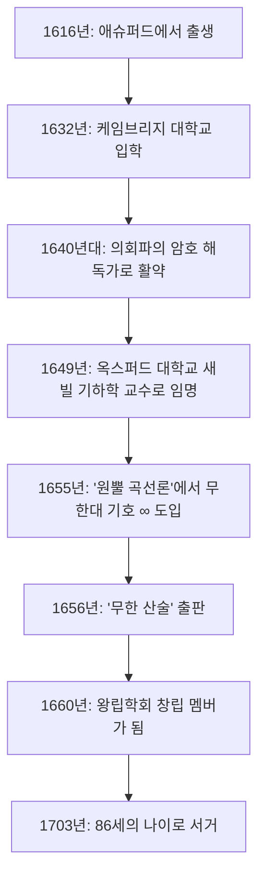

## 머리말: 무한을 기호화한 17세기의 천재

우리가 일상적으로 접하는 **무한대** ( $\infty$ ) 기호. 이 아름답고도 신비로운 기호를 수학의 세계에 처음으로 도입한 인물이 바로 17세기 영국의 수학자 **[존 월리스](https://kenji.blog/ko/p/wallis/)** (John Wallis, 1616–1703)입니다. 그는 [르네 데카르트](/ko/p/descartes/)의 해석기하학과 [아이작 뉴턴](https://kenji.blog/ko/p/newton/)의 미적분학을 연결하는, 수학사에서 극히 중요한 역할을 수행한 인물로 알려져 있습니다.

17세기 유럽은 '과학 혁명'의 시대로, 갈릴레오 갈릴레이, 요하네스 케플러, [르네 데카르트](https://kenji.blog/ko/p/descartes/) 등이 근대 과학과 수학의 기초를 다지고 있었습니다. 그 속에서 월리스는 고전적인 그리스 기하학의 한계를 타파하고, 대수학적이고 해석적인 방법을 기하학에 도입함으로써 수학의 새로운 지평을 열었습니다. 본 기사에서는 암호 해독가라는 특이한 이력부터 후세에 지대한 영향을 미친 수학적, 물리학적 업적에 이르기까지, 월리스의 파란만장한 생애를 깊이 있게 파헤쳐 봅니다.

## 성장 과정과 초기 교육: 의학, 논리학, 그리고 신학으로의 길

[존 월리스](https://kenji.blog/ko/p/wallis/)는 1616년 11월 23일, 잉글랜드 켄트주의 애슈퍼드에서 태어났습니다. 그의 아버지는 존경받는 교구 목사였으며, 월리스 자신도 처음에는 성직자로서의 길을 걸을 것으로 기대되었습니다. 유년 시절 흑사병의 유행을 피하기 위해 텐터든의 학교로 옮겼고, 이후 에식스주의 펠스테드 학교에서 라틴어, 그리스어, 히브리어와 같은 고전어를 통달했습니다.

1632년, 그는 케임브리지 대학교 엠마누엘 칼리지에 입학했습니다. 당시 케임브리지 대학교에서는 수학을 주요 학문으로 중요하게 여기지 않았으며, 단지 실용적인 기술이나 상인들을 위한 산술 정도로 간주되었습니다. 그렇기 때문에 그 자신도 의학, 해부학, 논리학, 그리고 신학에 강한 관심을 가지고 있었습니다. 특히 윌리엄 하비의 혈액 순환설에 영감을 받아 해부학 분야에서 뛰어난 성적을 거두었습니다. 수학에 대해서는 유년기에 형으로부터 산술을 약간 배운 정도였으며, 그가 본격적으로 수학에 몰두하기 시작한 것은 조금 더 후의 일입니다.

1640년에 석사 학위를 취득한 월리스는 성직자의 길로 나아가 런던 등지에서 목사로 일했습니다. 이 시기에 그는 신학적인 논쟁에도 참여하며, 논리적이고 치밀한 사고력을 길렀습니다.

## 잉글랜드 내전과 암호 해독가로서의 활약

1640년대에 들어서면서 잉글랜드는 국왕 찰스 1세를 지지하는 왕당파와 의회를 지지하는 의회파로 나뉘어 싸우는 **청교도 혁명** (잉글랜드 내전)의 소용돌이에 휘말리게 됩니다. 월리스는 정치적, 종교적 신념에 따라 의회파에 속했으며, 여기서 그의 인생에 큰 전환점이 찾아옵니다. 그에게는 암호화된 적의 편지를 해독하는 특이한 재능이 있었던 것입니다.

어느 날, 왕당파의 암호 문서가 의회파의 손에 들어왔습니다. 아무도 해독하지 못했던 그 문서를 월리스는 단 몇 시간 만에 해독해 냈습니다. 이 공로로 인해 그는 의회파의 공식 암호 해독가로 중용되게 됩니다.

월리스의 논리적 사고력과 분석력은 암호 해독 분야에서 크게 꽃을 피웠습니다. 왕당파의 복잡한 암호를 차례차례 해독하여 의회파의 승리에 크게 기여한 그는, 이 암호 해독 경험을 통해 복잡한 패턴을 발견하고 추상적인 기호를 조작하는 수학적인 능력을 비약적으로 향상시켰습니다. 암호의 규칙성을 꿰뚫어 보는 능력은 훗날 수학에서 대수적인 규칙성을 찾아내는 능력으로 직결되었습니다. 이 시기의 경험이 훗날 그의 수학적 업적의 기반이 되었음은 의심할 여지가 없습니다.

## 옥스퍼드 대학교 새빌 기하학 교수로의 파격적인 임명

내전이 종식으로 향하고 의회파가 주도권을 쥐게 되자, 체제에 기여한 월리스는 높이 평가받았습니다. 1649년, 그는 옥스퍼드 대학교의 **새빌 기하학 교수** (Savilian Professor of Geometry)로 임명됩니다.

이 임명은 당시의 지식인들에게 큰 놀라움을 안겨주었습니다. 왜냐하면 월리스는 그때까지 본격적인 수학 연구 논문을 발표한 적이 없었고, 수학자로서의 명성은 전무하다시피 했기 때문입니다. 하지만 그는 이 직책에 반세기 이상, 86세로 세상을 떠날 때까지 머물렀으며, 옥스퍼드를 유럽 굴지의 수학 연구 거점으로 변모시켰습니다.

또한 월리스는 런던의 과학자들 모임('보이지 않는 대학')에 적극적으로 참여했고, 1660년 **왕립학회** (Royal Society)의 설립에도 창립 멤버 중 한 사람으로서 크게 기여했습니다. 왕립학회는 근대 과학의 발전에 중추적인 역할을 하게 됩니다.

아래 그림은 월리스의 생애에 있어서 주요 사건들을 나타낸 타임라인입니다.

## 수학에서의 주요 업적: 기하학의 대수화와 무한에 대한 도전

새빌 교수직에 오른 월리스는 경이로운 속도로 수학 연구를 진행했습니다. 그의 가장 큰 공적은 고전적인 기하학의 방법에서 벗어나 데카르트의 해석기하학 방법을 더욱 발전시킨 것입니다.

### 무한대 기호 ' $\infty$ '의 도입과 '원뿔 곡선론'

월리스의 가장 유명한 공헌 중 하나는 1655년에 출판된 저서 '원뿔 곡선론'(De sectionibus conicis)에서 무한대를 나타내는 기호로 ' $\infty$ '를 처음 사용한 것입니다.

이전까지 원뿔 곡선(타원, 포물선, 쌍곡선)은 말 그대로 원뿔을 평면으로 절단했을 때의 단면으로서 입체 기하학적으로 다루어졌습니다. 하지만 월리스는 이를 평면상의 좌표를 이용한 대수 방정식(2차 곡선)으로 재정의했습니다. 이 획기적인 접근법 속에서 그는 수학 공식 상에서 '무한히 계속되는' 개념을 다루어야 할 필요성에 직면했고, 이에 따라 ' $\infty$ ' 기호를 도입한 것입니다.

이 기호의 유래에는 여러 설이 있는데, 로마 숫자 1000을 나타내는 'CIƆ'에서 파생되었다는 설과 그리스 문자의 마지막 글자인 오메가 ' $\omega$ '에서 유래했다는 설 등이 있습니다. 어쨌든 무한이라는 추상적인 개념에 명확한 기호를 부여하고 그것을 대수적인 조작의 대상으로 삼음으로써, 이후의 수학은 크게 발전하게 되었습니다.

### '무한 산술'과 미적분학으로의 여정

1656년에 출판된 주저 '무한 산술'(Arithmetica Infinitorum)은 그의 최고 걸작으로 꼽히며, 미적분학의 역사에서 가장 중요한 저작 중 하나입니다.

이 저작에서 월리스는 요하네스 케플러와 보나벤투라 카발리에리의 '불가분량의 방법'(도형을 무한히 얇은 선이나 면의 집합으로 간주하는 방법)을 더욱 발전시켜, 무한 급수를 이용하여 곡선이 둘러싼 넓이(적분)를 구하는 획기적인 방법을 제시했습니다. 카발리에리의 방법이 기하학적이었던 반면, 월리스의 방법은 극히 대수적이고 해석적이었습니다.

그는 귀납적인 추론을 이용하여 다음과 같은 적분 공식(현대의 표기법에 따름)을 도출해 냈습니다.

$$
\int_{0}^{1} x^p \, dx = \frac{1}{p+1}
$$

초기에 이 공식은 $p$ 가 양의 정수인 경우에만 증명되었지만, 월리스의 대담한 점은 이 법칙이 **분수나 음수일지라도 성립할 것** 이라고 추측(보간)했다는 것입니다.

나아가 그는 음의 지수나 분수 지수라는 개념을 체계화하여 대수학의 표현력을 극적으로 확장했습니다. 예를 들어, $x^{-n} = \frac{1}{x^n}$ 이나 $x^{1/n} = \sqrt[n]{x}$ 와 같은 표기법은 그에 의해 일반화되어 현대의 우리가 당연하게 사용하고 있는 수학 언어의 기초가 되었습니다.

### 월리스의 공식 (원주율의 무한 곱)

'무한 산술'에서 월리스는 원의 넓이(즉 적분 $\int_{0}^{1} \sqrt{1-x^2} \, dx$ )를 계산하는 난제에 도전했습니다. 그는 직접 적분할 수 없었기 때문에, 이미 알려진 함수의 적분값들 사이를 '보간'하는 지극히 독창적인 방법을 사용했습니다.

그 복잡한 계산 끝에 그가 도출해 낸 것이, 원주율 $\pi$ 를 무한 곱으로 나타내는 아름다운 공식, 이른바 **월리스의 공식** 입니다.

$$
\frac{\pi}{2} = \prod_{n=1}^{\infty} \frac{4n^2}{4n^2 - 1} = \frac{2}{1} \cdot \frac{2}{3} \cdot \frac{4}{3} \cdot \frac{4}{5} \cdot \frac{6}{5} \cdot \frac{6}{7} \cdots
$$

이 공식은 초월수인 $\pi$ 를 무리수나 제곱근 등을 일절 사용하지 않고 단순한 유리수의 무한 번의 곱셈만으로 표현할 수 있음을 보여주었으며, 당시의 수학계에 큰 충격을 주었습니다. 이 발견은 무한 급수나 무한 곱의 위력을 세계에 알리는 것이었습니다.

## 물리학, 언어학, 그리고 교육에 대한 공헌

월리스의 천재적인 두뇌는 순수 수학의 영역에만 머물지 않았습니다.

### 운동량 보존 법칙의 정식화

1668년, 왕립학회가 '물체의 충돌 법칙'에 관한 논문을 공모했을 때, 월리스는 크리스토퍼 렌, 크리스티안 하위헌스와 함께 해답을 제출했습니다. 월리스는 비탄성 충돌(물체가 충돌하여 합쳐지는 경우)에 대해 고찰하여, 운동량의 총합이 충돌 전후로 보존된다는 **운동량 보존 법칙** 을 수학적으로 엄밀하게 정식화했습니다. 이는 훗날 뉴턴 역학의 기초가 되는 지극히 중요한 물리학적 업적입니다.

### 영어 문법서와 농아자 교육

언어에 대한 관심도 깊어, 1653년에 '영어 문법'(Grammatica Linguae Anglicanae)을 출판했습니다. 이 책은 라틴어로 쓰여 외국인들에게 영어의 구조를 논리적으로 해설한 것으로, 오랜 세월에 걸쳐 표준적인 교과서로 사용되었습니다.

또한 월리스는 음성학에도 조예가 깊어, 청각 장애인(농아자)에게 발성법을 가르치는 획기적인 시도도 했습니다. 그는 자신의 언어학적, 음성학적 지식을 응용하여 귀가 들리지 않는 젊은이가 말을 하게 하는 데 성공했습니다. 이 업적을 둘러싸고, 똑같이 농아자 교육을 하고 있던 윌리엄 홀더와 격렬한 우선권 논쟁이 일어나기도 했습니다.

## 토머스 홉스와의 격렬한 논쟁

월리스의 생애를 이야기할 때 빼놓을 수 없는 것이 철학자 **토머스 홉스** (Thomas Hobbes)와의 오랜 세월에 걸친 격렬한 논쟁입니다.

홉스는 '원적 문제'(자와 컴퍼스만으로 주어진 원과 같은 넓이의 정사각형을 작도하는 문제)를 해결했다고 주장했습니다. 현대 수학에서는 $\pi$ 가 초월수이기 때문에 원적 문제가 불가능하다는 것이 증명되어 있지만, 당시는 아직 미해결 상태였습니다.

뛰어난 수학자인 월리스는 홉스의 기하학적 증명의 오류를 즉각 간파하고 가차 없이 비판했습니다. 홉스도 이에 반발하여, 논쟁은 순수한 수학의 영역을 넘어 정치나 종교, 개인적인 비방으로까지 발전했습니다. 이 논쟁은 홉스가 세상을 떠날 때까지 사반세기에 걸쳐 계속되었으며, 월리스의 타협을 허용하지 않는 엄격한 성격을 보여주는 일화로 알려져 있습니다.

## 젊은 [아이작 뉴턴](https://kenji.blog/ko/p/newton/)에게 미친 지대한 영향

월리스의 '무한 산술'은 훗날 과학의 역사를 송두리째 뒤엎게 될 한 청년에게 헤아릴 수 없는 영향을 미쳤습니다. 그가 바로 젊은 시절의 **[아이작 뉴턴](https://kenji.blog/ko/p/newton/)** ([Isaac Newton](https://kenji.blog/ko/p/newton/))입니다.

뉴턴은 케임브리지 대학교 학생 시절에 월리스의 '무한 산술'을 숙독하고 깊은 감명을 받았습니다. 뉴턴은 월리스의 보간법을 더욱 일반화하고 확장함으로써 임의의 유리수 제곱에 대한 **일반 이항 정리** 를 발견했습니다. 나아가 월리스의 대수적인 극한의 개념을 추진함으로써 마침내 **미적분학** 의 창시에 이르게 된 것입니다.

만약 월리스의 '무한 산술'이 존재하지 않았더라면, 뉴턴의 미적분학 발견은 크게 늦어졌거나 전혀 다른 형태가 되었을지도 모릅니다.

월리스 자신도 뉴턴의 유례없는 재능을 높이 평가하고, 그가 미적분의 연구 결과를 공표하도록 강력히 촉구했습니다. 훗날 뉴턴과 [고트프리트 라이프니츠](https://kenji.blog/ko/p/leibniz/) 사이에 '미적분의 선취권'을 둘러싼 격렬한 논쟁이 일어났을 때, 월리스는 영국 측의 강력한 옹호자로서 뉴턴을 전력으로 지지했습니다.

## 맺음말: 수학사에서의 위대한 가교

[존 월리스](https://kenji.blog/ko/p/wallis/)는 1703년 86세의 나이로 세상을 떠날 때까지 제일선의 학자로 계속 활동했습니다.

그는 고대 그리스부터 이어져 온 도형 중심의 기하학에서 수식을 자유자재로 다루는 근대의 해석학에 이르는 과도기에, 극히 중요한 **가교** 로서의 역할을 수행했습니다. 암호 해독으로 배양된 논리적 추론력과 미지의 영역에 대해 대담한 추측을 하는 발상력. 그것들이 융합함으로써 탄생한 그의 업적은 뉴턴 등 차세대 천재들에게 계승되어, 현대 수학과 과학의 기반으로서 지금도 여전히 살아 숨 쉬고 있습니다.

우리가 무심코 ' $\infty$ '라는 기호를 그릴 때, 그곳에는 17세기의 격동의 시대를 살아내며 무한이라는 신의 영역에 논리의 메스를 들이댄 위대한 지성, [존 월리스](https://kenji.blog/ko/p/wallis/)의 숨결이 새겨져 있는 것입니다.
