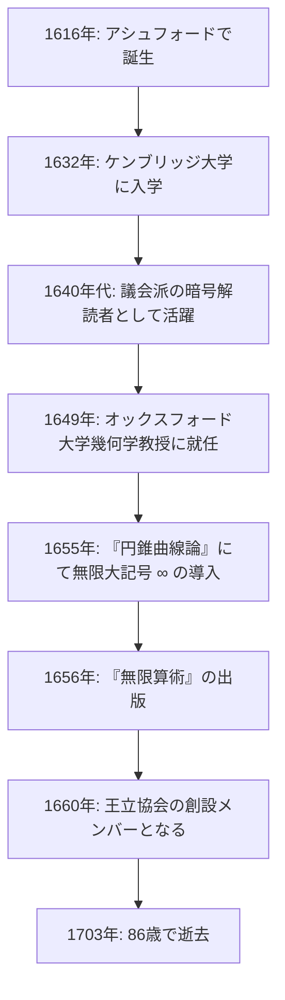

## はじめに：無限を記号化した17世紀の天才

私たちが日常的に目にする **無限大** （ $\infty$ ）の記号。この美しくも神秘的な記号を初めて数学の世界に導入したのが、17世紀イギリスの数学者 **[ジョン・ウォリス](https://kenji.blog/p/wallis/)** （[John Wallis](https://kenji.blog/p/wallis/), 1616–1703）です。彼は[ルネ・デカルト](https://kenji.blog/p/descartes/)の解析幾何学と、アイザック・[ニュートン](https://kenji.blog/p/newton/)の微積分学をつなぐ、数学史において極めて重要な役割を果たした人物として知られています。

17世紀のヨーロッパは「科学革命」の時代であり、ガリレオ・ガリレイやヨハネス・ケプラー、[ルネ・デカルト](https://kenji.blog/p/descartes/)らが近代科学と数学の基礎を築き上げていました。その中でウォリスは、古典的なギリシャ幾何学の限界を打破し、代数学的・解析的な手法を幾何学に導入することで、数学の新たな地平を切り開きました。本記事では、暗号解読者としての特異な経歴から、後世に多大な影響を与えた数学的・物理学的な業績まで、ウォリスの波乱に満ちた生涯を深く掘り下げていきます。

## 生い立ちと初期の教育：医学、論理学、そして神学への道

[ジョン・ウォリス](https://kenji.blog/p/wallis/)は1616年11月23日、イングランドのケント州アシュフォードで生まれました。彼の父親は教区の尊敬される牧師であり、ウォリス自身も最初は聖職者としての道を歩むことを期待されていました。幼少期にペストの流行を避けるためテターデンの学校に移り、その後エセックス州のフェルステッド・スクールでラテン語、ギリシャ語、ヘブライ語といった古典語を習得しました。

1632年、彼はケンブリッジ大学のエマニュエル・カレッジに入学します。当時のケンブリッジ大学では、数学は主要な学問として重視されておらず、単なる実用的な技術、あるいは商人のための計算術と見なされていました。そのため、彼自身も医学や解剖学、論理学、そして神学に強い関心を持っていました。特に、ウィリアム・ハーヴェイによる血液循環説に触発され、解剖学の分野で優れた成績を収めています。数学については、幼少期に兄から算術を教わった程度であり、彼が本格的に数学に没頭し始めるのは、もう少し後のことになります。

1640年に修士号を取得したウォリスは、聖職者の道へと進み、ロンドンなどで牧師として働きました。この時期、彼は神学的な論争にも参加しており、論理的で緻密な思考力が培われていきました。

## イングランド内戦と暗号解読者としての活躍

1640年代に入ると、イングランドは国王チャールズ1世を支持する王党派と、議会を支持する議会派に分かれて戦う **清教徒革命** （イングランド内戦）の渦中に巻き込まれます。ウォリスは政治的・宗教的な信条から議会派に属し、ここで彼の人生の大きな転機が訪れます。彼には、暗号化された敵の手紙を解読するという特異な才能があったのです。

ある日、王党派の暗号文書が議会派の手に渡りました。誰も解読できなかったその文書を、ウォリスはわずか数時間で解読して見せました。この功績により、彼は議会派の公式な暗号解読者として重用されるようになります。

ウォリスの論理的思考力と分析力は、暗号解読の分野で大いに開花しました。王党派の複雑な暗号を次々と解読し、議会派の勝利に大きく貢献した彼は、この暗号解読の経験を通じて、複雑なパターンを見出し、抽象的な記号を操作するという数学的な能力を飛躍的に高めていきました。暗号の法則性を見抜く力は、後に数学における代数的な規則性を見出す力へと直結していったのです。この時期の経験が、後の彼の数学的業績の基盤となったことは間違いありません。

## オックスフォード大学サヴィル卿幾何学教授への大抜擢

内戦が終結に向かい、議会派が主導権を握るようになると、体制側に貢献したウォリスは高く評価されました。1649年、彼はオックスフォード大学の **サヴィル卿幾何学教授** （Savilian Professor of Geometry）に任命されます。

この任命は、当時の知識人たちに大きな驚きをもたらしました。なぜなら、ウォリスはそれまで本格的な数学の研究論文を発表したことがなく、数学者としての名声は皆無に等しかったからです。しかし、彼はこの職に半世紀以上、86歳で亡くなるまで留まり、オックスフォードをヨーロッパ有数の数学研究の拠点へと変貌させました。

また、ウォリスはロンドンの科学者たちの集まり（見えざる大学）に積極的に参加し、1660年の **王立協会** （Royal Society）の設立にも創設メンバーの一人として大きく貢献しました。王立協会は、近代科学の発展において中心的な役割を果たすことになります。

以下の図は、ウォリスの生涯における主要な出来事を示したタイムラインです。

## 数学における主な業績：幾何学の代数化と無限への挑戦

サヴィル卿教授職に就いたウォリスは、驚異的なペースで数学の研究を進めました。彼の最大の功績は、古典的な幾何学の手法から脱却し、デカルトの解析幾何学の手法をさらに推し進めたことです。

### 無限大記号「 $\infty$ 」の導入と『円錐曲線論』

ウォリスの最も有名な貢献の一つは、1655年に出版された著書『円錐曲線論』（De sectionibus conicis）において、無限大を表す記号として「 $\infty$ 」を初めて用いたことです。

これまで円錐曲線（楕円、放物線、双曲線）は、文字通り円錐を平面で切断したときの断面として、立体幾何学的に扱われていました。しかしウォリスは、これを平面上の座標を用いた代数方程式（2次曲線）として定義し直しました。この画期的なアプローチの中で、彼は「無限に続く」という概念を数式上で扱う必要に迫られ、「 $\infty$ 」という記号を導入したのです。

この記号の由来には諸説あり、ローマ数字の1000を表す「CIƆ」から派生したという説や、ギリシャ文字の最後の文字であるオメガ「 $\omega$ 」に由来するという説などがあります。いずれにせよ、無限という抽象的な概念に明確な記号を与え、それを代数的な操作の対象としたことで、その後の数学は大きく発展しました。

### 『無限算術』と微積分への道程

1656年に出版された主著『無限算術』（Arithmetica Infinitorum）は、彼の最高傑作とされており、微分積分学の歴史において最も重要な著作の一つです。

この著作の中で、ウォリスはヨハネス・ケプラーやボナヴェントゥーラ・カヴァリエーリの「不可分量の手法」（図形を無限に薄い線や面の集まりとみなす手法）をさらに発展させ、無限級数を用いて曲線の囲む面積（積分）を求める画期的な手法を提示しました。カヴァリエーリの手法が幾何学的であったのに対し、ウォリスの手法は極めて代数的・解析的でした。

彼は帰納的な推論を用いて、次のような積分公式（現代の記法による）を導き出しました。

$$
\int_{0}^{1} x^p \, dx = \frac{1}{p+1}
$$

当初、この公式は $p$ が正の整数の場合にのみ証明されていましたが、ウォリスの大胆なところは、この法則が **分数や負の数であっても成り立つはずだ** と推測（補間）したことです。

さらに彼は、負の指数や分数の指数という概念を体系化し、代数学の表現力を劇的に拡張しました。例えば、 $x^{-n} = \frac{1}{x^n}$ や $x^{1/n} = \sqrt[n]{x}$ といった記法は、彼によって一般化され、現代の私たちが当たり前のように使っている数学の言語の基礎となりました。

### ウォリスの公式（円周率の無限乗積）

『無限算術』の中で、ウォリスは円の面積（つまり積分 $\int_{0}^{1} \sqrt{1-x^2} \, dx$ ）を計算するという難問に挑みました。彼は直接積分することができなかったため、既知の関数の積分値の間を「補間」するという極めて独創的な手法を用いました。

その複雑な計算の末に彼が導き出したのが、円周率 $\pi$ を無限乗積として表す美しい公式、いわゆる **ウォリスの公式** です。

$$
\frac{\pi}{2} = \prod_{n=1}^{\infty} \frac{4n^2}{4n^2 - 1} = \frac{2}{1} \cdot \frac{2}{3} \cdot \frac{4}{3} \cdot \frac{4}{5} \cdot \frac{6}{5} \cdot \frac{6}{7} \cdots
$$

この公式は、超越数である $\pi$ を、無理数や平方根などを一切使わず、単純な有理数の無限回の掛け算だけで表現できることを示しており、当時の数学界に大きな衝撃を与えました。この発見は、無限級数や無限乗積の威力を世界に知らしめるものでした。

## 物理学、言語学、そして教育への貢献

ウォリスの天才的な頭脳は、純粋数学の領域に留まりませんでした。

### 運動量保存則の定式化

1668年、王立協会が「物体の衝突の法則」に関する論文を公募した際、ウォリスはクリストファー・レンやクリスティアーン・ホイヘンスと共に解答を提出しました。ウォリスは非弾性衝突（物体が衝突して合体する場合）について考察し、運動量の総和が衝突の前後で保存されるという **運動量保存則** を数学的に厳密に定式化しました。これは、後の[ニュートン](https://kenji.blog/p/newton/)力学の基礎となる極めて重要な物理学の業績です。

### 英語の文法書と聾唖者教育

言語への関心も深く、1653年に『英語文法』（Grammatica Linguae Anglicanae）を出版しました。この本はラテン語で書かれ、外国人向けに英語の構造を論理的に解説したもので、長年にわたって標準的な教科書として使われました。

また、ウォリスは音声学にも造詣が深く、聴覚障害者（聾唖者）に発声法を教えるという画期的な試みも行っています。彼は自らの言語学的・音声学的な知識を応用し、耳の聞こえない若者に言葉を話させることに成功しました。この業績を巡っては、同じく聾唖者教育を行っていたウィリアム・ホルダーとの間で激しい優先権争いが起きています。

## トマス・ホッブズとの激しい論争

ウォリスの生涯を語る上で欠かせないのが、哲学者 **トマス・ホッブズ** （Thomas Hobbes）との長年にわたる激しい論争です。

ホッブズは「円積問題」（定規とコンパスだけで、与えられた円と同じ面積の正方形を作図する問題）を解決したと主張しました。現代の数学では、 $\pi$ が超越数であるため円積問題は不可能であることが証明されていますが、当時はまだ未解決でした。

優れた数学者であるウォリスは、ホッブズの幾何学的な証明の誤りを即座に見抜き、容赦なく批判しました。ホッブズもこれに反発し、論争は純粋な数学の領域を超え、政治や宗教、個人的な誹謗中傷にまで発展しました。この論争はホッブズが亡くなるまで四半世紀にわたって続き、ウォリスの妥協を許さない厳格な性格を物語るエピソードとして知られています。

## 若きアイザック・[ニュートン](https://kenji.blog/p/newton/)への多大な影響

ウォリスの『無限算術』は、後に科学の歴史を根底から覆すことになる一人の青年に、計り知れない影響を与えました。それこそが、若き日の **アイザック・[ニュートン](https://kenji.blog/p/newton/)** （[Isaac Newton](https://kenji.blog/p/newton/)）です。

[ニュートン](https://kenji.blog/p/newton/)はケンブリッジ大学の学生時代にウォリスの『無限算術』を熟読し、深い感銘を受けました。[ニュートン](https://kenji.blog/p/newton/)はウォリスの補間の手法をさらに一般化・拡張することで、任意の有理数乗に対する **一般二項定理** を発見しました。さらに、ウォリスの代数的な極限の概念を推し進めることで、ついに **微分積分学** の創始へと至ったのです。

もしウォリスの『無限算術』が存在していなかったら、[ニュートン](https://kenji.blog/p/newton/)の微積分学の発見は大きく遅れていたか、全く違った形になっていたかもしれません。

ウォリス自身も[ニュートン](https://kenji.blog/p/newton/)の類まれな才能を高く評価し、彼が微積分の研究結果を公表するよう強く促しました。後に[ニュートン](https://kenji.blog/p/newton/)とゴットフリート・[ライプニッツ](https://kenji.blog/p/leibniz/)の間で「微積分の先取権」を巡る激しい論争が起きた際、ウォリスはイギリス側の強力な擁護者として、[ニュートン](https://kenji.blog/p/newton/)を全力で支持しました。

## 終わりに：数学史における偉大なる架け橋

[ジョン・ウォリス](https://kenji.blog/p/wallis/)は、1703年に86歳でこの世を去るまで、第一線の学者として活動し続けました。

彼は、古代ギリシャから続く図形中心の幾何学から、数式を自在に操る近代の解析学へと至る過渡期において、極めて重要な **架け橋** としての役割を果たしました。暗号解読で培われた論理的推論力と、未知の領域に対して大胆な推測を行う発想力。それらが融合することで生み出された彼の業績は、[ニュートン](https://kenji.blog/p/newton/)ら次世代の天才たちに引き継がれ、現代の数学や科学の基盤として今もなお生き続けています。

私たちが何気なく「 $\infty$ 」という記号を描くとき、そこには17世紀の激動の時代を生き抜き、無限という神の領域に論理のメスを入れた偉大な知性、[ジョン・ウォリス](https://kenji.blog/p/wallis/)の息吹が刻まれているのです。
