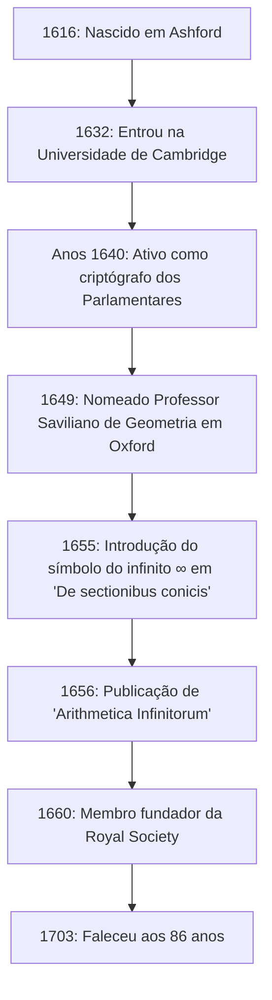

## Introdução: O Gênio do Século XVII que Simbolizou o Infinito

O símbolo do **infinito** ( $\infty$ ) é algo que encontramos regularmente. A primeira pessoa a introduzir este belo e misterioso símbolo no mundo da matemática foi o matemático inglês do século XVII, **[John Wallis](https://kenji.blog/pt/p/wallis/)** (1616–1703). Ele é conhecido como uma figura que desempenhou um papel extremamente importante na história da matemática, servindo de ponte entre a geometria analítica de [René Descartes](https://kenji.blog/pt/p/descartes/) e o cálculo de [Isaac Newton](https://kenji.blog/pt/p/newton/).

A Europa do século XVII foi a era da "Revolução Científica", onde figuras como Galileu Galilei, Johannes Kepler e [René Descartes](https://kenji.blog/pt/p/descartes/) estavam construindo os alicerces da ciência e da matemática modernas. Em meio a isso, Wallis rompeu as limitações da geometria grega clássica e abriu uma nova fronteira na matemática ao introduzir métodos algébricos e analíticos na geometria. Neste artigo, mergulhamos profundamente na vida turbulenta de Wallis, desde sua formação única como criptógrafo até suas conquistas matemáticas e físicas que influenciaram grandemente as gerações futuras.

## Início da Vida e Educação: O Caminho para a Medicina, a Lógica e a Teologia

[John Wallis](https://kenji.blog/pt/p/wallis/) nasceu em 23 de novembro de 1616, em Ashford, Kent, na Inglaterra. Seu pai era um respeitado ministro paroquial, e inicialmente esperava-se que o próprio Wallis seguisse o caminho como clérigo. Para evitar um surto de peste durante sua infância, mudou-se para uma escola em Tenterden, e mais tarde dominou línguas clássicas como latim, grego e hebraico na Felsted School, em Essex.

Em 1632, ingressou no Emmanuel College da Universidade de Cambridge. Em Cambridge, naquela época, a matemática não era enfatizada como uma disciplina acadêmica importante; era considerada apenas uma habilidade prática ou aritmética para comerciantes. Portanto, ele mesmo tinha um forte interesse por medicina, anatomia, lógica e teologia. Inspirado em particular pela teoria da circulação sanguínea de William Harvey, obteve excelentes notas na área de anatomia. Quanto à matemática, ele havia aprendido apenas um pouco de aritmética com seu irmão mais velho durante a infância, e demoraria um pouco mais antes de mergulhar seriamente nela.

Tendo obtido seu mestrado em 1640, Wallis prosseguiu em seu caminho como clérigo, trabalhando como ministro em lugares como Londres. Durante esse período, ele também participou de disputas teológicas, cultivando suas habilidades de raciocínio lógico e preciso.

## A Guerra Civil Inglesa e a Atividade como Criptógrafo

Na década de 1640, a Inglaterra foi envolvida pela **Revolução Puritana** (Guerra Civil Inglesa), uma guerra entre os monarquistas que apoiavam o rei Carlos I e os parlamentares que apoiavam o Parlamento. Com base em suas crenças políticas e religiosas, Wallis pertencia à facção parlamentar, e foi aqui que ocorreu uma grande virada em sua vida. Ele possuía um talento único para descriptografar as cartas cifradas do inimigo.

Um dia, um documento criptográfico monarquista caiu nas mãos dos parlamentares. Wallis conseguiu decifrar o documento, que ninguém mais conseguia compreender, em apenas algumas horas. Devido a essa conquista, ele passou a ser muito valorizado como criptógrafo oficial da facção parlamentar.

O pensamento lógico e as habilidades analíticas de Wallis floresceram grandemente no campo da criptografia. Ele decifrou continuamente códigos complexos dos monarquistas e contribuiu significativamente para a vitória parlamentar. Através desta experiência em criptografia, ele melhorou drasticamente sua capacidade matemática para descobrir padrões complexos e manipular símbolos abstratos. A capacidade de ver através das regras dos códigos o levou diretamente à sua posterior capacidade de encontrar regularidades algébricas na matemática. Não há dúvida de que suas experiências desse período se tornaram a base de suas posteriores conquistas matemáticas.

## Nomeação Sem Precedentes como Professor Saviliano de Geometria em Oxford

À medida que a guerra civil chegava ao fim e os parlamentares assumiam a iniciativa, Wallis, que havia contribuído para o regime, foi muito bem avaliado. Em 1649, foi nomeado **Professor Saviliano de Geometria** na Universidade de Oxford.

Esta nomeação causou grande surpresa aos intelectuais da época. Isso porque Wallis nunca havia publicado um trabalho de pesquisa matemática sério antes de então, e sua reputação como matemático era praticamente inexistente. No entanto, ele permaneceu nesta posição por mais de meio século até falecer aos 86 anos, transformando Oxford em um dos principais centros europeus de pesquisa matemática.

Wallis também participou ativamente das reuniões de cientistas em Londres (o "Colégio Invisível") e contribuiu grandemente como um dos membros fundadores para a criação da **Royal Society** em 1660. A Royal Society viria a desempenhar um papel central no desenvolvimento da ciência moderna.

A figura abaixo mostra uma linha do tempo dos principais eventos da vida de Wallis.

## Principais Conquistas na Matemática: A Algebrização da Geometria e o Desafio do Infinito

Tendo assumido a cátedra saviliana, Wallis avançou suas pesquisas matemáticas em um ritmo surpreendente. Sua maior conquista foi romper com os métodos geométricos clássicos e avançar ainda mais nos métodos de geometria analítica de Descartes.

### Introdução do Símbolo do Infinito ' $\infty$ ' e 'De sectionibus conicis'

Uma das contribuições mais famosas de Wallis é que ele foi o primeiro a usar ' $\infty$ ' como símbolo para o infinito em seu livro "De sectionibus conicis" (Tratado sobre as seções cônicas), publicado em 1655.

Até então, as seções cônicas (elipse, parábola, hipérbole) eram tratadas do ponto de vista da geometria espacial, literalmente como as seções transversais quando um cone é cortado por um plano. No entanto, Wallis as redefiniu como equações algébricas (curvas quadráticas) usando coordenadas em um plano. Nessa abordagem inovadora, ele foi forçado a lidar com o conceito de "continuar infinitamente" em fórmulas matemáticas e, portanto, introduziu o símbolo ' $\infty$ '.

Existem diversas teorias sobre a origem deste símbolo, incluindo a de que derivou de "CIƆ", que representa o numeral romano 1000, e outra de que vem da letra grega ômega, ' $\omega$ ', a última letra do alfabeto. De qualquer forma, ao dar um símbolo claro ao conceito abstrato de infinito e torná-lo um objeto de manipulação algébrica, a matemática subsequente desenvolveu-se significativamente.

### 'Arithmetica Infinitorum' e o Caminho para o Cálculo

Sua obra-prima, "Arithmetica Infinitorum" (A Aritmética dos Infinitesimais), publicada em 1656, é considerada sua maior conquista e uma das obras mais importantes na história do cálculo.

Nesta obra, Wallis desenvolveu ainda mais o "método dos indivisíveis" (um método de ver uma figura como uma coleção de linhas ou superfícies infinitamente finas) de Johannes Kepler e Bonaventura Cavalieri, apresentando um método revolucionário para encontrar a área delimitada por uma curva (integração) usando séries infinitas. Enquanto o método de Cavalieri era geométrico, o método de Wallis era extremamente algébrico e analítico.

Usando raciocínio indutivo, ele derivou a seguinte fórmula de integração (em notação moderna):

$$
\int_{0}^{1} x^p \, dx = \frac{1}{p+1}
$$

Inicialmente, essa fórmula só foi provada quando $p$ era um número inteiro positivo. Mas a ousadia de Wallis residia em sua especulação (interpolação) de que **esta lei deveria ser válida mesmo para frações ou números negativos**.

Além disso, ele sistematizou os conceitos de expoentes negativos e fracionários, expandindo dramaticamente o poder expressivo da álgebra. Por exemplo, notações como $x^{-n} = \frac{1}{x^n}$ e $x^{1/n} = \sqrt[n]{x}$ foram generalizadas por ele e se tornaram a base da linguagem matemática que usamos naturalmente hoje.

### O Produto de Wallis (Produto Infinito para Pi)

Em "Arithmetica Infinitorum", Wallis abordou o difícil problema de calcular a área de um círculo (isto é, a integral $\int_{0}^{1} \sqrt{1-x^2} \, dx$). Como não podia integrá-lo diretamente, ele usou um método altamente original de "interpolar" entre os valores integrais de funções conhecidas.

Ao final de seus complexos cálculos, o que ele derivou foi uma bela fórmula que expressa a constante circular $\pi$ como um produto infinito, conhecido como o **produto de Wallis**.

$$
\frac{\pi}{2} = \prod_{n=1}^{\infty} \frac{4n^2}{4n^2 - 1} = \frac{2}{1} \cdot \frac{2}{3} \cdot \frac{4}{3} \cdot \frac{4}{5} \cdot \frac{6}{5} \cdot \frac{6}{7} \cdots
$$

Esta fórmula demonstrou que o número transcendente $\pi$ podia ser expresso usando puramente a multiplicação infinita de números racionais simples, sem usar números irracionais ou raízes quadradas de forma alguma, o que causou um choque maciço no mundo da matemática da época. Esta descoberta mostrou ao mundo o poder das séries infinitas e dos produtos infinitos.

## Contribuições à Física, Linguística e Educação

A mente brilhante de Wallis não parou no reino da matemática pura.

### Formulação da Lei de Conservação do Momento

Em 1668, quando a Royal Society buscou publicamente artigos sobre as "leis de colisão dos corpos", Wallis apresentou uma solução juntamente com Christopher Wren e Christiaan Huygens. Wallis considerou colisões inelásticas (onde os corpos grudam ao colidir) e formulou de maneira matemática e rigorosa a **lei de conservação do momento**, que afirma que a soma da quantidade de movimento se conserva antes e depois de uma colisão. Esta foi uma conquista extremamente importante na física que se tornaria a base da posterior mecânica newtoniana.

### Livro de Gramática Inglesa e Educação para Surdos

Seu interesse pela linguagem também era profundo; em 1653, ele publicou "Grammatica Linguae Anglicanae" (Gramática da Língua Inglesa). Escrito em latim, este livro explicava logicamente a estrutura do inglês para estrangeiros e foi usado como um livro-texto padrão por muitos anos.

Além disso, Wallis possuía um profundo conhecimento de fonética e empreendeu a tentativa pioneira de ensinar mudos-surdos a falar. Aplicando seus próprios conhecimentos linguísticos e fonéticos, conseguiu fazer falar jovens surdos. A respeito desta conquista, eclodiu uma feroz disputa de prioridade entre ele e William Holder, que também educava surdos.

## Controvérsia Feroz com Thomas Hobbes

Essencial para contar a história da vida de Wallis é sua longa e intensa disputa com o filósofo **Thomas Hobbes**.

Hobbes afirmava ter resolvido o "problema da quadratura do círculo" (o problema de construir um quadrado com a mesma área de um dado círculo usando apenas régua e compasso). Na matemática moderna, provou-se que a quadratura do círculo é impossível porque $\pi$ é um número transcendente, mas na época ainda não estava resolvido.

Como um matemático notável, Wallis percebeu imediatamente os erros na prova geométrica de Hobbes e criticou-o impiedosamente. Hobbes rebelou-se contra isso, e a controvérsia escalou além do reino da matemática pura para a política, a religião e a difamação pessoal. Esta disputa durou um quarto de século até que Hobbes falecesse, e é conhecida como um episódio que ilustra o caráter intransigente e estrito de Wallis.

## Tremenda Influência sobre o Jovem [Isaac Newton](https://kenji.blog/pt/p/newton/)

A "Arithmetica Infinitorum" de Wallis teve um impacto incomensurável sobre um certo jovem que mais tarde viraria fundamentalmente a história da ciência de cabeça para baixo. Esse jovem era **[Isaac Newton](https://kenji.blog/pt/p/newton/)**.

Durante seus dias de estudante na Universidade de Cambridge, Newton leu cuidadosamente a "Arithmetica Infinitorum" de Wallis e ficou profundamente impressionado. Ao generalizar e expandir ainda mais o método de interpolação de Wallis, Newton descobriu o **teorema binomial generalizado** para qualquer potência racional. Além disso, avançando o conceito algébrico de limites de Wallis, chegou finalmente à fundação do **cálculo**.

Se a "Arithmetica Infinitorum" de Wallis não tivesse existido, a descoberta do cálculo por Newton poderia ter sido significativamente adiada, ou poderia ter tomado uma forma completamente diferente.

O próprio Wallis elogiou grandemente o talento excepcional de Newton e insistiu fortemente que ele publicasse os resultados de sua pesquisa sobre cálculo. Mais tarde, quando a feroz disputa sobre a "prioridade do cálculo" eclodiu entre Newton e [Gottfried Leibniz](https://kenji.blog/pt/p/leibniz/), Wallis apoiou totalmente Newton como um poderoso defensor do lado britânico.

## Conclusão: Uma Grande Ponte na História da Matemática

[John Wallis](https://kenji.blog/pt/p/wallis/) continuou a ser ativo como um acadêmico proeminente até falecer em 1703, aos 86 anos.

Ele desempenhou um papel crucial como uma **ponte** no período de transição da geometria focada em figuras, que continuava desde a Grécia Antiga, para a análise moderna, que manipula livremente as fórmulas matemáticas. O poder de raciocínio lógico cultivado através da criptografia e a força imaginativa para fazer conjecturas ousadas em territórios desconhecidos. Suas conquistas, nascidas da fusão desses elementos, foram herdadas pela próxima geração de gênios como Newton e continuam vivas hoje como a base da matemática e da ciência modernas.

Quando desenhamos casualmente o símbolo ' $\infty$ ', está gravado nele a respiração de um grande intelecto, [John Wallis](https://kenji.blog/pt/p/wallis/), que sobreviveu ao turbulento século XVII e inseriu o bisturi da lógica no reino divino do infinito.
