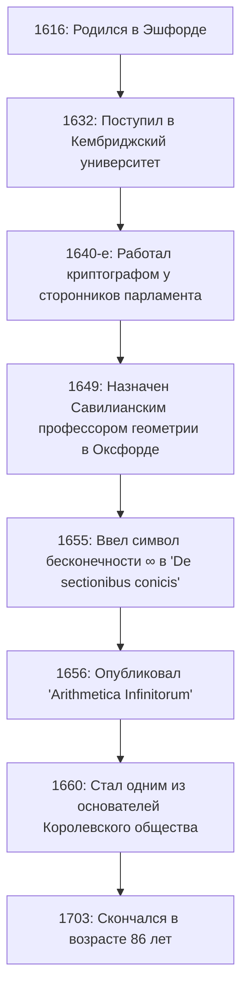

## Введение: Гений XVII века, символизировавший бесконечность

Символ **бесконечности** ( $\infty$ ) — это то, с чем мы сталкиваемся регулярно. Первым человеком, который ввел этот красивый и таинственный символ в мир математики, был английский математик XVII века **[Джон Валлис](https://kenji.blog/ru/p/wallis/)** (1616–1703). Он известен как фигура, сыгравшая исключительно важную роль в истории математики, проложив мост между аналитической геометрией [Рене Декарт](https://kenji.blog/ru/p/descartes/)а и математическим анализом Исаака Ньютона.

Европа XVII века была эпохой «Научной революции», когда такие фигуры, как Галилео Галилей, Иоганн Кеплер и [Рене Декарт](https://kenji.blog/ru/p/descartes/), закладывали основы современной науки и математики. В этих условиях Валлис преодолел ограничения классической греческой геометрии и открыл новые горизонты в математике, внедрив в геометрию алгебраические и аналитические методы. В этой статье мы глубоко погружаемся в бурную жизнь Валлиса, начиная с его уникального опыта работы криптографом и заканчивая его достижениями в области математики и физики, которые оказали огромное влияние на будущие поколения.

## Ранние годы и образование: Путь к медицине, логике и теологии

[Джон Валлис](https://kenji.blog/ru/p/wallis/) родился 23 ноября 1616 года в Эшфорде, графство Кент, Англия. Его отец был уважаемым приходским священником, и изначально ожидалось, что сам Валлис пойдет по пути священнослужителя. Чтобы избежать вспышки чумы в детстве, он переехал в школу в Тентердене, а позже овладел классическими языками, такими как латынь, греческий и иврит, в школе Фелстед в Эссексе.

В 1632 году он поступил в Эммануэль-колледж Кембриджского университета. В то время в Кембридже математика не считалась важной академической дисциплиной; она рассматривалась лишь как практический навык или арифметика для купцов. Поэтому сам он проявлял сильный интерес к медицине, анатомии, логике и теологии. Вдохновленный, в частности, теорией кровообращения Уильяма Гарвея, он добился отличных оценок в области анатомии. Что касается математики, то в детстве он лишь немного изучал арифметику со своим старшим братом, и прошло еще немного времени, прежде чем он всерьез погрузился в математику.

Получив степень магистра в 1640 году, Валлис продолжил свой путь священнослужителя, работая священником в таких местах, как Лондон. В этот период он также участвовал в теологических диспутах, развивая свои навыки логического и точного мышления.

## Гражданская война в Англии и деятельность в качестве криптографа

В 1640-х годах Англия была охвачена **Пуританской революцией** (Английской гражданской войной), войной между роялистами, поддерживавшими короля Карла I, и сторонниками парламента. Основываясь на своих политических и религиозных убеждениях, Валлис примкнул к парламентской фракции, и именно здесь произошел главный поворот в его жизни. Он обладал уникальным талантом расшифровывать зашифрованные письма врага.

Однажды в руки сторонников парламента попал криптографический документ роялистов. Валлису удалось расшифровать документ, который никто другой не мог понять, всего за несколько часов. Благодаря этому достижению он стал высоко цениться как официальный криптограф парламентской фракции.

Логическое мышление и аналитические навыки Валлиса в полной мере раскрылись в области криптографии. Он постоянно расшифровывал сложные коды роялистов и внес значительный вклад в победу парламента. Благодаря этому опыту в криптографии он резко улучшил свои математические способности обнаруживать сложные закономерности и манипулировать абстрактными символами. Способность разгадывать правила шифров напрямую привела к его последующей способности находить алгебраические закономерности в математике. Нет никаких сомнений в том, что его опыт того периода стал фундаментом для его более поздних математических достижений.

## Беспрецедентное назначение Савилианским профессором геометрии в Оксфорде

Когда гражданская война близилась к концу, и сторонники парламента взяли инициативу в свои руки, Валлис, внесший свой вклад в развитие режима, был высоко оценен. В 1649 году он был назначен **Савилианским профессором геометрии** в Оксфордском университете.

Это назначение вызвало огромное удивление у интеллектуалов того времени. Это было связано с тем, что до этого Валлис никогда не публиковал серьезных математических исследовательских работ, и его репутация математика практически отсутствовала. Однако он оставался на этом посту более полувека, пока не скончался в возрасте 86 лет, превратив Оксфорд в один из ведущих европейских центров математических исследований.

Валлис также принимал активное участие в собраниях ученых в Лондоне («Незримая коллегия») и, как один из членов-учредителей, внес большой вклад в создание **Королевского общества** в 1660 году. Королевскому обществу предстояло сыграть центральную роль в развитии современной науки.

На рисунке ниже представлена хронология основных событий в жизни Валлиса.

## Главные достижения в математике: Алгебраизация геометрии и вызов бесконечности

Вступив в должность Савилианского профессора, Валлис продвигал свои математические исследования поразительными темпами. Его величайшим достижением стал отход от классических геометрических методов и дальнейшее развитие методов аналитической геометрии Декарта.

### Введение символа бесконечности ' $\infty$ ' и 'De sectionibus conicis'

Один из самых известных вкладов Валлиса заключается в том, что он первым использовал ' $\infty$ ' как символ бесконечности в своей книге «De sectionibus conicis» (Трактат о конических сечениях), опубликованной в 1655 году.

До тех пор конические сечения (эллипс, парабола, гипербола) рассматривались с точки зрения стереометрии, буквально как поперечные сечения, когда конус пересекается плоскостью. Однако Валлис переопределил их как алгебраические уравнения (квадратичные кривые), используя координаты на плоскости. В этом новаторском подходе он был вынужден оперировать понятием «бесконечного продолжения» в математических формулах и поэтому ввел символ ' $\infty$ '.

Существуют различные теории о происхождении этого символа, включая ту, что он произошел от «CIƆ», что представляет собой римскую цифру 1000, и другую, что он происходит от греческой буквы омега, ' $\omega$ ', последней буквы алфавита. В любом случае, придание ясного символа абстрактному понятию бесконечности и превращение его в объект алгебраических манипуляций способствовали значительному развитию последующей математики.

### 'Arithmetica Infinitorum' и путь к математическому анализу

Его главный труд, «Arithmetica Infinitorum» (Арифметика бесконечно малых), опубликованный в 1656 году, считается его величайшим шедевром и одной из самых важных работ в истории математического анализа.

В этой работе Валлис развил «метод неделимых» (метод рассмотрения фигуры как совокупности бесконечно тонких линий или поверхностей) Иоганна Кеплера и Бонавентуры Кавальери, представив революционный метод нахождения площади, ограниченной кривой (интегрирования), с использованием бесконечных рядов. В то время как метод Кавальери был геометрическим, метод Валлиса был в высшей степени алгебраическим и аналитическим.

Используя индуктивные рассуждения, он вывел следующую формулу интегрирования (в современных обозначениях):

$$
\int_{0}^{1} x^p \, dx = \frac{1}{p+1}
$$

Первоначально эта формула была доказана только для случая, когда $p$ — целое положительное число. Но смелость Валлиса заключалась в его предположении (интерполяции), что **этот закон должен выполняться даже для дробей или отрицательных чисел**.

Более того, он систематизировал понятия отрицательных и дробных показателей степени, резко расширив выразительные возможности алгебры. Например, такие обозначения, как $x^{-n} = \frac{1}{x^n}$ и $x^{1/n} = \sqrt[n]{x}$, были обобщены им и стали основой математического языка, которым мы естественно пользуемся сегодня.

### Формула Валлиса (Бесконечное произведение для Пи)

В «Arithmetica Infinitorum» Валлис взялся за сложную задачу вычисления площади круга (то есть интеграла $\int_{0}^{1} \sqrt{1-x^2} \, dx$). Поскольку он не мог проинтегрировать это напрямую, он использовал весьма оригинальный метод «интерполяции» между интегральными значениями известных функций.

В конце своих сложных вычислений он вывел красивую формулу, выражающую круговую константу $\pi$ в виде бесконечного произведения, известную как **формула Валлиса**.

$$
\frac{\pi}{2} = \prod_{n=1}^{\infty} \frac{4n^2}{4n^2 - 1} = \frac{2}{1} \cdot \frac{2}{3} \cdot \frac{4}{3} \cdot \frac{4}{5} \cdot \frac{6}{5} \cdot \frac{6}{7} \cdots
$$

Эта формула продемонстрировала, что трансцендентное число $\pi$ можно выразить исключительно с помощью бесконечного умножения простых рациональных чисел, вообще без использования иррациональных чисел или квадратных корней, что вызвало настоящий шок в математическом мире того времени. Это открытие показало миру мощь бесконечных рядов и бесконечных произведений.

## Вклад в физику, лингвистику и образование

Блестящий ум Валлиса не останавливался на царстве чистой математики.

### Формулировка закона сохранения импульса

В 1668 году, когда Королевское общество объявило публичный конкурс работ о «законах столкновения тел», Валлис представил решение вместе с Кристофером Реном и Христианом Гюйгенсом. Валлис рассмотрел неупругие столкновения (при которых тела слипаются при столкновении) и математически строго сформулировал **закон сохранения импульса**, который гласит, что сумма импульсов сохраняется до и после столкновения. Это было чрезвычайно важное достижение в физике, которое стало основой более поздней ньютоновской механики.

### Учебник английской грамматики и обучение глухих

Его интерес к языку также был глубок; в 1653 году он опубликовал «Grammatica Linguae Anglicanae» (Грамматика английского языка). Эта книга, написанная на латыни, логически объясняла структуру английского языка для иностранцев и на протяжении многих лет использовалась в качестве стандартного учебника.

Более того, Валлис обладал глубокими знаниями в области фонетики и предпринял новаторскую попытку обучения глухонемых речи. Применяя свои собственные лингвистические и фонетические знания, он смог научить говорить молодых глухих людей. В связи с этим достижением разгорелся ожесточенный спор о приоритете между ним и Уильямом Холдером, который также занимался обучением глухих.

## Ожесточенная полемика с Томасом Гоббсом

Для рассказа истории жизни Валлиса существенным является его долгий и напряженный спор с философом **Томасом Гоббсом**.

Гоббс утверждал, что решил «задачу о квадратуре круга» (задачу построения квадрата с той же площадью, что и данный круг, используя только циркуль и линейку). В современной математике доказано, что квадратура круга невозможна, поскольку $\pi$ является трансцендентным числом, но в то время она еще не была решена.

Будучи выдающимся математиком, Валлис сразу же увидел ошибки в геометрическом доказательстве Гоббса и безжалостно раскритиковал его. Гоббс восстал против этого, и спор вышел за рамки чистой математики, затронув политику, религию и личную клевету. Этот спор длился четверть века, пока Гоббс не скончался, и известен как эпизод, иллюстрирующий бескомпромиссный и строгий характер Валлиса.

## Огромное влияние на молодого Исаака Ньютона

«Arithmetica Infinitorum» Валлиса оказала неизмеримое влияние на одного молодого человека, который впоследствии в корне перевернул историю науки. Этим молодым человеком был **[Исаак Ньютон](https://kenji.blog/ru/p/newton/)**.

Во время учебы в Кембриджском университете Ньютон внимательно прочитал «Arithmetica Infinitorum» Валлиса и был глубоко впечатлен. Дальнейшим обобщением и расширением метода интерполяции Валлиса Ньютон открыл **обобщенную биномиальную теорему** для любой рациональной степени. Более того, развивая алгебраическую концепцию пределов Валлиса, он, наконец, пришел к созданию **математического анализа**.

Если бы «Arithmetica Infinitorum» Валлиса не существовало, открытие математического анализа Ньютоном могло бы быть значительно отложено или оно могло бы принять совершенно иную форму.

Сам Валлис высоко ценил исключительный талант Ньютона и настоятельно призывал его опубликовать результаты своих исследований по математическому анализу. Позже, когда между Ньютоном и Готфридом Лейбницем вспыхнул ожесточенный спор о «приоритете в открытии математического анализа», Валлис полностью поддержал Ньютона в качестве могущественного защитника британской стороны.

## Заключение: Великий мост в истории математики

[Джон Валлис](https://kenji.blog/ru/p/wallis/) продолжал активно работать в качестве ведущего ученого вплоть до своей кончины в 1703 году в возрасте 86 лет.

Он сыграл решающую роль **моста** в переходный период от геометрии, ориентированной на фигуры, которая продолжалась со времен Древней Греции, к современному анализу, который свободно манипулирует математическими формулами. Сила логического мышления, взращенная криптографией, и сила воображения, позволяющая делать смелые предположения на неизведанных территориях. Его достижения, рожденные из слияния этих элементов, были унаследованы следующим поколением гениев, таких как Ньютон, и продолжают жить сегодня как фундамент современной математики и науки.

Когда мы небрежно рисуем символ ' $\infty$ ', в нем запечатлено дыхание великого интеллекта Джона Валлиса, который пережил бурный XVII век и вонзил скальпель логики в божественное царство бесконечности.
