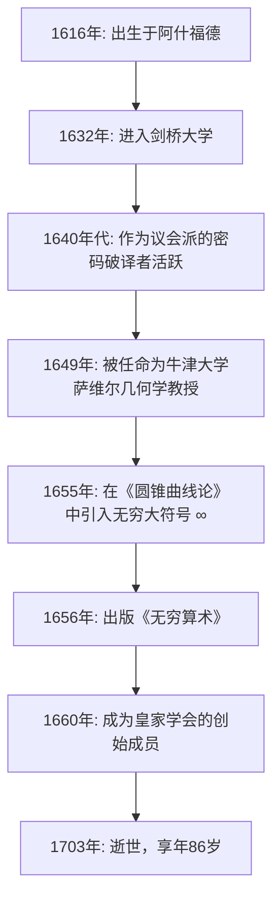

## 引言：将无穷大符号化的17世纪天才

我们经常会看到 **无穷大** （ $\infty$ ）这个符号。而第一位将这个美丽又神秘的符号引入数学世界的人，正是17世纪英国的数学家 **[约翰·沃利斯](https://kenji.blog/zh-cn/p/wallis/)** （John Wallis, 1616–1703）。在数学史上，他扮演着极其重要的角色，可以说是连接勒内·笛卡尔的解析几何与[艾萨克·牛顿](https://kenji.blog/zh-cn/p/newton/)的微积分之间的重要桥梁。

17世纪的欧洲正值“科学革命”时期，伽利略·伽利莱、约翰内斯·开普勒和[勒内·笛卡尔](https://kenji.blog/zh-cn/p/descartes/)等巨匠正在为现代科学和数学奠定基础。在这样的背景下，沃利斯打破了古希腊古典几何学的局限，通过将代数与分析方法引入几何学，开创了数学的新疆界。在本文中，我们将深入挖掘沃利斯波澜壮阔的一生，从他作为密码破译者的独特经历，到他对后世产生深远影响的数学与物理学成就。

## 早年生活与教育：通向医学、逻辑学与神学之路

[约翰·沃利斯](https://kenji.blog/zh-cn/p/wallis/)于1616年11月23日出生在英国肯特郡的阿什福德。他的父亲是一位受人尊敬的教区牧师，而沃利斯本人最初也被期望能够走上神职人员的道路。童年时期，为了躲避一场瘟疫，他转学到了坦特登的一所学校，后来在埃塞克斯郡的费尔斯特德学校精通了拉丁语、希腊语和希伯来语等古典语言。

1632年，他进入了剑桥大学伊曼纽尔学院。当时的剑桥大学并不把数学作为一门主要的学术课程来重视，数学仅仅被视为一种实用技能或是商人的算术。因此，他本人对医学、解剖学、逻辑学以及神学产生了浓厚的兴趣。尤其是受到威廉·哈维血液循环理论的启发，他在解剖学领域取得了优异的成绩。至于数学，他仅仅在童年时期跟着哥哥学了一点算术，直到后来他才真正开始潜心研究数学。

1640年获得硕士学位后，沃利斯走上了神职人员的道路，在伦敦等地担任牧师。在此时期，他也参与了神学辩论，培养了其逻辑严密、精准的思维能力。

## 英国内战与作为密码破译者的活跃表现

到了1640年代，英国卷入了 **清教徒革命** （英国内战）的漩涡，这是支持查理一世的保皇派与支持议会的议会派之间的一场战争。出于政治和宗教信仰，沃利斯加入了议会派，而这也是他人生中一个重大的转折点。他拥有一种独特的天赋，能够破译敌人加密的信件。

有一天，一份保皇派的密码文件落入了议会派手中。其他人都无法看懂，但沃利斯仅用了几个小时就成功破译了这份文件。由于这一成就，他受到了高度重视，成为了议会派的官方密码破译者。

沃利斯的逻辑思维和分析能力在密码学领域得到了极大的展现。他不断破译保皇派复杂的密码，为议会派的胜利做出了重大贡献。通过这种密码破译的经验，他极大地提升了发现复杂模式以及操作抽象符号的数学能力。看透密码规则的能力，直接引导了他日后在数学中发现代数规律的能力。毫无疑问，他这一时期的经验成为了他日后数学成就的基石。

## 破格被任命为牛津大学萨维尔几何学教授

随着内战走向尾声，议会派掌握了主动权，为新政权做出贡献的沃利斯得到了极高的评价。1649年，他被任命为牛津大学的 **萨维尔几何学教授** （Savilian Professor of Geometry）。

这项任命让当时的知识分子们大吃一惊。因为沃利斯在那之前从未发表过任何严肃的数学研究论文，他作为数学家的名声几乎为零。然而，他在此职位上任职了半个多世纪，直到86岁逝世，并将牛津大学转变为欧洲顶尖的数学研究中心之一。

沃利斯还积极参与伦敦科学家的聚会（即“无形学院”），并作为创始成员之一，为1660年 **皇家学会** （Royal Society）的成立做出了巨大贡献。皇家学会后来在现代科学的发展中发挥了核心作用。

下图展示了沃利斯一生中主要事件的时间轴。

## 数学上的主要成就：几何的代数化与对无穷的挑战

就任萨维尔教授后，沃利斯以惊人的速度推进他的数学研究。他最大的成就是摆脱了古典几何方法的束缚，进一步发展了笛卡尔的解析几何方法。

### 引入无穷大符号“ $\infty$ ”与《圆锥曲线论》

沃利斯最著名的贡献之一，便是在1655年出版的著作《圆锥曲线论》（De sectionibus conicis）中，首次使用“ $\infty$ ”作为无穷大的符号。

在此之前，圆锥曲线（椭圆、抛物线、双曲线）一直是从立体几何的角度来处理的，字面意思就是当圆锥被一个平面切割时的截面。然而，沃利斯利用平面上的坐标，将其重新定义为代数方程（二次曲线）。在这一革命性的方法中，他被迫在数学公式中处理“无限延伸”的概念，因此引入了“ $\infty$ ”这个符号。

关于这个符号的起源有多种说法，其中包括它衍生自代表罗马数字1000的“CIƆ”，另一种说法认为它来自于希腊字母的最后一个字母欧米伽“ $\omega$ ”。无论如何，通过为一个抽象的无穷概念赋予明确的符号，并将其作为代数操作的对象，后世的数学得到了显著的发展。

### 《无穷算术》与通向微积分之路

他于1656年出版的代表作《无穷算术》（Arithmetica Infinitorum），被认为是他最伟大的杰作，也是微积分史上最重要的著作之一。

在这部著作中，沃利斯进一步发展了约翰内斯·开普勒和卡瓦列里的“不可分量方法”（将图形视为由无限多条无限细的线或面组成的集合的方法），提出了一种使用无穷级数求曲线所围面积（积分）的革命性方法。卡瓦列里的方法是几何性质的，而沃利斯的方法则极其代数化和解析化。

他利用归纳推理，推导出了以下积分公式（以现代记法表示）：

$$
\int_{0}^{1} x^p \, dx = \frac{1}{p+1}
$$

最初，这个公式仅仅在 $p$ 为正整数的情况下才被证明。但沃利斯的大胆之处在于，他推测（插值） **这一定律即使对于分数或负数也同样成立** 。

此外，他系统化了负指数和分数指数的概念，极大地扩展了代数学的表达能力。例如，像 $x^{-n} = \frac{1}{x^n}$ 和 $x^{1/n} = \sqrt[n]{x}$ 这样的记号，都是由他推广并成为我们今天习以为常的数学语言的基础。

### 沃利斯乘积（圆周率的无穷乘积）

在《无穷算术》中，沃利斯攻克了计算圆面积（即积分 $\int_{0}^{1} \sqrt{1-x^2} \, dx$ ）这一难题。由于无法直接对它进行积分，他采用了一种极具创意的“插值”方法，在已知函数的积分值之间进行插值。

在经历了复杂的计算之后，他推导出了一个将圆周率 $\pi$ 表示为无穷乘积的优美公式，即著名的 **沃利斯乘积** 。

$$
\frac{\pi}{2} = \prod_{n=1}^{\infty} \frac{4n^2}{4n^2 - 1} = \frac{2}{1} \cdot \frac{2}{3} \cdot \frac{4}{3} \cdot \frac{4}{5} \cdot \frac{6}{5} \cdot \frac{6}{7} \cdots
$$

这个公式证明了超越数 $\pi$ 可以仅仅通过简单有理数的无限次相乘来表示，而完全不使用无理数或平方根，这在当时的数学界引起了巨大的轰动。这项发现向世界展示了无穷级数和无穷乘积的威力。

## 对物理学、语言学和教育学的贡献

沃利斯那天才般的头脑并没有仅仅停留在纯数学领域。

### 动量守恒定律的公式化

1668年，当皇家学会公开征集关于“物体碰撞定律”的论文时，沃利斯与克里斯托弗·雷恩以及克里斯蒂安·惠更斯共同提交了解答。沃利斯考察了非弹性碰撞（即物体碰撞后粘在一起的情况），在数学上严格地将 **动量守恒定律** 公式化，该定律指出碰撞前后的动量总和是守恒的。这是物理学上一个极其重要的成就，并成为了后来牛顿力学的基础。

### 英语语法书与聋哑人教育

他对语言也有着深厚的兴趣；1653年，他出版了《英语语法》（Grammatica Linguae Anglicanae）。这本书用拉丁语写成，逻辑严密地为外国人解释了英语的结构，并作为标准教科书使用了许多年。

此外，沃利斯在语音学方面也有着深厚的造诣，并开创性地尝试教导聋哑人说话。运用他自己的语言学和语音学知识，他成功地让失聪的年轻人开口说话。关于这项成就，他与另一位也从事聋哑人教育的威廉·霍尔德之间爆发了激烈的优先权之争。

## 与托马斯·霍布斯的激烈论战

在讲述沃利斯生平的故事中，必不可少的是他与哲学家 **托马斯·霍布斯** （Thomas Hobbes）之间长达多年且极其激烈的争论。

霍布斯声称自己解决了“化圆为方”问题（即仅使用直尺和圆规，构造一个与给定圆面积相等的正方形的问题）。在现代数学中，因为 $\pi$ 是一个超越数，化圆为方已经被证明是不可能的，但在当时它还是一个未解之谜。

作为一位杰出的数学家，沃利斯一眼就看出了霍布斯几何证明中的错误，并毫不留情地批评了他。霍布斯对此予以反击，论战便从纯数学领域升级到了政治、宗教以及人身攻击的层面。这场争论持续了四分之一个世纪，直到霍布斯去世，它也作为一个展现沃利斯毫不妥协和严厉性格的事件而闻名。

## 对青年[艾萨克·牛顿](https://kenji.blog/zh-cn/p/newton/)的巨大影响

沃利斯的《无穷算术》对一位年轻人产生了无法估量的影响，而这位年轻人后来从根本上颠覆了科学的历史。这个年轻人就是 **[艾萨克·牛顿](https://kenji.blog/zh-cn/p/newton/)** （[Isaac Newton](https://kenji.blog/zh-cn/p/newton/)）。

在剑桥大学求学期间，牛顿仔细阅读了沃利斯的《无穷算术》，并留下了极其深刻的印象。通过进一步推广和扩展沃利斯的插值方法，牛顿发现了适用于任何有理数幂的 **广义二项式定理** 。不仅如此，通过推进沃利斯的代数极限概念，牛顿最终走到了 **微积分** 诞生的门槛。

如果沃利斯的《无穷算术》不曾存在，牛顿发现微积分的时间可能会被大幅推迟，或者它可能会呈现出完全不同的形式。

沃利斯本人对牛顿的非凡才华大加赞赏，并极力敦促他发表其关于微积分的研究成果。后来，当牛顿与[戈特弗里德·莱布尼茨](https://kenji.blog/zh-cn/p/leibniz/)之间爆发了激烈的“微积分发明优先权”之争时，沃利斯作为英国阵营的有力拥护者，全力支持牛顿。

## 结语：数学史上的一座伟大桥梁

[约翰·沃利斯](https://kenji.blog/zh-cn/p/wallis/)作为一位顶尖学者，一直活跃到1703年以86岁高龄逝世为止。

在从古希腊延续下来的以图形为中心的几何学，向量化地自由操作数学公式的近代分析学过渡的时期，他扮演了极其重要的 **桥梁** 角色。通过破译密码培养出来的逻辑推理能力，加上在未知领域进行大胆推测的想象力。由这些元素的融合而诞生的他的成就，被像牛顿这样的下一代天才所继承，并作为现代数学与科学的基石，直到今天依然充满生机。

当我们漫不经心地画出“ $\infty$ ”这个符号时，它里面铭刻着一位伟大智者——[约翰·沃利斯](https://kenji.blog/zh-cn/p/wallis/)的呼吸，他度过了动荡的17世纪，将逻辑的手术刀插入了无穷大那神圣的领域。
