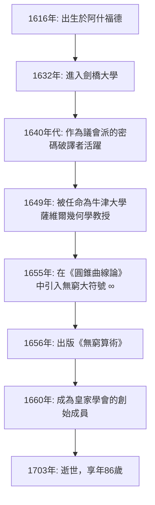

## 引言：將無窮大符號化的17世紀天才

我們經常會看到 **無窮大** （ $\infty$ ）這個符號。而第一位將這個美麗又神秘的符號引入數學世界的人，正是17世紀英國的數學家 **[約翰·沃利斯](https://kenji.blog/p/wallis/)** （[John Wallis](https://kenji.blog/p/wallis/), 1616–1703）。在數學史上，他扮演著極其重要的角色，可以說是連接勒內·笛卡爾的解析幾何與[艾薩克·牛頓](https://kenji.blog/p/newton/)的微積分之間的重要橋樑。

17世紀的歐洲正值“科學革命”時期，伽利略·伽利萊、約翰內斯·開普勒和勒內·笛卡爾等巨匠正在為現代科學和數學奠定基礎。在這樣的背景下，沃利斯打破了古希臘古典幾何學的局限，通過將代數與分析方法引入幾何學，開創了數學的新疆界。在本文中，我們將深入挖掘沃利斯波瀾壯闊的一生，從他作為密碼破譯者的獨特經歷，到他對後世產生深遠影響的數學與物理學成就。

## 早年生活與教育：通向醫學、邏輯學與神學之路

[約翰·沃利斯](https://kenji.blog/p/wallis/)於1616年11月23日出生在英國肯特郡的阿什福德。他的父親是一位受人尊敬的教區牧師，而沃利斯本人最初也被期望能夠走上神職人員的道路。童年時期，為了躲避一場瘟疫，他轉學到了坦特登的一所學校，後來在埃塞克斯郡的費爾斯特德學校精通了拉丁語、希臘語和希伯來語等古典語言。

1632年，他進入了劍橋大學伊曼紐爾學院。當時的劍橋大學並不把數學作為一門主要的學術課程來重視，數學僅僅被視為一種實用技能或是商人的算術。因此，他本人對醫學、解剖學、邏輯學以及神學產生了濃厚的興趣。尤其是受到威廉·哈維血液循環理論的啟發，他在解剖學領域取得了優異的成績。至於數學，他僅僅在童年時期跟著哥哥學了一點算術，直到後來他才真正開始潛心研究數學。

1640年獲得碩士學位後，沃利斯走上了神職人員的道路，在倫敦等地擔任牧師。在此時期，他也參與了神學辯論，培養了其邏輯嚴密、精準的思維能力。

## 英國內戰與作為密碼破譯者的活躍表現

到了1640年代，英國捲入了 **清教徒革命** （英國內戰）的漩渦，這是支持查理一世的保皇派與支持議會的議會派之間的一場戰爭。出於政治和宗教信仰，沃利斯加入了議會派，而這也是他人生中一個重大的轉折點。他擁有一種獨特的天賦，能夠破譯敵人加密的信件。

有一天，一份保皇派的密碼文件落入了議會派手中。其他人都無法看懂，但沃利斯僅用了幾個小時就成功破譯了這份文件。由於這一成就，他受到了高度重視，成為了議會派的官方密碼破譯者。

沃利斯的邏輯思維和分析能力在密碼學領域得到了極大的展現。他不斷破譯保皇派複雜的密碼，為議會派的勝利做出了重大貢獻。通過這種密碼破譯的經驗，他極大地提升了發現複雜模式以及操作抽象符號的數學能力。看透密碼規則的能力，直接引導了他日後在數學中發現代數規律的能力。毫無疑問，他這一時期的經驗成為了他日後數學成就的基石。

## 破格被任命為牛津大學薩維爾幾何學教授

隨著內戰走向尾聲，議會派掌握了主動權，為新政權做出貢獻的沃利斯得到了極高的評價。1649年，他被任命為牛津大學的 **薩維爾幾何學教授** （Savilian Professor of Geometry）。

這項任命讓當時的知識分子們大吃一驚。因為沃利斯在那之前從未發表過任何嚴肅的數學研究論文，他作為數學家的名聲幾乎為零。然而，他在此職位上任職了半個多世紀，直到86歲逝世，並將牛津大學轉變為歐洲頂尖的數學研究中心之一。

沃利斯還積極參與倫敦科學家的聚會（即“無形學院”），並作為創始成員之一，為1660年 **皇家學會** （Royal Society）的成立做出了巨大貢獻。皇家學會後來在現代科學的發展中發揮了核心作用。

下圖展示了沃利斯一生中主要事件的時間軸。

## 數學上的主要成就：幾何的代數化與對無窮的挑戰

就任薩維爾教授後，沃利斯以驚人的速度推進他的數學研究。他最大的成就是擺脫了古典幾何方法的束縛，進一步發展了笛卡爾的解析幾何方法。

### 引入無窮大符號“ $\infty$ ”與《圓錐曲線論》

沃利斯最著名的貢獻之一，便是在1655年出版的著作《圓錐曲線論》（De sectionibus conicis）中，首次使用“ $\infty$ ”作為無窮大的符號。

在此之前，圓錐曲線（橢圓、拋物線、雙曲線）一直是從立體幾何的角度來處理的，字面意思就是當圓錐被一個平面切割時的截面。然而，沃利斯利用平面上的坐標，將其重新定義為代數方程（二次曲線）。在這一革命性的方法中，他被迫在數學公式中處理“無限延伸”的概念，因此引入了“ $\infty$ ”這個符號。

關於這個符號的起源有多種說法，其中包括它衍生自代表羅馬數字1000的“CIƆ”，另一種說法認為它來自於希臘字母的最後一個字母歐米伽“ $\omega$ ”。無論如何，通過為一個抽象的無窮概念賦予明確的符號，並將其作為代數操作的對象，後世的數學得到了顯著的發展。

### 《無窮算術》與通向微積分之路

他於1656年出版的代表作《無窮算術》（Arithmetica Infinitorum），被認為是他最偉大的傑作，也是微積分史上最重要的著作之一。

在這部著作中，沃利斯進一步發展了約翰內斯·開普勒和卡瓦列里的“不可分量方法”（將圖形視為由無限多條無限細的線或面組成的集合的方法），提出了一種使用無窮級數求曲線所圍面積（積分）的革命性方法。卡瓦列里的方法是幾何性質的，而沃利斯的方法則極其代數化和解析化。

他利用歸納推理，推導出了以下積分公式（以現代記法表示）：

$$
\int_{0}^{1} x^p \, dx = \frac{1}{p+1}
$$

最初，這個公式僅僅在 $p$ 為正整數的情況下才被證明。但沃利斯的大膽之處在於，他推測（插值） **這一定律即使對於分數或負數也同樣成立** 。

此外，他系統化了負指數和分數指數的概念，極大地擴展了代數學的表達能力。例如，像 $x^{-n} = \frac{1}{x^n}$ 和 $x^{1/n} = \sqrt[n]{x}$ 這樣的記號，都是由他推廣並成為我們今天習以為常的數學語言的基礎。

### 沃利斯乘積（圓周率的無窮乘積）

在《無窮算術》中，沃利斯攻克了計算圓面積（即積分 $\int_{0}^{1} \sqrt{1-x^2} \, dx$ ）這一難題。由於無法直接對它進行積分，他採用了一種極具創意的“插值”方法，在已知函數的積分值之間進行插值。

在經歷了複雜的計算之後，他推導出了一個將圓周率 $\pi$ 表示為無窮乘積的優美公式，即著名的 **沃利斯乘積** 。

$$
\frac{\pi}{2} = \prod_{n=1}^{\infty} \frac{4n^2}{4n^2 - 1} = \frac{2}{1} \cdot \frac{2}{3} \cdot \frac{4}{3} \cdot \frac{4}{5} \cdot \frac{6}{5} \cdot \frac{6}{7} \cdots
$$

這個公式證明了超越數 $\pi$ 可以僅僅通過簡單有理數的無限次相乘來表示，而完全不使用無理數或平方根，這在當時的數學界引起了巨大的轟動。這項發現向世界展示了無窮級數和無窮乘積的威力。

## 對物理學、語言學和教育學的貢獻

沃利斯那天才般的頭腦並沒有僅僅停留在純數學領域。

### 動量守恆定律的公式化

1668年，當皇家學會公開徵集關於“物體碰撞定律”的論文時，沃利斯與克里斯托弗·雷恩以及克里斯蒂安·惠更斯共同提交了解答。沃利斯考察了非彈性碰撞（即物體碰撞後粘在一起的情況），在數學上嚴格地將 **動量守恆定律** 公式化，該定律指出碰撞前後的動量總和是守恆的。這是物理學上一個極其重要的成就，並成為了後來牛頓力學的基礎。

### 英語語法書與聾啞人教育

他對語言也有著深厚的興趣；1653年，他出版了《英語語法》（Grammatica Linguae Anglicanae）。這本書用拉丁語寫成，邏輯嚴密地為外國人解釋了英語的結構，並作為標準教科書使用了許多年。

此外，沃利斯在語音學方面也有著深厚的造詣，並開創性地嘗試教導聾啞人說話。運用他自己的語言學和語音學知識，他成功地讓失聰的年輕人開口說話。關於這項成就，他與另一位也從事聾啞人教育的威廉·霍爾德之間爆發了激烈的優先權之爭。

## 與托馬斯·霍布斯的激烈論戰

在講述沃利斯生平的故事中，必不可少的是他與哲學家 **托馬斯·霍布斯** （Thomas Hobbes）之間長達多年且極其激烈的爭論。

霍布斯聲稱自己解決了“化圓為方”問題（即僅使用直尺和圓規，構造一個與給定圓面積相等的正方形的問題）。在現代數學中，因為 $\pi$ 是一個超越數，化圓為方已經被證明是不可能的，但在當時它還是一個未解之謎。

作為一位傑出的數學家，沃利斯一眼就看出了霍布斯幾何證明中的錯誤，並毫不留情地批評了他。霍布斯對此予以反擊，論戰便從純數學領域升級到了政治、宗教以及人身攻擊的層面。這場爭論持續了四分之一個世紀，直到霍布斯去世，它也作為一個展現沃利斯毫不妥協和嚴厲性格的事件而聞名。

## 對青年[艾薩克·牛頓](https://kenji.blog/p/newton/)的巨大影響

沃利斯的《無窮算術》對一位年輕人產生了無法估量的影響，而這位年輕人後來從根本上顛覆了科學的歷史。這個年輕人就是 **[艾薩克·牛頓](https://kenji.blog/p/newton/)** （[Isaac Newton](https://kenji.blog/p/newton/)）。

在劍橋大學求學期間，牛頓仔細閱讀了沃利斯的《無窮算術》，並留下了極其深刻的印象。通過進一步推廣和擴展沃利斯的插值方法，牛頓發現了適用於任何有理數冪的 **廣義二項式定理** 。不僅如此，通過推進沃利斯的代數極限概念，牛頓最終走到了 **微積分** 誕生的門檻。

如果沃利斯的《無窮算術》不曾存在，牛頓發現微積分的時間可能會被大幅推遲，或者它可能會呈現出完全不同的形式。

沃利斯本人對牛頓的非凡才華大加讚賞，並極力敦促他發表其關於微積分的研究成果。後來，當牛頓與[戈特弗里德·萊布尼茨](https://kenji.blog/p/leibniz/)之間爆發了激烈的“微積分發明優先權”之爭時，沃利斯作為英國陣營的有力擁護者，全力支持牛頓。

## 結語：數學史上的一座偉大橋樑

[約翰·沃利斯](https://kenji.blog/p/wallis/)作為一位頂尖學者，一直活躍到1703年以86歲高齡逝世為止。

在從古希臘延續下來的以圖形為中心的幾何學，向量化地自由操作數學公式的近代分析學過渡的時期，他扮演了極其重要的 **橋樑** 角色。通過破譯密碼培養出來的邏輯推理能力，加上在未知領域進行大膽推測的想像力。由這些元素的融合而誕生的他的成就，被像牛頓這樣的下一代天才所繼承，並作為現代數學與科學的基石，直到今天依然充滿生機。

當我們漫不經心地畫出“ $\infty$ ”這個符號時，它裡面銘刻著一位偉大智者——[約翰·沃利斯](https://kenji.blog/p/wallis/)的呼吸，他度過了動盪的17世紀，將邏輯的手術刀插入了無窮大那神聖的領域。
