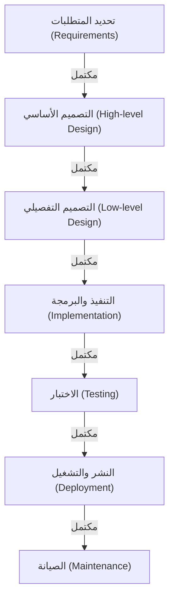

# نموذج الشلال: السعي نحو التقاليد واليقين في تطوير البرمجيات

في تاريخ تطوير البرمجيات، يُعد "نموذج الشلال" (Waterfall Model) من أقدم المنهجيات التي لا تزال تحتفظ بمكانة راسخة في مجالات معينة حتى يومنا هذا. تماماً كما يتدفق الماء في الشلال، تكتمل مرحلة واحدة قبل الانتقال إلى المرحلة التي تليها. وقد عمل هذا النهج كمعيار واقعي لتطوير الأنظمة لسنوات عديدة بفضل هيكله البديهي والسهل الفهم.

في هذه المقالة، سنتعمق في أصول وتاريخ نموذج الشلال، ونقدم شرحاً مفصلاً لكل مرحلة، ونستكشف الخلفية النظرية، بالإضافة إلى المزايا والعيوب. وعلاوة على ذلك، سنقارنه بمنهجية أجايل (Agile) الحديثة للتطوير، ونبحث في كيفية تكيف نموذج الشلال وتطوره في العصر الحالي.

## 1. أصول وتاريخ نموذج الشلال

يُعترف على نطاق واسع بأن مفهوم نموذج الشلال تم التعبير عنه بوضوح لأول مرة في ورقة بحثية نُشرت عام 1970 بعنوان "إدارة تطوير أنظمة البرمجيات الكبيرة" (Managing the Development of Large Software Systems) بواسطة وينستون دبليو رويس (Winston W. Royce).

ومع ذلك، من المفارقات التاريخية المثيرة للاهتمام أن رويس نفسه أشار في هذه الورقة إلى أن "العملية البسيطة من أعلى إلى أسفل (التي عُرفت لاحقاً بالشلال) تنطوي على مخاطر"، وشدد على أهمية حلقات التغذية الراجعة (التكرار) بين المراحل. وعلى الرغم من ذلك، ولأن التدفق أحادي الاتجاه الموضح في الورقة (المتطلبات ← التصميم ← التنفيذ ← الاختبار) كان سهل الفهم للغاية، فقد انتشر مصطلح "نموذج الشلال" بشكله الذي يفتقر إلى حلقات التغذية الراجعة.

في ثمانينيات القرن العشرين، وضعت وزارة الدفاع الأمريكية (DoD) المعيار "DOD-STD-2167" كمعيار قياسي لتطوير البرمجيات. وبما أن هذا المعيار فرض فعلياً عملية تشبه الشلال، فقد أصبح نموذج الشلال المنهجية القياسية المعتمدة بدءاً من الصناعات العسكرية والفضائية، وصولاً إلى تطوير الأنظمة الكبيرة في الشركات المدنية.

## 2. مراحل نموذج الشلال

يقسم نموذج الشلال دورة حياة تطوير البرمجيات إلى مراحل منطقية ومتسلسلة. فيما يلي الهيكل العام لمراحل نموذج الشلال:

### 2.1 تحديد المتطلبات (Requirements Gathering and Analysis)
هي نقطة الانطلاق للمشروع وأهم مرحلة على الإطلاق. يتم فيها الاستماع إلى متطلبات العملاء وأصحاب المصلحة وتحديد ما يجب أن يحققه النظام. لا تقتصر الوثائق التفصيلية على المتطلبات الوظيفية (ما يمكن للنظام فعله) فحسب، بل تشمل أيضاً المتطلبات غير الوظيفية (الأداء، الأمان، التوافر، وغيرها). المخرج من هذه المرحلة هو "وثيقة تحديد المتطلبات"، والتي تُعد الأساس لجميع المراحل اللاحقة.

### 2.2 تصميم النظام (System Design)
بناءً على وثيقة تحديد المتطلبات، يتم تصميم بنية النظام بأكمله. وينقسم عادة إلى مرحلتين: "التصميم الأساسي (التصميم الخارجي)" و"التصميم التفصيلي (التصميم الداخلي)".
- **التصميم الأساسي**: يختص بتصميم الأجزاء التي يراها المستخدم، مثل واجهة المستخدم، والتصميم المنطقي لقواعد البيانات، والتكامل بين الأنظمة.
- **التصميم التفصيلي**: يحول التصميم الأساسي إلى مستوى يمكن للمبرمجين كتابة التعليمات البرمجية بناءً عليه. ويتضمن ذلك مخططات الفئات، الخوارزميات، والتصميم المادي لقواعد البيانات.

### 2.3 التنفيذ والبرمجة (Implementation)
في هذه المرحلة، تتم كتابة الكود المصدري فعلياً وفقاً لوثيقة التصميم التفصيلي. إذا كان التصميم معداً بدقة، يمكن للمبرمجين التركيز بالكامل على كتابة الكود وإجراء اختبارات الوحدة (Unit Testing). عند هذه النقطة، تكتمل كل وحدة (مكون) من مكونات النظام.

### 2.4 الدمج واختبار النظام (Integration and Testing)
يتم دمج الوحدات الفردية التي تم تنفيذها للتحقق مما إذا كان النظام يعمل بشكل صحيح ككل.
- **اختبار الدمج**: يجمع بين وحدات متعددة للتأكد من عدم وجود تعارضات في الواجهات.
- **اختبار النظام**: يختبر ما إذا كان النظام بأكمله يلبي المواصفات المحددة في وثيقة تحديد المتطلبات. كما يتم إجراء اختبارات الأداء والأمان في هذه المرحلة.

### 2.5 النشر والتشغيل (Deployment)
بمجرد اكتمال الاختبارات وتلبية النظام لمعايير الجودة، يتم نشر النظام في بيئة الإنتاج الفعلية. هذه هي المرحلة التي يبدأ فيها المستخدمون النهائيون في استخدام النظام بشكل فعلي.

### 2.6 الصيانة (Maintenance)
تتضمن هذه المرحلة إصلاح الأخطاء التي تم اكتشافها بعد تشغيل النظام، والاستجابة لتحديثات أنظمة التشغيل أو البرمجيات الوسيطة، وإجراء تحسينات طفيفة على الميزات بسبب التغيرات البيئية. بشكل عام، تستهلك مرحلة الصيانة التكلفة والوقت الأكبر بالنظر إلى دورة حياة البرمجيات بأكملها.

## 3. الخلفية النظرية لنموذج الشلال

يعتبر نموذج الشلال تطبيقاً للمنهجيات الهندسية التقليدية (هندسة النظم) المستخدمة في صناعات تصنيع الأجهزة والبناء على تطوير البرمجيات. تماماً كما لا يمكنك وضع الأعمدة عند بناء منزل قبل الانتهاء من أعمال الأساس، يعتمد هذا النموذج على فرضية أنه في البرمجيات "لا يمكن الانتقال إلى التصنيع (البرمجة) قبل اكتمال المخططات (المتطلبات والتصميم)".

الأساس الذي يقوم عليه هذا النموذج هو الحاجة الماسة إلى **"القدرة على التنبؤ (Predictability)"** و**"القدرة على التحكم (Controllability)"**. في المشاريع واسعة النطاق، يشارك مئات المهندسين وتُخصص ميزانيات ضخمة. بالنسبة لمدير المشروع، من الضروري للغاية أن يكون قادراً على إدارة ومراقبة التقدم الحالي كمياً لمعرفة المرحلة الحالية، وموعد المعلم الرئيسي التالي (Milestone)، وما إذا كانت التكلفة ضمن الميزانية.

## 4. مزايا وقوة نموذج الشلال

### 4.1 معالم واضحة وإدارة التقدم
نظراً لأن شروط اكتمال كل مرحلة واضحة (على سبيل المثال: تكتمل مرحلة التصميم بـ "الموافقة على وثائق التصميم")، فمن السهل تتبع تقدم المشروع. يتوافق هذا النموذج بشكل جيد جداً مع إدارة الجداول الزمنية باستخدام مخططات جانت (Gantt Charts).

### 4.2 ضمان الجودة من خلال التوثيق
يتم الانتقال بين المراحل بشكل أساسي من خلال الوثائق (المواصفات، وثائق التصميم). يساعد هذا في منع احتكار المعرفة (حيث يعرف شخص معين فقط مواصفات النظام)، مما يسهل استمرار المشروع حتى إذا تغير أعضاء فريق التطوير خلال العملية.

### 4.3 دقة تقدير الميزانية والجدول الزمني
نظراً لأن تحديد المتطلبات والتصميم يتم إجراؤه بشكل شامل في مرحلة مبكرة، فمن الممكن تقدير ساعات العمل والتكاليف اللازمة للمشروع بأكمله بدقة نسبية في البداية. هذا عامل بالغ الأهمية في تطوير الأنظمة بموجب عقود السعر الثابت.

### 4.4 الامتثال التنظيمي
في المجالات التي تتطلب امتثالاً صارماً لعمليات التدقيق واللوائح القانونية، مثل برمجيات الأجهزة الطبية، وأنظمة التحكم في الطائرات، والأنظمة الأساسية للمؤسسات المالية، غالباً ما يكون نموذج الشلال أمراً إلزامياً لأنه يوفر وثائق مفصلة وسجلاً للموافقات لكل عملية.

## 5. عيوب وانتقادات نموذج الشلال

### 5.1 ضعف القدرة على التكيف مع التغيير (الجمود)
أكبر نقطة ضعف في نموذج الشلال هي هشاشته الكبيرة أمام التغييرات في المتطلبات. إذا حدثت فجوات في المتطلبات أو تغييرات في المواصفات في مرحلة لاحقة (مثل مرحلة الاختبار)، فيجب العودة إلى مراحل التصميم أو تحديد المتطلبات وإعادة العمل، مما يؤدي إلى تكاليف ضخمة وتأخير كبير في الوقت.

### 5.2 تأخر رؤية العميل للمنتج النهائي
على الرغم من التوصل إلى اتفاق مع العميل في مرحلة تحديد المتطلبات، إلا أن العميل لن يتمكن من لمس برمجيات تعمل فعلياً إلا في المراحل النهائية من المشروع (مرحلة الاختبار أو مرحلة التشغيل). غالباً ما يكون هناك تباين بين "المواصفات على الورق" و"قابلية الاستخدام الفعلية"، وهناك خطر حدوث فجوة كبيرة في الفهم تظهر قريباً من الإنجاز متمثلة في عبارة "هذا ليس ما كنت أتوقعه".

### 5.3 خطر "تكامل الانفجار العظيم"
نظراً لأنه يتم دمج جميع الوحدات معاً لاختبارها في النهاية بعد اكتمالها، فغالباً ما تظهر مشاكل متعددة في وقت واحد. يصبح تحديد المشاكل صعباً، مما يتسبب في تأخيرات كبيرة في الجدول الزمني خلال مرحلة الاختبار.

## 6. الشلال مقابل أجايل: مقارنة النماذج

منذ العقد الأول من القرن الحادي والعشرين، تحول الاتجاه السائد في تطوير البرمجيات نحو "تطوير أجايل" (Agile Development). يكمن الاختلاف الرئيسي بينهما في نهجهما تجاه عدم اليقين.

| الميزة | نموذج الشلال | أجايل |
|---|---|---|
| **الفلسفة الأساسية** | التركيز على المضي قدماً حسب الخطة | التركيز على التكيف مع التغيير |
| **تحديد المتطلبات** | ثابتة بالكامل في بداية المشروع | مراجعة مستمرة أثناء تقدم التطوير |
| **دورة التطوير** | دورة واحدة واسعة النطاق | دورات تكرارية قصيرة (1-4 أسابيع) |
| **التوثيق** | يتطلب وثائق شاملة ومفصلة | الأولوية للبرمجيات التي تعمل |
| **مشاركة العميل** | تتركز في البداية (المتطلبات) والنهاية (القبول) | مشاركة مستمرة طوال المشروع |
| **المشاريع المناسبة** | مواصفات واضحة وغير متغيرة، ضخمة، وحرجة للمهام | مواصفات غير مؤكدة، تغير سريع في السوق، ومشاريع جديدة |

بينما يدير نموذج الشلال المخاطر من خلال "تقليل التغيير"، يتقبل أجايل أن "التغيير أمر حتمي" ويوزع المخاطر من خلال إصدارات صغيرة ومتكررة.

## 7. تطور وتطبيق نموذج الشلال في العصر الحديث

حتى في العصر الحديث الذي يهيمن عليه أجايل، لم يختفِ نموذج الشلال. بل يتم استخدامه في المكان المناسب، وقد تطور لتعويض نقاط ضعفه.

### 7.1 نموذج V (V-Model)
هو نموذج يوضح العلاقة بين مراحل التطوير ومراحل الاختبار في الشلال. على سبيل المثال، الاختبار المقابل لـ "التصميم الأساسي" هو "اختبار النظام"، والاختبار المقابل لـ "التصميم التفصيلي" هو "اختبار الدمج". من خلال ربط الجانب الأيسر (التطوير) بالجانب الأيمن (الاختبار) من شكل الحرف V، فإنه يحسن جودة الاختبار وإمكانية التتبع.

### 7.2 نموذج الساشيمي (Sashimi Model)
بدلاً من جعل المراحل متسلسلة تماماً، يسمح هذا النهج بتداخل المراحل، تماماً مثل شرائح الساشيمي. على سبيل المثال، لتقليل وقت التطوير، يبدأ التنفيذ في الأجزاء التي تم تأكيدها قبل اكتمال جميع التصاميم.

### 7.3 الهجين بين الشلال وأجايل
في المشاريع واسعة النطاق، تتبنى المزيد من الشركات "نهجاً هجيناً" حيث يتم تحديد البنية الأساسية وتحديد المتطلبات للنظام بأكمله بصرامة باستخدام الشلال، بينما يتم تطوير وحدات الميزات الفردية بشكل تكراري باستخدام أجايل (مثل سكروم Scrum).

## 8. الخلاصة: سلسلة الهندسة التي تسعى لليقين

غالباً ما يُنتقد نموذج الشلال لكونه "قديماً" أو "عفا عليه الزمن". ومع ذلك، فإن الفلسفة الكامنة وراءه المتمثلة في "تحديد ما سيتم بناؤه بوضوح، ووضع خطة، وتنفيذها بتسلسل" هي واحدة من أهم أساسيات هندسة النظم.

السبب الذي يمكن البشرية من إطلاق صواريخ إلى الفضاء وبناء جسور ضخمة هو هذا النهج القائم على التخطيط. حتى في تطوير البرمجيات، ستظل "القدرة على التنبؤ" و"المساءلة" التي يوفرها نموذج الشلال أمراً لا غنى عنه للمشاريع التي "لا يُسمح فيها بالفشل مطلقاً"، مثل الأنظمة الطبية التي تؤثر على حياة البشر أو الأنظمة المالية التي تدعم البنية التحتية الاجتماعية.

مع تطور التكنولوجيا وتغير بيئات العمل، ستتغير الاتجاهات في منهجيات التطوير، لكن فهم القيمة الجوهرية لنموذج الشلال سيظل أساساً متيناً لجميع مهندسي البرمجيات لبناء أنظمة أفضل.
