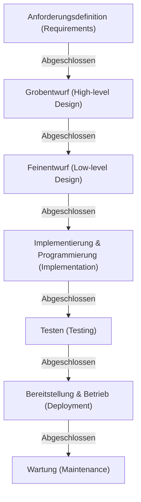

# Wasserfallmodell: Die Suche nach Tradition und Gewissheit in der Softwareentwicklung

In der Geschichte der Softwareentwicklung ist das "Wasserfallmodell" (Waterfall Model) eine Methode, die von den allerersten Anfängen an existierte und bis heute eine feste Position in bestimmten Bereichen behauptet. Ähnlich wie Wasser, das einen Wasserfall hinabstürzt, geht dieser Ansatz erst dann zur nächsten Phase über, wenn die vorherige abgeschlossen ist. Aufgrund dieser intuitiven und leicht verständlichen Struktur fungiert es seit vielen Jahren als De-facto-Standard in der Systementwicklung.

In diesem Artikel werden wir tief in die Ursprünge und die Geschichte des Wasserfallmodells, detaillierte Erklärungen der einzelnen Phasen, den theoretischen Hintergrund sowie seine Vor- und Nachteile eintauchen. Darüber hinaus werden wir einen Vergleich mit agilen Methoden, dem modernen Entwicklungsansatz, anstellen und untersuchen, wie sich das Wasserfallmodell angepasst und in der heutigen Zeit weiterentwickelt hat.

## 1. Ursprung und Geschichte des Wasserfallmodells

Es ist weithin anerkannt, dass das Konzept des Wasserfallmodells erstmals 1970 von Winston W. Royce in seinem veröffentlichten Artikel "Managing the Development of Large Software Systems" (Management der Entwicklung großer Softwaresysteme) klar formuliert wurde.

Als interessante Ironie der Geschichte wies Royce jedoch selbst in diesem Artikel darauf hin, dass "ein einfacher Top-down-Prozess (der spätere Wasserfall) riskant ist", und betonte die Wichtigkeit von Feedbackschleifen (Iterationen) zwischen den Phasen. Trotzdem war der im Artikel illustrierte unidirektionale Fluss von "Anforderungen -> Design -> Implementierung -> Testen" so leicht verständlich, dass er sich als das "Wasserfallmodell" verbreitete, wobei der Teil mit den Feedbackschleifen weggelassen wurde.

In den 1980er Jahren etablierte das US-Verteidigungsministerium (DoD) den Standard "DOD-STD-2167" für die Softwareentwicklung. Da dieser Standard faktisch einen wasserfallartigen Prozess vorschrieb, wurde das Wasserfallmodell als Standardmethode verankert, beginnend in der Militär- und Luftfahrtindustrie und später auch bei der Entwicklung großer Systeme in Privatunternehmen.

## 2. Phasen des Wasserfallmodells

Das Wasserfallmodell unterteilt den Lebenszyklus der Softwareentwicklung in logische und sequentielle Phasen. Im Folgenden ist die allgemeine Phasenstruktur des Wasserfallmodells aufgeführt.

### 2.1 Anforderungsdefinition (Requirements Gathering and Analysis)
Dies ist der Ausgangspunkt des Projekts und die wichtigste Phase. Die Wünsche von Kunden und Stakeholdern werden angehört, und es wird definiert, was das System leisten soll. Nicht nur funktionale Anforderungen (was das System tun kann), sondern auch nicht-funktionale Anforderungen (Leistung, Sicherheit, Verfügbarkeit usw.) werden detailliert dokumentiert. Das Ergebnis dieser Phase ist das "Anforderungsdokument", das die Grundlage für alle nachfolgenden Phasen bildet.

### 2.2 Systementwurf (System Design)
Basierend auf dem Anforderungsdokument wird die Architektur des gesamten Systems entworfen. Üblicherweise wird dies in zwei Stufen unterteilt: den "Grobentwurf" (High-level Design) und den "Feinentwurf" (Low-level Design).
- **Grobentwurf**: Hierbei wird der für den Benutzer sichtbare Teil entworfen, wie die Benutzeroberfläche, das logische Design der Datenbank und die Integration zwischen den Systemen.
- **Feinentwurf**: Der Grobentwurf wird auf ein Niveau heruntergebrochen, das von Programmierern codiert werden kann. Dies umfasst Klassendiagramme, Algorithmen, das physische Design der Datenbank usw.

### 2.3 Implementierung und Programmierung (Implementation)
In dieser Phase wird der Quellcode basierend auf den Feinentwurfsdokumenten geschrieben. Wenn die Designdokumente präzise ausgearbeitet sind, können sich die Programmierer rein auf das Schreiben von Code und das Durchführen von Modultests (Unit Testing) konzentrieren. In dieser Phase wird jedes Modul (Baustein) fertiggestellt.

### 2.4 Integration und Systemtests (Integration and Testing)
Die implementierten Einzelmodule werden kombiniert und es wird überprüft, ob sie als Gesamtsystem korrekt funktionieren.
- **Integrationstests**: Mehrere Module werden kombiniert, um auf Unstimmigkeiten in den Schnittstellen zu prüfen.
- **Systemtests**: Das gesamte System wird getestet, um sicherzustellen, dass es die im Anforderungsdokument festgelegten Spezifikationen erfüllt. Hier werden auch Leistungs- und Sicherheitstests durchgeführt.

### 2.5 Bereitstellung und Betrieb (Deployment)
Das System, das die Tests abgeschlossen hat und die Qualitätsstandards erfüllt, wird in der Produktionsumgebung bereitgestellt (Deployment). Dies ist die Phase, in der die Endbenutzer tatsächlich beginnen, das System zu nutzen.

### 2.6 Wartung (Maintenance)
Nach der Inbetriebnahme des Systems werden Anpassungen vorgenommen, wie die Behebung gefundener Fehler, Reaktionen auf Updates von Betriebssystemen oder Middleware sowie kleinere Funktionsverbesserungen aufgrund von Umweltveränderungen. Betrachtet man den gesamten Lebenszyklus von Software, so sind es im Allgemeinen die Kosten und die Zeit für diese Wartungsphase, die am höchsten ausfallen.

## 3. Theoretischer Hintergrund des Wasserfallmodells

Das Wasserfallmodell ist eine Anwendung traditioneller Ingenieurmethoden (Systems Engineering) aus Branchen wie der Hardwareherstellung und dem Bauwesen auf die Softwareentwicklung. Genauso wie man beim Bau eines Hauses keine Pfeiler errichten kann, bevor nicht das Fundament gelegt ist, basiert es auf der Prämisse, dass "der Übergang zur Produktion (Codierung) bei Software nicht erfolgen kann, bevor nicht die Baupläne (Anforderungen/Design) fertiggestellt sind".

Dem Modell liegt ein starkes Verlangen nach **"Vorhersagbarkeit" (Predictability)** und **"Steuerbarkeit" (Controllability)** zugrunde. In großen Projekten sind Hunderte von Ingenieuren involviert, und gewaltige Budgets werden bewegt. Für Projektmanager ist es oberste Priorität, den Fortschritt quantitativ verwalten und steuern zu können: in welcher Phase man sich befindet, wann der nächste Meilenstein ansteht und ob die Kosten im Rahmen des Budgets bleiben.

## 4. Vorteile und Stärken des Wasserfallmodells

### 4.1 Klare Meilensteine und Fortschrittsmanagement
Da die Abschlussbedingungen für jede Phase eindeutig sind (z. B. Phase "Design" ist abgeschlossen bei "Genehmigung des Designdokuments"), lässt sich der Projektfortschritt leicht erfassen. Dies ist extrem kompatibel mit der Zeitplanung unter Verwendung von Gantt-Diagrammen.

### 4.2 Qualitätssicherung durch Dokumentation
Übergaben zwischen den Phasen erfolgen grundsätzlich über Dokumente (Spezifikationen, Design-Dokumente). Dies verhindert eine Abhängigkeit von Einzelpersonen (Zustände, in denen nur bestimmte Personen die Systemspezifikationen kennen) und erleichtert die Fortführung des Projekts, selbst wenn Teammitglieder auf halbem Weg wechseln.

### 4.3 Genauigkeit von Budget- und Zeitplanschätzungen
Da Anforderungsdefinition und Design in den frühen Phasen gründlich durchgeführt werden, lassen sich der für das gesamte Projekt erforderliche Aufwand und die Kosten schon im Anfangsstadium relativ genau abschätzen. Dies ist ein sehr wichtiger Faktor bei der Systementwicklung zu Festpreisen (Werkverträgen).

### 4.4 Einhaltung von Vorschriften und Compliance
In Bereichen, die strenge Prüfungen und die Einhaltung gesetzlicher Vorschriften erfordern – wie medizinische Gerätesoftware, Flugsteuerungssysteme oder Kernsysteme von Finanzinstituten – ist das Wasserfallmodell oft eine zwingende Voraussetzung, da es detaillierte Dokumentationen und Genehmigungshistorien für jeden Prozess hinterlässt.

## 5. Nachteile und Kritik am Wasserfallmodell

### 5.1 Geringe Anpassungsfähigkeit an Änderungen (Starrheit)
Die größte Schwäche des Wasserfallmodells ist seine enorme Anfälligkeit für Anforderungsänderungen. Treten in nachfolgenden Phasen (z. B. der Testphase) fehlende Anforderungen oder Spezifikationsänderungen auf, muss oft bis zum Design oder gar zur Anforderungsdefinition zurückgegangen und diese neu durchgeführt werden (Rückschritte), was zu enormen Kosten und zeitlichen Verzögerungen führt.

### 5.2 Späte Sichtbarkeit des Endprodukts für den Kunden
Während in der Anforderungsphase eine Einigung mit dem Kunden erzielt wird, ist der Zeitpunkt, an dem der Kunde die funktionierende Software tatsächlich berühren kann, erst am Ende des Projekts (Test- oder Betriebsphase). Oft gibt es eine Diskrepanz zwischen den "Spezifikationen auf dem Papier" und der "tatsächlichen Benutzerfreundlichkeit", und es besteht das Risiko, dass erst kurz vor der Fertigstellung erhebliche Missverständnisse im Sinne von "das ist nicht das, was ich mir vorgestellt habe" aufgedeckt werden.

### 5.3 Das Risiko der "Big-Bang-Integration"
Da alle Module erst nach ihrer Fertigstellung in einem Rutsch zusammengeführt und getestet werden, treten dabei häufig viele Probleme auf einmal auf. Die Fehlerbehebung wird schwierig, was wiederum eine Ursache für erhebliche Verzögerungen im Zeitplan während der Testphase darstellt.

## 6. Wasserfall und Agile: Ein Paradigmenvergleich

Seit den 2000er Jahren hat sich der Mainstream der Softwareentwicklung hin zur "agilen Entwicklung" verschoben. Der Unterschied zwischen den beiden liegt im grundlegenden Ansatz zum Umgang mit Unsicherheit.

| Merkmal | Wasserfallmodell | Agile Entwicklung |
|---|---|---|
| **Grundgedanke** | Fokus auf der plangemäßen Ausführung | Fokus auf der Anpassung an Veränderungen |
| **Festlegung der Anforderungen** | Zu Beginn des Projekts vollständig fixiert | Kontinuierliche Überprüfung während der Entwicklung |
| **Entwicklungszyklus** | Ein einziger, großer Zyklus | Kurze (1 bis 4 Wochen) iterative Zyklen |
| **Dokumentation** | Erfordert umfassende, detaillierte Dokumente | Funktionierende Software hat Vorrang |
| **Einbindung des Kunden** | Konzentriert auf den Anfang (Anforderungen) und das Ende (Abnahme) | Kontinuierliche Einbindung während des gesamten Projekts |
| **Geeignete Projekte** | Spezifikationen sind klar und unveränderlich, große, geschäftskritische Systeme | Spezifikationen sind unsicher, schnelle Marktveränderungen, neue Geschäftsbereiche |

Während das Wasserfallmodell Risiken managt, indem es "Veränderungen auf ein Minimum reduziert", akzeptiert Agile, dass "Veränderungen unvermeidlich sind" und streut das Risiko durch häufige, kleine Releases.

## 7. Die Weiterentwicklung und Anwendung des Wasserfallmodells in der heutigen Zeit

Auch in der heutigen Zeit, in der Agile auf dem Vormarsch ist, ist das Wasserfallmodell nicht verschwunden. Es wird an den richtigen Stellen eingesetzt und hat sich weiterentwickelt, um seine Schwächen zu kompensieren.

### 7.1 V-Modell (V-Model)
Dies ist ein Modell, das die Beziehung zwischen den Entwicklungs- und Testphasen des Wasserfallmodells verdeutlicht. Durch die Verknüpfung der linken Seite (Entwicklung) des V mit der rechten Seite (Testen) – zum Beispiel entspricht "Systemtest" dem "Grobentwurf" und "Integrationstest" dem "Feinentwurf" – werden die Testqualität und die Rückverfolgbarkeit (Traceability) verbessert.

### 7.2 Sashimi-Modell (Sashimi Model)
Anstatt die Phasen komplett seriell abzuarbeiten, ist dies ein Ansatz, bei dem sich die Phasen wie Sashimi-Scheiben überlappen. Um beispielsweise die Entwicklungszeit zu verkürzen, wird mit der Implementierung bereits bestätigter Teile begonnen, bevor das gesamte Design abgeschlossen ist.

### 7.3 Hybrid aus Wasserfall und Agile
In Großprojekten setzen immer mehr Unternehmen auf einen "hybriden Ansatz", bei dem die grundlegende Architektur und die Anforderungen des Gesamtsystems streng nach dem Wasserfallmodell definiert werden, terwijl die Entwicklung individueller Funktionsmodule iterativ mit agilen Methoden (wie Scrum) erfolgt.

## 8. Fazit: Die Abstammung des Engineerings auf der Suche nach Gewissheit

Das Wasserfallmodell wird nicht selten als "alt" oder "veraltet" kritisiert. Dennoch ist die zugrunde liegende Philosophie – "klar definieren, was gebaut wird, einen Plan erstellen und ihn in der richtigen Reihenfolge ausführen" – das absolute Fundament des Systems Engineerings.

Dass die Menschheit Weltraumraketen starten und gigantische Brücken bauen kann, ist diesem plangesteuerten Ansatz zu verdanken. Auch in der Softwareentwicklung werden die "Gewissheit" und "Verantwortlichkeit", die das Wasserfallmodell bietet, bei Projekten, in denen "Fehler absolut inakzeptabel sind" – wie bei lebensrettenden medizinischen Systemen oder Finanzsystemen, die die soziale Infrastruktur stützen –, weiterhin unverzichtbar bleiben.

Während sich Technologietrends und das Geschäftsumfeld weiterentwickeln, bleibt das Verständnis für den wesentlichen Wert des Wasserfallmodells eine unerschütterliche Basis für jeden Softwareingenieur, um bessere Systeme zu bauen.
