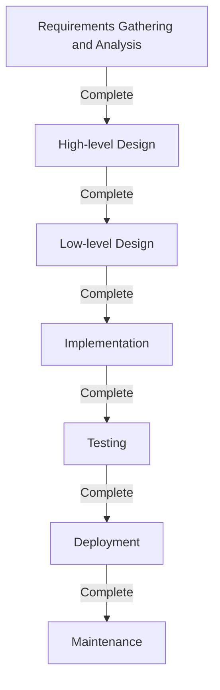

# Waterfall Model: The Pursuit of Tradition and Certainty in Software Development

In the history of software development, the "Waterfall Model" has existed since the very beginning and still maintains a solid position in specific domains today. This methodology, in which one phase must be completed before moving on to the next—much like water flowing down a waterfall—has functioned as the de facto standard for system development for many years due to its intuitive and easy-to-understand structure.

In this article, we will delve deeply into the origins and history of the waterfall model, provide a detailed explanation of each phase, explore its theoretical background, and discuss its advantages and disadvantages. Furthermore, we will examine how it compares to Agile, a modern development methodology, and consider how the waterfall model is adapting and evolving in the present day.

## 1. Origins and History of the Waterfall Model

It is widely recognized that the concept of the waterfall model was first clearly articulated in a 1970 paper titled "Managing the Development of Large Software Systems" published by Winston W. Royce.

However, in an interesting twist of historical irony, Royce himself pointed out in this paper that "a simple top-down process (which later became the waterfall model) is risky," arguing for the importance of a feedback loop (iteration) between phases. Despite this, the one-directional flow illustrated in the paper—"Requirements → Design → Implementation → Testing"—was so easy to understand that it spread as the "Waterfall Model" with the feedback loop portion entirely omitted.

In the 1980s, the United States Department of Defense (DoD) established "DOD-STD-2167" as the standard for software development. Because this standard essentially mandated a waterfall-style process, the waterfall model became entrenched as the standard methodology, beginning in the military and aerospace industries and eventually spreading to large-scale system development in the private sector.

## 2. Each Phase of the Waterfall Model

The waterfall model divides the software development lifecycle into logical and sequential phases. Below is the typical phase structure of the waterfall model.

### 2.1 Requirements Gathering and Analysis
This is the starting point of the project and the most critical phase. It involves interviewing clients and stakeholders to define exactly what the system should achieve. Not only functional requirements (what the system can do) but also non-functional requirements (performance, security, availability, etc.) are documented in detail. The deliverable of this phase is the "Requirements Definition Document," which serves as the foundation for all subsequent phases.

### 2.2 System Design
Based on the requirements definition document, the overall system architecture is designed. This is typically divided into two stages: "High-level Design (External Design)" and "Low-level Design (Internal Design)."
- **High-level Design**: Involves designing the parts visible to the user, such as the user interface, logical database design, and integration between systems.
- **Low-level Design**: Breaks down the high-level design to a level where programmers can write code. This includes class diagrams, algorithms, and physical database design.

### 2.3 Implementation
This is the phase where the source code is actually written according to the low-level design documents. If the design documents are created with precision, programmers can focus purely on writing code and performing Unit Testing. Each module (component) is completed at this stage.

### 2.4 Integration and Testing
The individual implemented modules are integrated, and the system is verified to ensure it functions correctly as a whole.
- **Integration Testing**: Multiple modules are combined to verify that there are no inconsistencies in their interfaces.
- **System Testing**: The entire system is tested to ensure it meets the specifications defined in the requirements definition document. Performance testing and security testing are also conducted here.

### 2.5 Deployment
Once testing is completed and the system meets the quality standards, it is deployed to the production environment. This is the phase where end-users actually begin using the system.

### 2.6 Maintenance
This involves fixing bugs discovered after the system goes live, responding to OS or middleware updates, and making minor functional improvements due to environmental changes. Looking at the entire software lifecycle, the time and cost required for this maintenance phase are generally the largest.

## 3. Theoretical Background of the Waterfall Model

The waterfall model is an application of traditional engineering methodologies (systems engineering), such as those used in hardware manufacturing and construction, to software development. Just as you cannot erect pillars until the foundation work is complete when building a house, this model is based on the premise that "manufacturing (coding) cannot begin until the blueprints (requirements and design) are complete."

At the root of this model is a strong demand for **"Predictability"** and **"Controllability."** Large-scale projects involve hundreds of engineers and massive budgets. For a project manager, it is an absolute imperative to be able to quantitatively manage and control what phase the current progress is in, when the next milestone is, and whether the costs are staying within budget.

## 4. Advantages and Strengths of the Waterfall Model

### 4.1 Clear Milestones and Progress Management
Because the completion conditions for each phase are clear (e.g., the design phase is completed upon "approval of the design documents"), it is easy to grasp the progress of the project. It is highly compatible with schedule management using Gantt charts.

### 4.2 Quality Assurance Through Documentation
Handovers between phases are fundamentally conducted through documents (specifications, design documents). This prevents individual dependency (a state where only a specific individual knows the system specifications) and makes it easier to continue the project even if development members change midway.

### 4.3 Accuracy in Budget and Schedule Estimation
Because requirement definition and design are thoroughly conducted in the early stages, the overall man-hours and costs required for the project can be estimated relatively accurately right from the start. This is a very important factor in system development under fixed-price (contract) agreements.

### 4.4 Compliance and Regulatory Adherence
In fields that require adherence to strict audits and legal regulations, such as medical device software, aircraft control systems, and core systems for financial institutions, the waterfall model—which leaves detailed documentation and approval histories for each process—is often a mandatory requirement.

## 5. Disadvantages and Criticisms of the Waterfall Model

### 5.1 Low Adaptability to Change (Rigidity)
The biggest weakness of the waterfall model is its extreme fragility to changes in requirements. If missed requirements or specification changes occur in subsequent phases (for example, during the testing phase), it is necessary to go back and redo the design or requirement definition (rework), resulting in enormous costs and time delays.

### 5.2 Late Visibility of the Final Product for the Client
Although consensus is built with the client during the requirement definition phase, it is only towards the end of the project (during the testing or deployment phase) that the client can actually interact with the working software. There is often a gap between "specifications on paper" and "actual usability," leading to the risk of discovering a major misalignment near completion where the client feels, "This is not what I expected."

### 5.3 Risk of "Big Bang Integration"
Because all modules are tested together in one fell swoop only after they are all completed, problems frequently erupt all at once. Identifying the root causes becomes difficult, leading to significant schedule delays during the testing phase.

## 6. Waterfall vs. Agile: A Paradigm Comparison

Since the 2000s, the mainstream of software development has shifted towards "Agile development." The difference between the two lies in their fundamentally different approaches to uncertainty.

| Feature | Waterfall | Agile |
|---|---|---|
| **Core Philosophy** | Emphasizes proceeding according to plan | Emphasizes responding to change |
| **Fixing Requirements** | Completely fixed early in the project | Continuously reviewed as development progresses |
| **Development Cycle** | A single large-scale cycle | Short-term (1 to 4 weeks) iterative cycles |
| **Documentation** | Requires comprehensive and detailed documents | Prioritizes working software |
| **Client Involvement** | Concentrated at the beginning (requirements) and end (acceptance) | Continuously involved throughout the entire project |
| **Suitable Projects** | Clear and unchanging specifications, large-scale, mission-critical | Uncertain specifications, fast-changing markets, new business ventures |

While Waterfall manages risk by "minimizing change," Agile accepts that "change is inevitable" and distributes risk through incremental, frequent releases.

## 7. Evolution and Application of Waterfall in the Modern Era

Even in the modern era where Agile has risen to prominence, the waterfall model has not disappeared. It is used in the right places for the right purposes, and it has evolved to compensate for its weaknesses.

### 7.1 V-Model
This model clarifies the correspondence between the development phases and testing phases of the waterfall model. For example, "System Testing" corresponds to "High-level Design," and "Integration Testing" corresponds to "Low-level Design." By linking the left side (development) and the right side (testing) of the V-shape, it improves test quality and traceability.

### 7.2 Sashimi Model
Instead of making the phases completely serial, this method overlaps the phases like slices of sashimi. For instance, by starting implementation from the confirmed parts before all designs are completed, it aims to shorten the development period.

### 7.3 Waterfall and Agile Hybrid
In large-scale projects, an increasing number of companies are adopting a "hybrid approach." In this approach, the foundational architecture and requirement definition of the entire system are strictly defined using the waterfall model, while the development of individual functional modules is conducted iteratively using Agile (such as Scrum).

## 8. Conclusion: The Genealogy of Engineering Seeking Certainty

The waterfall model is frequently criticized as being "old" or "outdated." However, its underlying philosophy of "clearly defining what to build, making a plan, and executing it sequentially" is the absolute fundamental of systems engineering.

It is because of this plan-driven approach that humanity has been able to launch space rockets and build colossal bridges. In software development as well, for projects where "failure is absolutely unacceptable"—such as life-critical medical systems or financial systems supporting social infrastructure—the "certainty" and "accountability" provided by the waterfall model will continue to be indispensable.

As technology evolves and the business environment changes, the trends in development methodologies will shift. However, understanding the essential value of the waterfall model serves as an unwavering foundation for all software engineers to build better systems.
