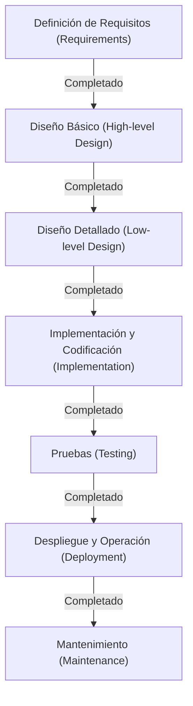

# El modelo en cascada: La búsqueda de la tradición y la certeza en el desarrollo de software

En la historia del desarrollo de software, el "modelo en cascada" (Waterfall) ha existido desde los primeros días y aún mantiene una posición firme en ciertas áreas. Al igual que el agua que fluye por una cascada, este enfoque, en el que se avanza a la siguiente fase solo después de completar la anterior, ha servido como estándar de facto para el desarrollo de sistemas durante muchos años debido a su estructura intuitiva y fácil de entender.

En este artículo, profundizaremos en los orígenes y la historia del modelo en cascada, proporcionaremos explicaciones detalladas de cada fase, analizaremos sus antecedentes teóricos y exploraremos en profundidad sus ventajas y desventajas. Además, lo compararemos con las metodologías de desarrollo modernas como Agile (ágil) y examinaremos cómo el modelo en cascada se ha adaptado y evolucionado en la actualidad.

## 1. Orígenes e historia del modelo en cascada

El concepto del modelo en cascada fue claramente articulado por primera vez en 1970 en un artículo titulado "Managing the Development of Large Software Systems" (Gestión del desarrollo de grandes sistemas de software), publicado por Winston W. Royce.

Sin embargo, como una interesante ironía histórica, el propio Royce señaló en este documento que "un proceso simple de arriba hacia abajo (lo que más tarde sería el modelo en cascada) tiene riesgos", argumentando la importancia de los ciclos de retroalimentación (iteración) entre las diferentes fases. A pesar de esto, el flujo unidireccional de "Requisitos -> Diseño -> Implementación -> Pruebas" ilustrado en el documento fue tan fácil de entender que se popularizó como el "modelo en cascada", omitiéndose por completo la parte de los ciclos de retroalimentación.

En la década de 1980, el Departamento de Defensa de los Estados Unidos (DoD) estableció la norma "DOD-STD-2167" como el estándar para el desarrollo de software. Dado que esta norma requería efectivamente un proceso de tipo cascada, el modelo se consolidó como el enfoque estándar no solo en la industria militar y aeroespacial, sino también en el desarrollo de sistemas a gran escala por parte de empresas privadas.

## 2. Las fases del modelo en cascada

El modelo en cascada divide el ciclo de vida del desarrollo de software en fases lógicas y secuenciales. A continuación, se muestra la estructura general de las fases en un modelo en cascada típico.

### 2.1 Definición de Requisitos (Requirements Gathering and Analysis)
Este es el punto de partida del proyecto y su fase más crítica. Consiste en escuchar las solicitudes de los clientes y las partes interesadas para definir exactamente qué debe lograr el sistema. Se documentan en detalle no solo los requisitos funcionales (lo que el sistema puede hacer), sino también los requisitos no funcionales (rendimiento, seguridad, disponibilidad, etc.). El entregable de esta fase es el "Documento de Definición de Requisitos", que sirve como base para todas las fases posteriores.

### 2.2 Diseño del Sistema (System Design)
Basándose en el documento de requisitos, se diseña la arquitectura general del sistema. Esto generalmente se divide en dos etapas: "Diseño Básico" (diseño externo) y "Diseño Detallado" (diseño interno).
- **Diseño Básico**: Se encarga del diseño de las partes visibles para el usuario, como la interfaz de usuario, el diseño lógico de la base de datos y la integración entre diferentes sistemas.
- **Diseño Detallado**: Desglosa el diseño básico hasta un nivel que los programadores puedan codificar. Esto incluye diagramas de clases, algoritmos y el diseño físico de la base de datos.

### 2.3 Implementación y Codificación (Implementation)
Esta es la fase donde el código fuente se escribe realmente siguiendo el documento de diseño detallado. Si el documento de diseño se elaboró con precisión, los programadores pueden concentrarse puramente en escribir el código y realizar pruebas unitarias (Unit Testing). En esta etapa se completan los módulos individuales (componentes).

### 2.4 Pruebas de Integración y Sistema (Integration and Testing)
Los módulos individuales implementados se integran para verificar si funcionan correctamente como un sistema completo.
- **Pruebas de Integración**: Se combinan múltiples módulos para comprobar que no existan inconsistencias en sus interfaces.
- **Pruebas del Sistema**: Se verifica si todo el sistema cumple con las especificaciones establecidas en el documento de definición de requisitos. Las pruebas de rendimiento y seguridad también se llevan a cabo aquí.

### 2.5 Despliegue y Operación (Deployment)
Una vez que las pruebas se completan y el sistema cumple con los estándares de calidad, se despliega en el entorno de producción. Esta es la fase en la que los usuarios finales comienzan a utilizar el sistema real.

### 2.6 Mantenimiento (Maintenance)
Involucra la corrección de errores descubiertos después de que el sistema entra en funcionamiento, la adaptación a las actualizaciones del sistema operativo o del middleware, y pequeñas mejoras funcionales en respuesta a cambios en el entorno. Observando el ciclo de vida completo del software, el costo y el tiempo dedicados a esta fase de mantenimiento suelen ser los más significativos.

## 3. Antecedentes teóricos del modelo en cascada

El modelo en cascada es una aplicación de métodos de ingeniería tradicionales (ingeniería de sistemas) provenientes de la fabricación de hardware o la industria de la construcción al desarrollo de software. Al igual que al construir un edificio no se pueden levantar los pilares hasta que los cimientos estén terminados, este modelo asume que en el software "no se puede pasar a la fabricación (codificación) hasta que los planos (requisitos y diseño) estén completos".

La base de este modelo radica en la fuerte exigencia de **"Previsibilidad (Predictability)"** y **"Controlabilidad (Controllability)"**. En los proyectos a gran escala participan cientos de ingenieros y manejan presupuestos enormes. Para los gestores de proyectos, es fundamental poder gestionar y controlar cuantitativamente en qué fase se encuentra el progreso actual, cuándo es el próximo hito y si los costos se mantienen dentro del presupuesto.

## 4. Ventajas y fortalezas del modelo en cascada

### 4.1 Hitos claros y gestión del progreso
Debido a que las condiciones de finalización de cada fase están claramente definidas (por ejemplo, finalizar la fase de diseño al obtener la "aprobación del documento de diseño"), el progreso del proyecto puede comprenderse fácilmente. Combina excepcionalmente bien con la gestión de cronogramas utilizando diagramas de Gantt.

### 4.2 Garantía de calidad mediante documentación
Las transiciones entre fases se realizan fundamentalmente a través de documentos (especificaciones, diseños). Esto previene la dependencia individual (una situación en la que solo una persona específica conoce las especificaciones del sistema) y facilita la continuidad del proyecto incluso si hay cambios en los miembros del equipo de desarrollo.

### 4.3 Precisión en la estimación de presupuestos y cronogramas
Al realizar la definición de requisitos y el diseño de manera exhaustiva en las primeras etapas, el esfuerzo y los costos requeridos para todo el proyecto se pueden estimar con relativa precisión desde el principio. Este es un factor crítico en el desarrollo de sistemas bajo contratos de precio fijo.

### 4.4 Cumplimiento normativo y regulatorio
En áreas que requieren un estricto cumplimiento legal o auditorías rigurosas, como el software para dispositivos médicos, los sistemas de control aeroespacial o los sistemas centrales de las instituciones financieras, el modelo en cascada suele ser un requisito obligatorio debido al historial detallado de documentación y aprobaciones que deja en cada proceso.

## 5. Desventajas y críticas del modelo en cascada

### 5.1 Baja capacidad de respuesta a los cambios (Rigidez)
La mayor debilidad del modelo en cascada es su extrema fragilidad ante los cambios en los requisitos. Si ocurren omisiones en los requisitos o cambios en las especificaciones durante las fases posteriores (por ejemplo, en la fase de pruebas), se hace necesario retroceder hasta la fase de diseño o de requisitos para rehacer el trabajo, lo que genera costos masivos y grandes retrasos de tiempo.

### 5.2 Retraso en la visibilidad del producto final por parte del cliente
Aunque se llega a un acuerdo con el cliente durante la fase de definición de requisitos, el cliente solo puede interactuar con el software funcional cerca del final del proyecto (en las fases de pruebas u operación). A menudo existe una discrepancia entre las "especificaciones en papel" y la "usabilidad real", existiendo el riesgo de descubrir grandes diferencias perceptuales, como un "no es lo que esperaba", justo antes de la finalización.

### 5.3 El riesgo de la "Integración Big Bang"
Debido a que todos los módulos se completan y luego se integran de una sola vez al final para probarlos, los problemas tienden a surgir masivamente. Esto dificulta la identificación de problemas y es una causa principal de retrasos significativos en los plazos durante la fase de pruebas.

## 6. Cascada vs. Ágil: Comparación de paradigmas

Desde la década de los 2000, la corriente principal en el desarrollo de software se ha desplazado hacia el "Desarrollo Ágil" (Agile). La diferencia fundamental entre los dos radica en su enfoque frente a la incertidumbre.

| Característica | Modelo en Cascada | Desarrollo Ágil |
|---|---|---|
| **Filosofía fundamental** | Énfasis en seguir el plan establecido | Énfasis en responder al cambio |
| **Definición de requisitos** | Completamente fijos al inicio del proyecto | Revisión continua durante el desarrollo |
| **Ciclo de desarrollo** | Un solo ciclo a gran escala | Ciclos iterativos cortos (1 a 4 semanas) |
| **Documentación** | Exige documentación exhaustiva y detallada | Prioriza el software que funciona |
| **Participación del cliente** | Concentrada al inicio (requisitos) y al final (aceptación) | Participación continua en todo el proyecto |
| **Proyectos adecuados** | Especificaciones claras que no cambian, gran escala, misión crítica | Especificaciones inciertas, mercado de cambios rápidos, nuevos negocios |

Mientras que el modelo en cascada gestiona el riesgo "minimizando los cambios", el modelo ágil acepta que "el cambio es inevitable" y dispersa el riesgo mediante lanzamientos frecuentes en pequeñas porciones.

## 7. La evolución y aplicación del modelo en cascada en la era moderna

Incluso con el surgimiento del modelo ágil, el modelo en cascada no ha desaparecido. Se utiliza en el lugar correcto para el propósito adecuado y ha evolucionado para compensar sus debilidades.

### 7.1 Modelo en V (V-Model)
Este modelo clarifica la relación entre las fases de desarrollo y las fases de prueba de la cascada. Por ejemplo, vincula el "Diseño Básico" con las "Pruebas del Sistema" y el "Diseño Detallado" con las "Pruebas de Integración", conectando el lado izquierdo de la V (desarrollo) con el lado derecho (pruebas) para mejorar la calidad y trazabilidad de las pruebas.

### 7.2 Modelo Sashimi (Sashimi Model)
En lugar de serializar las fases por completo, este enfoque superpone las fases como si fueran rodajas de sashimi. Por ejemplo, para acortar el tiempo de desarrollo, la implementación de las partes finalizadas puede comenzar antes de que se complete la totalidad del diseño.

### 7.3 Híbrido entre Cascada y Ágil
Cada vez más empresas están adoptando un "enfoque híbrido" en proyectos a gran escala. En este enfoque, la arquitectura central del sistema y la definición de requisitos se establecen estrictamente utilizando el modelo en cascada, mientras que el desarrollo de los módulos funcionales individuales se lleva a cabo iterativamente utilizando metodologías ágiles (como Scrum).

## 8. Conclusión: La genealogía de la ingeniería en busca de la certeza

A menudo se critica al modelo en cascada como "viejo" u "obsoleto". Sin embargo, la filosofía subyacente de "definir claramente lo que se va a construir, hacer un plan y ejecutarlo de manera ordenada" es lo más fundamental de la ingeniería de sistemas.

La razón por la cual la humanidad puede lanzar cohetes espaciales y construir puentes gigantescos es gracias a este enfoque impulsado por la planificación. En el desarrollo de software, para los proyectos en los que "el fracaso no es una opción", como los sistemas médicos que involucran vidas humanas o los sistemas financieros que soportan la infraestructura social, la "certeza" y la "responsabilidad" que ofrece el modelo en cascada seguirán siendo indispensables en el futuro.

Si bien las tendencias en las metodologías de desarrollo cambian junto con la evolución tecnológica y los cambios en el entorno empresarial, comprender el valor intrínseco del modelo en cascada sirve como una base inquebrantable para que todos los ingenieros de software construyan mejores sistemas.
