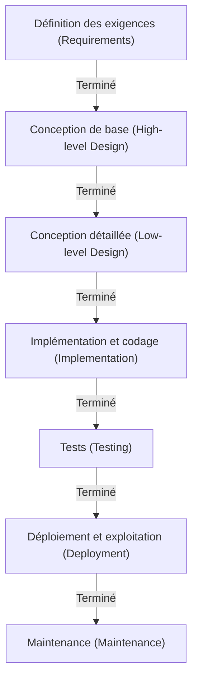

# Modèle en cascade : La quête de tradition et de certitude dans le développement de logiciels

Dans l'histoire du développement de logiciels, le « modèle en cascade » (waterfall) est l'un des plus anciens et continue d'occuper une position solide dans certains domaines. Tout comme l'eau qui s'écoule d'une cascade, cette méthode consiste à passer à l'étape suivante seulement après l'achèvement de l'étape précédente. Grâce à sa structure intuitive et facile à comprendre, elle a servi de norme de facto pour le développement de systèmes pendant de nombreuses années.

Dans cet article, nous explorerons en profondeur les origines et l'histoire du modèle en cascade, les explications détaillées de chaque phase, le contexte théorique, ainsi que ses avantages et inconvénients. De plus, nous examinerons la comparaison avec les méthodes de développement modernes telles que l'Agile, et comment le modèle en cascade s'est adapté et a évolué à l'époque contemporaine.

## 1. Origines et histoire du modèle en cascade

Il est largement reconnu que le concept du modèle en cascade a été explicitement formulé pour la première fois dans un article de Winston W. Royce publié en 1970, intitulé « Managing the Development of Large Software Systems » (Gestion du développement des grands systèmes logiciels).

Cependant, ironie de l'histoire, Royce lui-même soulignait dans cet article qu'« un simple processus descendant (qui deviendra plus tard la cascade) comporte des risques » et insistait sur l'importance des boucles de rétroaction (itérations) entre les phases. Malgré cela, le flux unidirectionnel illustré dans l'article (« Exigences → Conception → Implémentation → Tests ») était si facile à comprendre qu'il s'est répandu sous le nom de « modèle en cascade », en omettant complètement la partie concernant les boucles de rétroaction.

Au début des années 1980, le Département de la Défense des États-Unis (DoD) a établi la norme « DOD-STD-2167 » pour le développement de logiciels. Étant donné que cette norme rendait pratiquement obligatoire un processus de type cascade, ce modèle est devenu la méthode standard, d'abord dans les industries militaire et aérospatiale, puis dans le développement de systèmes à grande échelle par les entreprises privées.

## 2. Les différentes phases du modèle en cascade

Le modèle en cascade divise le cycle de vie du développement de logiciels en phases logiques et séquentielles. Voici la structure typique des phases du modèle en cascade.

### 2.1 Définition des exigences (Requirements Gathering and Analysis)
Il s'agit du point de départ du projet et de la phase la plus importante. Les besoins des clients et des parties prenantes sont recueillis pour définir ce que le système doit accomplir. Non seulement les exigences fonctionnelles (ce que le système peut faire), mais aussi les exigences non fonctionnelles (performances, sécurité, disponibilité, etc.) sont documentées en détail. Le livrable de cette phase est le « document de définition des exigences », qui sert de base à toutes les phases ultérieures.

### 2.2 Conception du système (System Design)
Sur la base du document de définition des exigences, l'architecture globale du système est conçue. Elle est généralement divisée en deux étapes : la « conception de base (conception externe) » et la « conception détaillée (conception interne) ».
- **Conception de base**: Conception de l'interface utilisateur, de la conception logique de la base de données, des interactions entre systèmes et des autres parties visibles pour l'utilisateur.
- **Conception détaillée**: La conception de base est affinée jusqu'à un niveau permettant aux programmeurs de la coder. Elle inclut les diagrammes de classes, les algorithmes et la conception physique des bases de données.

### 2.3 Implémentation et codage (Implementation)
Il s'agit de la phase où le code source est réellement écrit conformément aux documents de conception détaillée. Si la conception est élaborée avec précision, les programmeurs peuvent se concentrer uniquement sur l'écriture du code et les tests unitaires (Unit Testing). À ce stade, chaque module (composant) est achevé.

### 2.4 Tests d'intégration et système (Integration and Testing)
Les différents modules implémentés sont combinés pour vérifier si le système fonctionne correctement dans son ensemble.
- **Tests d'intégration**: Plusieurs modules sont combinés pour vérifier l'absence d'incohérences dans les interfaces.
- **Tests système**: Le système dans son ensemble est testé pour s'assurer qu'il répond aux spécifications définies dans le document d'exigences. Les tests de performances et les tests de sécurité sont également réalisés à cette étape.

### 2.5 Déploiement et exploitation (Deployment)
Une fois les tests terminés et le système répondant aux normes de qualité, il est déployé dans l'environnement de production. C'est la phase où les utilisateurs finaux commencent réellement à utiliser le système.

### 2.6 Maintenance (Maintenance)
Cette phase implique la correction des bogues découverts après la mise en service du système, l'adaptation aux mises à jour du système d'exploitation ou du middleware, ainsi que des améliorations mineures des fonctionnalités en réponse aux changements de l'environnement. Dans le cycle de vie global du logiciel, c'est généralement cette phase de maintenance qui nécessite le plus de temps et de coûts.

## 3. Contexte théorique du modèle en cascade

Le modèle en cascade est l'application au développement de logiciels de méthodes d'ingénierie traditionnelles (ingénierie des systèmes) issues de secteurs tels que l'industrie manufacturière de matériel ou la construction. De la même manière qu'il est impossible de dresser des piliers avant d'avoir terminé les fondations lors de la construction d'un bâtiment, le logiciel repose sur le principe selon lequel « on ne peut passer à la fabrication (codage) sans que les plans (exigences et conception) ne soient achevés ».

À la base de ce modèle se trouve une forte exigence de **« prévisibilité (Predictability) »** et de **« contrôlabilité (Controllability) »**. Dans les projets à grande échelle, des centaines d'ingénieurs sont impliqués et des budgets colossaux sont en jeu. Pour un chef de projet, pouvoir gérer et contrôler quantitativement la phase actuelle d'avancement, la date du prochain jalon et le respect du budget est un impératif absolu.

## 4. Avantages et points forts du modèle en cascade

### 4.1 Jalons clairs et gestion de l'avancement
Puisque les conditions d'achèvement de chaque phase sont claires (par exemple, la phase de conception est terminée à « l'approbation du document de conception »), il est facile d'évaluer l'état d'avancement du projet. Il s'accorde extrêmement bien avec la gestion de la planification à l'aide de diagrammes de Gantt.

### 4.2 Garantie de qualité par la documentation
La transition entre chaque phase s'effectue fondamentalement par le biais de la documentation (cahier des charges, documents de conception). Cela permet d'éviter la personnalisation (une situation où seules des personnes spécifiques connaissent les spécifications du système) et facilite la poursuite du projet même en cas de remplacement des membres de l'équipe de développement en cours de route.

### 4.3 Précision de l'estimation du budget et du calendrier
Comme la définition des exigences et la conception sont réalisées de manière exhaustive à un stade précoce, il est possible d'estimer de manière relativement précise les heures de travail et les coûts globaux du projet dès ses débuts. C'est un facteur crucial pour le développement de systèmes à prix fixe (contrats à forfait).

### 4.4 Conformité aux réglementations et à la conformité
Dans des secteurs tels que les logiciels pour dispositifs médicaux, les systèmes de contrôle aéronautique ou les systèmes de base des institutions financières, qui exigent des audits stricts et le respect de réglementations légales, le modèle en cascade est souvent une exigence indispensable. En effet, il permet de conserver une documentation détaillée et un historique d'approbation pour chaque processus.

## 5. Inconvénients et critiques du modèle en cascade

### 5.1 Faible capacité d'adaptation aux changements (rigidité)
La plus grande faiblesse du modèle en cascade est sa très grande vulnérabilité face aux changements d'exigences. Si des oublis d'exigences ou des modifications de spécifications surviennent lors d'une phase ultérieure (par exemple, lors de la phase de test), il est nécessaire de revenir en arrière pour refaire la conception ou la définition des exigences (remaniement), ce qui entraîne des coûts énormes et des retards importants.

### 5.2 Les clients voient le produit fini tardivement
Bien qu'un accord soit conclu avec le client au cours de la phase de définition des exigences, le client ne pourra réellement manipuler le logiciel opérationnel qu'à la fin du projet (phases de test ou d'exploitation). Il y a souvent un écart entre le « cahier des charges sur papier » et la « convivialité réelle », avec le risque de découvrir un décalage de perception majeur du type « ce n'est pas ce que j'imaginais » juste avant l'achèvement.

### 5.3 Le risque de l'intégration « Big Bang »
Parce que l'intégration et les tests se font d'un seul coup à la toute fin, une fois que tous les modules sont terminés, les problèmes surviennent fréquemment en grand nombre. L'identification des problèmes devient alors complexe, ce qui entraîne des retards considérables dans le calendrier de la phase de test.

## 6. Cascade et Agile : Comparaison des paradigmes

Depuis les années 2000, le courant dominant du développement de logiciels s'est orienté vers le « développement Agile ». La différence entre les deux réside dans leur approche fondamentalement différente vis-à-vis de l'incertitude.

| Caractéristique | Cascade | Agile |
|---|---|---|
| **Idéologie de base** | Met l'accent sur le respect du plan | Met l'accent sur l'adaptation aux changements |
| **Fixation des exigences** | Entièrement figées au début du projet | Révisées en continu tout au long du développement |
| **Cycle de développement** | Un seul cycle à grande échelle | Cycles itératifs courts (1 à 4 semaines) |
| **Documentation** | Exige une documentation exhaustive et détaillée | Privilégie un logiciel opérationnel |
| **Implication du client** | Concentrée au début (exigences) et à la fin (réception) | Implication continue tout au long du projet |
| **Projets adaptés** | Spécifications claires et fixes, grande échelle, critique | Spécifications incertaines, marchés en évolution rapide, nouvelles entreprises |

Le modèle en cascade gère les risques en « minimisant les changements », tandis que la méthode Agile accepte que « le changement est inévitable » et disperse les risques par des livraisons fréquentes et par petites étapes.

## 7. Évolution et application du modèle en cascade à l'époque contemporaine

Même à notre époque où l'Agile est prééminent, le modèle en cascade n'a pas disparu. Il est utilisé là où il est le plus approprié et a évolué pour pallier ses faiblesses.

### 7.1 Modèle en V (V-Model)
C'est un modèle qui clarifie la correspondance entre les phases de développement et les phases de test de la cascade. Par exemple, les tests correspondant à la « conception de base » sont les « tests système », et ceux correspondant à la « conception détaillée » sont les « tests d'intégration ». En faisant correspondre le côté gauche du V (développement) et le côté droit (tests), ce modèle améliore la qualité et la traçabilité des tests.

### 7.2 Modèle Sashimi (Sashimi Model)
Plutôt que d'avoir des phases complètement séquentielles, cette méthode superpose les phases à la manière des tranches de sashimi. Par exemple, au lieu d'attendre l'achèvement de l'ensemble de la conception, la mise en œuvre commence sur les parties déjà validées, dans le but de réduire les délais de développement.

### 7.3 Hybride Cascade et Agile
De plus en plus d'entreprises adoptent une « approche hybride » dans les projets à grande échelle. Cette méthode consiste à définir rigoureusement l'architecture de base du système et la définition des exigences via le modèle en cascade, tout en développant les modules fonctionnels individuels de manière itérative en utilisant l'Agile (comme Scrum).

## 8. Conclusion : La généalogie de l'ingénierie en quête de certitude

Le modèle en cascade est souvent critiqué comme étant « vieux » ou « obsolète ». Cependant, la philosophie sous-jacente qui consiste à « définir clairement ce qui doit être construit, planifier et exécuter de manière séquentielle » est le fondement absolu de l'ingénierie des systèmes.

C'est grâce à cette approche axée sur la planification que l'humanité a pu lancer des fusées spatiales et construire d'immenses ponts. Dans le domaine du développement de logiciels, pour les projets où « l'échec est inacceptable » — comme les systèmes médicaux qui affectent des vies humaines ou les systèmes financiers qui soutiennent les infrastructures sociales — la « certitude » et la « responsabilité » qu'offre le modèle en cascade resteront indispensables à l'avenir.

Avec l'évolution technologique et les changements de l'environnement commercial, les tendances des méthodes de développement évolueront, mais comprendre la valeur intrinsèque du modèle en cascade constituera pour tout ingénieur logiciel un socle inébranlable pour construire de meilleurs systèmes.
