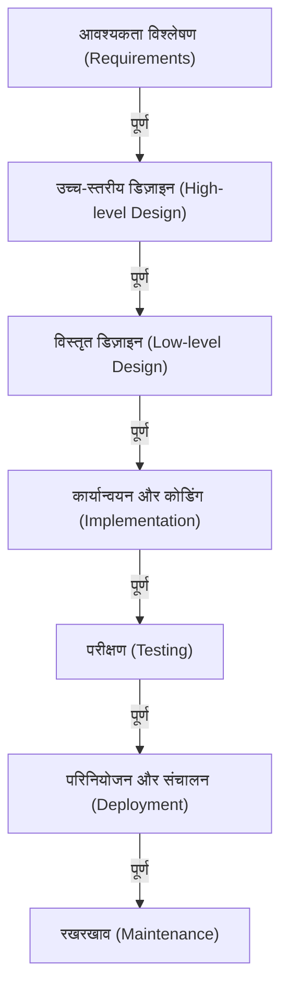

# वॉटरफॉल मॉडल: सॉफ्टवेयर विकास में परंपरा और निश्चितता की खोज

सॉफ्टवेयर विकास के इतिहास में, 'वॉटरफॉल मॉडल' (Waterfall Model) उन सबसे शुरुआती मॉडलों में से एक है जो आज भी कुछ विशिष्ट क्षेत्रों में अपनी मजबूत स्थिति बनाए हुए है। ठीक उसी तरह जैसे पानी एक झरने (waterfall) से नीचे गिरता है, यह प्रक्रिया भी एक चरण के पूरा होने के बाद ही अगले चरण में जाती है। अपनी सहज और आसानी से समझ में आने वाली संरचना के कारण, इसने कई वर्षों तक सिस्टम विकास में एक वास्तविक मानक (de facto standard) के रूप में काम किया है।

इस लेख में, हम वॉटरफॉल मॉडल की उत्पत्ति और इतिहास, प्रत्येक चरण की विस्तृत व्याख्या, इसके सैद्धांतिक बैकग्राउंड, और इसके फायदे और नुकसान पर गहराई से विचार करेंगे। इसके अलावा, हम चपलता (Agile) जैसी आधुनिक विकास विधियों के साथ इसकी तुलना करेंगे, और यह भी देखेंगे कि आज के समय में वॉटरफॉल मॉडल खुद को कैसे अनुकूलित और विकसित कर रहा है।

## 1. वॉटरफॉल मॉडल की उत्पत्ति और इतिहास

यह व्यापक रूप से माना जाता है कि वॉटरफॉल मॉडल की अवधारणा को पहली बार स्पष्ट रूप से 1970 में विंस्टन डब्ल्यू रॉयस (Winston W. Royce) द्वारा प्रकाशित एक पेपर में व्यक्त किया गया था, जिसका शीर्षक था "मैनेजिंग द डेवलपमेंट ऑफ लार्ज सॉफ्टवेयर सिस्टम्स (Managing the Development of Large Software Systems)"।

हालाँकि, इतिहास की एक दिलचस्प विडंबना यह है कि रॉयस ने स्वयं इस पेपर में बताया था कि "एक साधारण टॉप-डाउन प्रक्रिया (जिसे बाद में वॉटरफॉल कहा गया) में जोखिम होता है," और उन्होंने विभिन्न चरणों के बीच फीडबैक लूप (पुनरावृत्ति) के महत्व पर जोर दिया था। इसके बावजूद, पेपर में दिखाया गया एक-तरफ़ा प्रवाह—"आवश्यकताएँ → डिज़ाइन → कार्यान्वयन → परीक्षण (Requirements -> Design -> Implementation -> Testing)"—इतना आसानी से समझ में आने वाला था कि फीडबैक लूप के हिस्से को नजरअंदाज कर दिया गया और यह "वॉटरफॉल मॉडल" के रूप में लोकप्रिय हो गया।

1980 के दशक की शुरुआत में, अमेरिकी रक्षा विभाग (DoD) ने सॉफ्टवेयर विकास के लिए "DOD-STD-2167" को मानक के रूप में स्थापित किया। चूंकि यह मानक अनिवार्य रूप से वॉटरफॉल प्रक्रिया को लागू करता था, इसलिए सैन्य और एयरोस्पेस उद्योगों से शुरू होकर, निजी क्षेत्र में भी बड़े पैमाने के सिस्टम विकास के लिए वॉटरफॉल मॉडल एक मानक विधि बन गया।

## 2. वॉटरफॉल मॉडल के विभिन्न चरण

वॉटरफॉल मॉडल सॉफ्टवेयर विकास के जीवनचक्र (lifecycle) को तार्किक और क्रमिक चरणों में विभाजित करता है। नीचे एक सामान्य वॉटरफॉल मॉडल की चरणबद्ध संरचना दी गई है:

### 2.1 आवश्यकता विश्लेषण (Requirements Gathering and Analysis)
यह किसी भी परियोजना का शुरुआती बिंदु और सबसे महत्वपूर्ण चरण है। ग्राहकों और हितधारकों (stakeholders) की आवश्यकताओं को सुना जाता है और यह परिभाषित किया जाता है कि सिस्टम को क्या हासिल करना चाहिए। न केवल कार्यात्मक आवश्यकताएँ (Functional requirements - सिस्टम क्या कर सकता है) बल्कि गैर-कार्यात्मक आवश्यकताएँ (Non-functional requirements - प्रदर्शन, सुरक्षा, उपलब्धता आदि) भी विस्तार से प्रलेखित (documented) की जाती हैं। इस चरण का परिणाम "आवश्यकता दस्तावेज़ (Requirements Specification)" होता है, जो बाद के सभी चरणों की नींव बनता है।

### 2.2 सिस्टम डिज़ाइन (System Design)
आवश्यकता दस्तावेज़ के आधार पर, पूरे सिस्टम के आर्किटेक्चर को डिज़ाइन किया जाता है। इसे आमतौर पर दो चरणों में विभाजित किया जाता है: "बेसिक डिज़ाइन (External Design)" और "विस्तृत डिज़ाइन (Internal Design)"।
- **बेसिक डिज़ाइन (High-level Design)**: यह उस हिस्से का डिज़ाइन होता है जो उपयोगकर्ता को दिखाई देता है, जैसे कि यूजर इंटरफेस (UI), डेटाबेस का लॉजिकल डिज़ाइन, और सिस्टम के बीच एकीकरण।
- **विस्तृत डिज़ाइन (Low-level Design)**: बेसिक डिज़ाइन को उस स्तर तक तोड़ा जाता है जहाँ प्रोग्रामर वास्तव में कोडिंग कर सकें। इसमें क्लास डायग्राम, एल्गोरिदम और डेटाबेस का भौतिक डिज़ाइन शामिल होता है।

### 2.3 कार्यान्वयन और कोडिंग (Implementation)
यह वह चरण है जहाँ विस्तृत डिज़ाइन दस्तावेज़ के अनुसार वास्तविक स्रोत कोड (source code) लिखा जाता है। यदि डिज़ाइन दस्तावेज़ को बहुत सटीकता से तैयार किया गया है, तो प्रोग्रामर पूरी तरह से कोड लिखने और यूनिट टेस्टिंग (Unit Testing) पर ध्यान केंद्रित कर सकते हैं। इस चरण में प्रत्येक मॉड्यूल (घटक) पूरा हो जाता है।

### 2.4 एकीकरण और सिस्टम परीक्षण (Integration and Testing)
कार्यान्वित किए गए व्यक्तिगत मॉड्यूल्स को एक साथ जोड़ा जाता है और यह सत्यापित किया जाता है कि क्या सिस्टम समग्र रूप से सही ढंग से काम कर रहा है।
- **एकीकरण परीक्षण (Integration Testing)**: यह जाँचने के लिए कई मॉड्यूल्स को संयोजित किया जाता है कि कहीं उनके इंटरफेस में कोई विसंगति (inconsistency) तो नहीं है।
- **सिस्टम परीक्षण (System Testing)**: यह परीक्षण किया जाता है कि पूरा सिस्टम उन विनिर्देशों (specifications) को पूरा करता है या नहीं जो आवश्यकता दस्तावेज़ में परिभाषित किए गए थे। प्रदर्शन परीक्षण (Performance Testing) और सुरक्षा परीक्षण (Security Testing) भी इसी चरण में किए जाते हैं।

### 2.5 परिनियोजन और संचालन (Deployment)
परीक्षण पूरा होने और गुणवत्ता मानकों को पूरा करने के बाद, सिस्टम को उत्पादन वातावरण (production environment) में तैनात (deploy) किया जाता है। यह वह चरण जहाँ अंतिम उपयोगकर्ता (end user) वास्तव में सिस्टम का उपयोग करना शुरू करते हैं।

### 2.6 रखरखाव (Maintenance)
सिस्टम के चालू होने के बाद पाए जाने वाले बग्स (bugs) को ठीक करना, ऑपरेटिंग सिस्टम या मिडलवेयर के अपडेट्स को संभालना, और बदलते वातावरण के अनुसार छोटे-मोटे फीचर सुधार करना इसमें शामिल होता है। सॉफ्टवेयर के पूरे जीवनचक्र को देखते हुए, यह आम तौर पर देखा गया है कि रखरखाव के चरण में सबसे अधिक लागत और समय लगता है।

## 3. वॉटरफॉल मॉडल की सैद्धांतिक पृष्ठभूमि

वॉटरफॉल मॉडल पारंपरिक इंजीनियरिंग विधियों (सिस्टम इंजीनियरिंग) का अनुप्रयोग है, जिनका उपयोग हार्डवेयर निर्माण या निर्माण उद्योगों (construction industries) में किया जाता है, जिन्हें सॉफ्टवेयर विकास में लागू किया गया है। जिस प्रकार कोई इमारत बनाते समय खंभे तब तक नहीं खड़े किए जा सकते जब तक कि नींव का काम पूरा न हो जाए, उसी तरह सॉफ्टवेयर में भी यह मान लिया जाता है कि "जब तक ब्लूप्रिंट (आवश्यकताएँ और डिज़ाइन) पूरा नहीं हो जाता, तब तक निर्माण (कोडिंग) शुरू नहीं किया जा सकता।"

इस मॉडल के मूल में **"पूर्वानुमेयता (Predictability)"** और **"नियंत्रणीयता (Controllability)"** की मजबूत मांग है। बड़े पैमाने की परियोजनाओं में, सैकड़ों इंजीनियर शामिल होते हैं और भारी बजट खर्च होता है। प्रोजेक्ट मैनेजर्स के लिए यह अत्यंत महत्वपूर्ण है कि वे मात्रात्मक (quantitatively) रूप से प्रबंधित और नियंत्रित कर सकें कि वर्तमान प्रगति किस चरण में है, अगला माइलस्टोन (milestone) कब है, और क्या लागत बजट के भीतर है।

## 4. वॉटरफॉल मॉडल के लाभ और ताकत

### 4.1 स्पष्ट माइलस्टोन और प्रगति प्रबंधन
चूंकि प्रत्येक चरण की पूर्णता शर्तें स्पष्ट होती हैं (उदाहरण के लिए: "डिज़ाइन दस्तावेज़ का अनुमोदन" डिज़ाइन चरण के पूरा होने का प्रतीक है), इसलिए परियोजना की प्रगति को आसानी से समझा जा सकता है। गैंट चार्ट (Gantt chart) का उपयोग करके शेड्यूलिंग के लिए यह बहुत उपयुक्त है।

### 4.2 दस्तावेज़ीकरण के माध्यम से गुणवत्ता आश्वासन
विभिन्न चरणों के बीच का संक्रमण मूल रूप से दस्तावेज़ों (विनिर्देशों, डिज़ाइन दस्तावेज़ों) के माध्यम से किया जाता है। यह व्यक्ति-निर्भरता (जहाँ केवल एक विशिष्ट व्यक्ति को ही सिस्टम विनिर्देशों का ज्ञान होता है) को रोकता है और यदि परियोजना के बीच में विकास टीम के सदस्य बदल भी जाते हैं, तो भी परियोजना को जारी रखना आसान हो जाता है।

### 4.3 बजट और अनुसूची का सटीक अनुमान
चूंकि आवश्यकता विश्लेषण और डिज़ाइन प्रारंभिक चरण में ही अच्छी तरह से पूरे कर लिए जाते हैं, इसलिए पूरे प्रोजेक्ट के लिए आवश्यक कुल समय (man-hours) और लागत का अनुमान शुरुआत में ही काफी सटीक रूप से लगाया जा सकता है। निश्चित-मूल्य (fixed-price) अनुबंधों के तहत सॉफ्टवेयर विकास में यह एक बहुत ही महत्वपूर्ण कारक है।

### 4.4 विनियामक और अनुपालन (Compliance) समर्थन
चिकित्सा उपकरण सॉफ्टवेयर, विमान नियंत्रण सिस्टम, या वित्तीय संस्थानों के कोर सिस्टम्स जैसे क्षेत्रों में—जहाँ सख्त ऑडिट और कानूनी नियमों का पालन आवश्यक होता है—वॉटरफॉल मॉडल, जो प्रत्येक प्रक्रिया के लिए विस्तृत दस्तावेज़ीकरण और अनुमोदन इतिहास रखता है, अक्सर एक अनिवार्य आवश्यकता बन जाता है।

## 5. वॉटरफॉल मॉडल के नुकसान और आलोचना

### 5.1 परिवर्तनों को अपनाने में कठिनाई (कठोरता)
वॉटरफॉल मॉडल की सबसे बड़ी कमजोरी यह है कि यह आवश्यकताओं में बदलाव के प्रति बहुत संवेदनशील है। यदि आवश्यकताओं में कोई चूक हो जाती है या बाद के चरणों (जैसे परीक्षण चरण) के दौरान कोई विनिर्देश परिवर्तन होता है, तो डिज़ाइन या आवश्यकता विश्लेषण चरण में वापस जाना और फिर से काम करना (rework) आवश्यक हो जाता है, जिससे समय की देरी होती है और लागत काफी बढ़ जाती है।

### 5.2 ग्राहकों द्वारा अंतिम उत्पाद देखने में देरी
हालाँकि आवश्यकता विश्लेषण चरण में ग्राहकों के साथ सहमति बन जाती है, लेकिन ग्राहक केवल प्रोजेक्ट के अंत (परीक्षण या संचालन चरण) में ही काम करने वाले वास्तविक सॉफ्टवेयर का अनुभव कर पाते हैं। अक्सर "कागज पर विनिर्देशों" और "वास्तविक उपयोगिता (usability)" के बीच अंतर होता है, और यह एक बड़ा जोखिम रहता है कि पूरा होने के करीब आने पर ग्राहक यह महसूस कर सकता है कि "यह वैसा नहीं है जैसा मैंने सोचा था।"

### 5.3 "बिग बैंग इंटीग्रेशन (Big Bang Integration)" का जोखिम
चूंकि सभी मॉड्यूल्स के पूरा होने के बाद ही उन्हें एक साथ जोड़कर परीक्षण किया जाता है, इसलिए अक्सर कई समस्याएं एक साथ सामने आ जाती हैं। समस्या की जड़ का पता लगाना मुश्किल हो जाता है, जिससे परीक्षण चरण में अनुसूची में काफी देरी हो सकती है।

## 6. वॉटरफॉल और चपलता (Agile): प्रतिमान (Paradigm) की तुलना

2000 के दशक के बाद से, "एजाइल विकास (Agile Development)" सॉफ्टवेयर विकास की मुख्यधारा बन गया है। इन दोनों के बीच का अंतर मुख्य रूप से अनिश्चितता से निपटने के दृष्टिकोण में निहित है।

| विशेषता | वॉटरफॉल | एजाइल (Agile) |
|---|---|---|
| **मूल विचार** | योजना के अनुसार चलने पर जोर | बदलाव को अपनाने पर जोर |
| **आवश्यकताओं का निर्धारण** | परियोजना की शुरुआत में पूरी तरह से तय | विकास के दौरान निरंतर पुनरावृत्ति (review) |
| **विकास चक्र (Cycle)** | बड़े पैमाने पर एक एकल चक्र | छोटी अवधि (1 से 4 सप्ताह) के पुनरावृत्त (iterative) चक्र |
| **दस्तावेज़ीकरण** | व्यापक और विस्तृत दस्तावेज़ीकरण की आवश्यकता | कार्यशील (working) सॉफ्टवेयर को प्राथमिकता |
| **ग्राहक की भागीदारी** | शुरुआत (आवश्यकताएँ) और अंत (स्वीकृति) पर केंद्रित | पूरे प्रोजेक्ट में लगातार भागीदारी |
| **उपयुक्त परियोजनाएँ** | जहाँ विनिर्देश स्पष्ट और अपरिवर्तित हों, बड़े पैमाने की, मिशन-क्रिटिकल | जहाँ विनिर्देश अनिश्चित हों, बाजार तेजी से बदलता हो, नए व्यवसाय |

वॉटरफॉल मॉडल "बदलाव को कम करके" जोखिम को प्रबंधित करता है, जबकि एजाइल यह स्वीकार करता है कि "बदलाव अपरिहार्य है," और जोखिम को छोटे, लगातार रिलीज के माध्यम से वितरित करता है।

## 7. आधुनिक समय में वॉटरफॉल का विकास और अनुप्रयोग

भले ही आज एजाइल का उदय हो चुका है, फिर भी वॉटरफॉल मॉडल पूरी तरह से गायब नहीं हुआ है। इसका सही जगह पर उपयोग किया जाता है, और इसकी कमजोरियों को दूर करने के लिए इसमें कई सुधार भी हुए हैं।

### 7.1 वी-मॉडल (V-Model)
यह एक ऐसा मॉडल है जो वॉटरफॉल के विकास चरणों और परीक्षण चरणों के बीच संबंध को स्पष्ट करता है। उदाहरण के लिए, "बेसिक डिज़ाइन" का परीक्षण "सिस्टम परीक्षण" में किया जाता है, और "विस्तृत डिज़ाइन" का परीक्षण "एकीकरण परीक्षण" में किया जाता है। V-आकार के बाएँ (विकास) और दाएँ (परीक्षण) पक्षों को जोड़कर, परीक्षण की गुणवत्ता और ट्रैसेबिलिटी (traceability) में सुधार किया जाता है।

### 7.2 साशिमी मॉडल (Sashimi Model)
चरणों को पूरी तरह से क्रमिक (series) रखने के बजाय, यह विधि सशिमी (जापानी व्यंजन) के कटे हुए टुकड़ों की तरह चरणों को ओवरलैप करने की अनुमति देती है। उदाहरण के लिए, सभी डिज़ाइन पूरा होने से पहले ही, उन हिस्सों का कार्यान्वयन (कोडिंग) शुरू कर दिया जाता है जो तय हो चुके हैं, ताकि विकास का समय कम किया जा सके।

### 7.3 वॉटरफॉल और एजाइल का हाइब्रिड
बड़े पैमाने की परियोजनाओं में, अधिक से अधिक कंपनियां एक "हाइब्रिड दृष्टिकोण" अपना रही हैं, जहाँ सिस्टम का समग्र बेस आर्किटेक्चर और आवश्यकताएँ वॉटरफॉल का उपयोग करके सख्ती से परिभाषित की जाती हैं, लेकिन व्यक्तिगत कार्यात्मक मॉड्यूल्स का विकास एजाइल (जैसे स्क्रम - Scrum) का उपयोग करके पुनरावृत्त रूप से (iteratively) किया जाता है।

## 8. निष्कर्ष: निश्चितता की तलाश में इंजीनियरिंग की वंशावली

वॉटरफॉल मॉडल की अक्सर "पुराने" या "अप्रचलित (outdated)" कहकर आलोचना की जाती है। हालाँकि, इसके मूल में मौजूद दर्शन—"स्पष्ट रूप से परिभाषित करें कि क्या बनाना है, योजना बनाएँ, और इसे व्यवस्थित रूप से निष्पादित करें"—सिस्टम इंजीनियरिंग का सबसे बुनियादी सिद्धांत है।

इंसान अंतरिक्ष रॉकेट लॉन्च करने और बड़े पुल बनाने में सक्षम हैं, क्योंकि हमारे पास यह योजना-संचालित (plan-driven) दृष्टिकोण है। सॉफ्टवेयर विकास में भी, उन परियोजनाओं के लिए जहाँ "विफलता कोई विकल्प नहीं है"—जैसे कि मानव जीवन से जुड़ी चिकित्सा प्रणालियाँ या सामाजिक बुनियादी ढाँचे का समर्थन करने वाली वित्तीय प्रणालियाँ—वहाँ वॉटरफॉल मॉडल द्वारा प्रदान की गई "निश्चितता" और "जवाबदेही (accountability)" भविष्य में भी अपरिहार्य (indispensable) बनी रहेगी।

तकनीकी प्रगति और बदलते व्यावसायिक वातावरण के साथ, विकास के तरीकों के रुझान बदलते रहेंगे, लेकिन वॉटरफॉल मॉडल के आवश्यक मूल्य को समझना हर सॉफ्टवेयर इंजीनियर के लिए बेहतर सिस्टम बनाने की एक मजबूत नींव के रूप में काम करेगा।
