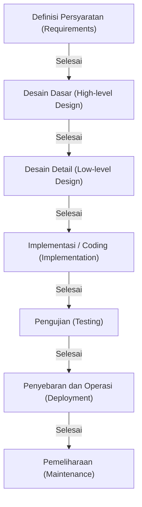

# Model Waterfall: Tradisi dan Pengejaran Kepastian dalam Pengembangan Perangkat Lunak

Dalam sejarah pengembangan perangkat lunak, "Model Waterfall" (Model Air Terjun) merupakan salah satu model yang sudah ada sejak masa-masa paling awal dan masih mempertahankan posisi yang kokoh di ranah-ranah tertentu hingga saat ini. Seperti air yang mengalir turun menyerupai air terjun, metode ini bergerak ke tahap berikutnya hanya setelah satu tahap sepenuhnya selesai. Berkat strukturnya yang intuitif dan mudah dipahami, model ini telah berfungsi sebagai standar de facto dalam pengembangan sistem selama bertahun-tahun lamanya.

Dalam artikel ini, kita akan menggali lebih dalam mengenai asal-usul dan sejarah Model Waterfall, penjelasan mendetail mengenai setiap fasenya, latar belakang teoritisnya, serta kelebihan dan kekurangannya. Selain itu, kita juga akan membahas perbandingannya dengan Agile sebagai metode pengembangan modern, dan menelaah bagaimana model Waterfall telah beradaptasi dan berevolusi di era kiwari.

## 1. Asal-Usul dan Sejarah Model Waterfall

Konsep Model Waterfall secara luas diakui pertama kali diartikulasikan dengan jelas dalam sebuah makalah berjudul "Managing the Development of Large Software Systems" (Mengelola Pengembangan Sistem Perangkat Lunak Berskala Besar) yang diterbitkan oleh Winston W. Royce pada tahun 1970.

Namun, yang menjadi ironi sejarah yang menarik adalah bahwa Royce sendiri, dalam makalah ini, menunjukkan bahwa "proses top-down yang sederhana (yang kemudian dikenal sebagai Waterfall) memiliki risiko" dan ia berargumen mengenai pentingnya putaran umpan balik (iterasi) di antara tahap-tahap tersebut. Meskipun demikian, diagram alir satu arah yang menggambarkan "Persyaratan -> Desain -> Implementasi -> Pengujian" dalam makalah tersebut dinilai sangat mudah dipahami. Alhasil, model ini justru menyebar luas dengan sebutan "Model Waterfall" dengan menanggalkan elemen krusial berupa putaran umpan baliknya.

Memasuki dekade 1980-an, Departemen Pertahanan Amerika Serikat (DoD) menetapkan "DOD-STD-2167" sebagai sebuah standar pengembangan perangkat lunak. Karena standar ini secara efektif mewajibkan proses tipe Waterfall, model Waterfall pun semakin mapan sebagai metode standar dalam pengembangan sistem skala besar, dimulai dari industri militer dan dirgantara, yang kemudian merambah hingga ke perusahaan-perusahaan swasta.

## 2. Fase-Fase dalam Model Waterfall

Model Waterfall membagi siklus hidup pengembangan perangkat lunak menjadi fase-fase yang logis dan berurutan. Berikut ini adalah struktur fase dalam Model Waterfall pada umumnya.

### 2.1 Definisi Persyaratan (Requirements Gathering and Analysis)
Ini adalah titik tolak proyek sekaligus menjadi fase yang paling krusial. Dalam fase ini, tim akan mendengarkan kebutuhan serta ekspektasi dari klien maupun pemangku kepentingan untuk mendefinisikan apa yang sebenarnya harus dapat dicapai oleh sistem. Tidak hanya persyaratan fungsional (apa yang dapat dilakukan sistem), tetapi persyaratan non-fungsional (kinerja, keamanan, ketersediaan, dsb.) juga akan didokumentasikan secara mendetail. Hasil atau keluaran dari fase ini adalah "Dokumen Definisi Persyaratan" yang akan berfungsi sebagai fondasi dasar bagi seluruh fase-fase selanjutnya.

### 2.2 Desain Sistem (System Design)
Berdasarkan Dokumen Definisi Persyaratan, arsitektur sistem secara keseluruhan akan dirancang pada fase ini. Biasanya, proses perancangan ini dibagi ke dalam dua tahapan: "Desain Dasar (Desain Eksternal)" dan "Desain Detail (Desain Internal)".
- **Desain Dasar**: Pada tahap ini dilakukan perancangan pada bagian-bagian yang akan berinteraksi langsung dengan pengguna atau tampak dari luar, seperti antarmuka pengguna (user interface), desain logika dari basis data, serta interaksi antar-sistem.
- **Desain Detail**: Tahap ini menjabarkan desain dasar hingga ke level di mana programmer dapat langsung melakukan pengkodean (coding). Ini mencakup diagram kelas, struktur algoritma, serta desain fisik dari basis data.

### 2.3 Implementasi dan Pengkodean (Implementation)
Ini adalah fase penulisan kode sumber (source code) yang sesungguhnya dengan berpegang pada dokumen desain detail. Jika dokumen desain disusun dengan tingkat ketelitian tinggi, programmer dapat fokus semata-mata pada penulisan kode dan pelaksanaan pengujian unit (Unit Testing). Pada tahapan ini pulalah, penyelesaian setiap modul atau komponen secara individu dicapai.

### 2.4 Pengujian Integrasi dan Sistem (Integration and Testing)
Modul-modul individu yang telah diimplementasikan akan digabungkan bersama, kemudian diverifikasi apakah sistem tersebut dapat berfungsi dengan benar secara keseluruhan.
- **Pengujian Integrasi**: Beberapa modul digabungkan menjadi satu untuk memastikan tidak ada inkonsistensi atau malfungsi pada antarmuka komunikasi antarmodul tersebut.
- **Pengujian Sistem**: Menguji keseluruhan sistem untuk memastikan bahwa sistem telah memenuhi spesifikasi yang ditetapkan di dalam Dokumen Definisi Persyaratan. Pengujian atas kinerja maupun keamanan juga dilakukan pada tahap ini.

### 2.5 Penyebaran dan Operasional (Deployment)
Setelah pengujian selesai dan sistem terbukti memenuhi seluruh standar kualitas, sistem kemudian di-deploy (disebarkan) ke lingkungan produksi (production environment). Ini merupakan fase di mana pengguna akhir (end-user) mulai menggunakan sistem secara nyata.

### 2.6 Pemeliharaan (Maintenance)
Tugas-tugas pada fase ini meliputi perbaikan bug yang ditemukan setelah sistem beroperasi, melakukan penyesuaian terhadap pembaruan sistem operasi (OS) atau middleware, serta melakukan sedikit pembenahan fitur yang diakibatkan oleh perubahan lingkungan kerja. Apabila dilihat dari kacamata siklus hidup perangkat lunak secara utuh, waktu serta biaya yang dialokasikan untuk fase pemeliharaan ini pada umumnya memakan porsi yang paling besar.

## 3. Latar Belakang Teoritis Model Waterfall

Model Waterfall pada dasarnya merupakan hasil adaptasi dari metode rekayasa tradisional (sistem rekayasa) yang lazim ditemui dalam sektor industri manufaktur perangkat keras atau industri konstruksi ke dalam ranah pengembangan perangkat lunak. Sama halnya seperti proses membangun sebuah gedung di mana tiang-tiang tidak bisa didirikan sebelum pekerjaan fondasi dasar tuntas, perangkat lunak juga dikembangkan di atas landasan premis bahwa "proses manufaktur (pengkodean) tidak dapat dimulai sebelum cetak biru (persyaratan dan desain) dirampungkan sepenuhnya."

Landasan fundamental dari model ini terletak pada tuntutan yang kuat akan **"Prediktabilitas (Predictability)"** serta **"Kontrolabilitas (Controllability)"**. Dalam berbagai proyek raksasa, ada ratusan insinyur yang dilibatkan dan dana dalam jumlah fantastis yang dipertaruhkan. Bagi seorang manajer proyek, kemampuan untuk mengontrol secara kuantitatif serta mengelola hal-hal seperti: di fase manakah kemajuan saat ini, kapan tenggat waktu (milestone) berikutnya, dan apakah biayanya sesuai dengan anggaran—adalah sebuah keharusan yang bersifat mutlak.

## 4. Kelebihan dan Kekuatan Model Waterfall

### 4.1 Milestone yang Jelas dan Manajemen Kemajuan
Karena kriteria penyelesaian dari masing-masing fase sudah ditetapkan dengan jelas (misal: dengan disetujuinya "dokumen desain", maka fase perancangan dianggap selesai), status kemajuan proyek dapat dipantau dengan mudah. Karakteristik ini membuat Model Waterfall sangat kompatibel dengan pengelolaan jadwal menggunakan bagan Gantt (Gantt chart).

### 4.2 Penjaminan Mutu Melalui Dokumentasi
Serah terima pekerjaan antarfase pada dasarnya dilakukan melalui berbagai dokumen (spesifikasi, desain). Hal ini dilakukan untuk mencegah personalisasi pengetahuan (kondisi di mana hanya individu tertentu yang mengetahui dan memahami spesifikasi sistem), sehingga memudahkan proyek untuk tetap berlanjut sekalipun terdapat pergantian anggota tim pengembangan di tengah jalan.

### 4.3 Tingkat Akurasi dalam Estimasi Anggaran dan Jadwal
Oleh karena persyaratan sistem didefinisikan serta dirancang secara mendalam sedari tahap yang sangat awal, baik jam kerja (person-hours) maupun biaya yang dibutuhkan untuk seluruh proyek dapat diestimasi dengan tingkat presisi yang relatif tinggi di tahap pendahuluan. Ini merupakan elemen yang sangat vital dalam pengembangan sistem yang terikat dengan harga tetap (kontrak lumpsum).

### 4.4 Kepatuhan terhadap Regulasi
Dalam sektor-sektor yang mensyaratkan adanya audit serta tingkat kepatuhan regulasi hukum yang super-ketat, semisal pengembangan perangkat lunak untuk perangkat medis, sistem kontrol penerbangan pesawat terbang, atau sistem perbankan krusial pada lembaga keuangan—Model Waterfall yang menuntut penulisan dokumen mendetail serta penjejakan riwayat persetujuan di setiap proses, tak jarang menjadi prasyarat yang wajib dipenuhi.

## 5. Kekurangan dan Kritik Terhadap Model Waterfall

### 5.1 Rendahnya Fleksibilitas Terhadap Perubahan (Kekakuan)
Titik kelemahan terbesar yang dimiliki oleh Model Waterfall adalah tingginya tingkat kerentanannya terhadap perubahan persyaratan. Apabila ditemukan adanya kelalaian dalam persyaratan atau bila terjadi perubahan spesifikasi ketika sudah memasuki tahapan lebih lanjut (contohnya, pada tahap pengujian), proses pengembangan harus mundur kembali ke fase desain atau bahkan ke fase definisi persyaratan (rework). Hal ini acapkali menimbulkan pembengkakan biaya dan pembuangan waktu yang tidak sedikit.

### 5.2 Keterlambatan Pelanggan dalam Melihat Produk Jadi
Meskipun kesepakatan dengan klien dibangun sejak fase pendefinisian persyaratan, klien nyatanya baru akan bisa melihat serta berinteraksi secara nyata dengan wujud nyata perangkat lunak tersebut ketika proyek sudah mendekati akhir (seperti pada fase pengujian atau operasional). Perbedaan antara "spesifikasi di atas kertas" dengan "kegunaan produk riil"-nya tidak jarang akan memicu adanya risiko bahwa perbedaan pandangan yang parah (misal: "produk ini tidak sama dengan apa yang saya harapkan") baru akan terkuak menjelang pengerjaan produk usai.

### 5.3 Risiko "Integrasi Big Bang"
Karena seluruh penggabungan dan pengujian dilakukan secara sekaligus (big bang) ketika semua modul terselesaikan, masalah akan bermunculan dalam waktu yang bersamaan. Ini menyulitkan upaya dalam mencari sumber persoalan serta menjadi akar permasalahan dari terlambatnya penyelesaian proyek dengan amat parah di fase pengujian.

## 6. Waterfall dan Agile: Perbandingan Paradigma

Sejak memasuki era 2000-an, arus utama dalam pengembangan perangkat lunak bergeser ke arah "Pengembangan Agile". Perbedaan di antara keduanya terletak secara fundamental pada perbedaan sudut pandang dalam menghadapi ketidakpastian.

| Karakteristik | Waterfall | Agile |
|---|---|---|
| **Filosofi Dasar** | Menekankan kemajuan sesuai dengan rencana | Menekankan kemampuan untuk beradaptasi terhadap perubahan |
| **Penetapan Persyaratan** | Sepenuhnya dikunci sejak awal proyek | Ditinjau secara berkelanjutan seiring berjalannya pengembangan |
| **Siklus Pengembangan** | Satu kali siklus pengerjaan dalam skala besar | Siklus pengerjaan iteratif dalam waktu singkat (1 hingga 4 minggu) |
| **Dokumentasi** | Mensyaratkan dokumen yang detail dan ekstensif | Memprioritaskan perangkat lunak yang dapat berfungsi nyata |
| **Keterlibatan Klien** | Terpusat di fase awal (persyaratan) dan akhir (penerimaan produk) | Terlibat secara kontinu di sepanjang durasi proyek |
| **Proyek yang Cocok** | Skala besar, misi kritikal, berspesifikasi tetap | Spesifikasi penuh ketidakpastian, pasar cepat berubah, bisnis baru |

Waterfall mengatur dan mengelola risikonya dengan mencoba untuk "meminimalisasi perubahan", sementara Agile secara leluasa merangkul konsep bahwa "perubahan adalah sesuatu yang tidak bisa dihindarkan" serta menyebarkan risiko-risiko tersebut melalui rilis yang dilakukan sedikit demi sedikit.

## 7. Evolusi dan Penerapan Waterfall di Era Modern

Bahkan di era keemasan Agile ini, Model Waterfall belumlah punah sepenuhnya. Model ini terus dimanfaatkan pada tempat-tempat yang sesuai dan terus berupaya berevolusi agar dapat menutupi titik-titik lemahnya.

### 7.1 Model-V (V-Model)
Model ini adalah model yang mampu memperjelas korespondensi atau hubungan korelasi antara fase-fase pengembangan Waterfall dengan fase-fase pengujiannya. Misalnya, pengujian untuk "Desain Dasar" ditangani melalui "Pengujian Sistem", lalu pengujian untuk "Desain Detail" ditangani melalui "Pengujian Integrasi". Dengan mengaitkan sisi sebelah kiri dari huruf V (pengembangan) dengan sisi sebelah kanannya (pengujian), hal ini akan meningkatkan mutu serta keterlacakan (traceability) pengujian.

### 7.2 Model Sashimi (Sashimi Model)
Bukannya menyusun fase-fase secara berurutan persis secara sekuensial, pendekatan ini menyusun antarfase untuk bisa saling bertumpang tindih layaknya irisan ikan dalam hidangan sashimi. Sebagai contoh, untuk memangkas durasi lamanya waktu pengembangan, proses pengerjaan untuk tahap implementasi bisa dimulai langsung dari bagian-bagian desain yang sudah difinalkan tanpa harus menunggu perampungan dari tahap desain keseluruhannya.

### 7.3 Hibrida antara Waterfall dan Agile
Semakin banyak bermunculan perusahaan yang beralih mengadopsi "Pendekatan Hibrida" dalam mengerjakan proyek berskala raksasa, di mana desain arsitektur mendasar dari keseluruhan sistem maupun definisi persyaratan akan ditetapkan dan dikunci secara ketat dengan Waterfall, tetapi kemudian memanfaatkan metodologi Agile (seperti Scrum dsb.) secara berulang/iteratif dalam proses pengembangan dari fitur-fitur maupun modul-modul individunya.

## 8. Kesimpulan: Silsilah Rekayasa dalam Mengupayakan Kepastian

Model Waterfall mungkin acapkali dihujani kritik karena dianggap "usang" maupun "tertinggal oleh zaman". Terlepas dari semua itu, filosofi teramat mendasarnya—yang mana berbunyi: "Mendefinisikan apa yang akan dibangun dengan teramat jelas, merumuskan perencanaan yang matang, lalu mengeksekusinya di dalam kerangka yang sekuensial dan berurutan"—merupakan fondasi paling mendasar di segala disiplin ilmu rekayasa sistem.

Kemampuan umat manusia dalam meluncurkan roket menuju luar angkasa maupun membangun sebuah jembatan maharaksasa tidak lain adalah buah dari pendekatan yang dijalankan berbasiskan pada perencanaan (plan-driven approach) ini. Meskipun hanya dikontekstualisasikan dalam ranah pengembangan perangkat lunak sekalipun, pada proyek-proyek di mana "kegagalan tidak dapat ditoleransi sama sekali"—seperti pada sistem fasilitas kesehatan yang mengikat hidup mati seseorang atau sistem perbankan yang menopang fondasi infrastruktur lapisan masyarakat—"Kepastian" beserta dengan "Akuntabilitas" (pertanggungjawaban) yang ditawarkan oleh Model Waterfall senantiasa dipandang sangat tak tergantikan dan akan terus begitu ke depannya.

Seiring dengan berjalannya pesatnya laju evolusi kemajuan teknologi serta lingkungan dunia perbisnisan, tren-tren yang mewarnai metodologi pengembangan pasti akan silih berganti. Kendati demikian, menyingkap lalu menginternalisasi hakikat dan nilai sejati yang direpresentasikan oleh Model Waterfall sesungguhnya akan selalu dapat membangun sebuah landasan kukuh tak tertembus—bagi siapa pun dalam barisan seluruh perangkat insinyur perangkat lunak di luar sana—demi membina suatu sistem perangkat lunak yang jauh lebih superior.
