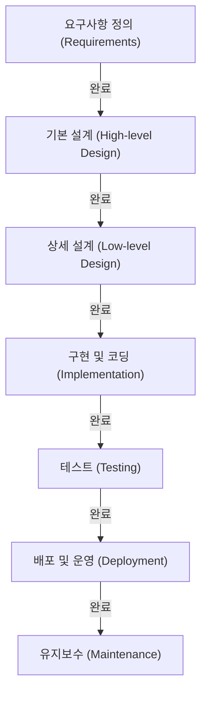

# 폭포수 모델: 소프트웨어 개발에서 전통과 확실성의 추구

소프트웨어 개발 역사에 있어 가장 초기부터 존재해 왔으며, 현재까지도 특정 영역에서 확고한 입지를 다지고 있는 것이 바로 '폭포수 모델(Waterfall Model)'입니다. 물이 폭포에서 떨어지듯 하나의 공정이 완료된 후 다음 공정으로 넘어가는 이 기법은, 직관적이고 이해하기 쉬운 구조 덕분에 오랜 세월 동안 시스템 개발의 사실상 표준(De facto standard)으로 기능해 왔습니다.

본 기사에서는 폭포수 모델의 기원과 역사, 각 단계(Phase)에 대한 상세한 해설, 이론적 배경, 그리고 장단점을 깊이 있게 파헤쳐 봅니다. 나아가 현대적인 개발 방법론인 애자일(Agile)과의 비교를 통해, 오늘날 폭포수 모델이 어떻게 적응하고 진화하고 있는지에 대해서도 고찰합니다.

## 1. 폭포수 모델의 기원과 역사

폭포수 모델이라는 개념이 처음 명확하게 언어화된 것은 1970년 윈스턴 W. 로이스(Winston W. Royce)가 발표한 논문 '대규모 소프트웨어 시스템의 개발 관리(Managing the Development of Large Software Systems)'라고 널리 인식되고 있습니다.

하지만 흥미로운 역사의 아이러니로, 로이스 자신은 이 논문에서 '단순한 하향식(Top-down) 프로세스(이후의 폭포수 모델)에는 위험이 따른다'고 지적하며 공정 간 피드백 루프(반복)의 중요성을 주장했습니다. 그럼에도 불구하고 논문 내에 도해된 '요구사항 → 설계 → 구현 → 테스트'라는 단방향 흐름이 매우 알기 쉬웠기 때문에, 정작 피드백 루프 부분은 빠진 채 '폭포수 모델'로서 널리 퍼지게 된 것입니다.

1980년대에 들어서면서 미국 국방부(DoD)가 소프트웨어 개발 표준 규격으로 'DOD-STD-2167'을 제정했습니다. 이 규격이 실질적으로 폭포수 형태의 프로세스를 의무화했기 때문에 군사 및 항공우주 산업을 시작으로 민간 기업의 대규모 시스템 개발에 있어서도 폭포수 모델이 표준적인 기법으로 자리 잡게 되었습니다.

## 2. 폭포수 모델의 각 단계

폭포수 모델은 소프트웨어 개발의 수명 주기(Life cycle)를 논리적이고 연속적인 단계로 분할합니다. 다음은 일반적인 폭포수 모델의 단계 구성입니다.

### 2.1 요구사항 정의 (Requirements Gathering and Analysis)
프로젝트의 출발점이자 가장 중요한 단계입니다. 고객이나 이해관계자의 요구를 청취하고 시스템이 무엇을 구현해야 하는지를 정의합니다. 기능적 요구사항(시스템이 할 수 있는 것)뿐만 아니라 비기능적 요구사항(성능, 보안, 가용성 등)도 상세히 문서화됩니다. 이 단계의 산출물은 '요구사항 정의서'이며, 이후 모든 단계의 기반이 됩니다.

### 2.2 시스템 설계 (System Design)
요구사항 정의서를 바탕으로 시스템 전체의 아키텍처를 설계합니다. 보통 '기본 설계(외부 설계)'와 '상세 설계(내부 설계)'의 2단계로 나뉩니다.
- **기본 설계**: 사용자 인터페이스, 데이터베이스의 논리적 설계, 시스템 간의 연동 등 사용자에게 보이는 부분을 설계합니다.
- **상세 설계**: 기본 설계를 프로그래머가 코딩할 수 있는 수준까지 구체화합니다. 클래스 다이어그램, 알고리즘, 데이터베이스의 물리적 설계 등이 포함됩니다.

### 2.3 구현 및 코딩 (Implementation)
상세 설계서에 따라 실제로 소스 코드를 작성하는 단계입니다. 설계서가 정교하게 만들어져 있다면, 프로그래머는 순수하게 코드 작성과 단위 테스트(Unit Testing)에 집중할 수 있습니다. 이 단계에서 각 모듈(부품)이 완성됩니다.

### 2.4 통합 및 시스템 테스트 (Integration and Testing)
구현된 개별 모듈을 통합하여 시스템 전체가 올바르게 기능하는지 검증합니다.
- **통합 테스트**: 여러 모듈을 조합하여 인터페이스의 불일치가 없는지 확인합니다.
- **시스템 테스트**: 시스템 전체가 요구사항 정의서에 명시된 사양을 충족하는지 테스트합니다. 성능 테스트나 보안 테스트도 이곳에서 이루어집니다.

### 2.5 배포 및 운영 (Deployment)
테스트가 완료되고 품질 기준을 충족한 시스템을 운영 환경에 배포(Deploy)합니다. 최종 사용자(End-user)가 실제로 시스템을 사용하기 시작하는 단계입니다.

### 2.6 유지보수 (Maintenance)
시스템 가동 후 발견된 버그의 수정, OS나 미들웨어 업데이트에 대한 대응, 환경 변화에 따른 미세한 기능 개선 등을 수행합니다. 소프트웨어의 전체 수명 주기 관점에서 볼 때, 이 유지보수 단계에 소요되는 비용과 시간이 가장 큰 것이 일반적입니다.

## 3. 폭포수 모델의 이론적 배경

폭포수 모델은 하드웨어 제조업이나 건설업 등 전통적인 엔지니어링 기법(시스템 공학)을 소프트웨어 개발에 응용한 것입니다. 건물을 지을 때 기초 공사가 끝나지 않으면 기둥을 세울 수 없는 것과 마찬가지로, 소프트웨어도 '설계도(요구사항 및 설계)가 완성되지 않으면 제조(코딩) 단계로 넘어갈 수 없다'는 전제에 서 있습니다.

이 모델의 근저에 있는 것은 **'예측 가능성(Predictability)'**과 **'제어 가능성(Controllability)'**에 대한 강력한 요구입니다. 대규모 프로젝트에서는 수백 명의 엔지니어가 관여하고 막대한 예산이 움직입니다. 프로젝트 매니저에게 있어 현재의 진행 상황이 어느 단계에 있는지, 다음 마일스톤은 언제인지, 비용은 예산 내에 수렴하고 있는지를 정량적으로 관리하고 제어할 수 있다는 것은 지상 과제인 것입니다.

## 4. 폭포수 모델의 장점과 강점

### 4.1 명확한 마일스톤과 진척 관리
각 단계의 완료 조건이 명확(예: '설계서 승인'으로 설계 단계 완료)하기 때문에 프로젝트의 진행 상황을 쉽게 파악할 수 있습니다. 간트 차트(Gantt chart)를 이용한 일정 관리와 매우 궁합이 잘 맞습니다.

### 4.2 문서에 의한 품질 보증
각 단계 간의 인수인계는 기본적으로 문서(사양서, 설계서)를 통해 이루어집니다. 이를 통해 속인화(특정 개인만 시스템 사양을 아는 상태)를 방지하고, 개발 멤버가 도중에 교체되더라도 프로젝트를 원활하게 계속할 수 있습니다.

### 4.3 예산과 일정의 정밀한 추정
요구사항 정의와 설계를 초기 단계에서 철저하게 수행하기 때문에 프로젝트 전체에 필요한 공수나 비용을 초기 단계에서 비교적 정확하게 추정할 수 있습니다. 이는 고정 가격(도급 계약)에 의한 시스템 개발에서 매우 중요한 요소입니다.

### 4.4 규제 및 컴플라이언스 대응
의료 기기 소프트웨어나 항공기 제어 시스템, 금융 기관의 기간(Core) 시스템 등 엄격한 감사나 법적 규제 준수가 요구되는 분야에서는 공정마다 상세한 문서와 승인 이력을 남기는 폭포수 모델이 필수 요건이 되는 경우가 많습니다.

## 5. 폭포수 모델의 단점과 비판

### 5.1 변경에 대한 대응력 부족 (경직성)
폭포수 모델의 가장 큰 약점은 요구사항 변경에 대해 매우 취약하다는 점입니다. 후속 단계(예: 테스트 단계)에서 요구사항의 누락이나 사양 변경이 발생하면 설계나 요구사항 정의까지 거슬러 올라가 다시 작업해야 하므로(재작업), 막대한 비용과 시간 지연이 발생합니다.

### 5.2 고객이 완성품을 늦게 확인함
요구사항 정의 단계에서 고객과 합의를 형성하지만, 고객이 실제로 작동하는 소프트웨어를 접할 수 있는 것은 프로젝트의 막바지(테스트 단계나 운영 단계)가 됩니다. '종이 위의 사양서'와 '실제 사용 편의성' 사이에는 괴리가 있는 경우가 많아, 완성 직전에 '생각했던 것과 다르다'는 중대한 인식의 차이가 발각될 위험이 있습니다.

### 5.3 '빅뱅 통합(Big-bang Integration)'의 위험
모든 모듈이 완성된 후 마지막에 단번에 통합하여 테스트를 수행하기 때문에 문제가 속출하는 경우가 많습니다. 문제의 원인 파악이 어려워지고 테스트 단계에서 일정이 대폭 지연되는 원인이 됩니다.

## 6. 폭포수 모델과 애자일: 패러다임의 비교

2000년대 이후 소프트웨어 개발의 주류는 '애자일(Agile) 개발'로 옮겨왔습니다. 두 방식의 차이는 불확실성에 대한 접근 방식의 결정적인 차이에 있습니다.

| 특징 | 폭포수 모델 | 애자일 |
|---|---|---|
| **기본 사상** | 계획대로 진행하는 것을 중시 | 변화에 대응하는 것을 중시 |
| **요구사항 확정** | 프로젝트 초기에 완전히 고정 | 개발을 진행하면서 지속적으로 검토 |
| **개발 주기** | 대규모의 1회 주기 | 단기간(1~4주)의 반복 주기 |
| **문서** | 망라적이고 상세한 문서를 요구 | 작동하는 소프트웨어를 우선 |
| **고객의 참여** | 초기(요구사항)와 막바지(검수)에 집중 | 프로젝트 전체에 걸쳐 지속적으로 참여 |
| **적합한 프로젝트** | 사양이 명확하고 변하지 않는 대규모, 미션 크리티컬 시스템 | 사양이 불확실하고 시장 변화가 빠른 신규 사업 |

폭포수 모델은 '변화를 최소화'함으로써 리스크를 관리하는 반면, 애자일은 '변화는 필연적'이라고 수용하고 잘게 쪼갠 릴리스를 통해 리스크를 분산시킵니다.

## 7. 현대에 있어서 폭포수 모델의 진화와 적용

애자일이 대두된 현대에도 폭포수 모델이 소멸된 것은 아닙니다. 적재적소에 활용됨과 동시에 그 약점을 보완하기 위한 진화를 거듭하고 있습니다.

### 7.1 V-모델 (V-Model)
폭포수 모델의 개발 단계와 테스트 단계의 대응 관계를 명확히 한 모델입니다. 예를 들어 '기본 설계'에 대한 테스트가 '시스템 테스트', '상세 설계'에 대한 테스트가 '통합 테스트'가 되는 식입니다. V자의 왼쪽(개발)과 오른쪽(테스트)을 대응시킴으로써 테스트의 품질과 추적성(Traceability)을 향상시킵니다.

### 7.2 사시미 모델 (Sashimi Model)
공정을 완전히 직렬로 나열하는 것이 아니라 얇게 썬 생선회(사시미)처럼 공정 간에 겹치는 부분(Overlap)을 두는 기법입니다. 예를 들어 모든 설계가 완료되기 전에 확정된 부분부터 구현을 시작함으로써 개발 기간의 단축을 도모합니다.

### 7.3 폭포수 모델과 애자일의 하이브리드
대규모 프로젝트에서 시스템 전체의 기반 아키텍처나 요구사항 정의는 폭포수 모델로 엄격하게 정하되, 개별 기능 모듈의 개발은 애자일(스크럼 등)로 반복적으로 수행하는 '하이브리드 접근법'을 채택하는 기업이 늘고 있습니다.

## 8. 결론: 확실성을 추구하는 엔지니어링의 계보

폭포수 모델은 '낡았다'거나 '시대에 뒤떨어졌다'고 비판받는 일도 적지 않습니다. 하지만 그 근저에 있는 '만들 것을 명확히 정의하고 계획을 세워 순차적으로 실행한다'는 철학은 시스템 엔지니어링의 기본 중의 기본입니다.

인류가 우주 로켓을 발사하고 거대한 다리를 건설할 수 있는 것은 이러한 계획 주도형(Plan-driven) 접근법이 있기 때문입니다. 소프트웨어 개발에 있어서도 인명과 직결되는 의료 시스템이나 사회 인프라를 지탱하는 금융 시스템 등 '절대로 실패가 용납되지 않는' 프로젝트에서는 폭포수 모델이 제공하는 '확실성'과 '설명 책임(Accountability)'이 앞으로도 필수 불가결하게 요구될 것입니다.

기술의 발전이나 비즈니스 환경의 변화에 따라 개발 방법론의 트렌드는 변천하지만, 폭포수 모델의 본질적인 가치를 이해하는 것은 모든 소프트웨어 엔지니어에게 있어 더 나은 시스템을 구축하기 위한 흔들림 없는 토대가 될 것입니다.
