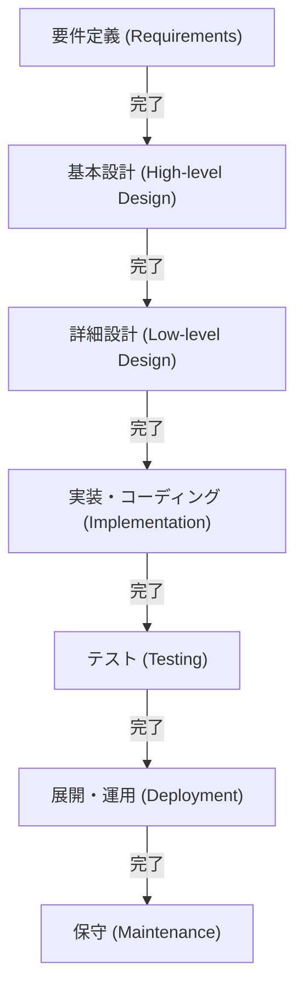

# ウォーターフォールモデル：ソフトウェア開発における伝統と確実性の追求

ソフトウェア開発の歴史において、最も初期から存在し、現在でもなお特定の領域で確固たる地位を築いているのが「ウォーターフォールモデル」です。水が滝を流れ落ちるように、一つの工程が完了してから次の工程へと進むこの手法は、その直感的で分かりやすい構造から、長年にわたりシステム開発のデファクトスタンダードとして機能してきました。

本記事では、ウォーターフォールモデルの起源と歴史、各フェーズの詳細な解説、理論的背景、そしてメリットとデメリットを深く掘り下げます。さらに、現代の開発手法であるアジャイルとの比較や、現代においてウォーターフォールがどのように適応し進化しているかについても考察します。

## 1. ウォーターフォールモデルの起源と歴史

ウォーターフォールモデルという概念が初めて明確に言語化されたのは、1970年にウィンストン・W・ロイス（Winston W. Royce）が発表した論文「Managing the Development of Large Software Systems（大規模ソフトウェアシステムの開発管理）」であると広く認識されています。

しかし、興味深い歴史の皮肉として、ロイス自身はこの論文の中で「単純なトップダウン型のプロセス（後のウォーターフォール）にはリスクがある」と指摘し、工程間のフィードバックループ（反復）の重要性を主張していました。それにもかかわらず、論文内で図解された「要件→設計→実装→テスト」という一方向の流れが非常にわかりやすかったため、フィードバックループの部分が抜け落ちた形で「ウォーターフォールモデル」として広まってしまったのです。

1980年代に入ると、アメリカ国防総省（DoD）がソフトウェア開発の標準規格として「DOD-STD-2167」を制定しました。この規格が実質的にウォーターフォール型のプロセスを義務付けていたため、軍事・航空宇宙産業から始まり、民間企業の大規模システム開発においてもウォーターフォールモデルが標準的な手法として定着することになりました。

## 2. ウォーターフォールモデルの各フェーズ

ウォーターフォールモデルは、ソフトウェア開発のライフサイクルを論理的かつ連続的なフェーズに分割します。以下は、一般的なウォーターフォールモデルのフェーズ構成です。

### 2.1 要件定義 (Requirements Gathering and Analysis)
プロジェクトの出発点であり、最も重要なフェーズです。顧客やステークホルダーの要望をヒアリングし、システムが何を実現すべきかを定義します。機能要件（システムができること）だけでなく、非機能要件（パフォーマンス、セキュリティ、可用性など）も詳細に文書化されます。このフェーズの成果物は「要件定義書」であり、以降のすべてのフェーズの基盤となります。

### 2.2 システム設計 (System Design)
要件定義書に基づき、システム全体のアーキテクチャを設計します。通常は「基本設計（外部設計）」と「詳細設計（内部設計）」の2段階に分かれます。
- **基本設計**: ユーザーインターフェース、データベースの論理設計、システム間の連携など、ユーザーから見える部分の設計を行います。
- **詳細設計**: 基本設計をプログラマがコーディングできるレベルにまで落とし込みます。クラス図、アルゴリズム、データベースの物理設計などが含まれます。

### 2.3 実装・コーディング (Implementation)
詳細設計書に従って、実際にソースコードを記述するフェーズです。設計書が精緻に作られていれば、プログラマは純粋にコードの記述と単体テスト（Unit Testing）に集中することができます。この段階で各モジュール（部品）が完成します。

### 2.4 結合・システムテスト (Integration and Testing)
実装された個々のモジュールを結合し、システム全体として正しく機能するかを検証します。
- **結合テスト**: 複数のモジュールを組み合わせて、インターフェースの不整合がないかを確認します。
- **システムテスト**: システム全体が要件定義書で定められた仕様を満たしているかをテストします。パフォーマンステストやセキュリティテストもここで行われます。

### 2.5 展開・運用 (Deployment)
テストが完了し、品質基準を満たしたシステムを本番環境にデプロイ（展開）します。エンドユーザーが実際にシステムを利用し始めるフェーズです。

### 2.6 保守 (Maintenance)
システム稼働後に発見されたバグの修正、OSやミドルウェアのアップデートへの対応、環境変化に伴う微小な機能改善などを行います。ソフトウェアのライフサイクル全体で見ると、この保守フェーズにかかるコストと時間が最も大きくなることが一般的です。

## 3. ウォーターフォールモデルの理論的背景

ウォーターフォールモデルは、ハードウェアの製造業や建設業などの伝統的なエンジニアリング手法（システム工学）をソフトウェア開発に応用したものです。建物を建てる際に、基礎工事が終わらないと柱を立てられないのと同じように、ソフトウェアも「設計図（要件・設計）が完成しなければ、製造（コーディング）には移れない」という前提に立っています。

このモデルの根底にあるのは**「予測可能性（Predictability）」**と**「制御可能性（Controllability）」**への強い要求です。大規模なプロジェクトでは、何百人ものエンジニアが関与し、莫大な予算が動きます。プロジェクトマネージャーにとって、現在の進捗状況がどのフェーズにあるのか、次のマイルストーンはいつか、コストは予算内に収まっているかを定量的に管理・制御できることは至上命題なのです。

## 4. ウォーターフォールモデルのメリットと強み

### 4.1 明確なマイルストーンと進捗管理
各フェーズの完了条件が明確（例：「設計書の承認」をもって設計フェーズ完了）であるため、プロジェクトの進捗状況を容易に把握できます。ガントチャートを用いたスケジュール管理と非常に相性が良いです。

### 4.2 ドキュメントによる品質担保
各フェーズ間の引き継ぎは、基本的にドキュメント（仕様書、設計書）を通じて行われます。これにより、属人化（特定の個人しかシステムの仕様を知らない状態）を防ぎ、開発メンバーが途中で交代した場合でもプロジェクトを継続しやすくなります。

### 4.3 予算とスケジュールの見積もり精度
要件定義と設計を早い段階で徹底的に行うため、プロジェクト全体で必要な工数やコストを初期段階で比較的正確に見積もることができます。これは、固定価格（請負契約）でのシステム開発において非常に重要な要素です。

### 4.4 規制やコンプライアンスへの対応
医療機器のソフトウェアや航空機の制御システム、金融機関の基幹システムなど、厳格な監査や法的規制への準拠が求められる分野では、プロセスごとに詳細なドキュメントと承認履歴を残すウォーターフォールモデルが必須要件となることが多くあります。

## 5. ウォーターフォールモデルのデメリットと批判

### 5.1 変更への対応力の低さ（硬直性）
ウォーターフォールモデル最大の弱点は、要件の変更に対して非常に脆いことです。後続のフェーズ（例えばテスト段階）で要件の漏れや仕様変更が発生すると、設計や要件定義まで遡ってやり直す必要があり（手戻り）、莫大なコストと時間の遅延が発生します。

### 5.2 顧客が完成品を見るのが遅い
要件定義フェーズで顧客と合意を形成しますが、顧客が実際に動くソフトウェアに触れることができるのは、プロジェクトの終盤（テストフェーズや運用フェーズ）になります。「紙の上の仕様書」と「実際の使い勝手」には乖離があることが多く、完成間近になって「思っていたものと違う」という重大な認識のズレが発覚するリスクがあります。

### 5.3 「ビッグバン・インテグレーション」のリスク
すべてのモジュールが完成してから最後に一気に結合してテストを行うため、問題が噴出することが多々あります。問題の特定が困難になり、テストフェーズでスケジュールが大幅に遅延する原因となります。

## 6. ウォーターフォールとアジャイル：パラダイムの比較

2000年代以降、ソフトウェア開発の主流は「アジャイル開発」へと移行してきました。両者の違いは、不確実性に対するアプローチの決定的な違いにあります。

| 特徴 | ウォーターフォール | アジャイル |
|---|---|---|
| **基本思想** | 計画通りに進めることを重視 | 変化に対応することを重視 |
| **要件の確定** | プロジェクト初期に完全に固定 | 開発を進めながら継続的に見直し |
| **開発サイクル** | 大規模な1回のサイクル | 短期間（1〜4週間）の反復サイクル |
| **ドキュメント** | 網羅的・詳細なドキュメントを要求 | 動作するソフトウェアを優先 |
| **顧客の関与** | 初期（要件）と終盤（検収）に集中 | プロジェクト全体を通して継続的に関与 |
| **適したプロジェクト** | 仕様が明確で変化しない、大規模、ミッションクリティカル | 仕様が不確実、市場の変化が速い、新規事業 |

ウォーターフォールは「変化を最小限に抑える」ことでリスクを管理しますが、アジャイルは「変化は必然である」と受け入れ、小刻みなリリースによってリスクを分散させます。

## 7. 現代におけるウォーターフォールの進化と適用

アジャイルが台頭した現代でも、ウォーターフォールモデルが消滅したわけではありません。適材適所で利用されるとともに、その弱点を補うための進化を遂げています。

### 7.1 V字モデル (V-Model)
ウォーターフォールの開発フェーズとテストフェーズの対応関係を明確にしたモデルです。例えば「基本設計」に対するテストが「システムテスト」、「詳細設計」に対するテストが「結合テスト」というように、V字の左側（開発）と右側（テスト）を対応付けることで、テストの品質とトレーサビリティを向上させます。

### 7.2 サシミモデル (Sashimi Model)
フェーズを完全に直列にするのではなく、刺身の切り身のようにフェーズ同士をオーバーラップさせる手法です。例えば、すべての設計が完了する前に、確定した部分から実装を開始することで、開発期間の短縮を図ります。

### 7.3 ウォーターフォールとアジャイルのハイブリッド
大規模プロジェクトにおいて、システム全体の基盤アーキテクチャや要件定義はウォーターフォールで厳格に定めつつ、個別の機能モジュールの開発はアジャイル（スクラムなど）で反復的に行う「ハイブリッドアプローチ」を採用する企業が増えています。

## 8. 結論：確実性を求めるエンジニアリングの系譜

ウォーターフォールモデルは、「古い」「時代遅れ」と批判されることも少なくありません。しかし、その根底にある「作るものを明確に定義し、計画を立て、順序立てて実行する」という哲学は、システムエンジニアリングの基本中の基本です。

人類が宇宙ロケットを打ち上げ、巨大な橋を架けることができるのは、この計画駆動型のアプローチがあるからです。ソフトウェア開発においても、人命に関わる医療システムや、社会インフラを支える金融システムなど、「絶対に失敗が許されない」プロジェクトにおいては、ウォーターフォールモデルの提供する「確実性」と「説明責任」が今後も不可欠であり続けるでしょう。

技術の進化やビジネス環境の変化に伴い、開発手法のトレンドは変遷しますが、ウォーターフォールモデルの本質的な価値を理解することは、すべてのソフトウェアエンジニアにとって、より良いシステムを構築するための揺るぎない土台となるのです。
