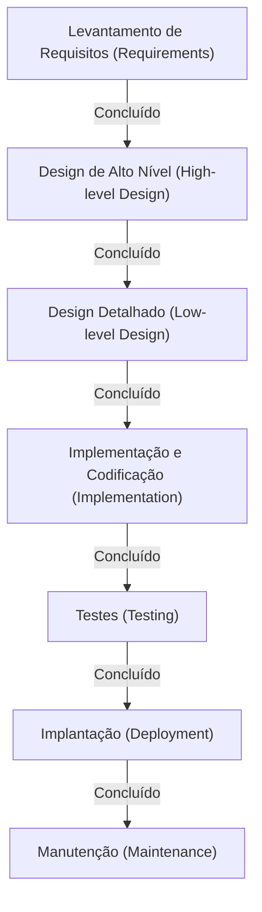

# Modelo Cascata: A Busca pela Tradição e Certeza no Desenvolvimento de Software

Na história do desenvolvimento de software, um dos métodos que existe desde os primórdios e ainda mantém uma posição firme em áreas específicas é o "Modelo Cascata" (Waterfall Model). Assim como a água flui por uma cachoeira, caindo continuamente, este método avança para a próxima etapa apenas quando a anterior é concluída. Devido à sua estrutura intuitiva e fácil de compreender, funcionou como o padrão de fato para o desenvolvimento de sistemas durante muitos anos.

Neste artigo, aprofundaremos nas origens e na história do modelo cascata, explicaremos detalhadamente cada uma de suas fases, seu contexto teórico, bem como as suas vantagens e desvantagens. Além disso, faremos uma comparação com a metodologia de desenvolvimento moderna, o Ágil, e refletiremos sobre como o modelo cascata está se adaptando e evoluindo nos dias de hoje.

## 1. A Origem e a História do Modelo Cascata

Reconhece-se amplamente que o conceito do modelo cascata foi verbalizado de forma clara pela primeira vez em 1970, em um artigo publicado por Winston W. Royce, intitulado "Managing the Development of Large Software Systems" (Gerenciando o Desenvolvimento de Grandes Sistemas de Software).

No entanto, em uma ironia interessante da história, o próprio Royce apontou neste artigo que "um processo simples de cima para baixo (o que viria a ser o cascata) apresenta riscos", defendendo a importância de loops de feedback (iterações) entre as etapas. Apesar disso, como o fluxo unidirecional ilustrado no artigo — "Requisitos → Design → Implementação → Testes" — era extremamente fácil de entender, ele acabou se popularizando como o "Modelo Cascata", deixando de lado a parte dos loops de feedback.

Na década de 1980, o Departamento de Defesa dos Estados Unidos (DoD) estabeleceu o "DOD-STD-2167" como o padrão para o desenvolvimento de software. Como essa norma efetivamente exigia um processo do tipo cascata, o modelo começou na indústria militar e aeroespacial e posteriormente se consolidou como o método padrão no desenvolvimento de sistemas de grande escala por empresas privadas.

## 2. As Fases do Modelo Cascata

O modelo cascata divide o ciclo de vida do desenvolvimento de software em fases lógicas e sequenciais. Abaixo está a estrutura típica das fases do modelo cascata.

### 2.1 Levantamento e Análise de Requisitos (Requirements Gathering and Analysis)
É o ponto de partida do projeto e a fase mais crucial. Envolve ouvir as demandas dos clientes e stakeholders para definir o que o sistema deve realizar. Não apenas os requisitos funcionais (o que o sistema pode fazer), mas também os requisitos não funcionais (desempenho, segurança, disponibilidade, etc.) são documentados detalhadamente. O artefato desta fase é o "Documento de Especificação de Requisitos", que servirá de base para todas as fases subsequentes.

### 2.2 Design do Sistema (System Design)
Com base no documento de requisitos, a arquitetura de todo o sistema é projetada. Geralmente, divide-se em duas etapas: "Design Básico (Design Externo)" e "Design Detalhado (Design Interno)".
- **Design Básico**: Envolve o projeto das partes visíveis ao usuário, como a interface do usuário, o design lógico do banco de dados e a integração entre sistemas.
- **Design Detalhado**: Transforma o design básico a um nível em que os programadores possam codificar. Inclui diagramas de classes, algoritmos e o design físico do banco de dados.

### 2.3 Implementação e Codificação (Implementation)
Esta é a fase onde o código-fonte é efetivamente escrito, seguindo as especificações do design detalhado. Se a documentação do design tiver sido elaborada com precisão, os programadores podem se concentrar puramente em escrever o código e realizar os testes unitários (Unit Testing). É nesta etapa que cada módulo (componente) é concluído.

### 2.4 Integração e Testes de Sistema (Integration and Testing)
Os módulos individuais implementados são combinados para verificar se funcionam corretamente como um sistema completo.
- **Testes de Integração**: Combina vários módulos para garantir que não haja inconsistências em suas interfaces.
- **Testes de Sistema**: Verifica se todo o sistema atende às especificações definidas no documento de requisitos. Testes de desempenho e de segurança também são realizados aqui.

### 2.5 Implantação e Operação (Deployment)
Após a conclusão dos testes e quando o sistema atende aos padrões de qualidade estabelecidos, ele é implantado no ambiente de produção. É a fase em que os usuários finais começam a utilizar efetivamente o sistema.

### 2.6 Manutenção (Maintenance)
Envolve a correção de bugs descobertos após o sistema entrar em operação, adaptações a atualizações de sistemas operacionais ou middlewares e pequenas melhorias de funcionalidades devido a mudanças no ambiente. Ao longo de todo o ciclo de vida do software, os custos e o tempo dedicados a esta fase de manutenção costumam ser, em geral, os maiores.

## 3. Contexto Teórico do Modelo Cascata

O modelo cascata é uma aplicação das metodologias tradicionais de engenharia (engenharia de sistemas) vistas em setores como a fabricação de hardware ou a construção civil, adaptadas para o desenvolvimento de software. Da mesma forma que na construção civil não é possível erguer pilares sem antes concluir as fundações, o modelo pressupõe que, no software, "não se pode passar para a fabricação (codificação) sem que a planta (requisitos e design) esteja concluída".

Na base desse modelo reside uma forte demanda por **"Previsibilidade" (Predictability)** e **"Controlabilidade" (Controllability)**. Em projetos de grande escala, onde centenas de engenheiros estão envolvidos e orçamentos gigantescos estão em jogo, para os gerentes de projeto, é um imperativo absoluto poder quantificar, gerenciar e controlar em qual fase o progresso atual se encontra, quando será o próximo marco e se os custos estão dentro do orçamento.

## 4. Vantagens e Pontos Fortes do Modelo Cascata

### 4.1 Marcos Claros e Gestão de Progresso
Como os critérios de conclusão de cada fase são claros (ex: "aprovação do documento de design" sinaliza a conclusão da fase de design), é fácil acompanhar o progresso do projeto. Combina extremamente bem com a gestão de cronogramas utilizando gráficos de Gantt.

### 4.2 Garantia de Qualidade Através de Documentação
A transição entre as fases é realizada basicamente por meio de documentação (especificações, documentos de design). Isso previne a dependência excessiva de indivíduos (situações onde apenas uma pessoa conhece as especificações do sistema) e facilita a continuidade do projeto mesmo que ocorram trocas na equipe de desenvolvimento no meio do processo.

### 4.3 Precisão nas Estimativas de Orçamento e Cronograma
Ao realizar o levantamento de requisitos e o design de forma minuciosa logo no início, torna-se possível estimar com relativa precisão o esforço e os custos necessários para todo o projeto desde os estágios iniciais. Este é um fator crucial no desenvolvimento de sistemas sob contratos de preço fixo.

### 4.4 Atendimento a Regulamentações e Conformidade
Em setores que exigem conformidade rigorosa com auditorias e regulamentações legais — como softwares para equipamentos médicos, sistemas de controle de aeronaves ou sistemas centrais de instituições financeiras — o modelo cascata, que deixa registros detalhados de documentação e aprovações em cada etapa do processo, muitas vezes se torna um requisito essencial.

## 5. Desvantagens e Críticas ao Modelo Cascata

### 5.1 Baixa Capacidade de Adaptação a Mudanças (Rigidez)
A maior fraqueza do modelo cascata é a sua extrema fragilidade diante de mudanças nos requisitos. Se uma omissão de requisito ou uma alteração de especificação ocorrer nas fases posteriores (por exemplo, na fase de testes), é necessário voltar e refazer o trabalho desde as fases de design ou levantamento de requisitos (retrabalho), resultando em custos massivos e atrasos de cronograma.

### 5.2 Atraso para o Cliente Ver o Produto Final
Embora se forme um acordo com o cliente na fase de requisitos, o momento em que o cliente pode efetivamente interagir com o software funcionando ocorre apenas no final do projeto (fase de testes ou implantação). Frequentemente, há uma discrepância entre "a especificação no papel" e a "usabilidade real", criando o risco de que uma grave diferença de percepção seja descoberta quase na entrega, com o cliente sentindo que "isso não é o que eu esperava".

### 5.3 O Risco da "Integração Big Bang"
Como os testes ocorrem combinando tudo de uma vez no final, após todos os módulos terem sido concluídos, os problemas tendem a surgir em abundância simultaneamente. Identificar a origem dos problemas torna-se difícil, o que muitas vezes é a causa de atrasos significativos no cronograma durante a fase de testes.

## 6. Cascata vs. Ágil: A Comparação de Paradigmas

A partir da década de 2000, o foco principal no desenvolvimento de software mudou para o "Desenvolvimento Ágil". A diferença entre os dois está fundamentalmente nas suas abordagens em relação à incerteza.

| Característica | Cascata | Ágil |
|---|---|---|
| **Filosofia Básica** | Valoriza a execução conforme o planejado | Valoriza a adaptação e resposta a mudanças |
| **Definição de Requisitos** | Totalmente fixados no início do projeto | Revisados continuamente enquanto se desenvolve |
| **Ciclo de Desenvolvimento** | Um único ciclo de grande escala | Ciclos iterativos curtos (1 a 4 semanas) |
| **Documentação** | Exige documentação detalhada e abrangente | Prioriza o software em funcionamento |
| **Envolvimento do Cliente** | Concentrado no início (requisitos) e no fim (aceitação) | Envolvimento contínuo ao longo de todo o projeto |
| **Projetos Adequados** | Escala grande, missão crítica, especificações claras e inalteráveis | Especificações incertas, rápidas mudanças no mercado, novos negócios |

Enquanto o Cascata gerencia os riscos tentando "manter as mudanças em um nível mínimo", o Ágil aceita que "a mudança é inevitável" e dispersa os riscos através de lançamentos pequenos e frequentes.

## 7. A Evolução e a Aplicação do Cascata na Atualidade

Mesmo na era moderna, com a ascensão do Ágil, o modelo cascata não desapareceu. Ele não só é utilizado nos cenários adequados (onde se encaixa melhor), como também passou por evoluções para compensar as suas fraquezas.

### 7.1 Modelo V (V-Model)
É um modelo que clarifica a relação de correspondência entre as fases de desenvolvimento e as fases de teste no cascata. Por exemplo, os testes correspondentes ao "Design Básico" são os "Testes de Sistema", e os testes para o "Design Detalhado" são os "Testes de Integração". Mapear o lado esquerdo (desenvolvimento) com o lado direito (testes) do 'V' melhora a qualidade e a rastreabilidade dos testes.

### 7.2 Modelo Sashimi (Sashimi Model)
Em vez de tornar as fases completamente sequenciais (em série), é uma técnica que sobrepõe as fases umas às outras, assim como fatias de sashimi. Por exemplo, antes de todo o design estar concluído, inicia-se a implementação a partir das partes já definidas, visando reduzir o tempo total de desenvolvimento.

### 7.3 Híbrido: Cascata e Ágil
Em projetos de grande escala, um número crescente de empresas tem adotado uma "abordagem híbrida", onde a arquitetura de base de todo o sistema e a definição de requisitos são rigorosamente estabelecidas usando o cascata, enquanto o desenvolvimento de módulos funcionais individuais é realizado de forma iterativa usando metodologias ágeis (como o Scrum).

## 8. Conclusão: A Linhagem da Engenharia em Busca de Certezas

O modelo cascata não raramente é criticado como "antigo" ou "obsoleto". No entanto, a filosofia fundamental por trás dele, que dita "definir claramente o que será construído, planejar e executar ordenadamente", é a base essencial e mais básica da engenharia de sistemas.

A humanidade é capaz de lançar foguetes espaciais e construir pontes gigantescas graças a essa abordagem orientada a planejamento. Mesmo no desenvolvimento de software, em projetos em que "a falha é absolutamente inaceitável", como sistemas médicos que envolvem vidas humanas ou sistemas financeiros que sustentam infraestruturas sociais, a "Certeza" e a "Responsabilidade" (accountability) oferecidas pelo modelo cascata continuarão a ser indispensáveis no futuro.

As tendências nas metodologias de desenvolvimento mudam acompanhando as evoluções tecnológicas e as transformações do ambiente de negócios, mas a compreensão do valor intrínseco do modelo cascata fornece, a todos os engenheiros de software, uma base inabalável para construir sistemas melhores.
