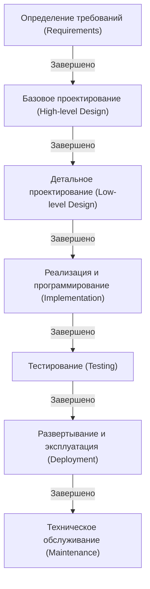

# Каскадная модель: Традиции и стремление к надежности в разработке программного обеспечения

В истории разработки программного обеспечения «каскадная модель» (waterfall model) существует с самых ранних этапов и до сих пор сохраняет прочные позиции в определенных областях. Этот метод, при котором процесс переходит к следующему этапу только после завершения предыдущего — подобно воде, падающей водопадом — благодаря своей интуитивно понятной и ясной структуре на протяжении многих лет служил стандартом де-факто при разработке систем.

В этой статье мы глубоко погрузимся в происхождение и историю каскадной модели, дадим подробное объяснение каждого этапа, рассмотрим теоретическую базу, а также плюсы и минусы. Кроме того, мы сравним её с современным подходом — Agile — и поразмышляем о том, как каскадная модель адаптируется и эволюционирует в наши дни.

## 1. Происхождение и история каскадной модели

Широко признано, что концепция каскадной модели была впервые четко сформулирована в статье Уинстона У. Ройса (Winston W. Royce) «Управление разработкой крупных программных систем» (Managing the Development of Large Software Systems), опубликованной в 1970 году.

Однако по иронии судьбы сам Ройс в этой статье отмечал, что «простой нисходящий процесс (позднее названный каскадным) несет в себе риски», и настаивал на важности петель обратной связи (итераций) между этапами. Несмотря на это, проиллюстрированный в статье однонаправленный поток «Требования → Проектирование → Реализация → Тестирование» оказался настолько понятным, что он получил широкое распространение под названием «каскадная модель» в урезанном виде, без учета петель обратной связи.

В 1980-х годах Министерство обороны США (DoD) утвердило стандарт «DOD-STD-2167» в качестве регламента разработки программного обеспечения. Поскольку этот стандарт фактически обязывал использовать каскадный процесс, модель начала применяться в военной и аэрокосмической промышленности, а затем утвердилась как стандартный метод разработки масштабных систем в частном секторе.

## 2. Этапы каскадной модели

Каскадная модель разделяет жизненный цикл разработки программного обеспечения на логические и последовательные этапы. Ниже представлена типовая структура этапов каскадной модели.

### 2.1 Определение требований (Requirements Gathering and Analysis)
Это отправная точка проекта и самый важный этап. Проводится опрос клиентов и заинтересованных сторон, чтобы определить, что именно должна реализовывать система. Подробно документируются не только функциональные требования (то, что система должна делать), но и нефункциональные требования (производительность, безопасность, доступность и т.д.). Результатом этого этапа является «Спецификация требований», которая служит фундаментом для всех последующих этапов.

### 2.2 Проектирование системы (System Design)
На основе спецификации требований разрабатывается архитектура всей системы. Обычно этот этап делится на две стадии: «Базовое проектирование (внешнее проектирование)» и «Детальное проектирование (внутреннее проектирование)».
- **Базовое проектирование**: Проектирование видимой для пользователя части, включая пользовательский интерфейс, логическое проектирование базы данных и интеграцию между системами.
- **Детальное проектирование**: Детализация базового проекта до уровня, на котором программисты могут приступить к написанию кода. Включает диаграммы классов, алгоритмы, физическое проектирование базы данных и т.д.

### 2.3 Реализация и программирование (Implementation)
На этом этапе в соответствии с документацией детального проектирования пишется исходный код. Если проектная документация составлена тщательно, программисты могут полностью сосредоточиться на написании кода и модульном тестировании (Unit Testing). На этой стадии завершается создание каждого модуля (компонента).

### 2.4 Интеграция и системное тестирование (Integration and Testing)
Реализованные отдельные модули объединяются, и проверяется, корректно ли функционирует система в целом.
- **Интеграционное тестирование**: Объединение нескольких модулей для проверки отсутствия несоответствий в интерфейсах.
- **Системное тестирование**: Проверка того, соответствует ли вся система спецификациям, определенным в документе с требованиями. Здесь также проводятся тесты производительности и безопасности.

### 2.5 Развертывание и эксплуатация (Deployment)
После завершения тестирования система, отвечающая стандартам качества, развертывается в производственной среде. Это этап, когда конечные пользователи фактически начинают использовать систему.

### 2.6 Техническое обслуживание (Maintenance)
Включает исправление ошибок, обнаруженных после запуска системы, адаптацию к обновлениям ОС или промежуточного программного обеспечения, а также внесение незначительных функциональных улучшений в связи с изменением среды. В рамках всего жизненного цикла программного обеспечения затраты времени и средств на этап технического обслуживания обычно являются самыми значительными.

## 3. Теоретические основы каскадной модели

Каскадная модель представляет собой применение традиционных инженерных методов (системной инженерии), используемых в аппаратном производстве или строительстве, к разработке программного обеспечения. Подобно тому как при строительстве здания невозможно возводить колонны до завершения фундамента, в разработке программного обеспечения действует принцип: «Нельзя переходить к производству (программированию), пока не будут готовы чертежи (требования и проектирование)».

В основе этой модели лежат строгие требования к **«Предсказуемости» (Predictability)** и **«Управляемости» (Controllability)**. В масштабных проектах задействованы сотни инженеров и огромные бюджеты. Для руководителя проекта жизненно важно иметь возможность количественно управлять и контролировать текущее состояние прогресса, сроки наступления следующего контрольного события (вехи) и соблюдение рамок бюджета.

## 4. Преимущества и сильные стороны каскадной модели

### 4.1 Четкие контрольные точки и управление прогрессом
Поскольку условия завершения каждого этапа четко определены (например, «утверждение проектной документации» означает завершение этапа проектирования), можно легко отслеживать ход выполнения проекта. Эта модель прекрасно сочетается с управлением расписанием с помощью диаграмм Ганта.

### 4.2 Обеспечение качества через документацию
Передача информации между этапами в основном осуществляется через документы (спецификации, проекты). Это предотвращает зависимость от конкретных людей (ситуацию, когда спецификации системы знает только один человек) и облегчает продолжение проекта даже в случае смены членов команды разработчиков.

### 4.3 Точность оценки бюджета и сроков
Поскольку определение требований и проектирование тщательно выполняются на ранних этапах, общие трудозатраты и стоимость проекта можно относительно точно оценить с самого начала. Это крайне важный фактор при разработке систем с фиксированной ценой (по контракту с твердой ценой).

### 4.4 Соответствие нормативным требованиям и стандартам
В областях, требующих строгого соблюдения законодательства и прохождения аудита (например, программное обеспечение для медицинского оборудования, системы управления самолетами или базовые системы финансовых учреждений), каскадная модель, оставляющая подробную документацию и историю согласований на каждом процессе, часто является обязательным требованием.

## 5. Недостатки и критика каскадной модели

### 5.1 Низкая адаптивность к изменениям (жесткость)
Самым большим недостатком каскадной модели является ее крайняя уязвимость к изменениям требований. Если на последующих этапах (например, во время тестирования) обнаруживаются упущения в требованиях или возникает необходимость изменить спецификации, приходится возвращаться назад вплоть до проектирования или определения требований, что приводит к колоссальным затратам и задержкам сроков.

### 5.2 Заказчик видит готовый продукт слишком поздно
Хотя согласование с заказчиком происходит на этапе определения требований, он получает возможность поработать с реально функционирующим программным обеспечением лишь на поздних стадиях проекта (на этапах тестирования или эксплуатации). Часто возникает разрыв между «спецификацией на бумаге» и «реальным удобством использования», что несет риск выявления серьезных расхождений ожиданий типа «я думал, это будет иначе» в самом конце разработки.

### 5.3 Риск интеграции по принципу «Большого взрыва»
Поскольку тестирование проводится в самом конце, после объединения всех готовых модулей, часто возникает множество проблем. Это усложняет локализацию ошибок и становится причиной значительных задержек в расписании на этапе тестирования.

## 6. Каскадная модель и Agile: Сравнение парадигм

Начиная с 2000-х годов мейнстримом в разработке программного обеспечения стала «Agile-разработка» (гибкая методология). Разница между ними заключается в принципиально разном подходе к неопределенности.

| Характеристика | Каскадная модель (Waterfall) | Гибкая методология (Agile) |
|---|---|---|
| **Основная философия** | Акцент на следовании плану | Акцент на адаптации к изменениям |
| **Фиксация требований** | Полностью фиксируются в начале проекта | Постоянный пересмотр в ходе разработки |
| **Цикл разработки** | Один масштабный цикл | Короткие итеративные циклы (1–4 недели) |
| **Документация** | Требуется исчерпывающая и подробная документация | Приоритет работающему программному обеспечению |
| **Вовлеченность клиента** | Сконцентрирована в начале (требования) и в конце (приемка) | Постоянное участие на протяжении всего проекта |
| **Подходящие проекты** | Четкие и неизменные спецификации, масштабные, критически важные (mission-critical) | Неопределенные спецификации, быстро меняющийся рынок, новые направления бизнеса |

Каскадная модель управляет рисками путем «минимизации изменений», тогда как Agile принимает «изменения как неизбежность» и распределяет риски с помощью частых релизов.

## 7. Эволюция и применение каскадной модели в современности

Даже в эпоху расцвета Agile каскадная модель не исчезла. Она применяется там, где это целесообразно, и эволюционирует, чтобы компенсировать свои недостатки.

### 7.1 V-образная модель (V-Model)
Это модель, которая четко определяет соответствие между этапами разработки и этапами тестирования в каскадной модели. Например, тестированием для «базового проектирования» является «системное тестирование», а для «детального проектирования» — «интеграционное тестирование». Связывая левую сторону V (разработка) с правой (тестирование), можно повысить качество тестирования и прослеживаемость.

### 7.2 Модель «Сашими» (Sashimi Model)
Это метод, при котором этапы не следуют строго последовательно, а перекрывают друг друга, подобно кусочкам нарезанного сашими. Например, реализация может начаться для утвержденных частей еще до завершения всего проектирования, что позволяет сократить сроки разработки.

### 7.3 Гибрид каскадной модели и Agile
Все больше компаний применяют «гибридный подход» в крупных проектах, когда базовая архитектура всей системы и определение требований строго фиксируются по каскадной модели, а разработка отдельных функциональных модулей ведется итеративно с использованием Agile (например, Scrum).

## 8. Заключение: Традиции инженерии в поисках надежности

Каскадную модель нередко критикуют как «устаревшую» и «несовременную». Однако лежащая в ее основе философия — «четко определить то, что будет создано, составить план и последовательно его выполнить» — является фундаментальной основой системной инженерии.

Только благодаря такому подходу, ориентированному на планирование, человечество способно запускать космические ракеты и строить гигантские мосты. В разработке программного обеспечения для проектов, где «ошибка абсолютно недопустима», таких как медицинские системы, от которых зависят жизни людей, или финансовые системы, поддерживающие социальную инфраструктуру, «надежность» и «подотчетность», обеспечиваемые каскадной моделью, будут оставаться жизненно необходимыми.

Тенденции в методологиях разработки меняются вместе с развитием технологий и изменениями бизнес-среды, но понимание внутренней ценности каскадной модели станет для любого инженера-программиста незыблемым фундаментом для создания более совершенных систем.
