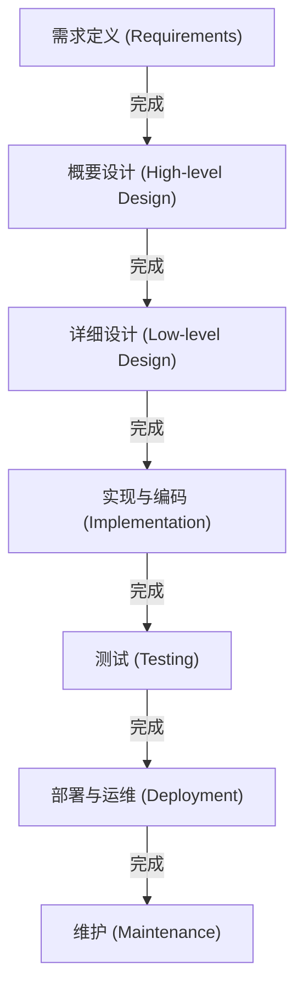

# 瀑布模型：在软件开发中对传统与确定性的追求

在软件开发的历史长河中，从最早期便已存在，且至今仍在特定领域占据着坚不可摧地位的，便是“瀑布模型”。正如水流从瀑布飞泻而下一般，在一个阶段完成后才进入下一个阶段的这种方法，凭借其直观且易于理解的结构，多年来一直作为系统开发的实施标准（De facto standard）发挥着作用。

本文将深入探讨瀑布模型的起源与历史、各个阶段的详细解析、理论背景，以及其优点与缺点。此外，我们还将考察它与现代开发方法——敏捷开发的对比，以及在当今时代瀑布模型是如何适应并演进的。

## 1. 瀑布模型的起源与历史

“瀑布模型”这一概念首次被明确化，被广泛认为是温斯顿·W·罗伊斯（Winston W. Royce）在1970年发表的论文《大型软件系统开发的管理》（Managing the Development of Large Software Systems）中提出的。

然而，一个有趣的历史反讽是，罗伊斯本人在这篇论文中指出“简单的自上而下型的流程（即后来的瀑布模型）存在风险”，并主张了阶段间反馈循环（迭代）的重要性。尽管如此，论文中所图解的“需求→设计→实现→测试”这种单向流程实在太过通俗易懂，以至于缺失了反馈循环部分的内容，最终以“瀑布模型”的形式流传开来。

进入20世纪80年代，美国国防部（DoD）制定了“DOD-STD-2167”作为软件开发的标准规范。由于该规范实质上强制要求采用瀑布型的开发流程，从军事与航空航天工业开始，即便在民间企业的大型系统开发中，瀑布模型也作为一种标准方法被确立下来。

## 2. 瀑布模型的各个阶段

瀑布模型将软件开发的生命周期划分为逻辑性且连续的多个阶段。以下是典型的瀑布模型阶段构成。

### 2.1 需求定义 (Requirements Gathering and Analysis)
这是项目的起点，也是最重要的阶段。通过听取客户及利益相关者的诉求，定义系统应该实现什么目标。不仅是功能需求（系统能做什么），非功能需求（性能、安全性、可用性等）也会被详细地记录在文档中。这一阶段的交付物是“需求定义文档”，它将成为后续所有阶段的基础。

### 2.2 系统设计 (System Design)
基于需求定义文档，对整个系统的架构进行设计。通常分为“概要设计（外部设计）”和“详细设计（内部设计）”两个阶段。
- **概要设计**: 进行用户界面、数据库的逻辑设计、系统间的集成等用户可见部分的设计。
- **详细设计**: 将概要设计细化到程序员可以进行编码的程度。包括类图、算法、数据库的物理设计等。

### 2.3 实现与编码 (Implementation)
遵循详细设计文档，实际编写源代码的阶段。如果设计文档制作得足够精细，程序员就可以纯粹地集中精力编写代码和进行单元测试（Unit Testing）。在这一阶段，各个模块（组件）将得以完成。

### 2.4 集成与系统测试 (Integration and Testing)
将实现完毕的各个模块组合起来，验证作为整个系统是否能正确运作。
- **集成测试**: 将多个模块组合，确认接口是否存在不匹配的情况。
- **系统测试**: 测试整个系统是否满足需求定义文档中规定的规范。性能测试和安全测试也会在这里进行。

### 2.5 部署与运维 (Deployment)
测试完成，将满足质量标准的系统部署（展开）到生产环境中。这是最终用户实际开始使用系统的阶段。

### 2.6 维护 (Maintenance)
修复系统上线后发现的Bug，应对操作系统或中间件的更新，以及伴随环境变化进行的微小功能改进等。纵观软件的整个生命周期，通常在此维护阶段所耗费的成本和时间是最大的。

## 3. 瀑布模型的理论背景

瀑布模型是将硬件制造业或建筑业等传统的工程方法（系统工程）应用到软件开发中的产物。就像建造房屋时，基础工程不完成就无法立柱一样，它建立在软件也必须遵循“设计图（需求与设计）如果不完成，就无法进入制造（编码）环节”这一前提之上。

支撑这一模型的根本，是对**“可预测性（Predictability）”**与**“可控性（Controllability）”**的强烈需求。在大型项目中，会有数百名工程师参与，动用极其庞大的预算。对于项目经理而言，能够定量地管理和控制当前的进度处于哪个阶段、下一个里程碑在何时、成本是否控制在预算范围内，这是至高无上的使命。

## 4. 瀑布模型的优点与优势

### 4.1 明确的里程碑与进度管理
由于每个阶段的完成条件都很明确（例如：以“设计文档的批准”作为设计阶段完成的标志），因此能够轻易掌握项目的进展状况。这与使用甘特图进行进度管理非常契合。

### 4.2 依靠文档保障质量
各阶段之间的交接，基本上是通过文档（规格说明书、设计文档）来进行的。这防止了过度依赖个人（只有特定的个人知道系统规范的状态），即使开发成员中途发生更换，也容易让项目继续推进。

### 4.3 预算与进度的估算精度
由于在早期阶段进行了彻底的需求定义和设计，因此能够在初期相对准确地估算出整个项目所需的工时和成本。这在固定价格（外包合同）的系统开发中是非常重要的因素。

### 4.4 应对监管与合规性要求
在医疗设备软件、飞机控制系统、金融机构的核心系统等要求严格遵守审计和法律法规的领域，能够为每个流程留下详细文档和审批记录的瀑布模型，往往是一项必备要求。

## 5. 瀑布模型的缺点与批评

### 5.1 应对变化的能力较低（僵化性）
瀑布模型最大的弱点在于对需求变更极其脆弱。如果在后续阶段（例如测试阶段）发生了需求遗漏或规范变更，就必须追溯到设计甚至需求定义阶段重新来过（返工），从而产生庞大的成本和时间延误。

### 5.2 客户看到成品的时间较晚
虽然在需求定义阶段与客户达成了共识，但客户真正能接触到可运行的软件，通常要到项目的末期（测试阶段或运维阶段）。“纸面上的规格说明书”与“实际的使用体验”之间往往存在脱节，在临近完成时才发现“与想象中的不一样”这一重大认知偏差的风险很高。

### 5.3 “大爆炸式集成”的风险
由于要等到所有模块都完成后才在最后一口气进行集成测试，因此常常会暴露出大量问题。这使得定位问题变得困难，从而成为测试阶段进度大幅延迟的原因。

## 6. 瀑布与敏捷：范式的比较

2000年代以后，软件开发的主流已经转移到了“敏捷开发”。两者之间的区别，在于对待不确定性的方法有着决定性的差异。

| 特征 | 瀑布模型 | 敏捷开发 |
|---|---|---|
| **基本思想** | 重视按计划推进 | 重视响应变化 |
| **需求的确定** | 在项目初期完全固定 | 在开发过程中持续审视调整 |
| **开发周期** | 大规模的单次循环 | 短期（1到4周）的迭代循环 |
| **文档** | 要求全面且详细的文档 | 优先考虑可运行的软件 |
| **客户的参与** | 集中在初期（需求）和末期（验收） | 贯穿整个项目持续参与 |
| **适用的项目** | 规范明确且不变更、大规模、任务关键型 | 规范不确定、市场变化快、新业务 |

瀑布模型通过“将变化降至最低”来管理风险，而敏捷则接受“变化是必然的”，通过小步快跑的发布来分散风险。

## 7. 现代瀑布模型的演进与应用

在敏捷开发崛起的今天，瀑布模型并没有消亡。它不仅在适宜的场合被使用，为了弥补自身的弱点也实现了进化。

### 7.1 V模型 (V-Model)
明确了瀑布模型的开发阶段与测试阶段之间对应关系的模型。例如，“概要设计”对应的测试是“系统测试”，“详细设计”对应的测试是“集成测试”，通过将V字的左侧（开发）与右侧（测试）对应起来，提高了测试的质量与可追溯性。

### 7.2 生鱼片模型 (Sashimi Model)
这是一种不将阶段完全串行化，而是像生鱼片切片一样让阶段之间产生重叠的方法。例如，在所有设计完成之前，就从已经确定的部分开始实现，以此来缩短开发周期。

### 7.3 瀑布与敏捷的混合模型
在大型项目中，越来越多的企业采用“混合方法（Hybrid Approach）”，即系统整体的基础架构和需求定义由瀑布模型严格制定，而个别功能模块的开发则通过敏捷（如Scrum）进行迭代。

## 8. 结论：追求确定性的工程学谱系

瀑布模型经常被批评为“老旧”、“过时”。然而，其根基所在的“明确定义要制造的东西，制定计划，并按顺序执行”这一哲学，是系统工程最基础的原则。

人类之所以能够发射太空火箭、架设巨大桥梁，正是因为有这种计划驱动型的方法。在软件开发中，对于关乎人命的医疗系统、支撑社会基础设施的金融系统等“绝对不容许失败”的项目，瀑布模型所提供的“确定性”和“问责制”在未来也将继续不可或缺。

随着技术的演进和商业环境的变化，开发方法的趋势会不断变迁，但理解瀑布模型的本质价值，对于所有软件工程师而言，都将成为构建更优秀系统的坚实基础。
