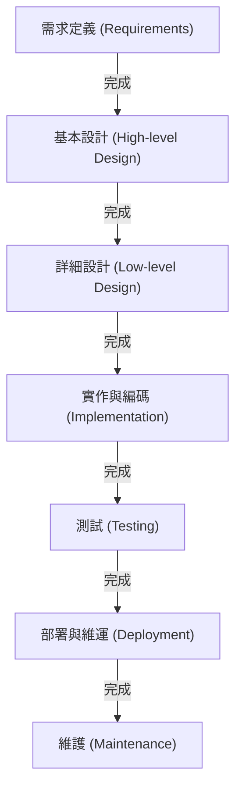

# 瀑布模型：在軟體開發中追求傳統與確定性

在軟體開發的歷史中，從最早期就存在，且至今仍在特定領域佔有穩固地位的便是「瀑布模型」。這種如同水流下瀑布般，完成一個階段後才進入下一個階段的方法，憑藉其直觀且易於理解的結構，長年以來一直作為系統開發的業界標準（De facto standard）發揮著作用。

本文將深入探討瀑布模型的起源與歷史、各個階段的詳細解說、理論背景，以及其優點與缺點。此外，我們也將與現代開發方法「敏捷開發」進行比較，並探討瀑布模型在現代如何適應與演進。

## 1. 瀑布模型的起源與歷史

人們普遍認為，「瀑布模型」這個概念首次被明確文字化，是在 1970 年由溫斯頓·W·羅伊斯（Winston W. Royce）發表的論文《管理大型軟體系統的開發（Managing the Development of Large Software Systems）》中。

然而，有趣且充滿諷刺的歷史是，羅伊斯本人在這篇論文中指出「單純由上而下的流程（即後來的瀑布模型）存在風險」，並主張階段間反饋循環（迭代）的重要性。儘管如此，由於論文中圖解的「需求→設計→實作→測試」單向流程非常容易理解，因此在省略了反饋循環的部分後，便以「瀑布模型」之名廣為流傳。

進入 1980 年代，美國國防部（DoD）制定了「DOD-STD-2167」作為軟體開發的標準規範。由於該規範實質上強制規定了瀑布型流程，因此從軍事和航太工業開始，進而擴展到民間企業的大型系統開發中，瀑布模型便作為標準方法根深蒂固。

## 2. 瀑布模型的各個階段

瀑布模型將軟體開發的生命週期分割為符合邏輯且連續的各個階段。以下是常見瀑布模型的階段結構。

### 2.1 需求定義 (Requirements Gathering and Analysis)
這是專案的起點，也是最重要的階段。透過訪談客戶及利害關係人的需求，定義系統應該實現什麼目標。不僅是功能需求（系統能做什麼），非功能需求（效能、安全性、可用性等）也會被詳細記錄。此階段的產出物是「需求定義書」，它將成為後續所有階段的基礎。

### 2.2 系統設計 (System Design)
根據需求定義書，設計整個系統的架構。通常分為「基本設計（外部設計）」和「詳細設計（內部設計）」兩個階段。
- **基本設計**：進行使用者介面、資料庫邏輯設計、系統間整合等使用者可見部分的設計。
- **詳細設計**：將基本設計細化至程式設計師可進行編碼的層級。包含類別圖、演算法、資料庫物理設計等。

### 2.3 實作與編碼 (Implementation)
遵循詳細設計書，實際撰寫原始碼的階段。若設計書製作得夠精細，程式設計師便能單純專注於程式碼撰寫與單元測試（Unit Testing）。在此階段，各個模組（組件）將會完成。

### 2.4 整合與系統測試 (Integration and Testing)
將實作完成的各個模組結合起來，驗證整個系統是否能正確運作。
- **整合測試**：將多個模組組合，確認介面之間是否存在不一致。
- **系統測試**：測試整個系統是否符合需求定義書中所規定的規格。效能測試與安全性測試也會在此階段進行。

### 2.5 部署與維運 (Deployment)
測試完成後，將符合品質標準的系統部署（展開）至正式環境。這是終端使用者開始實際使用系統的階段。

### 2.6 維護 (Maintenance)
進行系統上線後發現的錯誤（Bug）修正、應對作業系統或中介軟體的更新，以及伴隨環境變化所做的微小功能改善等。若從軟體的整個生命週期來看，通常這個維護階段所耗費的成本和時間是最大的。

## 3. 瀑布模型的理論背景

瀑布模型是將硬體製造業或建築業等傳統工程方法（系統工程）應用於軟體開發的產物。就像建造房屋時，地基工程未完成就無法立柱子一樣，軟體也建立在「設計圖（需求與設計）未完成，就無法進入製造（編碼）」的預設前提上。

此模型根基於對**「可預測性（Predictability）」**和**「可控性（Controllability）」**的強烈需求。在大型專案中，可能會有數百名工程師參與，並動用龐大的預算。對專案經理而言，能夠量化管理與控制目前的進度處於哪個階段、下一個里程碑在何時、成本是否控制在預算內，是一項至高無上的任務。

## 4. 瀑布模型的優點與優勢

### 4.1 明確的里程碑與進度管理
由於各階段的完成條件明確（例如：以「設計書獲得核准」作為設計階段完成的標準），因此能輕易掌握專案的進度狀況。這種方法與使用甘特圖進行時程管理非常契合。

### 4.2 透過文件確保品質
各階段之間的交接，基本上是透過文件（規格書、設計書）來進行。這能防止「屬人化」（即只有特定個人了解系統規格的狀態），即使開發成員中途交接，專案也較容易持續進行。

### 4.3 預算與時程的預估準確度
由於在初期階段就徹底進行需求定義與設計，因此能在專案初期相對準確地預估整個專案所需的工作量和成本。這在固定價格（承包合約）的系統開發中是非常重要的要素。

### 4.4 應對法規與合規性要求
在醫療設備的軟體、飛機的控制系統、金融機構的核心系統等需要遵循嚴格審計或法律規範的領域中，為每個流程留下詳細文件與核准紀錄的瀑布模型，往往是不可或缺的必備條件。

## 5. 瀑布模型的缺點與批評

### 5.1 應對變更的能力低落（僵化性）
瀑布模型最大的弱點在於對需求變更的應對能力非常脆弱。如果在後續階段（例如測試階段）發生需求遺漏或規格變更，就需要追溯到設計甚至需求定義階段重新來過（重工），從而產生龐大的成本並導致時間延宕。

### 5.2 客戶看到成品的時機過晚
雖然在需求定義階段已與客戶達成共識，但客戶要實際接觸到可運作的軟體，必須等到專案尾聲（測試階段或維運階段）。「紙本上的規格書」和「實際的使用體驗」之間往往存在落差，這導致在接近完成時才發現「與想像中不同」之重大認知差異的風險。

### 5.3 「大爆炸式整合（Big Bang Integration）」的風險
由於要等所有模組都完成後，才在最後一口氣結合起來進行測試，因此經常會浮現出許多問題。這會使得問題的定位變得困難，成為測試階段時程大幅延宕的主因。

## 6. 瀑布與敏捷：典範的比較

自 2000 年代以後，軟體開發的主流逐漸轉移到「敏捷開發」。兩者之間的差異，在於面對不確定性的處理方式有著決定性的不同。

| 特色 | 瀑布模型 | 敏捷開發 |
|---|---|---|
| **基本思想** | 重視按照計畫進行 | 重視應對變化 |
| **需求的確定** | 在專案初期完全固定 | 在開發進行中持續調整 |
| **開發週期** | 大規模的單次週期 | 短期間（1至4週）的迭代週期 |
| **文件** | 要求詳盡且全面的文件 | 優先產出可運作的軟體 |
| **客戶參與度** | 集中在初期（需求）與尾聲（驗收） | 在整個專案期間持續參與 |
| **適合的專案** | 規格明確不變、大規模、任務關鍵型 | 規格不確定、市場變化快、新創事業 |

瀑布模型透過「將變化降至最低」來管理風險，而敏捷開發則接受「變化是必然的」，並透過小步快跑的發布來分散風險。

## 7. 瀑布模型在現代的演進與應用

即便在敏捷開發崛起的現代，瀑布模型也並未消失。它不僅被應用於適當的領域，為了彌補其弱點，也產生了許多演進。

### 7.1 V型模型 (V-Model)
這是一種明確標示出瀑布開發階段與測試階段對應關係的模型。例如，「基本設計」對應的測試是「系統測試」，「詳細設計」對應的測試是「整合測試」。透過將 V 字形的左側（開發）與右側（測試）相對應，來提升測試的品質與可追溯性。

### 7.2 生魚片模型 (Sashimi Model)
這不是將各個階段完全串聯，而是像生魚片切片一樣，讓各個階段互相重疊的方法。例如，在所有設計都完成之前，就先從已確定的部分開始實作，藉此來縮短開發時程。

### 7.3 瀑布與敏捷的混合模式
在大型專案中，越來越多的企業採用「混合式方法（Hybrid Approach）」，即整個系統的基礎架構與需求定義嚴格遵循瀑布模型，而個別功能模組的開發則採用敏捷開發（如 Scrum）來進行迭代。

## 8. 結論：追求確定性的工程系譜

瀑布模型經常被批評為「老舊」、「過時」。然而，其根基中的「明確定義要製造的東西、制定計畫、並按部就班地執行」這項哲學，是系統工程中最基本的原則。

人類之所以能發射太空火箭、建造巨大橋樑，正是因為有這種計畫驅動型的方法。在軟體開發中，對於攸關人命的醫療系統、或是支撐社會基礎建設的金融系統等「絕對不容許失敗」的專案而言，瀑布模型所提供的「確定性」與「問責性」，在未來依然是不可筆缺的。

隨著技術的演進與商業環境的變化，開發方法的趨勢也會有所改變；但了解瀑布模型的核心價值，對所有軟體工程師來說，都是建構更好系統的穩固基石。
